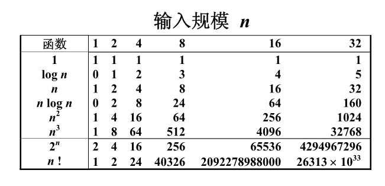
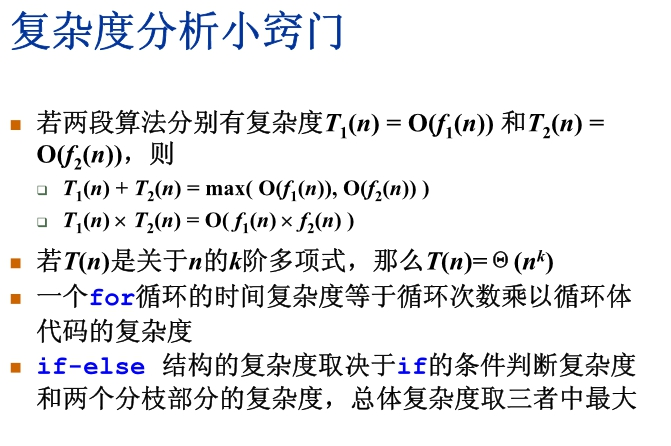
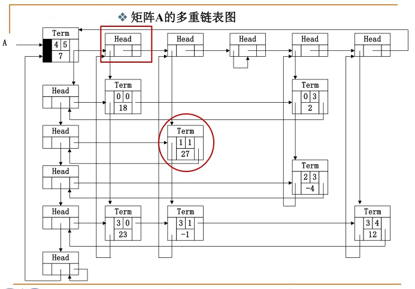
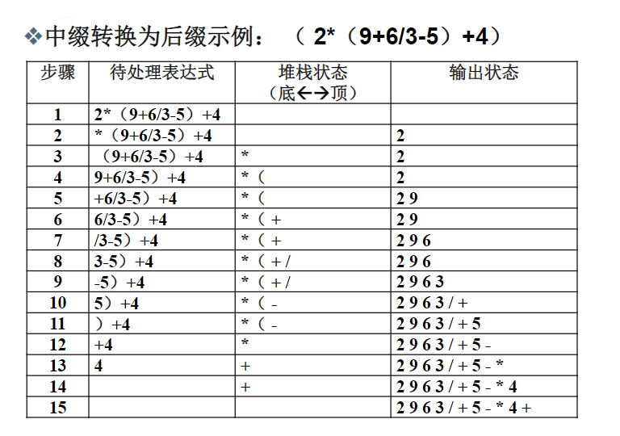
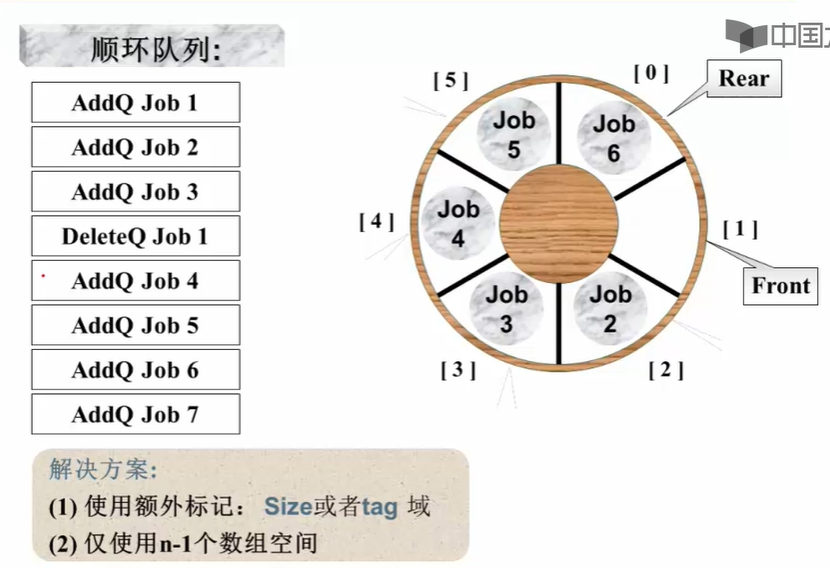
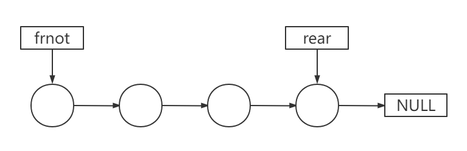

## 1. 基本概念

- 解决问题方法的效率跟==数据的组织方式==有关
- 解决问题方法的效率跟==空间的利用效率==有关
- 解决问题方法的效率跟==算法的巧妙程度==有关

### 数据结构

> 数据结构是数据对象在计算机中的组织方式

**数据对象**必定与一系列加在其上的操作相关联，完成这些操作所用的方法就是**算法**

### 抽象数据类型（Abstract Data Type）

数据类型：

- 数据对象集
- 数据集合相关联的操作集

抽象：描述数据类型的方法不依赖于具体实现

- 与存放数据的机器无关
- 与数据存储的物理结构无关

- 与实现操作的算法和编程语言均无关

### 算法

> 算法是一个有限的指令集

规定这个指令集需要满足以下要求：

- 接受一些输入（有些情况下不需要输入）
- 产生输出
- 一定在有限步骤之后终止
- 每一条指令必须
  - 有充分明确的目标，不可以有歧义
  - 在计算机能处理的范围之内
  - 描述应不依赖于任何一种计算机语言以及具体的实现手段

### 算法的复杂度

#### 空间复杂度S(n)

根据算法写成的程序在执行时==占用存储单元的长度==。这个长度往往与输入数据的规模有关。空间复杂度过高的算法可能导致使用的内存超限，造成程序非正常中断。

#### 时间复杂度T(n)

根据算法写成的程序在执行时==耗费时间的长度==。这个长度往往也与输入数据的规模相关。时间复杂度过高的低效算法可能导致我们在有生之年都等不到运行结果。

==我们在分析算法效率时的时候，实际上就是在分析函数做了多少次乘除法，加减法可以忽略不计==

### 复杂度的渐进表示法

上界：T(n) = O(f(n)) 表示存在常数C>0,n0>0，使得当n >= n0时，有T(n) <= C·f(n)

下界：T(n) = Ω(g(n)) 表示存在常数C>0,n0>0，使得当n >= n0时，有T(n) >= C·g(n)

T(n) = Θ(h(n)) 表示同时有T(n) = O(h(n))和T(n) = Ω(h(n))

==在分析算法效率时，我们一般找最小上界以及最大下界来进行分析，尽量贴近真实值==

### 复杂度分析

平均复杂度Tavg(n) >= 最坏情况复杂度Tworst(n)，==我们一般分析最坏情况复杂度==

## 分治算法

字面上的解释是“分而治之”，就是把一个复杂的问题分成两个或更多的相同或相似的子问题，再把子问题分成更小的子问题……直到最后子问题可以简单的直接求解，原问题的解即子问题的解的合并。这个技巧是很多高效算法的基础，如排序算法(快速排序，归并排序)，傅立叶变换(快速傅立叶变换)……

详解：https://www.iteye.com/blog/javablogs-2070840

## 在线处理算法

`在线`的意思是指每一输入一个数据就进行及时处理，在任何一个地方终止输入，算法都能正确给出当前的解

## 最大子列和问题(分治法、在线处理)

详解：https://blog.csdn.net/wanglinyp/article/details/113851002

## 2. 线性结构

### 什么是线性表

> 线性表是由同类型数据元素构成有序序列的线性结构

- 表中元素个数称为线性表的**长度**

- 线性表没有元素时，称为**空表**

- 表起始位置称为**表头**，结束位置称为**表尾**

**线性表的顺序存储实现**：利用数组的连续存储空间顺序存放线性表的各元素

**线性表的链式存储实现**：不要求逻辑上相邻的两个元素物理上也相邻；通过“链”建立起数据元素之间的逻辑关系。插入、删除不需要移动数据元素，只需要修改“链”。

### 广义表

> 广义表是线性表的推广。对于线性表而言，n个元素都是基本的单元素。广义表中，这些元素不仅可以是单元素也可以是另一个广义表。

### 多重链表

> 链表中的节点可能同时隶属于多个链表

- 多重链表中结点的指针域会有多个，如前面例子包含了Next和
  SubList两个指针域；

- 但包含两个指针域的链表并不一定是多重链表，这两个指针域可能是同一个链表，比如在双向链表不是多重链表。

**一个典型的多重链表**：十字链表来存储稀疏矩阵

- 只存储非零元素，结点的数据域：行坐标Row、列坐标Col、数值Value

- 每个结点通过两个指针域，把同行、同列串起来：行指针Right、列指针Down

### 堆栈

#### 引子

我们在日常生活中的运算，一般使用中缀表达式，计算机的运算一般使用后缀表达式

- 中缀表达式：运算符号位于两个运算数之间，如`a+b*c-d/e `

- 后缀表达式：运算符号位于两个运算数之后`abc*+de/`

**后缀表达式求值策略**：从左向右扫描表达式，逐个处理运算数和运算符号，当碰到运算数的时候，将它简单记住，当碰到运算符号的时候，将此符号前的两个运算数拿来做计算。

==后缀表达式的求值策略，就是需要某种存储方法，能顺序存储运算数，并在需要时“倒序”输出！这种后入先出的数据结构就是堆栈==

#### 定义

> 堆栈是具有一定操作约束的线性表，只在一端做插入、删除

插入元素：入栈（Push）

删除数据：出栈（Pop）

后入先出：Last In First Out（LIFO）

#### 中缀表达式如何转换为后缀表达式

从头到尾读取中缀表达式的每个对象，对不同对象按不同的情况处理

1. 运算数：直接输出
2. 左括号：压入堆栈
3. 右括号：将栈顶的运算符弹出并输出，直到遇到左括号，括号不输出，括号只出栈
4. 若各个对象处理完毕，则把堆栈中存留的运算符一并输出

 ### 队列

#### 定义

> 具有一定操作约束的线性表，只能在一端插入，而在另一端删除

数据插入：入队列（AddQ）

数据删除：出队列（DeleteQ）

先进先出：First in first out（FIFO）

#### 队列的顺序存储实现

队列的顺序存储结构通常由一个**一维数组**和一个记录队列头元素位置的变量**frnot**以及一个记录队列尾元素位置的变量**rear**组成

因为队列是从头部插入，尾部删除的，为了节省内存空间，在数组头部插满之后，我们继续从尾部插入，直至数组空间被完全利用位置，如下图所示

​                                               

#### 队列的链式存储实现

队列的链式存储结构也可以用一个**单链表**实现。插入和删除操作分别在链表的两头进行。

因为**frnot**记录队列，

