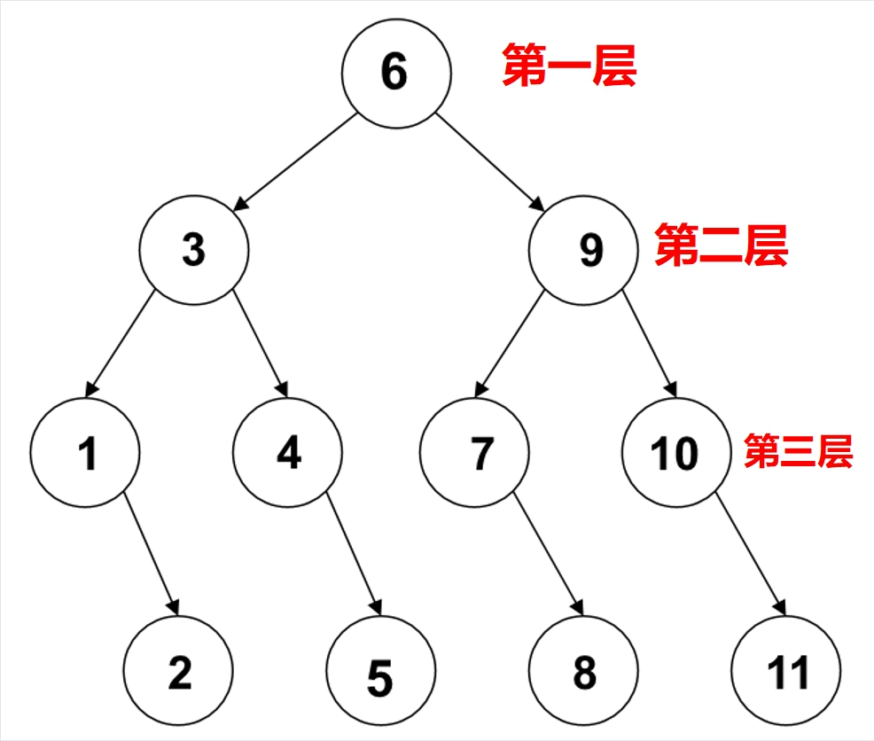
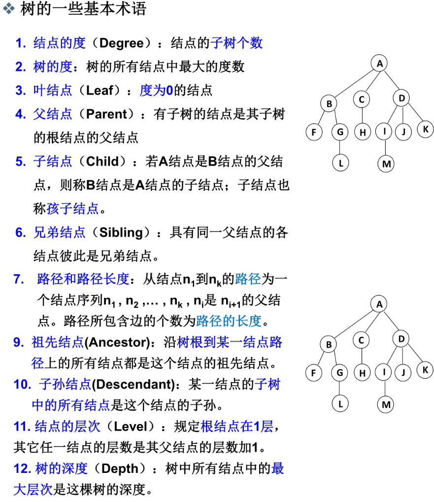
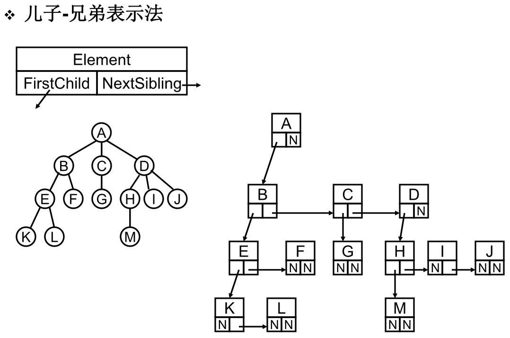
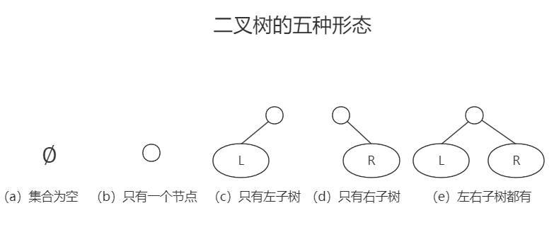
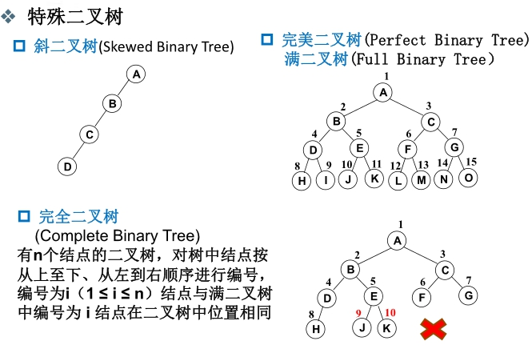
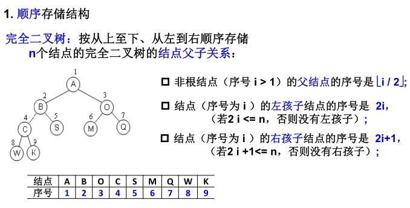
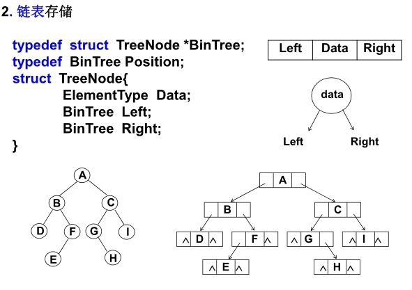
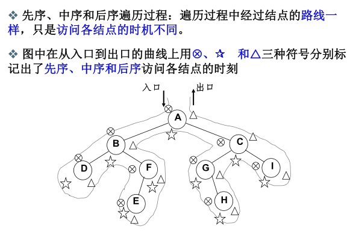
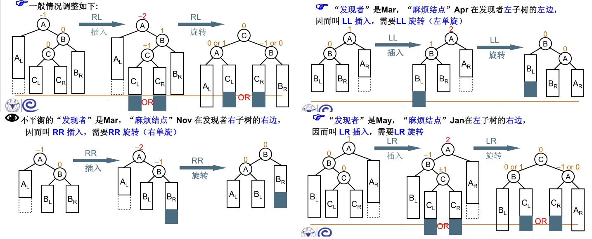

## 1. 基本概念

- 解决问题方法的效率跟==数据的组织方式==有关
- 解决问题方法的效率跟==空间的利用效率==有关
- 解决问题方法的效率跟==算法的巧妙程度==有关

### 数据结构

> 数据结构是数据对象在计算机中的组织方式

数据结构是一门研究非数值计算的程序设计问题中的操作对象，以及它们之间的关系和操作等相关问题的学科

**数据对象**必定与一系列加在其上的操作相关联，完成这些操作所用的方法就是**算法**

### 抽象数据类型（Abstract Data Type）

数据类型：

- 数据对象集
- 数据集合相关联的操作集

抽象：描述数据类型的方法不依赖于具体实现

- 与存放数据的机器无关
- 与数据存储的物理结构无关

- 与实现操作的算法和编程语言均无关

### 算法

> 算法是一个有限的指令集

规定这个指令集需要满足以下要求：

- 接受一些输入（有些情况下不需要输入）
- 产生输出
- 一定在有限步骤之后终止
- 每一条指令必须
  - 有充分明确的目标，不可以有歧义
  - 在计算机能处理的范围之内
  - 描述应不依赖于任何一种计算机语言以及具体的实现手段

### 算法的复杂度

#### 空间复杂度S(n)

根据算法写成的程序在执行时==占用存储单元的长度==。这个长度往往与输入数据的规模有关。空间复杂度过高的算法可能导致使用的内存超限，造成程序非正常中断。

#### 时间复杂度T(n)

根据算法写成的程序在执行时==耗费时间的长度==。这个长度往往也与输入数据的规模相关。时间复杂度过高的低效算法可能导致我们在有生之年都等不到运行结果。

==我们在分析算法效率时的时候，实际上就是在分析函数做了多少次乘除法，加减法可以忽略不计==


### 复杂度的渐进表示法

上界：T(n) = O(f(n)) 表示存在常数C>0,n<sub>0</sub>>0，使得当n >= n<sub>0</sub>时，有T(n) <= C·f(n)

下界：T(n) = Ω(g(n)) 表示存在常数C>0,n<sub>0</sub>>0，使得当n >= n<sub>0</sub>时，有T(n) >= C·g(n)

T(n) = Θ(h(n)) 表示同时有T(n) = O(h(n))和T(n) = Ω(h(n))

==在分析算法效率时，我们一般找最小上界以及最大下界来进行分析，尽量贴近真实值==

### 复杂度分析

平均复杂度T<sub>avg</sub>(n) >= 最坏情况复杂度T<sub>worst</sub>(n)

==我们一般分析最坏情况复杂度==


## 分治算法

字面上的解释是“分而治之”，就是把一个复杂的问题分成两个或更多的相同或相似的子问题，再把子问题分成更小的子问题……直到最后子问题可以简单的直接求解，原问题的解即子问题的解的合并。这个技巧是很多高效算法的基础，如排序算法(快速排序，归并排序)，傅立叶变换(快速傅立叶变换)……

详解：https://www.iteye.com/blog/javablogs-2070840

## 在线处理算法

`在线`的意思是指每一输入一个数据就进行及时处理，在任何一个地方终止输入，算法都能正确给出当前的解

## 最大子列和问题(分治法、在线处理)

详解：https://blog.csdn.net/wanglinyp/article/details/113851002

## 2. 线性结构

### 什么是线性表

> 线性表是由同类型数据元素构成有序序列的线性结构

- 表中元素个数称为线性表的**长度**

- 线性表没有元素时，称为**空表**

- 表起始位置称为**表头**，结束位置称为**表尾**

**线性表的顺序存储实现**：利用数组的连续存储空间顺序存放线性表的各元素

**线性表的链式存储实现**：不要求逻辑上相邻的两个元素在物理上也相邻；通过“链”建立起数据元素之间的逻辑关系。插入、删除不需要移动数据元素，只需要修改“链”。

### 广义表

> 广义表是线性表的推广。对于线性表而言，n个元素都是基本的单元素。广义表中，这些元素不仅可以是单元素也可以是另一个广义表。

### 多重链表

> 链表中的节点可能同时隶属于多个链表

- 多重链表中结点的指针域会有多个，如前面例子包含了Next和SubList两个指针域；
  
- 但包含两个指针域的链表并不一定是多重链表，这两个指针域可能是在同一个链表，比如双向链表不是多重链表。

**一个典型的多重链表**：十字链表来存储稀疏矩阵

- 只存储非零元素，结点的数据域：行坐标Row、列坐标Col、数值Value

- 每个结点通过两个指针域，把同行、同列串起来：行指针Right、列指针Down


### 堆栈

#### 引子

我们在日常生活中的运算，一般使用**中缀表达式**，计算机的运算一般使用**后缀表达式**

- 中缀表达式：运算符号位于两个运算数之间，如`a+b*c-d/e `

- 后缀表达式：运算符号位于两个运算数之后`abc*+de/-`

**后缀表达式求值策略**：从左向右扫描表达式，逐个处理运算数和运算符号，当碰到运算数的时候，将它简单记住，当碰到运算符号的时候，将此符号前的两个运算数拿来做计算。

==后缀表达式的求值策略，就是需要某种存储方法，能顺序存储运算数，并在需要时“倒序”输出！这种后入先出的数据结构就是堆栈==

#### 定义

> 堆栈是具有一定操作约束的线性表，只在一端做插入、删除

插入元素：入栈（Push）

删除数据：出栈（Pop）

后入先出：Last In First Out（LIFO）

#### 中缀表达式如何转换为后缀表达式

从头到尾读取中缀表达式的每个对象，对不同对象按不同的情况处理

1. 运算数：直接输出
2. 左括号：压入堆栈
3. 右括号：将栈顶的运算符弹出并输出，直到遇到左括号，括号不输出，括号只出栈
4. 若各个对象处理完毕，则把堆栈中存留的运算符一并输出


 ### 队列

#### 定义

> 具有一定操作约束的线性表，只能在一端插入，而在另一端删除

数据插入：入队列（AddQ）

数据删除：出队列（DeleteQ）

先进先出：First in first out（FIFO）

#### 队列的顺序存储实现

队列的顺序存储结构通常由一个**一维数组**和一个记录队列头元素位置的变量**front**（也称队头指针）以及一个记录队列尾元素位置的变量**rear**（也称队尾指针）组成

因为队列是从头部插入，尾部删除的，为了节省内存空间，在数组头部插满之后，我们继续从尾部插入，直至数组空间被完全利用位置，如下图所示

​                                               

#### 队列的链式存储实现

队列的链式存储结构也可以用一个**单链表**实现。插入和删除操作分别在链表的两头进行。

为了操作上的方便，我们将==队头指针指向链队列的头结点，而队尾指针指向终端结点==。链队列示意图：


**当队列为空时，front和rear都指向头结点。**

## 3. 树

#### 查找

> 根据某个给定关键字K，从集合R中找出关键字与K相同的记录

静态查找：集合中的记录是固定的。没有插入和删除操作，只有查找

动态查找：集合中记录是动态变化的。除了查找，还可能发生插入和删除

#### 静态查找

##### 顺序查找

> 所谓顺序查找，指的是从待查找序列中的第一个元素开始，查看各个元素是否为要找的目标元素。

==顺序查找的时间复杂度为O(n)==

传统查找需要两个函数，一个循环一个if判断

含有哨兵的顺序查找，优势在于一个while函数就可以完成判断和循环两个操作

C语言中使用了哨兵，来提高了代码的效率，具体如下

```c
//普通查找代码
int Search_1(int *a,int n,int key)
{
    int i;
    for(int i=0; i<n; i++)
    {
        if(a[i]==key)
            return i;
    }
    return 0;//查找失败
}

//带哨兵查找代码
int Search_2(int *a,int n,int key)
{
    int i=0;
    a[0]=key;//哨兵
    i=n;
    while(a[i]!=key)
    {
        i--;
    }
    return i;//返回0就是查找失败
}
```

##### 二分查找

> 二分查找（Binary Search）也叫作折半查找。二分查找有两个要求，一个是数列有序（一般为升序排列），另一个是数列使用顺序存储结构（比如数组）

==二分查找算法的时间复杂度为O(logN)==

```java
public class BinarySearch {
    private int[] array;
    /**
     * 初始化数组
     * @param array
     */
    public BinarySearch(int[] array) {
        this.array = array;
    }
    /**
     * 二分查找
     * @param target
     * @return
     */
    public int search(int target) {
        if (array == null) {
            return -1;
        }
        int start = 0; //左边界
        int end = array.length - 1; //右边界
        while (start <= end) {
            int mid = start + (end - start) / 2;
            if (array[mid] == target) {
                return mid;
            } else if (target < array[mid]) {
                end = mid - 1;
            } else {
                start = mid + 1;
            }
        }
        return -1;
    }
}
```

### 二分查找判定树



- 判定树上每个节点需要查找的次数刚好为该节点所在的层数
- 查找成功时查找次数不会超过判定树的深度
- n个节点的判定树的深度为（log2N+1）

ASL：查找成功时的平均查找长度

ASL=(每一层数*每一层节点数)的总和除以节点总数

`ASL = （4*4 + 4*3 + 2*2 + 1）/ 11`

### 定义

> n(n>=0)个结点构成的有限集合

当n=0时，称为**空树**；

对于任何一棵**非空树**(n>0)，它具备以下性质

- 树中有一个称为`根（Root）`的特殊结点，用`r`表示
- 其余结点可分为m(m>0)个互不相交的有限集T1,T2,...,Tm,其中每个结合本身又是一棵树，称为原来树的`子树（SubTree）`

- 子树是不相交的
- 除了根节点外，**每个结点有且仅有一个父节点**
- **一棵N个节点的树有N-1条边**

### 树的一些基本术语



### 儿子-兄弟表示法

> 使用结构体来构成树的结点结构，每一个结点都由Element、FirstChild、NextSibling三部分构成

- Element存储数据
- FirstChild是一个指针，指向第一个子结点
- NextSibling是一个指针，指向最近的一个兄弟结点



将此数向右旋转45°，可以得到二叉树的雏形，如下图所示，由Element、Left、Right三部分构成


### 二叉树

> 一个有穷的节点集合。这个集合可以为空，若不为空，则它是由根节点和称为其左子树和右子树的两个不相交的二叉树组成

#### 二叉树的五种形态



#### 特殊的二叉树

**满二叉树：**一个二叉树，如果每一个层的结点数都达到最大值，则这个二叉树就是满二叉树。也就是说，如果一个二叉树的层数为 K，且结点总数是2<sup>k</sup>-1，它就是满二叉树。

**完全二叉树：**除最后一层外，若其余层都是满的，并且最后一层或者是满的，或者是在右边缺少连续若干节点，则这个二叉树就是完全二叉树 。

一棵树从根结点开始扩展，扩展完左子节点才能开始扩展右子节点，每扩展完一层，才能继续扩展下一层。

**斜二叉树：**二叉树只在左侧或者右侧存在节点，整个树是倾斜的，也就是斜树，也可以看做链表，这种树一般不使用。



#### 二叉树的几个重要性质

- 一个二叉树第i层的最大 节点数为：**2<sup>i-1</sup> (i ≥ 1)**
- 深度为k的二叉树有最大结点总数为：**2<sup>k</sup>-1 (i ≥ 1)**
- 对任何非空二叉树T，若n<sub>0</sub>表示叶结点个数、n<sub>2</sub>是度为2的非叶结点个数，那么两者满足关系**n<sub>0</sub> = n<sub>2</sub> + 1**

#### 二叉树的存储结构

##### 顺序存储

满二叉树使用数组来顺序存储是十分合适的，结点之间的对应关系也能清楚表达

一般二叉树，也可以使用顺序存储，将不存在的结点使用特殊值进行占位填充即可，使用数组顺序存储一般二叉树会造成内存浪费



##### 链式存储

使用链表来存储二叉树更加直观，也是我们一般所采用的方式，链表中的每一个节点都有左右两个指针，分别指向二叉树的两个子结点，不存在的结点，我们通常使用NULL填充



#### 二叉树的遍历

##### 先序遍历

> 先输出根结点，再遍历左子树，最后遍历右子树，遍历左子树和右子树的时候，同样遵循先序遍历的规则

- 递归完成先序遍历

```c
void PreOrderTraversal(BinTree BT){
    if(BT){
        printf("%d",BT->Data);
        PreOrderTraversal(BT->Left);
        PreOrderTraversal(BT->Right);
    }
}
```

- 非递归，使用堆栈完成先序遍历

> 由于我们分析到，先序、中序、后序遍历，所走的路径都是相同的，只是输出的时机不同，先序遍历是在第一次碰到结点就进行输出，所以根据中序遍历的代码，我们可以很容易得到先序遍历的代码

```c
void InOrderTraversal(BinTree BT){
    BinTree T = BT;
    //创建并初始化堆栈
    Stack S = CreatStack(MaxSize);
    while(T || !IsEmpty(S)){
        //一直向左并将沿途结点压入堆栈
        while(T){
            Push(S,T);
            //打印结点
            printf("%5d",T->Data);
            T = T->Left; 
        }
        if(!IsEmpty(S)){
            //结点弹出堆栈
            T = Pop(S);
            //转向右子树
            T = T->Right;
        }
    }
}
```

##### 中序遍历

> 先遍历左子树，再输出根结点，最后遍历右子树，遍历左子树和右子树的时候，同样遵循中序遍历的规则

- 递归完成中序遍历

```c
void InOrderTraversal(BinTree BT){
    if(BT){
        InOrderTraversal(BT->Left);
        printf("%d",BT->Data);
        InOrderTraversal(BT->Right);
    }
}
```

- 非递归，使用堆栈完成中序遍历
  1. 遇到一个结点，将它压栈，并遍历它的左子树；
  2. 当左子树遍历结束后，从栈顶弹出这个结点并访问；
  3. 然后按其右指针再去中序遍历该结点的右子树

```c
void InOrderTraversal(BinTree BT){
    BinTree T = BT;
    //创建并初始化堆栈
    Stack S = CreatStack(MaxSize);
    while(T || !IsEmpty(S)){
        //一直向左并将沿途结点压入堆栈
        while(T){
            Push(S,T);
            T = T->Left; 
        }
        if(!IsEmpty(S)){
            //结点弹出堆栈
            T = Pop(S);
            //打印结点
            printf("%5d",T->Data);
            //转向右子树
            T = T->Right;
        }
    }
}
```

##### 后序遍历

> 先递归后序遍历左子树，再递归后序遍历右子树，最后输出根结点的值

```c
void PostOrderTraversal(BinTree BT){
    if(BT){
        PostOrderTraversal(BT->Left);
        PostOrderTraversal(BT->Right);
        printf("%d",BT->Data);
    }
}
```



##### 层序遍历

> 按二叉树从上到下，从左到右依次打印每个节点中存储的数据

- 使用队列实现：从上到下，从左到右依次将每个数放入队列中，按照顺序依次打印即可

```c
void LevelOrderTraversal(BinTree BT){
    Queue Q;
    BinTree T;
    //判断，如果是空树直接返回
    if(!BT){
        return;
    }
    //创建并初始化队列Q
    Q = CreateQueue(MaxSize);
 	AddQ(Q,BT);
    while(!IsEmptyQ(Q)){
        T = Delete(Q);
        printf("%d\n",T->Data);
        //访问取出队列的结点
        if(T->Left){
            AddQ(Q,T->Left);
        }
        if(T->Right){
            AddQ(Q,T->Right);
        }
    }
}
```

##### 实际应用

> 输出二叉树的叶结点

```c
void PreOrderPrintLeaves( BinTree BT )
{
    if( BT ) {
        //检查左右子树是否为空，以此判断是否为叶结点
        if ( !BT->Left && !BT->Right ){
            printf(“%d”, BT->Data );
        }
        PreOrderPrintLeaves ( BT->Left );
        PreOrderPrintLeaves ( BT->Right );
    }
}
```

> 求二叉树的高度

```c
int PostOrderGetHeight( BinTree BT )
{ 
    int HL, HR, MaxH;
    if( BT ) {
        //求左子树的深度
        HL = PostOrderGetHeight(BT->Left);
        //求右子树的深度
        HR = PostOrderGetHeight(BT->Right);
        //取左右子树较大的深度
        MaxH = （HL > HR）? HL : HR;
        //返回树的深度
        return ( MaxH + 1 );
    }else{
        //空树深度为0
		return 0;
    }
}
```

#### 二叉搜索树

> 二叉搜索树又称为二叉排序树、二叉查找树，它或者是一棵空树，或者是具有以下性质的二叉树

- 若它的左子树不为空，则左子树上所有结点的值都小于根结点的值。
- 若它的右子树不为空，则右子树上所有结点的值都大于根结点的值。
- 它的左右子树也分别是二叉搜索树。

##### 二叉搜索树的查找

选择循环查找而不使用递归，是为了提高效率

```c
Position IterFind(ElementType X,BinTree BTS)
{
    while(BST){
        if(X > BST->Data){
            //去右子树继续查找
            BST = BST->Right;
        }else if(X < BST->Data){
            //去左子树继续查找
            BST = BST->Left;
        }else{
            //查找成功，返回
            return BST;
        }
    }
    //查找失败
    return NULL;
}
```

##### 二叉搜索树的插入

```c
BinTree Insert(ElementType X,BinTree BST)
{
    if(!BST){
        //原树为空，生成一个结点的二叉搜索树
        BST = malloc(sizeof(struct TreeNode));
        BST->Data = X;
        BST->Left = BST->Right = NULL;
    }else{
        //判断插入操作是在左子树还是右子树执行，递归调用
        if(X < BST->Data){
            BST->Left = Insert(X,BST->Left);
        }else if(X > BST->Data){
            BST->Right = Insert(X,BST->Right);
        }
        //如果两个判定条件都不满足，说明此元素已存在，不做操作
    }
}
```

##### 二叉搜索树的删除

1. 要删除的是叶结点：直接删除，再修改其父结点指针值为NULL
2. 要删除的结点只有一个子结点：将其父结点的指针指向要删除结点的子结点
3. 要删除的结点存在左右子树：用另一结点替代被删除结点
   - 使用左子树中的最大元素替代
   - 使用右子树中的最小元素替代

```c
BinTree Delete(ElementType X,BinTree BST)
{
    Position Tmp;
    if(!BST){
        printf("需要删除的元素不存在");
    }else if(X < BST->Data){
        //左递归查找
        BST->Left = Delete(X,BST->Left);
    }else if(X > BST->Data){
        //左递归查找
        BST->Right = Delete(X,BST->Right);
    }else{
        //找到被删除元素，进行处理
        if(BST->Left && BST->Right){
            //被删除元素存在左右子树
            //使用右子树中的最小值来填充需要删除的结点
            Tmp = FindMin(BST->Right);
            BST->Data = Tmp->Data;
            //删除右子树中的最小值
            BST->Right = Delete(BST->Data,BST->Right);
        }else{
            //被删除结点有一个子结点或无子结点
            Tmp = BST;
            if(!BST->Left){
                //有右子或无子
                BST = BST->Right;
            }else if(!BST->Right){
                 //有左子或无子
                BST = BST->Left;
            }
            free(Tmp);
        }
    }
    return BST;
}
```

#### 平衡二叉树的定义

> 平衡二叉树也称AVL树，得名于其发明者的名字。

- 左右子树的高度差小于等于 1
- 其每一个子树均为平衡二叉树

**平衡因子(BF)**： 某个结点的左子树的高度减去右子树的高度得到的差值。

我们使用平衡因子来作为平衡二叉树的衡量指标，`|BF|≤ 1`则为平衡二叉树

#### 平衡二叉树的调整

如果新的节点插入导致二叉树变得不平衡了，那么就需要进行调整，针对不同的插入情况，一共有四种调整方式如下图所示


