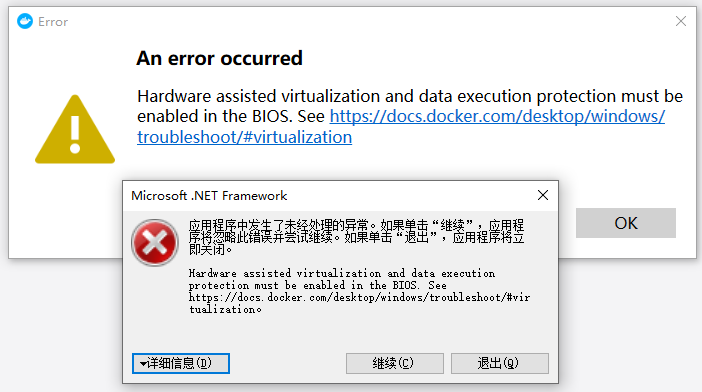
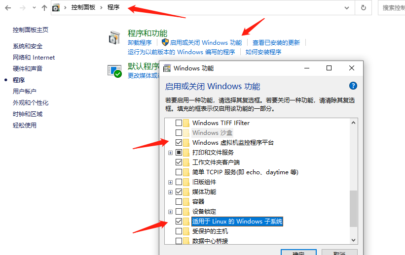
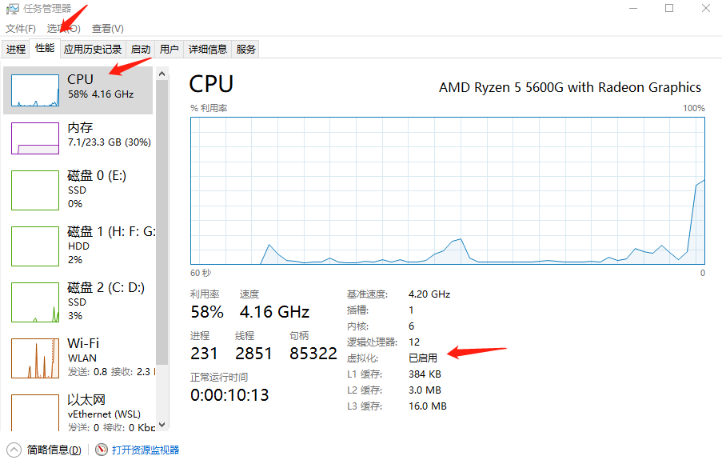
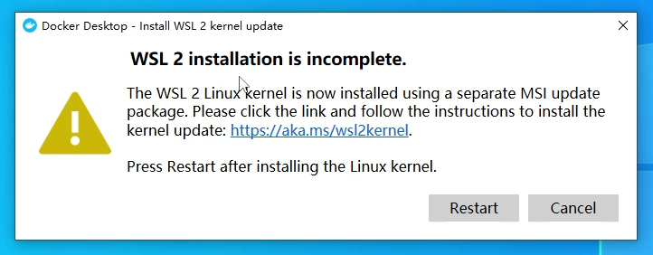
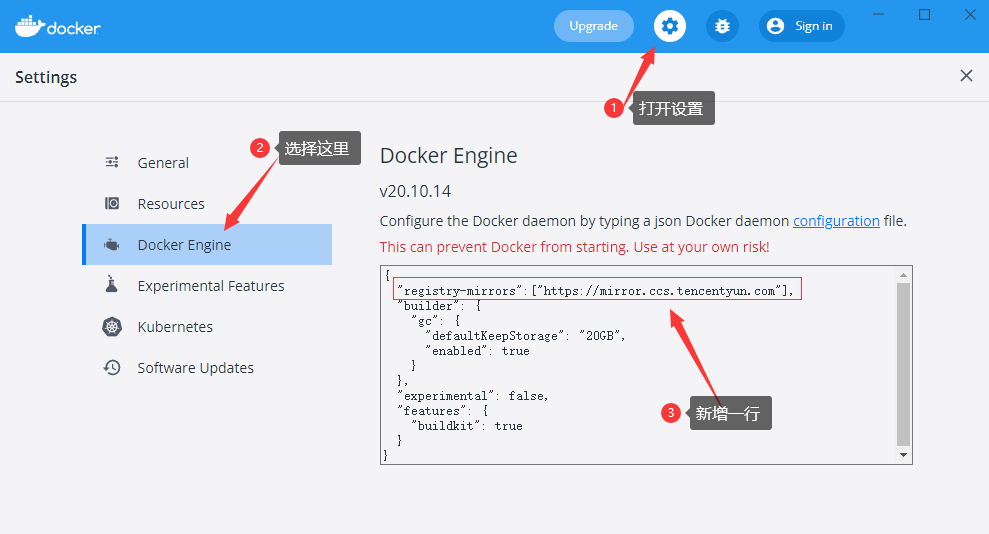

## Docker是什么

> Docker 是一个应用**打包**、**分发**、**部署**的工具

你也可以把它理解为一个轻量的虚拟机，它只虚拟你软件需要的运行环境，多余的一点都不要，
而普通虚拟机则是一个完整而庞大的系统，包含各种不管你要不要的软件。

#### 跟普通虚拟机的对比

|  特性  |                          普通虚拟机                          |                        Docker                        |
| :----: | :----------------------------------------------------------: | :--------------------------------------------------: |
| 跨平台 | 通常只能在桌面级系统运行，例如 Windows/Mac，无法在不带图形界面的服务器上运行 |    支持的系统非常多，各类 windows 和 Linux 都支持    |
|  性能  |   性能损耗大，内存占用高，因为是把整个完整系统都虚拟出来了   | 性能好，只虚拟软件所需运行环境，最大化减少没用的配置 |
| 自动化 |                     需要手动安装所有东西                     |           一个命令就可以自动部署好所需环境           |
| 稳定性 |                  稳定性不高，不同系统差异大                  |           稳定性好，不同系统都一样部署方式           |

## Docker 部署的优势

**常规应用开发部署方式**：自己在 Windows 上开发、测试 --> 到 Linux 服务器配置运行环境部署。

**用 Docker 开发部署流程**：自己在 Windows 上开发、测试 --> 打包为 Docker 镜像（可以理解为软件安装包） --> 各种服务器上只需要一个命令部署好

==确保了不同机器上跑都是一致的运行环境，不会出现我机器上跑正常，你机器跑就有问题的情况==

## 基本概念

**打包**：就是把你软件运行所需的依赖、第三方库、软件打包到一起，变成一个安装包
**分发**：你可以把你打包好的“安装包”上传到一个镜像仓库，其他人可以非常方便的获取和安装
**部署**：拿着“安装包”就可以一个命令运行起来你的应用，自动模拟出一摸一样的运行环境，不管是在 Windows/Mac/Linux。

**镜像**：可以理解为软件安装包，可以方便的进行传播和安装。
**容器**：软件安装后的状态，每个软件运行环境都是独立的、隔离的，称之为容器。

## Docker安装及常见问题解决

### 安装

桌面版：https://www.docker.com/products/docker-desktop
服务器版：https://docs.docker.com/engine/install/#server

### 启动报错解决

#### 报错1



控制面板->程序->启用或关闭 windows 功能，开启 Windows 虚拟化和 Linux 子系统（WSL2)



1. 命令行安装 Linux 子系统（这步可能不需要，因为 docker 安装时有说自动安装 wsl）

速度过慢可以在微软商店里搜索Ubuntu进行安装

```shell
wsl --install -d Ubuntu
```

2. 设置开机启动 Hypervisor

```shell
bcdedit /set hypervisorlaunchtype auto
```

3. 确保 BIOS 已开启虚拟化，下图检查是否已开启好



#### 报错2



在下面链接升级WSL2

https://wslstorestorage.blob.core.windows.net/wslblob/wsl_update_x64.msi

输入如下命令

```shell
netsh winsock reset
```

### 配置镜像加速源



|     镜像加速器      |             镜像加速器地址              |
| :-----------------: | :-------------------------------------: |
| Docker 中国官方镜像 |     https://registry.docker-cn.com      |
|   DaoCloud 镜像站   |      http://f1361db2.m.daocloud.io      |
|   Azure 中国镜像    |       https://dockerhub.azk8s.cn        |
|     科大镜像站      |   https://docker.mirrors.ustc.edu.cn    |
|       阿里云        | https://<your_code>.mirror.aliyuncs.com |
|       七牛云        |      https://reg-mirror.qiniu.com       |
|       网易云        |      https://hub-mirror.c.163.com       |
|       腾讯云        |    https://mirror.ccs.tencentyun.com    |

## Docker安装软件

我们可以在下面这个网站搜索到一些镜像来进行安装

https://hub.docker.com/

### Docker安装命令文档说明

https://docs.docker.com/engine/reference/commandline/run/

### Docker安装Redis镜像

```Java
//参数说明
//-d 在后台运行容器并打印容器id
//-p 将容器端口映射到宿主机 宿主机端口:容器端口
//-name 给容器命名
//--restart 设置重启策略，默认为no，表示容器退出时不自动重启
//-V 绑定挂载卷
//redis:latest 指定镜像版本，latest为最新版
docker run -d -p 6379:6379 --name redis redis:latest
```
