## Java就业路线

### 阶段一

JavaSE：环境搭建、基础语法、面向对象、数组、集合、常用API、IO流、反射与注解、多线程、网络编程

MySQL：SQL语句

前端：HTML+JS+CSS、BootStrap、JQuery

项目管理：Maven、Git

### 阶段二（学完可就业）

后端：XML、MVC架构模式、Servlet、Filter、JSP、EL、JSTL、AJAX、代理模式、工厂模式、数据库连接池

框架：SSM、SSH、SpringBoot

### 阶段三

SpringCloud、Redis、MQ、Vue

设计模式、JVM优化、算法

Dubbo、ZooKeeper、Docker

## IDEA快捷键

生成方法

```
Alt+Ins
```
创建异常代码块

```
Ctrl+Alt+t
```
抛出异常、导入包

```
Alt+回车
```
复制当前行到下一行
```
Ctrl+D
```
快速生成for循环

```
100.for
```

查看继承关系

```
Crtl+H
```

## 常用DOS命令

进入磁盘
```
// 盘符+冒号
D:
```
查看当前目录下的所有文件
```
dir
```
切换文件夹
```
// 进入当前目录下的某个文件夹内
cd 文件夹名

// 返回上级文件夹
cd ..

// 进入某一个盘下的某一个文件夹
cd /d f:\demo
```
清空终端消息
```
cls
```
查看ip
```
ipconfig
```
打开常用软件
```
calc 计算器
mspaint 画图
notepad 记事本
```
文件操作
```
md 目录名 (创建目录)
rd 目录名 (删除目录)
del 文件名 (删除文件)
```
生成java文档
```
javadoc -encoding UTF-8 -charset UTF-8 java文件名
```

## 环境变量配置
JAVA_HOME  `jdk根目录`
path  `%JAVA_HOME%\jre\bin` 、`%JAVA_HOME%\bin`

## JDK、JRE、JVM

JDK：Java开发工具包

JRE：Java运行环境，包含一些函数、库之类的

JVM：Java虚拟机，负责编译

包含关系
JDK>JRE>JVM

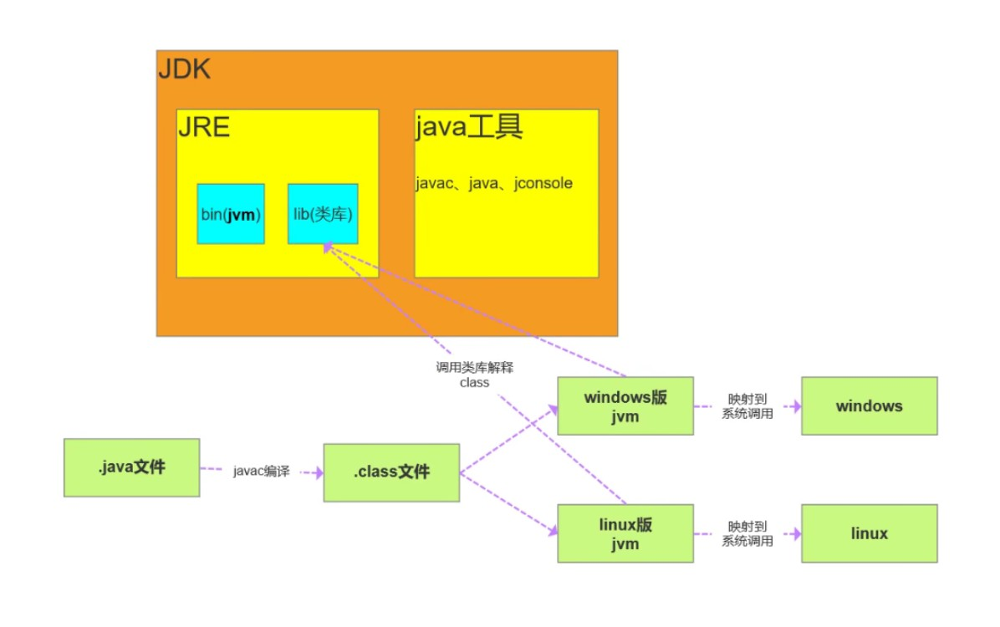

## JDK目录结构

bin：一些可执行文件，编译器javac.exe也在里面

include：JDK由C和C++编写，这个目录里面存放一些头文件

jre：java运行时环境

lib：java的一些库文件

## Hello World

```java
public class Demo{
    public static void main(String[] args) {
        System.out.println("Hello World!");
    }
}
```

## 注释

单行注释

```JAVA
//
```
多行注释

```java
/*

*/
```

文档注释

```java
/**
* @author 作者名
* @version 版本号
* @since 指明jdk版本
* @param 参数名
* @return 返回值情况
* @throws 异常抛出情况
*/
```
## 标识符

Java中所有的组成部分都需要有名字。类名、变量名以及方法名都被称为标识符

标识符：由数字、字母、下划线、美元符号组成，不能以数字开头

关键字：由Java事先定义好的有特别意义的标识符，我们不可以用来命名

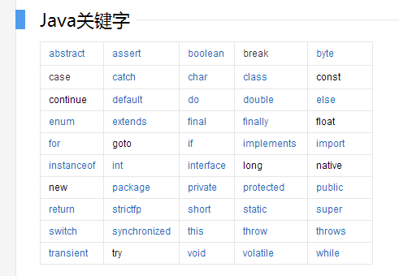

## 变量命名规范

所有变量、方法、类名：见名知意

包名：所有字母小写

类名、接口名：首字母大写、驼峰命名

变量名、方法名、类成员变量：首字母小写、驼峰命名

常量名：所有字母大写、多单词用下划线连接

## 什么是字节
位(bit)：是计算机内部数据储存的最小单位，11001100是一个八位二进制数

字节(byte)：是计算机中数据处理的基本单位，习惯上用B来表示

- 1B = 8bit
- 1024B = 1KB
- 1024KB = 1M
- 1024M = 1G

字符：是指计算机中使用的字母、数字、字和符号

## 进制
二进制：0b

十进制

八进制：0

十六进制：0x

## 数据类型
Java是一种强类型语言，强类型语言：先定义后使用，数据类型严格

Java中有8种基本数据类型，除此之外都是引用数据类型

凡是引用数据类型，都可以使用null作为值

| 基本类 | 包装类 |  字节 | 默认初始值 |
| :----: | :---: | :---: | :---: |
| int    | Intger |   4   |   0   |
| float  | Float  |   4   |   0.0   |
| double | Double |   8   |   0.0   |
| boolean| Boolean|   1   |   false   |
| char | Character|   2   |   \u0000   |
|       |  String |       | null |
| byte  |  Byte   |   1   |   0   |
| short |  Short  |   2   |   0   |
| long  |  Long   |   8   |   0   |

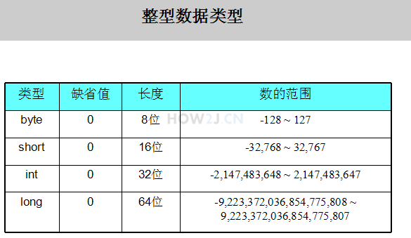

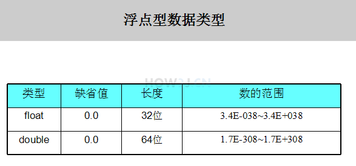

## 装箱与拆箱

装箱 ：将基本类型转换为引用类型

拆箱：将引用类型转换为基本类型

- JDK1.5以前，手动装箱与拆箱

```java
int num1 = 18;
//使用构造器装箱
Integer integer1 = new Integer(num1);
//调用方法装箱
Integer integer2 = Integer.valueOf(num1);
//调用方法拆箱
int num2 = integer1.intValue();
```

- JDK1.5之后，提供自动装箱与拆箱

```java
int num = 80;
Integer integer = num;
int num2 = integer;
```

## Integer缓冲区

Integer对象有一个默认的缓冲区，范围-128-127，创建的对象在这个范围之内的话就会直接使用缓冲区的对象

100在范围内，所以integer1和integer2都是指向了缓冲区的同一个对象，所以比较结果为true

200不在范围内，所以integer3和integer4是分别创建的新对象，所以比较结果为false

```java
Integer integer1 = Integer.valueOf(100);
Integer integer2 = Integer.valueOf(100);
System.out.println(integer1 == integer2);	//true

Integer integer3 = Integer.valueOf(200);
Integer integer4 = Integer.valueOf(200);
System.out.println(integer3 == integer4);	//false
```

## 关于浮点数

浮点数是有限的、离散的、存在舍入误差、只能表示大概，银行业务要求精确，所以不能使用浮点数，一般使用BigDecimal数学工具类

## 转义字符

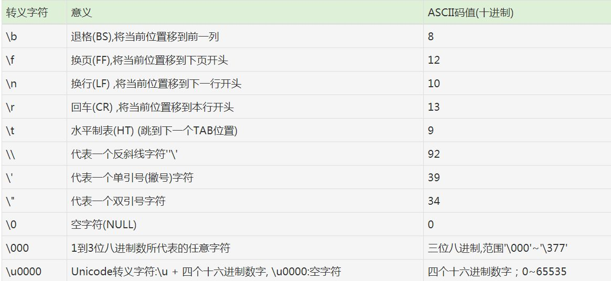

## equals与==的区别

- 源码分析
==比较的是两个字符串的内存地址值相不相同
由下面这段equals源码可以分析出equals是先将两个字符串的内存地址拿来进行比较，如果相同则返回true，如果不相同再判断传入字符串是否为String类的实例，如果不是，则返回false，如果是，则将传入字符串转换为String类型，先比较两个字符串的长度，长度一致再将字符串拆分为两个char数组进行遍历比较，如果相同再返回true

> 注：String类中的equals方法是重写的Object类的，Object类中的equals作用跟==相同，只比较内存地址

- 总结：可以简单理解为== 对比的是两个字符串的内存地址，equals对比的是两个字符串的字面值
```java
public boolean equals(Object anObject) {
    if (this == anObject) {
        return true;
    }
    if (anObject instanceof String) {
        String anotherString = (String)anObject;
        int n = value.length;
        if (n == anotherString.value.length) {
            char v1[] = value;
            char v2[] = anotherString.value;
            int i = 0;
            while (n-- != 0) {
                if (v1[i] != v2[i])
                    return false;
                i++;
            }
            return true;
        }
    }
    return false;
}
```

## 字面值
给基本类型的变量赋的值叫做字面值

## 数据类型的相关计算
char可以与数字进行运算，过程是将字母转换为ASCII值再运算

数字与字符串的拼接：String后面的所有数字都会被转换成String类型，然后进行字符串拼接，如果数字是出现在String前面，则会正常运算后拼接

## 数据类型转换
根据位数转换：小到大自动转换，大到小强制转换，short和char相互强制转换

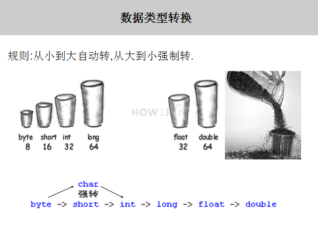


## final
当一个变量被final修饰的时候，该变量只有一次赋值的机会，再次赋值会发生编译错误

final 除了修饰变量，还可以修饰类，修饰方法

被final修饰的类不能被继承

被final修饰的方法不能被重写

被final修饰的引用只有一次指向对象的机会

## 运算符

### 算术运算符

取余的符号由被模数决定

### 赋值运算符
等号可以连续赋值

### 逻辑运算符
```java
&&  //逻辑与
||  //逻辑或
!   //逻辑非
    
//短路：逻辑前半段得出结果成立了，将不再进行符号后半段的运算
&   //短路与
|   //短路或
^   //异或
```

### 位运算符
正数二进制 ==> 反码 ==> 加1 => 负数二进制
```java
n << m      //左移，值等于n*2的m次方
n >> m      //右移，值等于n/2的m次方，如果为负数运算，则右移后在前两位补1
n >>> m     //无符号右移，右移后的最前两位补0
&           //逻辑与
|           //逻辑或
^           //异或运算，转为二进制进行比较运算，相同为0，不同为1
~           //反码，1和0取反，正负号取反
```


## JavaDoc
Java API 文档，可以通过CMD用命令生成或者使用idea生成

```
javadoc -encoding UTF-8 -charset UTF-8 demo.java
```

## Scanner
```java
Scanner s = new Scanner(System.in);

//判断输入的数是否为整数类型
s.hasNextInt();

//判断输入的数是否为浮点类型
s.hasNextFloat();

//使用Scanner读取整数
int a = s.nextInt();
System.out.println("第一个整数："+a);

//使用Scanner读取浮点数
float b = s.nextFloat();
System.out.println("第二个整数："+b);

//使用Scanner读取字符串
String c = s.nextLine();
System.out.println("读取的字符串是："+c);

s.close(); //关闭，避免内存浪费
```
### nextLine()与next()的区别：

- next()读取到空白符就结束，常见空白字符：空格、Tab、回车
- nextLine()读取到回车才结束也就是`"\r"`

- nextLine()在读取字符时不做特殊处理
- next()在读取字符时，会将第一个字符之前的空白字符过滤掉

## switch判断
switch语句中的参数类型可以是byte、short、int、char、String
```java
int score = 100

switch (score) {
case 100:
    System.out.println("优秀");
    break;
case 90:
    System.out.println("良好");
    break;
case 80:
    System.out.println("及格");
    break;
case 50:
    System.out.println("不及格");
    break;
default:
    System.out.println("查不到");
    break;
}
```

## 循环
与其他编程语言相似，break结束循环，continue跳过此次循环
```java
//标签跳出循环
public class HelloWorld {
    public static void main(String[] args) {
          
        //打印单数    
        outloop: //outloop这个标签是可以自定义的比如outloop1,ol2,out5
        for (int i = 0; i < 10; i++) {
             
            for (int j = 0; j < 10; j++) {
                System.out.println(i+":"+j);
                if(0==j%2) 
                    break outloop; //如果是双数，结束外部循环
            }
        }
         
    }
}
```

while循环

```java
while( 布尔表达式 ) {
	//代码语句
}
```

do...while循环

```java
do {
    //代码语句
}while(布尔表达式);
```

for循环

```java
for(初始化; 布尔表达式; 更新) {
    //代码语句
}
```

增强for循环

```java
int[] arr = {1,2,3};
for(int i : arr) {
    System.out.println(i);
}
```

## 方法重载

同名方法不同数量或类型的参数传入，得到不同的返回值，通过方法的重载实现，如果有多个同名方法，系统会在调用时自动选择对应数量参数的一个

重载规则：

- 方法名称必须相同
- 参数列表必须不同(个数不同、或类型不同、参数排列顺序不同等等)
- 方法的返回值类型可以相同也可以不同
- 仅仅返回类型不同不足以成为方法重载

## 可变长参数方法
不定参数的方法是用来避免代码冗余的
- 可变长参数只能作为函数的最后一个参数，但其前面可以有也可以没有任何其他参数
- 由于可变参数必须是最后一个参数，所以一个函数最多只能有一个可变参数
- Java的可变长参数，会被编译器转型为一个数组
- 变长参数在编译为字节码后，在方法签名中就是以数组形态出现的。这两个方法的签名是一致的，不能作为方法的重载。如果同时出现，是不能编译通过的。可变参数可以兼容数组，反之则不成立
```java
public void foo(String... varargs){}

foo("arg1", "arg2", "arg3");

//上述过程和下面的调用是等价的
foo(new String[]{"arg1", "arg2", "arg3"});
```

```java
public class StudentTestMethod {
    // methodName({paramList},paramType… paramName)
    // methodName 表示方法名称
    // paramList 表示方法的固定参数列表
    // paramType 表示可变参数的类型
    // … 是声明可变参数的标识
    // paramName 表示可变参数名称。
    
    
    // 定义输出考试学生的人数及姓名的方法
    public void print(String... names) {
        int count = names.length;    // 获取总个数
        System.out.println("本次参加考试的有"+count+"人，名单如下：");
        for(int i = 0;i < names.length;i++) {
            System.out.println(names[i]);
        }
    }
    
    public static void main(String[] args) {
        // TODO Auto-generated method stub
        StudentTestMethod student = new StudentTestMethod();
        student.print("张强","李成","王勇");    // 传入3个值
        student.print("马丽","陈玲");
    }
}
```

## 递归
递归结构两部分
- 递归头：什么时候不调用自身方法。如果没有头，将陷入死循环
- 递归体：什么时候需要调用自身方法

递归尽量在基数较小的情况使用，不然容易把堆空间塞满
```java
// 算阶乘
public int f(int n) {
    if(n ==1) {
        return 1;
    }else {
        return n*f(n-1);
    }
}
```

## Java创建对象内存分析
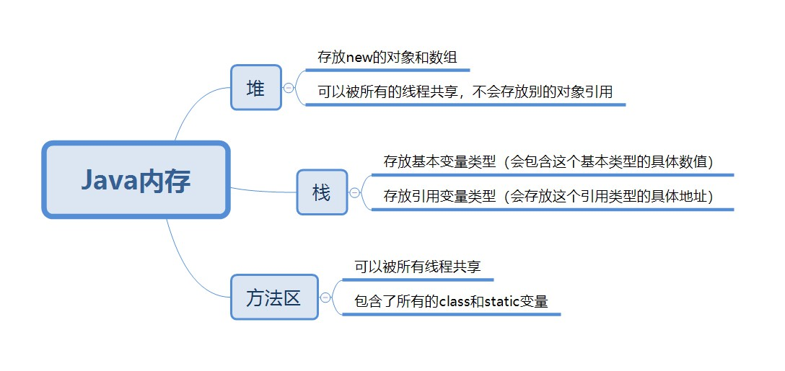

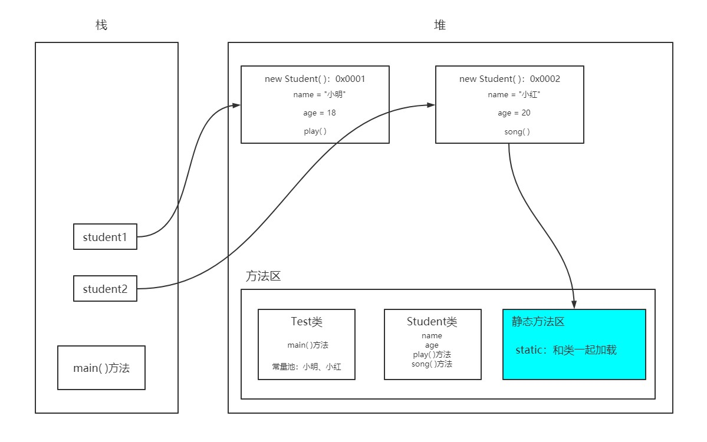

1. 程序运行首先在方法区加载类的模板，静态方法与类同时加载
2. 主方法运行，引用存在于栈中，指向堆空间创建的对象，对象创建时，字符串以及方法从方法区中获取

## 数组
### 数组的定义：

- 其长度是确定的，数组一旦被创建，它的大小就是不可改变的
- 其元素必须是相同类型，不允许出现其他类型
- 数组中的元素可以是任何数据类型，包括基本类型和引用类型
- 数组变量属于引用类型，数组也可以看成是对象，数组中的每个元素相当于该对象的成员变量
- 数组本身就是对象，Java中对象是在堆中的，因此数组无论保存原始类型还是其他对象类型，数组对象都在堆中

### 数组的三种初始化：
静态初始化

```java
int a[] = {1,2,3};
Man mans[] = {new man(1),new man(1)};
```
动态初始化
```java
int a[] = new int[2];
a[0] = 1;
a[1] = 2;
```
默认初始化

数组是引用类型，它的元素相当于类的实例变量，因此数组一经分配空间，其中的每个元素也被按照实例变量的方式被隐式初始化，基本类型被初始化为0，引用类型被初始化为null

### 复制数组
```java
System.arraycopy(src, srcPos, dest, destPos, length)

//src: 源数组
//srcPos: 从源数组复制数据的起始位置
//dest: 目标数组
//destPos: 复制到目标数组的起始位置
//length: 复制的长度
```

## Arrays工具类
```java
import java.util.Arrays;//导入Arrays类
 
public class HelloWorld {
    public static void main(String[] args) {
        int a[] = new int[] {18,62,68,82,65,9};
 
        // copyOfRange(int[] original, int from, int to)
        // 参数一：源数组
        // 参数二：开始位置(取得到)
        // 参数三：结束位置(取不到)
        int[] b = Arrays.copyOfRange(a,0,3);
 
        for (int i = 0;i< b.length;i++) {
            System.out.print(b[i] + " ");
        }

         //toString方法将数组作为字符串打印
        String content = Arrays.toString(a);

        //sort方法将数组进行由小到大排序(升序)
        Arrays.sort(a); 

        //binarySearch方法搜索元素出现的位置，必须在sort排序前提下
        //数字62在a数组中第一次出现的位置
        Arrays.binarySearch(a,62); 

        //比较两个数组内容是否完全相同
        Arrays.equals(a,b)

        //填充数组
        //Array.fill(arrayname ,starting index ,ending index ,value)
        // 参数一：要操作的数组
        // 参数二：开始位置(取得到)
        // 参数三：结束位置(取不到)
        // 参数四：填充值
        Arrays.fill(a,2,4,10);
        
        // 用一个值填充整个数组
        Arrays.fill(a,10);
    }
}
```

## 冒泡排序


算法逻辑：
1. 比较相邻的元素，较大元素右移
2. 对每一对相邻的元素都进行比较，等所有的比较完后最后一个数字是这堆数据里的最大数字
3. 重复步骤一，直到排序完成
```java
import java.util.Arrays;

public class Test {
    public static void main(String[] args) {
        int []arr= {3,9,2,8,7,4};//创建数组
        System.out.println("排序前" + Arrays.toString(arr));
        //循环实现冒泡排序
        for(int i=0;i<arr.length-1;i++) {
            for(int j=0;j<arr.length-i-1;j++) {
                if(arr[j]>arr[j+1]) {
                    int temp=arr[j];
                    arr[j]=arr[j+1];
                    arr[j+1]=temp;
                }    
            }
        }
         System.out.println("排序后" + Arrays.toString(arr));
    }
}
```

## 稀疏数组
当一个二维数组中大部分元素为0,或者为同一值时，可以使用稀疏数组来保存该数组

```java
//创建二维数组
int[][] array1 = new int[11][11];
array1[1][2] = 1;
array1[2][3] = 2;

// 获取数组有效值的个数
int sum = 0;
for(int i = 0;i < array1.length; i++){
    for(int j = 0;j < array1[i].length; j++){
        if(array1[i][j] != 0){
            sum++;
        }
    }
}

//创建一个稀疏数组,稀疏数组的第一行存放的是二维数组的构建信息，所以稀疏数组的行数=有效值+1，列数3固定，都为行、列、值
int[][] array2 = new int[sum+1][3];

//编辑稀疏数组第一行，存放二维数组构建信息，11行，11列，sum个有效值
array2[0][0] = 11;
array2[0][1] = 11;
array2[0][2] = sum;

//遍历二维数组，将有效值存入稀疏数组中
int count = 0;
for(int i = 0;i < array1.length; i++){
    for(int j = 0;j < array1[i].length; j++){
        if(array1[i][j] != 0){
            count++;
            array2[count][0] = i;
            array2[count][1] = j;
            array2[count][2] = array1[i][j];
        }
    }
}

//恢复二维数组：用稀疏数组中的信息创建二维数组
int[][] array3 = new int[array2[0][1]][array2[0][2]];

//填充二维数组
for(int i=1;i<array2.length;i++){
    array3[array2[i][0]][array2[i][1]]=array2[i][2];
}
```

## 类与对象

面向对象的本质：以类的方式组织代码，以对象的方式组织数据

简单概念：一个有多种属性的东西，叫对象，有相同属性的对象称为一个类

方法是类的动作,是动态行为,用驼峰命名法

引用：用来代表类的对象的变量

```java
public class Hero {
    String name; //姓名
      
    float hp; //血量

    public static void main(String[] args) {
        //创建一个对象
        new Hero();
         
        //使用一个引用来指向这个对象,h1就叫做引用
        Hero h1 = new Hero();
        Hero h2 = h1;  //h2指向h1所指向的对象，同一个对象可以有多个引用
        Hero h3 = h1;
        Hero h4 = h1;
        Hero h5 = h4;
    }  
}
```

继承的用法:一个类可以被多个类继承，一个类只能继承一个类，一个类可以继承多个接口，用逗号分隔多个接口。java中所有的类都直接或间接地继承Object类。

```java
public class Item {
    String name;
    int price;
}

public class Armor {
    int ac;
}
public class Weapon extends Item{
    int damage; //攻击力
     
    public static void main(String[] args) {
        Weapon weapon = new Weapon();
        weapon.damage = 65; //damage属性在类Weapon中新设计的
         
        weapon.name = "无尽之刃";//name属性，是从Item中继承来的，就不需要重复设计了
        weapon.price = 3600;
         
    }
}
```

构造方法：对象实例化是通过调用构造方法实现的，构造方法方法名和类名一致，无返回值，如果未定义，系统会默认生成一个无参构造方法，如果定义了一个带参的构造方法，那么系统将不会生成无参构造，需要自己手动定义无参构造，否则会报错

包：package，一般将比较接近的类，规划在同一个包下

```java
//使用同一个包下的其他类，直接使用即可
//但是要使用其他包下的类，必须import

package charactor;
 
//Weapon类在其他包里，要使用必须用import导入
import property.Weapon;
 
public class Hero {
        
    String name; //姓名
        
    float hp; //血量
        
    float armor; //护甲
        
    int moveSpeed; //移动速度
     
    //装备一把武器
    public void equip(Weapon w){
         
    }  
}
```

访问修饰符
```java
//private 私有的
//package/friendly/default 不写
//protected 受保护的
//public 公共的
```

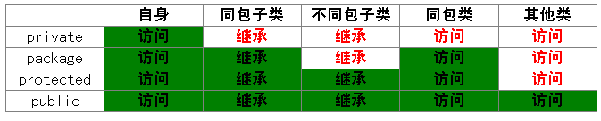

类方法、类属性和对象方法、对象属性

```java
//如果一个属性，这个类通用，不会改变，那么设计为类属性，用static修饰
public class Hero(){
    private static maxHP = 9000;
}

//如果一个方法，没有调用任何对象属性，那么就可以考虑设计为类方法，用static修饰
public static void printGameDuration(){
    System.out.println("已经玩了10分50秒");
}
```

## 单例模式

单例模式特点

1. 单例类只能有一个实例
2. 单例类必须自己创建自己的唯一实例
3. 单例类必须给其他类提供获取实例的方法

什么是单例模式

1. 构造方法私有化，创建唯一实例
2. 静态属性指向实例
3. 提供静态方法，返回静态属性

### 饿汉式
在类创建的同时就已经创建好一个静态的对象供系统使用，以后不再改变，所以天生是线程安全的

如果在构造方法里写了性能消耗较大，占时较久的代码，比如建立与数据库的连接，那么就会在启动的时候感觉稍微有些卡顿

```java
// 饿汉式单例
public class Test {
    private Test() {
        
    }
    
    private final static Test TEST = new Test();
    
    public static Test getInstance() {
        return TEST;
    }
}
```

### 懒汉式
在调用getInstance时才创建实例对象

使用懒汉式，在启动的时候，会感觉到比饿汉式略快，因为并没有做对象的实例化。 但是在第一次调用的时候，会进行实例化操作，感觉上就略慢。

看业务需求，如果业务上允许有比较充分的启动和初始化时间，就使用饿汉式，否则就使用懒汉式

```java
// DCL懒汉式单例
public class Test {

    private Test() {

    }

    // volatile关键字 1.保证变量的内存可见性 2.禁止指令重排序
    private volatile static Test test = null;

    // 双重检测锁模式
    public static Test getInstance() {
        // 第一次判断，实例为空，就有获取锁的资格
        if (test == null) {
            // 锁住类，保证同一时间只能有一条线程进行操作
            synchronized (Test.class) {
                if (test == null) {
                   test = new Test();
                }
            }
        }
        return test;
    }
}
```

## 枚举
枚举是一种特殊的类，通常配合switch使用
```java
public enum Season {
	SPRING,SUMMER,AUTUMN,WINTER
}

public class HelloWorld {
    public static void main(String[] args) {
        Season season = Season.SPRING;
        switch (season) {
        case SPRING:
            System.out.println("春天");
            break;
        case SUMMER:
            System.out.println("夏天");
            break;
        case AUTUMN:
            System.out.println("秋天");
            break;
        case WINTER:
            System.out.println("冬天");
            break;
        }
    }
}

//使用增强for循环查看枚举中的常量
for (Season s : Season.values()) {
    System.out.println(s);
}
```

## 接口
- 由interface关键字定义的类被称为接口
- 接口中的方法默认被public abstract修饰，属性默认被public static final修饰，所以在定义方法和属性时，不需要修饰符
- 接口用implements关键字继承，接口是多继承的

## 对象类型转换
用来代表类的对象的变量叫做引用
```java
ADHero ad = new ADHero();
// 第一个 ADHero 是引用类型
// 第二个 ADHero 是对象类型
//通常情况下，引用类型和对象类型是一致的
```
当引用类型和对象类型不同时，就要用到转换

没有继承关系的两个类，互相转换，一定会失败

```java
//子类转父类(自动转换)
ADHero ad = new ADHero();
Hero h = new Hero();
h = ad

//父类转子类(强制转换)
ad = (ADHero)h;
```
类与接口的转换
```java
ADHero ad = new ADHero();

// AD英雄类转为AD接口，是把ADHero类当做AD来使用，然而ADHero中必有AD接口中的方法，所以语义逻辑可行，自动转换
AD adi = ad;
```

## instanceof判断类型
instanceof是Java中的二元运算符，左边是对象，右边是类；当对象是右边类或子类所创建对象时，返回true；否则，返回false。
```java
ADHero ad = new ADHero();
APHero ap = new APHero();
    
Hero h1= ad;
Hero h2= ap;
    
//判断引用h1指向的对象，是否是ADHero类型
System.out.println(h1 instanceof ADHero);
    
//判断引用h2指向的对象，是否是APHero类型
System.out.println(h2 instanceof APHero);
    
//判断引用h1指向的对象，是否是Hero的子类型
System.out.println(h1 instanceof Hero);
```

## 方法重写
子类继承父类后在自身命名一个父类已有的方法叫做重写，新方法会覆盖父类方法，产生效果，重写的作用是在继承的同时也能灵活地修改方法，节省开发时间和维护成本

重写：需要有继承关系，子类重写父类的方法
- 方法名必须相同
- 参数列表必须相同
- 修饰符：范围可以扩大但不能缩小
- 抛出的异常：范围可以被缩小，不能被扩大

静态方法的调用只与定义的数据类型有关，非静态方法的调用存在重写

## 多态
1. 使用父类类型的引用指向子类的对象；
2. 该引用只能调用父类中定义的方法和变量；
3. 如果子类中重写了父类中的一个方法，那么在调用这个方法的时候，将会调用子类中的这个方法；（动态连接、动态调用）
4. 变量不能被重写（覆盖），”重写“的概念只针对方法，如果在子类中”重写“了父类中的变量，那么在编译时会报错。

多态的3个必要条件：
1. 继承
2. 重写   
3. 父类引用指向子类对象。

## 隐藏
隐藏也是方法的重写，只不过操作的是类方法

## super
1. 调用父类构造方法，根据传入参数的数量自动选择一个构造方法，默认在子类的构造方法的第一行会有一个`super()`，所以调用子类构造方法时，会默认调用父类无参构造方法，如果父类中没有无参构造方法，super会默认传入一个空字符串
2. 调用父类属性，用`super.属性名`的方式
3. 调用父类方法，用`super.方法名`的方式

## 抽象类
- 抽象方法用abstract关键字修饰,只申明，没有方法体
- 抽象方法必须在抽象类中，抽象类中可以存在普通方法
- 抽象类的子类中，必须重写抽象方法
- 抽象类中可以没有抽象方法，但是抽象类不能被直接实例化
- 抽象类用extends关键词继承，类是单继承的

## 内部类
成员内部类：成员内部类可以直接拿到外部类的私有属性
```java
public class Outer{
    private int id = 10;

    public void out(){
        System.out.println("这是外部方法");
    }

    public class Inner {
        public void in(){
            System.out.println("这是内部方法");
        }

        public void getID(){
            System.out.println(id);
        }
    }
}
```
实例化成员内部类
```java
public class Test {
    public static void main(String[] args) {
        Outer outer = new Outer();
        Outer.Inner inner = outer.new Inner();
        inner.getID();
    }
}
```
局部内部类：定义在外部类的方法里面的类，作用范围和创建对象范围仅限于当前方法，不能添加任何修饰符
局部内部类访问外部类当前方法中的局部变量时，因无法保障变量的生命周期与自身相同，变量必须修饰为final，这是JDK1.7的规定，JDK1.8以后，这个final会自动添加，不用我们考虑
```java
public class Outer{
    public void method(){
        class Inner{
            public  void in(){
                
            }
        }
    }
}
```
非静态内部类不需要在外部类存在一个实例时才可调用

静态内部类可以直接调用，因为没有一个外部类的实例，所以在静态内部类里面不可以直接访问外部类的属性和方法，若想访问，需要创建外部类的对象来调用

匿名类就是在实例化类的同时写出方法，不使用引用保存实例
```java
public class Test {
    public static void main(String[] args) {
        new Outer().method();
    }
}
```
匿名内部类：匿名内部类也就是没有名字的内部类，正因为没有名字，所以匿名内部类只能使用一次，它通常用来简化代码编写，但使用匿名内部类还有个前提条件：必须继承一个父类或实现一个接口
在接口上使用匿名内部类
```java
interface Person {
    public void eat();
}
 
public class Demo {
    public static void main(String[] args) {
        Person p = new Person() {
            public void eat() {
                System.out.println("eat something");
            }
        };
        p.eat();
    }
}
```
最常用的情况就是在多线程的实现上，因为要实现多线程必须继承Thread类或是继承Runnable接口
Thread类的匿名内部类实现
```java
public class Demo {
    public static void main(String[] args) {
        Thread t = new Thread() {
            public void run() {
                for (int i = 1; i <= 5; i++) {
                    System.out.print(i + " ");
                }
            }
        };
        t.start();
    }
}
```
Runnable接口的匿名内部类实现
```java
public class Demo {
    public static void main(String[] args) {
        Runnable r = new Runnable() {
            public void run() {
                for (int i = 1; i <= 5; i++) {
                    System.out.print(i + " ");
                }
            }
        };
        Thread t = new Thread(r);
        t.start();
    }
}
```

声明在主方法中的类叫做本地类
当外部类与内部类的属性重名时，优先访问内部类属性

## 默认方法
默认方法就是一个方法要在多个类中重复使用，写在接口中，避免重复

## 数字与字符
封装类：所有的基本类型，都有对应的引用类型，比如int对应的类是Integer，这种类就叫做封装类

装箱：基本类型转换为封装类型
拆箱：封装类型转换为基本类型

```java
int i = 5;
//装箱
//法一：构造器装箱JDK9以后弃用
Integer it = new Integer(i);
//法二
Integer it = Integer.valueOf(i);

//拆箱
//法一
int i2 = it.intValue();
//法二
int i2 = Integer.parseInt(it);
```
在JDK1.8以后，提供了自动装箱与拆箱
```java
int i = 5;
//装箱
Integer it = i;

//拆箱
int it2 = it;
```

数字与字符串的转换
```java
int i = 5;
String x = "999"
//数字转字符串

//方法1:使用String类的静态方法valueOf
String str = String.valueOf(i);
    
//方法2:先把基本类型装箱为对象，然后调用对象的toString
Integer it = i;
String str2 = it.toString();

//字符串转整数
int i= Integer.parseInt(x);
```

## Integer缓冲区
例一会打印true，因为在堆空间中有一块区域，存放了-128到127这个范围的Integer数组，所以当传入值在这个范围时，引用会直接指向堆空间的数组中的值，所以integer1与integer2指向的是同一个对象

例二会打印false，以为传入值不在-128到127这个范围内，在装箱时就会在堆空间创建新的对象，所以integer3与integer4指向的不是同一个对象
```java
//例一
Integer integer1 = new Integer(100);
Integer integer2 = new Integer(100);
System.out.println(integer1 == integer2);

//例二
Integer integer3 = new Integer(200);
Integer integer4 = new Integer(200);
System.out.println(integer1 == integer2);
```

## 格式化输出
%s 表示字符串
%d 表示数字
%n 表示换行

printf和format能够达到一模一样的效果

printf中是直接调用了format

数字的格式化输出
```java
public class TestNumber {
   
    public static void main(String[] args) {
        int year = 2020;
          
        //直接打印数字
        System.out.format("%d%n",year);
        //总长度是8,默认右对齐
        System.out.format("%8d%n",year);
        //总长度是8,左对齐
        System.out.format("%-8d%n",year);
        //总长度是8,不够补0
        System.out.format("%08d%n",year);
        //千位分隔符
        System.out.format("%,8d%n",year*10000);
  
        //小数点位数
        System.out.format("%.2f%n",Math.PI);
          
        //不同国家的千位分隔符
        System.out.format(Locale.FRANCE,"%,.2f%n",Math.PI*10000);
        System.out.format(Locale.US,"%,.2f%n",Math.PI*10000);
        System.out.format(Locale.UK,"%,.2f%n",Math.PI*10000);
    }
}
```

## 字符串
char对应的封装类是Character

immutable 是指不可改变的，里面的内容**永远**不能改变，String 的表现就像是一个常量

使用equals进行字符串内容的比较，必须大小写一致
equalsIgnoreCase，忽略大小写判断内容是否一致

StringBuffer是可变长的字符串

## 异常处理
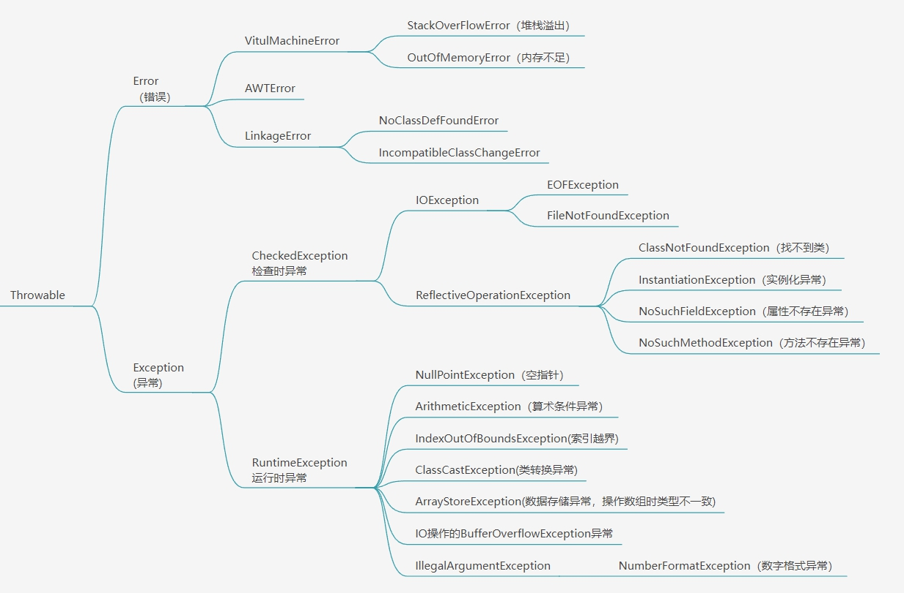

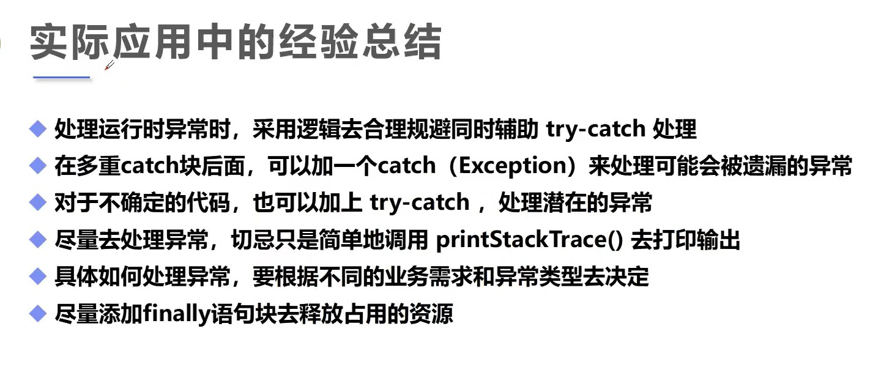

单异常处理
```java
//法一：try catch
//如果文件存在，就会顺序往下执行，并且不执行catch块中的代码
//如果文件不存在，try 里的代码会立即终止，程序流程会运行到对应的catch块中
try{
    System.out.println("试图打开 d:/LOL.exe");
    new FileInputStream(f);
    System.out.println("成功打开");
}
catch(FileNotFoundException e){
    System.out.println("d:/LOL.exe不存在");
    e.printStackTrace();
}

//法二：throws 抛出
//不对异常进行处理，直接抛出，程序会正常运行
private static void method2() throws FileNotFoundException {

    File f = new File("d:/LOL.exe");

    System.out.println("试图打开 d:/LOL.exe");
    new FileInputStream(f);
    System.out.println("成功打开");
}
```

多异常处理
```java
//法一：用多个catch进行处理
try {
    System.out.println("试图打开 d:/LOL.exe");
    new FileInputStream(f);
    System.out.println("成功打开");
    SimpleDateFormat sdf = new SimpleDateFormat("yyyy-MM-dd");
    Date d = sdf.parse("2016-06-03");
} catch (FileNotFoundException e) {
    System.out.println("d:/LOL.exe不存在");
    e.printStackTrace();
} catch (ParseException e) {
    System.out.println("日期格式解析错误");
    e.printStackTrace();
}
finally{
    //无论出不出现异常finally中的代码都会被执行都必会执行的代
    System.out.println("无论文件是否存在， 都会执行的代码");
}

//法二：用一个catch抛出多个异常，用if来判断异常
try {
    System.out.println("试图打开 d:/LOL.exe");
    new FileInputStream(f);
    System.out.println("成功打开");
    SimpleDateFormat sdf = new SimpleDateFormat("yyyy-MM-dd");
    Date d = sdf.parse("2016-06-03");
} catch (FileNotFoundException | ParseException e) {
    if (e instanceof FileNotFoundException)
        System.out.println("d:/LOL.exe不存在");
    if (e instanceof ParseException)
        System.out.println("日期格式解析错误");

    e.printStackTrace();
}
```

# 常用类

## 内部类
- 概念：在一个类的内部再定义一个完整的类，当外部类与内部类的属性重名时，优先访问内部类属性
- 分类：成员内部类、静态内部类、局部内部类、匿名内部类

### 成员内部类
- 内部类在编译之后也会产生独立的字节码文件
- 成员内部类在类的内部定义，与外部类的变量和方法同级别的类
- 成员内部类可以直接拿到外部类的私有属性
- 如果存在同名属性，优先访问成员内部类的属性
- 成员内部类里不能定义静态成员变量，但是可以定义静态常量(final)，这个静态常量在不实例化外部类的情况下可以调用

```java
public class Outer{
    private int id = 10;
    private String name = "张三";

    public void out(){
        System.out.println("这是外部方法");
    }

    public class Inner {
        static final String XXX = "这是一个静态常量";
        private String name = "李四";
       
        public void in(){
            System.out.println("这是内部方法");
            
            //打印李四
            System.out.println(name);
            System.out.println(this.name);
            //打印张三
            System.out.println(Outer.this.name);
        }

        public void getID(){
            System.out.println(id);
        }
    }
}
```
实例化成员内部类
```java
public class Test {
    public static void main(String[] args) {
        // 在没有实例化外部类的情况下可调用内部类的静态常量
        String xxx = Outer.Inner.XXX;
        System.out.println(xxx);

        Outer outer = new Outer();
        Outer.Inner inner = outer.new Inner();
        inner.getID();
    }
}
```

### 静态内部类
- 静态内部类不依赖外部类对象，可直接创建或通过类名访问，可以定义静态成员变量
- 非静态内部类需要在外部类存在一个实例时才可以调用，静态内部类可以直接调用，因为没有一个外部类的实例，所以在静态内部类里面不可以直接访问外部类的属性和方法，若想访问，需要创建外部类的对象来调用

```java
public class Outer{

    private String name = "xxx";
    private int age = 20;

    static class Inner{
        private String address = "上海";
        private String phone = "111";
        private static int count = 1000;

        public void show(){
            Outer outer = new Outer();

            System.out.println(outer.name);
            System.out.println(outer.age);

            System.out.println(address);
            System.out.println(phone);

            System.out.println(Inner.count);
        }
    }
}
```

### 局部内部类
- 局部内部类就是定义在外部类的方法里面的类，作用范围和创建对象范围仅限于当前方法，不能添加任何修饰符
- 局部内部类访问外部类当前方法中的局部变量时，因无法保障变量的生命周期与自身相同(局部变量在方法执行之后消失，而内部类不会消失)，变量必须修饰为final常量，这是JDK1.7的规定，JDK1.8以后，这个final会自动添加，不用我们考虑

```java
public class Outer{
    private String str1 = "外部类变量";
    public void method(){
        class Inner{
            private String str = "局部变量";

            public  void in(){
                //打印外部类变量
                System.out.println(str1);

                //打印局部变量
                System.out.println(str);
            }
        }

        Inner inner = new Inner();
        inner.in();
    }

    public static void main(String[] args) {
        new Outer().method();
    }
}
```

### 匿名内部类
- 匿名内部类也就是没有名字的局部内部类，正因为没有名字，所以匿名内部类只能使用一次，它通常用来简化代码编写，但使用匿名内部类还有个前提条件：必须继承一个父类或实现一个接口
- 匿名类就是在实例化类的重写方法，不使用引用保存实例

```java
public class Test {
    public static void main(String[] args) {
        new Outer().method();
    }
}
```
在接口上使用匿名内部类
```java
interface Person {
    public void eat();
}
 
public class Demo {
    public static void main(String[] args) {
        Person p = new Person() {
            public void eat() {
                System.out.println("eat something");
            }
        };
        p.eat();
    }
}
```
最常用的情况就是在多线程的实现上，因为要实现多线程必须继承Thread类或是继承Runnable接口

- Thread类的匿名内部类实现 

```java
public class Demo {
    public static void main(String[] args) {
        Thread t = new Thread() {
            public void run() {
                for (int i = 1; i <= 5; i++) {
                    System.out.print(i + " ");
                }
            }
        };
        t.start();
    }
}
```
- Runnable接口的匿名内部类实现

```java
public class Demo {
    public static void main(String[] args) {
        Runnable r = new Runnable() {
            public void run() {
                for (int i = 1; i <= 5; i++) {
                    System.out.print(i + " ");
                }
            }
        };
        Thread t = new Thread(r);
        t.start();
    }
}
```

## Object
Object类是所有类的超类，所有类默认继承Object类

### getClass() 
返回引用中存储的实际对象类型
```java
Student stu = new Student();
Class class = stu.getClass();
```

### hashCode() 
返回对象哈希值，是一个整数，表示在哈希表中的位置

哈希值：根据对象的地址或字符串或数字使用hash算法计算出来的int类型的数值，一般情况下，相同对象返回相同哈希码
```java
Student stu = new Student();
int hash = stu.hashCode();
```

### toString() 
返回该对象的字符串表示，因为默认打印的是类的内存地址，所以通常我们都会重写这个方法，达到输出字符串的目的
```java
public class Student {
    private String name;
    private int age;

    public Student(String name, int age){
        this.name = name;
        this.age = age
    }

    public String toString() {
        return "name:" + name + "age:" + age;
    }
}

Student stu = new Student("张三",20);
String stuInfo = stu.toString();
```

### equals()
比较两个对象地址是否相同，这个方法在String中被重写了，重写后的方法先对比内存地址，如不相同则对比字面值
```java
Student stu1 = new Student();
Student stu2 = new Student();
boolean result = stu1.equals(stu2);
```

### finalize() 
垃圾回收方法，由JVM自动调用此方法
- 垃圾对象：没有有效引用指向此对象
- 垃圾回收：由GC销毁垃圾对象，释放数据存储空间
- 自动回收机制：JVM的内存耗尽，一次性回收所有垃圾对象
- 手动回收机制：使用System.gc();通知JVM执行垃圾回收

## String

- String也叫作字符串常量，因为它在创建之后是不可更改的。
- 字符串字面值存储在字符串池中，可以共享。

### 创建字符串的两种方式及区别

```java
// 第一种创建方式，只在常量池中创建一个对象，栈内引用直接指向方法区中的常量池中的对象
String str1 = "你好";

// 第二种创建，在堆内新建对象，对象指向方法区中的常量池中的值栈内引用指向堆内对象
String str2 = new String("Hello World");
```

### length()
返回字符串长度
```java
String str = "Hello World";
int leng = str.length();
```

### charAt(int index)
返回某个位置的字符
```java
String str = "Hello World";
char c = str.charAt(0);
```

### contains(String str)
判断是否包含某个子字符串，返回布尔值
```java
String str = "Hello World";
boolean result = str.contains("Hello");
```

### toCharArray()
将字符串转换为字符数组返回
```java
String str = "Hello World";
char[] strs = str.toCharArray();
```
### indexOf(String str)
查找str首次出现的下标，返回，如果不存在，返回-1
```java
String str = "Hello World";
int index = str.indexOf("Hello");
// 从第四位开始查找
int index = str.indexOf("Hello",4);
```

### lastIndexOf(String str)
查找字符串在当前字符串中最后一次出现的下标，返回，如果不存在，返回-1;
```java
String str = "Java Hello Java CC Java";
int index = str.lastIndexOf("Java");
```

### trim()（常用）
去掉字符串前后空格
```java
String str = "    Hello World    ";
String str2 = str.trim();
```

### toUpperCase()
将小写转成大写
### toLowerCase()
将大写转换成小写
```java
String str = "Hello World";
String str2 = str.toUpperCase();
String str3 = str.toLowerCase();
```

### endsWith(String str)
判断字符串是否以某串字符结尾
### startsWith(String str)
判断字符串是否以某串字符开头
```java
String str = "Hello World";
boolean r1 = str.startsWith("Hello");
boolean r2 = str.endsWith("World");
```

### replace(char oldChar,char newChar)
将旧字符串替换成新字符串
```java
String str = "Hello World";
String str2 = str.replace("World","Java");
```

### split(String str)（常用）
根据str对字符串进行拆分，返回一个字符串数组
```java
String str = "Hello World Java PHP C,Python|C++";
// 以空格分隔字符串
String[] strs = str.split(" ")
// 以多个符号分隔字符串空格，逗号竖线都可分隔
String[] strs = str.split("[ ,|]")
```

## 可变字符串
- StringBuffer : 可变长字符串，JDK1.0提供，运行效率慢、线程安全

- StringBuilder : 可变长字符串，JDK5.0提供，运行效率快、线程不安全

- StringBuffer和StringBuilder的效率都高于String，都比String节省内存

- StringBuffer和StringBuilder的用法是一样的，StringBuilder的效率高于StringBuffer

```java
StringBuilder sb = new StringBuilder();
// append()追加
sb.append("Hello World");

// insert()添加
sb.insert(0,"Hello World");

// replace()替换:取头不取尾
sb.replace(6,11,"Java");

// delete()删除:取头不取尾
sb.delete(6,sb.length());

// 打印
sb.toString();
```

## BigDecimal
- float和double类型的主要设计目标是为了科学计算和工程计算。他们执行二进制浮点运算，然而，它们没有提供完全精确的结果。但是，商业计算往往要求结果精确，这时候BigDecimal就派上大用场啦。

```java
BigDecimal bd1 = new BigDecimal("1.0");
BigDecimal bd2 = new BigDecimal("0.9");

// 加
BigDecimal result1 = bd1.add(bd2);
// 减
BigDecimal result2 = bd1.subtract(bd2);
// 乘
BigDecimal result3 = bd1.multiply(bd2);
// 除
BigDecimal result4 = bd1.divide(bd2);

// 因为除不尽会报错，所以这里保留两位小数四舍五入
BigDecimal result5 = bd1.divide(bd2).setScale(2, RoundingMode.HALF_UP)
```

## Date
- Date表示特定的瞬间，精确到毫秒，JDK1.0提供。JDK1.1之后，Date类中的大部分方法都已经被Calendar类中的方法所取代

```java
public static void main(String[] args) {
    // 1 创建Date对象
    Date date1 = new Date();
    System.out.println(date1.toString()); //Sun Sep 19 18:53:23 CST 2021
    System.out.println(date1.toLocaleString()); //2021年9月19日 下午6:53:23

    // 昨天
    Date date2 = new Date(date1.getTime() - (60*60*24*1000)); 
    System.out.println(date2.toLocaleString()); //2021年9月18日 下午6:53:23

    // 2 方法after before
    boolean b1 = date1.after(date2);
    System.out.println(b1); //true
    boolean b2 = date1.before(date2);
    System.out.println(b2); //false

    // 比较compareTo();
    int d = date1.compareTo(date1);
    System.out.println(d); // 多的为1，少的为-1，相等为0

    // 比较是否相等 equals()
    boolean b3 = date1.equals(date2);
    System.out.println(b3); // false
}
```

## Calendar
- Calendar提供了获取或设置各种日历字段的方法
- 构造方法用protected进行修饰，不能直接创建对象

```java
public static void main(String[] args) {
    // 1. 创建 Calendar 对象
    Calendar calendar = Calendar.getInstance();
    System.out.println(calendar.getTime().toLocaleString());
    // 2. 获取时间信息
    // 获取年
    int year = calendar.get(Calendar.YEAR);
    // 获取月 从 0 - 11
    int month = calendar.get(Calendar.MONTH);
    // 日，DAY_OF_MONTH和DATE是一样的
    int day = calendar.get(Calendar.DAY_OF_MONTH);
    // 小时，HOUR 12小时制，HOUR_OF_DAY 24小时制
    int hour = calendar.get(Calendar.HOUR_OF_DAY);
    // 分钟
    int minute = calendar.get(Calendar.MINUTE);
    // 秒
    int second = calendar.get(Calendar.SECOND);
    // 3. 修改时间
    Calendar calendar2 = Calendar.getInstance();
    calendar2.set(Calendar.DAY_OF_MONTH, x);
    // 4. add修改时间
    calendar2.add(Calendar.HOUR, x); // x为正就加 负就减
    // 5. 补充方法
    int max = calendar2.getActualMaximum(Calendar.DAY_OF_MONTH);// 月数最大天数
    int min = calendar2.getActualMinimum(Calendar.DAY_OF_MONTH);// 月数最小天数 
}
```

## SimpleDateFormat
- SimpleDateFormat是一个以与语言环境有关的方式来格式化和解析日期的具体类
- 文本 <==> 日期

```java
public static void main(String[] args) throws ParseException {
    // 1. 创建对象
    SimpleDateFormat sdf = new SimpleDateFormat("yyyy/MM/dd HH-mm-ss");
    // 2. 创建Date
    Date date = new Date();
    // 格式化date（日期→字符串）
    String str = sdf.format(date);
    System.out.println(str);
    // 解析（字符串→时间）
    Date date2 = sdf.parse("1948/03/12");
    System.out.println(date2);
}
```

## System
- 主要用于获取系统的属性数据和其他操作，构造方法私有化

```java
public static void main(String[] args) {
    //arraycopy 数组复制
    //System.arraycopy(src, srcPos, dest, destPos, length);
    //src-原数组 srcPos-从哪个位置开始复制 dest-目标数组 destPos-目标数组的位置 length-复制的长度
    int[] arr = {20, 18, 39, 3};
    int[] dest = new int [4];
    System.arraycopy(arr, 0, dest, 0, 4);
    for (int i : dest) {
        System.out.println(i);
    }

    // 返回当前系统时间(毫秒)
    System.currentTimeMillis();

    // Arrays.copyOf(original, newLength)
}
```

## 泛型
- JDK1.5新特性，本质是参数化类型，把类型作为参数传递
- 常见形式有泛型类、泛型接口、泛型方法
- <T,...> T为类型占位符，表示一种引用类型，可以写多个逗号隔开
- 好处 1. 提高代码重用性 2. 防止类型转换异常，提高代码安全性

### 泛型类
```java
// 写一个泛型类
public class MyGeneric<T>{
  //使用泛型T
  //1.创建变量
  T t;
  //2.泛型作为方法的参数
  public void show(T t){
    sout(t);
  }
  //3.泛型作为方法的返回值
  public T getT(){
    return t;
  }
}
```
```java
// 使用泛型类
public class TestGeneric{
  public static void main(String[] args){
    //使用泛型类创建对象
    // 注意： 1. 泛型只能使用引用类型
    //		 2. 不用泛型类型对象之间不能相互赋值
    MyGeneric<String> myGeneric = new MyGeneric<String>();
    myGeneric.t = "hello";
    myGeneric.show("hello world!");
    String string = myGeneric.getT();
    
    MyGeneric<Integer> myGeneric2 = new MyGeneric<Integer>();
    myGeneric2.t = 100;
    myGeneric2.show(200);
    Integer integer = myGeneric2.getT();
    
  }
}
```

### 泛型接口
方式一：在实现类继承接口的同时定义泛型类型，用此方式实例化出的对象泛型类型固定
```java
public interface MyInterface<T> {
    T server(T t);
}
```
```java
public class MyInterfaceImpl implements MyInterface<String>{
    @Override
    public String server(String s) {
        System.out.println(s);
        return s;
    }
}
```
```java
public static void main(String[] args) {
    MyInterfaceImpl impl = new MyInterfaceImpl();
    impl.server("方式一");
}
```
方式二：在实现类继承接口时不定义泛型类型，在实例化的时候再指定泛型类型，用此方式可以用一个实现类实现多种泛型类型的对象
```java
public interface MyInterface<T> {
    T server(T t);
}
```
```java
public class MyInterfaceImpl<T> implements MyInterface<T>{
    @Override
    public String server(T t) {
        System.out.println(t);
        return t;
    }
}
```
```java
public static void main(String[] args) {
    MyInterfaceImpl<String> impl = new MyInterfaceImpl();
    impl.server("方式二");
}
```

### 泛型方法
```java
public class MyGenericMethod{
  //泛型方法
  //T的作用范围仅限于当前方法
  public <T> T show(T t){
    sout("泛型方法" + t);
    return t;
  }
}

//调用
MyGenericMethod myGenericMethod = new MyGenericMethod();
myGenericMethod.show("字符串");// 自动类型为字符串
myGenericMethod.show(200);// integer类型
myGenericMethod.show(3.14);// double类型
```

# 集合
概念：对象的容器，定义了对多个对象进行操作的常用方法，可实现数组的功能

所有集合类都位于`java.util`包下，Java的集合类主要由两个接口派生而出，Collection和Map，Collection和Map是Java集合框架的根接口，这两个接口又包含了一些子接口或实现类。

集合与数组区别:
1. 数组长度固定，集合长度不固定
2. 数组可以存储基本类型和引用类型，集合只能存储引用类型

## Collection体系集合


## Collection父接口
特点：代表一组任意类型的对象，无序、无下标、不能重复

```java
public static void main(String[] args) {
    // 创建集合
    Collection collection = new ArrayList();

    // 添加元素
    collection.add("苹果");        
    collection.add("香蕉");        
    collection.add("梨子");

    // 删除元素
    collection.remove("苹果");

    // 清空集合
    collection.clear();

    // 遍历(无下标，所以循环遍历时只能使用增强for循环)
    for(Object obj : collection) {
        System.out.println(obj);
    }

    // 使用迭代器遍历   
    // 删除当前元素
    Iterator it = collection.iterator();
    // hasNext()判断有没有下一个元素
    while(it.hasNext()){
        // next()获取元素
        Object obj = it.next();
        // remove()移除当前元素
        // 使用collection.remove()会报并发修改异常，所以我们只能使用iterator.remove()来删除元素
        it.remove();
    }

    // 判断集合是否包含指定元素
    boolean result1 = collection.contains("梨子");
    // 判断集合是否为空
    boolean result2 = collection.inEmpty();

    // 获取集合元素个数
    int num = collection.size();
}
```

## Set和List的区别
1. Set接口存储的是无序、无下标、不重复的数据。List接口存储的是有序的、有下标、可以重复的元素
2. Set检索效率低下，删除和插入效率高，插入和删除不会引起元素位置改变，实现类有HashSet,TreeSet
3. List和数组类似，可以动态增长，根据实际存储的数据的长度自动增长List的长度。查找元素效率高，插入删除效率低，因为会引起其他元素位置改变，实现类有ArrayList,LinkedList,Vector

## List子接口
特点：有序、有下标、元素可重复

```java
public static void main(String[] args) {
    // 创建集合
    List list = new ArrayList<>();

    // 添加元素
    list.add("苹果");
    list.add("梨子");
    list.add("香蕉");

    // 删除元素
    list.remove("梨子");
    // 使用索引删除
    list.remove(0);

    // 遍历
    // 使用for循环
    for (int i= 0; i<list.size(); i++) {
        System.out.println(list.get(i));
    }

    // 使用增强for循环
    for(Object obj : list) {
        System.out.println(obj);
    }
    
    // 使用迭代器遍历
    Iterator it = list.iterator();
    // 判断有没有下一个元素
    while(it.hasNext()){
        // 获取元素
        Object obj = it.next();

        // 移除当前元素
        // 如果使用list.remove()会报并发修改异常
        it.remove();
    }

    // 使用列表迭代器（List特有），列表迭代器可以从前向后遍历，也可以从后向前遍历
    // 创建迭代器
    ListIterator it1 = list.listIterator();
    // 从前向后遍历
    while(it1.hasNext()){
        System.out.println(it1.next());
    }
    // 从后向前遍历(因为是同一个迭代器，在上一次遍历之后，迭代器已经指向了集合末尾，所以这里可以直接开始向前遍历)
    while(it1.hasPrevious()){
        System.out.println(it1.previous());
    }

    // 获取元素出现位置
    System.out.println(list.indexOf("香蕉"));

    // List集合添加整数元素(自动装箱,JDK1.8新特性)
    list.add(10);
    list.add(20);

    // 删除List中的整数元素，直接传入整数，会被当做下标，所以这里通过获取下标，用下标来进行删除
    list.remove(list.indexOf(10));

    // 返回子集合，取头不取尾
    List subList = list.subList(0,2);

    // 集合转换为数组
    String[] array =new String[list.size()];
    list.toArray(array);
}
```

## List实现类
1. ArrayList（常用）：JDK1.2提供，数组结构实现，必须要连续空间，查询快，增删慢，运行效率快，线程不安全
2. Vector：JDK1.0提供，数组结构实现，查询快，增删慢，运行效率慢，线程安全
3. LinkedList（常用）：双向链表结构实现，增删快，查询慢

### ArrayList
源码分析：
- 如果没有向集合中添加任何元素时，容量0，添加第一个元素后，默认容量为10
- 首次添加元素时，ArrayList会被赋予初始容量10，之后每当判断到容量不够时，就会扩容，每次扩容为原来的1.5倍

```java
// 一个空数组
private static final Object[] DEFAULTCAPACITY_EMPTY_ELEMENTDATA = {};

// 默认容量
private static final int DEFAULT_CAPACITY = 10;

// 实际元素个数
private int size;

// 存放元素的数组
transient Object[] elementData;
```

```java
// 构造方法，将空数组赋值给存放元素的数组
public ArrayList() {
    this.elementData = DEFAULTCAPACITY_EMPTY_ELEMENTDATA;
}

// 添加方法
public boolean add(E e) {
    ensureCapacityInternal(size + 1);
    elementData[size++] = e;
    return true;
}

private void ensureCapacityInternal(int minCapacity) {
    ensureExplicitCapacity(calculateCapacity(elementData, minCapacity));
}

private static int calculateCapacity(Object[] elementData, int minCapacity) {
    if (elementData == DEFAULTCAPACITY_EMPTY_ELEMENTDATA) {
        return Math.max(DEFAULT_CAPACITY, minCapacity);
    }
    return minCapacity;
}

private void ensureExplicitCapacity(int minCapacity) {
    modCount++;

    if (minCapacity - elementData.length > 0)
        grow(minCapacity);
}

// 扩容
private void grow(int minCapacity) {
    int oldCapacity = elementData.length;
    int newCapacity = oldCapacity + (oldCapacity >> 1);
    if (newCapacity - minCapacity < 0)
        newCapacity = minCapacity;
    if (newCapacity - MAX_ARRAY_SIZE > 0)
        newCapacity = hugeCapacity(minCapacity);
    // 复制出一个新的数组，覆盖原数组
    elementData = Arrays.copyOf(elementData, newCapacity);
}
```

### Vector
添加、删除、判断都与List子接口相同，遍历可以使用增强for、迭代器，以及它特有的枚举器
```java
Vector vector = new Vector();
Enumeration en = vector.elements();
while(en.hasMoreElements()){
  String o = (String)en.nextElement();
  System.out.println(o);
}
```

### LinkedList
常用方法都与List子接口相同
源码分析：
- 首次添加元素之后，first以及last都会指向第一个节点
- 之后每次添加元素，first始终指向第一个节点，last会指向当前节点
- 每个节点中的next属性存储下一个节点，prev属性存储上一个节点

add方法执行步骤：
1. 创建新Node
2. 新Node的prev指向last Node
3. last Node的next指向新Node
4. 指定新Node为last Node
```java
// 集合大小，初始为0
transient int size = 0;

// 指向集合第一个元素，初始为null
transient Node<E> first;

// 指向集合最后一个元素，初始为null
transient Node<E> last;
```
```java
// 添加方法
public boolean add(E e) {
    linkLast(e);
    return true;
}

void linkLast(E e) {
    final Node<E> l = last;
    final Node<E> newNode = new Node<>(l, e, null);
    last = newNode;
    if (l == null)
        first = newNode;
    else
        l.next = newNode;
    size++;
    modCount++;
}

// 集合中的一个节点
private static class Node<E> {
    // 数据
    E item;
    // 下一个节点
    Node<E> next;
    // 上一个节点
    Node<E> prev;

    Node(Node<E> prev, E element, Node<E> next) {
        this.item = element;
        this.next = next;
        this.prev = prev;
    }
}
```

## Set子接口
特点：无序、无下标、元素不可重复
方法：全部继承自Collection父接口中的方法，添加、删除、遍历、判断与collection父接口中一致

## Set实现类
1. HashSet：基于HashCode计算元素存放位置，当在同一个位置存入的两个元素哈希码相同时，会调用equals再次进行确认，对比两个元素的内存地址，如果也为true，则判定为同一个元素，拒绝后者存入，如果为false，说明不是同一个元素，则在此位置形成链表
2. TreeSet：基于排列顺序实现元素不重复，实现了SortedSet接口，对集合元素自动排序，元素对象的类型必须实现Comparable接口，指定排序规则，通过CompareTo方法确定是否为重复元素

### HashSet
存储结构：哈希表(数组+链表+红黑树)

重写hashCode()和equals()方法，可以自定义hash的计算规则，从而改变结果
```java
@Override
public boolean equals(Object o) {
    if (this == o) return true;
    if (o == null || getClass() != o.getClass()) return false;

    User user = (User) o;

    if (age != user.age) return false;
    return name != null ? name.equals(user.name) : user.name == null;
}

@Override
public int hashCode() {
    int result = name != null ? name.hashCode() : 0;
    // 使用31这个质数，减少散列冲突，便于进行位运算来提高执行效率
    result = 31 * result + age;
    return result;
}
```
```java
public static void main(String[] args) {
    // 创建集合
    HashSet<String> hashSet = new HashSet<String>();

    // 添加元素
    hashSet.add("苹果");
    hashSet.add("梨子");
    hashSet.add("香蕉");

    // 删除元素
    hashSet.remove("梨子");

    // 遍历
    // 使用增强for循环
    for(Object obj : hashSet) {
        System.out.println(obj);
    }

    // 使用迭代器遍历
    Iterator it = hashSet.iterator();
    // 判断有没有下一个元素
    while(it.hasNext()){
        // 获取元素
        System.out.println(it.next());
        // 删除当前元素
        // 使用hashSet.remove()会报并发修改异常
        it.remove();
    }
    System.out.println(hashSet.toString());
}
```

### TreeSet
存储结构：红黑树
要求：使用TreeSet存储引用类型数据时，元素需要要实现Comparable接口，重写compareTo()方法，自定义比较规则，当方法返回值为0时，认为是重复元素

```java
public class Student implements Comparable<Student>{
    private String name;
    private int age;

    public Student() {
    }

    public Student(String name, int age) {
        this.name = name;
        this.age = age;
    }

    public String getName() {
        return name;
    }

    public void setName(String name) {
        this.name = name;
    }

    public int getAge() {
        return age;
    }

    public void setAge(int age) {
        this.age = age;
    }

    @Override
    public String toString() {
        return "Student{" +
                "name='" + name + '\'' +
                ", age=" + age +
                '}';
    }
    
    //重写compareTo方法，这里我们的逻辑是先按照姓名比较，然后再按照年龄比较
    @Override
    public int compareTo(Student o) {
        int n1 = this.name.compareTo(o.getName());
        int n2 = this.age - o.getAge();
        return n1==0? n2: n1;
    }
}
```
```java
public class Test {
    public static void main(String[] args) {
        TreeSet<Student> treeSet = new TreeSet<>();

        Student stu1 = new Student("zhangsan",20);
        Student stu2 = new Student("lisi",21);
        Student stu3 = new Student("zhangsan",22);

        treeSet.add(stu1);
        treeSet.add(stu2);
        treeSet.add(stu3);
        
        System.out.println(treeSet.size());
        System.out.println(treeSet.toString());
        
        treeSet.remove(new Student("zhangsan",20));
        System.out.println(treeSet.toString());
    }
}
```
也可以不继承Comparable接口，使用比较器，在创建集合的同时，指定比较规则
```java
TreeSet<Student> students = new TreeSet<>(new Comparator<Student>() {
    @Override
    public int compare(Student stu1, Student stu2) {
        int n1 = stu1.getName().compareTo(stu2.getName());
        int n2 = stu1.getAge() - stu2.getAge();
        return n1 == 0? n2: n1;
    }
});
```

## Map体系集合


## Map父接口
特点：
- 用于存储任意键值对(key - value)
- 键：无序、无下标、不允许重复(唯一)
- 值：无序、无下标、允许重复

```java
public static void main(String[] args) {
    //创建Map集合
    Map<String, String> map = new HashMap<>();

    // 1. 添加元素
    map.put("cn", "中国");
    map.put("uk", "英国");
    // 添加重复键，值会覆盖
    map.put("cn", "zhongguo"); 

    // 2. 删除元素
    map.remove("uk");

    // 3. 遍历
    //注：entrySet的效率高于keySet
    //第一种：
    //遍历所有的key，用key查找对应value
    for (String key : map.keySet()) {
        System.out.println("key= "+ key + " and value= " + map.get(key));
    }

    //第二种：
    //通过Map.entrySet(键值对映射)使用iterator遍历key和value
    Iterator<Map.Entry<String, String>> it = map.entrySet().iterator();
    while (it.hasNext()) {
        Map.Entry<String, String> entry = it.next();
        System.out.println("key= " + entry.getKey() + " and value= " + entry.getValue());
    }

    //第三种：推荐，尤其是容量大时
    //通过Map.entrySet遍历key和value
    for (Map.Entry<String, String> entry : map.entrySet()) {
        System.out.println("key= " + entry.getKey() + " and value= " + entry.getValue());
    }

    //第四种：
    //通过Map.values()遍历所有的value，但不能遍历key
    for (String v : map.values()) {
        System.out.println("value= " + v);
    }
    
    // 4.判断
    System.out.println(map.containsKey("cn"));
    System.out.println(map.containsValue("中国"));
    
    //5.清空集合
    map.put("uk", "英国");
    map.clear();
    System.out.println(map.toString());
}
```

## Map实现类
1. HashMap：JDK1.2提供，线程不安全，运行效率快，允许使用null作为key或是value
2. Hashtable：JDK1.0提供，线程安全，运行效率慢；不允许null作为key或是value
3. Properties：Hashtable的子类，要求key和value都是string，通常用于配置文件的读取
4. TreeMap：实现了SortedMap接口（是map的子接口），可以对key自动排序

### HashMap
存储结构：哈希表(数组+链表+红黑树)
增、删、遍历、判断与Map父接口一致

源码分析：
- HashMap刚创建时，table是null，节省空间，当添加第一个元素时，table容量调整为16
- 当元素个数大于阈值（16*0.75 = 12）时，会进行扩容，扩容后的大小为原来的两倍，目的是减少调整元素的个数
- JDK1.8 当每个链表长度 >8 ，并且数组元素个数 ≥64时，会调整成红黑树，目的是提高效率
- JDK1.8 当链表长度 <6 时 调整成链表
- JDK1.8 以前，链表时头插入，之后为尾插入

```java
// 初始容量
static final int DEFAULT_INITIAL_CAPACITY = 1 << 4;

// 最大容量
static final int MAXIMUM_CAPACITY = 1 << 30;

// 默认加载因子，容量超过75%则自动扩容
static final float DEFAULT_LOAD_FACTOR = 0.75f;

// 键值对映射数组，用于存放传入的键值对，初始为null
transient Node<K,V>[] table;

// 数组大小，初始为0
transient int size;
```
```java
// 添加方法
public V put(K key, V value) {
    return putVal(hash(key), key, value, false, true);
}

static final int hash(Object key) {
    int h;
    return (key == null) ? 0 : (h = key.hashCode()) ^ (h >>> 16);
}

final V putVal(int hash, K key, V value, boolean onlyIfAbsent,boolean evict) {
    Node<K,V>[] tab; Node<K,V> p; int n, i;
    // 这一个if判断了table赋给tab的值是否为空，实际上进行了初始化，table的容量变为16
    if ((tab = table) == null || (n = tab.length) == 0)
        n = (tab = resize()).length;
    if ((p = tab[i = (n - 1) & hash]) == null)
        tab[i] = newNode(hash, key, value, null);
    else {
        Node<K,V> e; K k;
        if (p.hash == hash &&
            ((k = p.key) == key || (key != null && key.equals(k))))
            e = p;
        else if (p instanceof TreeNode)
            e = ((TreeNode<K,V>)p).putTreeVal(this, tab, hash, key, value);
        else {
            for (int binCount = 0; ; ++binCount) {
                if ((e = p.next) == null) {
                    p.next = newNode(hash, key, value, null);
                    if (binCount >= TREEIFY_THRESHOLD - 1) // -1 for 1st
                        treeifyBin(tab, hash);
                    break;
                }
                if (e.hash == hash &&
                    ((k = e.key) == key || (key != null && key.equals(k))))
                    break;
                p = e;
            }
        }
        if (e != null) { // existing mapping for key
            V oldValue = e.value;
            if (!onlyIfAbsent || oldValue == null)
                e.value = value;
            afterNodeAccess(e);
            return oldValue;
        }
    }
    ++modCount;
    // 当元素个数超过阈值，进行扩容，阈值16*0.75=12，每一次扩容为原来的2倍
    if (++size > threshold)
        resize();
    afterNodeInsertion(evict);
    return null;
}
```

### Hashtable
线程安全，运行效率慢；不允许null作为key或是value

### Properties
Hashtable的子类，要求key和value都是string，通常用于配置文件的读取

### TreeMap
实现了SortedMap接口（是map的子接口），可以对key自动排序
TreeMap存储引用类型数据的时候，也和TreeSet一样，需要实现Comparable接口，或者是在创建集合的同时，指定比较规则，具体使用，参照TreeSet

## Collections工具类
集合工具类，定义了除了存取以外的集合常用方法

```java
public static void main(String[] args) {
    List<Integer> list = new ArrayList<>();
    list.add(20);
    list.add(5);
    list.add(12);
    list.add(30);
    list.add(6);

    // sort排序(由小到大)
    System.out.println("排序前：" + list.toString());
    Collections.sort(list);
    System.out.println("排序后：" + list.toString());

    // binarySearch二分查找，返回值大于等于0表示位置，小于0表示不存在
    int i = Collections.binarySearch(list,12);
    System.out.println(i);

    // copy复制
    //copy(目标集合，原集合)
    //只有在两个集合大小相同时，才能进行copy，否则报错，设计缺陷
    List<Integer> dest = new ArrayList<>();
    for (int k = 0;k < list.size();i++) {
        dest.add(0);
    }
    Collections.copy(dest,list);
    System.out.println(dest.toString());

    // reverse反转
    Collections.reverse(list);
    System.out.println("反转后：" + list);

    // shuffle 打乱
    Collections.shuffle(list);
    System.out.println("打乱后：" + list);

    // list转数组,如果数组大小小于集合大小，集合中所有元素会直接存入数组，如果数组大小大于集合大小，数组多余部分会用默认值填充
    // 将基本类型数组转换成集合一般存在问题，所以我们使用包装类数组来
    Integer[] arr = list.toArray(new Integer[10]);
    System.out.println(arr.length);
    System.out.println(Arrays.toString(arr));

    // 数组转集合
    String[] names = {"张三","李四","王五"};
    // 得到的是一个受限集合，不能增删
    List<String> list2 = Arrays.asList(names);
    System.out.println(list2);
}
```

# I/O流
概念：内存与存储设备之间传输数据的通道


## 流的分类

### 按方向
- 输入流：将**存储设备**中的内容读到**内存**中
- 输出流：将**内存**中的内容写到**存储设备**中

### 按单位
- 字节流：以字节为单位，可以读写所有数据
- 字符流：以字符为单位，只能读写文本数据

### 按功能
- 节点流：具有实际传输数据的读写功能
- 过滤流：在节点流的基础之上增强功能

## 字节流
字节流的两个超类：**InputStream**和**OutputStream**，它们是两个不能被实例化的抽象类

```java
//InputStream字节输入流
public int read(){}
public int read(byte[] b){}
public int read(byte[] b, int off, int len){}

// OutputStream字节输出流
public void write(int n){}
public void write(byte[] b){}
public void write(byte[] b, int off, int len){}
```

### 文件字节流
文件字节输入流

```java
public static void main(String[] args) throws IOException {
    // 创建FileInputStream
    FileInputStream fis = new FileInputStream("e:\\hello.txt");

    // 读取文件
    // fis.read();

    // 单字节读取
    // 返回读取字节的ASCII码，读不到则返回-1
    int data = 0;
    while((data = fis.read()) != -1){
        System.out.println((char)data);
    }

    // 使用数组一次读取多个字节
    // 创建大小为3的数组，将数组传入read就会3个3个地进行读取
    byte[] buf = new byte[3];
    // 返回读取的长度
    int count = fis.read(buf);
    System.out.println(new String(buf));
    System.out.println(count);
    int count2 = fis.read(buf);
    System.out.println(new String(buf));
    System.out.println(count2);

    // 上述优化后
    // new String(buf, 0, count) 从索引0开始取count长度
    int count = 0;
    while((count = fis.read(buf)) != -1){
        System.out.print(new String(buf, 0, count));
    }

    // 关闭流
    fis.close();
}
```
文件字节输出流

```java
public static void main(String[] args) throws IOException {
    // 创建FileOutputStream
    // 构造时只填写路径的话，默认每次写出都覆盖源文件(从流开启到关闭，算一次)，第二个参数添加true，表示追加输出
    FileOutputStream fos = new FileOutputStream("e:\\hello.txt", true);

    // 写出文件
    // 单个字符的写出
    fos.write(97);
    fos.write('a');

    // 字符串的写出
    // string.getBytes() 将字符串转换为对应的字节数组
    String string = "hello world";
    fos.write(string.getBytes());
    
    // 关闭
    fos.close();
}
```

### 图片复制Demo
```java
public static void main(String[] args) throws IOException {
    // 创建FileInputStream
    // 文件字节输入流
    FileInputStream fis = new FileInputStream("e://aaa.jpg");
    
    // 创建FileOutputStream
    // 文件字节输出流
    FileOutputStream fos = new FileOutputStream("e://bbb.jpg");
    
    // 边读边写
    byte[] buf = new byte[1024];
    int count = 0;
    while((count = fis.read(buf)) != -1){
        fos.write(buf, 0, count);
    }
    
    // 关闭流
    fis.close();
    fos.close();
}
```

### 字节缓冲流
字节缓冲流：**BufferedInputStream**和**BufferedOutputStream**
- 提高IO效率，减少访问磁盘次数
- 数据存储在缓冲区中，flush是将缓冲区的内容写出到文件中，也可以直接close，close会自行调用flush

```java
public static void main(String[] args) throws IOException {
    // 创建BufferedInputStream
    FileInputStream fis = new FileInputStream("e:\\hello.txt");
    BufferedInputStream bis = new BufferedInputStream(fis);
    
    // 读取
    int data = 0;
    while((data = bis.read()) != -1){
        System.out.println((char)data);
    }
    
    // 自己创建的缓冲区(在缓冲流里面再使用自己创建的缓冲区，会极大提升效率)
    byte[] buf = new byte[1024*2];
    int count = 0;
    while((count = bis.read(buf)) != -1){
        System.out.println(new String(buf, 0, count));
    }

    // 关闭
    // 缓冲流在关闭的时候会自动关闭字节流
    bis.close();

}
```
```java
public static void main(String[] args) throws IOException {
    // 创建BufferedOutputStream
    FileOutputStream fos = new FileOutputStream("e:\\hello.txt");
    BufferedOutputStream bos = new BufferedOutputStream(fos);
    
    // 写出文件
    for(int i = 0; i < 10; i ++){
        // 写入8k缓冲区
        bos.write("hello".getBytes());
        // 从缓冲区强制写出
        bos.flush();
    }
    
    // 关闭
    bos.close();
}
```

### 对象流
对象流：**ObjectOutputStream**和**ObjectInputStream**

- 增强了缓冲区功能
- 增强了读写8种基本数据类型和字符串的功能
- 增强了读写对象的功能

使用流传输对象的过程称为序列化、反序列化

### 序列化和反序列化
序列化：使用流将对象存储到硬盘上称为序列化
```java
public class Student implements Serializable {
    private String name;
    private int age;

    public Student() {
    }

    public Student(String name, int age) {
        this.name = name;
        this.age = age;
    }

    public String getName() {
        return name;
    }

    public void setName(String name) {
        this.name = name;
    }

    public int getAge() {
        return age;
    }

    public void setAge(int age) {
        this.age = age;
    }

    @Override
    public String toString() {
        return "Student{" +
                "name='" + name + '\'' +
                ", age=" + age +
                '}';
    }
}
```
```java
public static void main(String[] args) throws IOException {
    // 创建对象流
    FileOutputStream fos = new FileOutputStream("e:\\student.bin");
    ObjectOutputStream oos = new ObjectOutputStream(fos);

    // 序列化（写出操作）
    Student zhangsan = new Student("张三", 20);
    oos.writeObject(zhangsan);

    // 关闭
    oos.close();
    System.out.println("序列化完成");
}
```
反序列化：使用流将对象从硬盘上读取出来的过程称为反序列化
```java
public static void main(String[] args) {
    // 创建对象流
    FileInputStream fis = new FileInputStream("e:\\student.bin");
    ObjectInputStream ois = new ObjectInputStream(fis);

    // 读取文件（反序列化）
    Student s = (Student)ois.readObject();

    // 关闭
    ois.close();

    System.out.println("反序列化完成");
    System.out.println(s.toString());
}
```
注意：
- 某个类要想序列化必须实现Serializable接口
- 序列化类中对象属性要求实现Serializable接口
- 在将要序列化的类中通常添加`private static  final long serialVersionUID = 100L;`属性，作为序列化版本号ID，保证序列化的类和反序列化的类是同一个类
- 使用transient修饰属性，这个属性就不能序列化
- 静态属性不能序列化
- 序列化多个对象，可以借助集合来实现

## 字符流
字符流的两个超类：**Reader**和**Writer**，它们是两个不能被实例化的抽象类
```java
// Reader字符输入流
public int read(){}
public int read(char[] c){}
public int read(char[] b, int off, int len){}

// Writer字符输出流
public void write(int n){}
public void write(String str){}
public void write(char[] c){}
```

### 文件字符流
文件字符输入流

```java
public static void main(String[] args) throws IOException, ClassNotFoundException {
    // 创建FileReader
    FileReader fr = new FileReader("e:\\hello.txt");

    // 读取文件
    // 单个字符读取
    // 返回读取到的字符，读不到则返回-1
    int data = 0;
    while((data = fr.read()) != -1){
        System.out.print((char)data);
    }


    // 使用数组一次读取多个字节
    // 创建大小为2的数组，将数组传入read()方法中就会2个2个地进行读取
    char[] buf = new char[2];
    int count = 0;
    while((count = fr.read(buf)) != -1){
        System.out.println(new String(buf, 0, count));
    }

    // 3. 关闭流
    fr.close();
}
```
文件字符输出流

```java
public static void main(String[] args) throws IOException {
    // 1. 创建FileWriter对象
    // 构造时只填写路径的话，默认每次写出都覆盖源文件(从流开启到关闭，算一次写出)，第二个参数添加true，表示追加输出
    FileWriter fw = new FileWriter("e:\\hello.txt",true);

    // 2. 写出文件
    for(int i = 0; i < 10; i ++){
        fw.write("这里写一些内容进去");
        // 缓存区要堆积满了才会一次性写出，在文件极小的情况下可能会存在不写出的问题，所以最好手动调用flush()方法，每次都强制写出
        fw.flush();
    }

    // 3. 关闭
    fw.close();
}
```

### 字符缓冲流
字符缓冲流：**BufferedReader**和**BufferedWirter**
- 高效读写、支持输入换行符、可一次写一行读一行

```java
public static void main(String[] args) throws IOException {
    // 创建缓冲流
    FileReader fr = new FileReader("e:\\hello.txt");
    BufferedReader br = new BufferedReader(fr);

    // 读取
    // 第一种方式
    char[] buf = new char[1024];
    int count = 0;
    while((count = br.read(buf)) != -1){
        System.out.println(new String(buf, 0, count));
    }

    // 第二种方式 一行一行读取
    String line = null;
    while((line = br.readLine()) != null){
        System.out.println(line);
    }

    // 关闭
    br.close();
}
```
```java
public static void main(String[] args) throws IOException {
    // 创建BufferedWriter
    FileWriter fw = new FileWriter("e:\\hello.txt");
    BufferedWriter bw = new BufferedWriter(fw);
    
    // 写出文件
    for(int i = 0; i < 10; i ++){
        bw.write("写出的内容");
        // 写一个换行符
        bw.newLine();
        // 从缓冲区强制写出
        bw.flush();
    }

    // 关闭
    // 缓冲流在关闭的时候会自动关闭字节流
    bw.close();
}
```

### PrintWriter
封装了print() / println() 方法 支持写出后换行
支持数据原样打印

```java
public static void main(String[] args) throws FileNotFoundException {
    // 1 创建打印流
    PrintWriter pw = new PrintWriter("e:\\hello.txt");
    
    // 2 打印
    pw.println(12);
    pw.println(true);
    pw.println(3.14);
    pw.println('a');
    
    // 3 关闭
    pw.close();
}
```

### 桥转换流
桥转换流：**InputStreamReader**和**OutputStreamWriter**
- 可将字节流转换为字符流
- 可设置字符的编码方式

```java
public static void main(String[] args) throws IOException {
    // 创建InputStreamReader
    FileInputStream fis = new FileInputStream("e:\\hello.txt");
    InputStreamReader isr = new InputStreamReader(fis, "gbk");
    // 读取文件
    int data = 0;
    while((data = isr.read()) != -1){
        System.out.println((char)data);
    }
    // 关闭
    isr.close();
}
```
```java
public static void main(String[] args) throws IOException {
    // 创建OutputStreamReader
    FileOutputStream fos = new FileOutputStream("e:\\hello.txt");
    OutputStreamWriter osw = new OutputStreamWriter(fos,"utf-8");

    // 写出文件
    for(int i = 0; i < 10; i ++){
        osw.write("所写内容");
        osw.flush();
    }

    // 关闭
    osw.close();
}
```

## File类
概念：代表物理盘符中的一个文件或文件夹
```java
public static void main(String[] args) throws IOException {
    separator();
}

// 分隔符
public static void separator(){
    System.out.println("路径分隔符" + File.pathSeparator);
    System.out.println("名称分隔符" + File.separator);
}
// 文件操作
public static void fileOpen() throws IOException {
    // 创建文件
    File file = new File("...");
    if(!file.exists()){ // 是否存在
        boolean b = file.createNewFile();
    }

    // 删除文件
    // 直接删除
    file.delete(); // 成功true
    // 当jvm退出时进行删除
    file.deleteOnExit();

    // 获取文件信息
    System.out.println("获取绝对路径" + file.getAbsolutePath());
    System.out.println("获取路径" + file.getPath());
    System.out.println("获取文件名称" + file.getName());
    System.out.println("获取父目录" + file.getParent());
    System.out.println("获取文件长度" + file.length());
    System.out.println("文件创建时间" + new Date(file.lastModified()).toLocaleString());

    // 判断
    System.out.println("是否可写" + file.canWrite());
    System.out.println("是否是文件" + file.isFile());
    System.out.println("是否隐藏" + file.isHidden());
}


// 文件夹操作
public static void directoryOpe() throws Exception{
    // 创建文件夹
    File dir = new File("...");
    System.out.println(dir.toString());
    if(!dir.exists()){
        //dir.mkdir(); // 只能创建单级目录
        dir.mkdirs(); // 创建多级目录
    }

    // 删除文件夹
    // 直接删除
    dir.delete(); // 只能删除最底层空目录
    // 当jvm退出时进行删除
    dir.deleteOnExit();

    // 获取文件夹信息
    System.out.println("获取绝对路径" + dir.getAbsolutePath());
    System.out.println("获取路径" + dir.getPath());
    System.out.println("获取文件名称" + dir.getName());
    System.out.println("获取父目录" + dir.getParent());
    System.out.println("获取文件长度" + dir.length());
    System.out.println("文件夹创建时间" + new Date(dir.lastModified()).toLocaleString());

    // 判断
    System.out.println("是否是文件夹" + dir.isFile());
    System.out.println("是否隐藏" + dir.isHidden());

    // 遍历文件夹
    File dir2 = new File("...");
    String[] files = dir2.list();
    for(String string : files){
        System.out.println(string);
    }

    // FileFilter接口的使用
    File[] files2 = dir2.listFiles(new FileFilter(){

        @Override
        public boolean accept(File pathname){
            if(pathname.getName().endsWith(".jpg")){
                //true表示满足，false表示不满足
                return true;
            }else {
                return false;
            }
        }
    });
    
    for(File file : files2){
        System.out.println(file.getName());
    }
}
```

## 递归遍历文件夹
```java
public static void main(String[] args) {
    listDir(new File("e:\\myfiles"));
}
public static void listDir(File dir){
    File[] files = dir.listFiles();
    System.out.println(dir.getAbsolutePath());
    if(files != null && files.length > 0){
        for(File file : files){
            if(file.isDirectory()){
                // 递归
                listDir(file);
            }else {
                System.out.println(file.getAbsolutePath());
            }
        }
    }
}
```

## 递归删除文件夹
```java
public static void deleteDir(File dir){
    File[] files = dir.listFiles();
    if(files != null && files.length > 0){
        for(File file : files){
            if(file.isDirectory()){
                // 递归
                deleteDir(file);
            }else{
                // 删除文件
                System.out.println(file.getAbsolutePath() + "删除" + file.delete());
            }
        }
    }
    System.out.println(dir.getAbsolutePath() + "删除" + dir.delete());
}
```

## Properties

- 父类HashTable，线程安全
- 键值对形式，无泛型

```java
public static void main(String[] args) throws IOException {
    // 1.创建
    Properties properties = new Properties();

    // 2.添加数据
    properties.setProperty("driver","com.mysql.jdbc.Driver");
    properties.setProperty("url","jdbc:mysql://localhost:3306/ssmbuild?useSSL=true&amp;amp;useUnicode=true&amp;amp;characterEncoding=utf8");
    properties.setProperty("username","root");
    properties.setProperty("password","lishuang001219");

    // 3.遍历
    // - keySet
    // - entrySet
    Set<String> proNames = properties.stringPropertyNames();
    for (String pro : proNames) {
        System.out.println(pro + "=" + properties.getProperty(pro));
    }

    // 4.和流相关的方法
    // list方法打印到文件
    PrintWriter pw = new PrintWriter("e:\\db.txt");
    properties.list(pw);
    pw.close();

    // store方法 保存配置文件
    FileOutputStream fos = new FileOutputStream("e:\\db.properties");
    properties.store(fos,"注释");
    fos.close();

    // load方法 加载配置文件
    Properties properties1 = new Properties();
    FileInputStream fis = new FileInputStream("e:\\db.properties");
    properties1.load(fis);
    fis.close();
    System.out.println(properties1.toString());

}
```

## 流的关闭
```java
// 将流定义在try括号里,它会自动关闭
try (FileInputStream fis = new FileInputStream(f)) {
    
}

//在finally里面关闭流,需要将fis定义在try外面
finally {
    if (null != fis) {
        try {
            fis.close();
        } catch (IOException e) {
            e.printStackTrace();
        }
    }
}
```

# 多线程

## 线程、进程、多线程
- 进程：进程是程序的一次执行过程，是一个动态的概念，是系统资源分配的单位
- 线程：通常在一个进程中可以包含若干个线程，一个进程中至少有一个线程，不然没有存在的意义，线程是CPU调度和执行的单位
- 多线程：真正的多线程是有多个CUP，同时执行，如果在只有一个CPU的情况下，同一时间只能执行一个代码，因为切换速度很快，造成了同时执行的假象


> 线程就是独立的执行路径
>
> 在程序运行时，即使没有自己创建线程，后台也会有多个线程，如主线程、gc线程
>
> main()称为主线程，为系统入口，用于执行整个程序
>
> 在一个线程中，如果开辟了多个线程，线程的运行由调度器安排调度，调度器是与操作系统紧密相关的，先后顺序是不可人为干预的
>
> 对同一份资源操作时，会存在资源抢夺的问题，需要加入并发控制
>
> 线程会带来额外的开销，如CPU调度时间(排队时间)，并发控制开销
>
> 每个线程在自己的工作内存交互，内存控制不当会造成数据不一致
>
> 用户自定义的线程存在于main()函数中，称为用户线程，gc线程一类的由JVM提供的线程，称为守护线程


## 线程的实现
### 方式一：继承Thread类
```java
// 继承Thread类，重写run()方法，在run()方法体内编写业务代码
public class Test extends Thread{

    @Override
    public void run() {
        for (int i=0; i<100; i++) {
            System.out.println("我在吃饭-------------------");
        }
    }

    public static void main(String[] args) throws IOException {
        Test test = new Test();
        // 调用start()开启线程
        test.start();
        // 由执行结果可以知道，多个线程是交替执行的，具体执行先后顺序是靠调度器调度的，无法人为干预
        for (int i=0; i<1000 ;i++) {
            System.out.println("我在睡觉");
        }

    }
}
```

### 方式二：继承Runnable接口实现(常用)
```java
// 继承Runnable接口，重写run()方法，在run()方法体内编写业务代码
public class Test implements Runnable{

    @Override
    public void run() {
        for (int i=0; i<100; i++) {
            System.out.println("我在吃饭-------------------");
        }
    }

    public static void main(String[] args) throws IOException {
        Test test = new Test();
		
        //将继承Runnable接口的类对象作为参数丢入Thread的构造方法
        //调用Thread对象的start方法开启线程
        new Thread(test).start();

        for (int i=0; i<1000 ;i++) {
            System.out.println("我在睡觉");
        }

    }
}
```

### 方式三：继承Callable接口实现
```java
// 继承Callable接口，重写call()方法，方法体里面编写业务代码
public class Test implements Callable<Boolean> {

    // call方法返回值为布尔类型
    @Override
    public Boolean call() throws Exception {
        for (int i=0; i<100; i++) {
            System.out.println("我在吃饭-------------------");
        }
        return true;
    }


    public static void main(String[] args) throws ExecutionException, InterruptedException {
        Test test = new Test();

        // 创建服务,传入线程数量
        ExecutorService ser = Executors.newFixedThreadPool(1);
        
        // 提交执行(开启线程)
        Future<Boolean> result = ser.submit(test);

        // 用get获取返回值，但是get()会阻塞线程
        System.out.println(result.get());

        // 关闭服务
        ser.shutdownNow();

        for (int i=0; i<1000 ;i++) {
            System.out.println("我在睡觉");
        }
    }
}
```

## 初识并发问题
并发问题：多个线程操作同时操作共享数据所导致的

### Demo：抢票

```java
public class Test implements Runnable{
    private int tecikNums = 10;

    @Override
    public void run() {
        while(true) {
            if (tecikNums != 0) {
                try {
                    tecikNums--;
                    System.out.println(Thread.currentThread().getName() + "==>" + "拿到了第" + tecikNums + "张票");
                    // 线程休眠，模拟延时
                    Thread.sleep(500);
                } catch (InterruptedException e) {
                    e.printStackTrace();
                }
            }else {
                break;
            }
        }
    }

    public static void main(String[] args) throws IOException {
        Test test = new Test();

        new Thread(test,"黄牛").start();
        new Thread(test,"小明").start();
        new Thread(test,"小红").start();
    }

}
```

### Demo：龟兔赛跑

```java
public class Test implements Runnable{
    private static String winner;

    @Override
    public void run() {

        for (int i=0; i<=100; i++) {
            if (gameOver(i)) {
                break;
            }

            // 通过线程名选择对应操作
            if (Thread.currentThread().getName().equals("乌龟")) {
                // 乌龟每一米都比兔子慢9毫秒
                try {
                    Thread.sleep(9);
                } catch (InterruptedException e) {
                    e.printStackTrace();
                }
                System.out.println("乌龟跑了第" + i + "米");
            }else if (Thread.currentThread().getName().equals("兔子")) {
                // 兔子跑到第50米的时候，模拟兔子睡觉
                if (i==50) {
                    try {
                        Thread.sleep(1510);
                    } catch (InterruptedException e) {
                        e.printStackTrace();
                    }
                }
                System.out.println("兔子跑了第" + i + "米");
            }
        }
    }

    // 开启乌龟和兔子两个线程
    public static void main(String[] args) {
        Test test = new Test();

        new Thread(test,"乌龟").start();
        new Thread(test,"兔子").start();
    }

    // 判断比赛是否结束
    public boolean gameOver(int distance) {
        // 冠军产生，比赛结束
        if (winner != null) {
            return true;
            //100米达成，比赛结束
        }else if (distance == 100) {
            winner = Thread.currentThread().getName();
            System.out.println("胜利者：" + winner);
            return true;
        }
        return false;
    }
}
```

## 线程方法
- 获取当前线程名字

```java
Thread.currentThread().getName()
```
- 线程休眠

```java
// 每个对象都有一个锁，sleep不会释放锁
// 休眠1秒
Thread.Sleep(1000);
```
- 线程礼让

```java
// 线程礼让是让当前进程暂停，转为就绪状态，让CUP重新调度，所以礼让不一定成功，主要看CPU怎么调度
Thread.yield();
```
- 线程强制执行

```java
// 调用join方法会让主线程处于阻塞状态，先将线程内的内容执行完毕，再次开始执行主线程
Demo demo = new Demo();
Thread thread = new Thread(demo);
thread.join();
```
- 线程优先级：优先级低只是意味着获得调度的概率低，并不是优先级低就不会被调用了，还是得看调度器的调度

```java
// 线程的优先级用数字表示，范围1~10
Thread.MIN_PRIORITY = 1;
Thread.MAX_PRIORITY = 10;
Thread.NORM_PRIORITY = 5;
// 获取线程优先级
Demo demo = new Demo();
Thread thread = new Thread(demo);
thread.getPriority();
// 设置线程优先级
thread.setPriority(xxx);

// 线程优先级的实现原理，类似于买彩票，买一张中奖概率小，那就买100张，其实这里设置优先级就是增加提供给调度器的线程数量，数量越大，就越容易被调度
```

## Lamda表达式
函数式接口：只包含一个方法的接口就是函数式接口，也叫功能性接口

Lamda简化了匿名内部类，方法引用简化了lamda

基本语法：`接口 对象 = (参数表) -> {代码实现};`

```java
// 定义一个函数式接口
interface Demo {
    void test(int i);
}

// Lamda表达式用法
public class Lamda {
    public static void main(String[] args) {
        // 基本写法
        Demo demo01 = (int i) -> {
            System.out.println("Hello World" + i);
        };
        demo01.test(10);

        // 简化一：参数类型可省略
        Demo demo02 = (i) -> {
            System.out.println("Hello World" + i);
        };
        demo02.test(10);

        // 简化二：括号可省略
        Demo demo03 = i -> {
            System.out.println("Hello World" + i);
        };
        demo03.test(10);

        // 简化三：如果只有一行业务代码，那么花括号可省略
        Demo demo04 = i -> System.out.println("Hello World" + i);
        demo04.test(10);
    }
}
```
Lamda表达式在多线程中的运用
```java
public class Test {
    public static void main(String[] args) throws IOException {
        // 用Lamda表达式+匿名类的方式实现了Runnable接口
        new Thread(() -> {
            for (int i=0; i<100; i++) {
                System.out.println("我在吃饭-------------------");
            };
        }).start();

        // 由执行结果可以知道，多个线程是交替执行的，具体是靠CUP调度，无法人为干预
        for (int i=0; i<1000 ;i++) {
            System.out.println("我在睡觉");
        }
    }
}
```

## 线程状态


线程中断后，进入死亡状态，就不可再次启动了

```java
public class Test implements Runnable{

    @Override
    public void run() {
        for (int i=0; i<5; i++) {
            try {
                Thread.sleep(1000); //TIMED_WAITING
            } catch (InterruptedException e) {
                e.printStackTrace();
            }
        }
        System.out.println("线程终止了");
    }

    public static void main(String[] args) throws InterruptedException {

        Test test = new Test();
        Thread thread = new Thread(test);

        Thread.State state = thread.getState();
        System.out.println(state); //NEW

        thread.start();
        state = thread.getState();
        System.out.println(state); //RUNNABLE

        // 只要线程不终止，就一直打印线程状态
        while (Thread.State.TERMINATED != state) {
            Thread.sleep(200);
            state = thread.getState();
            System.out.println(state);
        }
    }
}
```
### 线程停止
JDK提供了stop()和destroy()方法来停止线程，但是这两个方法都已经废除，不推荐使用

最好的做法是，自己创建一个标志位来控制线程的停止,达到某一条件，就自动停止

```java
public class Test extends Thread{
    private static boolean flag = false;


    @Override
    public void run() {
        for (int i=0; i<100; i++) {
            if (flag) {
                break;
            }
            System.out.println("我在吃饭-------------------");
        }
    }

    public static void main(String[] args) throws IOException {
        Test test = new Test();
        // 调用start()开启线程
        test.start();
        // 由执行结果可以知道，多个线程是交替执行的，具体是靠CUP调度，无法人为干预
        for (int i=0; i<1000 ;i++) {
            if (i==50) {
                flag = true;
                System.out.println("线程停止了");
            }
            System.out.println("我在睡觉");
        }

    }
}
```

### 线程休眠
- sleep时间制定当前线程阻塞的毫秒数
- sleep存在异常InterruptedException
- sleep时间达到后线程进入就绪状态
- sleep可以模拟网络延时，倒计时等
- 每一个对象都有一个锁，sleep不会释放锁

```java
try {
    Thread.sleep(5000);
} catch (InterruptedException e) {
    e.printStackTrace();
}
```

### 线程礼让
- 线程礼让，让当前正在执行的线程暂停，但不阻塞
- 将线程从运行状态重新转为就绪状态，等待调度器调度
- 礼让不一定成功，主要还是看调度器的调度

```java
public class Test implements Runnable{

    @Override
    public void run() {
        System.out.println(Thread.currentThread().getName() + "线程开始执行");
        // 线程礼让
        Thread.yield();
        System.out.println(Thread.currentThread().getName() + "线程停止执行");
    }

    public static void main(String[] args) {
        Test test = new Test();

        new Thread(test,"A").start();
        new Thread(test,"B").start();
    }
}
```

### 线程强制执行
join合并线程，待此线程执行完成后，再执行其他线程，其他线程会阻塞

```java
public class Test implements Runnable{

    @Override
    public void run() {
       for (int i=0; i<=500; i++) {
           System.out.println("插队线程正在执行" + i);
       }

    }

    public static void main(String[] args) throws InterruptedException {
        Test test = new Test();
        Thread thread = new Thread(test);
        thread.start();

        for (int i=0; i<=100; i++) {
            if (i == 50) {
                // 主线程执行到50的时候，插队线程开始执行，因为阻塞，一直要到插队线程执行完毕，主线程才会接着执行
                thread.join();
            }
            System.out.println("主线程在执行" + i);
        }
    }
}
```

### 线程状态观测
```java
Test test = new Test();
Thread thread = new Thread(test);   //NEW
Thread.State state = thread.getState();
thread.start();     //RUNNABLE
thread.sleep();     //TIMED_WAITING
//执行完毕，线程终止 TERMINATED
```

### 线程优先级
Java提供一个线程调度器来监控处于就绪状态的所有线程，线程调度器按照优先级决定线程执行顺序的先后，优先级低也不代表一定后执行，主要还是调度器控制。优先级越高，表示分配的资源越多，就越有可能被先调度。
```java
// 优先级用数字表示，范围1~10
// 最小优先级
public final static int MIN_PRIORITY = 1;
// 默认优先级
public final static int NORM_PRIORITY = 5;
// 最大优先级
public final static int MAX_PRIORITY = 10;
```
获取、设置优先级，最好在线程开启之前进行设置
```java
Test test = new Test();
Thread thread = new Thread(test);
// 获取
thread.getPriority();

// 设置
thread.setPriority(4);

// 线程开启
thread.start();
```

## 守护线程
- 线程分为用户线程和守护线程
- 虚拟机必须确保用户线程执行完毕
- 虚拟机不用等待守护线程执行完毕

```java
Test test = new Test();
Thread thread = new Thread(test);

thread.setDaemon(true); //默认为false，表示用户线程，一般创建的都为用户线程，true为守护线程
```

## 线程同步
- 形成条件：队列+锁
- 线程同步是一种等待机制，多个需要同时访问此对象的线程进入这个对象的等待池，形成队列，前面的线程使用完毕，下一个线程再使用
- 由于同一进程的多个线程共享同一块存储空间，为了避免访问冲突，加入了锁机制synchronized，当一个线程获得对象的排它锁，独占资源，其他线程必须等待，使用后再释放锁

> 使用锁存在一些问题：
> 1. 一个线程持有锁会导致其他所有需要此锁的线程挂起
> 2. 在多线程竞争下，加锁、释放锁会导致较多的上下文切换和调度延时，引起性能问题
> 3. 一个优先级高的线程等待一个优先级低的线程时，会导致优先级倒置，引起性能问题

## 线程锁
- 线程同步是依靠锁实现的，锁又分为同步方法和同步代码块两种

- 对于普通同步方法，锁的是当前实例对象。 如果有多个实例 那么锁的对象必然不同，就无法实现同步。

- 对于静态同步方法，锁的是当前类的Class对象。有多个实例 但是锁对象是相同的  可以实现同步。

- 对于同步代码块，锁的是Synchonized括号里的对象。对象最好是线程操作的公共资源

```java
// 同步方法：多个线程时，为保证一个方法被一个线程执行时不被影响，需要锁住此方法，一般对于增删改操作才上锁，默认锁住的是当前方法的所在类的实例对象
private synchronized void buy(){

}

// 同步块：写在方法中，多个对象使用同一共享资源时，为了不被影响，需要锁住此资源
synchronized(Obj){

}
```

Lock与Synchonized功能相似，显式定义了锁，配合异常使用，一般在finally里面关闭
```java
public class Lock implements Runnable{
    private int ticks = 10;

    ReentrantLock lock = new ReentrantLock();

    @Override
    public void run() {
        while (true) {
            try {
                lock.lock();
                if (ticks>0) {
                    Thread.sleep(100);
                    System.out.println(Thread.currentThread().getName() + "拿到了第" + ticks + "张票");
                    ticks--;
                }else {
                    break;
                }
            } catch (Exception e) {

            }finally {
                lock.unlock();
            }
        }
    }

    public static void main(String[] args) {
        Lock lock = new Lock();
        
        new Thread(lock,"线程一").start();
        new Thread(lock,"线程二").start();
        new Thread(lock,"线程三").start();
    }
}
```

Lock与Synchonized的区别：
- Lock是显式锁(手动开启与关闭)，Synchonized是隐式锁，出作用域自动关闭
- Lock只有代码块锁，Synchonized有代码块锁和方法锁
- Lock性能好
- 使用顺序：Lock > 同步代码块 > 同步方法

## 死锁


简单死锁现象
```java
public class Test extends Thread{
    // 玩具刀和玩具枪都只有一份
    static Knife knife = new Knife();
    static Gun gun = new Gun();

    @Override
    public void run() {

        if (Thread.currentThread().getName().equals("小明")) {
            synchronized (knife) {
                // 小明在获得玩具枪的同时，还想去获取玩具刀，但是玩具刀在小黄那里，无法获取，于是小明就等待，小黄也在等待小明使用完玩具枪这个资源，两个线程互相等待，就形成了死锁现象
                System.out.println("小明得到了玩具枪");
                synchronized (gun) {
                    System.out.println("小明得到了玩具刀");
                }
            }
        }else {
            synchronized (gun) {
                System.out.println("小黄得到了玩具刀");
                synchronized (knife) {
                    System.out.println("小明得到了玩具刀");
                }
            }
        }
    }

    public static void main(String[] args) {
        Test test = new Test();

        Thread thread1 = new Thread(test,"小明");
        Thread thread2 = new Thread(test,"小黄");

        thread1.start();
        thread2.start();

    }
}

// 刀
class Knife  {

}

// 枪
class Gun {

}
```
解决：在抱有资源的情况下，尽量不要去抢夺资源
```java
public class Test extends Thread{
    // 玩具刀和玩具枪都只有一份
    static Knife knife = new Knife();
    static Gun gun = new Gun();

    @Override
    public void run() {

        if (Thread.currentThread().getName().equals("小明")) {
            // 这一次，小黄和小明都在资源使用完成后再访问别的资源，所以避免了死锁
            synchronized (knife) {
                System.out.println("小明得到了玩具枪");
            }
            synchronized (gun) {
                System.out.println("小明得到了玩具刀");
            }
        }else {
            synchronized (gun) {
                System.out.println("小黄得到了玩具刀");
            }
            synchronized (knife) {
                System.out.println("小明得到了玩具刀");
            }
        }
    }

    public static void main(String[] args) {
        Test test = new Test();

        Thread thread1 = new Thread(test,"小明");
        Thread thread2 = new Thread(test,"小黄");

        thread1.start();
        thread2.start();

    }
}

// 刀
class Knife  {

}

// 枪
class Gun {

}
```

## 线程通信——生成者与消费者关系问题


### 管程法
利用一个缓冲区来解决问题
```java
public class Test {
    public static void main(String[] args) {
        SynContainer container = new SynContainer();

        new Productor(container).start();
        new Consumer(container).start();
    }

}

// 生产者
class Productor extends Thread {
    // 获取容器
    SynContainer container;

    // 构造方法传入容器
    public Productor(SynContainer container) {
        this.container = container;
    }

    // 生产者的线程操作
    @Override
    public void run() {
        try {
            for (int i=0; i<20; i++) {
                System.out.println("生产了第" + (i+1) + "只鸡");
                container.push(new Chicken(i+1));
            }
        } catch (InterruptedException e) {
            e.printStackTrace();
        }
    }
}

// 消费者
class  Consumer extends Thread {
    SynContainer container;

    public Consumer(SynContainer container) {
        this.container = container;
    }

    @Override
    public void run() {
        try {
            for (int i=0; i<20; i++) {
                System.out.println("消费了第" + container.pop().getId() + "只鸡");
            }
        }catch (InterruptedException e) {
            e.printStackTrace();
        }
    }
}

// 产品
class Chicken {
    // 产品编号
    private int id;

    public Chicken(int id) {
        this.id = id;
    }

    public int getId() {
        return id;
    }

    public void setId(int id) {
        this.id = id;
    }
}

// 缓冲区
class SynContainer {
    // 容器大小
    static Chicken[] chickens = new Chicken[10];
    // 计数器
    int count = 0;

    // 生产者放入商品
    public synchronized void push(Chicken chicken) throws InterruptedException {
        if (count == chickens.length) {
            // 容器满了，生产者停止生产，等待消费者消费
            this.wait();
        }

        // 容器没满，放入产品到容器
        chickens[count] = chicken;
        count++;

        //可以通知消费者消费
        this.notify();
    }

    public synchronized Chicken pop() throws InterruptedException {
        // 判断是否能消费
        if (count == 0) {
            // 容器为空，停止消费，等待生产者生产
            this.wait();
        }

        // 容器不为空，从容器拿出产品
        count--;
        Chicken chicken = chickens[count];

        //可以通知消费者消费
        this.notify();

        return chicken;
    }
}
```

### 信号灯法
利用一个标识符来解决问题

```java
public class Test02 {
    public static void main(String[] args) {
        Process process = new Process();
        new Productor(process).start();
        new Consumer(process).start();
    }
}

// 生产者
class Productor extends Thread {
    Process process;

    // 构造方法传入容器
    public Productor(Process process) {
        this.process = process;
    }

    // 生产者的线程操作
    @Override
    public void run() {
        for (int i=0; i<20; i++) {
            try {
                this.process.push(new Chicken(i+1));
            } catch (InterruptedException e) {
                e.printStackTrace();
            }
        }
    }
}

// 消费者
class  Consumer extends Thread {
    Process process;

    // 构造方法传入容器
    public Consumer(Process process) {
        this.process = process;
    }

    // 消费者的线程操作
    @Override
    public void run() {
        for (int i=0; i<20; i++) {
            try {
                process.pop();
            } catch (InterruptedException e) {
                e.printStackTrace();
            }
        }
    }
}

// 产品
class Chicken {
    // 产品编号
    private int id;

    public Chicken() {
    }

    public Chicken(int id) {
        this.id = id;
    }

    @Override
    public String toString() {
        return "鸡，id为" + id;
    }
}

// 过程
class Process {
    Chicken chicken;

    // 标识符  true时消费者等待  false时生产者等待
    private boolean flag = true;

    // 生产过程
    public synchronized void push(Chicken chicken) throws InterruptedException {
        if (!flag) {
            this.wait();
        }

        System.out.println("生产了" + chicken);
        this.notifyAll();
        this.chicken = chicken;
        this.flag = !this.flag;
    }

    // 消费过程
    public  synchronized void pop() throws InterruptedException {
        if (flag) {
            this.wait();
        }

        System.out.println("消费了" + chicken);
        this.notifyAll();
        this.flag = !this.flag;

    }
}
```

## 线程池
```java
// 1.创建服务，创建线程池，参数为线程池大小
ExecutorService service = Executors.newFixedThreadPool(10);

// 2.执行
service.execute(new MyThread());
service.execute(new MyThread());
service.execute(new MyThread());

// 3.关闭连接
service.shutdown();
```

## 静态代理
- 真实对象和代理对象都要实现同一个接口
- 代理对象要代理真实对象
- 静态代理的实现类似于多线程的底部

静态代理的优点：
- 可以使得我们的真实角色更加纯粹，不再去关注一些公共的事情
- 公共的业务由代理来完成，实现了业务的分工
- 公共业务发生扩展时变得更加集中和方便

静态代理的缺点：
- 类多了，多了代理类，工作量变大了，开发效率降低

### 静态代理的使用
1. 创建接口
```java
//增删改查业务
public interface UserService {
    void add();
    void delete();
    void update();
    void query();
}
```
2. 创建真实对象
```java
//真实对象：完成增删改查操作的人
public class UserServiceImpl implements UserService {
 
    public void add() {
        System.out.println("增加了一个用户");
    }
 
    public void delete() {
        System.out.println("删除了一个用户");
    }
 
    public void update() {
        System.out.println("更新了一个用户");
    }
 
    public void query() {
        System.out.println("查询了一个用户");
    }
}
```
3. 创建代理对象
```java
//代理角色：代替真实对象执行操作，顺带添加附加功能
public class UserServiceProxy implements UserService {
    private UserServiceImpl userService;
 
    public void setUserService(UserServiceImpl userService) {
        this.userService = userService;
    }
 
    public void add() {
        log("add");
        userService.add();
    }
 
    public void delete() {
        log("delete");
        userService.delete();
    }
 
    public void update() {
        log("update");
        userService.update();
    }
 
    public void query() {
        log("query");
        userService.query();
    }
    //在这里面增加日志的实现
    public void log(String msg){
        System.out.println("执行了"+msg+"方法");
    }
}
```
4. 编写测试类
```java
public class Client {
    public static void main(String[] args) {
        //真实业务
        UserServiceImpl userService = new UserServiceImpl();
        //代理类
        UserServiceProxy proxy = new UserServiceProxy();
        //使用代理类执行添加方法！
        proxy.setUserService(userService);
        proxy.add();
    }
}
```

## 动态代理
- 动态代理和静态代理角色一样
- 动态代理的代理类是动态生成的，不是直接写好的
- 动态代理分为两大类：
  - 基于接口的动态代理——JDK动态代理
  - 基于类的动态代理——cglib

动态代理的优点：
- 可以使得我们的真实角色更加纯粹，不再去关注一些公共的事情
- 公共的业务由代理来完成 . 实现了业务的分工
- 公共业务发生扩展时变得更加集中和方便
- 一个动态代理，一般代理某一类业务
- 一个动态代理可以代理多个类，代理的是接口

动态代理的使用：
1. 创建接口
```java
//增删改查业务
public interface UserService {
    void add();
    void delete();
    void update();
    void query();
}
```
2. 创建真实对象
```java
//真实对象：完成增删改查操作的人
public class UserServiceImpl implements UserService {
 
    public void add() {
        System.out.println("增加了一个用户");
    }
 
    public void delete() {
        System.out.println("删除了一个用户");
    }
 
    public void update() {
        System.out.println("更新了一个用户");
    }
 
    public void query() {
        System.out.println("查询了一个用户");
    }
}
```
3. 创建用于生成代理角色的工具类
```java
public class ProxyInvocationHandler implements InvocationHandler {
    private Object target;
 
    public void setTarget(Object target) {
        this.target = target;
    }
 
    //生成代理类，重点是第二个参数，获取要代理的抽象角色！之前都是一个角色，现在可以代理一类角色
    public Object getProxy(){
        return Proxy.newProxyInstance(this.getClass().getClassLoader(),
                target.getClass().getInterfaces(),this);
    }
 
    // proxy : 代理类 method : 代理类的调用处理程序的方法对象.
    // 处理代理实例上的方法调用并返回结果
    @Override
    public Object invoke(Object proxy, Method method, Object[] args) throws Throwable {
        log(method.getName());
        //核心：本质利用反射实现！
        Object result = method.invoke(target, args);
        return result;
    }
 
    //用代理添加日志功能
    public void log(String methodName) {
        System.out.println("调用了" + methodName + "方法");
    }
}
```
4. 编写测试类
```java
public class Test {
    public static void main(String[] args) {
        //真实对象
        UserServiceImpl userService = new UserServiceImpl();
        //代理对象的调用处理程序
        ProxyInvocationHandler pih = new ProxyInvocationHandler();
        pih.setTarget(userService); //设置要代理的对象
        UserService proxy = (UserService)pih.getProxy(); //动态生成代理类！
        proxy.add();
    }
}
```

## JDBC数据库连接
1. 定义连接(静态)
```java
private static Connection conn;
```
2. 加载驱动程序
```java
Class.forName("com.microsoft.sqlserver.jdbc.SQLServerDriver"); //SqlServer
Class.forName("com.mysql.jdbc.Driver"); //Mysql 5.0
Class.forName("com.mysql.cj.jdbc.Driver"); //Mysql 8.0
```
3. 创建连接函数
```java
//Sqlserver
String url = "jdbc:sqlserver://localhost:1433;databaseName=soft1901"; //SqlServer
String url = "jdbc:mysql://localhost:3306/student?useSSL=false&userUnicode=true&characterEncoding=utf-8&serverTimezone=GMT%2B8"; //Mysql
conn = DriverManager.getConnection(url,"sa","lishuang001219");

//Mysql
conn = DriverManager.getConnection("jdbc:mysql://localhost:3306/","sa", "lishuang001219");
```
4. 创建关闭函数
```java
public static void closeConn(Statement s) throws SQLException {
    if (s != null){
        s.close();
    }

    if (conn != null){
        try {
            conn.close();
        } catch (SQLException throwables) {
            throwables.printStackTrace();
        }
    }
}
```
5. 在主方法中调用连接函数，书写sql语句，再调用关闭函数
```java
try {
    Connection c = getConn();
} catch (ClassNotFoundException e) {
    e.printStackTrace();
} catch (SQLException throwables) {
    throwables.printStackTrace();
}

Statement s = conn.createStatement();
String sql = "insert into student values('007',"+"'阿九'"+","+"'女'"+","+20+")";
s.execute(sql);

closeConn(s);
```

## JDBCUtil

JDBCUtil是对JDBC的一个简单封装的工具类，简化了开发过程的同时，不会影响程序性能

```java
package com.ut;

import java.io.IOException;
import java.sql.*;
import java.util.Properties;

/*
 * 封装一个工具类，能够减少重复代码
 *
 *  可以通过一个配置文件的形式，
 *
 * */
public class JDBCUtils {
    private static  String url ;
    private static String pwd;
    private static  String user;
    static {
        // 静态变量代码块中赋值。
        // 1. 读取，配置配置文件
        try {
            Properties properties = new Properties();
            properties.load(handler.JDBCUtils.class.getClassLoader().getResourceAsStream("jdbc.properties"));
            url = properties.getProperty("url");
            pwd = properties.getProperty("pwd");
            user = properties.getProperty("user");
        } catch (IOException e) {
            e.printStackTrace();
        }

    }
    
    // 获取连接
    public static Connection getConnection() throws Exception{
        return DriverManager.getConnection(url,user,pwd);
    }
    
    //封装关闭资源的方法
    public static void close(Connection connection, Statement statement){
        if(statement != null){
            try {
                statement.close(); // 关闭资源
            } catch (SQLException e) {
                e.printStackTrace();
            }
        }
        if(connection != null){
            try {
                connection.close(); /// 关闭conn 资源
            } catch (SQLException e) {
                e.printStackTrace();
            }
        }
    }
    public static void close(Connection connection, Statement statement, ResultSet resultSet) throws SQLException {
        if(statement != null){
            try {
                statement.close(); // 关闭资源
            } catch (SQLException e) {
                e.printStackTrace();
            }
        }
        if(connection != null){
            try {
                connection.close(); /// 关闭conn 资源
            } catch (SQLException e) {
                e.printStackTrace();
            }
        }
        if(resultSet != null){
            resultSet.close();
        }
    }
}
```

## JDBC增删改
```java
//增加数据
String sql = "insert into student values('007',"+"'阿九'"+","+"'女'"+","+20+")";

//删除和修改更为简单，注意单双引号的使用即可
```

## JDBC查询
```java
String sql = "select * from hero";

// 执行查询语句，并把结果集返回给ResultSet,基1(下标从一开始)
ResultSet rs = s.executeQuery(sql);
while (rs.next()) {
    int id = rs.getInt("id");// 可以使用字段名
    String name = rs.getString(2);// 也可以使用字段的顺序
    float hp = rs.getFloat("hp");
    int damage = rs.getInt(4);
    System.out.printf("%d\t%s\t%f\t%d%n", id, name, hp, damage);
}
```

## 数据库连接池
提供一个池子，需要数据库连接的时候直接从池子里面获取，用完不释放，归还到池子中，使用连接池之后，就不需要手动地创建连接了

### 常用连接池
- DBCP
- C3P0
- Druid（阿里巴巴）
- HikariDataSource（springboot默认使用）

### DBCP连接池的简单使用
1. 导入依赖
```xml
<!-- https://mvnrepository.com/artifact/commons-dbcp/commons-dbcp -->
<dependency>
    <groupId>commons-dbcp</groupId>
    <artifactId>commons-dbcp</artifactId>
    <version>1.4</version>
</dependency>
```
2. 创建配置文件
- dbcp.properties
```properties
driverClassName=com.mysql.jdbc.Driver
url=jdbc:mysql://localhost:3306/student-manager?useSSL=true&amp;useUnicode=true&amp;characterEncoding=utf8&amp;serverTimezone=GMT%2B8
username=root
password=lishuang001219

#初试连接数
initialSize=30
#最大活跃数
maxTotal=30
#最大idle数
maxIdle=10
#最小idle数
minIdle=5
#最长等待时间(毫秒)
maxWaitMillis=1000
#程序中的连接不使用后是否被连接池回收(该版本要使用removeAbandonedOnMaintenance和removeAbandonedOnBorrow)
#removeAbandoned=true
removeAbandonedOnMaintenance=true
removeAbandonedOnBorrow=true
#连接在所指定的秒数内未使用才会被删除(秒)(为配合测试程序才配置为1秒)
removeAbandonedTimeout=1
```
3. 创建工具类
- DBUtils.java
```java
public class DBUtils {
    private static DataSource dataSource;

    static {
        // 静态变量代码块中赋值。
        // 1. 读取，配置配置文件
        try {
            Properties properties = new Properties();
            properties.load(DBUtils.class.getClassLoader().getResourceAsStream("dbcp.properties"));
            dataSource = BasicDataSourceFactory.createDataSource(properties);

        } catch (IOException e) {
            e.printStackTrace();
        } catch (Exception e) {
            e.printStackTrace();
        }

    }

    // 获取连接
    public static Connection getConnection() throws Exception{
        return dataSource.getConnection();
    }

    //封装关闭资源的方法
    public static void close(Connection connection, Statement statement){
        if(statement != null){
            try {
                statement.close(); // 关闭资源
            } catch (SQLException e) {
                e.printStackTrace();
            }
        }
        if(connection != null){
            try {
                connection.close(); /// 关闭conn 资源
            } catch (SQLException e) {
                e.printStackTrace();
            }
        }
    }
    public static void close(Connection connection, Statement statement, ResultSet resultSet) throws SQLException {
        if(statement != null){
            try {
                statement.close(); // 关闭资源
            } catch (SQLException e) {
                e.printStackTrace();
            }
        }
        if(connection != null){
            try {
                connection.close(); /// 关闭conn 资源
            } catch (SQLException e) {
                e.printStackTrace();
            }
        }
        if(resultSet != null){
            resultSet.close();
        }
    }
}
```
4. 编写测试类
```java
public class MyTest {
    private static Connection conn;

    @Test
    public void t2() throws Exception {
        conn = DBUtils.getConnection();

        String sql = "select * from student";
        PreparedStatement preparedStatement = conn.prepareStatement(sql);

        ResultSet resultSet = preparedStatement.executeQuery();

        while (resultSet.next()) {
            System.out.println(resultSet.getString("name"));
            System.out.println(resultSet.getInt("age"));
            System.out.println(resultSet.getString("num"));
        }
    }
}
```

## 断言
```java
Assertions.assertEquals("期望值","实际值")
```

## 注解

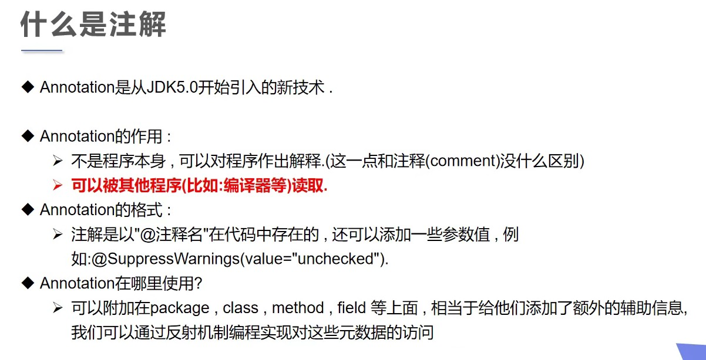

### 内置注解

```java
// 此注解只用于修饰方法，表示该方法是重写的方法
@Override

// 此注解修饰的属性、方法、类不推荐程序员使用，但是可以使用，或者推荐更好的方式
@Deprecated

// 镇压警告，用来修饰方法、类、属性，需要传一个参数，参数是定义好了的，一般不使用，要使用一般传入all，镇压所有警告
@SuppressWarnings("all")
```


### 元注解
用来修饰注解的注解

```java
// 规定注解的修饰范围，传入值如下
@Target(value={ElementType.METHOD,ElementType.TYPE})
/*
    ElementType.CONSTRUCTOR ：构造器

    ElementType.FIELD：属性

    ElementType.LOCAL_VARIABLE：局部变量

    ElementType.METHOD：方法

    ElementType.PACKAGE：包

    ElementType.PARAMETER：参数

    ElementType.TYPE：类、接口（包括注解类型和 enum 声明）
*/

// 规定注解的生命周期，表示注解到什么地方还有效果
// RUNTIME > CLASS > SOURCE
@Retention(value={RetentionPolicy.SOURCE})
/*
RetentionPolicy.SOURCE：源码阶段

RetentionPolicy.CLASS：编译后

RetentionPolicy.RUNTIME：运行时
*/

// 使用此修饰的注解将会被 javadoc 工具提取成文档，使用此注解，其 @Retention 必须被设置为 RetentionPolicy.RUNTIME
@Documented

// 规定注解是否可以被继承
@Inherited
```

### 自定义注解
```java
// 基本格式
// public @interface 注解名{定义内容}

// 测试类
public class Test02 {
    @Annotation(age = 18)
    public void test() {}
    
    @Annotation2("")
    public void test2() {}
}

@Target({ElementType.TYPE,ElementType.METHOD})
@Retention(RetentionPolicy.RUNTIME)
@interface Annotation {
    // 注解的参数 ： 参数类型 + 参数名();
    // 用default来设置默认值
    String name() default "";
    int age();
    int id() default -1; // 如果默认值为-1，代表不存在
    String[] schools() default  {"北京大学","清华大学"};
}

@Target({ElementType.TYPE,ElementType.METHOD})
@Retention(RetentionPolicy.RUNTIME)
@interface Annotation2 {
    //如果只有一个参数，默认设置其名字为value，在使用时就可简写，不用写参数名，直接传值即可
    String value();
}
```

## 反射
概念：类加载之后，在堆内存的方法区中就生产了一个Class类型的对象，`一个类只有一个Class对象`，这个对象就包含了完整的类的结构信息。我们可以通过这个对象看到类的结构，这个对象就像是一面镜子，透过这个镜子看到类的结构，称之为反射

> 正常方式：引入需要的"包类"名称 ==> 通过new实例化 ==>获取实例化对象
> 反射方式：实例化对象 ==> getClass()方法 ==> 取得完整的"包类"名称

- 优点：可以实现动态创建对象和编译，体现出很大的灵活性
- 缺点：对性能有影响。使用反射基本上是一种解释操作，我们告诉JVM要做什么，这类操作总是慢于直接执行相同的操作
一个类只有一个Class对象

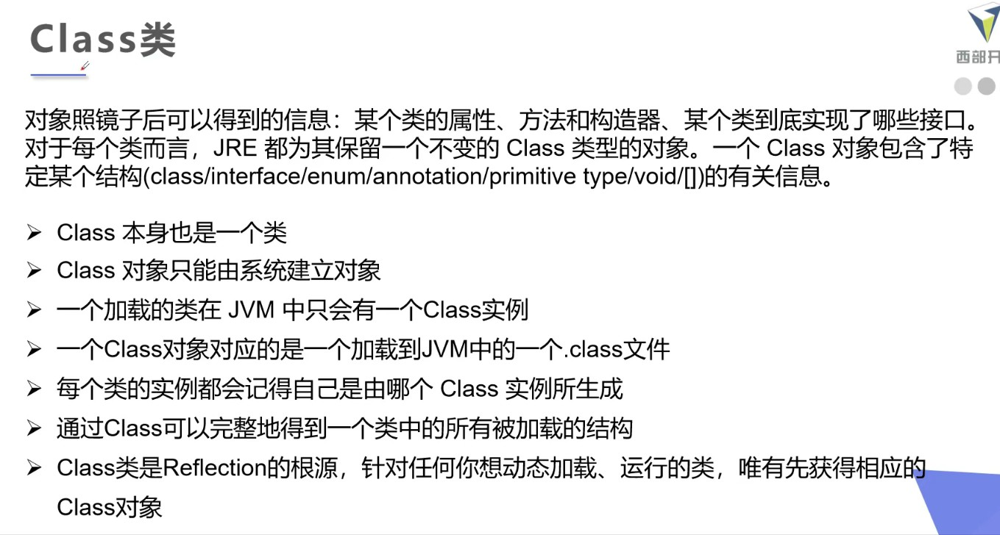

### 获取Class对象的几种方式

```java
// 测试类
public class Test02 {
    public static void main(String[] args) throws ClassNotFoundException {
        Person student = new Studnet();

        // 方式一：通过对象获取
        Class c1 = student.getClass();
        System.out.println(c1.hashCode());

        // 方式二：forName获取
        Class c2 = Class.forName("Student");
        System.out.println(c2.hashCode());

        // 方式三：通过类名.class获取
        Class c3 = Student.class;
        System.out.println(c3.hashCode());

        // 方式四：对于基本数据类型，可以使用其包装类的TYPE属性获取
        Class c4 = Integer.TYPE;
        System.out.println(c4);
    }
}

class Studnet extends Person{

}

class Person {

}
```

### 所有类型的Class对象
```java
// 所有类型的Class
public class Test02 {
    public static void main(String[] args) {
        Class c1 = Object.class; //类
        Class c2 = Comparable.class; //接口
        Class c3 = String[].class; //一维数组
        Class c4 = int[][].class; //二维数组
        Class c5 = Override.class; //注解
        Class c6 = ElementType.class; //枚举
        Class c7 = Integer.class;  //基本数据类型
        Class c8 = void.class; //void
        Class c9 = Class.class; //Class

        System.out.println(c1);
        System.out.println(c2);
        System.out.println(c3);
        System.out.println(c4);
        System.out.println(c5);
        System.out.println(c6);
        System.out.println(c7);
        System.out.println(c8);
        System.out.println(c9);
    }
}
```

### Class对象获取类信息
```java
// Class获取类的信息
public class Test02 {
    public static void main(String[] args) throws ClassNotFoundException, NoSuchFieldException, NoSuchMethodException {
        Class c1 = Class.forName("Student");

        System.out.println(c1.getName()); // 获得包名 + 类名
        System.out.println(c1.getSimpleName()); // 获得类名

        // 获得类的public属性
        Field[] fields = c1.getFields();
        for (Field field : fields) {
            System.out.println(field);
        }
        // 获取类的所有属性
        fields = c1.getDeclaredFields();
        for (Field field : fields) {
            System.out.println(field);
        }

        // 获取指定属性
        Field name = c1.getDeclaredField("name");
        System.out.println(name);

        //获取类的方法：除了类自身的方法外，还会获取所继承的类中的方法
        System.out.println("===============================");
        Method[] methods = c1.getMethods();
        for (Method method : methods) {
            System.out.println(method);
        }
        methods = c1.getDeclaredMethods();
        for (Method method : methods) {
            System.out.println(method);
        }

        // 获取指定方法
        Method getName = c1.getMethod("getName",null);
        Method setName = c1.getMethod("setName", String.class);
        System.out.println(getName);
        System.out.println(setName);

        // 获取构造器
        System.out.println("===============================");
        Constructor[] constructors = c1.getConstructors();
        for (Constructor constructor : constructors) {
            System.out.println(constructor);
        }
        constructors = c1.getDeclaredConstructors();
        for (Constructor constructor : constructors) {
            System.out.println(constructor);
        }

        // 获取指定构造器
        Constructor declaredConstructor = c1.getDeclaredConstructor(String.class,int.class);
        System.out.println(declaredConstructor);
    }
}
```

## 类的加载过程

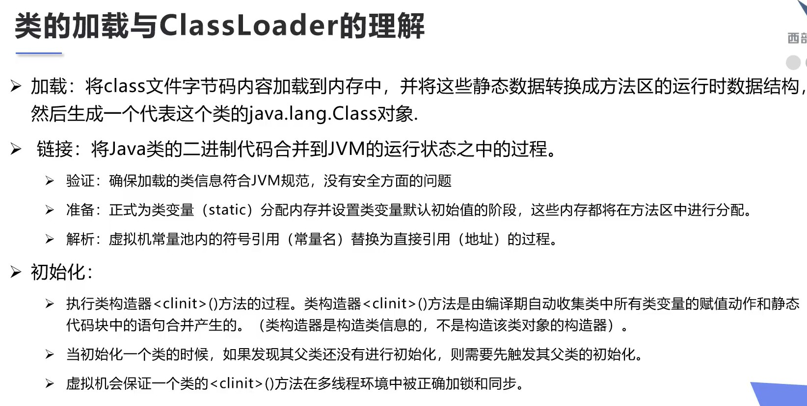


```java
// 测试类的初始化过程
public class Test02 {
    static {
        System.out.println("Main类被加载");
    }

    public static void main(String[] args) throws ClassNotFoundException {
        // 主动引用
        //Son son = new Son();

        // 反射也会产生主动引用
        Class.forName("Son");

        // 被动引用不会引起类的初始化
        System.out.println(Son.b);

        Son[] array = new Son[5];

        System.out.println(Son.M);
    }
}

class Father {
    static int b = 2;
    static {
        System.out.println("父类被加载");
    }
}

class Son extends Father {
    static {
        System.out.println("子类被加载");
    }

    static int m = 100;
    static final int M = 1;
}
```

## 类加载器

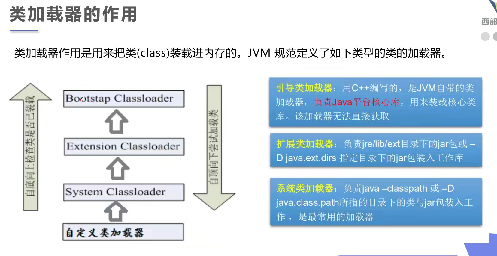

```java
// 测试类的初始化过程
public class Test02 {

    public static void main(String[] args) throws ClassNotFoundException {
        // 获取系统类加载器
        ClassLoader systemClassLoader = ClassLoader.getSystemClassLoader();
        System.out.println(systemClassLoader);

        // 获取系统类加载器的父类加载器(扩展类加载器)
        ClassLoader parent = systemClassLoader.getParent();
        System.out.println(parent);

        //获取扩展类加载器的父类加载器(根加载器)
        ClassLoader parent1 = parent.getParent();
        System.out.println(parent1);

        //测试当前类是哪个加载器加载的
        ClassLoader classLoader = Class.forName("Test02").getClassLoader();
        System.out.println(classLoader);

        //测试JDK内置的类是哪个加载器加载的
        classLoader = Class.forName("java.lang.Object").getClassLoader();
        System.out.println(classLoader);

    }
}
```

### 双亲委派机制
- 描述：某个特定的类加载器在接到加载类的请求时，首先将加载任务委托给父类加载器，依次递归，如果父类加载器可以完成类加载任务，就成功返回；只有父类加载器无法完成此加载任务时，才自己去加载。

- 意义：防止内存中出现多份同样的字节码

## 反射操作对象

```java
// 通过反射，动态创建对象
public class Test02 {
    public static void main(String[] args) throws ClassNotFoundException, NoSuchFieldException, NoSuchMethodException, InstantiationException, IllegalAccessException, InvocationTargetException {
        // 获得Class对象
        Class c1 = Class.forName("Student");

        // 通过反射构建一个对象
        Student student = (Student) c1.newInstance();

        // 通过构造器构建对象
        Constructor constructor = c1.getDeclaredConstructor(String.class,int.class);
        Student student1 = (Student)constructor.newInstance("小明",18);

        // 通过反射直接调用方法
        Student student2 = (Student) c1.newInstance();
        // 通过反射获取一个方法
        Method setName = c1.getDeclaredMethod("setName",String.class);
        // invoke激活获取的方法
        setName.invoke(student2,"张三");
        System.out.println(student2);

        // 通过反射操作属性
        Student student3 = new Student();
        Field name = c1.getDeclaredField("name");
        // 对于私有属性，不能直接操作，需要关闭程序的安全检测,true为关闭
        name.setAccessible(true);
        name.set(student3,"李四");
        System.out.println(student3);
    }
}
```

## 反射操作泛型
```java
// 反射操作泛型
public class Test02 {
    public static void main(String[] args) throws NoSuchMethodException {
        Method method = Test02.class.getMethod("test1", Map.class, List.class);
        // 获得泛型参数列表
        Type[] genericParameterTypes = method.getGenericParameterTypes();
        for (Type genericParameterType : genericParameterTypes) {
            System.out.println(genericParameterType);
            if (genericParameterType instanceof ParameterizedType) {
                // 遍历参数列表内的泛型信息
                Type[] actualTypeArguments = ((ParameterizedType) genericParameterType).getActualTypeArguments();
                for (Type actualTypeArgument : actualTypeArguments) {
                    System.out.println(actualTypeArgument);
                }
            }
        }

        method = Test02.class.getMethod("test2",null);
        // 获取泛型返回值
        Type genericReturnType = method.getGenericReturnType();
        if (genericReturnType instanceof  ParameterizedType) {
            Type[] actualTypeArguments = ((ParameterizedType) genericReturnType).getActualTypeArguments();
            // 遍历返回值内的泛型参数
            for (Type actualTypeArgument : actualTypeArguments) {
                System.out.println(actualTypeArgument);
            }
        }

    }

    public void test1(Map<String,String> map, List<String> list) {
        System.out.println("test01");
    }

    public List<String> test2() {
        return null;
    }
}
```

## 反射操作注解
```java
// 反射操作泛型
public class Test02 {
    public static void main(String[] args) throws NoSuchMethodException, ClassNotFoundException, NoSuchFieldException {
        Class c1 = Class.forName("Student");
        // 获取注解
        Annotation[] annotations = c1.getAnnotations();
        for (Annotation annotation : annotations) {
            System.out.println(annotation);
        }

        // 获取指定的类注解的值
        MyAnnotation annotation = (MyAnnotation) c1.getAnnotation(MyAnnotation.class);
        System.out.println(annotation.value());

        // 获取指定的属性注解的值
        Field f = c1.getDeclaredField("name");
        MyAnnotation2 annotation1 = f.getAnnotation(MyAnnotation2.class);
        System.out.println(annotation1.columnName());
        System.out.println(annotation1.type());
        System.out.println(annotation1.length());
    }
}

@MyAnnotation("student")
class Student {
    @MyAnnotation2(columnName = "name",type = "String",length = 10)
    private String name;
    @MyAnnotation2(columnName = "age",type = "int",length = 4)
    private int age;

    public Student() {
    }

    public Student(String name, int age) {
        this.name = name;
        this.age = age;
    }

    public String getName() {
        return name;
    }

    public void setName(String name) {
        this.name = name;
    }

    public int getAge() {
        return age;
    }

    public void setAge(int age) {
        this.age = age;
    }

    @Override
    public String toString() {
        return "Student{" +
                "name='" + name + '\'' +
                ", age=" + age +
                '}';
    }
}

// 类的注解
@Target(ElementType.TYPE)
@Retention(RetentionPolicy.RUNTIME)
@interface MyAnnotation {
    String value();
}

// 属性的注解
@Target(ElementType.FIELD)
@Retention(RetentionPolicy.RUNTIME)
@interface MyAnnotation2 {
    String columnName();
    String type();
    int length();
}
```