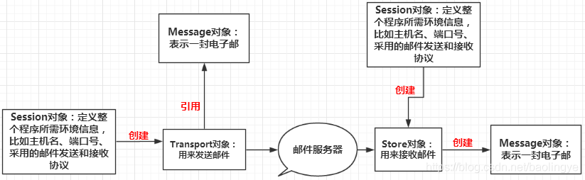

## 数据库字段类型
```
Java   MySql
byte   tinyint
short  smallint
int    int
long   bigint
float  float
double double
char/String  char/varchar  
            char(8) 不够8位用空格补齐，超出8位报错 varchar(8) 存入几位就是几位，超出8位报错
Date  date/time/datetime/timestamp
        datetime如果未存值，会用null填充
        timestamp如果未存值，会用当前系统时间填充
File   BLOB/TEXT
```

## SQL语句
数据库操作
1. 创建数据库
```
create database 数据库名称 [character 字符集 collate 字符集校对规则]
```

2. 查看数据库
```
简单展示所有数据库
show databases

查看某一个数据库的定义信息
show create database 数据库名称
```

3. 修改数据库
```
alter database 数据库名称 character set 字符集 collate 校对规则
```

4. 删除数据库
```
drop database 数据库名
```

5. 查看当前所在数据库
```
select database()
```

表操作
1. 创建表
```
create table 表名(字段名 字段类型(长度) 约束,字段名 字段类型(长度) 约束)
```

2. 查看表
```
查看某个数据库下的所有表
show tables

查看某个表的结构信息
describe 表名
简写
desc 表名
```

3. 删除表
```
drop table 表名
```

4. 修改表
```
添加列
alter table 表名 add 列名 类型(长度) 约束

修改列的类型、长度、约束
alter table 表名 modify 列名 类型(长度) 约束

删除列
alter table 表名 drop 列名

修改列名
alter table 表名 change 旧列名 新列名 类型(长度) 约束

修改表名
rename table 旧表名 to 新表名

修改表的字符集
alter table 表名 character set 字符集
```

表中数据操作
1. 添加表记录
```
向表中插入某些列
insert into 表名 (列名1,列名2...) values(值1,值2...)

向表中插入所有列
insert into 表名 values(值1,值2,值3...)

注:值的类型是字符串或者是日期类型，使用单引号引起来
```

2. 修改表记录
```
update 表名 set 列名=值,列名=值 [where 条件]
```

3. 删除表记录
```
删除表中某一行记录
delete from 表名 [where 条件]

删除表中所有记录
delete from 表名 //一条一条地删除，属于DML语句

truncate table user //删除整表，复制出有相同结构的表，属于DDL语句
```

4. 查询表记录
```
普通查询
distinct用于去掉重复值
select [distinct] * 列名 from 表名 [where 条件]

给查询列取别名显示
select [distinct] * 列名 别名 from 表名 [where 条件]

条件查询
where子句
>、<、>=、<=、<>、=
like 模糊查询
in 范围查询
条件关联and、or、not

排序查询
order by 字段名称 asc/desc //升序/降序  默认升序

多个排序条件
order by 字段1 asc/desc,字段2 asc/desc

聚合函数
括号里面放列名
sum() 求和
count() 计数
max() 最大值
min() 最小值
avg() 平均值

分组查询
group by 字段名
筛选分组后的结果用having
group by score having score>50
```

## 约束
添加外键
```
alter table 表名 add foreign key(字段) references 指向表名(字段)
```

## 多表设计
一对多:在多的一方创建外键指向一的一方的主键

多对多:需要创建第三张表(中间表),在中间表中至少有两个字段分别作为外键，指向多对多双方的主键

一对一:假设一对一是一个一对多关系，需要在多的一方创建外键指向一的一方的主键，将外键设置为唯一(unique)

## 多表查询
连接查询
1. 交叉查询 cross join
```
查询到两个表的笛卡尔积

select * from 表1 cross join 表2

selext * from 表1,表2
```

2. 内连接 inner join(inner可省略)
```
显式内连接
select * from 表1 inner join 表2 on 关联条件

隐式内连接
select * from 表1,表2 where 关联条件
```

3. 外连接 outer join(outer可省略)
```
左外连接
select * from 表1 left outer join 表2 on 关联条件

右外连接
select * from 表1 right outer join 表2 on 关联条件
```

子查询
```
带in的子查询
select * from 表1 where 字段 in (子查询语句)

带exists的子查询
select * from 表1 where exists (子查询语句)  //子查询语句成立，显示查询结果

带any的子查询
select * from 表1 where 字段 > any (子查询语句)

带all的子查询
select * from 表1 where 字段 > all (子查询语句)
```

合并查询结果
```
union 合并后去重
select column_name(s) from table_name1
union
select column_name(s) from table_name2

union all 只合并，不去重
select column_name(s) from table_name1
union all
select column_name(s) from table_name2
```

## 标量函数
作用于单一值的函数，有一个返回值
```
abs：该函数返回一个数值表达式的绝对值。如abs(-123);
addtime：把两个时间表达式加起来。如addtime('100:00:00','200:02:04');
concat：该函数合并两个字符串的值。
convert：该函数转换参数1的数据类型为参数2指定的类型。如：convert('12.56',unsigned integer);
```

## Date函数
```
now()
返回当前的日期和时间
curdate()
返回当前的日期
curtime()
返回当前的时间
date(exp)
提取日期或日期/时间表达式的日期部分
select date('2018-09-07');
date_add()
给日期添加指定的时间间隔,如：
select date_add('2018-05-12',interval 2 minute)
date_sub()
从日期减去指定的时间间隔，如：
select date_sub('2018-05-12',interval 2 day)
datediff()
返回两个日期之间的天数，如：
select datediff('2018-05-12','2018-05-10')
date_format()
用不同的格式显示日期/时间，如：
select date_format(now(),'%b %d %y %h:%i %p')
```

## 事务
事务指的是逻辑上的一组操作，组成这组操作的各个逻辑单元，要么全部成功，要么全部失败

事务流程
```
开启事务
start transaction

提交事务
commit

回滚事务
rollbak
```

JDBC中的事务管理
```
//开启事务(写于获取连接后)
conn.setAutoCommit(false);

//提交事务(写于SQL语句执行完毕后)
conn.commit();

//回滚事务(写于异常)
conn.rollback();
```

## 连接池

连接池是创建和管理一个连接的缓冲池的技术，这些连接准备好被任何需要它们的线程使用

连接池是装有连接的容器，使用连接的话，可以从连接池中获取，使用完成后将连接归还给连接池

Druid是阿里旗下的开源连接池，可以与Spring快速整合

## MVC开发模式
```
C: controller

M：model，业务模型层，完成业务处理
    dao层：直接操作数据库
    service层：调用dao层来完成业务实现，负责管理所调用的dao层

V：view 视图层，将处理结果响应到界面


Dao层角色：
  Dao接口层
  Dao实现层
Dao层命名规则：
  Dao接口层：com.xxx.dao [接口]：表名Dao
  Dao实现层：com.xxx.daoImpl [实现类]：表名DaoImpl

service层角色：
  service接口层
  service实现层
service层命名规则：
  service接口层：com.xxx.service [接口]:单表用表名Service，多表用业务名Service
  service实现层：com.xxx.service [接口]:单表用表名ServiceImpl，多表用业务名ServiceImpl
```

## Servlet
1. 创建javaweb Maven项目
2. pom.xml中导入servlrt依赖
```xml
<dependency>
    <groupId>javax.servlet</groupId>
    <artifactId>javax.servlet-api</artifactId>
    <version>4.0.1</version>
    <scope>provided</scope>
</dependency>
```
3. 创建类，调用Servlet接口，导入包和方法
4. 配置web.xml文件，添加如下配置
```xml
<!-- 配置servlet类 -->
<servlet>
    <!-- 别名，任意取 -->
    <servlet-name>my</servlet-name>
    <!-- 类路径 -->
    <servlet-class>com.test.servlet.Servlet01</servlet-class>
    <!-- 启动优先级，一般不用 -->
    <load-on-startup>0</load-on-startup>
</servlet>

<!-- 配置servlet映射 -->
<servlet-mapping>
    <servlet-name>my</servlet-name>
    <!-- 访问路径 -->
    <url-pattern>/myservlet</url-pattern>
</servlet-mapping>
```
5. Servlet3.0之后可以用注解方式来进行配置，如下
```java
@WebServlet(value = { "/ls" , "/demo" },loadOnStartup = 0)
public class Servlet01 extends HttpServlet {}
```

Servlet的三种使用方式
1. 调用Servlet接口，重写5个方法
2. 继承GenericServlet类，重写service方法
3. 继承HttpServlet类，重写doPost和doGet方法，分开处理两种类型的请求 (常用)

对传入的对象设置编码格式，用于解决表单提交时，post方法后台接收中文乱码问题
```java
req.setCharacterEncoding("utf-8");
```

设置响应内容的编码格式,用于响应内容回显时乱码问题
```java
response.setContentType("text/html;charset=UTF-8");
```

回显信息到页面
```java
PrintWriter printWriter = resp.getWriter();
printWriter.println("成功");
```

转发
多个资源共同处理同一个请求，地址栏不发生变化
```java
req.getRequestDispatcher("/xxx").forward(req,resp);
```

通过请求在服务器不同资源间传递数据
```java
req.setAttribute("键","值");
req.getAttribute("键");
```

重定向
重定向跳转相当于两次请求，所以无法通过请求进行数据传递
```java
resp.sendRedirect("/xxxx/demo");
```

Servlet的生命周期
1. 实例化
2. init 初始化
3. service 服务 多次
4. destory 销毁

## 文件下载
```java
@WebServlet("/downloadServlet")
public class DownloadServlet extends HttpServlet {
    protected void doPost(HttpServletRequest request, HttpServletResponse response) throws ServletException, IOException {
        //获得请求文件名
        String filename = request.getParameter("filename");
        System.out.println(filename);

        //设置文件MIME类型
        response.setContentType(getServletContext().getMimeType(filename));
        //设置Content-Disposition
        response.setHeader("Content-Disposition", "attachment;filename="+filename);
        //读取目标文件，通过response将目标文件写到客户端
        //获取目标文件的绝对路径
        String fullFileName = getServletContext().getRealPath("/download/" + filename);
        //System.out.println(fullFileName);
        //读取文件
        InputStream in = new FileInputStream(fullFileName);
        OutputStream out = response.getOutputStream();
        byte[] buffer = new byte[1024];
        int len;
        //循环取出流中的数据
        while((len = in.read(buffer)) != -1){
            out.write(buffer,0,len);
        }

        in.close();
        out.close();
    }

    protected void doGet(HttpServletRequest request, HttpServletResponse response) throws ServletException, IOException {
        this.doPost(request, response);
    }
}
```

## Cookie
1. 创建Cookie
```java
// 创建Cookie对象
Cookie cookie = new Cookie("键","值");
// 设置Cookie的访问路径
cookie.setPath("/demo"); //只对demo路径下的资源生效
// 设置Cookie的时效,>0 表示多少秒,=0 浏览器关闭,<0 浏览器关闭 ,默认-1
cookie.setMaxAge(-1);
// 将Cookie响应给客户端
resp.addCookie(cookie);
```
2. 获取Cookie
```java
Cookie[] cookies = req.getCookies();

for(Cookie cookie : cookies){
  system.out.println("name" + cookie.getName() + "value" + cookie.getValue());
}
```
3. 修改
当新设置的cookie与已存在的cookie的键值对和路径都相同时，会发生覆盖，时效会以新的cookie为准

设置和获取中文cookie
```java
// 设置
Cookie cookie = new Cookie(URLEncoder.encode("姓名","UTF-8"),URLEncoder.encode("张三","UTF-8"));
// 获取
Cookie[] cookies = req.getCookies();

for(Cookie cookie : cookies){
  system.out.println("name" + URLDecoder.decode(cookie.getName(),"UTF-8") + "value" + URLDecoder.decode(cookie.getValue(),"UTF-8"));
}
```

## Session
```java
// 通过request对象获取Session对象，Session对象是客户端第一次请求服务端自动创建的
HttpSession session = request.getSession();
// SessionID值是打开客户端时就自动创建的，会存放在Cookie里面，会话关闭后自动销毁
System.out.println(session.getId());
```

### 操作session
```java
// 在同一次会话的任意位置，使用到的session是同一个
HttpSession session = request.getSession();
// 设置session
session.setAttribute("键","值")
// 获取session值
session.getAttribute("键")
// 移除session
session.removeAttribute("键")
```

### session生命周期
1. 浏览器关闭时自动销毁
2. session超出时效，自动销毁
```java
// 设置session时效，单位秒，设置为负数永不失效
session.setMaxInactiveInterval(10)
```
```xml
<!--xml方式设置Session默认的失效时间-->
<session-config>
  <!--15分钟后Session自动失效，以分钟为单位-->
  <session-timeout>15</session-timeout>
</session-config>
```
3. 手动销毁
```java
session.invalidate();
```

## ServletContext
ServletContext是一个全局对象，项目启动时自动创建，项目关闭时才销毁，可应通过它来实现数据共享，但是不建议使用，因为获取多个ServletContext会占用服务器资源，我们一般使用session
获取ServletContext对象的三种方式
```java
// 通过HttpServlet获取
ServletContext servletContext = this.getServletContext();
// 通过request对象获取
ServletContext servletContext = request.getServletContext();
// 通过session对象获取
ServletContext servletContext = session.getServletContext();
```

## Session应用场景
1. 临时数据传递：HttpServletRequest
2. 登录状态管理：HttpSession
3. 访问次数统计：ServletContext

## 过滤器
过滤器是存在于客户端和服务端之间的一道程序，主要是为了解决多个Servlet共性代码冗余的问题

1. 创建过滤器
创建一个java类，继承Filter接口
```java
public class Demo implements Filter {

}
```
2. 让请求继续传递
```java
filterChain.doFilter(servletRequest,servletResponse);
```
3. web.xml配置Filter
```xml
<filter>
    <!-- 别名，任意取 -->
    <filter-name>my</filter-name>
    <!-- 类路径 -->
    <filter-class>com.test.filter.Filter</filter-class>
    <!-- 启动优先级 -->
    <load-on-startup>0</load-on-startup>
</filter>

<filter-mapping>
    <filter-name>my</filter-name>
    <!-- 拦截的资源路径，任意取 -->
    <url-pattern>/myservlet</url-pattern>
</filter-mapping>
```
4. 注解配置过滤器
```java
@WebFilter(value = "拦截的资源路径")
```
在一个Web应用中，可以开发编写多个Filter，这些Filter组合起来称为一个Filter链

Filter优先级
- 如果都为注解配置，按照类名的字符串顺序排列
- 如果都为xml配置，按照编写顺序，从上到下排列
- 如果xml优先级高于注解
- 如果既有注解，又有xml，会进行多次过滤

过滤器完成权限验证
```java
// 拆箱，完成类型转换
HttpServletRequest request = (HttpServletRequest)servletRequest;
HttpServletRequest response = (HttpServletResponse)servletResponse;
//获取session对象
HttpSession session = request.getSession();
//获取session内的信息
String str = (String)session.getAttribute("键");
//判断
if( str != null ){
  filterChain.doFilter(request,response);
}else{
  response.sendRedirect("/xxx/login.html");
}
```

## JSP
- JSP是服务端页面，简化了servlet回传页面的功能
- JSP本质上就是一个Servlet，在Tomcat服务器的工作区我们可以看到，jsp页面在运行时都被转换为了java文件，进行执行，查看此文件我们可以发现，它将我们所写的所有页面元素转换为了Java中的写法

### jsp基础语法
注解
```jsp
<!-- 这是html注解，会解析到DOM树中 -->

<%
  //这是java注释，会被解析到编译出的java源文件中
%>

<%--  这是jsp隐藏注释，只能在jsp中看见，编译时不会被解析 --%>
```
jsp表达式
```jsp
<%-- jsp表达式
    作用：用来将程雪输出，写到客户端
    <%= 变量名/表达式%>
--%>
<%= new java.util.Date()%>
```
jsp脚本片段
```jsp
<%-- jsp脚本片段 --%>
<%
    int sum=0;
    for (int i = 0; i < 10; i++) {
        sum+=i;
    }
    out.println("<h1>Sum="+sum+"</h1>");
%>
<%-- 嵌入正常的标签 --%>
<%
    int x=10;
    out.print(x);
%>
<p>这是一个jsp文档</p>
<%
    int y=20;
    out.print(20);
%>
<%-- ------------------------------------ --%>
<%-- 在代码中嵌入html元素 --%>
<%
    for (int i = 0; i < 5; i++) {
%>
<h1>HelloWorld,<%= new java.util.Date()%></h1>
<%
    }
%>
```
```jsp
<%-- 在代码中嵌入html元素 --%>
<%
    for (int i = 0; i < 5; i++) {
%>
<h1>HelloWorld,<%= new java.util.Date()%></h1>
<%
    }
%>
```

### jsp指令
JSP指令元素的分类
- page指令：指示JSP的页面设置属性和行为
- include指令：指示JSP包含哪些其他页面
- taglib指令：指示JSP页面包含哪些标签库

xml配置错误页
```xml
<error-page>
    <error-code>404</error-code>
    <location>/error/404.jsp</location>
</error-page>
<error-page>
    <error-code>500</error-code>
    <location>/error/500.jsp</location>
</error-page>
```

指令语法
```jsp
<%@ 指令名 属性名=属性值 属性名=属性值 %>
```
page指令的常用属性
```
import属性：用于导入包或类
contentType属性：标明JSP被浏览器解析和打开的时候采用的默认字符集
pageEncoding属性：JSP文件及编译后的Servlet保存到硬盘上采用的字符集
```
```jsp
<!-- 导入jar包 -->
<%@ page import="java.util.Date" %>
<!-- 指定错误页面 -->
<%@ page errorPage="error/500.jsp" %>
<!-- 显示的声明这是一个错误页面 -->
<%@ page isErrorPage="true" %>
<!-- 页面编码格式 -->
<%@ page pageEncoding="utf-8" %>
```

include指令(静态联编)
用于包含页面，实质是将第二个页面完整复制了一份到第一个页面，编译时两个页面编入同一个java文件中，所以是先复制，在编译的顺序，如果两个文件中都使用了java代码，可能会存在变量冲突的问题
```jsp
<!-- page1 -->
befor
<%@ include file="/page2.jsp" %>
after
```

静态联编和动态联编的区别
- 静态联编编译出一个Java文件
- 动态联编编译出多个Java文件

静态联编和动态联编的应用场景
- 在静态联编和动态联编都可用时，一般用动态联编
- 需要共享变量时，使用静态联编
- 存在同名变量需要区分时，用动态联编

### 9大内置对象
- PageContext
- Request
- Response
- Session
- Application
- config
- out
- page
- exception

四种作用域
```jsp
<%
  pageContext.setAttribute("name1","val1"); // 仅在页面生效
  request.setAttribute("name2","val2"); // 在一次请求中生效
  session.setAttribute("name3","val3"); // 在一次会话中生效(打开浏览器到关闭浏览器)
  application.setAttribute("name4","val4"); //在服务器中生效，从服务器打开到关闭
%>
```

## JSP标签、JSTL标签、EL表达式
### JSP标签
```jsp
<!-- forward是转发 -->
<jsp:forward page="/page2.jsp" />
<!-- include是包含，是动态联编 -->
<jsp:include page="/page2.jsp"/>
```

### JSTL标签
引入标签核心库
```jsp
<%@ taglib prefix="c" uri="http://java.sun.com/jsp/jstl/core" %>
```
```jsp
<!-- 用于在JSP中显示数据，就像<%= ... > -->
<c:out>
<!-- 用于保存数据 -->
<c:set>
<!-- 用于删除数据 -->
<c:remove>
<!-- 与我们在一般程序中用的if一样 -->
<c:if>
<!-- 本身只当做<c:when>和<c:otherwise>的父标签 -->
<c:choose>
<!-- <c:choose>的子标签，用来判断条件是否成立 -->
<c:when>
<!-- <c:choose>的子标签，接在<c:when>标签后，当<c:when>标签判断为false时被执行 -->
<c:otherwise>
<!-- 基础迭代标签，接受多种集合类型 -->
<c:forEach>    
<!-- 使用可选的查询参数来创造一个URL -->
<c:url>
```
c:if
```jsp
<%@ page contenttype="text/html;charset=utf-8" language="java" %>
<%--引入jstl核心标签库，我们才能使用核心标签--%>
<%@ taglib prefix="c" uri="http://java.sun.com/jsp/jstl/core" %>
<html>
<head>
<title>title</title>
</head>
<body>
<h4>if测试</h4>
<hr>
<form action="jstlcore1.jsp" method="get">
<%--
    el表达式获取表单中的数据：
    ${param.参数名}
--%>
<input type="text" name="username" value="${param.username}">
<input type="submit" value="登录">
</form>
<%--判断如果是管理员就登陆成功--%>
<c:if test="${param.username=='admin'}" scope="page" var="isadmin">
<c:out value="<h3>登录成功<h3>"/>
</c:if>
<c:out value="${isadmin}"/>
</body>
</html>
```
c:choose
```jsp
<%@ taglib prefix="c" uri="http://java.sun.com/jsp/jstl/core" %>
<%@ page contentType="text/html;charset=UTF-8" language="java" %>
<html>
<head>
<title>Title</title>
</head>
<body>
<c:set var="score" value="50"/>
<c:choose>
<c:when test="${score>=60}">
    <c:out value="成绩合格"/>
</c:when>
<c:otherwise>
    <c:out value="需要补考"/>
</c:otherwise>
</c:choose>
</body>
</html>
```
c:forEach
```jsp
<%@ page import="java.util.ArrayList" %>
<%@ page import="java.util.Arrays" %>
<%@ page contentType="text/html;charset=UTF-8" language="java" %>
<%@ taglib prefix="c" uri="http://java.sun.com/jsp/jstl/core" %>
<html>
<head>
    <title>Title</title>
</head>
<body>
<%
    ArrayList<String> array=new ArrayList<>();
    array.add("h1");
    array.add("h2");
    array.add("h3");
    array.add("h4");
    request.setAttribute("list",array);
%>
<%--
    hs 储存便遍历的数据
    items 被遍历的的对象
--%>
<c:forEach var="hs" items="${list}">
    <c:out value="${hs}"/><br>
</c:forEach>
<hr>
<c:forEach var="hs" items="${list}" varStatus="">  
</c:forEach>
</body>
</html>
```

## 过滤器
在客户端与服务端中间加上一层，拦截请求，做出一些特殊处理，比如解决乱码问题
```java
public class CharecterFilter  implements Filter {
    /**
     * web服务器启动执行该方法
     */
    @Override
    public void init(FilterConfig filterConfig) throws ServletException {
        System.out.println("filter初始化了...");
    }
    /**
     * 1. 过滤中的所有代码，在过滤特定请求的时候都会执行
     * 2. 必须要让过滤器继续同行
     * @param req
     * @param resp
     * @param chain
     * @throws IOException
     * @throws ServletException
     */
    @Override
    public void doFilter(ServletRequest req, ServletResponse resp, FilterChain chain) throws IOException, ServletException {
        req.setCharacterEncoding("utf-8");
        resp.setCharacterEncoding("utf-8");
        resp.setContentType("text/html;charset=utf-8");
        System.out.println("filter执行前...");
        chain.doFilter(req,resp); //放行，如果不写，程序会被拦截
        System.out.println("filter执行后...");
    }
    //web服务器关闭，执行方法
    @Override
    public void destroy() {
        System.out.println("filter销毁了...");
    }
}
```
在web.xml中配置
```xml
<filter>
  <filter-name>CharecterFilter</filter-name>
  <filter-class>com.bug.filter.CharecterFilter</filter-class>
</filter>
<filter-mapping>
  <filter-name>CharecterFilter</filter-name>
  <url-pattern>/servlet/*</url-pattern>
</filter-mapping>
```

## 监听器
监测网站在线人数（基于session）
```java
public class OnlineListen implements HttpSessionListener {
    /**
     * 监听session新创建时执行的方法
     * @param se
     */
    @Override
    public void sessionCreated(HttpSessionEvent se) {
        ServletContext sc = se.getSession().getServletContext();
        System.out.println("sessionId:" + se.getSession().getId());
        Integer onlineCount = (Integer) sc.getAttribute("onlineCount");
        if (onlineCount == null) {
            onlineCount = 1;
        } else {
            onlineCount++;
        }
        sc.setAttribute("onlineCount",onlineCount);
    }
    /**
     * 监听session销毁时执行方法
     * @param se
     */
    @Override
    public void sessionDestroyed(HttpSessionEvent se) {
        ServletContext sc = se.getSession().getServletContext();
        Integer onlineCount = (Integer) sc.getAttribute("onlineCount");
        if (onlineCount == null) {
            onlineCount = 0;
        } else {
            getSession().invalidate();
            onlineCount--;
        }
        System.out.println("销毁session了--监听到");
        sc.setAttribute("onlineCount",onlineCount);
    }
}
```
web.xml中配置
```xml
<!--监听器-->
<listener>
  <listener-class>com.bug.listener.OnlineListen</listener-class>
</listener>
```

## 文件上传
### 前端
```jsp
<!-- 文件上传必须为post请求-->
<!-- 表单必须加上一个enctype="multipart/form-data"属性 -->
<!-- 用type="file"的input进行文件上传 -->
<form action="${pageContext.request.contextPath}/upload.do" method="post" enctype="multipart/form-data">
    上传用户: <input type="text" name="username"><br/>
    上传文件：<input type="file" name="file"><br/>
    <input type="submit" value="提交">
</form>
```
### 后端
1. 引入依赖
```xml
<!-- https://mvnrepository.com/artifact/commons-io/commons-io -->
<dependency>
    <groupId>commons-io</groupId>
    <artifactId>commons-io</artifactId>
    <version>2.11.0</version>
</dependency>
<!-- https://mvnrepository.com/artifact/commons-fileupload/commons-fileupload -->
<dependency>
    <groupId>commons-fileupload</groupId>
    <artifactId>commons-fileupload</artifactId>
    <version>1.4</version>
</dependency>
```
2. 文件处理servlet
```java
public class FileUpload extends HttpServlet {
  @Override
  protected void doGet(HttpServletRequest request, HttpServletResponse response) throws ServletException, IOException {
      //判断用户上传的文件是普通表单还是带文件的表单，如果是普通文件直接返回
      if (!ServletFileUpload.isMultipartContent(request)) {
          return;
      }
      //创建文件上传保存的路径，在WEB-INF路径下是安全的，用户无法直接访问上传文件
      //小：上传文件
      String uploadPath = this.getServletContext().getRealPath("/WEB-INF/upload");
      System.out.println(uploadPath);
      File uploadFile = new File(uploadPath);
      if (!uploadFile.exists()){
          uploadFile.mkdir();
      }
      //临时路径,如果文件好过了预期大小，就把他放到一个临时文件中，过几天自动删除，或者提醒用户转存为永久
      //大：临时上传文件---qq
      String tmpPath = this.getServletContext().getRealPath("WEB-INF/tmp");
      File file = new File(tmpPath);
      if (!file.exists()){
          file.mkdir();
      }
      //处理上传的文件，一般通过流来获取，可以使用request.getInputStream(),原生态的文件上传流获取，十分麻烦
      //建议使用 Apache的文件上传组件来实现，common-fileupload，它需要依赖于 commons-io组件；
      //1、创建DiskFileItemFactory对象，处理文件上传路径或大小的限制
      DiskFileItemFactory factory = getDiskFileItemFactory(uploadFile);
      //2、获取ServletFileUpload
      ServletFileUpload upload = getServletFileUpload(factory);
      //3、处理上传的文件
      try {
          String msg = uploadParseRequest(upload,request,uploadPath);
          //将数据发给前端
          request.setAttribute("msg",msg);
          request.getRequestDispatcher("msg.jsp").forward(request,response);
      } catch (FileUploadException e) {
          e.printStackTrace();
      }
  }
  public static DiskFileItemFactory getDiskFileItemFactory(File file){
      DiskFileItemFactory factory = new DiskFileItemFactory();
      //通过这个工厂设置一个缓冲区，当上传的文件大于这个缓冲区的时候，将他放到临时文件中
      factory.setSizeThreshold(1024*1024); //缓冲区大小为1M
      factory.setRepository(file);//临时文件保存的目录，需要一个File
      return factory;
  }
  public static ServletFileUpload getServletFileUpload(DiskFileItemFactory factory){
      ServletFileUpload upload = new ServletFileUpload(factory);
      //监听文件上传进度
      upload.setProgressListener(new ProgressListener() {
          @Override
          //pBytesRead:已经读取到的文件大小
          //pContentLength ： 文件大小
          public void update(long pBytesRead, long pContentLength, int pItems) {
              System.out.println("总大小："+pContentLength+"已上传"+pBytesRead);
          }
      });
      //处理乱码问题
      upload.setHeaderEncoding("utf-8");
      //设置单个文件的最大值
      upload.setFileSizeMax(1024*1024*10);
      //设置总共能够上传文件的大小
      upload.setSizeMax(1024 * 1024 * 10);
      return upload;
  }
  public static String uploadParseRequest(ServletFileUpload upload, HttpServletRequest request, String uploadPath) throws FileUploadException, IOException {
      String msg = "";
      //把前端请求解析，封装成一个FileItem对象（表单中的输入项）
      List<FileItem> fileItems = upload.parseRequest(request);
      for (FileItem fileItem : fileItems) {
          if (fileItem.isFormField()){
              String name = fileItem.getFieldName();
              String value = fileItem.getString("UTF-8");
              System.out.println(name+":"+value);
          }else {
              //****************************处理文件****************************
              //拿到文件名字
              String uploadFileName = fileItem.getName();
              System.out.println("上传的文件名："+uploadFileName);
              if (uploadFileName.trim().equals("") || uploadFileName==null){
                  continue;
              }
              //获得上传的文件名
              String fileName = uploadFileName.substring(uploadFileName.lastIndexOf("/")+1);
              //获得文件的后缀名
              String fileExName = uploadFileName.substring(uploadFileName.lastIndexOf(".")+1);
              /*
              * 如果文件后缀名fileExName不是所需的直接return，不进行处理，告诉用户文件类型不对
              * */
              System.out.println("文件信息 [文件名："+fileName+"---文件类型"+fileExName+"]");
              //可以使用UUID（唯一识别通用码）保证文件名唯一
              String uuidPath = UUID.randomUUID().toString();
              //****************************处理文件完毕****************************
              //真实存在的路径
              String realPath = uploadPath+"/"+uuidPath;
              //给每个文件创建一个对应的文件夹
              File realPathFile = new File(realPath);
              if (!realPathFile.exists()){
                  realPathFile.mkdir();
              }
              //****************************存放地址完毕*****************************
              //获得文件上传的流
              InputStream inputStream = fileItem.getInputStream();
              //创建一个文件输出流
              //realPath是真实的文件夹
              FileOutputStream fos = new FileOutputStream(realPath + "/"+fileName);
              //创建一个缓冲区
              byte[] buffer = new byte[1024 * 1024];
              //判断是否读取完毕
              int len = 0;
              while ((len=inputStream.read(buffer))>0){
                  fos.write(buffer,0,len);
              }
              //关闭流
              fos.close();
              inputStream.close();
              msg = "文件上传成功";
              fileItem.delete();//上传成功，清除临时文件
              //*************************文件传输完毕**************************
          }
      }
      return msg;
  }
}
```

## 邮件发送

### 基本原理
要在网络上实现邮件功能，必须要有专门的邮件服务器。这些邮件服务器类似于现实生活中的邮局，它主要负责接收用户投递过来的邮件，并把邮件投递到邮件接收者的电子邮箱中。
邮件的收发遵循两种协议：
- SMTP协议：通常把处理用户smtp请求(邮件发送请求)的服务器称之为SMTP服务器(邮件发送服务器)。
- POP3协议：通常把处理用户pop3请求(邮件接收请求)的服务器称之为POP3服务器(邮件接收服务器)。

SMTP服务器地址：一般是 smtp.xxx.com，比如163邮箱是smtp.163.com，qq邮箱是smtp.qq.com。

### Java邮件发送流程



### 发送简单邮件
1. 导入依赖
```xml
<!-- https://mvnrepository.com/artifact/mail.jar/mail.jar -->
<dependency>
    <groupId>mail.jar</groupId>
    <artifactId>mail.jar</artifactId>
    <version>1.4</version>
</dependency>
<!-- https://mvnrepository.com/artifact/javax.activation/activation -->
<dependency>
    <groupId>javax.activation</groupId>
    <artifactId>activation</artifactId>
    <version>1.1.1</version>
</dependency>
```
2. 编写发送类
```java
public class SendEamil {
    public static void main(String[] args) throws MessagingException, GeneralSecurityException {
        //创建一个配置文件并保存
        Properties properties = new Properties();
        properties.setProperty("mail.host","smtp.qq.com");
        properties.setProperty("mail.transport.protocol","smtp");
        properties.setProperty("mail.smtp.auth","true");
        //QQ存在一个特性设置SSL加密，其他邮箱不用编写
        MailSSLSocketFactory sf = new MailSSLSocketFactory();
        sf.setTrustAllHosts(true);
        properties.put("mail.smtp.ssl.enable", "true");
        properties.put("mail.smtp.ssl.socketFactory", sf);
        //创建一个session对象
        Session session = Session.getDefaultInstance(properties, new Authenticator() {
            @Override
            protected PasswordAuthentication getPasswordAuthentication() {
                return new PasswordAuthentication("619046217@qq.com","16位授权码");
            }
        });
        //开启debug模式，控制台打印发送过程
        session.setDebug(true);
        //获取连接对象
        Transport transport = session.getTransport();
        //连接服务器
        transport.connect("smtp.qq.com","619046217@qq.com","16位授权码");
        //创建邮件对象
        MimeMessage mimeMessage = new MimeMessage(session);
        //邮件发送人
        mimeMessage.setFrom(new InternetAddress("619046217@qq.com"));
        //邮件接收人
        mimeMessage.setRecipient(Message.RecipientType.TO,new InternetAddress("875203654@qq.com"));
        //邮件标题
        mimeMessage.setSubject("Hello Mail");
        //邮件内容
        mimeMessage.setContent("我的想法是把代码放进一个循环里","text/html;charset=UTF-8");
        //发送邮件
        transport.sendMessage(mimeMessage,mimeMessage.getAllRecipients());
        //关闭连接
        transport.close();
    }
}
```

### 复杂文件发送
发送多媒体带附件的邮件
```java
public class SendComplexEmail {
    public static void main(String[] args) throws GeneralSecurityException, MessagingException {
        Properties prop = new Properties();
        prop.setProperty("mail.host", "smtp.qq.com");  设置QQ邮件服务器
        prop.setProperty("mail.transport.protocol", "smtp"); // 邮件发送协议
        prop.setProperty("mail.smtp.auth", "true"); // 需要验证用户名密码
        // QQ邮箱设置SSL加密
        MailSSLSocketFactory sf = new MailSSLSocketFactory();
        sf.setTrustAllHosts(true);
        prop.put("mail.smtp.ssl.enable", "true");
        prop.put("mail.smtp.ssl.socketFactory", sf);
        //1、创建定义整个应用程序所需的环境信息的 Session 对象
        Session session = Session.getDefaultInstance(prop, new Authenticator() {
            @Override
            protected PasswordAuthentication getPasswordAuthentication() {
                //传入发件人的姓名和授权码
                return new PasswordAuthentication("619046217@qq.com","16位授权码");
            }
        });
        //2、通过session获取transport对象
        Transport transport = session.getTransport();
        //3、通过transport对象邮箱用户名和授权码连接邮箱服务器
        transport.connect("smtp.qq.com","619046217@qq.com","16位授权码");
        //4、创建邮件,传入session对象
        MimeMessage mimeMessage = complexEmail(session);
        //5、发送邮件
        transport.sendMessage(mimeMessage,mimeMessage.getAllRecipients());
        //6、关闭连接
        transport.close();
    }
    public static MimeMessage complexEmail(Session session) throws MessagingException {
        //消息的固定信息
        MimeMessage mimeMessage = new MimeMessage(session);
        //发件人
        mimeMessage.setFrom(new InternetAddress("619046217@qq.com"));
        //收件人
        mimeMessage.setRecipient(Message.RecipientType.TO,new InternetAddress("619046217@qq.com"));
        //邮件标题
        mimeMessage.setSubject("带图片和附件的邮件");
        //邮件内容
        //准备图片数据
        MimeBodyPart image = new MimeBodyPart();
        DataHandler handler = new DataHandler(new FileDataSource("E:\\IdeaProjects\\WebEmail\\resources\\测试图片.png"));
        image.setDataHandler(handler);
        image.setContentID("test.png"); //设置图片id
        //准备文本
        MimeBodyPart text = new MimeBodyPart();
        text.setContent("这是一段文本","text/html;charset=utf-8");
        //附件
        MimeBodyPart appendix = new MimeBodyPart();
        appendix.setDataHandler(new DataHandler(new FileDataSource("E:\\IdeaProjects\\WebEmail\\resources\\测试文件.txt")));
        appendix.setFileName("test.txt");
        //拼装邮件正文
        MimeMultipart mimeMultipart = new MimeMultipart();
        mimeMultipart.addBodyPart(image);
        mimeMultipart.addBodyPart(text);
        mimeMultipart.setSubType("related");//文本和图片内嵌成功
        //将拼装好的正文内容设置为主体
        MimeBodyPart contentText = new MimeBodyPart();
        contentText.setContent(mimeMultipart);
        //拼接附件
        MimeMultipart allFile = new MimeMultipart();
        allFile.addBodyPart(appendix);//附件
        allFile.addBodyPart(contentText);//正文
        allFile.setSubType("mixed"); //正文和附件都存在邮件中，所有类型设置为mixed
        //放到Message消息中
        mimeMessage.setContent(allFile);
        mimeMessage.saveChanges();//保存修改
        return mimeMessage;
    }
}
```