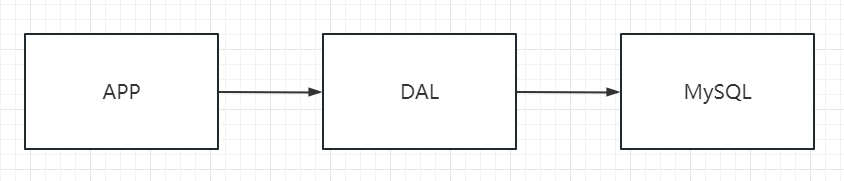
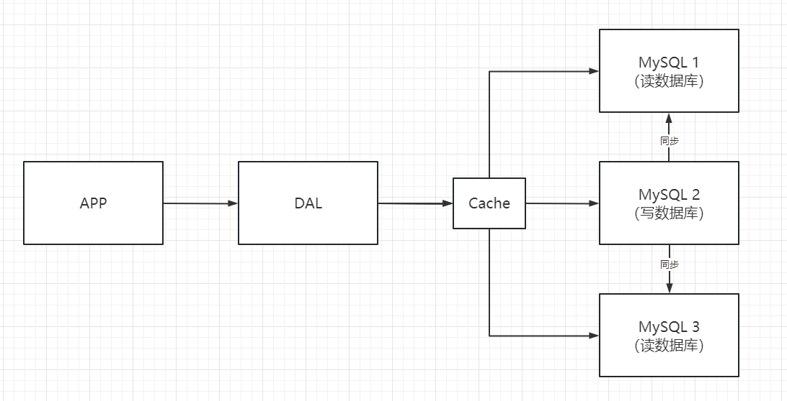
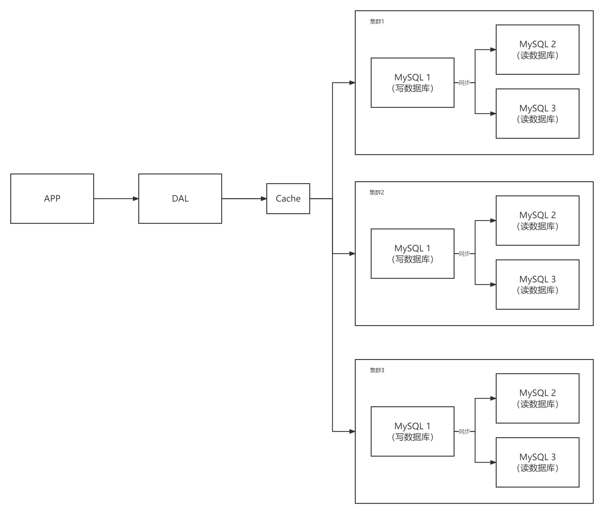
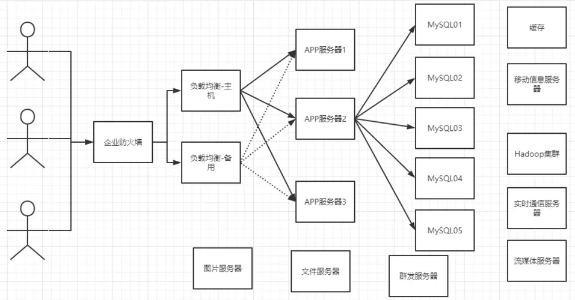

## 数据库操作架构的发展史

> 1. 单机MySQL的年代



90年代的网站，数据访问量不大，单个数据库足够用，所以直接通过后台操作数据库即可

缺点：

- 数据量较大之后，一个数据库无法完成存储工作
- 数据的索引，机器内存不够用
- 读写混合，较大的访问量服务器承受不了

> 2. 缓存 + MySQL + 垂直拆分(读写分离)

网站对数据库的操作，80%都是读，我们可以使用缓存来存放查询的数据，减少与数据库的交互，提高效率

缓存的发展历程：优化数据结构和索引 ==> 文件缓存(I/O) ==> Memcached(当时最火的缓存技术)



> 3. 分库分别 + 水平拆分 + MySQL集群

技术发展，不断优化，分库分表提高了写的效率



> 最近几年

MySQL等关系数据库不够用了，数据量大，数据变化快

一些大文件。比如图片、博客文章等，需要用专门的数据库进行存储，减少MySQL的压力

> 目前一个基本的互联网项目



## 什么是NoSQL

NoSQL： not only sql

泛指非关系型数据库，随着web2.0互联网的诞生；传统的关系型数据库很难对付web2.0时代！尤其是大规模高并发的社区！暴露出来难以克服的问题，NoSQL在当今大数据环境下发展十分迅速，Redis是发展最快的，当下要掌握的东西

关系型数据库：表格，行，列（POI技术），

很多的数据类型用户的个人信息，社交网络，地理位置，这些数据类型的存储不需要一个固定格式！不需要多余的操作就可以横向扩展！Map<String,Object>,使用键值对来控制

## NoSQL的特点

1. 方便扩展：数据之间没有关系，很好扩展
2. 大数据量高性能：Redis一秒可以写8万次，读取11万次，NoSQL的缓存记录级，是一种细粒度的缓存，性能比较高
3. 数据类型是多样型的：不需要事先设计数据库，随取随用

传统的RDBMS和NoSQL区别：

> 传统的RDBMS

```
- 结构化组织
- SQL
- 数据和关系都存在单独的表中 row col
- 数据操作，数据定义语言
- 严格的一致性
- 。。。。
```

> NoSQL

```
- 不仅仅是数据
- 没有固定的查询语言
- 键值对存储，列存储，文档存储，图形数据库（社交关系）
- 最终一致性
- CAP定理和BASE（异地多活） 初级架构师
- 高性能，高可用，高可扩展
- 。。。。
```

大数据的3V：主要是描述问题的

1. 海量Volume
2. 多样Variety
3. 实时Velocity

三高：对程序的要求

1. 高并发
2. 高可扩：随时水平拆分，机器不够了，可以扩展机器来解决
3. 高性能：保证用户体验和性能

## NoSQL四大类

### K-V键值对

- 新浪：Redis
- 美团：Redis + Tair
- 阿里，百度：Redis + Memacache

### 文档数据库

- MongoDB（一般必须要掌握）
  - MongoDB是一个基于分布式文件存储的数据库，C++编写，主要用来处理大量的文档
  - MongoDB是一个介于关系型数据库和非关系型数据库中间的产品！MongoDB是非关系型数据库中功能最丰富，最像关系型数据库的
- ConthDB

### 列存储数据库

- HBase
- 分布式文件系统

### 图关系数据库

- 不是存图形的，放的是关系
- Neo4j，InfoGrid

### 区别


## Redis概述

1. 官网：https://redis.io/
2. 中文网 ：http://www.redis.cn/

### Redis是什么

> Redis（Remote Dictionary Server )，即远程字典服务，是一个开源的使用ANSI C语言编写、支持网络、可基于内存亦可持久化的日志型、Key-Value数据库，并提供多种语言的API。从2010年3月15日起，Redis的开发工作由VMware主持。从2013年5月开始，Redis的开发由Pivotal赞助。

免费和开源！是当下最热门的NoSQL技术

区别的是redis会周期性的把更新的数据写入磁盘或者把修改操作写入追加的记录文件，并且在此基础上实现了master-slave(主从)同步。

### Redis能干嘛

1. 内存存储，持久化，内存中是断电即失，所以说持久化很重要，（rdb，aof）
2. 效率高，可以用于高速缓存
3. 发布订阅系统
4. 地图信息分析
5. 计时器，计数器（浏览量）

### 特性

1. 多样的数据类型
2. 持久化
3. 集群
4. 事务

## Redis安装

==官方推荐Redis在Linux环境下搭建，Windows版本已经很久没有维护了==

### Windows下安装

1. 下载windows版压缩包

https://github.com/microsoftarchive/redis/releases

2. 解压即可
3. 运行服务端`redis-server.exe`，运行客户端`redis-cli.exe`
4. 客户端测试连通性`ping`

### Linux下安装

1. 下载压缩包

最新稳定版：https://download.redis.io/redis-stable.tar.gz

2. 解压压缩包

```
tar -zxvf redis-stable.tar.gz
```

3. 进入解压出的文件夹，可以看到配置文件


4. 基本环境安装

```
yum install gcc-c++
make
make install
```

5. Linux的默认安装路径为`/usr/local/bin`，我们可以此路径下找到redis的启动程序
6. 将redis的配置文件复制到启动目录下，便于修改

```
cd /usr/local/bin

mkdir conf

cp /home/john/redis/redis-stable/redis.conf conf
```

7. 修改配置文件，使redis变为后台启动


7. 通过指定配置文件启动redis

- 启动服务端

```
redis-server conf/redis.conf
```

- 启动客户端

```
redis-cli -p 6379
```


8. 关闭redis

```bash
#关闭服务
shutdown

#退出
exit
```


## Redis基础

redis有16个基础数据库，默认使用的是第0个数据库

一些基本的操作命令

```bash
#切换数据库
select 3

#查看当前数据库大小
dbsize

#查看当前数据库所有的key
key *

#清空当前数据库
flushdb

#清空所有数据库
flushall
```

> 为什么redis是单线程的

redis是基于内存操作的，所以CPU不是redis的性能瓶颈，redis的性能瓶颈是机器的内存以及网络带宽，所以可以使用单线程来实现。

redis是C语言编写的，官方提供的数据为10w+ QPS，说明性能方面完全不比memcache差

> 为什么redis单线程还更快

- 误区一：高性能一定是多线程
- 误区二：多线程一定比单线程效率高

速度方面简单对比：CPU > 内存 > 硬盘

redis将所有数据放在内存中，所以使用单线程操作效率就是最高的，因为多线程涉及到CPU调度，CPU调度存在上下文切换，上下文切换会带来额外耗时。

对于内存系统来说，如果没有上下文切换，效率就是最高的。
