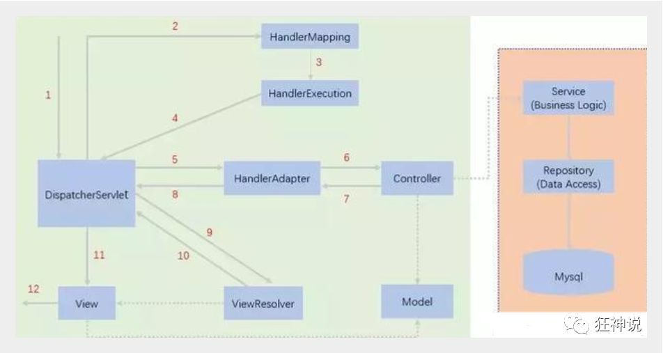

# MyBatis

## 什么是MyBatis

- MyBatis是一款优秀的`持久层框架`
- 它支持自定义SQL、存储过程以及高级映射
- MyBatis免除了几乎所有的 JDBC 代码以及设置参数和获取结果集的工作
- MyBatis可以通过简单的XML或注解来配置和映射原始类型、接口和Java POJO（Plain Old Java Objects，普通老式 Java 对象）为数据库中的记录

## 持久化
- 因为内存有断电即失的特性，所以需要进行数据持久化
- 持久化就是将程序的数据在持久状态和瞬时状态转化的过程

## 持久层
定义：完成持久化工作的代码块

## MyBatis的简单使用
1. pom文件引入jar包
```xml
<!-- mybatis -->
<dependency>
    <groupId>org.mybatis</groupId>
    <artifactId>mybatis</artifactId>
    <version>3.5.7</version>
</dependency>
<!-- mysql-jdbc -->
<dependency>
    <groupId>mysql</groupId>
    <artifactId>mysql-connector-java</artifactId>
    <version>5.1.38</version>
</dependency>
<!-- lombok -->
<dependency>
    <groupId>org.projectlombok</groupId>
    <artifactId>lombok</artifactId>
    <version>1.18.20</version>
</dependency>
<!-- junit测试依赖 -->
<dependency>
    <groupId>junit</groupId>
    <artifactId>junit</artifactId>
    <version>4.13.2</version>
    <scope>test</scope>
</dependency>
```

2. 创建工具类
```java
public class MybatisUtil {
    private static SqlSessionFactory sqlSessionFactory;

    static {
        InputStream inputStream = null;
        try {
            //用输入流来读取xml文件
            inputStream = Resources.getResourceAsStream("mybatis-config.xml");
        } catch (IOException e) {
            e.printStackTrace();
        }
        //创建SqlSession工厂
        sqlSessionFactory = new SqlSessionFactoryBuilder().build(inputStream);
    }

    public static SqlSession getSqlSession(){
        //创建并返回SqlSession
        return sqlSessionFactory.openSession();
    }
}
```

3. 创建mybatis核心配置文件

`mybatis-config.xml`

```xml
<?xml version="1.0" encoding="UTF-8" ?>
<!DOCTYPE configuration
        PUBLIC "-//mybatis.org//DTD Config 3.0//EN"
        "http://mybatis.org/dtd/mybatis-3-config.dtd">
<configuration>
    <environments default="development">
        <environment id="development">
            <transactionManager type="JDBC"/>
            <dataSource type="POOLED">
                <!-- JDBC配置 -->
                <property name="driver" value="com.mysql.jdbc.Driver"/>
                <property name="url" value="jdbc:mysql://localhost:3306/student-manager?useSSL=true&amp;useUnicode=true&amp;characterEncoding=utf8&amp;serverTimezone=GMT%2B8"/>
                <property name="username" value="root"/>
                <property name="password" value="lishuang001219"/>
            </dataSource>
        </environment>
    </environments>
    
    <mappers>
        <!-- resource下的Mapper资源存在单层目录结构时的写法 -->
        <mapper resource="StudentMapper.xml"/>
        <!-- resource下的Mapper资源存在多层目录结构时的写法 -->
        <mapper resource="mapper/StudentMapper.xml"/>
    </mappers>
</configuration>
```

4. 创建实体类
```java
@Data
@NoArgsConstructor
@AllArgsConstructor
public class Student {
    private Integer id;
    private String name;
    private Integer age;
    private Integer sex;
    private String num;
    private String grade;
    private String clazz;
    private String address;
}
```

5. 创建Mapper接口文件
```java
public interface StudentMapper {
    List<Student> listStudent();
}
```

6. 创建Mapper配置文件

`UserMapper.xml`

```xml
<?xml version="1.0" encoding="UTF-8" ?>
<!DOCTYPE mapper
        PUBLIC "-//mybatis.org//DTD Mapper 3.0//EN"
        "http://mybatis.org/dtd/mybatis-3-mapper.dtd">
<!-- namespace命名空间：绑定一个对应的Mapper接口 -->
<mapper namespace="mapper.StudentMapper">
    <!-- sql语句 -->
    <!-- id对应接口中定义的方法 resultType表示结果集类型 -->
    <select id="listStudent" resultType="pojo.Student">
        select * from student
    </select>
</mapper>
```

7. 创建业务层
```java
public class StudentService implements StudentMapper {
    @Override
    public List<Student> listStudent() {
        //获取mapper对象
        StudentMapper mapper = MybatisUtil.getSqlSession().getMapper(StudentMapper.class);
        return mapper.listStudent();
    }
}
```

8. 编写测试类
```java
public class MyTest {
    StudentService studentService = new StudentService();

    @Test
    public void test() {
        System.out.println(studentService.listStudent());
    }
}
```

9. 目录结构


## CRUD

1. 实体类

```java
@Data
@NoArgsConstructor
@AllArgsConstructor
@ToString
public class Student {
    private int stuId;
    private String stuName;
    private String stuSex;
    private int stuAge;
    private String stuCls;
}
```

2. Mapper接口

```java
public interface StudentMapper {
    //添加一个学生
    int addStudent(Student student);
	//删除一个学生
    int deleteStudent(int stuId);
	//修改一个学生
    int updateStudent(Student student);
	//查询一个学生
    Student getStudent(int stuId);
}
```

3. Mapper配置文件

```xml
<?xml version="1.0" encoding="UTF-8" ?>
<!DOCTYPE mapper
        PUBLIC "-//mybatis.org//DTD mapper 3.0//EN"
        "http://mybatis.org/dtd/mybatis-3-mapper.dtd">
<!-- namespace命名空间：绑定一个对应的Mapper接口 -->
<mapper namespace="mapper.StudentMapper">
    <insert id="addStudent" parameterType="entity.Student">
        insert into student (stuName, stuSex, stuAge, stuCls) value(#{stuName}, #{stuSex}, #{stuAge}, #{stuCls})
    </insert>

    <delete id="deleteStudent" parameterType="int">
        delete from student where stuId = #{stuId}
    </delete>

    <update id="updateStudent" parameterType="entity.Student">
        update student set stuName = #{stuName}, stuSex = #{stuSex}, stuAge = #{stuAge}, stuCls = #{stuCls} where stuId = #{stuId}
    </update>

    <select id="getStudent" parameterType="int" resultType="entity.Student">
        select * from student where stuId = #{stuId}
    </select>
</mapper>
```

3. Service接口

```java
public interface StudentService {
    int addStudent(Student student);

    int deleteStudent(int stuId);

    int updateStudent(Student student);

    Student getStudent(int stuId);
}
```

4.Service实现类

```java
public class StudentServiceImpl implements StudentService {

    @Override
    public int addStudent(Student student) {
        SqlSession sqlSession = MybatisUtil.getSqlSession();
        StudentMapper mapper = sqlSession.getMapper(StudentMapper.class);
        int rs = mapper.addStudent(student);
        sqlSession.commit();
        return rs;
    }

    @Override
    public int deleteStudent(int stuId) {
        SqlSession sqlSession = MybatisUtil.getSqlSession();
        StudentMapper mapper = sqlSession.getMapper(StudentMapper.class);
        int rs = mapper.deleteStudent(stuId);
        sqlSession.commit();
        return rs;
    }

    @Override
    public int updateStudent(Student student) {
        SqlSession sqlSession = MybatisUtil.getSqlSession();
        StudentMapper mapper = sqlSession.getMapper(StudentMapper.class);
        int rs = mapper.updateStudent(student);
        sqlSession.commit();
        return rs;
    }

    @Override
    public Student getStudent(int stuId) {
        SqlSession sqlSession = MybatisUtil.getSqlSession();
        StudentMapper mapper = sqlSession.getMapper(StudentMapper.class);
        return mapper.getStudent(stuId);
    }
}
```

5. 测试类

```java
public class MyTest {
    StudentServiceImpl studentService = new StudentServiceImpl();

    @Test
    public void addStudent(){
        Student student = new Student(0,"赵小二", "男", 25, "软件19-1");
        studentService.addStudent(student);
    }

    @Test
    public void deleteStudent(){
        studentService.deleteStudent(7);
    }

    @Test
    public void updateStudent(){
        Student student = new Student(5,"赵小二", "女", 18, "软件19-1");
        studentService.updateStudent(student);
    }

    @Test
    public void getStudent(){
        Student student = studentService.getStudent(1);
        System.out.println(student.toString());
    }
}
```

## mybatis-generator的简单使用

注：此插件主要用于自动生成实体类、Mapper接口和Mapper配置文件，mybatis核心配置文件和业务层文件需要根据实际应用场景对照生成的文件自行编写
1. 编写pom文件
```xml
<!-- https://mvnrepository.com/artifact/org.mybatis/mybatis -->
<dependency>
    <groupId>org.mybatis</groupId>
    <artifactId>mybatis</artifactId>
    <version>3.5.5</version>
</dependency>
<!-- https://mvnrepository.com/artifact/mysql/mysql-connector-java -->
<dependency>
    <groupId>mysql</groupId>
    <artifactId>mysql-connector-java</artifactId>
    <version>5.1.38</version>
</dependency>

<!-- 添加插件(注意将此行注释删除，中文会引起idea报错) -->
<build>
    <plugins>
        <plugin>
            <groupId>org.apache.maven.plugins</groupId>
            <artifactId>maven-war-plugin</artifactId>
            <version>3.3.0</version>
        </plugin>
        <plugin>
            <groupId>org.mybatis.generator</groupId>
            <artifactId>mybatis-generator-maven-plugin</artifactId>
            <version>1.4.0</version>
            <executions>
                <execution>
                    <id>Generate MyBatis Artifacts</id>
                    <goals>
                        <goal>generate</goal>
                    </goals>
                </execution>
            </executions>
            <dependencies>
                <dependency>
                    <groupId>org.mybatis</groupId>
                    <artifactId>mybatis</artifactId>
                    <version>3.5.5</version>
                </dependency>
                <!-- mysql-jdbc -->
                <dependency>
                    <groupId>mysql</groupId>
                    <artifactId>mysql-connector-java</artifactId>
                    <version>5.1.38</version>
                </dependency>
            </dependencies>
            <configuration>
                <!-- 生成的文件覆盖源文件 -->
                <overwrite>true</overwrite>
            </configuration>
        </plugin>
    </plugins>
</build>
```

2. 编写mybatis-generator配置文件
- generatorConfig.xml
```xml
<!DOCTYPE generatorConfiguration PUBLIC
        "-//mybatis.org//DTD MyBatis Generator Configuration 1.0//EN"
        "http://mybatis.org/dtd/mybatis-generator-config_1_0.dtd">
<generatorConfiguration>
    <context id="simple" targetRuntime="MyBatis3Simple">
        <jdbcConnection driverClass="com.mysql.jdbc.Driver"
                        connectionURL="jdbc:mysql://localhost:3306/student-manager" userId="root" password="lishuang001219"/>
        <!--实体存放位置-->
        <javaModelGenerator targetPackage="pojo" targetProject="src/main/java"/>
        <!--Mapper.xml存放位置-->
        <sqlMapGenerator targetPackage="mapper" targetProject="src/main/resources"/>
        <!--Mapper接口存放位置-->
        <javaClientGenerator type="XMLMAPPER" targetPackage="mapper" targetProject="src/main/java"/>
        <!--需要生成的表-->
        <table tableName="student" />
    </context>
</generatorConfiguration>
```

3. 双击一键生成代码


## 提取数据库配置文件
- db.properties
```properties
driver=com.mysql.jdbc.Driver
url=jdbc:mysql://localhost:3306/webapp1901
username=root
password=lishuang001219
```
- mybatis-config.xml
```xml
<!-- 引入外部配置文件 -->
<!-- 在引入外部文件后，还可以添加字段，如果存在相同字段，怎使用外部配置文件中的值进行覆盖 -->
<properties resource="db.properties">
    <property name="username" value="root" />
    <property name="pwd" value="123456" />
</properties>
```

## 类型别名

- 类型别名是为Java类型设置一个短的名字
- 存在的意义仅在于用来减少类完全限定名的冗余
```xml
<!-- 可以给实体类起别名 -->
<typeAliases>
    <typeAlias type="cn.com.scitc.webapp1901.pojo.User" alias="User">
</typeAliases>
```
也可以指定一个包名，Mybatis会在包名下面搜索需要的Java Bean，比如：扫描实体类的包，它的默认别名就是这个类的类名，首字母小写
```xml
<typeAliases>
    <package name="cn.com.scitc.webapp1901.pojo" />
</typeAliases>
```
实体类较少时，使用第一种
实体类较多时，使用第二种，第二种如果需要DIY别名，需要使用注解

```java
@Alias("UserPojo")
public class User {

}
```

## Mybatis默认别名

|    别名    |  映射类型  |
| :--------: | :--------: |
|   _byte    |    byte    |
|   _long    |    long    |
|   _short   |   short    |
|    _int    |    int     |
|  _integer  |    int     |
|  _double   |   double   |
|   _float   |   float    |
|  _boolean  |  boolean   |
|   string   |   String   |
|    byte    |    Byte    |
|    long    |    Long    |
|   short    |   Short    |
|    int     |  Integer   |
|  integer   |  Integer   |
|   double   |   Double   |
|   float    |   Float    |
|  boolean   |  Boolean   |
|    date    |    Date    |
|  decimal   | BigDecimal |
| bigdecimal | BigDecimal |
|    map     |    Map     |

## 注册绑定Mapper文件的多种方式
方式一：通过resource属性进行绑定(少量Mapper时推荐使用)
```xml
<mappers>
    <mapper resource="cn/com/scitc/webapp1901/mapper/UserMapper.xml"/>
</mappers>
```

方式二：通过扫描包进行绑定(少量Mapper时推荐使用)
此方式注意：

1. 接口和他的Mapper配置文件必须同名
2. 接口和他的Mapper配置文件必须在同一个包下
```xml
<mappers>
    <mapper class="cn.com.scitc.webapp1901.dao"/>
</mappers>
```

## 结果集映射(resultMap)
当数据库中的列名和实体类中的属性名不完全相同时，需要用到结果集映射
```xml
<resultMap id="BaseResultMap" type="cn.com.scitc.webapp1901.model.Signin">
    <!-- column数据库中的字段，property实体类中的属性 -->
    <result column="studentId" property="studentid" />
    <result column="signDatetime" property="signdatetime" />
    <result column="signDate" property="signdate" />
</resultMap>
```

## Map的使用
当实体类或者数据库表、字段、参数过多时，应当考虑使用map传递参数
- UserMapper.java
```java
int addUser(Map<String,Object> map);
```

- UserMapper.xml
```xml
<insert id="addUser" parameterType="map">
    insert into user (id,pwd) value (#{userId},#{passWord})
</insert>
```

- UserDao.java
```java
public int addUser(Map<String,Object> map) {
    //获取SqlSession
    try(SqlSession session = MybatisUtils.getSqlSession()){
        //获取Mapper，执行其中方法
        UserMapper mapper = session.getMapper(UserMapper.class);
        int result = mapper.addUser(map);
        session.commit();
        return result;
    }
}
```

测试代码
```java
@Test
void addUser() {
    UserDao userDao = new UserDao();
    Map<String,Object> map = new Map<String,Object>();
    map.put("userId",5);
    map.put("password",123456);
    User user = userDao.addUser(map);
}
```

## 日志
### 日志工厂
打印sql语句，帮助排错
```xml
<!-- 开启日志 -->
<settings>
    <!-- SLF4J | LOG4J | LOG4J2 | JDK_LOGGING | COMMONS_LOGGING | STDOUT_LOGGING | NO_LOGGING -->
    <setting name="logImpl" value="STDOUT_LOGGING"/>
</settings>
```

### Log4j的简单使用
1. 导入依赖
```xml
<!-- https://mvnrepository.com/artifact/log4j/log4j -->
<dependency>
    <groupId>log4j</groupId>
    <artifactId>log4j</artifactId>
    <version>1.2.17</version>
</dependency>
```
2. 添加配置文件
```properties
### 配置根 ###
log4j.rootLogger = debug,console ,fileAppender

### 设置输出sql的级别，其中logger后面的内容全部为jar包中所包含的包名 ###
log4j.logger.org.apache=dubug
log4j.logger.java.sql.Connection=dubug
log4j.logger.java.sql.Statement=dubug
log4j.logger.java.sql.PreparedStatement=dubug
log4j.logger.java.sql.ResultSet=dubug

### 配置输出到控制台 ###
log4j.appender.console = org.apache.log4j.ConsoleAppender
log4j.appender.console.Target = System.out
log4j.appender.console.layout = org.apache.log4j.PatternLayout
log4j.appender.console.layout.ConversionPattern =  %d{ABSOLUTE} %5p %c{1}:%L - %m%n

### 配置输出到文件 ###
log4j.appender.fileAppender = org.apache.log4j.FileAppender
log4j.appender.fileAppender.File = logs/log.log
log4j.appender.fileAppender.Append = true
log4j.appender.fileAppender.Threshold = DEBUG
log4j.appender.fileAppender.layout = org.apache.log4j.PatternLayout
log4j.appender.fileAppender.layout.ConversionPattern = %-d{yyyy-MM-dd HH:mm:ss}  [ %t:%r ] - [ %p ]  %m%n
```
3. 使用
```java
public class MyTest {
    StudentService studentService = new StudentService();

    static Logger logger = Logger.getLogger(MyTest.class);

    @Test
    public void t1() {
        logger.info("你好");
    }
}
```

## Mybatis多表查询之多对一
多对一环境准备
实体类

- Student.java
```java
public class Student {
    private int id;
    private String name;
    // 多个学生关联一个老师
    private Teacher teacher;
}
```
- Teacher.java
```java
public class Teacher {
    private int id;
    private String name;
}
```

方法一：按查询嵌套处理
```xml
<select id="getStydent" resultMap="studentTeacher">
    select  * from student
</select>

<resultMap id="studentTeacher" type="Student">
    <result property="id" column="id" />
    <result property="name" column="name" />
<!-- 复杂属性，单独处理 对象：association 集合：collection 指定属性的类型：javaType -->
<association property="teacher" column="tid" javaType="Teacher" select="getTeacher" />
</resultMap>

<select id="getTeacher" resultMap="Teacher">
    select * from teacher where id = #{tid}
</select>
```
方法二：按结果嵌套查询
```xml
<select id="getStudent" resultMap="StudentTeacher">
    select s.id sid,s.name sname,t.name tname from student s,teacher t where s.tid = t.id;
</select>

<resultMap id="StudentTeacher" type="Student">
    <result property="id" column="sid" />
    <result property="name" column="sname" />
    <association property="teacher" javaType="Teacher">
        <result property="name" column="tname" />
    </association>
</resultMap>
```

## Mybatis多表查询之一对多
多对一环境准备
实体类

- Student.java
```java
public class Student {
    private int id;
    private String name;
    private int tid;
}
```
- Teacher.java
```java
public class Teacher {
    private int id;
    private String name;
    // 一个老师拥有多个学生
    private List<Student> student;
}
```

方法一：按查询嵌套处理
```xml
<select id="getTeacher" resultMap="TeacherStudent">
    select * from teacher where id = #{tid}
</select>

<resultMap id="TeacherStudent" type="Teacher">
    <collection property="student" javaType="ArrayList" ofType="Studentt" select="getStudentByTeacherId" column="id" />
</resultMap>

<select id="getStudentByTeacherId" resultType="Studnet">
    select * from student where tid = #{tid}
</select>
```
方法二：按结果嵌套查询
```xml
<select id="getTeacher" resultMap="TeacherStudent">
    select s.id sid,s.name sname,t.name tname,t.id tid from student student s,teacher t where s.tid = t.id and t.id = #{tid}
</select>

<reslutMap id="TeacherStudent" type="Teacher">
    <result property="id" column="tid" />
    <result property="name" column="tname" />
    <!-- javaType="" 指定属性的类型 ofType="" 集合中的泛型 -->
    <collection property="student" ofType="Student">
        <result property="id" column="sid" />
        <result property="name" column="sname" />
        <result property="tid" column="tid" />
    </collection>
</reslutMap>
```

## 模糊查询两种实现方式
### 方式一：Java代码层面实现
```java
public void getUserLike() {
    SqlSession session = MybatisUtils.getSqlSession();
    UserMapper mapper = session.getMapper(UserMapper.class);
    List<User> userList = mapper.getUserLike("%李%");

    for(User user : userList) {
        System.out.println(user);
    }
    sqlSession.close();
}
```
### 方式二：Mapper.xml中拼接实现(相对安全)
```xml
<select id="getUserLike" resultType="cn.com.scitc.model.User">
    select * from user where name like "%"#{value}"%";
</select>
```

## 动态SQL
- 使用动态 SQL 最常见情景是根据条件包含 where 子句的一部分
- 动态 SQL 的另一个常见使用场景是对集合进行遍历（尤其是在构建 IN 条件语句的时候）
if标签
```xml
<select id="queryBlogIf" parameterType="map" resultType="blog">
    select * from blog where 1=1
    <if test="title != null">
        and title = #{title}
    </if>
    <if test="author != null">
        and author = #{author}
    </if>
</select>
```
```java
public void queryBlogIf() {
    SqlSession sqlSession = MybatisUtils.getSqlSession();
    BlogMapper mapper = sqlSession.getMapper(BlogMapper.class);

    HashMap map = new HashMap();
    map.put("title","Java从入门到放弃");
    map.put("author","John.Cena");

    List<Blog> blogs = mapper.queryBlogIf(map);

    for(Blog blog : blogs) {
        System.out.println(blog);
    }

    sqlSession.close();
}
```
where标签
> where 元素只会在子元素返回任何内容的情况下才插入 “WHERE” 子句。而且，若子句的开头为 “AND” 或 “OR”，where 元素也会将它们去除。
```xml
<select id="queryBlogIf" parameterType="map" resultType="blog">
    select * from blog
    <where>
        <if test="title != null">
            and title = #{title}
        </if>
        <if test="author != null">
            and author = #{author}
        </if>
    </where>
</select>
```
choose、when、otherwise
> 有时候，我们不想使用所有的条件，而只是想从多个条件中选择一个使用。针对这种情况，MyBatis 提供了 choose 元素，它有点像 Java 中的 switch 语句。
```xml
<select id="findActiveBlogLike"
     resultType="Blog">
  SELECT * FROM BLOG WHERE state = ‘ACTIVE’
  <choose>
    <when test="title != null">
      AND title like #{title}
    </when>
    <when test="author != null and author.name != null">
      AND author_name like #{author.name}
    </when>
    <otherwise>
      AND featured = 1
    </otherwise>
  </choose>
</select>
```
set标签
> set 元素会动态地在行首插入 SET 关键字，并会删掉额外的逗号（这些逗号是在使用条件语句给列赋值时引入的）。
```xml
<update id="updateAuthorIfNecessary">
  update Author
    <set>
      <if test="username != null">username=#{username},</if>
      <if test="password != null">password=#{password},</if>
      <if test="email != null">email=#{email},</if>
      <if test="bio != null">bio=#{bio}</if>
    </set>
  where id=#{id}
</update>
```
trim自定义标签

foreach标签
[foreach详解](https://www.cnblogs.com/fnlingnzb-learner/p/10566452.html)
foreach元素的属性主要有item，index，collection，open，separator，close
- item：集合中元素迭代时的别名，该参数为必选。
- index：在list和数组中,index是元素的序号，在map中，index是元素的key，该参数可选
- open：foreach代码的开始符号，一般是(和close=")"合用。常用在in(),values()时。该参数可选
- 元素之间的分隔符，例如在in()的时候，separator=","会自动在元素中间用“,“隔开，避免手动输入逗号导致sql错误，如in(1,2,)这样。该参数可选。
- close: foreach代码的关闭符号，一般是)和open="("合用。常用在in(),values()时。该参数可选。
- collection: 要做foreach的对象，作为入参时，List对象默认用"list"代替作为键，数组对象有"array"代替作为键，Map对象没有默认的键。当然在作为入参时可以使用@Param("keyName")来设置键，设置keyName后，list,array将会失效。 除了入参这种情况外，还有一种作为参数对象的某个字段的时候。举个例子：如果User有属性List ids。入参是User对象，那么这个collection = "ids".如果User有属性Ids ids;其中Ids是个对象，Ids有个属性List id;入参是User对象，那么collection = "ids.id"
collection属性值的三种情况
- 如果传入的是单参数且参数类型是一个List的时候，collection属性值为list
- 如果传入的是单参数且参数类型是一个array数组的时候，collection的属性值为array
- 如果传入的参数是多个的时候，我们就需要把它们封装成一个Map了，当然单参数也可以封装成map，实际上如果你在传入参数的时候，在MyBatis里面也是会把它封装成一个Map的，map的key就是参数名，所以这个时候collection属性值就是传入的List或array对象在自己封装的map里面的key

## 分页
Limit实现
```sql
-- 从索引0开始，查询20条记录
select * from `student` limit 0,20
```
## 分页插件的使用
[MybatisPageHelper](https://pagehelper.github.io/)

### 后端
1. 导入依赖
```xml
<!--分页-->
<dependency>
    <groupId>com.github.pagehelper</groupId>
    <artifactId>pagehelper</artifactId>
    <version>5.1.2</version>
</dependency>
```
2. 添加配置
```xml
<!-- 3.配置SqlSessionFactory对象 -->
<bean id="sqlSessionFactory" class="org.mybatis.spring.SqlSessionFactoryBean">
        <!-- 注入数据库连接池 -->
        <property name="dataSource" ref="dataSource"/>
        <!-- 配置MyBaties全局配置文件:mybatis-config.xml -->
        <property name="configLocation" value="classpath:mybatis-config.xml"/>
        <!--分页插件-->
        <property name="plugins">
                <set>
                        <bean class="com.github.pagehelper.PageInterceptor">
                                <property name="properties">
                                        <props>
                                                <prop key="helperDialect">mysql</prop>
                                        </props>
                                </property>
                        </bean>
                </set>
        </property>
</bean>
```
3. service层
```java
public interface StudentService {
    //查询全部Student,返回list集合
    PageInfo findStudentList(int pageNum,int pageSize);
}
```
```java
public PageInfo findStudentList(int pageNum,int pageSize) {
    // 分页语句之后紧跟的第一次查询才会分页，所以此结构最合理
    PageHelper.startPage(pageNum,pageSize);
    List<Student> list = studentMapper.findStudentList();
    PageInfo pageInfo = new PageInfo(list);
    return pageInfo;
}
```
4. controller层
```java
@RequestMapping("/list/{pageNum}/{pageSize}")
@ResponseBody
// 前台传递两个参数，第一个参数为页码，就是你要查询第几页的数据，第二个参数是，一页几条记录
public PageInfo list(Model model, @PathVariable int pageNum, @PathVariable int pageSize) {
    PageInfo pageInfo = studentService.findStudentList(pageNum,pageSize);
    // 插件将处理好后的集合封装在了PageInfo对象里面，直接返回到前端即可
    return pageInfo;
}
```
5. PageInfo类的常见属性
```java
public class PageInfo<T> implements Serializable {
private static final long serialVersionUID = 1L;
//当前页
private int pageNum;
//每页的数量
private int pageSize;
//当前页的数量
private int size;
//由于startRow 和endRow 不常用，这里说个具体的用法
//可以在页面中"显示startRow 到endRow 共size 条数据"
//当前页面第一个元素在数据库中的行号
private int startRow;
//当前页面最后一个元素在数据库中的行号
private int endRow;
//总记录数
private long total;
//总页数
private int pages;
//结果集
private List<T> list;
//前一页
private int prePage;
//下一页
private int nextPage;
//是否为第一页
private boolean isFirstPage = false;
//是否为最后一页
private boolean isLastPage = false;
//是否有前一页
private boolean hasPreviousPage = false;
//是否有下一页
private boolean hasNextPage = false;
//导航页码数
private int navigatePages;
//所有导航页号
private int[] navigatepageNums;
//导航条上的第一页
private int navigateFirstPage;
//导航条上的最后一页
private int navigateLastPage;
}
```

### 前端
1. 导入依赖，我使用了JQuery和BootStrap
```html
<link href="https://cdn.usebootstrap.com/bootstrap/4.4.1/css/bootstrap.min.css" rel="stylesheet">
<script type="text/javascript" src="https://code.jquery.com/jquery-3.5.1.min.js"></script>
```

1. HTML部分
```html
<!-- 搭建基本表结构，固定表头 -->
<div class="row clearfix">
    <div class="col-md-12 column">
        <table class="table table-hover table-striped" style='vertical-align: middle;text-align: center;'>
            <thead>
            <tr>
                <th>编号</th>
                <th>姓名</th>
                <th>年龄</th>
                <th>性别</th>
                <th>班级</th>
                <th>学号</th>
                <th>操作</th>
            </tr>
            </thead>

            <tbody id="tbody">
            </tbody>
        </table>
    </div>
</div>

<!-- 用nav搭建基本页码结构 -->
<div class="row">
    <nav aria-label="..." class="col-md-3 offset-md-9 mt-3">
        <ul class="pagination" id="pageNum">
        </ul>
    </nav>
</div>
```

2. Javascript部分
```html
<script>
    $(function () {
        // 页面加载时默认获取第一页数据，这里是一页5条记录的分法
        getPageList(1,5);

        // 首页
        let navigateFirstPage;

        // 末页
        let navigateLastPage;

        // 当前页
        let pageNum;

        // 下一页
        let nextPage;

        // 上一页
        let prePage;

        // 页码集
        let navigatepageNums;
    });

    function getPageList(pageNum,pageSize) {
        console.log("查询第" + pageNum + "页数据，每页" + pageSize + "条");

        $.get({
            url:"${pageContext.request.contextPath}/student/list/" + pageNum + "/" + pageSize,
            data:{},
            success: function (data) {
                myTable(data);
            },
            error: function () {
                alert("失败");
            }
        });
    }

    // 表格渲染
    function myTable(data) {
        // 获取后台传递过来的一些重要的对象属性
        // 首页
        navigateFirstPage = data.navigateFirstPage;
        // 末页
        navigateLastPage = data.navigateLastPage
        // 当前页
        pageNum = data.nowPage;
        // 下一页
        nextPage = data.nextPage;
        // 上一页
        prePage = data.prePage;
        // 页码集
        navigatepageNums = data.navigatepageNums;


        // 取出数据
        let arr = data.list;

        // 清空表格
        $("#tbody").html("");
        // 填充表格
        // 已经拿到了数据，他们封装在一个数组里面，这里我是JSP页面，所以拼接有点不一样，具体拼接请自己思考
        for(let i =0; i<arr.length ;i++) {
            let html = "<tr>" +
                "<td>" + arr[i].id +"</td>" +
                "<td>" + arr[i].name +"</td>" +
                "<td>" + arr[i].age +"</td>" +
                "<td>" + arr[i].sex +"</td>" +
                "<td>" + arr[i].cls +"</td>" +
                "<td>" + arr[i].num +"</td>" +
                "<td>" +
                '<a class="btn btn-primary" href="<c:url value="/student/edit/'+ arr[i].id +'" />" style="margin-right: 10px">修改</a>' +
                '<a class="btn btn-danger" href="<c:url value="/student/delete/'+ arr[i].id +'" />">删除</a>' +
                "</td>" +
                "</tr>"
            
            // 追加表格体到页面上
            $("#tbody").append(html);
        }

        // 清空页数导航栏
        $("#pageNum").html("");
        // 填充页数导航栏
        for(let i=0; i<navigatepageNums.length ;i++) {
            nowPage = navigatepageNums[i];

            let pageNum = '<li class="page-item">' +
                '<button class="page-link" onclick="getPageList($(this).text(),5)">' + nowPage + '</button>' +
                "</li>";

            let pageStart = '<li class="page-item">' +
                '<button class="page-link" onclick="getPageList(navigateFirstPage,5)">首页</button>' +
                "</li>";

            let pageEnd = '<li class="page-item">' +
                '<button class="page-link" onclick="getPageList(nextPage,5)">下一页</button>' +
                "</li>";

            if(i == 0) {
                pageNum = pageStart + pageNum;
            }
            if(i == navigatepageNums.length -1) {
                pageNum = pageNum + pageEnd;
            }
            
            // 追加导航栏到页面上
            $("#pageNum").append(pageNum);
        }

        // 为当前页面添加激活样式
        $("li.page-item")[data.pageNum].className += ' active';
    }
</script>
```

## 日志
标准日志工厂的实现
在mybais设置文件中添加日志设置

```xml
<settings>
    <setting name="logImpl" value="STDOUT_LOGGING"/>
<settings>
```

log4j的使用
1. 在pom中导入依赖
```xml
<!-- https://mvnrepository.com/artifact/log4j/log4j -->
<dependency>
    <groupId>log4j</groupId>
    <artifactId>log4j</artifactId>
    <version>1.2.17</version>
</dependency>
```
2. 创建log4j配置文件
- log4j.properties
```
#将等级为DEBUG的日志信息输出到console和file这两个目的地，console和file的定义在下面的代码
log4j.rootLogger=DEBUG,console,file

#控制台输出的相关设置
log4j.appender.console = org.apache.log4j.ConsoleAppender
log4j.appender.console.Target = System.out
log4j.appender.console.Threshold=DEBUG
log4j.appender.console.layout = org.apache.log4j.PatternLayout
log4j.appender.console.layout.ConversionPattern=[%c]-%m%n

#文件输出的相关设置
log4j.appender.file = org.apache.log4j.RollingFileAppender
log4j.appender.file.File=./log/kuang.log
log4j.appender.file.MaxFileSize=10mb
log4j.appender.file.Threshold=DEBUG
log4j.appender.file.layout=org.apache.log4j.PatternLayout
log4j.appender.file.layout.ConversionPattern=[%p][%d{yy-MM-dd}][%c]%m%n

#日志输出级别
log4j.logger.org.mybatis=DEBUG
log4j.logger.java.sql=DEBUG
log4j.logger.java.sql.Statement=DEBUG
log4j.logger.java.sql.ResultSet=DEBUG
log4j.logger.java.sql.PreparedStatement=DEBUG
```
3. 修改mybais设置文件中的日志设置
```xml
<settings>
    <setting name="logImpl" value="LOG4J"/>
<settings>
```

在类中手动添加日志输出
- UserDao.java
```java
static Logger logger = Logger.getLogger(UserDao.class);
logger.info("xxxxxx");
logger.debug("xxxxxx");
logger.error("xxxxxx");
```

## 缓存
1. 什么是缓存
   - 存在内存中的临时数据。
   - 将用户经常查询的数据放在缓存（内存）中，用户去查询数据就不用从磁盘上(关系型数据库数据文件)查询，从缓存中查询，从而提高查询效率，解决了高并发系统的性能问题。
2. 为什么使用缓存
   - 减少和数据库的交互次数，减少系统开销，提高系统效率。
3. 什么样的数据能使用缓存
   - 经常查询并且不经常改变的数据。
4. 缓存策略
   - mybatis有四种缓存策略，默认使用的是LRU策略
    ```
    LRU 最近最少使用：移除最长时间不被使用的对象
    FIFO 先进先出：按对象进入缓存的顺序来移除它们
    SOFT 软引用：基于垃圾回收器状态和软引用规则移除对象
    WEAK 弱引用：更积极地基于垃圾收集器状态和弱引用规则移除对象
    ```

MyBatis系统中默认定义了两种级别缓存
- 一级缓存(由Mybatis默认开启，无法关闭)
  一级缓存也叫本地缓存，与数据库同一次会话期间(一次Session创建到关闭之间的代码块)查询到的数据会放在本地缓存中，以后如果需要获取相同的数据，直接从缓存中拿，没必须再去查询数据库，当两次相同查询之间，存在增删改查操作，则缓存会被清除
  可以通过代码，手动清除一级缓存
    ```java
    session.clearCache();
    ```
- 二级缓存
  - 二级缓存需要手动开启和配置
  - 二级缓存也叫全局缓存，一级缓存作用域太低了，所以诞生了二级缓存
  - 基于namespace级别的缓存(在一个mapper内有效)，一个名称空间，对应一个二级缓存
  - 为了提高扩展性，Mybatis定义了缓存接口Cache，用于自定义二级缓存

- 二级缓存的工作机制
  - 一个会话查询一条数据，这个数据就会被放在当前会话的一级缓存中
  - 如果当前会话关闭了，这个会话对应的一级缓存就没了；但是我们想要的是，会话关闭了，一级缓存中的数据被保存到二级缓存中
  - 新的会话查询信息，就可以从二级缓存中获取内容
  - 不同的mapper查出的数据会放在自己对应的缓存（map）中

- 二级缓存的使用
1. 开启全局缓存 【mybatis-config.xml】
```xml
<setting name="cacheEnabled" value="true" />
```
2. 去每个mapper.xml中配置使用二级缓存
```xml
<cache />

<cache
  eviction="FIFO"
  flushInterval="60000"
  size="512"
  readOnly="true"/>

 这个更高级的配置创建了一个 FIFO 缓存，每隔 60 秒刷新，最多可以存储结果对象或列表的 512 个引用，而且返回的对象被认为是只读的，因此对它们进行修改可能会在不同线程中的调用者产生冲突。
```
3. 使用二级缓存需要将实体类序列化
```java
public class User implements Serializable {

}
```

第三方缓存实现--EhCache
简介：Ehcache是一种广泛使用的java分布式缓存，用于通用缓存
使用步骤：
1. 导入依赖
```xml
<!-- https://mvnrepository.com/artifact/org.mybatis.caches/mybatis-ehcache -->
<dependency>
    <groupId>org.mybatis.caches</groupId>
    <artifactId>mybatis-ehcache</artifactId>
    <version>1.1.0</version>
</dependency>
```
2. 配置mapper
```xml
<mapper namespace = “org.acme.FooMapper” > 
    <cache type = “org.mybatis.caches.ehcache.EhcacheCache” /> 
</mapper>
```
3. 编写ehcache.xml文件，如果在加载时未找到/ehcache.xml资源或出现问题，则将使用默认配置
```xml
<?xml version="1.0" encoding="UTF-8"?>
<ehcache xmlns:xsi="http://www.w3.org/2001/XMLSchema-instance"
         xsi:noNamespaceSchemaLocation="http://ehcache.org/ehcache.xsd"
         updateCheck="false">
    <!--
       diskStore：为缓存路径，ehcache分为内存和磁盘两级，此属性定义磁盘的缓存位置。参数解释如下：
       user.home – 用户主目录
       user.dir  – 用户当前工作目录
       java.io.tmpdir – 默认临时文件路径
     -->
    <diskStore path="./tmpdir/Tmp_EhCache"/>
    
    <defaultCache
            eternal="false"
            maxElementsInMemory="10000"
            overflowToDisk="false"
            diskPersistent="false"
            timeToIdleSeconds="1800"
            timeToLiveSeconds="259200"
            memoryStoreEvictionPolicy="LRU"/>
 
    <cache
            name="cloud_user"
            eternal="false"
            maxElementsInMemory="5000"
            overflowToDisk="false"
            diskPersistent="false"
            timeToIdleSeconds="1800"
            timeToLiveSeconds="1800"
            memoryStoreEvictionPolicy="LRU"/>
    <!--
       defaultCache：默认缓存策略，当ehcache找不到定义的缓存时，则使用这个缓存策略。只能定义一个。
     -->
    <!--
      name:缓存名称。
      maxElementsInMemory:缓存最大数目
      maxElementsOnDisk：硬盘最大缓存个数。
      eternal:对象是否永久有效，一但设置了，timeout将不起作用。
      overflowToDisk:是否保存到磁盘，当系统当机时
      timeToIdleSeconds:设置对象在失效前的允许闲置时间（单位：秒）。仅当eternal=false对象不是永久有效时使用，可选属性，默认值是0，也就是可闲置时间无穷大。
      timeToLiveSeconds:设置对象在失效前允许存活时间（单位：秒）。最大时间介于创建时间和失效时间之间。仅当eternal=false对象不是永久有效时使用，默认是0.，也就是对象存活时间无穷大。
      diskPersistent：是否缓存虚拟机重启期数据 Whether the disk store persists between restarts of the Virtual Machine. The default value is false.
      diskSpoolBufferSizeMB：这个参数设置DiskStore（磁盘缓存）的缓存区大小。默认是30MB。每个Cache都应该有自己的一个缓冲区。
      diskExpiryThreadIntervalSeconds：磁盘失效线程运行时间间隔，默认是120秒。
      memoryStoreEvictionPolicy：当达到maxElementsInMemory限制时，Ehcache将会根据指定的策略去清理内存。默认策略是LRU（最近最少使用）。你可以设置为FIFO（先进先出）或是LFU（较少使用）。
      clearOnFlush：内存数量最大时是否清除。
      memoryStoreEvictionPolicy:可选策略有：LRU（最近最少使用，默认策略）、FIFO（先进先出）、LFU（最少访问次数）。
      FIFO，first in first out，这个是大家最熟的，先进先出。
      LFU， Less Frequently Used，就是上面例子中使用的策略，直白一点就是讲一直以来最少被使用的。如上面所讲，缓存的元素有一个hit属性，hit值最小的将会被清出缓存。
      LRU，Least Recently Used，最近最少使用的，缓存的元素有一个时间戳，当缓存容量满了，而又需要腾出地方来缓存新的元素的时候，那么现有缓存元素中时间戳离当前时间最远的元素将被清出缓存。
   -->

</ehcache>
```

## 使用注解开发
1. 在工具类中设置事务自动提交
```java
public static SqlSession getSqlSession(){
    return sqlSessionFactory.openSession(true);
}
```
2. 在mybatis配置文件中绑定接口类
- mybatis-config.xml
```xml
<mappers>
    <mapper class="cn.com.scitc.webapp1901.mapper.UserMapper" />
</mappers>
```
3. 编写Mapper接口文件
- UserMapper.java
```java
@Select("select * from user")
List<User> getUsers();


//根据id查询用户
@Select("select * from user where id = #{id}")
User selectUserById(@Param("id") int id);


//添加一个用户
@Insert("insert into user (id,name,pwd) values (#{id},#{name},#{pwd})")
int addUser(User user);


//修改一个用户
@Update("update user set name=#{name},pwd=#{pwd} where id = #{id}")
int updateUser(User user);

//根据id删除用
@Delete("delete from user where id = #{id}")
int deleteUser(@Param("id")int id);
```

关于@Param
- 在方法只接受一个参数的情况下，可以不使用@Param。
- 在方法接受多个参数的情况下，建议一定要使用@Param注解给参数命名。
- 如果参数是 JavaBean ， 则不能使用@Param。
- 不使用@Param注解时，参数只能有一个，并且是Javabean。


## Thymeleaf模板引擎
html文件根标签属性引入Thymeleaf
```html
<html lang="en" xmlns:th="http://www.thymeleaf.org">
```
语法
```html
<h1 th:text="'姓名：'+${name}"></h1>
<h1 th:text="|姓名：${name}|"></h1>
<h1 th:utext="'姓名：'+${name}"></h1>
<h1 th:each="user:${users}" th:text="${user}"></h1>
```
fragment标签与insert、replace、include属性
```html
<!-- 用fragment标签定义 -->
<footer th:fragment="copy">
  &copy; 2011 The Good Thymes Virtual Grocery
</footer>

<!-- 用insert属性在元素下引用定义好的片段 -->
<!-- 效果如下 
<div>
    <footer>
        &copy; 2011 The Good Thymes Virtual Grocery
    </footer>
</div> 
-->
<div th:insert="footer :: copy"></div>

<!-- 用replace属性在元素下引用定义好的片段 -->
<!-- 效果如下 
<footer>
    &copy; 2011 The Good Thymes Virtual Grocery
</footer>
-->
<div th:replace="footer :: copy"></div>

<!-- 用include属性在元素下引用定义好的片段 -->
<!-- 效果如下 
<div>
    &copy; 2011 The Good Thymes Virtual Grocery
</div>
-->
<div th:include="footer :: copy"></div>

<!-- 注：当定义标签与使用标签不存在与同一个目录中时，引用时要带上路径 -->
<div th:insert="main/footer :: copy"></div>
```

## Spring简介
- Spring是一个开源的免费的框架(容器)
- Spring是一个轻量级的、非入侵的框架
- 控制反转(IOC)、面向切面编程(AOP)
- 支持事务处理，对框架整合的支持

## Spring的简单使用
1. pom文件引入
```xml
<!-- https://mvnrepository.com/artifact/org.springframework/spring-webmvc -->
<dependency>
    <groupId>org.springframework</groupId>
    <artifactId>spring-webmvc</artifactId>
    <version>5.2.9.RELEASE</version>
</dependency>
<!-- https://mvnrepository.com/artifact/org.springframework/spring-webmvc -->
<dependency>
    <groupId>org.springframework</groupId>
    <artifactId>spring-jdbc</artifactId>
    <version>5.2.9.RELEASE</version>
</dependency>
```
2. 创建配置文件`applicationContext.xml`
```xml
<?xml version="1.0" encoding="UTF-8"?>
<beans xmlns="http://www.springframework.org/schema/beans"
       xmlns:xsi="http://www.w3.org/2001/XMLSchema-instance"
       xsi:schemaLocation="http://www.springframework.org/schema/beans
        https://www.springframework.org/schema/beans/spring-beans.xsd">
        <!-- 每一个bean代表new一个对象 -->
    <bean id="hello" class="cn.com.scitc.spring.pojo.Hello">
        <property name="str" value="李爽" />
    </bean>
    <bean id="hello" class="cn.com.scitc.spring.pojo.Hello"></bean>
</beans>
```
3. 获取配置文件中的对象
```java
public class MyTest {
    public static void main(String[] args) {
        // 拿到一个spring容器
        ApplicationContext context = new ClassPathXmlApplicationContext("applicationContext.xml");
        // 拿到spring容器中的bean对象
        Hello hello = (Hello) context.getBean("hello");
        System.out.println(hello);
    }
}
```

## IOC创建对象的方式
1. 使用无参构造创建对象(默认)
2. 使用有参构造创建对象
    - 下标赋值
    ```xml
    <bean id="exampleBean" class="examples.ExampleBean">
        <constructor-arg index="0" value="7500000"/>
        <constructor-arg index="1" value="42"/>
    </bean>
    ```
    - 参数类型赋值
    ```xml
    <bean id="exampleBean" class="examples.ExampleBean">
        <constructor-arg type="int" value="7500000"/>
        <constructor-arg type="java.lang.String" value="42"/>
    </bean>
    ```
    - 参数名赋值
    ```xml
    <bean id="exampleBean" class="examples.ExampleBean">
        <constructor-arg name="name" value="李爽"/>
    </bean>
    ```

## Spring配置
1. Bean配置
```xml
<!-- 
    id：唯一标识符
    class：全限定名 包名+类名
    name：别名，可以有多个，分隔符也比较人性化，可以使用逗号分隔，也可以使用空格或者分号分隔
 -->
<bean id="hello" class="cn.com.scitc.spring.pojo.Hello" name="xxx sss ddd">
    <property name="str" value="李爽" />
</bean>
```
2. 合并多个配置文件
- applicationContext.xml
```xml
<import resource="beans01.xml" />
<import resource="beans02.xml" />
<import resource="beans03.xml" />
```
1. 别名
```xml
<!-- 用别名也可以获取到对象，多取一个名字而已，并没有什么用，并且name使用得较多 -->
<alias name="user" alias="userNew">
```

## 依赖注入(DI)
- Set注入：要求被注入的属性 , 必须有set方法 , set方法的方法名由set + 属性首字母大写 , 如果属性是boolean类型 , 没有set方法 , 是 is
1. 常量注入
```xml
 <bean id="student" class="cn.com.scitc.spring.pojo.Student">
     <property name="name" value="小明"/>
 </bean>
```
2. Bean注入：注入值为spring容器中存在的bean
```xml
 <bean id="addr" class="cn.com.scitc.spring.pojo.Address">
     <property name="address" value="四川"/>
 </bean>
 
 <bean id="student" class="cn.com.scitc.spring.pojo.Student">
     <property name="name" value="小明"/>
     <property name="address" ref="addr"/>
 </bean>
```
3. 数组注入
```xml
 <bean id="student" class="cn.com.scitc.spring.pojo.Student">
     <property name="name" value="小明"/>
     <property name="address" ref="addr"/>
     <property name="books">
         <array>
             <value>西游记</value>
             <value>红楼梦</value>
             <value>水浒传</value>
         </array>
     </property>
 </bean>
```
4. List注入
```xml
 <property name="hobbys">
     <list>
         <value>听歌</value>
         <value>看电影</value>
         <value>爬山</value>
     </list>
 </property>
```
5. Map注入
```xml
 <property name="card">
     <map>
         <entry key="中国邮政" value="456456456465456"/>
         <entry key="建设" value="1456682255511"/>
     </map>
 </property>
```
6. Set注入
```xml
<property name="games">
    <set>
        <value>LOL</value>
        <value>CS</value>
        <value>CF</value>
    </set>
</property>
```
7. null注入：设置值为null
```xml
<property name="wife">
    <null/>
</property>
```
8. Properties注入
```xml
<property name="info">
    <props>
        <prop key="driver">com.mysql.jdbc.Driver</prop>
        <prop key="url">jdbc:mysql://localhost:3306/webapp1901</prop>
        <prop key="username">root</prop>
        <prop key="password">lishuang001219</prop>
    </props>
</property>
```

## c命名空间和p命名空间
他们的使用实质上就是简化赋值操作，p对应变量赋值，c对应构造器参数赋值
```xml
<!-- 首先在头部引入约束文件 -->
xmlns:p="http://www.springframework.org/schema/p"
xmlns:c="http://www.springframework.org/schema/c"
```
使用
```xml
<bean id="hello" class="cn.com.scitc.spring.pojo.Hello" p:str="你好世界"/>
<bean id="hello" class="cn.com.scitc.spring.pojo.Hello" c:name="李爽" c:age="18"/>
```

## Bean作用域
1. 单例模式(默认)
```xml
<bean id="hello" class="cn.com.scitc.spring.pojo.Hello" scope="singleton"/>
```
2. 原型模式(每次拿到的Bean都是一个新的)
```xml
<bean id="hello" class="cn.com.scitc.spring.pojo.Hello" scope="prototype"/>
```

## Bean的自动装配

自动装配是指spring自动给bean中的引用类型赋值

```java
public class Hello {
    private Dog dog;
    private Cat cat;

    public Dog getDog() {
        return dog;
    }

    public void setDog(Dog dog) {
        this.dog = dog;
    }

    public Cat getCat() {
        return cat;
    }

    public void setCat(Cat cat) {
        this.cat = cat;
    }  
}
```

1. byName
```xml
<!-- byName会自动在容器上下文中查找，和自己对象set方法后面的值对应的beanid -->
<bean id="cat" class="cn.com.scitc.spring.pojo.Cat" />
<bean id="dog" class="cn.com.scitc.spring.pojo.Dog" />
<bean id="hello" class="cn.com.scitc.spring.pojo.Hello" autowire="byName"/>
```
2. byType
```xml
<!-- byType会自动在容器上下文中查找，和自己对象属性类型相同的bean -->
<bean class="cn.com.scitc.spring.pojo.Cat" />
<bean class="cn.com.scitc.spring.pojo.Dog" />
<bean id="hello" class="cn.com.scitc.spring.pojo.Hello" autowire="byType"/>
```
小结
- byName的时候，需要保证所有bean的id唯一，并且这个bean需要和自动注入的属性的set方法的值一致！
- byType的时候，需要保证所有bean的id唯一，并且这个bean需要和自动注入的属性的类型一致！

## 注解实现自动装配
1. 导入约束
```xml
xmlns:context="http://www.springframework.org/schema/context"

xsi:schemaLocation="http://www.springframework.org/schema/context
https://www.springframework.org/schema/context/spring-context.xsd">
```
2. 添加注解支持
```xml
<context:annotation-config/>
```
3. 使用：直接在属性上添加注解即可，使用注解方式可以不用写set方法，但建议写上
```java
public class Hello {
    private String str;
    @Autowired
    private Dog dog;
    //如果允许对象为null，设置required = false,默认为true
    @Autowired(required = false)
    private Cat cat;

    public String getStr() {
        return str;
    }

    @Override
    public String toString() {
        return "Hello{" +
                "str='" + str + '\'' +
                '}';
    }
}
```
4. 多个bean对象时，@Autowired配合@Qualifier使用
```java
@Autowired
@Qualifier(value="dog01")
private Dog dog;
```
@Resource
-  @Resource如有指定的name属性，先按该属性进行byName方式查找装配
-  其次再进行默认的byName方式进行装配
-  如果以上都不成功，则按byType的方式自动装配
-  都不成功，则报异常。
```java
@Resource(name = "cat2")
private Cat cat;
```
小结：
@Resource和@Autowired的区别
- 都是用来自动装配的，都可以放在属性字段上
- @Autowired 通过byType的方式实现，而且必须要求这个对象存在！
- @Resource(常用) 默认通过byName方式实现，如果找不到名字，则通过byType实现！如果两个都找不到，就报错

## Spring注解开发
1. 导入约束
```xml
xmlns:context="http://www.springframework.org/schema/context"

xsi:schemaLocation="http://www.springframework.org/schema/context
https://www.springframework.org/schema/context/spring-context.xsd">
```
2. 添加注解支持
```xml
<!-- 开启注解支持，主要目的是使用@Autowired注解 -->
<context:annotation-config/>

<!-- 除了具有<context:annotation-config/>的功能以外，还可以指定package下扫描以及注册的javabean，还具有自动将带有@Component，@Service，@Repository等注解的对象注册到spring容器中的功能，因此使用<context:component-scan />后，就可以将<context:annotation-config/>移除 -->
<context:component-scan base-package="cn.com.scitc.spring" />
```
3. 常见注解
```java
// 等价于<bean id="" class="" />
@Component

// 赋值
// 1.属性赋值
@Value("李爽")
private String name;
// 2. 参数赋值
@Value("王麻子")
public void setName(String name) {
    this.name = name;
}

// @Component衍生的注解
四个注解功能是一样的，对应MVC三层架构分层
dao【@Repository】
service【@Service】
controller【@Controller】

// 作用域
// 单例模式
@Scope("singleton")
// 原型模式
@Scope("prototype")
```

小结
xml与注解：
   - xml更加万能，适用于任何场合！维护简单方便
   - 注解只应用于自己的类，维护复杂
最佳使用原则：xml用来管理bean，注解只负责完成属性的注入

## 使用Java类方式配置Spring
JavaConfig 原来是 Spring 的一个子项目，它通过 Java 类的方式提供 Bean 的定义信息，在 Spring4 的版本， JavaConfig 已正式成为 Spring4 的核心功能 

创建一个配置类来代替xml配置文件
```java
//代表这是一个配置类，但是配置类也会被spring容器托管，它会注册到容器中，因为它本来就是一个@Component组件
@Configuration
@ComponentScan("cn.com.scitc") //扫描包
@Import(MyConfig2.class) //导入整合另外的配置类
public class MyConfig {

    //注册一个bean，就相当于我们之前写的一个bean标签
    //方法名，就相当于bean标签中的id属性
    //方法的返回值，就相当于bean标签中的class属性
    @Bean
    public Dog dog(){
        return new Dog(); //返回值就是要注入到bean的对象
    }

}
```
获取配置类
```java
public class MyTest {
    public static void main(String[] args) {
        // 拿到一个spring容器
        ApplicationContext context =
            new AnnotationConfigApplicationContext(MyConfig.class);
        // 拿到spring容器中的bean对象
        Dog dog = context.getBean("dog",Dog.class);
        System.out.println(dog);
    }
}
```

## Spring中的AOP
使用：
导入依赖
```xml
<!-- https://mvnrepository.com/artifact/org.aspectj/aspectjweaver -->
<dependency>
    <groupId>org.aspectj</groupId>
    <artifactId>aspectjweaver</artifactId>
    <version>1.9.4</version>
</dependency>
```
方式一：使用原生spring API实现
1. 创建接口
```java
//增删改查业务
public interface UserService {
    void add();
    void delete();
    void update();
    void query();
}
```
2. 创建真实对象
```java
//真实对象：完成增删改查操作的人
public class UserServiceImpl implements UserService {
 
    public void add() {
        System.out.println("增加了一个用户");
    }
 
    public void delete() {
        System.out.println("删除了一个用户");
    }
 
    public void update() {
        System.out.println("更新了一个用户");
    }
 
    public void query() {
        System.out.println("查询了一个用户");
    }
}
```
3. 创建两个增强类(添加日志功能)
```java
public class Log implements MethodBeforeAdvice {

    //method : 要执行的目标对象的方法
    //objects : 被调用的方法的参数
    //Object : 目标对象
    @Override
    public void before(Method method, Object[] objects, Object o) throws Throwable {
        System.out.println( o.getClass().getName() + "的" + method.getName() + "方法被执行了");
    }
}
```
```java
public class AfterLog implements AfterReturningAdvice {
    //returnValue 返回值
    //method被调用的方法
    //args 被调用的方法的对象的参数
    //target 被调用的目标对象
    @Override
    public void afterReturning(Object returnValue, Method method, Object[] args, Object target) throws Throwable {
        System.out.println("执行了" + target.getClass().getName()
        +"的"+method.getName()+"方法,"
        +"返回值："+returnValue);
    }
}
```
4. 在spring配置文件中实现aop切入
```xml
<?xml version="1.0" encoding="UTF-8"?>
<beans xmlns="http://www.springframework.org/schema/beans"
       xmlns:xsi="http://www.w3.org/2001/XMLSchema-instance"
       xmlns:aop="http://www.springframework.org/schema/aop"
       xsi:schemaLocation="http://www.springframework.org/schema/beans
        http://www.springframework.org/schema/beans/spring-beans.xsd
        http://www.springframework.org/schema/aop
        http://www.springframework.org/schema/aop/spring-aop.xsd">

    <!--注册bean-->
    <bean id="userService" class="cn.com.scitc.service.UserServiceImpl"/>
    <bean id="log" class="cn.com.scitc.log.Log"/>
    <bean id="afterLog" class="cn.com.scitc.log.AfterLog"/>

    <!--aop的配置-->
    <aop:config>
        <!--切入点  expression:表达式匹配要执行的方法-->
        <!-- 第一个*表示返回值的类型任意 -->
        <!-- cn.com.scitc.service.UserServiceImpl表示被切入的类 -->
        <!-- 第二个*表示被切入类下的所有方法 -->
        <!-- (..)表示参数个数不固定 -->
        <aop:pointcut id="pointcut" expression="execution(* cn.com.scitc.service.UserServiceImpl.*(..))"/>
        <!--执行环绕; advice-ref执行方法 . pointcut-ref切入点-->
        <aop:advisor advice-ref="log" pointcut-ref="pointcut"/>
        <aop:advisor advice-ref="afterLog" pointcut-ref="pointcut"/>
    </aop:config>

</beans>
```
5. 编写测试类
```java
public class MyTest {
    @Test
    public void test(){
        ApplicationContext context = new ClassPathXmlApplicationContext("beans.xml");
        UserService userService = (UserService) context.getBean("userService");
        userService.add();
    }
}
```

方式二：自定义实现AOP
1. 自定义创建切入类
```java
public class DiyPointcut {

    public void before(){
        System.out.println("---------方法执行前---------");
    }
    public void after(){
        System.out.println("---------方法执行后---------");
    }
    
}
```
2. 在spring配置文件中配置切面切入
```xml
<!--第二种方式自定义实现-->
<!--注册bean-->
<bean id="diy" class="cn.com.scitc.config.DiyPointcut"/>

<!--aop的配置-->
<aop:config>
    <!--第二种方式：使用AOP的标签实现-->
    <aop:aspect ref="diy">
        <aop:pointcut id="diyPonitcut" expression="execution(* com.kuang.service.UserServiceImpl.*(..))"/>
        <aop:before pointcut-ref="diyPonitcut" method="before"/>
        <aop:after pointcut-ref="diyPonitcut" method="after"/>
    </aop:aspect>
</aop:config>
```
3. 编写测试类
```java
public class MyTest {
    @Test
    public void test(){
        ApplicationContext context = new ClassPathXmlApplicationContext("beans.xml");
        UserService userService = (UserService) context.getBean("userService");
        userService.add();
    }
}
```

方式三：注解实现AOP
1. 自定义创建切入类，用注解标注
```java
@Aspect
public class AnnotationPointcut {
    @Before("execution(* com.kuang.service.UserServiceImpl.*(..))")
    public void before(){
        System.out.println("---------方法执行前---------");
    }

    @After("execution(* com.kuang.service.UserServiceImpl.*(..))")
    public void after(){
        System.out.println("---------方法执行后---------");
    }

    @Around("execution(* com.kuang.service.UserServiceImpl.*(..))")
    public void around(ProceedingJoinPoint jp) throws Throwable {
        System.out.println("环绕前");
        System.out.println("签名:"+jp.getSignature());
        //执行目标方法proceed
        Object proceed = jp.proceed();
        System.out.println("环绕后");
        System.out.println(proceed);
    }
}
```
2. 在spring配置文件中添加bean，并开启注解支持
```xml
<bean id="annotationPointcut" class="com.kuang.config.AnnotationPointcut"/>
<aop:aspectj-autoproxy/>
```
aop:aspectj-autoproxy：说明
```
通过aop命名空间的<aop:aspectj-autoproxy />声明自动为spring容器中那些配置@aspectJ切面的bean创建代理，织入切面。当然，spring 在内部依旧采用AnnotationAwareAspectJAutoProxyCreator进行自动代理的创建工作，但具体实现的细节已经被<aop:aspectj-autoproxy />隐藏起来了

<aop:aspectj-autoproxy />有一个proxy-target-class属性，默认为false，表示使用jdk动态代理织入增强，当配为<aop:aspectj-autoproxy  poxy-target-class="true"/>时，表示使用CGLib动态代理技术织入增强。不过即使proxy-target-class设置为false，如果目标类没有声明接口，则spring将自动使用CGLib动态代理。
```

## Spring中的测试类
```java
@RunWith(SpringJUnit4ClassRunner.class)
@ContextConfiguration("classpath:application.xml") //构建虚拟spring容器
```

## Spring整合Mybatis(方式一)
1. 导入依赖
```xml
<dependency>
    <groupId>org.mybatis</groupId>
    <artifactId>mybatis-spring</artifactId>
    <version>2.0.2</version>
</dependency>
```
2. 配置Maven静态资源导出过滤问题
```xml
<build>
    <resources>
        <resource>
            <directory>src/main/java</directory>
            <includes>
                <include>**/*.properties</include>
                <include>**/*.xml</include>
            </includes>
            <filtering>false</filtering>
        </resource>
        <resource>
            <directory>src/main/resources</directory>
            <includes>
                <include>**/*.properties</include>
                <include>**/*.xml</include>
            </includes>
            <filtering>false</filtering>
        </resource>
    </resources>
</build>
```
3. 创建mybatis配置文件

- mybatis-config.xml
```xml
<?xml version="1.0" encoding="UTF-8" ?>
<!DOCTYPE configuration
        PUBLIC "-//mybatis.org//DTD Config 3.0//EN"
        "http://mybatis.org/dtd/mybatis-3-config.dtd">
<configuration>
    
    <!--设置日志-->
    <settings>
        <setting name="logImpl" value="Log4j"/>
    </settings>
    
    <!--开启别名-->
    <typeAliases>
        <package name="com.bao.pojo"/>
    </typeAliases>
    
    <mappers>
        <!-- 绑定Mapper配置文件 -->
        <mapper resource="UserMapper.xml"/>
        <!-- resource下的Mapper资源存在多层目录结构时的写法 -->
        <mapper resource="cn/com/scitc/webapp1901/mapper/UserMapper.xml"/>
    </mappers>
</configuration>
```
4. 创建一个新的spring配置文件，用于配置mybatis

- spring-mapper.xml
```xml
<?xml version="1.0" encoding="UTF-8"?>
<beans xmlns="http://www.springframework.org/schema/beans"
       xmlns:xsi="http://www.w3.org/2001/XMLSchema-instance"
       xsi:schemaLocation="http://www.springframework.org/schema/beans
        http://www.springframework.org/schema/beans/spring-beans.xsd">

    <!--配置数据源：数据源有非常多，可以使用第三方的，也可使使用Spring的-->
    <bean id="dataSource" class="org.springframework.jdbc.datasource.DriverManagerDataSource">
       <property name="driverClassName" value="com.mysql.jdbc.Driver"/>
       <property name="url" value="jdbc:mysql://localhost:3306/mybatis?useSSL=true&amp;amp;useUnicode=true&amp;amp;characterEncoding=utf8"/>
       <property name="username" value="root"/>
       <property name="password" value="123456"/>
    </bean>

    <!--配置SqlSessionFactory-->
    <bean id="sqlSessionFactory" class="org.mybatis.spring.SqlSessionFactoryBean">
       <property name="dataSource" ref="dataSource"/>
       <!--关联Mybatis配置文件-->
       <property name="configLocation" value="classpath:mybatis-config.xml"/>
    </bean>

    <!--注册sqlSessionTemplate，相当于之前Mybatis中的sqlSession-->
    <bean id="sqlSession" class="org.mybatis.spring.SqlSessionTemplate">
       <!--利用构造器注入-->
       <constructor-arg index="0" ref="sqlSessionFactory"/>
    </bean>
    
    <bean id="userDaoImpl" class="com.kuang.dao.UserDaoImpl">
        <!--向userDaoImpl Set注入sqlSession-->
       <property name="sqlSession" ref="sqlSession"/>
    </bean>

</beans>
```
6. 增加Mapper接口的实现类；私有化sqlSessionTemplate
```java
public class UserMapperImpl implements UserMapper {

    //sqlSession不用我们自己创建了，Spring来管理
    private SqlSessionTemplate sqlSession;

    public void setSqlSession(SqlSessionTemplate sqlSession) {
        this.sqlSession = sqlSession;
    }

    public List<User> selectUser() {
        UserMapper mapper = sqlSession.getMapper(UserMapper.class);
        return mapper.selectUser();
    }
    
}
```
7. 在原有的spring配置文件中导入新的配置文件
- applicationContext.xml
```xml
<?xml version="1.0" encoding="UTF-8"?>
<beans xmlns="http://www.springframework.org/schema/beans"
       xmlns:xsi="http://www.w3.org/2001/XMLSchema-instance"
       xsi:schemaLocation="http://www.springframework.org/schema/beans
        http://www.springframework.org/schema/beans/spring-beans.xsd">

    <import resource="spring-mapper.xml"/>
    
</beans>
```
8. 编写测试类
```java
@Test
public void test2(){
    ApplicationContext context = new ClassPathXmlApplicationContext("beans.xml");
    UserMapper userDaoImpl = context.getBean("userDaoImpl",UserMapper.class);
    List<User> user = mapper.selectUser();
    System.out.println(user);
}
```

## Spring整合Mybatis(方式二)
1. 导入依赖
```xml
<dependency>
    <groupId>org.mybatis</groupId>
    <artifactId>mybatis-spring</artifactId>
    <version>2.0.2</version>
</dependency>
```
2. 配置Maven静态资源导出过滤问题
```xml
<build>
    <resources>
        <resource>
            <directory>src/main/java</directory>
            <includes>
                <include>**/*.properties</include>
                <include>**/*.xml</include>
            </includes>
            <filtering>false</filtering>
        </resource>
        <resource>
            <directory>src/main/resources</directory>
            <includes>
                <include>**/*.properties</include>
                <include>**/*.xml</include>
            </includes>
            <filtering>false</filtering>
        </resource>
    </resources>
</build>
```
4. 创建mybatis配置文件
- mybatis-config.xml
```xml
<?xml version="1.0" encoding="UTF-8" ?>
<!DOCTYPE configuration
        PUBLIC "-//mybatis.org//DTD Config 3.0//EN"
        "http://mybatis.org/dtd/mybatis-3-config.dtd">
<configuration>

    <!--设置日志-->
    <settings>
        <setting name="logImpl" value="Log4j"/>
    </settings>

    <!--开启别名-->
    <typeAliases>
        <package name="com.bao.pojo"/>
    </typeAliases>

    <mappers>
        <!-- 绑定Mapper配置文件 -->
        <mapper resource="UserMapper.xml"/>
        <!-- resource下的Mapper资源存在多层目录结构时的写法 -->
        <mapper resource="cn/com/scitc/webapp1901/mapper/UserMapper.xml"/>
    </mappers>
</configuration>
```
5. 创建一个新的spring配置文件，用于配置mybatis
- spring-mapper.xml
```xml
<?xml version="1.0" encoding="UTF-8"?>
<beans xmlns="http://www.springframework.org/schema/beans"
       xmlns:xsi="http://www.w3.org/2001/XMLSchema-instance"
       xsi:schemaLocation="http://www.springframework.org/schema/beans
        http://www.springframework.org/schema/beans/spring-beans.xsd">

    <!--配置数据源：数据源有非常多，可以使用第三方的，也可使使用Spring的，这里是Spring默认提供的-->
    <bean id="dataSource" class="org.springframework.jdbc.datasource.DriverManagerDataSource">
       <property name="driverClassName" value="com.mysql.jdbc.Driver"/>
       <property name="url" value="jdbc:mysql://localhost:3306/mybatis?useSSL=true&amp;amp;useUnicode=true&amp;amp;characterEncoding=utf8"/>
       <property name="username" value="root"/>
       <property name="password" value="123456"/>
    </bean>

    <!--配置SqlSessionFactory-->
    <bean id="sqlSessionFactory" class="org.mybatis.spring.SqlSessionFactoryBean">
       <property name="dataSource" ref="dataSource"/>
       <!--关联Mybatis配置文件-->
       <property name="configLocation" value="classpath:mybatis-config.xml"/>
    </bean>
    
    <!--配置(MapperScannerConfigurer)的bean，可以将创建的所有映射器都自动注入到sqlSessionFactory实例中 -->
    <bean class="org.mybatis.spring.mapper.MapperScannerConfigurer">
        <!-- 注入sqlSessionFactory，需要指定sqlSessionFactory ,这里只绑定名字，不绑定引用，所以用value-->
        <property name="sqlSessionFactoryBeanName" value="sqlSessionFactory"/>
        <!-- 给出需要扫描的Mapper接口包 -->
        <property name="basePackage" value="com.bao.dao"/>
    </bean>

</beans>
```
6. 在原有的spring配置文件中导入新的配置文件
- applicationContext.xml
```xml
<?xml version="1.0" encoding="UTF-8"?>
<beans xmlns="http://www.springframework.org/schema/beans"
       xmlns:xsi="http://www.w3.org/2001/XMLSchema-instance"
       xsi:schemaLocation="http://www.springframework.org/schema/beans
        http://www.springframework.org/schema/beans/spring-beans.xsd">

    <import resource="spring-mapper.xml"/>
    
</beans>
```
7. 编写测试类
```java
@Test
public void test2(){
    ApplicationContext context = new ClassPathXmlApplicationContext("beans.xml");
    UserMapper mapper = context.getBean("userMapper",UserMapper.class);
    List<User> user = mapper.selectUser();
    System.out.println(user);
}
```

## 事务
事务简述：
- 事务在项目开发过程非常重要，涉及到数据的一致性的问题，不容马虎
- 事务管理是企业级应用程序开发中必备技术，用来确保数据的完整性和一致性
- 事务就是把一系列的动作当成一个独立的工作单元，这些动作要么全部完成，要么全部不起作用

### 事务的特性(ACID)
四个特性：
1. 原子性(atomicity)：事务是原子性操作，由一系列动作组成，事务的原子性确保动作要么全部完成，要么完全不起作用
2. 一致性(consistency)：一旦所有事务动作完成，事务就要被提交。数据和资源处于一种满足业务规则的一致性状态中
3. 隔离性(isolation) ：可能多个事务会同时处理相同的数据，因此每个事务都应该与其他事务隔离开来，防止数据损坏
4. 持久性(durability) ：事务一旦完成，无论系统发生什么错误，结果都不会受到影响。通常情况下，事务的结果被写到持久化存储器中

### 事物的分类
1. 编程式事务管理：将事务管理代码嵌到业务方法中来控制事务的提交和回滚 -  缺点：必须在每个事务操作业务逻辑中包含额外的事务管理代码

2. 声明式事务：一般情况下比编程式事务好用。将事务管理代码从业务方法中分离出来，以声明的方式来实现事务管理。将事务管理作为横切关注点，通过aop方法模块化。Spring中通过Spring AOP框架支持声明式事务管理。 

### 事务管理器
spring提供了一个接口PlatformTransactionManager，代表了事务管理器，这个接口针对不同的框架提供了不同的实现类

声明式事务的底层使用AOP原理


### Spring中声明式事务的实现(注解方式)
1. sql建表语句
```sql
create table `user2`  (
  `id` int(11) not null auto_increment,
  `name` varchar(255) character set utf8 collate utf8_general_ci null default null,
  `money` int(11) null default null,
  primary key (`id`) using btree
)

insert into `user2` values (1, '张三', 1000);
insert into `user2` values (2, '李四', 1000);
```
2. `pom.xml`导入依赖
```xml
<dependencies>
    <dependency>
        <groupId>org.mybatis</groupId>
        <artifactId>mybatis</artifactId>
        <version>3.5.2</version>
    </dependency>
    <dependency>
        <groupId>mysql</groupId>
        <artifactId>mysql-connector-java</artifactId>
        <version>5.1.47</version>
    </dependency>
    <dependency>
        <groupId>junit</groupId>
        <artifactId>junit</artifactId>
        <version>4.12</version>
        <scope>test</scope>
    </dependency>
    <dependency>
        <groupId>org.projectlombok</groupId>
        <artifactId>lombok</artifactId>
        <version>1.18.12</version>
        <scope>provided</scope>
    </dependency>
    <dependency>
        <groupId>log4j</groupId>
        <artifactId>log4j</artifactId>
        <version>1.2.17</version>
    </dependency>

    <!--mybatis和spring的整合jar包-->
    <dependency>
        <groupId>org.mybatis</groupId>
        <artifactId>mybatis-spring</artifactId>
        <version>2.0.6</version>
    </dependency>
    <dependency>
        <groupId>org.springframework</groupId>
        <artifactId>spring-webmvc</artifactId>
        <version>5.2.0.RELEASE</version>
    </dependency>
    <!--导入aop核心包-->
    <dependency>
        <groupId>org.aspectj</groupId>
        <artifactId>aspectjweaver</artifactId>
        <version>1.9.4</version>
    </dependency>
    <dependency>
        <groupId>org.springframework</groupId>
        <artifactId>spring-aop</artifactId>
        <version>5.3.3</version>
        <scope>compile</scope>
    </dependency>
    <!--spring连接数据库的包-->
    <dependency>
        <groupId>org.springframework</groupId>
        <artifactId>spring-jdbc</artifactId>
        <version>5.3.4</version>
    </dependency>
</dependencies>
<build>
    <!--解决maven静态资源过滤的问题-->
    <resources>
        <resource>
            <directory>src/main/java</directory>
            <includes>
                <include>**/*.properties</include>
                <include>**/*.xml</include>
            </includes>
            <filtering>false</filtering>
        </resource>
        <resource>
            <directory>src/main/resources</directory>
            <includes>
                <include>**/*.properties</include>
                <include>**/*.xml</include>
            </includes>
            <filtering>false</filtering>
        </resource>
    </resources>
    <plugins>
        <!-- 设置jdk的版本-->
        <plugin>
            <groupId>org.apache.maven.plugins</groupId>
            <artifactId>maven-compiler-plugin</artifactId>
            <configuration>
                <source>1.8</source>
                <target>1.8</target>
                <encoding>UTF-8</encoding>
            </configuration>
        </plugin>
    </plugins>
</build>
```
3. 日志配置文件
- `log4j.properties`
```properties
#将等级为DEBUG的日志信息输出到console和file这两个目的地，console和file的定义在下面的代码
log4j.rootLogger=DEBUG,console,file

#控制台输出的相关设置
#使用log4j作为日志实现
log4j.appender.console = org.apache.log4j.ConsoleAppender
log4j.appender.console.Target = System.out
log4j.appender.console.Threshold=DEBUG
log4j.appender.console.layout = org.apache.log4j.PatternLayout
#日志格式
log4j.appender.console.layout.ConversionPattern=[%c]-%m%n

#文件输出的相关设置
log4j.appender.file = org.apache.log4j.RollingFileAppender
#文件输出的位置
log4j.appender.file.File=./log/bao.log
#文件最大为10mb
log4j.appender.file.MaxFileSize=10mb
log4j.appender.file.Threshold=DEBUG
log4j.appender.file.layout=org.apache.log4j.PatternLayout
log4j.appender.file.layout.ConversionPattern=[%p][%d{yy-MM-dd}][%c]%m%n

#日志输出级别
log4j.logger.org.mybatis=DEBUG
log4j.logger.java.sql=DEBUG
log4j.logger.java.sql.Statement=DEBUG
log4j.logger.java.sql.ResultSet=DEBUG
log4j.logger.java.sql.PreparedStatement=DEBUG
```
5. 创建实体类`User`
```java
@Data
@AllArgsConstructor
@NoArgsConstructor
@Component
public class User {
    private Integer id;
    private String name;
    private Integer money;

}
```
6. 创建Mapper
```java
public interface UserMapper {

    int addMoney(@Param("id") int id,@Param("money") int money);
    
    int deleteMoney(@Param("id") int id,@Param("money") int money);

}
```
7. 创建mybatis映射文件`UserMapper.xml`
```xml
<?xml version="1.0" encoding="UTF-8" ?>
<!DOCTYPE mapper
        PUBLIC "-//mybatis.org//DTD Config 3.0//EN"
        "http://mybatis.org/dtd/mybatis-3-mapper.dtd">
<mapper namespace="com.bao.dao.UserMapper">
    <update id="addMoney" parameterType="int">
        update user2 set money = money+#{money} where id = #{id}
    </update>

    <update id="deleteMoney" parameterType="int">
        update user set money = money-#{money} where id = #{id}
    </update>
</mapper>
```
8. 创建业务层接口`UserService`
```java
public interface UserService {
    void turnMoney();
}
```
9. 创建业务层实现类`UserServiceImpl`
```java
@Service
@Transactional
/*这是事务的注解，可以加在类上，说明这个类的所有方法都被事务管理；
也可以加在方法上，说明只有该方法被事务管理*/
public class UserServiceImpl implements UserService {

    @Autowired
    private UserMapper userMapper;

    @Override
    public void turnMoney() {
        //张三少100
        userMapper.deleteMoney(1,200);
        
//        int a = 1/0;
        
        //李四多100
        userMapper.addMoney(2,200);
    }
}
```
10. 创建spring配置文件`applicationContext.xml`
```xml
<?xml version="1.0" encoding="UTF-8"?>
<beans xmlns="http://www.springframework.org/schema/beans"
       xmlns:xsi="http://www.w3.org/2001/XMLSchema-instance"
       xmlns:context="http://www.springframework.org/schema/context"
       xsi:schemaLocation="http://www.springframework.org/schema/beans
       http://www.springframework.org/schema/beans/spring-beans.xsd
       http://www.springframework.org/schema/context
       https://www.springframework.org/schema/context/spring-context.xsd">
    
    <import resource="spring-dao.xml"/>

    <context:component-scan base-package="com.bao"/>

</beans>
```
11. 创建mybatis配置文件`mybatis-config.xml`
```xml
<?xml version="1.0" encoding="UTF-8" ?>
<!DOCTYPE configuration
        PUBLIC "-//mybatis.org//DTD Config 3.0//EN"
        "http://mybatis.org/dtd/mybatis-3-config.dtd">
<configuration>

    <!--设置日志-->
    <settings>
        <setting name="logImpl" value="Log4j"/>
    </settings>
    <!--开启别名-->
    <typeAliases>
        <package name="com.bao.pojo"/>
    </typeAliases>
    <!--绑定映射文件-->
    <mappers>
        <mapper resource="com/bao/dao/UserMapper.xml"/>
    </mappers>

</configuration>
```
12. 创建spring-mybatis整合配置文件`spring-mybatis.xml`
```xml
<?xml version="1.0" encoding="UTF-8"?>
<beans xmlns="http://www.springframework.org/schema/beans"
       xmlns:xsi="http://www.w3.org/2001/XMLSchema-instance"
       xmlns:tx="http://www.springframework.org/schema/tx"
       xsi:schemaLocation="http://www.springframework.org/schema/beans
       http://www.springframework.org/schema/beans/spring-beans.xsd
       http://www.springframework.org/schema/tx
       http://www.springframework.org/schema/tx/spring-tx.xsd">

    <!--配置数据源-->
    <bean id="dataSource" class="org.springframework.jdbc.datasource.DriverManagerDataSource">
        <property name="driverClassName" value="com.mysql.jdbc.Driver"/>
        <property name="url" value="jdbc:mysql://localhost:3306/ssm?useSSL=true&amp;useUnicode=true&amp;characterEncoding=utf8"/>
        <property name="username" value="root"/>
        <property name="password" value="root"/>
    </bean>

    <!--SqlSessionFactory-->
    <bean id="sqlSessionFactory" class="org.mybatis.spring.SqlSessionFactoryBean">
        <property name="dataSource" ref="dataSource" />
        <!--绑定mybatis-config.xml文件-->
        <property name="configLocation" value="classpath:mybatis-config.xml"/>
    </bean>

    <!--配置(MapperScannerConfigurer)的bean，可以将创建的所有映射器都自动注入到sqlSessionFactory实例中 -->
    <bean class="org.mybatis.spring.mapper.MapperScannerConfigurer">
        <!-- 注入sqlSessionFactory，需要指定sqlSessionFactory -->
        <property name="sqlSessionFactoryBeanName" value="sqlSessionFactory"/>
        <!-- 给出需要扫描的Dao接口包 -->
        <property name="basePackage" value="com.bao.dao"/>
    </bean>

    <!--事务管理-->
    <!--1.创建事务管理器-->
    <bean id="transactionManager" class="org.springframework.jdbc.datasource.DataSourceTransactionManager">
        <!--配置数据源-->
        <constructor-arg ref="dataSource" />
    </bean>
    <!--2.开启事务注解，需要导入tx命名空间-->
    <!--transaction-manager="transactionManager" : 绑定事务管理器-->
    <tx:annotation-driven transaction-manager="transactionManager"/>
</beans>
```
13. 创建测试类
```java
@Test
public void test1(){
    ClassPathXmlApplicationContext context = new ClassPathXmlApplicationContext("applicationContext.xml");
    UserService userServiceImpl = context.getBean("userServiceImpl", UserService.class);
    userServiceImpl.turnMoney();
}
```

### propagation：事务的传播行为
概念：多事务方法之间进行调用，这个过程中事务是如何进行管理的

事务方法：对数据库的数据进行变化的方法，就好比增删改方法
```java
@Transactional//add方法有事务
public void add(){
    //调用update方法
    update();
}

//update没事务
public void update(){

}
```
Spring框架事务传播行为有7种，重点了解REQUIRED和REQUIRED_NEW
- REQUIRED(默认传播行为)：
  - 如果add方法本身有事务，调用update方法之后，update使用当前add方法的事务
  - 如果add方法本身没有事务，调用update方法之后，创建新事物
```java
@Transactional(propagation = Propagation.REQUIRED)
```
- REQUIRED_NEW：
  - 使用add方法调用update方法，add方法无论是否有事务，都创建新的事务
```java
@Transactional(propagation = Propagation.REQUIRES_NEW)
```

### isolation：事务的隔离级别
 事务具有隔离性，多事务之间不会产生影响，事务之间一旦产生影响会出现3大问题：脏读、不可重复读、虚读（幻读）


通过设置事务的隔离级别来解决读的问题


```java
@Transactional(propagation = Propagation.REQUIRES_NEW,isolation = Isolation.REPEATABLE_READ)
//多个参数用逗号隔开
//可重复读是mysql的默认隔离级别
```

### timeout：超时时间
- 事务需要在一定时间内进行提交，如果未提交则进行回滚
- 以秒为单位
- 默认值为-1：表示没有超时时间

```java
@Transactional(timeout = 10)
```

### readOnly：是否只读
- 读：指的是查询的操作	写：指的是增删改操作
- readOnly默认值是false，表示可以增删改查
- 设置值为true，表示只可以查，不可以增删改

```java
@Transactional(readOnly = true)
```

### rollbackfor：回滚
- 设置出现哪些异常需要回滚

```java
@Transactional(rollbackFor = NullPointerException.class)
```

### noRollbackFor：不回滚
- 设置出现哪些异常不需要回滚

```
@Transactional(noRollbackFor = NullPointerException.class)
```

### Spring中声明式事务的实现(xml方式)
1.  使用spring事务管理(在配置文件中导入约束)
```xml
xmlns:tx="http://www.springframework.org/schema/tx"

http://www.springframework.org/schema/tx
http://www.springframework.org/schema/tx/spring-tx.xsd">
```
2. 在配置文件中添加事务管理器
```xml
<bean id="transactionManager" class="org.springframework.jdbc.datasource.DataSourceTransactionManager">
    <property name="dataSource" ref="dataSource" />
</bean>
```
3. 配置事务通知
```xml
<!--配置事务通知-->
<tx:advice id="txAdvice" transaction-manager="transactionManager">
    <tx:attributes>
        <!--配置哪些方法使用什么样的事务,配置事务的传播特性-->
        <tx:method name="add" propagation="REQUIRED"/>
        <tx:method name="delete" propagation="REQUIRED"/>
        <tx:method name="update" propagation="REQUIRED"/>
        <tx:method name="search" propagation="REQUIRED"/>
        <tx:method name="get" read-only="true"/>
        <tx:method name="*" propagation="REQUIRED"/>
    </tx:attributes>
</tx:advice>
```
4. 配置AOP
```xml
<!--配置aop织入事务-->
<aop:config>
    <aop:pointcut id="txPointcut" expression="execution(* com.kuang.dao.*.*(..))"/>
    <aop:advisor advice-ref="txAdvice" pointcut-ref="txPointcut"/>
</aop:config>
```

## SpringMVC
vo：也是实体类，它是视图层对象，是根据前端提供的属性封装对象
MVC三层模型职责
- Controller：控制器
  1. 取得表单数据
  2. 调用业务逻辑
  3. 转向指定页面
- Model：模型
  1. 业务逻辑
  2. 保存数据的状态
- View：视图
  1. 显示页面

## SpringMVC执行原理


图为SpringMVC的一个较完整的流程图，实线表示SpringMVC框架提供的技术，不需要开发者实现，虚线表示需要开发者实现。

1. DispatcherServlet表示前置控制器，是整个SpringMVC的控制中心。用户发出请求，DispatcherServlet接收请求并拦截请求。
我们假设请求的url为 : http://localhost:8080/SpringMVC/hello
如上url拆分成三部分：
http://localhost:8080服务器域名
SpringMVC部署在服务器上的web站点
hello表示控制器
通过分析，如上url表示为：请求位于服务器localhost:8080上的SpringMVC站点的hello控制器。
2. HandlerMapping为处理器映射。DispatcherServlet调用HandlerMapping,HandlerMapping根据请求url查找Handler。
3. HandlerExecution表示具体的Handler,其主要作用是根据url查找控制器，如上url被查找控制器为：hello。
4. HandlerExecution将解析后的信息传递给DispatcherServlet,如解析控制器映射等。
5. HandlerAdapter表示处理器适配器，其按照特定的规则去执行Handler。
6. Handler让具体的Controller执行。
7. Controller将具体的执行信息返回给HandlerAdapter,如ModelAndView。
8. HandlerAdapter将视图逻辑名或模型传递给DispatcherServlet。
9. DispatcherServlet调用视图解析器(ViewResolver)来解析HandlerAdapter传递的逻辑视图名。
10. 视图解析器将解析的逻辑视图名传给DispatcherServlet。
11. DispatcherServlet根据视图解析器解析的视图结果，调用具体的视图。
12. 最终视图呈现给用户。

## 注解开发SpringMVC
1. 创建Web项目，导入相关依赖
```xml
<?xml version="1.0" encoding="UTF-8"?>
<project xmlns="http://maven.apache.org/POM/4.0.0"
         xmlns:xsi="http://www.w3.org/2001/XMLSchema-instance"
         xsi:schemaLocation="http://maven.apache.org/POM/4.0.0 http://maven.apache.org/xsd/maven-4.0.0.xsd">
    <modelVersion>4.0.0</modelVersion>

    <groupId>cn.com.scitc</groupId>
    <artifactId>SpringMVC</artifactId>
    <packaging>pom</packaging>
    <version>1.0-SNAPSHOT</version>
    <modules>
        <module>springmvc-01-servlet</module>
        <module>springmvc-02-hellomvc</module>
        <module>springmvc-03-annotation</module>
    </modules>

    <properties>
        <maven.compiler.source>8</maven.compiler.source>
        <maven.compiler.target>8</maven.compiler.target>
    </properties>

    <dependencies>
        <dependency>
            <groupId>junit</groupId>
            <artifactId>junit</artifactId>
            <version>4.13</version>
        </dependency>
        <dependency>
            <groupId>org.springframework</groupId>
            <artifactId>spring-webmvc</artifactId>
            <version>5.3.7</version>
        </dependency>
        <dependency>
            <groupId>javax.servlet</groupId>
            <artifactId>servlet-api</artifactId>
            <version>2.5</version>
        </dependency>
        <dependency>
            <groupId>javax.servlet.jsp</groupId>
            <artifactId>jsp-api</artifactId>
            <version>2.2</version>
        </dependency>
        <dependency>
            <groupId>javax.servlet</groupId>
            <artifactId>jstl</artifactId>
            <version>1.2</version>
        </dependency>
    </dependencies>
</project>
```
2. 配置`web.xml`，注册DispatcherServlet
```xml
<?xml version="1.0" encoding="UTF-8"?>
<web-app xmlns="http://xmlns.jcp.org/xml/ns/javaee"
         xmlns:xsi="http://www.w3.org/2001/XMLSchema-instance"
         xsi:schemaLocation="http://xmlns.jcp.org/xml/ns/javaee http://xmlns.jcp.org/xml/ns/javaee/web-app_4_0.xsd"
         version="4.0">

    <servlet>
        <servlet-name>springmvc</servlet-name>
        <servlet-class>org.springframework.web.servlet.DispatcherServlet</servlet-class>
        <init-param>
            <param-name>contextConfigLocation</param-name>
            <param-value>classpath:springmvc-servlet.xml</param-value>
        </init-param>
        <load-on-startup>1</load-on-startup>
    </servlet>

    <servlet-mapping>
        <servlet-name>springmvc</servlet-name>
        <url-pattern>/</url-pattern>
    </servlet-mapping>

</web-app>
```
3. 添加springmvc配置文件`springmvc-servlet.xml`
```xml
<?xml version="1.0" encoding="UTF-8"?>
<beans xmlns="http://www.springframework.org/schema/beans"
       xmlns:xsi="http://www.w3.org/2001/XMLSchema-instance"
       xmlns:context="http://www.springframework.org/schema/context"
       xmlns:mvc="http://www.springframework.org/schema/mvc"
       xsi:schemaLocation="http://www.springframework.org/schema/beans
       http://www.springframework.org/schema/beans/spring-beans.xsd
       http://www.springframework.org/schema/context
       http://www.springframework.org/schema/context/spring-context.xsd
       http://www.springframework.org/schema/mvc
       http://www.springframework.org/schema/mvc/spring-mvc.xsd">

    <!-- 自动扫描包 -->
    <context:component-scan base-package="controller" />
    <!--通过默认方式过滤静态资源-->
    <mvc:default-servlet-handler />
    <!--开启注解支持-->
    <mvc:annotation-driven />

    <!-- 视图解析器 -->
    <bean class="org.springframework.web.servlet.view.InternalResourceViewResolver" id="InternalResourceViewResolver">
        <!--前缀-->
        <property name="prefix" value="/WEB-INF/jsp/" />
        <!--后缀-->
        <property name="suffix" value=".jsp" />
    </bean>

</beans>
```
4. 创建Controller类
```java
package controller;

import org.springframework.stereotype.Controller;
import org.springframework.ui.Model;
import org.springframework.web.bind.annotation.RequestMapping;

@Controller
public class HelloController {

    @RequestMapping("/hello")
    public String hello(Model model) {
        model.addAttribute("msg","你好世界");

        return "hello";
    }
}
```
5. 创建视图层
```html
<%@ page contentType="text/html;charset=UTF-8" language="java" %>
<html>
<head>
    <title>Title</title>
</head>
<body>
${msg}
</body>
</html>
```

## RestFul代码风格
RestFul风格是将请求地址中携带的参数以斜线分割的一种代码风格
```java
// https://localost:8080/hello?a=1&b=2
// https://localost:8080/hello/1/2
@RestController
public class HelloController {

    @RequestMapping("/hello/{a}/{b}")
    public String hello(@PathVariable int a, @PathVariable int b) {
        int res = a + b;
        return String.valueOf(res);
    }
}
```

## 转发与重定向
不配置视图解析器的情况下
```java
@Controller
public class ResultSpringMVC {
    @RequestMapping("/rsm/t1")
    public String test1(){
        //转发
        return "/index.jsp";
    }
 
    @RequestMapping("/rsm/t2")
    public String test2(){
        //转发二
        return "forward:/index.jsp";
    }
 
    @RequestMapping("/rsm/t3")
    public String test3(){
        //重定向
        return "redirect:/index.jsp";
    }
}
```
配置视图解析器的情况下
```java
@Controller
public class ResultSpringMVC2 {
    @RequestMapping("/rsm2/t1")
    public String test1(){
        //转发
        return "test";
    }
 
    @RequestMapping("/rsm2/t2")
    public String test2(){
        //重定向
        return "redirect:/index.jsp";
        //return "redirect:hello.do"; //hello.do为另一个请求/
    }
}
```

## 请求参数的获取
RestFull风格用@PathVariable接收参数
```java
// https://localhost:8080/hello/{a}/{b}
@RequestMapping("/hello/{a}/{b}")
public String hello(@PathVariable int a, @PathVariable int b) {
    int res = a + b;
    return String.valueOf(res);
}
```
提交的参数名与接收方法内的参数名一致时，可自动接收
```java
// https://localhost:8080/test?name=xxxx
@GetMapping("/test")
public String test(String name) {
    System.out.println("收到参数" + name);
    return "test";
}
```
提交的参数名与接收方法内的参数名不一致时
```java
// https://localhost:8080/test?realName=xxxx
@GetMapping("/test")
public String test(@RequestParam("realName") String name) {
    System.out.println("收到参数" + name);
    return "test";
}
```
提交的参数与对象内的属性对应时，可用对象接收
```java
// pojo
public class User {
    private String name;
    private int age;
    private int sex;
}
```
```java
//  http://localhost:8080/test?name=lishuang&id=1&age=20
@GetMapping("/test")
public String test(User user) {
    System.out.println(user);
    return "test";
}
```

## 数据传输到前端的三种方式
Model(常用)
```java
@RequestMapping("/userList1")
public String hello(Model model) throws Exception {
    UserDao dao = new UserDao();
    List<User> users = dao.findAll();

    model.addAttribute("data",users);

    return "user";
}
```

ModelMap
```java
@RequestMapping("/userList2")
public String hello(ModelMap modelMap) throws Exception {
    UserDao dao = new UserDao();
    List<User> users = dao.findAll();

    modelMap.addAttribute("data",users);

    return "user";
}
```

ModelAndView
```java
@RequestMapping("/userList3")
public ModelAndView hello(ModelAndView modelAndView) throws Exception {
    UserDao dao = new UserDao();
    List<User> users = dao.findAll();

    modelAndView.addObject("data",users);
    modelAndView.setViewName("user");

    return modelAndView;
}
```

## SpringMVC解决乱码问题
`web.xml`加入如下配置
```xml
<filter>
    <filter-name>encoding</filter-name>
    <filter-class>org.springframework.web.filter.CharacterEncodingFilter</filter-class>
    <init-param>
        <param-name>encoding</param-name>
        <param-value>utf-8</param-value>
    </init-param>
</filter>
<filter-mapping>
    <filter-name>encoding</filter-name>
    <url-pattern>/*</url-pattern>
</filter-mapping>
```
自定义过滤器：当上面Spring自带的配置无法解决乱码问题时，可使用下面这个过滤器,并且在`web.xml`中配置过滤器
```java
public class GenericEncodingFilter implements Filter {
 
    @Override
    public void destroy() {
    }
 
    @Override
    public void doFilter(ServletRequest request, ServletResponse response, FilterChain chain) throws IOException, ServletException {
        //处理response的字符编码
        HttpServletResponse myResponse=(HttpServletResponse) response;
        myResponse.setContentType("text/html;charset=UTF-8");
 
        // 转型为与协议相关对象
        HttpServletRequest httpServletRequest = (HttpServletRequest) request;
        // 对request包装增强
        HttpServletRequest myrequest = new MyRequest(httpServletRequest);
        chain.doFilter(myrequest, response);
    }
 
    @Override
    public void init(FilterConfig filterConfig) throws ServletException {
    }
 
}
 
//自定义request对象，HttpServletRequest的包装类
class MyRequest extends HttpServletRequestWrapper {
 
    private HttpServletRequest request;
    //是否编码的标记
    private boolean hasEncode;
    //定义一个可以传入HttpServletRequest对象的构造函数，以便对其进行装饰
    public MyRequest(HttpServletRequest request) {
        super(request);// super必须写
        this.request = request;
    }
 
    // 对需要增强方法 进行覆盖
    @Override
    public Map getParameterMap() {
        // 先获得请求方式
        String method = request.getMethod();
        if (method.equalsIgnoreCase("post")) {
            // post请求
            try {
                // 处理post乱码
                request.setCharacterEncoding("utf-8");
                return request.getParameterMap();
            } catch (UnsupportedEncodingException e) {
                e.printStackTrace();
            }
        } else if (method.equalsIgnoreCase("get")) {
            // get请求
            Map<String, String[]> parameterMap = request.getParameterMap();
            if (!hasEncode) { // 确保get手动编码逻辑只运行一次
                for (String parameterName : parameterMap.keySet()) {
                    String[] values = parameterMap.get(parameterName);
                    if (values != null) {
                        for (int i = 0; i < values.length; i++) {
                            try {
                                // 处理get乱码
                                values[i] = new String(values[i]
                                        .getBytes("ISO-8859-1"), "utf-8");
                            } catch (UnsupportedEncodingException e) {
                                e.printStackTrace();
                            }
                        }
                    }
                }
                hasEncode = true;
            }
            return parameterMap;
        }
        return super.getParameterMap();
    }
 
    //取一个值
    @Override
    public String getParameter(String name) {
        Map<String, String[]> parameterMap = getParameterMap();
        String[] values = parameterMap.get(name);
        if (values == null) {
            return null;
        }
        return values[0]; // 取回参数的第一个值
    }
 
    //取所有值
    @Override
    public String[] getParameterValues(String name) {
        Map<String, String[]> parameterMap = getParameterMap();
        String[] values = parameterMap.get(name);
        return values;
    }
}
```
```xml
<filter>
    <filter-name>encoding</filter-name>
    <filter-class>filter.EncodingFilter</filter-class>
</filter>
<filter-mapping>
    <filter-name>encoding</filter-name>
    <url-pattern>/*</url-pattern>
</filter-mapping>
```

## 利用Jackson将对象转换为JSON格式
1. 导入依赖
```xml
<dependency>
    <groupId>com.fasterxml.jackson.core</groupId>
    <artifactId>jackson-databind</artifactId>
    <version>2.12.4</version>
</dependency>
```
2. 配置`springmvc-servlet.xml`统一解决json乱码问题
```xml
<mvc:annotation-driven>
    <mvc:message-converters register-defaults="true">
        <bean class="org.springframework.http.converter.StringHttpMessageConverter">
            <constructor-arg value="UTF-8"/>
        </bean>
        <bean class="org.springframework.http.converter.json.MappingJackson2HttpMessageConverter">
            <property name="objectMapper">
                <bean class="org.springframework.http.converter.json.Jackson2ObjectMapperFactoryBean">
                    <property name="failOnEmptyBeans" value="false"/>
                </bean>
            </property>
        </bean>
    </mvc:message-converters>
</mvc:annotation-driven>
```
3. 创建Json工具类
```java
public class JsonUtils {
    public static String getJson(Object object) {
        return getJson(object,"yyyy-MM-dd HH:mm:ss");
    }

    public static String getJson(Object object, String dateFormat) {
        ObjectMapper mapper = new ObjectMapper();
        // json返回时间类型不使用时间戳
        mapper.configure(SerializationFeature.WRITE_DATES_AS_TIMESTAMPS,false);
        //自定义时间格式
        SimpleDateFormat sdf = new SimpleDateFormat(dateFormat);
        mapper.setDateFormat(sdf);

        try{
            return mapper.writeValueAsString(object);
        }catch (JsonProcessingException e) {
            e.printStackTrace();
        }
        return null;
    }
}
```
4. 测试，使用工具类返回json数据
```java
// 返回一个对象
@RequestMapping("/t1")
@ResponseBody
public String getUse() throws JsonProcessingException {
    User user = new User("李爽",20,"男");
    System.out.println(user);
    return JsonUtils.getJson(user);
}

//返回有多个对象的一个集合
@RequestMapping("/t2")
@ResponseBody
public String getUse2() throws JsonProcessingException {
    List<User> users = new ArrayList<User>();
    User user1 = new User("张三",20,"男");
    User user2 = new User("李四",20,"男");
    User user3 = new User("王麻子",20,"男");
    
    users.add(user1);
    users.add(user2);
    users.add(user3);

    return JsonUtils.getJson(users);
}
```

## 利用FastJson将对象转换为JSON格式
1. 导入依赖
```xml
<dependency>
    <groupId>com.alibaba</groupId>
    <artifactId>fastjson</artifactId>
    <version>1.2.75</version>
</dependency>
```
2. 使用：fastjson有多个静态方法供我们使用
```java
public class FastJsonDemo {
    public static void main(String[] args) {
        //创建一个对象
        User user1 = new User("秦疆1号", 3, "男");
        User user2 = new User("秦疆2号", 3, "男");
        User user3 = new User("秦疆3号", 3, "男");
        User user4 = new User("秦疆4号", 3, "男");
        List<User> list = new ArrayList<User>();
        list.add(user1);
        list.add(user2);
        list.add(user3);
        list.add(user4);
 
        System.out.println("*******Java对象 转 JSON字符串*******");
        String str1 = JSON.toJSONString(list);
        System.out.println("JSON.toJSONString(list)==>"+str1);
        String str2 = JSON.toJSONString(user1);
        System.out.println("JSON.toJSONString(user1)==>"+str2);
 
        System.out.println("\n****** JSON字符串 转 Java对象*******");
        User jp_user1=JSON.parseObject(str2,User.class);
        System.out.println("JSON.parseObject(str2,User.class)==>"+jp_user1);
 
        System.out.println("\n****** Java对象 转 JSON对象 ******");
        JSONObject jsonObject1 = (JSONObject) JSON.toJSON(user2);
        System.out.println("(JSONObject) JSON.toJSON(user2)==>"+jsonObject1.getString("name"));
 
        System.out.println("\n****** JSON对象 转 Java对象 ******");
        User to_java_user = JSON.toJavaObject(jsonObject1, User.class);
        System.out.println("JSON.toJavaObject(jsonObject1, User.class)==>"+to_java_user);
    }
}
```

## SSM整合
1. 创建Maven项目，添加web支持，导入pom依赖
```xml
<!--依赖-->
<dependencies>
    <!--Junit-->
    <dependency>
        <groupId>junit</groupId>
        <artifactId>junit</artifactId>
        <version>4.13</version>
    </dependency>
    <!--数据库驱动-->
    <dependency>
        <groupId>mysql</groupId>
        <artifactId>mysql-connector-java</artifactId>
        <version>5.1.49</version>
    </dependency>
    <!-- 数据库连接池 -->
    <dependency>
        <groupId>com.mchange</groupId>
        <artifactId>c3p0</artifactId>
        <version>0.9.5.5</version>
    </dependency>

    <!--Servlet - JSP -->
    <dependency>
        <groupId>javax.servlet</groupId>
        <artifactId>servlet-api</artifactId>
        <version>2.5</version>
    </dependency>
    <dependency>
        <groupId>javax.servlet.jsp</groupId>
        <artifactId>jsp-api</artifactId>
        <version>2.2</version>
    </dependency>
    <dependency>
        <groupId>javax.servlet</groupId>
        <artifactId>jstl</artifactId>
        <version>1.2</version>
    </dependency>

    <!--Mybatis-->
    <dependency>
        <groupId>org.mybatis</groupId>
        <artifactId>mybatis</artifactId>
        <version>3.5.7</version>
    </dependency>
    <dependency>
        <groupId>org.mybatis</groupId>
        <artifactId>mybatis-spring</artifactId>
        <version>2.0.6</version>
    </dependency>

    <!--Spring-->
    <dependency>
        <groupId>org.springframework</groupId>
        <artifactId>spring-webmvc</artifactId>
        <version>5.3.9</version>
    </dependency>
    <dependency>
        <groupId>org.springframework</groupId>
        <artifactId>spring-jdbc</artifactId>
        <version>5.3.9</version>
    </dependency>
    <dependency>
        <groupId>org.projectlombok</groupId>
        <artifactId>lombok</artifactId>
        <version>1.18.20</version>
    </dependency>
</dependencies>
```
2. 配置Maven静态资源导出过滤问题
```xml
<build>
    <resources>
        <resource>
            <directory>src/main/java</directory>
            <includes>
                <include>**/*.properties</include>
                <include>**/*.xml</include>
            </includes>
            <filtering>false</filtering>
        </resource>
        <resource>
            <directory>src/main/resources</directory>
            <includes>
                <include>**/*.properties</include>
                <include>**/*.xml</include>
            </includes>
            <filtering>false</filtering>
        </resource>
    </resources>
</build>
```
3. 添加spring配置文件
- applicationContext.xml
```xml
<?xml version="1.0" encoding="UTF-8"?>
<beans xmlns="http://www.springframework.org/schema/beans"
       xmlns:xsi="http://www.w3.org/2001/XMLSchema-instance"
       xsi:schemaLocation="http://www.springframework.org/schema/beans
        https://www.springframework.org/schema/beans/spring-beans.xsd">

</beans>
```
4. 添加Mybatis配置文件
- mybatis-config.xml
```xml
<?xml version="1.0" encoding="UTF-8" ?>
<!DOCTYPE configuration
        PUBLIC "-//mybatis.org//DTD Config 3.0//EN"
        "http://mybatis.org/dtd/mybatis-3-config.dtd">
<configuration>

</configuration>
```
配置Mybatis层
1. 添加数据库配置文件
- jdbc.properties
```properties
jdbc.driverClassName = com.mysql.jdbc.Driver
jdbc.url = jdbc:mysql://localhost:3306/ssmbuild?useSSL=true&amp;amp;useUnicode=true&amp;amp;characterEncoding=utf8
jdbc.username = root
jdbc.password = lishuang001219
```
2. 编写Mybatis配置文件
- mybatis-config.xml
```xml
<?xml version="1.0" encoding="UTF-8" ?>
<!DOCTYPE configuration
        PUBLIC "-//mybatis.org//DTD Config 3.0//EN"
        "http://mybatis.org/dtd/mybatis-3-config.dtd">
<configuration>
    <typeAliases>
        <package name="pojo"/>
    </typeAliases>
    <mappers>
        <mapper resource="mapper/BookMapper.xml"/>
    </mappers>
</configuration>
```
3. 编写实体类
- Book
```java
@Data
@AllArgsConstructor
@NoArgsConstructor
public class Book {
    private int bookID;
    private String bookName;
    private int bookCounts;
    private String detail;
}
```
4. 编写dao层的mapper接口
- BookMapper
```java
public interface BookMapper {
    //增加一个Book
    int addBook(Book book);

    //根据id删除一个Book
    int deleteBookById(int id);

    //更新Book
    int updateBook(Book book);

    //根据id查询,返回一个Book
    Book findBookById(int id);

    //查询全部Book,返回list集合
    List<Book> findBookList();
}
```
5. 编写Mapper文件
- BookMapper.xml
```xml
<?xml version="1.0" encoding="UTF-8" ?>
<!DOCTYPE mapper
        PUBLIC "-//mybatis.org//DTD Mapper 3.0//EN"
        "http://mybatis.org/dtd/mybatis-3-mapper.dtd">

<mapper namespace="dao.BookMapper">

    <!--增加一个Book-->
    <insert id="addBook" parameterType="Book">
        insert into ssmbuild.book(bookName,bookCounts,detail)
        values (#{bookName}, #{bookCounts}, #{detail})
    </insert>

    <!--根据id删除一个Book-->
    <delete id="deleteBookById" parameterType="int">
        delete from ssmbuild.book where bookID=#{bookID}
    </delete>

    <!--更新Book-->
    <update id="updateBook" parameterType="Book">
        update ssmbuild.book
        set bookName = #{bookName},bookCounts = #{bookCounts},detail = #{detail}
        where bookID = #{bookID}
    </update>

    <!--根据id查询,返回一个Book-->
    <select id="findBookById" resultType="Book">
        select * from ssmbuild.book
        where bookID = #{bookID}
    </select>

    <!--查询全部Book-->
    <select id="findBookList" resultType="Book">
        SELECT * from ssmbuild.book
    </select>

</mapper>
```
6. 编写Service层的接口和实现类
- BookService.java
```java
public interface BookService {
    //增加一个Book
    int addBook(Book book);

    //根据id删除一个Book
    int deleteBookById(int id);

    //更新Book
    int updateBook(Book book);

    //根据id查询,返回一个Book
    Book findBookById(int id);

    //查询全部Book,返回list集合
    List<Book> findBookList();
}
```
- BookServiceImpl.java
```java
public class BookServiceImpl implements BookService {

    //调用dao层的操作，设置一个set接口，方便Spring管理
    private BookMapper bookMapper;

    public void setBookMapper(BookMapper bookMapper) {
        this.bookMapper = bookMapper;
    }

    public int addBook(Book book) {
        return bookMapper.addBook(book);
    }

    public int deleteBookById(int id) {
        return bookMapper.deleteBookById(id);
    }

    public int updateBook(Book book) {
        return bookMapper.updateBook(book);
    }

    public Book findBookById(int id) {
        return bookMapper.findBookById(id);
    }

    public List<Book> findBookList() {
        return bookMapper.findBookList();
    }
}
```

配置Spring层
1. 编写Spring-Mybatis整合文件
- spring-dao.xml
```xml
<?xml version="1.0" encoding="UTF-8"?>
<beans xmlns="http://www.springframework.org/schema/beans"
       xmlns:xsi="http://www.w3.org/2001/XMLSchema-instance"
       xmlns:context="http://www.springframework.org/schema/context"
       xsi:schemaLocation="http://www.springframework.org/schema/beans
        http://www.springframework.org/schema/beans/spring-beans.xsd
        http://www.springframework.org/schema/context
        https://www.springframework.org/schema/context/spring-context.xsd">

        <!--关联数据库配置文件-->
        <context:property-placeholder location="classpath:jdbc.properties" />

        <!--配置数据源：数据源有非常多，可以使用第三方的，也可使使用Spring的-->
        <bean id="dataSource" class="org.springframework.jdbc.datasource.DriverManagerDataSource">
                <property name="driverClassName" value="${jdbc.driverClassName}"/>
                <property name="url" value="${jdbc.url}"/>
                <property name="username" value="${jdbc.username}"/>
                <property name="password" value="${jdbc.password}"/>
        </bean>

        <!-- 3.配置SqlSessionFactory对象 -->
        <bean id="sqlSessionFactory" class="org.mybatis.spring.SqlSessionFactoryBean">
                <!-- 注入数据库连接池 -->
                <property name="dataSource" ref="dataSource"/>
                <!-- 配置MyBaties全局配置文件:mybatis-config.xml -->
                <property name="configLocation" value="classpath:mybatis-config.xml"/>
        </bean>

        <!-- 4.配置扫描Dao接口包，动态实现Dao接口注入到spring容器中 -->
        <!--解释 ：https://www.cnblogs.com/jpfss/p/7799806.html-->
        <bean class="org.mybatis.spring.mapper.MapperScannerConfigurer">
                <!-- 注入sqlSessionFactory -->
                <property name="sqlSessionFactoryBeanName" value="sqlSessionFactory"/>
                <!-- 给出需要扫描Dao接口包 -->
                <property name="basePackage" value="dao"/>
        </bean>

</beans>
```
- spring-service.xml
```xml
<?xml version="1.0" encoding="UTF-8"?>
<beans xmlns="http://www.springframework.org/schema/beans"
       xmlns:xsi="http://www.w3.org/2001/XMLSchema-instance"
       xmlns:context="http://www.springframework.org/schema/context"
       xsi:schemaLocation="http://www.springframework.org/schema/beans
    http://www.springframework.org/schema/beans/spring-beans.xsd
    http://www.springframework.org/schema/context
    http://www.springframework.org/schema/context/spring-context.xsd">

    <!-- 扫描service相关的bean -->
    <context:component-scan base-package="service" />

    <!--BookServiceImpl注入到IOC容器中-->
    <bean id="BookServiceImpl" class="service.impl.BookServiceImpl">
        <property name="bookMapper" ref="bookMapper"/>
    </bean>

    <!-- 配置声明式事务管理器 -->
    <bean id="transactionManager" class="org.springframework.jdbc.datasource.DataSourceTransactionManager">
        <!-- 注入数据库连接池 -->
        <property name="dataSource" ref="dataSource" />
    </bean>

</beans>
```
配置SpringMVC层
- web.xml
```xml
<?xml version="1.0" encoding="UTF-8"?>
<web-app xmlns="http://xmlns.jcp.org/xml/ns/javaee"
         xmlns:xsi="http://www.w3.org/2001/XMLSchema-instance"
         xsi:schemaLocation="http://xmlns.jcp.org/xml/ns/javaee http://xmlns.jcp.org/xml/ns/javaee/web-app_4_0.xsd"
         version="4.0">

    <servlet>
        <servlet-name>springmvc</servlet-name>
        <servlet-class>org.springframework.web.servlet.DispatcherServlet</servlet-class>
        <init-param>
            <param-name>contextConfigLocation</param-name>
            <param-value>classpath:applicationContext.xml</param-value>
        </init-param>
        <load-on-startup>1</load-on-startup>
    </servlet>

    <servlet-mapping>
        <servlet-name>springmvc</servlet-name>
        <url-pattern>/</url-pattern>
    </servlet-mapping>

    <filter>
        <filter-name>encoding</filter-name>
        <filter-class>org.springframework.web.filter.CharacterEncodingFilter</filter-class>
        <init-param>
            <param-name>encoding</param-name>
            <param-value>utf-8</param-value>
        </init-param>
    </filter>
    <filter-mapping>
        <filter-name>encoding</filter-name>
        <url-pattern>/*</url-pattern>
    </filter-mapping>

    <!--Session-->
    <session-config>
        <session-timeout>15</session-timeout>
    </session-config>
</web-app>
```
- spring-mvc.xml
```xml
<?xml version="1.0" encoding="UTF-8"?>
<beans xmlns="http://www.springframework.org/schema/beans"
       xmlns:xsi="http://www.w3.org/2001/XMLSchema-instance"
       xmlns:context="http://www.springframework.org/schema/context"
       xmlns:mvc="http://www.springframework.org/schema/mvc"
       xsi:schemaLocation="http://www.springframework.org/schema/beans
    http://www.springframework.org/schema/beans/spring-beans.xsd
    http://www.springframework.org/schema/context
    http://www.springframework.org/schema/context/spring-context.xsd
    http://www.springframework.org/schema/mvc
    https://www.springframework.org/schema/mvc/spring-mvc.xsd">

    <!-- 配置SpringMVC -->
    <!-- 1.开启SpringMVC注解驱动 -->
    <mvc:annotation-driven />
    <!-- 2.静态资源默认servlet配置-->
    <mvc:default-servlet-handler/>

    <!-- 3.配置jsp 显示ViewResolver视图解析器 -->
    <bean class="org.springframework.web.servlet.view.InternalResourceViewResolver">
        <property name="viewClass" value="org.springframework.web.servlet.view.JstlView" />
        <property name="prefix" value="/WEB-INF/jsp/" />
        <property name="suffix" value=".jsp" />
    </bean>
    <!-- 4.扫描web相关的bean -->
    <context:component-scan base-package="controller" />
</beans>
```
用Spring配置文件整合所有配置
- applicationContext.xml
```xml
<?xml version="1.0" encoding="UTF-8"?>
<beans xmlns="http://www.springframework.org/schema/beans"
       xmlns:xsi="http://www.w3.org/2001/XMLSchema-instance"
       xsi:schemaLocation="http://www.springframework.org/schema/beans
       http://www.springframework.org/schema/beans/spring-beans.xsd">

    <import resource="spring-dao.xml"/>
    <import resource="spring-service.xml"/>
    <import resource="spring-mvc.xml"/>

</beans>
```
测试
1. 编写controller
- BookController
```java
@Controller
@RequestMapping("/book")
public class BookController {

    @Autowired
    @Qualifier("BookServiceImpl")
    private BookService bookService;

    @RequestMapping("/list")
    public String list(Model model) {
        System.out.println("你好");
        List<Book> list = bookService.findBookList();
        model.addAttribute("list", list);
        return "book";
    }
}
```
2. 编写首页
- index.jsp
```jsp
<%@ page language="java" contentType="text/html; charset=UTF-8" pageEncoding="UTF-8" %>
<!DOCTYPE HTML>
<html>
<head>
  <title>首页</title>
  <style type="text/css">
    a {
      text-decoration: none;
      color: black;
      font-size: 18px;
    }
    h3 {
      width: 180px;
      height: 38px;
      margin: 100px auto;
      text-align: center;
      line-height: 38px;
      background: deepskyblue;
      border-radius: 4px;
    }
  </style>
</head>
<body>

<h3>
  <a href="${pageContext.request.contextPath}/book/list">点击进入列表页</a>
</h3>
</body>
</html>
```
3. 编写书籍列表页面
```jsp
<%@ page contentType="text/html;charset=UTF-8" language="java" %>
<html>
<head>
    <title>Title</title>
</head>
<body>
<h1>书籍展示</h1>
</body>
</html>
```

## 拦截器
SpringMVC的处理器拦截器类似于Servlet开发中的过滤器Filter,用于对处理器进行预处理和后处理。开发者可以自己定义一些拦截器来实现特定的功能。

过滤器
- servlet规范中的一部分，任何java web工程都可以使用
- 在url-pattern中配置了/*之后，可以对所有要访问的资源进行拦截

拦截器
- 拦截器是SpringMVC框架自己的，只有使用了SpringMVC框架的工程才能使用
- 拦截器只会拦截访问的控制器方法， 如果访问的是jsp/html/css/image/js是不会进行拦截的

区别：拦截器是AOP思想的具体应用。

使用：
1. 编写一个拦截器
```java
public class MyInterceptor implements HandlerInterceptor {

   //在请求处理的方法之前执行
   //如果返回true执行下一个拦截器
   //如果返回false就不执行下一个拦截器
   public boolean preHandle(HttpServletRequest httpServletRequest, HttpServletResponse httpServletResponse, Object o) throws Exception {
       System.out.println("------------处理前------------");
       return true;
  }

   //在请求处理方法执行之后执行
   public void postHandle(HttpServletRequest httpServletRequest, HttpServletResponse httpServletResponse, Object o, ModelAndView modelAndView) throws Exception {
       System.out.println("------------处理后------------");
  }

   //在dispatcherServlet处理后执行,做清理工作.
   public void afterCompletion(HttpServletRequest httpServletRequest, HttpServletResponse httpServletResponse, Object o, Exception e) throws Exception {
       System.out.println("------------清理------------");
  }
}
```
2. 在springmvc的配置文件中配置拦截器
```xml
<!--关于拦截器的配置-->
<mvc:interceptors>
   <mvc:interceptor>
       <!--/** 包括路径及其子路径-->
       <!--/admin/* 拦截的是/admin/add等等这种 , /admin/add/user不会被拦截-->
       <!--/admin/** 拦截的是/admin/下的所有-->
       <mvc:mapping path="/**"/>
       <!--bean配置的就是拦截器-->
       <bean class="com.kuang.interceptor.MyInterceptor"/>
   </mvc:interceptor>

   <!-- 可以配置多个拦截器 -->
    <mvc:interceptor>
       <!--/** 包括路径及其子路径-->
       <!--/admin/* 拦截的是/admin/add等等这种 , /admin/add/user不会被拦截-->
       <!--/admin/** 拦截的是/admin/下的所有-->
       <mvc:mapping path="/**"/>
       <!--bean配置的就是拦截器-->
       <bean class="com.kuang.interceptor.MyInterceptor"/>
   </mvc:interceptor>
</mvc:interceptors>
```

## 文件的上传与下载重定向
