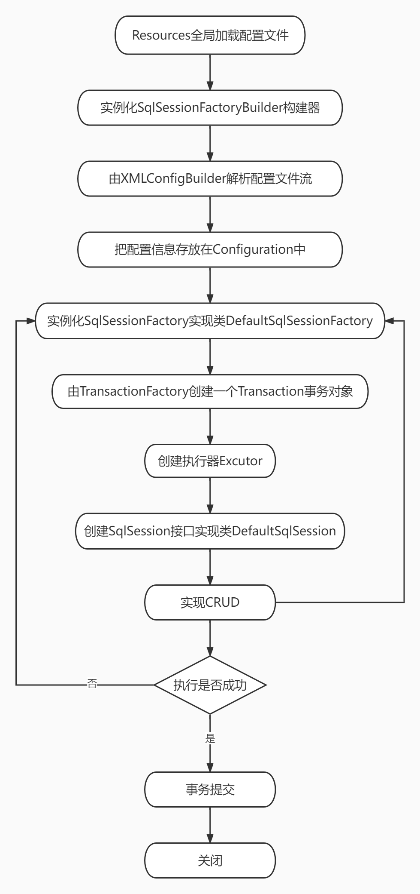
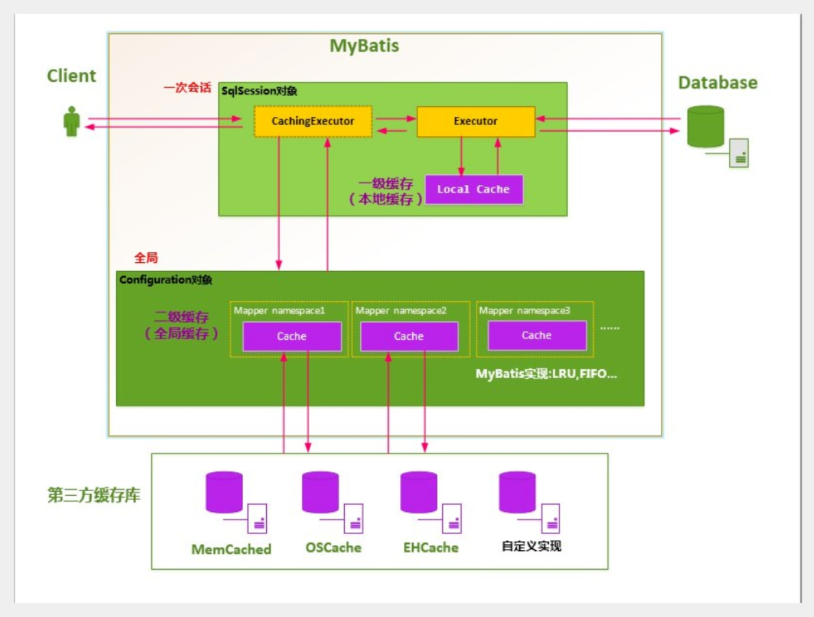
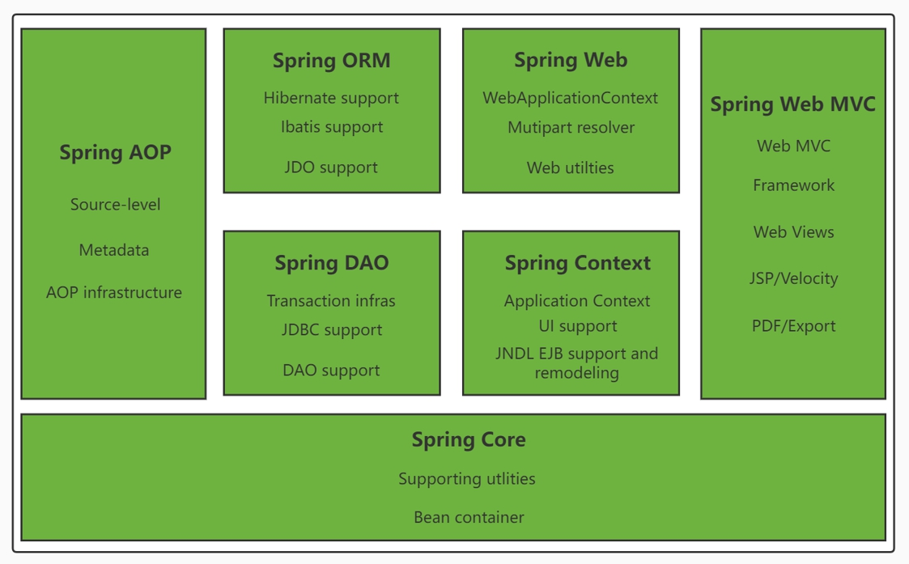
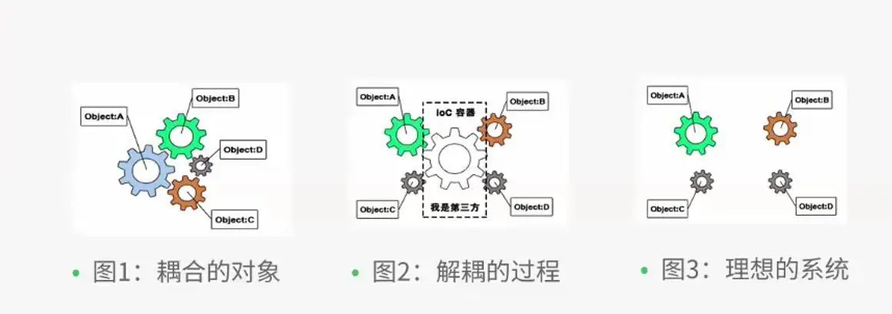
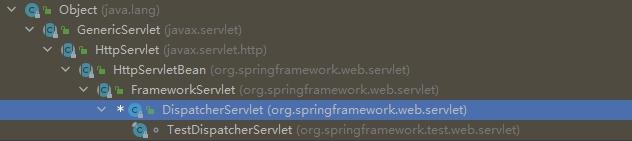

# MyBatis

## 什么是MyBatis

- MyBatis是一款优秀的`持久层框架`
- 它支持自定义SQL、存储过程以及高级映射
- MyBatis免除了几乎所有的 JDBC 代码以及设置参数和获取结果集的工作
- MyBatis可以通过简单的XML或注解来配置和映射原始类型、接口和Java POJO（Plain Old Java Objects，普通老式 Java 对象）为数据库中的记录

## 持久化
- 因为内存有断电即失的特性，所以需要进行数据持久化
- 持久化就是将程序的数据在持久状态和瞬时状态转化的过程

## 持久层
定义：完成持久化工作的代码块

## MyBatis的简单使用
1. pom文件引入jar包
```xml
<!-- mybatis -->
<dependency>
    <groupId>org.mybatis</groupId>
    <artifactId>mybatis</artifactId>
    <version>3.5.7</version>
</dependency>
<!-- mysql-jdbc -->
<dependency>
    <groupId>mysql</groupId>
    <artifactId>mysql-connector-java</artifactId>
    <version>5.1.38</version>
</dependency>
<!-- lombok -->
<dependency>
    <groupId>org.projectlombok</groupId>
    <artifactId>lombok</artifactId>
    <version>1.18.20</version>
</dependency>
<!-- junit测试依赖 -->
<dependency>
    <groupId>junit</groupId>
    <artifactId>junit</artifactId>
    <version>4.13.2</version>
    <scope>test</scope>
</dependency>
```

2. 创建工具类
```java
public class MybatisUtil {
    private static SqlSessionFactory sqlSessionFactory;

    static {
        InputStream inputStream = null;
        try {
            //用输入流来读取xml文件
            inputStream = Resources.getResourceAsStream("mybatis-config.xml");
        } catch (IOException e) {
            e.printStackTrace();
        }
        //创建SqlSession工厂
        sqlSessionFactory = new SqlSessionFactoryBuilder().build(inputStream);
    }

    public static SqlSession getSqlSession(){
        //创建并返回SqlSession
        return sqlSessionFactory.openSession(true);
    }
}
```

3. 创建mybatis核心配置文件

`mybatis-config.xml`

```xml
<?xml version="1.0" encoding="UTF-8" ?>
<!DOCTYPE configuration
        PUBLIC "-//mybatis.org//DTD Config 3.0//EN"
        "http://mybatis.org/dtd/mybatis-3-config.dtd">
<configuration>
    <environments default="development">
        <environment id="development">
            <transactionManager type="JDBC"/>
            <dataSource type="POOLED">
                <!-- JDBC配置 -->
                <property name="driver" value="com.mysql.jdbc.Driver"/>
                <property name="url" value="jdbc:mysql://localhost:3306/student-manager?useSSL=true&amp;useUnicode=true&amp;characterEncoding=utf8&amp;serverTimezone=GMT%2B8"/>
                <property name="username" value="root"/>
                <property name="password" value="lishuang001219"/>
            </dataSource>
        </environment>
    </environments>
    
    <mappers>
        <!-- resource下的Mapper资源存在单层目录结构时的写法 -->
        <mapper resource="StudentMapper.xml"/>
        <!-- resource下的Mapper资源存在多层目录结构时的写法 -->
        <mapper resource="mapper/StudentMapper.xml"/>
    </mappers>
</configuration>
```

4. 创建实体类
```java
@Data
@NoArgsConstructor
@AllArgsConstructor
public class Student {
    private Integer id;
    private String name;
    private Integer age;
    private Integer sex;
    private String num;
    private String grade;
    private String clazz;
    private String address;
}
```

5. 创建Mapper接口文件
```java
public interface StudentMapper {
    List<Student> listStudent();
}
```

6. 创建Mapper配置文件

`UserMapper.xml`

```xml
<?xml version="1.0" encoding="UTF-8" ?>
<!DOCTYPE mapper
        PUBLIC "-//mybatis.org//DTD Mapper 3.0//EN"
        "http://mybatis.org/dtd/mybatis-3-mapper.dtd">
<!-- namespace命名空间：绑定一个对应的Mapper接口 -->
<mapper namespace="mapper.StudentMapper">
    <!-- sql语句 -->
    <!-- id对应接口中定义的方法 resultType表示结果集类型 -->
    <select id="listStudent" resultType="pojo.Student">
        select * from student
    </select>
</mapper>
```

7. 创建业务层
```java
public class StudentService implements StudentMapper {
    @Override
    public List<Student> listStudent() {
        //获取mapper对象
        StudentMapper mapper = MybatisUtil.getSqlSession().getMapper(StudentMapper.class);
        return mapper.listStudent();
    }
}
```

8. 编写测试类
```java
public class MyTest {
    StudentService studentService = new StudentService();

    @Test
    public void test() {
        System.out.println(studentService.listStudent());
    }
}
```

9. 目录结构


## CRUD

1. 实体类

```java
@Data
@NoArgsConstructor
@AllArgsConstructor
@ToString
public class Student {
    private int stuId;
    private String stuName;
    private String stuSex;
    private int stuAge;
    private String stuCls;
}
```

2. Mapper接口

```java
public interface StudentMapper {
    //添加一个学生
    int addStudent(Student student);
	//删除一个学生
    int deleteStudent(int stuId);
	//修改一个学生
    int updateStudent(Student student);
	//查询一个学生
    Student getStudent(int stuId);
}
```

3. Mapper配置文件

```xml
<?xml version="1.0" encoding="UTF-8" ?>
<!DOCTYPE mapper
        PUBLIC "-//mybatis.org//DTD mapper 3.0//EN"
        "http://mybatis.org/dtd/mybatis-3-mapper.dtd">
<!-- namespace命名空间：绑定一个对应的Mapper接口 -->
<mapper namespace="mapper.StudentMapper">
    <insert id="addStudent" parameterType="entity.Student">
        insert into student (stuName, stuSex, stuAge, stuCls) value(#{stuName}, #{stuSex}, #{stuAge}, #{stuCls})
    </insert>

    <delete id="deleteStudent" parameterType="int">
        delete from student where stuId = #{stuId}
    </delete>

    <update id="updateStudent" parameterType="entity.Student">
        update student set stuName = #{stuName}, stuSex = #{stuSex}, stuAge = #{stuAge}, stuCls = #{stuCls} where stuId = #{stuId}
    </update>

    <select id="getStudent" parameterType="int" resultType="entity.Student">
        select * from student where stuId = #{stuId}
    </select>
</mapper>
```

3. Service接口

```java
public interface StudentService {
    int addStudent(Student student);

    int deleteStudent(int stuId);

    int updateStudent(Student student);

    Student getStudent(int stuId);
}
```

4.Service实现类

```java
public class StudentServiceImpl implements StudentService {

    @Override
    public int addStudent(Student student) {
        SqlSession sqlSession = MybatisUtil.getSqlSession();
        StudentMapper mapper = sqlSession.getMapper(StudentMapper.class);
        int rs = mapper.addStudent(student);
        sqlSession.commit();
        return rs;
    }

    @Override
    public int deleteStudent(int stuId) {
        SqlSession sqlSession = MybatisUtil.getSqlSession();
        StudentMapper mapper = sqlSession.getMapper(StudentMapper.class);
        int rs = mapper.deleteStudent(stuId);
        sqlSession.commit();
        return rs;
    }

    @Override
    public int updateStudent(Student student) {
        SqlSession sqlSession = MybatisUtil.getSqlSession();
        StudentMapper mapper = sqlSession.getMapper(StudentMapper.class);
        int rs = mapper.updateStudent(student);
        sqlSession.commit();
        return rs;
    }

    @Override
    public Student getStudent(int stuId) {
        SqlSession sqlSession = MybatisUtil.getSqlSession();
        StudentMapper mapper = sqlSession.getMapper(StudentMapper.class);
        return mapper.getStudent(stuId);
    }
}
```

5. 测试类

```java
public class MyTest {
    StudentServiceImpl studentService = new StudentServiceImpl();

    @Test
    public void addStudent(){
        Student student = new Student(0,"赵小二", "男", 25, "软件19-1");
        studentService.addStudent(student);
    }

    @Test
    public void deleteStudent(){
        studentService.deleteStudent(7);
    }

    @Test
    public void updateStudent(){
        Student student = new Student(5,"赵小二", "女", 18, "软件19-1");
        studentService.updateStudent(student);
    }

    @Test
    public void getStudent(){
        Student student = studentService.getStudent(1);
        System.out.println(student.toString());
    }
}
```

## Map的使用
当实体类或者数据库表、字段、参数过多时，应当考虑使用map传递参数，不用传入完整对象，所以可定制度高

`UserMapper.java`

```java
int addUser(Map<String,Object> map);
```

`UserMapper.xml`

```xml
<insert id="addUser" parameterType="map">
    insert into user (id,pwd) value (#{userId},#{passWord})
</insert>
```

`UserDao.java`

```java
public int addUser(Map<String,Object> map) {
    //获取SqlSession
    try(SqlSession session = MybatisUtils.getSqlSession()){
        //获取Mapper，执行其中方法
        UserMapper mapper = session.getMapper(UserMapper.class);
        int result = mapper.addUser(map);
        session.commit();
        return result;
    }
}
```

测试代码
```java
@Test
void addUser() {
    UserDao userDao = new UserDao();
    Map<String,Object> map = new Map<String,Object>();
    map.put("userId",5);
    map.put("password",123456);
    User user = userDao.addUser(map);
}
```

## 模糊查询两种实现方式
### 方式一：Java代码层面实现
```java
public void getUserLike() {
    SqlSession session = MybatisUtils.getSqlSession();
    UserMapper mapper = session.getMapper(UserMapper.class);
    List<User> userList = mapper.getUserLike("%李%");

    for(User user : userList) {
        System.out.println(user);
    }
    sqlSession.close();
}
```
### 方式二：Mapper.xml中拼接实现(相对安全)
```xml
<select id="getUserLike" resultType="cn.com.scitc.model.User">
    select * from user where name like "%" #{value} "%"
</select>
```

## 配置解析

### 核心配置文件

`mybatis-config.xml`是Mybatis系统核心配置文件，能做一下配置

```xml
<!-- 注意元素节点的顺序！顺序不对会报错 -->
configuration（配置）
properties（属性）
settings（设置）
typeAliases（类型别名）
typeHandlers（类型处理器）
objectFactory（对象工厂）
plugins（插件）
environments（环境配置）
environment（环境变量）
transactionManager（事务管理器）
dataSource（数据源）
databaseIdProvider（数据库厂商标识）
mappers（映射器）
```

### environments环境配置

配置MyBatis的多套运行环境，将SQL映射到多个不同的数据库上，必须指定其中一个为默认运行环境（通过default指定）

- **事务管理器（transactionManager）**
  - JDBC – 这个配置直接使用了 JDBC 的提交和回滚功能，是默认配置
  - MANAGED – 这个配置几乎没做什么
- **数据源（dataSource）**
  - UNPOOLED – 这个数据源的实现会每次请求时打开和关闭连接
  - POOLED – 这种数据源的实现利用“池”的概念将 JDBC 连接对象组织起来，避免了创建新的连接实例时所必需的初始化和认证时间
  - JNDI – 这个数据源实现是为了能在如 EJB 或应用服务器这类容器中使用，容器可以集中或在外部配置数据源，然后放置一个 JNDI 上下文的数据源引用

```xml
<environments default="one">
 <environment id="one">
   <transactionManager type="JDBC">
     <property name="..." value="..."/>
   </transactionManager>
   <dataSource type="POOLED">
     <property name="driver" value="${driver}"/>
     <property name="url" value="${url}"/>
     <property name="username" value="${username}"/>
     <property name="password" value="${password}"/>
   </dataSource>
 </environment>
    
 <environment id="two">
   <transactionManager type="JDBC">
     <property name="..." value="..."/>
   </transactionManager>
   <dataSource type="POOLED">
     <property name="driver" value="${driver}"/>
     <property name="url" value="${url}"/>
     <property name="username" value="${username}"/>
     <property name="password" value="${password}"/>
   </dataSource>
 </environment>
</environments>
```

### mappers映射

映射器 : 定义映射SQL语句文件

#### mapper配置文件引入

使用相对于类路径的资源引用

```xml
<mappers>
 <mapper resource="org/mybatis/builder/PostMapper.xml"/>
</mappers>
```

使用完全限定资源定位符，不推荐使用

```xml
<mappers>
 <mapper url="file:///var/mappers/AuthorMapper.xml"/>
</mappers>
```

使用映射器接口实现类的完全限定类名，需要配置文件名称和接口名称一致，并且位于同一目录下

```xml
<mappers>
 <mapper class="org.mybatis.builder.AuthorMapper"/>
</mappers>
```

将包内的映射器接口实现全部注册为映射器，需要配置文件名称和接口名称一致，并且位于同一目录下

```xml
<mappers>
 <package name="org.mybatis.builder"/>
</mappers>
```

### properties优化

提取数据库配置文件

`db.properties`

```properties
driver=com.mysql.jdbc.Driver
url=jdbc:mysql://localhost:3306/student?useSSL=true&useUnicode=true&characterEncoding=utf8&serverTimezone=GMT%2B8
username=root
password=lishuang001219
```

`mybatis-config.xml`

```xml
<!-- 引入外部配置文件 -->
<properties resource="db.properties" />
<!-- 在引入外部文件后，还可以添加字段，如果存在相同字段，则使用外部配置文件中的值进行覆盖 -->
<properties resource="db.properties">
    <property name="username" value="root" />
    <property name="pwd" value="123456" />
</properties>

<environments default="development">
    <environment id="development">
        <transactionManager type="JDBC"/>
        <dataSource type="POOLED">
            <!-- 直接使用配置文件中的值 -->
            <property name="driver" value="${driver}"/>
            <property name="url" value="${url}"/>
            <property name="username" value="${username}"/>
            <property name="password" value="${password}"/>
        </dataSource>
    </environment>
</environments>
```

### typeAliases类型别名

类型别名可为 Java 类型设置一个缩写名字。 它仅用于 XML 配置，意在降低冗余的全限定类名书写

实体类较少时，给实体类手动设置别名

```xml
<typeAliases>
    <typeAlias type="cn.com.scitc.webapp1901.pojo.User" alias="User" />
</typeAliases>
```
实体类较多时，设置包扫描，自动添加别名，默认为以类的首字母小写作为别名，但是直接使用类名也可以
```xml
<typeAliases>
    <package name="cn.com.scitc.webapp1901.pojo" />
</typeAliases>
```
包扫描，自定义别名，需要使用注解

```java
@Alias("UserPojo")
public class User {

}
```

#### 默认别名

|    别名    |  映射类型  |
| :--------: | :--------: |
|   _byte    |    byte    |
|   _long    |    long    |
|   _short   |   short    |
|    _int    |    int     |
|  _integer  |    int     |
|  _double   |   double   |
|   _float   |   float    |
|  _boolean  |  boolean   |
|   string   |   String   |
|    byte    |    Byte    |
|    long    |    Long    |
|   short    |   Short    |
|    int     |  Integer   |
|  integer   |  Integer   |
|   double   |   Double   |
|   float    |   Float    |
|  boolean   |  Boolean   |
|    date    |    Date    |
|  decimal   | BigDecimal |
| bigdecimal | BigDecimal |
|    map     |    Map     |

### 其他配置

- [settings设置](https://mybatis.org/mybatis-3/zh/configuration.html#settings)

- [typeHandlers类型处理器](https://mybatis.org/mybatis-3/zh/configuration.html#typeHandlers)
- [objectFactory对象工厂](https://mybatis.org/mybatis-3/zh/configuration.html#objectFactory)
- plugins插件
  - [MyBatis Generator Core](https://mvnrepository.com/artifact/org.mybatis.generator/mybatis-generator-core)
  - [MyBatis Plus](https://www.mybatis-plus.com/)
  - [通用mapper](https://mapperhelper.github.io/docs/)

## 生命周期和作用域

理解我们目前已经讨论过的不同作用域和生命周期类是至关重要的，因为错误的使用会导致非常严重的并发问题

### SqlSessionFactoryBuilder

SqlSessionFactoryBuilder的作用在于创建SqlSessionFactory，创建成功后，SqlSessionFactoryBuilder就失去了作用，所以它只能存在于创建SqlSessionFactory的方法中，而不要让其长期存在。==因此SqlSessionFactoryBuilder 实例的最佳作用域是方法作用域（也就是局部方法变量）。==

### SqlSessionFactory

1. SqlSessionFactory 可以被认为是一个数据库连接池，它的作用是创建SqlSession接口对象。因为MyBatis 的本质就是 Java 对数据库的操作，所以SqlSessionFactory的生命周期存在于整个 MyBatis 的应用之中，所以一旦创建了 SqlSessionFactory，就要长期保存它，直至不再使用MyBatis应用，所以可以认为 SqlSessionFactory的生命周期就等同于MyBatis的应用周期。
2. 由于SqlSessionFactory是一个对数据库的连接池，所以它占据着数据库的连接资源。如果创建多个SqlSessionFactory，那么就存在多个数据库连接池，这样不利于对数据库资源的控制，也会导致数据库连接资源被消耗光，出现系统宕机等情况，所以尽量避免发生这样的情况。
3. 因此在一般的应用中我们往往希望 SqlSessionFactory 作为一个单例，让它在应用中被共享。所以说 ==SqlSessionFactory的最佳作用域是应用作用域。==

### SqlSession

如果说SqlSessionFactory相当于数据库连接池，那么SqlSession就相当于一个数据库连接（Connection对象），你可以在一个事务里面执行多条 SQL，然后通过它的commit、rollback等方法，提交或者回滚事务。所以它应该存活在一个业务请求中，处理完整个请求后，应该关闭这条连接，让它归还给 SqlSessionFactory，否则数据库资源就很快被耗费精光，系统就会瘫痪，所以用 try...catch...finally... 语句来保证其正确关闭。==所以SqlSession的最佳的作用域是请求或方法作用域。==

## 结果集映射
当数据库中的列名和实体类中的属性名不完全相同时，需要用到结果集映射
```xml
<resultMap id="userMap" type="com.entity.User">
    <!-- column数据库中的字段，property实体类中的属性 -->
    <result column="id" property="id" />
    <result column="username" property="username" />
    <!-- 这里我们看到，只有password字段与属性名不匹配，所以我们可以只配置这一个字段就行，相同字段不用配置也可以 -->
    <result column="password" property="pwd" />
</resultMap>

<select id="selectUsers" resultType="userMap">
  select * from user
</select>
```

## 日志
指定 MyBatis 所用日志的具体实现，在核心配置文件的settings标签中进行配置

### 日志工厂

```xml
<!-- 开启日志 -->
<settings>
    <!-- SLF4J | LOG4J（3.5.9 起废弃） | LOG4J2 | JDK_LOGGING | COMMONS_LOGGING | STDOUT_LOGGING（控制台默认输出） | NO_LOGGING -->
    <setting name="logImpl" value="STDOUT_LOGGING"/>
</settings>
```

### Log4j的简单使用
1. 导入依赖
```xml
<!-- https://mvnrepository.com/artifact/log4j/log4j -->
<dependency>
    <groupId>log4j</groupId>
    <artifactId>log4j</artifactId>
    <version>1.2.17</version>
</dependency>
```
2. 添加Log4j配置文件

`log4j.properties`

```properties
### 配置根 ###
log4j.rootLogger = debug,console ,fileAppender

### 设置输出sql的级别，其中logger后面的内容全部为jar包中所包含的包名 ###
log4j.logger.org.apache=dubug
log4j.logger.java.sql.Connection=dubug
log4j.logger.java.sql.Statement=dubug
log4j.logger.java.sql.PreparedStatement=dubug
log4j.logger.java.sql.ResultSet=dubug

### 配置输出到控制台 ###
log4j.appender.console = org.apache.log4j.ConsoleAppender
log4j.appender.console.Target = System.out
log4j.appender.console.layout = org.apache.log4j.PatternLayout
log4j.appender.console.layout.ConversionPattern =  %d{ABSOLUTE} %5p %c{1}:%L - %m%n

### 配置输出到文件 ###
log4j.appender.fileAppender = org.apache.log4j.FileAppender
log4j.appender.fileAppender.File = logs/log.log
log4j.appender.fileAppender.Append = true
log4j.appender.fileAppender.Threshold = DEBUG
log4j.appender.fileAppender.layout = org.apache.log4j.PatternLayout
log4j.appender.fileAppender.layout.ConversionPattern = %-d{yyyy-MM-dd HH:mm:ss}  [ %t:%r ] - [ %p ]  %m%n
```
3. setting设置日志实现

```xml
<settings>
   <setting name="logImpl" value="LOG4J"/>
</settings>
```

4. 测试

```java
//注意导包：org.apache.log4j.Logger
static Logger logger = Logger.getLogger(MyTest.class);

@Test
public void selectUser() {
   logger.info("info：进入selectUser方法");
   logger.debug("debug：进入selectUser方法");
   logger.error("error: 进入selectUser方法");
   SqlSession session = MybatisUtils.getSession();
   UserMapper mapper = session.getMapper(UserMapper.class);
   List<User> users = mapper.selectUser();
   for (User user: users){
       System.out.println(user);
  }
   session.close();
}
```

## 分页
### limit实现

在SQL层面实现分页

语法

```sql
-- 从索引0开始，查询20条记录
select * from `student` limit 0,20
```
步骤：

1. 编写Mapper接口

```java
//选择全部用户实现分页
List<User> selectUser(Map<String,Integer> map);
```

2. 编写Mapper配置文件

```xml
<select id="selectUser" parameterType="map" resultType="user">
  select * from user limit #{startIndex},#{pageSize}
</select>
```

3. 测试

```java
//分页查询 , 两个参数startIndex , pageSize
@Test
public void testSelectUser() {
   SqlSession session = MybatisUtils.getSession();
   UserMapper mapper = session.getMapper(UserMapper.class);

   int currentPage = 1;  //第几页
   int pageSize = 2;  //每页显示几个
   Map<String,Integer> map = new HashMap<String,Integer>();
   map.put("startIndex",(currentPage-1)*pageSize);
   map.put("pageSize",pageSize);

   List<User> users = mapper.selectUser(map);

   for (User user: users){
       System.out.println(user);
  }

   session.close();
}
```

### RowBounds实现

在Java代码层面来实现分页，但是在开发中一般都不会使用这种方式

步骤：

1. 编写Mapper接口

```java
//选择全部用户RowBounds实现分页
List<User> getUserByRowBounds();
```

2. 编写mapper文件

```xml
<select id="getUserByRowBounds" resultType="user">
select * from user
</select>
```

3. 测试

```java
@Test
public void testUserByRowBounds() {
   SqlSession session = MybatisUtils.getSession();

   int currentPage = 2;  //第几页
   int pageSize = 2;  //每页显示几个
   RowBounds rowBounds = new RowBounds((currentPage-1)*pageSize,pageSize);

   //通过session.**方法进行传递rowBounds，[此种方式现在已经不推荐使用了]
   List<User> users = session.selectList("com.kuang.mapper.UserMapper.getUserByRowBounds", null, rowBounds);

   for (User user: users){
       System.out.println(user);
  }
   session.close();
}
```

### PageHelper分页插件

[Mybatis-PageHelper](https://pagehelper.github.io/)

#### 后端
1. 导入依赖
```xml
<!--分页-->
<dependency>
    <groupId>com.github.pagehelper</groupId>
    <artifactId>pagehelper</artifactId>
    <version>5.1.2</version>
</dependency>
```
2. 添加配置
```xml
<!-- 3.配置SqlSessionFactory对象 -->
<bean id="sqlSessionFactory" class="org.mybatis.spring.SqlSessionFactoryBean">
        <!-- 注入数据库连接池 -->
        <property name="dataSource" ref="dataSource"/>
        <!-- 配置MyBaties全局配置文件:mybatis-config.xml -->
        <property name="configLocation" value="classpath:mybatis-config.xml"/>
        <!--分页插件-->
        <property name="plugins">
                <set>
                        <bean class="com.github.pagehelper.PageInterceptor">
                                <property name="properties">
                                        <props>
                                                <prop key="helperDialect">mysql</prop>
                                        </props>
                                </property>
                        </bean>
                </set>
        </property>
</bean>
```
3. service层
```java
public interface StudentService {
    //查询全部Student,返回list集合
    PageInfo findStudentList(int pageNum,int pageSize);
}
```
```java
public PageInfo findStudentList(int pageNum,int pageSize) {
    // 分页语句之后紧跟的第一次查询才会分页，所以此结构最合理
    PageHelper.startPage(pageNum,pageSize);
    List<Student> list = studentMapper.findStudentList();
    PageInfo pageInfo = new PageInfo(list);
    return pageInfo;
}
```
4. controller层
```java
@RequestMapping("/list/{pageNum}/{pageSize}")
@ResponseBody
// 前台传递两个参数，第一个参数为页码，就是你要查询第几页的数据，第二个参数是，一页几条记录
public PageInfo list(Model model, @PathVariable int pageNum, @PathVariable int pageSize) {
    PageInfo pageInfo = studentService.findStudentList(pageNum,pageSize);
    // 插件将处理好后的集合封装在了PageInfo对象里面，直接返回到前端即可
    return pageInfo;
}
```
5. PageInfo类的常见属性
```java
public class PageInfo<T> implements Serializable {
private static final long serialVersionUID = 1L;
//当前页
private int pageNum;
//每页的数量
private int pageSize;
//当前页的数量
private int size;
//由于startRow 和endRow 不常用，这里说个具体的用法
//可以在页面中"显示startRow 到endRow 共size 条数据"
//当前页面第一个元素在数据库中的行号
private int startRow;
//当前页面最后一个元素在数据库中的行号
private int endRow;
//总记录数
private long total;
//总页数
private int pages;
//结果集
private List<T> list;
//前一页
private int prePage;
//下一页
private int nextPage;
//是否为第一页
private boolean isFirstPage = false;
//是否为最后一页
private boolean isLastPage = false;
//是否有前一页
private boolean hasPreviousPage = false;
//是否有下一页
private boolean hasNextPage = false;
//导航页码数
private int navigatePages;
//所有导航页号
private int[] navigatepageNums;
//导航条上的第一页
private int navigateFirstPage;
//导航条上的最后一页
private int navigateLastPage;
}
```

#### 前端
1. 导入依赖，我使用了JQuery和BootStrap
```html
<link href="https://cdn.usebootstrap.com/bootstrap/4.4.1/css/bootstrap.min.css" rel="stylesheet">
<script type="text/javascript" src="https://code.jquery.com/jquery-3.5.1.min.js"></script>
```

1. HTML部分
```html
<!-- 搭建基本表结构，固定表头 -->
<div class="row clearfix">
    <div class="col-md-12 column">
        <table class="table table-hover table-striped" style='vertical-align: middle;text-align: center;'>
            <thead>
            <tr>
                <th>编号</th>
                <th>姓名</th>
                <th>年龄</th>
                <th>性别</th>
                <th>班级</th>
                <th>学号</th>
                <th>操作</th>
            </tr>
            </thead>

            <tbody id="tbody">
            </tbody>
        </table>
    </div>
</div>

<!-- 用nav搭建基本页码结构 -->
<div class="row">
    <nav aria-label="..." class="col-md-3 offset-md-9 mt-3">
        <ul class="pagination" id="pageNum">
        </ul>
    </nav>
</div>
```

2. Javascript部分
```html
<script>
    $(function () {
        // 页面加载时默认获取第一页数据，这里是一页5条记录的分法
        getPageList(1,5);

        // 首页
        let navigateFirstPage;

        // 末页
        let navigateLastPage;

        // 当前页
        let pageNum;

        // 下一页
        let nextPage;

        // 上一页
        let prePage;

        // 页码集
        let navigatepageNums;
    });

    function getPageList(pageNum,pageSize) {
        console.log("查询第" + pageNum + "页数据，每页" + pageSize + "条");

        $.get({
            url:"${pageContext.request.contextPath}/student/list/" + pageNum + "/" + pageSize,
            data:{},
            success: function (data) {
                myTable(data);
            },
            error: function () {
                alert("失败");
            }
        });
    }

    // 表格渲染
    function myTable(data) {
        // 获取后台传递过来的一些重要的对象属性
        // 首页
        navigateFirstPage = data.navigateFirstPage;
        // 末页
        navigateLastPage = data.navigateLastPage
        // 当前页
        pageNum = data.nowPage;
        // 下一页
        nextPage = data.nextPage;
        // 上一页
        prePage = data.prePage;
        // 页码集
        navigatepageNums = data.navigatepageNums;


        // 取出数据
        let arr = data.list;

        // 清空表格
        $("#tbody").html("");
        // 填充表格
        // 已经拿到了数据，他们封装在一个数组里面，这里我是JSP页面，所以拼接有点不一样，具体拼接请自己思考
        for(let i =0; i<arr.length ;i++) {
            let html = "<tr>" +
                "<td>" + arr[i].id +"</td>" +
                "<td>" + arr[i].name +"</td>" +
                "<td>" + arr[i].age +"</td>" +
                "<td>" + arr[i].sex +"</td>" +
                "<td>" + arr[i].cls +"</td>" +
                "<td>" + arr[i].num +"</td>" +
                "<td>" +
                '<a class="btn btn-primary" href="<c:url value="/student/edit/'+ arr[i].id +'" />" style="margin-right: 10px">修改</a>' +
                '<a class="btn btn-danger" href="<c:url value="/student/delete/'+ arr[i].id +'" />">删除</a>' +
                "</td>" +
                "</tr>"
            
            // 追加表格体到页面上
            $("#tbody").append(html);
        }

        // 清空页数导航栏
        $("#pageNum").html("");
        // 填充页数导航栏
        for(let i=0; i<navigatepageNums.length ;i++) {
            nowPage = navigatepageNums[i];

            let pageNum = '<li class="page-item">' +
                '<button class="page-link" onclick="getPageList($(this).text(),5)">' + nowPage + '</button>' +
                "</li>";

            let pageStart = '<li class="page-item">' +
                '<button class="page-link" onclick="getPageList(navigateFirstPage,5)">首页</button>' +
                "</li>";

            let pageEnd = '<li class="page-item">' +
                '<button class="page-link" onclick="getPageList(nextPage,5)">下一页</button>' +
                "</li>";

            if(i == 0) {
                pageNum = pageStart + pageNum;
            }
            if(i == navigatepageNums.length -1) {
                pageNum = pageNum + pageEnd;
            }
            
            // 追加导航栏到页面上
            $("#pageNum").append(pageNum);
        }

        // 为当前页面添加激活样式
        $("li.page-item")[data.pageNum].className += ' active';
    }
</script>
```

## 使用注解开发
1. 在工具类中开启事务自动提交
```java
public static SqlSession getSqlSession(){
    return sqlSessionFactory.openSession(true);
}
```
2. 在mybatis配置文件中绑定接口类

```xml
<mappers>
    <mapper class="cn.com.scitc.webapp1901.mapper.UserMapper" />
</mappers>
```
3. 编写Mapper接口文件

`UserMapper.java`

```java
//查询用户列表
@Select("select * from user")
List<User> getUsers();


//根据id查询用户
@Select("select * from user where id = #{id}")
User selectUserById(@Param("id") int id);


//添加一个用户
@Insert("insert into user (id,name,pwd) values (#{id},#{name},#{pwd})")
int addUser(User user);


//修改一个用户
@Update("update user set name=#{name},pwd=#{pwd} where id = #{id}")
int updateUser(User user);

//根据id删除用
@Delete("delete from user where id = #{id}")
int deleteUser(@Param("id") int id);
```

> 关于@Param

- 基本类型的参数或者String类型，需要加上
- 引用类型不需要加
- 如果只有一个基本类型的话，可以忽略，但是建议加上
- 我们在SQL中引用的就是@Param中设置的属性名

## Mybatis执行流程



## Lombok

Lombok项目是一个Java库，它会自动插入编辑器和构建工具中，Lombok提供了一组有用的注释，用来消除Java类中的大量样板代码。仅五个字符(@Data)就可以替换数百行代码从而产生干净，简洁且易于维护的Java类。

常用注解：

@Data 注解在类上；提供类所有属性的 getting 和 setting 方法，此外还提供了equals、canEqual、hashCode、toString 方法、无参构造方法
@Setter ：注解在属性上；为属性提供 setting 方法
@Setter ：注解在属性上；为属性提供 getting 方法
@Log4j ：注解在类上；为类提供一个 属性名为log 的 log4j 日志对象
@NoArgsConstructor ：注解在类上；为类提供一个无参的构造方法
@AllArgsConstructor ：注解在类上；为类提供一个全参的构造方法
@Cleanup : 可以关闭流     （不建议使用）
@Builder ： 被注解的类加个构造者模式
@Synchronized ： 加个同步锁
@SneakyThrows : 等同于try/catch 捕获异常
@NonNull : 如果给参数加个这个注解 参数为null会抛出空指针异常
@Value : 注解和@Data类似，区别在于它会把所有成员变量默认定义为private final修饰，并且不会生成set方法。

简单使用：

1. idea安装lombok插件
2. 导入lombok的jar包

```xml
<dependency>
    <groupId>org.projectlombok</groupId>
    <artifactId>lombok</artifactId>
    <version>1.18.20</version>
</dependency>
```

3. 使用

```java
@Data
@AllArgsConstructor
@NoArgsConstructor
public class User {
    private int id;
    private String name;
    private String password;
}
```

## Mybatis多表查询

### 多对一查询

实体类

`Student.java`

```java
public class Student {
    private int id;
    private String name;
    // 多个学生关联一个老师
    private Teacher teacher;
}
```
`Teacher.java`

```java
public class Teacher {
    private int id;
    private String name;
}
```

方法一：按查询嵌套处理（子查询）
```xml
<select id="getStydent" resultMap="studentTeacher">
    select  * from student
</select>

<resultMap id="studentTeacher" type="Student">
    <result property="id" column="id" />
    <result property="name" column="name" />
    <!--association关联属性 property属性名 javaType属性类型 column在多的一方的表中的列名-->
    <association property="teacher" column="tid" javaType="Teacher" select="getTeacher" />
</resultMap>

<select id="getTeacher" resultMap="Teacher">
    select * from teacher where id = #{tid}
</select>
```
方法二：按结果嵌套查询（关联查询）
```xml
<select id="getStudent" resultMap="StudentTeacher">
    select s.id sid,s.name sname,t.name tname from student s,teacher t where s.tid = t.id;
</select>

<resultMap id="StudentTeacher" type="Student">
    <result property="id" column="sid" />
    <result property="name" column="sname" />
    <association property="teacher" javaType="Teacher">
        <result property="name" column="tname" />
    </association>
</resultMap>
```

### 一对多查询

实体类

`Student.java`

```java
public class Student {
    private int id;
    private String name;
    private int tid;
}
```
`Teacher.java`

```java
public class Teacher {
    private int id;
    private String name;
    // 一个老师拥有多个学生
    private List<Student> students;
}
```

方法一：按查询嵌套处理（子查询）
```xml
<select id="getTeacher" resultMap="TeacherStudent">
    select * from teacher where id = #{tid}
</select>

<resultMap id="TeacherStudent" type="Teacher">
    <!--collection关联集合属性 property属性名 ofType泛型中类型 column在一的一方的表中的列名-->
    <collection property="students" javaType="ArrayList" ofType="Student" select="getStudentByTeacherId" column="id" />
</resultMap>

<select id="getStudentByTeacherId" resultType="Studnet">
    select * from student where tid = #{tid}
</select>
```
方法二：按结果嵌套查询（关联查询）
```xml
<select id="getTeacher" resultMap="TeacherStudent">
    select s.id sid,s.name sname,t.name tname,t.id tid from student s,teacher t where s.tid = t.id and t.id = #{tid}
</select>

<reslutMap id="TeacherStudent" type="Teacher">
    <result property="id" column="tid" />
    <result property="name" column="tname" />
    <collection property="students" ofType="Student">
        <result property="id" column="sid" />
        <result property="name" column="sname" />
        <result property="tid" column="tid" />
    </collection>
</reslutMap>
```

## 动态SQL
> 定义：动态 SQL 是 MyBatis 的强大特性之一，它可以根据不同的条件生成不同的SQL语句

四个常用标签：

- if
- choose (when, otherwise)
- trim (where, set)
- foreach

### if标签

> if标签通常用于根据条件包含where子句的一部分

```xml
<select id="queryBlogIf" parameterType="map" resultType="blog">
    select * from blog where 1=1
    <if test="title != null">
        and title = #{title}
    </if>
    <if test="author != null">
        and author = #{author}
    </if>
</select>
```
```java
public void queryBlogIf() {
    SqlSession sqlSession = MybatisUtils.getSqlSession();
    BlogMapper mapper = sqlSession.getMapper(BlogMapper.class);

    HashMap map = new HashMap();
    map.put("title","Java从入门到放弃");
    map.put("author","John.Cena");

    List<Blog> blogs = mapper.queryBlogIf(map);

    for(Blog blog : blogs) {
        System.out.println(blog);
    }

    sqlSession.close();
}
```
### where标签

> where 元素只会在子元素返回任何内容的情况下才插入 “WHERE” 子句。而且，若子句的开头为 “AND” 或 “OR”，where 元素也会将它们去除。
```xml
<select id="queryBlogIf" parameterType="map" resultType="blog">
    select * from blog
    <where>
        <if test="title != null">
            and title = #{title}
        </if>
        <if test="author != null">
            and author = #{author}
        </if>
    </where>
</select>
```
### choose、when、otherwise

> 有时候，我们不想使用所有的条件，而只是想从多个条件中选择一个使用。针对这种情况，MyBatis 提供了 choose 元素，它有点像 Java 中的 switch 语句。
```xml
<select id="findActiveBlogLike"
     resultType="Blog">
  SELECT * FROM BLOG WHERE state = ‘ACTIVE’
  <where>
  	<choose>
       <when test="title != null">
         AND title like #{title}
       </when>
       <when test="author != null and author.name != null">
         AND author_name like #{author.name}
       </when>
       <otherwise>
         AND featured = 1
       </otherwise>
  	</choose>
  </where>
</select>
```
### set标签

> set 元素会动态地在行首插入 SET 关键字，并会删掉额外的逗号（这些逗号是在使用条件语句给列赋值时引入的）。
```xml
<update id="updateAuthorIfNecessary">
  update Author
    <set>
      <if test="username != null">username=#{username},</if>
      <if test="password != null">password=#{password},</if>
      <if test="email != null">email=#{email},</if>
      <if test="bio != null">bio=#{bio}</if>
    </set>
  where id=#{id}
</update>
```
### trim自定义标签

### foreach标签

[foreach详解](https://www.cnblogs.com/fnlingnzb-learner/p/10566452.html)

将数据库中前三个数据的id修改为1,2,3；

需求：我们需要查询 blog 表中 id 分别为1,2,3的博客信息

1. 编写接口

```java
List<Blog> queryBlogForeach(Map map);
```

2. 编写SQL语句

```xml
<select id="queryBlogForeach" parameterType="map" resultType="blog">
  select * from blog
   <where>
       <!--
       collection:指定输入对象中的集合属性
       item:每次遍历生成的对象
       open:开始遍历时的拼接字符串
       close:结束时拼接的字符串
       separator:遍历对象之间需要拼接的字符串
       select * from blog where 1=1 and (id=1 or id=2 or id=3)
     -->
       <foreach collection="ids"  item="id" open="and (" close=")" separator="or">
          id=#{id}
       </foreach>
   </where>
</select>
```

3. 测试

```java
@Test
public void testQueryBlogForeach(){
   SqlSession session = MybatisUtils.getSession();
   BlogMapper mapper = session.getMapper(BlogMapper.class);

   HashMap map = new HashMap();
   List<Integer> ids = new ArrayList<Integer>();
   ids.add(1);
   ids.add(2);
   ids.add(3);
   map.put("ids",ids);

   List<Blog> blogs = mapper.queryBlogForeach(map);

   System.out.println(blogs);

   session.close();
}
```

### SQL片段

有时候可能某个 sql 语句我们用的特别多，为了增加代码的重用性，简化代码，我们需要将这些代码抽取出来，然后使用时直接调用。

提取SQL片段

```xml
<sql id="if-title-author">
   <if test="title != null">
      title = #{title}
   </if>
   <if test="author != null">
      and author = #{author}
   </if>
</sql>
```

引用SQL片段

```xml
<select id="queryBlogIf" parameterType="map" resultType="blog">
  select * from blog
   <where>
       <!-- 引用 sql 片段，如果refid 指定的不在本文件中，那么需要在前面加上 namespace -->
       <include refid="if-title-author"></include>
       <!-- 在这里还可以引用其他的 sql 片段 -->
   </where>
</select>
```

注：

- 最好基于 单表来定义 sql 片段，提高片段的可重用性
- 在 sql 片段中不要包括 where

## 缓存

### 定义

1. 什么是缓存
   - 存在内存中的临时数据。
   - 将用户经常查询的数据放在缓存（内存）中，用户去查询数据就不用从磁盘上(关系型数据库数据文件)查询，从缓存中查询，从而提高查询效率，解决了高并发系统的性能问题。
2. 为什么使用缓存
   - 减少和数据库的交互次数，减少系统开销，提高系统效率。
3. 什么样的数据能使用缓存
   - 经常查询并且不经常改变的数据。
4. 缓存策略
   - mybatis有四种缓存策略，默认使用的是LRU策略
    ```
    LRU 最近最少使用：移除最长时间不被使用的对象
    FIFO 先进先出：按对象进入缓存的顺序来移除它们
    SOFT 软引用：基于垃圾回收器状态和软引用规则移除对象
    WEAK 弱引用：更积极地基于垃圾收集器状态和弱引用规则移除对象
    ```

### 一级缓存

- SqlSession级别的缓存，也称为本地缓存
- 由Mybatis默认开启，无法关闭
- 与数据库同一次会话期间查询到的数据会放在本地缓存中
- 以后如果需要获取相同的数据，直接从缓存中拿，没必须再去查询数据库

- 可以通过代码，手动清除一级缓存

```java
  session.clearCache();
```

#### 一级缓存失效的四种情况

1. sqlSession不同

```java
@Test
public void testQueryUserById(){
   SqlSession session = MybatisUtils.getSession();
   SqlSession session2 = MybatisUtils.getSession();
   UserMapper mapper = session.getMapper(UserMapper.class);
   UserMapper mapper2 = session2.getMapper(UserMapper.class);

   User user = mapper.queryUserById(1);
   System.out.println(user);
   User user2 = mapper2.queryUserById(1);
   System.out.println(user2);
   System.out.println(user==user2);

   session.close();
   session2.close();
}
```

2. sqlSession相同，查询条件不同

```java
@Test
public void testQueryUserById(){
   SqlSession session = MybatisUtils.getSession();
   UserMapper mapper = session.getMapper(UserMapper.class);
   UserMapper mapper2 = session.getMapper(UserMapper.class);

   User user = mapper.queryUserById(1);
   System.out.println(user);
   User user2 = mapper2.queryUserById(2);
   System.out.println(user2);
   System.out.println(user==user2);

   session.close();
}
```

3. sqlSession相同，两次查询之间执行了增删改操作！

```java
@Test
public void testQueryUserById(){
   SqlSession session = MybatisUtils.getSession();
   UserMapper mapper = session.getMapper(UserMapper.class);

   User user = mapper.queryUserById(1);
   System.out.println(user);

   HashMap map = new HashMap();
   map.put("name","kuangshen");
   map.put("id",4);
   mapper.updateUser(map);

   User user2 = mapper.queryUserById(1);
   System.out.println(user2);

   System.out.println(user==user2);

   session.close();
}
```

4. sqlSession相同，手动清除一级缓存

```java
@Test
public void testQueryUserById(){
   SqlSession session = MybatisUtils.getSession();
   UserMapper mapper = session.getMapper(UserMapper.class);

   User user = mapper.queryUserById(1);
   System.out.println(user);

   session.clearCache();//手动清除缓存

   User user2 = mapper.queryUserById(1);
   System.out.println(user2);

   System.out.println(user==user2);

   session.close();
}
```

### 二级缓存

- 二级缓存需要手动开启和配置
- 二级缓存也叫全局缓存，一级缓存作用域太低了，所以诞生了二级缓存
- 基于namespace级别的缓存(在一个mapper接口内有效)，一个名称空间，对应一个二级缓存
- 为了提高扩展性，Mybatis定义了缓存接口Cache，用于自定义二级缓存

#### 二级缓存的工作机制

- 一个会话查询一条数据，这个数据就会被放在当前会话的一级缓存中
- 如果当前会话关闭了，这个会话对应的一级缓存就没了；但是我们想要的是，会话关闭了，一级缓存中的数据被保存到二级缓存中
- 新的会话查询信息，就可以从二级缓存中获取内容
- 不同的mapper查出的数据会放在自己对应的缓存（map）中

#### 二级缓存的使用

1. 显示定义开启全局缓存，默认值为true，所以也可以不用设置

`mybatis-config.xml`

```xml
<setting name="cacheEnabled" value="true" />
```
2. 去每个mapper配置文件中配置使用二级缓存
```xml
<cache />

<!-- eviction缓存策略 -->
<!-- flushInterval缓存刷新时间(毫秒) -->
<!-- size缓存空间大小 -->
<!-- readOnly是否只读 -->
<cache
  eviction="FIFO"
  flushInterval="60000"
  size="512"
  readOnly="true"/>
```
3. 使用二级缓存需要将实体类序列化
```java
public class User implements Serializable {

}
```

### 缓存原理图

通过Mybatis查询数据的顺序是：二级缓存 ==> 一级缓存 ==>数据库查询



### 第三方缓存实现--EhCache
> 简介：Ehcache是一种广泛使用的java分布式缓存，用于通用缓存

使用步骤：

1. 导入依赖

```xml
<!-- https://mvnrepository.com/artifact/org.mybatis.caches/mybatis-ehcache -->
<dependency>
    <groupId>org.mybatis.caches</groupId>
    <artifactId>mybatis-ehcache</artifactId>
    <version>1.2.1</version>
</dependency>
```
2. 配置mapper中的缓存标签

```xml
<cache type = “org.mybatis.caches.ehcache.EhcacheCache” />
```
3. 编写ehcache.xml文件，如果在加载时未找到/ehcache.xml资源或出现问题，则将使用默认配置
```xml
<?xml version="1.0" encoding="UTF-8"?>
<ehcache xmlns:xsi="http://www.w3.org/2001/XMLSchema-instance"
         xsi:noNamespaceSchemaLocation="http://ehcache.org/ehcache.xsd"
         updateCheck="false">
    <!--
       diskStore：为缓存路径，ehcache分为内存和磁盘两级，此属性定义磁盘的缓存位置。参数解释如下：
       user.home – 用户主目录
       user.dir  – 用户当前工作目录
       java.io.tmpdir – 默认临时文件路径
     -->
    <diskStore path="./tmpdir/Tmp_EhCache"/>
    
    <defaultCache
            eternal="false"
            maxElementsInMemory="10000"
            overflowToDisk="false"
            diskPersistent="false"
            timeToIdleSeconds="1800"
            timeToLiveSeconds="259200"
            memoryStoreEvictionPolicy="LRU"/>
 
    <cache
            name="cloud_user"
            eternal="false"
            maxElementsInMemory="5000"
            overflowToDisk="false"
            diskPersistent="false"
            timeToIdleSeconds="1800"
            timeToLiveSeconds="1800"
            memoryStoreEvictionPolicy="LRU"/>
    <!--
       defaultCache：默认缓存策略，当ehcache找不到定义的缓存时，则使用这个缓存策略。只能定义一个。
     -->
    <!--
      name:缓存名称。
      maxElementsInMemory:缓存最大数目
      maxElementsOnDisk：硬盘最大缓存个数。
      eternal:对象是否永久有效，一但设置了，timeout将不起作用。
      overflowToDisk:是否保存到磁盘，当系统当机时
      timeToIdleSeconds:设置对象在失效前的允许闲置时间（单位：秒）。仅当eternal=false对象不是永久有效时使用，可选属性，默认值是0，也就是可闲置时间无穷大。
      timeToLiveSeconds:设置对象在失效前允许存活时间（单位：秒）。最大时间介于创建时间和失效时间之间。仅当eternal=false对象不是永久有效时使用，默认是0.，也就是对象存活时间无穷大。
      diskPersistent：是否缓存虚拟机重启期数据 Whether the disk store persists between restarts of the Virtual Machine. The default value is false.
      diskSpoolBufferSizeMB：这个参数设置DiskStore（磁盘缓存）的缓存区大小。默认是30MB。每个Cache都应该有自己的一个缓冲区。
      diskExpiryThreadIntervalSeconds：磁盘失效线程运行时间间隔，默认是120秒。
      memoryStoreEvictionPolicy：当达到maxElementsInMemory限制时，Ehcache将会根据指定的策略去清理内存。默认策略是LRU（最近最少使用）。你可以设置为FIFO（先进先出）或是LFU（较少使用）。
      clearOnFlush：内存数量最大时是否清除。
      memoryStoreEvictionPolicy:可选策略有：LRU（最近最少使用，默认策略）、FIFO（先进先出）、LFU（最少访问次数）。
      FIFO，first in first out，这个是大家最熟的，先进先出。
      LFU， Less Frequently Used，就是上面例子中使用的策略，直白一点就是讲一直以来最少被使用的。如上面所讲，缓存的元素有一个hit属性，hit值最小的将会被清出缓存。
      LRU，Least Recently Used，最近最少使用的，缓存的元素有一个时间戳，当缓存容量满了，而又需要腾出地方来缓存新的元素的时候，那么现有缓存元素中时间戳离当前时间最远的元素将被清出缓存。
   -->

</ehcache>
```

## Thymeleaf模板引擎

html文件根标签属性引入Thymeleaf
```html
<html lang="en" xmlns:th="http://www.thymeleaf.org">
```
语法
```html
<h1 th:text="'姓名：'+${name}"></h1>
<h1 th:text="|姓名：${name}|"></h1>
<h1 th:utext="'姓名：'+${name}"></h1>
<h1 th:each="user:${users}" th:text="${user}"></h1>
```
fragment标签与insert、replace、include属性
```html
<!-- 用fragment标签定义 -->
<footer th:fragment="copy">
  &copy; 2011 The Good Thymes Virtual Grocery
</footer>

<!-- 用insert属性在元素下引用定义好的片段 -->
<!-- 效果如下 
<div>
    <footer>
        &copy; 2011 The Good Thymes Virtual Grocery
    </footer>
</div> 
-->
<div th:insert="footer :: copy"></div>

<!-- 用replace属性在元素下引用定义好的片段 -->
<!-- 效果如下 
<footer>
    &copy; 2011 The Good Thymes Virtual Grocery
</footer>
-->
<div th:replace="footer :: copy"></div>

<!-- 用include属性在元素下引用定义好的片段 -->
<!-- 效果如下 
<div>
    &copy; 2011 The Good Thymes Virtual Grocery
</div>
-->
<div th:include="footer :: copy"></div>

<!-- 注：当定义标签与使用标签不存在与同一个目录中时，引用时要带上路径 -->
<div th:insert="main/footer :: copy"></div>
```

## mybatis-generator的简单使用

注：此插件主要用于自动生成实体类、Mapper接口和Mapper配置文件，mybatis核心配置文件和业务层文件需要根据实际应用场景对照生成的文件自行编写
1. 编写pom文件
```xml
<!-- https://mvnrepository.com/artifact/org.mybatis/mybatis -->
<dependency>
    <groupId>org.mybatis</groupId>
    <artifactId>mybatis</artifactId>
    <version>3.5.5</version>
</dependency>
<!-- https://mvnrepository.com/artifact/mysql/mysql-connector-java -->
<dependency>
    <groupId>mysql</groupId>
    <artifactId>mysql-connector-java</artifactId>
    <version>5.1.38</version>
</dependency>

<!-- 添加插件(注意将此行注释删除，中文会引起idea报错) -->
<build>
    <plugins>
        <plugin>
            <groupId>org.apache.maven.plugins</groupId>
            <artifactId>maven-war-plugin</artifactId>
            <version>3.3.0</version>
        </plugin>
        <plugin>
            <groupId>org.mybatis.generator</groupId>
            <artifactId>mybatis-generator-maven-plugin</artifactId>
            <version>1.4.0</version>
            <executions>
                <execution>
                    <id>Generate MyBatis Artifacts</id>
                    <goals>
                        <goal>generate</goal>
                    </goals>
                </execution>
            </executions>
            <dependencies>
                <dependency>
                    <groupId>org.mybatis</groupId>
                    <artifactId>mybatis</artifactId>
                    <version>3.5.5</version>
                </dependency>
                <!-- mysql-jdbc -->
                <dependency>
                    <groupId>mysql</groupId>
                    <artifactId>mysql-connector-java</artifactId>
                    <version>5.1.38</version>
                </dependency>
            </dependencies>
            <configuration>
                <!-- 生成的文件覆盖源文件 -->
                <overwrite>true</overwrite>
            </configuration>
        </plugin>
    </plugins>
</build>
```

2. 编写mybatis-generator配置文件

`generatorConfig.xml`

```xml
<!DOCTYPE generatorConfiguration PUBLIC
        "-//mybatis.org//DTD MyBatis Generator Configuration 1.0//EN"
        "http://mybatis.org/dtd/mybatis-generator-config_1_0.dtd">
<generatorConfiguration>
    <context id="simple" targetRuntime="MyBatis3Simple">
        <jdbcConnection driverClass="com.mysql.jdbc.Driver"
                        connectionURL="jdbc:mysql://localhost:3306/student-manager" userId="root" password="lishuang001219"/>
        <!--实体存放位置-->
        <javaModelGenerator targetPackage="pojo" targetProject="src/main/java"/>
        <!--Mapper.xml存放位置-->
        <sqlMapGenerator targetPackage="mapper" targetProject="src/main/resources"/>
        <!--Mapper接口存放位置-->
        <javaClientGenerator type="XMLMAPPER" targetPackage="mapper" targetProject="src/main/java"/>
        <!--需要生成的表-->
        <table tableName="student" />
    </context>
</generatorConfiguration>
```

3. 双击一键生成代码


# Spring

## Spring简介

2002年，Rod Jahnson首次推出了Spring框架雏形interface21框架。

2004年3月24日，Spring框架以interface21框架为基础，经过重新设计，发布了1.0正式版。

Spring理念 : 使现有技术更加实用 . 本身就是一个大杂烩 , 整合现有的框架技术。

官网 : http://spring.io/

官方下载地址 : https://repo.spring.io/libs-release-local/org/springframework/spring/

GitHub : https://github.com/spring-projects

## Spring优点

1. Spring是一个开源的免费的框架、容器

2. Spring是一个轻量级的、非入侵的框架

3. 核心：控制反转(IoC)、面向切面编程(AOP)

4. 支持事务处理，对框架整合的支持

## Spring七大模块



### 核心容器

核心容器提供 Spring 框架的基本功能。核心容器的主要组件是 BeanFactory，它是工厂模式的实现。BeanFactory 使用控制反转（IoC） 模式将应用程序的配置和依赖性规范与实际的应用程序代码分开。

### Spring上下文

Spring 上下文是一个配置文件，向 Spring 框架提供上下文信息。Spring 上下文包括企业服务，例如 JNDI、EJB、电子邮件、国际化、校验和调度功能。

### Spring AOP

通过配置管理特性，Spring AOP 模块直接将面向切面的编程功能 , 集成到了 Spring 框架中。所以，可以很容易地使 Spring 框架管理任何支持 AOP的对象。Spring AOP 模块为基于 Spring 的应用程序中的对象提供了事务管理服务。通过使用 Spring AOP，不用依赖组件，就可以将声明性事务管理集成到应用程序中。

### Spring DAO

JDBC DAO 抽象层提供了有意义的异常层次结构，可用该结构来管理异常处理和不同数据库供应商抛出的错误消息。异常层次结构简化了错误处理，并且极大地降低了需要编写的异常代码数量（例如打开和关闭连接）。Spring DAO 的面向 JDBC 的异常遵从通用的 DAO 异常层次结构。

### Spring ORM

Spring 框架插入了若干个 ORM 框架，从而提供了 ORM 的对象关系工具，其中包括 JDO、Hibernate 和 iBatis SQL Map。所有这些都遵从 Spring 的通用事务和 DAO 异常层次结构。

### Spring Web 模块

Web 上下文模块建立在应用程序上下文模块之上，为基于 Web 的应用程序提供了上下文。所以，Spring 框架支持与 Jakarta Struts 的集成。Web 模块还简化了处理多部分请求以及将请求参数绑定到域对象的工作。

### Spring MVC 框架

MVC 框架是一个全功能的构建 Web 应用程序的 MVC 实现。通过策略接口，MVC 框架变成为高度可配置的，MVC 容纳了大量视图技术，其中包括 JSP、Velocity、Tiles、iText 和 POI。

## Spring Boot与Spring Cloud

- Spring Boot 是 Spring 的一套快速配置脚手架，可以基于Spring Boot 快速开发单个微服务;
- Spring Cloud是基于Spring Boot实现的；
- Spring Boot专注于快速、方便集成的单个微服务个体，Spring Cloud关注全局的服务治理框架；
- Spring Boot使用了约束优于配置的理念，很多集成方案已经帮你选择好了，能不配置就不配置 , Spring Cloud很大的一部分是基于Spring Boot来实现，Spring Boot可以离开Spring Cloud独立使用开发项目，但是Spring Cloud离不开Spring Boot，属于依赖的关系。
- SpringBoot在SpringClound中起到了承上启下的作用，如果你要学习SpringCloud必须要学习SpringBoot。

## IoC理论推导

### 不使用IoC思想的项目

1. Dao接口

```java
public interface UserDao {
   public void getUser();
}
```

2. Dao实现类

```java
public class UserDaoImpl implements UserDao {
   @Override
   public void getUser() {
       System.out.println("获取用户数据");
  }
}
```

3. Service接口

```java
public interface UserService {
   public void getUser();
}
```

4. Service实现类

```java
public class UserServiceImpl implements UserService {
   private UserDao userDao = new UserDaoImpl();

   @Override
   public void getUser() {
       userDao.getUser();
  }
}
```

5. 测试

```java
@Test
public void test(){
   UserService service = new UserServiceImpl();
   service.getUser();
}
```

6. 问题

我们写两个Dao实现类，一个是Mysql数据库的操作，一个是Oracle数据库的操作

```java
public class UserDaoMySqlImpl implements UserDao {
   @Override
   public void getUser() {
       System.out.println("MySql获取用户数据");
  }
}
```

```java
public class UserDaoOracleImpl implements UserDao {
   @Override
   public void getUser() {
       System.out.println("Oracle获取用户数据");
  }
}
```

当每次用户需求变更时，我们都需要手动修改服务层的源代码，代码耦合性太强，不合理

```java
public class UserServiceImpl implements UserService {
   //private UserDao userDao = new UserDaoMySqlImpl();
   private UserDao userDao = new UserDaoOracleImpl();

   @Override
   public void getUser() {
       userDao.getUser();
  }
}
```

### 利用IoC的思想降低代码耦合度

1. 修改服务层代码

```java
public class UserServiceImpl implements UserService {
   private UserDao userDao;
   // 利用set实现动态注入
   public void setUserDao(UserDao userDao) {
     this.userDao = userDao;
   }

   @Override
   public void getUser() {
     userDao.getUser();
   }
}
```

2. 测试

```java
@Test
public void test(){
   UserServiceImpl service = new UserServiceImpl();
   service.setUserDao(new UserDaoMySqlImpl());
   service.getUser();
   //那我们现在又想用Oracle去实现呢
   service.setUserDao(new UserDaoOracleImpl());
   service.getUser();
}
```

3. 总结

以前所有东西都是由程序去进行控制创建 , 而现在是由我们自行控制创建对象 , 把主动权交给了调用者，程序不用去管怎么创建，怎么实现了，它只负责提供一个接口 

这种思想，从本质上解决了问题，我们程序员不再去管理对象的创建了，更多的去关注业务的实现，耦合性大大降低，这也就是IOC的原型！

### IoC本质

==控制反转IoC(Inversion of Control)，是一种设计思想，DI(依赖注入)是实现IoC的一种方式==



**IoC是Spring框架的核心内容**，使用多种方式完美的实现了IoC，可以使用XML配置，也可以使用注解，新版本的Spring也可以零配置实现IoC。

Spring容器在初始化时先读取配置文件，根据配置文件或元数据创建与组织对象存入容器中，程序使用时再从Ioc容器中取出需要的对象。


采用XML方式配置Bean的时候，Bean的定义信息是和实现分离的，而采用注解的方式可以把两者合为一体，Bean的定义信息直接以注解的形式定义在实现类中，从而达到了零配置的目的。

==控制反转是一种通过描述（XML或注解）并通过第三方去生产或获取特定对象的方式。在Spring中实现控制反转的是IoC容器，其实现方法是依赖注入（Dependency Injection,DI）。==

## Spring的简单使用

1. 导入依赖
```xml
<!-- https://mvnrepository.com/artifact/org.springframework/spring-webmvc -->
<dependency>
    <groupId>org.springframework</groupId>
    <artifactId>spring-webmvc</artifactId>
    <version>5.2.9.RELEASE</version>
</dependency>
<!-- https://mvnrepository.com/artifact/org.springframework/spring-webmvc -->
<dependency>
    <groupId>org.springframework</groupId>
    <artifactId>spring-jdbc</artifactId>
    <version>5.2.9.RELEASE</version>
</dependency>
```
2. 创建配置文件

`applicationContext.xml`

```xml
<?xml version="1.0" encoding="UTF-8"?>
<beans xmlns="http://www.springframework.org/schema/beans"
       xmlns:xsi="http://www.w3.org/2001/XMLSchema-instance"
       xsi:schemaLocation="http://www.springframework.org/schema/beans
        https://www.springframework.org/schema/beans/spring-beans.xsd">
        <!-- 每一个bean代表new一个对象 -->
    <bean id="hello" class="cn.com.scitc.spring.pojo.Hello">
        <property name="str" value="李爽" />
    </bean>
    <bean id="hello" class="cn.com.scitc.spring.pojo.Hello"></bean>
</beans>
```
3. 测试
```java
public class MyTest {
    public static void main(String[] args) {
        // 拿到一个spring容器
        ApplicationContext context = new ClassPathXmlApplicationContext("applicationContext.xml");
        
        // 拿到spring容器中的bean对象
        Hello hello = (Hello) context.getBean("hello");
        System.out.println(hello);
    }
}
```

## IOC创建对象的方式
1. 使用无参构造创建对象(默认)
2. 使用有参构造创建对象
    - 下标赋值
    ```xml
    <bean id="exampleBean" class="examples.ExampleBean">
        <constructor-arg index="0" value="7500000"/>
        <constructor-arg index="1" value="42"/>
    </bean>
    ```
    - 参数类型赋值
    ```xml
    <bean id="exampleBean" class="examples.ExampleBean">
        <constructor-arg type="int" value="7500000"/>
        <constructor-arg type="java.lang.String" value="42"/>
    </bean>
    ```
    - 参数名赋值
    ```xml
    <bean id="exampleBean" class="examples.ExampleBean">
        <constructor-arg name="name" value="李爽"/>
    </bean>
    ```

==总结：在配置文件加载的时候。其中管理的对象都已经初始化了！==

## Spring配置
1. Bean配置
```xml
<!-- 
    id：唯一标识符，相当于变量
    class：全限定名 包名+类名
    name：别名，可以有多个，分隔符也比较人性化，可以使用逗号分隔，也可以使用空格或者分号分隔
 -->
<bean id="hello" class="cn.com.scitc.spring.pojo.Hello" name="xxx sss ddd">
    <property name="str" value="李爽" />
</bean>
```
2. 合并多个配置文件

`applicationContext.xml`

```xml
<import resource="beans01.xml" />
<import resource="beans02.xml" />
<import resource="beans03.xml" />
```
3. 别名

```xml
<!-- 用别名也可以获取到对象，多取一个名字而已，并没有什么用，并且name使用得较多 -->
<alias name="user" alias="userNew" />
```

## 依赖注入(DI)
### 构造器注入

```xml
<bean id="exampleBean" class="examples.ExampleBean">
    <constructor-arg index="0" value="7500000"/>
    <constructor-arg index="1" value="42"/>
</bean>
```

### Set注入

要求被注入的属性 , 必须有set方法 , set方法的方法名由set + 属性首字母大写 , 如果属性是boolean类型 , 没有set方法 , 用is

1. 常量注入
```xml
 <bean id="student" class="cn.com.scitc.spring.pojo.Student">
     <property name="name" value="小明"/>
 </bean>
```
2. Bean注入：注入值为spring容器中存在的bean
```xml
 <bean id="addr" class="cn.com.scitc.spring.pojo.Address">
     <property name="address" value="四川"/>
 </bean>
 
 <bean id="student" class="cn.com.scitc.spring.pojo.Student">
     <property name="name" value="小明"/>
     <property name="address" ref="addr"/>
 </bean>
```
3. 数组注入
```xml
 <bean id="student" class="cn.com.scitc.spring.pojo.Student">
     <property name="name" value="小明"/>
     <property name="address" ref="addr"/>
     <property name="books">
         <array>
             <value>西游记</value>
             <value>红楼梦</value>
             <value>水浒传</value>
         </array>
     </property>
 </bean>
```
4. List注入
```xml
 <property name="hobbys">
     <list>
         <value>听歌</value>
         <value>看电影</value>
         <value>爬山</value>
     </list>
 </property>
```
5. Map注入
```xml
 <property name="card">
     <map>
         <entry key="中国邮政" value="456456456465456"/>
         <entry key="建设" value="1456682255511"/>
     </map>
 </property>
```
6. Set注入
```xml
<property name="games">
    <set>
        <value>LOL</value>
        <value>CS</value>
        <value>CF</value>
    </set>
</property>
```
7. null注入：设置值为null
```xml
<property name="wife">
    <null/>
</property>
```
8. Properties注入
```xml
<property name="info">
    <props>
        <prop key="driver">com.mysql.jdbc.Driver</prop>
        <prop key="url">jdbc:mysql://localhost:3306/webapp1901</prop>
        <prop key="username">root</prop>
        <prop key="password">lishuang001219</prop>
    </props>
</property>
```

### c命名空间和p命名空间注入
他们的使用实质上就是简化赋值操作，p对应变量赋值，c对应构造器参数赋值
```xml
<!-- 首先在配置文件头部引入约束文件 -->
xmlns:p="http://www.springframework.org/schema/p"
xmlns:c="http://www.springframework.org/schema/c"
```
使用
```xml
<bean id="hello" class="cn.com.scitc.spring.pojo.Hello" p:str="你好世界"/>
<bean id="hello" class="cn.com.scitc.spring.pojo.Hello" c:name="李爽" c:age="18"/>
```

## Bean作用域
1. 单例模式(默认)
```xml
<bean id="hello" class="cn.com.scitc.spring.pojo.Hello" scope="singleton"/>
```
2. 原型模式(每次拿到的Bean都是一个新的)
```xml
<bean id="hello" class="cn.com.scitc.spring.pojo.Hello" scope="prototype"/>
```

## Bean的自动装配

> 自动装配就是让应用程序上下文为你找出依赖项的过程。说的通俗一点，就是Spring会在上下文中自动查找，并自动给bean装配与其关联的属性！

Spring中bean有三种装配机制，分别是：

1. 在xml中显式配置；
2. 在java中显式配置；
3. 隐式的bean发现机制和自动装配。

Spring实现自动装配的两个步骤：

1. 组件扫描(component scanning)：spring会自动发现应用上下文中所创建的bean；
2. 自动装配(autowiring)：spring自动满足bean之间的依赖，也就是我们说的IoC/DI；

```java
public class Hello {
    private Dog dog;
    private Cat cat;

    public Dog getDog() {
        return dog;
    }

    public void setDog(Dog dog) {
        this.dog = dog;
    }

    public Cat getCat() {
        return cat;
    }

    public void setCat(Cat cat) {
        this.cat = cat;
    }  
}
```

### byName实现

byName会自动在容器上下文中查找，和自己对象set方法后面的值对应的beanid

```xml
<bean id="cat" class="cn.com.scitc.spring.pojo.Cat" />
<bean id="dog" class="cn.com.scitc.spring.pojo.Dog" />
<bean id="hello" class="cn.com.scitc.spring.pojo.Hello" autowire="byName"/>
```
### byType实现

byType会自动在容器上下文中查找，和自己对象属性类型相同的bean

```xml
<bean class="cn.com.scitc.spring.pojo.Cat" />
<bean class="cn.com.scitc.spring.pojo.Dog" />
<bean id="hello" class="cn.com.scitc.spring.pojo.Hello" autowire="byType"/>
```
### 小结

- 使用byName的时候，需要保证所有bean的id唯一，并且这个id需要和自动注入的属性的set方法的值一致！
- 使用byType的时候，需要保证所有bean的class唯一，并且这个class需要和自动注入的属性的类型一致！

### 注解实现自动装配
JDK1.5开始支持注解，Spring2.5开始全面支持注解

#### 简单使用

1. 在核心配置文件头部添加约束

```xml
xmlns:context="http://www.springframework.org/schema/context"

xsi:schemaLocation="http://www.springframework.org/schema/context
https://www.springframework.org/schema/context/spring-context.xsd">
```
2. 使用标签开启注解支持
```xml
<context:annotation-config/>
```
3. 直接在属性上添加注解即可，使用注解方式可以不用写set方法，但建议写上
```java
public class Hello {
    private String str;
    @Autowired
    private Dog dog;
    //如果允许对象为null，设置required = false,默认为true
    @Autowired(required = false)
    private Cat cat;

    public String getStr() {
        return str;
    }

    @Override
    public String toString() {
        return "Hello{" +
                "str='" + str + '\'' +
                '}';
    }
}
```
4. @Autowired配合@Qualifier使用，来区分多个同类型的bean对象

```xml
<bean id="cat1" class="Cat" />
<bean id="cat2" class="Cat" />
<bean id="cat3" class="Cat" />
```

```java
@Autowired
@Qualifier(value="cat1")
private Cat cat;
```
**@Nullable**：表示此字段可以为null

**@Resource**：Java提供的注解，与@Autowired类似，也是用于自动装配的

```java
@Resource(name = "cat2")
private Cat cat;
```

#### @Resource和@Autowired的区别

- 都是用来自动装配的，都可以放在属性字段上
- @Autowired 先通过byType的方式进行注入，如果相同类型bean存在多个，则通过byName的方式进行注入，而且必须要求这个对象存在！
- @Resource 先通过byName方式进行注入（把属性名作为名字进行查找，找到将bean注入），如果找不到名字，则通过byType进行注入，如果两个都找不到就报错
- 当指定@Resource的name属性时，只会通过byName注入，找不到就报错

## Spring注解开发
==在spring4之后，想要使用注解形式，必须得要引入spring-aop的jar包==，一般情况下我们导包的时候maven会帮我们自动导入，如果注解开发出现问题，可以尝试检查是否正确导入了spring-aop的jar包

1. 导入约束

```xml
xmlns:context="http://www.springframework.org/schema/context"

xsi:schemaLocation="http://www.springframework.org/schema/context
https://www.springframework.org/schema/context/spring-context.xsd">
```
2. 添加注解支持
```xml
<!-- 开启注解支持，主要目的是使用@Autowired注解 -->
<context:annotation-config/>

<!-- 除了具有<context:annotation-config/>的功能以外，还可以指定package下扫描以及注册的javabean，还具有自动将带有@Component，@Service，@Repository等注解的对象注册到spring容器中的功能，因此使用<context:component-scan />后，就可以将<context:annotation-config/>移除 -->
<context:component-scan base-package="cn.com.scitc.spring" />
```
3. 常见注解
```java
// 等价于<bean id="" class="" />
@Component

// 赋值
// 1.属性赋值
@Value("李爽")
private String name;
// 2.参数赋值
@Value("王麻子")
public void setName(String name) {
    this.name = name;
}

// @Component衍生的注解
四个注解功能是一样的，对应MVC三层架构分层
dao【@Repository】
service【@Service】
controller【@Controller】

// 作用域
// 单例模式
@Scope("singleton")
// 原型模式
@Scope("prototype")
```

### xml与注解

   - xml更加万能，适用于任何场合！维护简单方便
   - 注解只应用于自己的类，维护复杂

==最佳使用原则：xml用来管理bean，注解只负责完成属性的注入==

## 使用Java类方式配置Spring
JavaConfig 原来是 Spring 的一个子项目，它通过 Java 类的方式提供 Bean 的定义信息，在 Spring4 的版本， JavaConfig 已正式成为 Spring4 的核心功能 

1. 创建一个配置类来代替xml配置文件

```java
//代表这是一个配置类，但是配置类也会被spring容器托管，它会注册到容器中，因为它本来就是一个Component组件
@Configuration
@ComponentScan("cn.com.scitc") //扫描包
@Import(MyConfig2.class) //导入整合另外的配置类
public class MyConfig {

    //注册一个bean，就相当于我们之前写的一个bean标签
    //方法名，就相当于bean标签中的id属性
    //方法的返回值，就相当于bean标签中的class属性
    @Bean
    public Dog dog(){
        //返回值就是要注入到bean的对象
        return new Dog();
    }

}
```
2. 获取配置类

```java
public class MyTest {
    public static void main(String[] args) {
        // 拿到一个spring容器
        ApplicationContext context =
            new AnnotationConfigApplicationContext(MyConfig.class);
        // 拿到spring容器中的bean对象
        Dog dog = context.getBean("dog",Dog.class);
        System.out.println(dog);
    }
}
```

## Spring中的AOP

导入依赖

```xml
<!-- https://mvnrepository.com/artifact/org.aspectj/aspectjweaver -->
<dependency>
    <groupId>org.aspectj</groupId>
    <artifactId>aspectjweaver</artifactId>
    <version>1.9.4</version>
</dependency>
```
### 方式一：使用原生Spring API实现AOP

1. 创建接口
```java
//增删改查业务
public interface UserService {
    void add();
    void delete();
    void update();
    void query();
}
```
2. 创建真实对象
```java
//真实对象：完成增删改查操作的人
public class UserServiceImpl implements UserService {
 
    public void add() {
        System.out.println("增加了一个用户");
    }
 
    public void delete() {
        System.out.println("删除了一个用户");
    }
 
    public void update() {
        System.out.println("更新了一个用户");
    }
 
    public void query() {
        System.out.println("查询了一个用户");
    }
}
```
3. 创建两个增强类(添加日志功能)
```java
public class Log implements MethodBeforeAdvice {

    /**
     * @param method 要执行的目标对象的方法
     * @param args 被调用的方法的参数
     * @param target 目标对象
     */
    @Override
    public void before(Method method, Object[] args, Object target) throws Throwable {
        System.out.println( target.getClass().getName() + "的" + method.getName() + "方法被执行了");
    }
}
```
```java
public class AfterLog implements AfterReturningAdvice {

    /**
     * @param returnValue 返回值
     */
    @Override
    public void afterReturning(Object returnValue, Method method, Object[] args, Object target) throws Throwable {
        System.out.println( target.getClass().getName() + "的" + method.getName() + "方法被执行了，返回值为" + returnValue);
    }
}
```
4. 在Spring配置文件中实现aop切入
```xml
<?xml version="1.0" encoding="UTF-8"?>
<beans xmlns="http://www.springframework.org/schema/beans"
       xmlns:xsi="http://www.w3.org/2001/XMLSchema-instance"
       xmlns:aop="http://www.springframework.org/schema/aop"
       xsi:schemaLocation="http://www.springframework.org/schema/beans
        http://www.springframework.org/schema/beans/spring-beans.xsd
        http://www.springframework.org/schema/aop
        http://www.springframework.org/schema/aop/spring-aop.xsd">

    <!--注册bean-->
    <bean id="userService" class="cn.com.scitc.service.UserServiceImpl"/>
    <bean id="log" class="cn.com.scitc.log.Log"/>
    <bean id="afterLog" class="cn.com.scitc.log.AfterLog"/>

    <!--aop的配置，需要现在头部导入约束-->
    <aop:config>
        <!--切入点  expression:表达式匹配要执行的方法-->
        <!-- 第一个*表示返回值的类型任意 -->
        <!-- cn.com.scitc.service.UserServiceImpl表示被切入的类 -->
        <!-- 第二个*表示被切入类下的所有方法 -->
        <!-- (..)表示方法的参数个数不固定 -->
        <aop:pointcut id="pointcut" expression="execution(* cn.com.scitc.service.UserServiceImpl.*(..))"/>
        <!--执行环绕; advice-ref增强类 pointcut-ref切入点-->
        <aop:advisor advice-ref="log" pointcut-ref="pointcut"/>
        <aop:advisor advice-ref="afterLog" pointcut-ref="pointcut"/>
    </aop:config>

</beans>
```
5. 编写测试类
```java
public class MyTest {
    @Test
    public void test(){
        ApplicationContext context = new ClassPathXmlApplicationContext("beans.xml");
        UserService userService = (UserService) context.getBean("userService");
        userService.add();
    }
}
```

### 方式二：自定义实现AOP

1. 自定义创建切入类
```java
public class DiyPointcut {

    public void before(){
        System.out.println("---------方法执行前---------");
    }
    public void after(){
        System.out.println("---------方法执行后---------");
    }
    
}
```
2. 在spring配置文件中配置切面切入
```xml
<!--第二种方式自定义实现-->
<!--注册bean-->
<bean id="diy" class="cn.com.scitc.config.DiyPointcut"/>

<!--aop的配置-->
<aop:config>
    <!--第二种方式：使用AOP的标签实现-->
    <aop:aspect ref="diy">
        <aop:pointcut id="diyPonitcut" expression="execution(* com.kuang.service.UserServiceImpl.*(..))"/>
        <aop:before pointcut-ref="diyPonitcut" method="before"/>
        <aop:after pointcut-ref="diyPonitcut" method="after"/>
    </aop:aspect>
</aop:config>
```
3. 编写测试类
```java
public class MyTest {
    @Test
    public void test(){
        ApplicationContext context = new ClassPathXmlApplicationContext("beans.xml");
        UserService userService = (UserService) context.getBean("userService");
        userService.add();
    }
}
```

### 方式三：注解实现AOP

1. 自定义创建切入类，用注解标注
```java
@Aspect
public class AnnotationPointcut {
    @Before("execution(* com.kuang.service.UserServiceImpl.*(..))")
    public void before(){
        System.out.println("---------方法执行前---------");
    }

    @After("execution(* com.kuang.service.UserServiceImpl.*(..))")
    public void after(){
        System.out.println("---------方法执行后---------");
    }

    @Around("execution(* com.kuang.service.UserServiceImpl.*(..))")
    public void around(ProceedingJoinPoint jp) throws Throwable {
        System.out.println("环绕前");
        System.out.println("签名:"+jp.getSignature());
        //执行目标方法proceed
        Object proceed = jp.proceed();
        System.out.println("环绕后");
        System.out.println(proceed);
    }
}
```
2. 在spring配置文件中注册bean，并开启注解支持
```xml
<bean id="annotationPointcut" class="com.kuang.config.AnnotationPointcut"/>

<aop:aspectj-autoproxy/>
```
aop:aspectj-autoproxy：说明
```
通过aop命名空间的<aop:aspectj-autoproxy />声明自动为spring容器中那些配置@aspectJ切面的bean创建代理，织入切面。当然，spring 在内部依旧采用AnnotationAwareAspectJAutoProxyCreator进行自动代理的创建工作，但具体实现的细节已经被<aop:aspectj-autoproxy />隐藏起来了

<aop:aspectj-autoproxy />有一个proxy-target-class属性，默认为false，表示使用jdk动态代理织入增强，当配为<aop:aspectj-autoproxy  poxy-target-class="true"/>时，表示使用CGLib动态代理技术织入增强。不过即使proxy-target-class设置为false，如果目标类没有声明接口，则spring将自动使用CGLib动态代理。
```

3. 测试

```java
public class MyTest {
    @Test
    public void test(){
        ApplicationContext context = new ClassPathXmlApplicationContext("beans.xml");
        UserService userService = (UserService) context.getBean("userService");
        userService.add();
    }
}
```

## Spring中的测试类

1.  添加依赖

```xml
<dependency>
    <groupId>org.springframework</groupId>
    <artifactId>spring-test</artifactId>
    <version>5.3.9</version>
</dependency>
<dependency>
    <groupId>junit</groupId>
    <artifactId>junit</artifactId>
    <version>4.13.2</version>
</dependency>
```

2. 测试类添加注解

```java
@RunWith(SpringJUnit4ClassRunner.class)
@ContextConfiguration("classpath:application.xml")	//注解寻找配置文件
```

## Spring整合Mybatis

导入依赖

```xml
<!-- junit -->
<dependency>
    <groupId>junit</groupId>
    <artifactId>junit</artifactId>
    <version>4.12</version>
</dependency>
<!-- mybatis -->
<dependency>
    <groupId>org.mybatis</groupId>
    <artifactId>mybatis</artifactId>
    <version>3.5.2</version>
</dependency>
<!-- mysql-jdbc -->
<dependency>
    <groupId>mysql</groupId>
    <artifactId>mysql-connector-java</artifactId>
    <version>5.1.47</version>
</dependency>
<!-- spring-webmvc -->
<dependency>
    <groupId>org.springframework</groupId>
    <artifactId>spring-webmvc</artifactId>
    <version>5.3.12</version>
</dependency>
<!-- spring-jdbc -->
<dependency>
    <groupId>org.springframework</groupId>
    <artifactId>spring-jdbc</artifactId>
    <version>5.3.12</version>
</dependency>
<!-- spring织入 -->
<dependency>
    <groupId>org.aspectj</groupId>
    <artifactId>aspectjweaver</artifactId>
    <version>1.9.4</version>
</dependency>
<!-- spring-mybatis整合 -->
<dependency>
    <groupId>org.mybatis</groupId>
    <artifactId>mybatis-spring</artifactId>
    <version>2.0.2</version>
</dependency>
<!-- lombok -->
<dependency>
    <groupId>org.projectlombok</groupId>
    <artifactId>lombok</artifactId>
    <version>1.18.22</version>
</dependency>
<!-- spring-test -->
<dependency>
    <groupId>org.springframework</groupId>
    <artifactId>spring-test</artifactId>
    <version>5.3.9</version>
</dependency>
```
配置Maven静态资源导出过滤问题

```xml
<build>
    <resources>
        <resource>
            <directory>src/main/java</directory>
            <includes>
                <include>**/*.properties</include>
                <include>**/*.xml</include>
            </includes>
            <filtering>false</filtering>
        </resource>
        <resource>
            <directory>src/main/resources</directory>
            <includes>
                <include>**/*.properties</include>
                <include>**/*.xml</include>
            </includes>
            <filtering>false</filtering>
        </resource>
    </resources>
</build>
```
### 方式一（常用）

1. 创建mybatis配置文件

`mybatis-config.xml`

```xml
<?xml version="1.0" encoding="UTF-8" ?>
<!DOCTYPE configuration
        PUBLIC "-//mybatis.org//DTD Config 3.0//EN"
        "http://mybatis.org/dtd/mybatis-3-config.dtd">
<configuration>
    
    <!--设置日志-->
    <settings>
        <setting name="logImpl" value="Log4j"/>
    </settings>
    
    <!--开启别名（包扫描）-->
    <typeAliases>
        <package name="com.bao.pojo"/>
    </typeAliases>
    
    <!--注册mapper（包扫描）-->
    <mappers>
        <package name="cn.com.mapper"/>
    </mappers>
</configuration>
```
2. 创建一个新的spring配置文件，用于配置mybatis

`spring-mybatis.xml`

```xml
<?xml version="1.0" encoding="UTF-8"?>
<beans xmlns="http://www.springframework.org/schema/beans"
       xmlns:xsi="http://www.w3.org/2001/XMLSchema-instance"
       xmlns:context="http://www.springframework.org/schema/context"
       xsi:schemaLocation="http://www.springframework.org/schema/beans
        https://www.springframework.org/schema/beans/spring-beans.xsd
        http://www.springframework.org/schema/context
        https://www.springframework.org/schema/context/spring-context.xsd">

    <context:annotation-config/>

    <!--  用Spring的数据源替换Mybatis的数据源  -->
    <bean id="dataSource" class="org.springframework.jdbc.datasource.DriverManagerDataSource">
        <property name="driverClassName" value="com.mysql.jdbc.Driver"/>
        <property name="url" value="jdbc:mysql://localhost:3306/student?useSSL=true&amp;useUnicode=true&amp;characterEncoding=utf8&amp;serverTimezone=GMT%2B8"/>
        <property name="username" value="root"/>
        <property name="password" value="lishuang001219"/>
    </bean>

    <!--配置SqlSessionFactory-->
    <bean id="sqlSessionFactory" class="org.mybatis.spring.SqlSessionFactoryBean">
        <property name="dataSource" ref="dataSource" />
        <!-- 绑定Mybatis配置文件 -->
        <property name="configLocation" value="classpath:mybatis-config.xml"/>
    </bean>

    <!--注册sqlSessionTemplate，相当于之前Mybatis中的sqlSession-->
    <bean id="sqlSession" class="org.mybatis.spring.SqlSessionTemplate">
        <!--SqlSessionTemplate这个类没有Set方法，所以我们只能使用构造器注入属性值-->
        <constructor-arg name="sqlSessionFactory" ref="sqlSessionFactory"/>
    </bean>
    
    <bean id="studentMapperImpl" class="cn.com.mapper.impl.StudentMapperImpl">
        <!--向studentMapperImpl中Set注入sqlSession-->
        <property name="sqlSession" ref="sqlSession" />
    </bean>

</beans>
```
3. 增加Mapper接口的实现类；私有化sqlSessionTemplate

```java
public class StudentMapperImpl implements StudentMapper {
    //私有化SqlSessionTemplate，使用Spring注入
    private SqlSessionTemplate sqlSession;

     public void setSqlSession(SqlSessionTemplate sqlSession) {
         this.sqlSession = sqlSession;
     }

    @Override
    public List<Student> studentList() {
        return sqlSession.getMapper(StudentMapper.class).studentList();
    }
}
```
4. 在原有的spring核心配置文件中导入新的配置文件

`applicationContext.xml`

```xml
<?xml version="1.0" encoding="UTF-8"?>
<beans xmlns="http://www.springframework.org/schema/beans"
       xmlns:xsi="http://www.w3.org/2001/XMLSchema-instance"
       xsi:schemaLocation="http://www.springframework.org/schema/beans
        http://www.springframework.org/schema/beans/spring-beans.xsd">

    <import resource="spring-mybatis.xml"/>
    
</beans>
```
5. 编写测试类

```java
@RunWith(SpringJUnit4ClassRunner.class)
@ContextConfiguration("classpath:spring-mybatis.xml")
public class MyTest {
    @Test
    public void test(){
        ApplicationContext context = new ClassPathXmlApplicationContext("spring-mybatis.xml");
        StudentMapper StudentMapperImpl = context.getBean("studentMapperImpl",StudentMapper.class);

        List<Student> students = StudentMapperImpl.studentList();
        for (Student student : students){
            System.out.println(student.toString());
        }
    }
}
```

### 方式二（简化版）
1. 创建mybatis配置文件

`mybatis-config.xml`

```xml
<?xml version="1.0" encoding="UTF-8" ?>
<!DOCTYPE configuration
        PUBLIC "-//mybatis.org//DTD Config 3.0//EN"
        "http://mybatis.org/dtd/mybatis-3-config.dtd">
<configuration>
    
    <!--设置日志-->
    <settings>
        <setting name="logImpl" value="Log4j"/>
    </settings>
    
    <!--开启别名（包扫描）-->
    <typeAliases>
        <package name="com.bao.pojo"/>
    </typeAliases>
    
    <!--注册mapper（包扫描）-->
    <mappers>
        <package name="cn.com.mapper"/>
    </mappers>
</configuration>
```
2. 创建一个新的spring配置文件，用于配置mybatis

`spring-mybatis.xml`

```xml
<?xml version="1.0" encoding="UTF-8"?>
<beans xmlns="http://www.springframework.org/schema/beans"
       xmlns:xsi="http://www.w3.org/2001/XMLSchema-instance"
       xmlns:context="http://www.springframework.org/schema/context"
       xsi:schemaLocation="http://www.springframework.org/schema/beans
        https://www.springframework.org/schema/beans/spring-beans.xsd
        http://www.springframework.org/schema/context
        https://www.springframework.org/schema/context/spring-context.xsd">

    <context:annotation-config/>

    <!--  用Spring的数据源替换Mybatis的数据源  -->
    <bean id="dataSource" class="org.springframework.jdbc.datasource.DriverManagerDataSource">
        <property name="driverClassName" value="com.mysql.jdbc.Driver"/>
        <property name="url" value="jdbc:mysql://localhost:3306/student?useSSL=true&amp;useUnicode=true&amp;characterEncoding=utf8&amp;serverTimezone=GMT%2B8"/>
        <property name="username" value="root"/>
        <property name="password" value="lishuang001219"/>
    </bean>

    <!--配置SqlSessionFactory-->
    <bean id="sqlSessionFactory" class="org.mybatis.spring.SqlSessionFactoryBean">
        <property name="dataSource" ref="dataSource" />
        <!-- 绑定Mybatis配置文件 -->
        <property name="configLocation" value="classpath:mybatis-config.xml"/>
    </bean>

    <bean id="studentMapperImpl2" class="cn.com.mapper.impl.StudentMapperImpl2">
        <!--向StudentMapperImpl2注入sqlSessionFactory值，SqlSessionDaoSupport类要使用-->
        <property name="sqlSessionFactory" ref="sqlSessionFactory" />
    </bean>

</beans>
```
3. 增加Mapper接口的实现类，继承SqlSessionDaoSupport，通过getSqlSession方法获取SqlSession

```java
public class StudentMapperImpl2 extends SqlSessionDaoSupport implements StudentMapper {
    @Override
    public List<Student> studentList() {
        //使用getSqlSession方法可以直接获取SqlSession
        return getSqlSession().getMapper(StudentMapper.class).studentList();
    }
}
```

4. 在原有的spring配置文件中导入新的配置文件

`applicationContext.xml`

```xml
<?xml version="1.0" encoding="UTF-8"?>
<beans xmlns="http://www.springframework.org/schema/beans"
       xmlns:xsi="http://www.w3.org/2001/XMLSchema-instance"
       xsi:schemaLocation="http://www.springframework.org/schema/beans
        http://www.springframework.org/schema/beans/spring-beans.xsd">

    <import resource="spring-mybatis.xml"/>
    
</beans>
```
7. 编写测试类
```java
@RunWith(SpringJUnit4ClassRunner.class)
@ContextConfiguration("classpath:spring-mybatis.xml")
public class MyTest {
    @Test
    public void test(){
        ApplicationContext context = new ClassPathXmlApplicationContext("spring-mybatis.xml");
        StudentMapper StudentMapperImpl = context.getBean("studentMapperImpl2",StudentMapper.class);

        List<Student> students = StudentMapperImpl.studentList();
        for (Student student : students){
            System.out.println(student.toString());
        }
    }
}
```

## 事务
事务简述：
- 事务在项目开发过程非常重要，涉及到数据的一致性的问题，不容马虎
- 事务管理是企业级应用程序开发中必备技术，用来确保数据的完整性和一致性
- 事务就是把一系列的动作当成一个独立的工作单元，这些动作要么全部完成，要么全部不起作用

### 事务的特性(ACID)
四个特性：
1. 原子性（atomicity）：事务是原子性操作，由一系列动作组成，事务的原子性确保动作要么全部完成，要么完全不起作用
2. 一致性（consistency）：一旦所有事务动作完成，事务就要被提交。数据和资源处于一种满足业务规则的一致性状态中
3. 隔离性（isolation）：可能多个事务会同时处理相同的数据，因此每个事务都应该与其他事务隔离开来，防止数据损坏
4. 持久性（durability）：事务一旦完成，无论系统发生什么错误，结果都不会受到影响。通常情况下，事务的结果被写到持久化存储器中

### 事物的分类
1. 编程式事务管理：将事务管理代码嵌到业务方法中来控制事务的提交和回滚 -  缺点：必须在每个事务操作业务逻辑中包含额外的事务管理代码

2. 声明式事务：一般情况下比编程式事务好用。将事务管理代码从业务方法中分离出来，以声明的方式来实现事务管理。将事务管理作为横切关注点，通过aop方法模块化。Spring中通过Spring AOP框架支持声明式事务管理。 

### 事务管理器
spring提供了一个接口PlatformTransactionManager，代表了事务管理器，这个接口针对不同的框架提供了不同的实现类

声明式事务的底层使用AOP原理


### Spring中声明式事务的实现(注解方式)
1. sql建表语句
```sql
create table `user2`  (
  `id` int(11) not null auto_increment,
  `name` varchar(255) character set utf8 collate utf8_general_ci null default null,
  `money` int(11) null default null,
  primary key (`id`) using btree
)

insert into `user2` values (1, '张三', 1000);
insert into `user2` values (2, '李四', 1000);
```
2. 导入依赖
```xml
<dependencies>
    <dependency>
        <groupId>org.mybatis</groupId>
        <artifactId>mybatis</artifactId>
        <version>3.5.2</version>
    </dependency>
    <dependency>
        <groupId>mysql</groupId>
        <artifactId>mysql-connector-java</artifactId>
        <version>5.1.47</version>
    </dependency>
    <dependency>
        <groupId>junit</groupId>
        <artifactId>junit</artifactId>
        <version>4.12</version>
        <scope>test</scope>
    </dependency>
    <dependency>
        <groupId>org.projectlombok</groupId>
        <artifactId>lombok</artifactId>
        <version>1.18.12</version>
        <scope>provided</scope>
    </dependency>
    <dependency>
        <groupId>log4j</groupId>
        <artifactId>log4j</artifactId>
        <version>1.2.17</version>
    </dependency>

    <!--mybatis和spring的整合jar包-->
    <dependency>
        <groupId>org.mybatis</groupId>
        <artifactId>mybatis-spring</artifactId>
        <version>2.0.6</version>
    </dependency>
    <dependency>
        <groupId>org.springframework</groupId>
        <artifactId>spring-webmvc</artifactId>
        <version>5.2.0.RELEASE</version>
    </dependency>
    <!--导入aop核心包-->
    <dependency>
        <groupId>org.aspectj</groupId>
        <artifactId>aspectjweaver</artifactId>
        <version>1.9.4</version>
    </dependency>
    <dependency>
        <groupId>org.springframework</groupId>
        <artifactId>spring-aop</artifactId>
        <version>5.3.3</version>
        <scope>compile</scope>
    </dependency>
    <!--spring连接数据库的包-->
    <dependency>
        <groupId>org.springframework</groupId>
        <artifactId>spring-jdbc</artifactId>
        <version>5.3.4</version>
    </dependency>
</dependencies>
<build>
    <!--解决maven静态资源过滤的问题-->
    <resources>
        <resource>
            <directory>src/main/java</directory>
            <includes>
                <include>**/*.properties</include>
                <include>**/*.xml</include>
            </includes>
            <filtering>false</filtering>
        </resource>
        <resource>
            <directory>src/main/resources</directory>
            <includes>
                <include>**/*.properties</include>
                <include>**/*.xml</include>
            </includes>
            <filtering>false</filtering>
        </resource>
    </resources>
    <plugins>
        <!-- 设置jdk的版本-->
        <plugin>
            <groupId>org.apache.maven.plugins</groupId>
            <artifactId>maven-compiler-plugin</artifactId>
            <configuration>
                <source>1.8</source>
                <target>1.8</target>
                <encoding>UTF-8</encoding>
            </configuration>
        </plugin>
    </plugins>
</build>
```
3. 日志配置文件

`log4j.properties`

```properties
#将等级为DEBUG的日志信息输出到console和file这两个目的地，console和file的定义在下面的代码
log4j.rootLogger=DEBUG,console,file

#控制台输出的相关设置
#使用log4j作为日志实现
log4j.appender.console = org.apache.log4j.ConsoleAppender
log4j.appender.console.Target = System.out
log4j.appender.console.Threshold=DEBUG
log4j.appender.console.layout = org.apache.log4j.PatternLayout
#日志格式
log4j.appender.console.layout.ConversionPattern=[%c]-%m%n

#文件输出的相关设置
log4j.appender.file = org.apache.log4j.RollingFileAppender
#文件输出的位置
log4j.appender.file.File=./log/bao.log
#文件最大为10mb
log4j.appender.file.MaxFileSize=10mb
log4j.appender.file.Threshold=DEBUG
log4j.appender.file.layout=org.apache.log4j.PatternLayout
log4j.appender.file.layout.ConversionPattern=[%p][%d{yy-MM-dd}][%c]%m%n

#日志输出级别
log4j.logger.org.mybatis=DEBUG
log4j.logger.java.sql=DEBUG
log4j.logger.java.sql.Statement=DEBUG
log4j.logger.java.sql.ResultSet=DEBUG
log4j.logger.java.sql.PreparedStatement=DEBUG
```
5. 创建实体类
```java
@Data
@AllArgsConstructor
@NoArgsConstructor
@Component
public class User {
    private Integer id;
    private String name;
    private Integer money;

}
```
6. 创建Mapper
```java
public interface UserMapper {

    int addMoney(@Param("id") int id,@Param("money") int money);
    
    int deleteMoney(@Param("id") int id,@Param("money") int money);

}
```
7. 创建mybatis映射文件

`UserMapper.xml`

```xml
<?xml version="1.0" encoding="UTF-8" ?>
<!DOCTYPE mapper
        PUBLIC "-//mybatis.org//DTD Config 3.0//EN"
        "http://mybatis.org/dtd/mybatis-3-mapper.dtd">
<mapper namespace="com.bao.dao.UserMapper">
    <update id="addMoney" parameterType="int">
        update user2 set money = money+#{money} where id = #{id}
    </update>

    <update id="deleteMoney" parameterType="int">
        update user set money = money-#{money} where id = #{id}
    </update>
</mapper>
```
8. 创建业务层接口

`UserService`

```java
public interface UserService {
    void turnMoney();
}
```
9. 创建业务层实现类

`UserServiceImpl`

```java
@Service
@Transactional
/*这是事务的注解，可以加在类上，说明这个类的所有方法都被事务管理；
也可以加在方法上，说明只有该方法被事务管理*/
public class UserServiceImpl implements UserService {

    @Autowired
    private UserMapper userMapper;

    @Override
    public void turnMoney() {
        //张三少100
        userMapper.deleteMoney(1,200);
        
//        int a = 1/0;
        
        //李四多100
        userMapper.addMoney(2,200);
    }
}
```
10. 创建Spring配置文件

`applicationContext.xml`

```xml
<?xml version="1.0" encoding="UTF-8"?>
<beans xmlns="http://www.springframework.org/schema/beans"
       xmlns:xsi="http://www.w3.org/2001/XMLSchema-instance"
       xmlns:context="http://www.springframework.org/schema/context"
       xsi:schemaLocation="http://www.springframework.org/schema/beans
       http://www.springframework.org/schema/beans/spring-beans.xsd
       http://www.springframework.org/schema/context
       https://www.springframework.org/schema/context/spring-context.xsd">
    
    <import resource="spring-dao.xml"/>

    <context:component-scan base-package="com.bao"/>

</beans>
```
11. 创建Mybatis配置文件

`mybatis-config.xml`

```xml
<?xml version="1.0" encoding="UTF-8" ?>
<!DOCTYPE configuration
        PUBLIC "-//mybatis.org//DTD Config 3.0//EN"
        "http://mybatis.org/dtd/mybatis-3-config.dtd">
<configuration>

    <!--设置日志-->
    <settings>
        <setting name="logImpl" value="Log4j"/>
    </settings>
    <!--开启别名-->
    <typeAliases>
        <package name="com.bao.pojo"/>
    </typeAliases>
    <!--绑定映射文件-->
    <mappers>
        <mapper resource="com/bao/dao/UserMapper.xml"/>
    </mappers>

</configuration>
```
12. 创建spring-mybatis整合配置文件

`spring-mybatis.xml`

```xml
<?xml version="1.0" encoding="UTF-8"?>
<beans xmlns="http://www.springframework.org/schema/beans"
       xmlns:xsi="http://www.w3.org/2001/XMLSchema-instance"
       xmlns:tx="http://www.springframework.org/schema/tx"
       xsi:schemaLocation="http://www.springframework.org/schema/beans
       http://www.springframework.org/schema/beans/spring-beans.xsd
       http://www.springframework.org/schema/tx
       http://www.springframework.org/schema/tx/spring-tx.xsd">

    <!--配置数据源-->
    <bean id="dataSource" class="org.springframework.jdbc.datasource.DriverManagerDataSource">
        <property name="driverClassName" value="com.mysql.jdbc.Driver"/>
        <property name="url" value="jdbc:mysql://localhost:3306/ssm?useSSL=true&amp;useUnicode=true&amp;characterEncoding=utf8"/>
        <property name="username" value="root"/>
        <property name="password" value="root"/>
    </bean>

    <!--SqlSessionFactory-->
    <bean id="sqlSessionFactory" class="org.mybatis.spring.SqlSessionFactoryBean">
        <property name="dataSource" ref="dataSource" />
        <!--绑定mybatis-config.xml文件-->
        <property name="configLocation" value="classpath:mybatis-config.xml"/>
    </bean>

    <!--配置(MapperScannerConfigurer)的bean，可以将创建的所有映射器都自动注入到sqlSessionFactory实例中 -->
    <bean class="org.mybatis.spring.mapper.MapperScannerConfigurer">
        <!-- 注入sqlSessionFactory，需要指定sqlSessionFactory -->
        <property name="sqlSessionFactoryBeanName" value="sqlSessionFactory"/>
        <!-- 给出需要扫描的Dao接口包 -->
        <property name="basePackage" value="com.bao.dao"/>
    </bean>

    <!--事务管理-->
    <!--1.创建事务管理器-->
    <bean id="transactionManager" class="org.springframework.jdbc.datasource.DataSourceTransactionManager">
        <!--配置数据源-->
        <constructor-arg ref="dataSource" />
    </bean>
    
    <!--2.开启事务注解，需要导入约束-->
    <!--transaction-manager="transactionManager" : 绑定事务管理器-->
    <tx:annotation-driven transaction-manager="transactionManager"/>
</beans>
```
13. 创建测试类
```java
@Test
public void test1(){
    ClassPathXmlApplicationContext context = new ClassPathXmlApplicationContext("applicationContext.xml");
    UserService userServiceImpl = context.getBean("userServiceImpl", UserService.class);
    userServiceImpl.turnMoney();
}
```

### @Transactional注解的常见属性

#### propagation：事务的传播行为

> 概念：多事务方法之间进行调用，这个过程中事务是如何进行管理的

事务方法：对数据库的数据进行变化的方法，就好比增删改方法
```java
@Transactional//add方法有事务
public void add(){
    //调用update方法
    update();
}

//update没事务
public void update(){

}
```
Spring框架事务传播行为有7种，重点了解REQUIRED和REQUIRED_NEW
- REQUIRED(默认传播行为)：
  - 如果add方法本身有事务，调用update方法之后，update使用当前add方法的事务
  - 如果add方法本身没有事务，调用update方法之后，创建新事物
```java
@Transactional(propagation = Propagation.REQUIRED)
```
- REQUIRED_NEW：
  - 使用add方法调用update方法，add方法无论是否有事务，都创建新的事务
```java
@Transactional(propagation = Propagation.REQUIRES_NEW)
```

#### isolation：事务的隔离级别
 事务具有隔离性，多事务之间不会产生影响，事务之间一旦产生影响会出现3大问题：脏读、不可重复读、虚读（幻读）


通过设置事务的隔离级别来解决读的问题


```java
@Transactional(propagation = Propagation.REQUIRES_NEW,isolation = Isolation.REPEATABLE_READ)
//多个参数用逗号隔开
//可重复读是mysql的默认隔离级别
```

#### timeout：超时时间
- 事务需要在一定时间内进行提交，如果未提交则进行回滚
- 以秒为单位
- 默认值为-1：表示没有超时时间

```java
@Transactional(timeout = 10)
```

#### readOnly：是否只读
- 读：指的是查询的操作	写：指的是增删改操作
- readOnly默认值是false，表示可以增删改查
- 设置值为true，表示只可以查，不可以增删改

```java
@Transactional(readOnly = true)
```

#### rollbackfor：回滚
- 设置出现哪些异常需要回滚

```java
@Transactional(rollbackFor = NullPointerException.class)
```

#### noRollbackFor：不回滚
- 设置出现哪些异常不需要回滚

```
@Transactional(noRollbackFor = NullPointerException.class)
```

### Spring中声明式事务的实现(xml方式)
1.  在配置文件中导入事务约束
```xml
xmlns:tx="http://www.springframework.org/schema/tx"

http://www.springframework.org/schema/tx
http://www.springframework.org/schema/tx/spring-tx.xsd"
```
2. 添加事务管理器
```xml
<bean id="transactionManager" class="org.springframework.jdbc.datasource.DataSourceTransactionManager">
    <property name="dataSource" ref="dataSource" />
</bean>
```
3. 配置事务通知
```xml
<!--配置事务通知-->
<tx:advice id="txAdvice" transaction-manager="transactionManager">
    <tx:attributes>
        <!--配置哪些方法使用什么样的事务,配置事务的传播特性-->
        <tx:method name="add" propagation="REQUIRED"/>
        <tx:method name="delete" propagation="REQUIRED"/>
        <tx:method name="update" propagation="REQUIRED"/>
        <tx:method name="search" propagation="REQUIRED"/>
        <tx:method name="get" read-only="true"/>
        <tx:method name="*" propagation="REQUIRED"/>
    </tx:attributes>
</tx:advice>
```
4. 通过AOP的方式织入事务
```xml
<!--配置aop织入事务-->
<aop:config>
    <aop:pointcut id="txPointcut" expression="execution(* com.kuang.dao.*.*(..))"/>
    <aop:advisor advice-ref="txAdvice" pointcut-ref="txPointcut"/>
</aop:config>
```

# SpringMVC

## 回顾MVC

- MVC是模型(Model)、视图(View)、控制器(Controller)的简写，是一种软件设计规范。
- 用将**业务逻辑**、**数据**、**显示**分离的方式来组织代码。
- MVC主要作用是降低了视图与业务逻辑间的双向耦合。
- MVC不是一种设计模式，==MVC是一种架构模式==。当然不同的MVC存在差异。

vo：也是实体类，它是视图层对象，是根据前端提供的属性封装对象

### MVC三层架构职责

#### Controller：控制器

1. 取得表单数据
2. 调用业务逻辑
3. 转向指定页面

#### Model：模型

1. 业务逻辑
2. 保存数据的状态

#### View：视图

显示页面

## SpringMVC是什么

> Spring MVC是Spring Framework的一部分，是基于Java实现MVC的轻量级Web框架。

## SpringMVC的特点

1. 轻量级，简单易学
2. 高效 , 基于请求响应的MVC框架
3. 与Spring兼容性好，无缝结合
4. ==约定大于配置==
5. 功能强大：RESTful、数据验证、格式化、本地化、主题等
6. 简洁灵活

## DispatcherServlet

Spring的web框架围绕DispatcherServlet设计。DispatcherServlet的作用是将请求分发到不同的处理器。从Spring 2.5开始，使用Java 5或者以上版本的用户可以采用基于注解的controller声明方式。

Spring MVC框架像许多其他MVC框架一样, **以请求为驱动** , **围绕一个中心Servlet分派请求及提供其他功能**，**DispatcherServlet是一个实际的Servlet (它继承自HttpServlet 基类)**。



SpringMVC的原理如下图所示：

​	当发起请求时被前置的控制器拦截到请求，根据请求参数生成代理请求，找到请求对应的实际控制器，控制器处理请求，创建数据模型，访问数据库，将模型响应给中心控制器，控制器使用模型与视图渲染视图结果，将结果返回给中心控制器，再将结果返回给请求者。


## SpringMVC执行流程


图为SpringMVC的一个较完整的流程图，实线表示SpringMVC框架提供的技术，不需要开发者实现，虚线表示需要开发者实现。

1. DispatcherServlet表示前置控制器，是整个SpringMVC的控制中心。用户发出请求，DispatcherServlet接收请求并拦截请求。
我们假设请求的url为 : http://localhost:8080/project-test/hello
如上url拆分成三部分：
http://localhost:8080：服务器域名
project-test：部署在服务器上的web站点
hello：控制器
通过分析，如上url表示为：请求位于服务器localhost:8080上的project-test站点的hello控制器。
2. HandlerMapping为处理器映射。DispatcherServlet调用HandlerMapping，HandlerMapping根据请求url查找Handler。
3. HandlerExecution表示具体的Handler，其主要作用是根据url查找控制器，如上url被查找控制器为：hello。
4. HandlerExecution将解析后的信息传递给DispatcherServlet，如解析控制器映射等。
5. HandlerAdapter表示处理器适配器，其按照特定的规则去执行Handler。
6. Handler让具体的Controller执行。
7. Controller将具体的执行信息返回给HandlerAdapter，如ModelAndView。
8. HandlerAdapter将视图逻辑名或模型传递给DispatcherServlet。
9. DispatcherServlet调用视图解析器(ViewResolver)来解析HandlerAdapter传递的逻辑视图名。
10. 视图解析器将解析的逻辑视图名传给DispatcherServlet。
11. DispatcherServlet根据视图解析器解析的视图结果，调用具体的视图。
12. 最终视图呈现给用户。

## 注解开发SpringMVC
1. 创建Web项目，导入相关依赖
```xml
<dependency>
    <groupId>junit</groupId>
    <artifactId>junit</artifactId>
    <version>4.13</version>
</dependency>
<dependency>
    <groupId>org.springframework</groupId>
    <artifactId>spring-webmvc</artifactId>
    <version>5.3.7</version>
</dependency>
<dependency>
    <groupId>javax.servlet</groupId>
    <artifactId>servlet-api</artifactId>
    <version>2.5</version>
</dependency>
<dependency>
    <groupId>javax.servlet.jsp</groupId>
    <artifactId>jsp-api</artifactId>
    <version>2.2</version>
</dependency>
<dependency>
    <groupId>javax.servlet</groupId>
    <artifactId>jstl</artifactId>
    <version>1.2</version>
</dependency>
```
2. 配置`web.xml`，注册DispatcherServlet
```xml
<?xml version="1.0" encoding="UTF-8"?>
<web-app xmlns="http://xmlns.jcp.org/xml/ns/javaee"
         xmlns:xsi="http://www.w3.org/2001/XMLSchema-instance"
         xsi:schemaLocation="http://xmlns.jcp.org/xml/ns/javaee http://xmlns.jcp.org/xml/ns/javaee/web-app_4_0.xsd"
         version="4.0">

    <servlet>
        <servlet-name>springmvc</servlet-name>
        <servlet-class>org.springframework.web.servlet.DispatcherServlet</servlet-class>
        <!--关联SpringMVC配置文件-->
        <init-param>
            <param-name>contextConfigLocation</param-name>
            <param-value>classpath:spring-mvc.xml</param-value>
        </init-param>
        <!--配置启动优先级，值为1表示随服务器一同启动，因为它需要接管所有的请求，去所以我们把优先级设置得很高-->
        <load-on-startup>1</load-on-startup>
    </servlet>

    <servlet-mapping>
        <servlet-name>springmvc</servlet-name>
        <!--/ 匹配所有的请求；（不包括.jsp）-->
   		<!--/* 匹配所有的请求；（包括.jsp）-->
        <url-pattern>/</url-pattern>
    </servlet-mapping>

</web-app>
```
3. 添加SpringMVC配置文件`spring-mvc.xml`
```xml
<?xml version="1.0" encoding="UTF-8"?>
<beans xmlns="http://www.springframework.org/schema/beans"
       xmlns:xsi="http://www.w3.org/2001/XMLSchema-instance"
       xmlns:context="http://www.springframework.org/schema/context"
       xmlns:mvc="http://www.springframework.org/schema/mvc"
       xsi:schemaLocation="http://www.springframework.org/schema/beans
       http://www.springframework.org/schema/beans/spring-beans.xsd
       http://www.springframework.org/schema/context
       http://www.springframework.org/schema/context/spring-context.xsd
       http://www.springframework.org/schema/mvc
       http://www.springframework.org/schema/mvc/spring-mvc.xsd">

    <!-- 自动扫描包，让包下的注解生效 -->
    <context:component-scan base-package="cn.com.*" />
    <!--通过默认方式过滤静态资源（js、css、mp3...）-->
    <mvc:default-servlet-handler />
    <!--自动注入HandlerMapping以及HandlerAdapter-->
    <mvc:annotation-driven />

    <!-- 视图解析器 -->
    <bean class="org.springframework.web.servlet.view.InternalResourceViewResolver" id="InternalResourceViewResolver">
        <!--前缀-->
        <property name="prefix" value="/WEB-INF/jsp/" />
        <!--后缀-->
        <property name="suffix" value=".jsp" />
    </bean>

</beans>
```
4. 创建Controller类
```java
package controller;

import org.springframework.stereotype.Controller;
import org.springframework.ui.Model;
import org.springframework.web.bind.annotation.RequestMapping;

@Controller
public class HelloController {

    @RequestMapping("/hello")
    public String hello(Model model) {
        model.addAttribute("msg","你好世界");

        return "hello";
    }
}
```
5. 创建视图层
```html
<%@ page contentType="text/html;charset=UTF-8" language="java" %>
<html>
<head>
    <title>Title</title>
</head>
<body>
${msg}
</body>
</html>
```

## RestFul代码风格
> Restful就是一个资源定位及资源操作的风格。不是标准也不是协议，只是一种风格。基于这个风格设计的软件可以更简洁，更有层次，更易于实现缓存等机制。
>
> RestFul风格是将请求地址中携带的参数以斜线分割的一种代码风格

```java
// https://localost:8080/hello?a=1&b=2
// https://localost:8080/hello/1/2
@RestController
public class HelloController {

    @RequestMapping("/hello/{a}/{b}")
    //使用@PathVariable来获取参数
    public String hello(@PathVariable int a, @PathVariable int b) {
        int res = a + b;
        return String.valueOf(res);
    }
    
   	//用不同的注解对应不同的请求方式
    @GetMapping("/hello/{a}/{b}")
	@PostMapping("/hello/{a}/{b}")
    @PutMapping("/hello/{a}/{b}")
    @DeleteMapping("/hello/{a}/{b}")
    @PatchMapping("/hello/{a}/{b}")
}
```

## 转发与重定向
相同点：都会跳转到新的页面

不同点：

- 请求转发url不会发生改变，只有一次请求
- 重定向url发生改变，相当于两次请求

不配置视图解析器的情况下，只能指定具体资源路径

```java
@Controller
public class ResultSpringMVC {
    @RequestMapping("/t1")
    public String t1(){
        //转发一
        return "/WEB-INF/jsp/test1.jsp";
    }
 
    @RequestMapping("/t2")
    public String t2(){
        //转发二
        return "forward:/WEB-INF/jsp/test2.jsp"
    }
 
    @RequestMapping("/t3")
    public String t3(){
        //重定向
        return "redirect:/WEB-INF/jsp/test3.jsp"
    }
}
```
配置视图解析器的情况下（常用）
```java
@Controller
public class ResultSpringMVC {
    @RequestMapping("/t1")
    public String t1(){
        //转发一
        return "test1";
    }

    @RequestMapping("/t2")
    public String t2(){
        //转发二
        //访问具体路径
        return "forward:/WEB-INF/jsp/test2.jsp";
        
        //访问请求路径
        //return "forward:/t1";
    }

    @RequestMapping("/t3")
    public String t3(){
        //重定向
        //访问具体路径
        return "redirect:/WEB-INF/jsp/test2.jsp";
        
        //访问请求路径
        //return "redirect:/t1";
    }
}
```

## 请求参数的获取
RestFull风格用@PathVariable接收参数
```java
// https://localhost:8080/hello/{a}/{b}
@RequestMapping("/hello/{a}/{b}")
public String hello(@PathVariable int a, @PathVariable int b) {
    int res = a + b;
    return String.valueOf(res);
}
```
提交的参数名与接收方法内的参数名一致时，可自动接收
```java
// https://localhost:8080/test?name=xxxx
@GetMapping("/test")
public String test(String name) {
    System.out.println("收到参数" + name);
    return "test";
}
```
提交的参数名与接收方法内的参数名不一致时，用**@RequestParam**来显式定义请求地址中的参数名
```java
// https://localhost:8080/test?realName=xxxx
@GetMapping("/test")
public String test(@RequestParam("realName") String name) {
    System.out.println("收到参数" + name);
    return "test";
}
```
提交的参数与对象内的属性对应时，可用对象接收
```java
// pojo
public class User {
    private String name;
    private int id;
    private int age;
}
```
```java
// http://localhost:8080/test?name=lishuang&id=1&age=20
@GetMapping("/test")
public String test(User user) {
    System.out.println(user);
    return "test";
}
```

## 数据回显到前端的三种方式
### Model(常用)

```java
@RequestMapping("/userList1")
public String hello(Model model) throws Exception {
    UserDao dao = new UserDao();
    List<User> users = dao.findAll();

    model.addAttribute("data",users);

    return "user";
}
```

### ModelMap

```java
@RequestMapping("/userList2")
public String hello(ModelMap modelMap) throws Exception {
    UserDao dao = new UserDao();
    List<User> users = dao.findAll();

    modelMap.addAttribute("data",users);

    return "user";
}
```

### ModelAndView

```java
@RequestMapping("/userList3")
public ModelAndView hello(ModelAndView modelAndView) throws Exception {
    UserDao dao = new UserDao();
    List<User> users = dao.findAll();

    modelAndView.addObject("data",users);
    modelAndView.setViewName("user");

    return modelAndView;
}
```

### 区别

Model 只有寥寥几个方法只适合用于储存数据，简化了新手对于Model对象的操作和理解；

ModelMap 继承了 LinkedMap ，除了实现了自身的一些方法，同样的继承 LinkedMap 的方法和特性；

ModelAndView 可以在储存数据的同时，可以进行设置返回的逻辑视图，进行控制展示层的跳转。

## 解决乱码问题

### Spring的乱码过滤器

配置Spring自带的乱码过滤器，可解决大部分乱码问题

`web.xml`

```xml
<filter>
    <filter-name>encoding</filter-name>
    <filter-class>org.springframework.web.filter.CharacterEncodingFilter</filter-class>
    <init-param>
        <param-name>encoding</param-name>
        <param-value>utf-8</param-value>
    </init-param>
</filter>
<filter-mapping>
    <filter-name>encoding</filter-name>
    <url-pattern>/*</url-pattern>
</filter-mapping>
```
### 自定义乱码过滤器

当遇到乱码问题，Spring自带的过滤器解决不了时，可使用下面这个自定义的过滤器，并在配置文件内进行注册

```java
public class GenericEncodingFilter implements Filter {
 
    @Override
    public void destroy() {
    }
 
    @Override
    public void doFilter(ServletRequest request, ServletResponse response, FilterChain chain) throws IOException, ServletException {
        //处理response的字符编码
        HttpServletResponse myResponse=(HttpServletResponse) response;
        myResponse.setContentType("text/html;charset=UTF-8");
 
        // 转型为与协议相关对象
        HttpServletRequest httpServletRequest = (HttpServletRequest) request;
        // 对request包装增强
        HttpServletRequest myrequest = new MyRequest(httpServletRequest);
        chain.doFilter(myrequest, response);
    }
 
    @Override
    public void init(FilterConfig filterConfig) throws ServletException {
    }
 
}
 
//自定义request对象，HttpServletRequest的包装类
class MyRequest extends HttpServletRequestWrapper {
 
    private HttpServletRequest request;
    //是否编码的标记
    private boolean hasEncode;
    //定义一个可以传入HttpServletRequest对象的构造函数，以便对其进行装饰
    public MyRequest(HttpServletRequest request) {
        super(request);// super必须写
        this.request = request;
    }
 
    // 对需要增强方法 进行覆盖
    @Override
    public Map getParameterMap() {
        // 先获得请求方式
        String method = request.getMethod();
        if (method.equalsIgnoreCase("post")) {
            // post请求
            try {
                // 处理post乱码
                request.setCharacterEncoding("utf-8");
                return request.getParameterMap();
            } catch (UnsupportedEncodingException e) {
                e.printStackTrace();
            }
        } else if (method.equalsIgnoreCase("get")) {
            // get请求
            Map<String, String[]> parameterMap = request.getParameterMap();
            if (!hasEncode) { // 确保get手动编码逻辑只运行一次
                for (String parameterName : parameterMap.keySet()) {
                    String[] values = parameterMap.get(parameterName);
                    if (values != null) {
                        for (int i = 0; i < values.length; i++) {
                            try {
                                // 处理get乱码
                                values[i] = new String(values[i]
                                        .getBytes("ISO-8859-1"), "utf-8");
                            } catch (UnsupportedEncodingException e) {
                                e.printStackTrace();
                            }
                        }
                    }
                }
                hasEncode = true;
            }
            return parameterMap;
        }
        return super.getParameterMap();
    }
 
    //取一个值
    @Override
    public String getParameter(String name) {
        Map<String, String[]> parameterMap = getParameterMap();
        String[] values = parameterMap.get(name);
        if (values == null) {
            return null;
        }
        return values[0]; // 取回参数的第一个值
    }
 
    //取所有值
    @Override
    public String[] getParameterValues(String name) {
        Map<String, String[]> parameterMap = getParameterMap();
        String[] values = parameterMap.get(name);
        return values;
    }
}
```
```xml
<filter>
    <filter-name>encoding</filter-name>
    <filter-class>filter.EncodingFilter</filter-class>
</filter>
<filter-mapping>
    <filter-name>encoding</filter-name>
    <url-pattern>/*</url-pattern>
</filter-mapping>
```

## Json交互处理

### Jackson

1. 导入依赖
```xml
<dependency>
    <groupId>com.fasterxml.jackson.core</groupId>
    <artifactId>jackson-databind</artifactId>
    <version>2.12.4</version>
</dependency>
```
2. 添加配置，统一解决JSON乱码问题

`spring-mvc.xml`

```xml
<mvc:annotation-driven>
    <mvc:message-converters register-defaults="true">
        <bean class="org.springframework.http.converter.StringHttpMessageConverter">
            <constructor-arg value="UTF-8"/>
        </bean>
        <bean class="org.springframework.http.converter.json.MappingJackson2HttpMessageConverter">
            <property name="objectMapper">
                <bean class="org.springframework.http.converter.json.Jackson2ObjectMapperFactoryBean">
                    <property name="failOnEmptyBeans" value="false"/>
                </bean>
            </property>
        </bean>
    </mvc:message-converters>
</mvc:annotation-driven>
```
3. 创建Json工具类
```java
public class JsonUtils {
    public static String getJson(Object object) {
        return getJson(object,"yyyy-MM-dd HH:mm:ss");
    }

    public static String getJson(Object object, String dateFormat) {
        ObjectMapper mapper = new ObjectMapper();
        // json返回时间类型不使用时间戳
        mapper.configure(SerializationFeature.WRITE_DATES_AS_TIMESTAMPS,false);
        //自定义时间格式
        SimpleDateFormat sdf = new SimpleDateFormat(dateFormat);
        mapper.setDateFormat(sdf);

        try{
            return mapper.writeValueAsString(object);
        }catch (JsonProcessingException e) {
            e.printStackTrace();
        }
        return null;
    }
}
```
4. 测试，使用工具类返回json数据
```java
// 返回一个对象
@RequestMapping("/t1")
@ResponseBody
public String getUse() throws JsonProcessingException {
    User user = new User("李爽",20,"男");
    System.out.println(user);
    return JsonUtils.getJson(user);
}

//返回有多个对象的一个集合
@RequestMapping("/t2")
@ResponseBody
public String getUse2() throws JsonProcessingException {
    List<User> users = new ArrayList<User>();
    User user1 = new User("张三",20,"男");
    User user2 = new User("李四",20,"男");
    User user3 = new User("王麻子",20,"男");
    
    users.add(user1);
    users.add(user2);
    users.add(user3);

    return JsonUtils.getJson(users);
}
```

### FastJson
1. 导入依赖
```xml
<dependency>
    <groupId>com.alibaba</groupId>
    <artifactId>fastjson</artifactId>
    <version>1.2.75</version>
</dependency>
```
2. 使用：fastjson有多个静态方法供我们使用
```java
public class FastJsonDemo {
    public static void main(String[] args) {
        //创建一个对象
        User user1 = new User("秦疆1号", 3, "男");
        User user2 = new User("秦疆2号", 3, "男");
        User user3 = new User("秦疆3号", 3, "男");
        User user4 = new User("秦疆4号", 3, "男");
        List<User> list = new ArrayList<User>();
        list.add(user1);
        list.add(user2);
        list.add(user3);
        list.add(user4);
 
        System.out.println("*******Java对象 转 JSON字符串*******");
        String str1 = JSON.toJSONString(list);
        System.out.println("JSON.toJSONString(list)==>"+str1);
        String str2 = JSON.toJSONString(user1);
        System.out.println("JSON.toJSONString(user1)==>"+str2);
 
        System.out.println("\n****** JSON字符串 转 Java对象*******");
        User jp_user1=JSON.parseObject(str2,User.class);
        System.out.println("JSON.parseObject(str2,User.class)==>"+jp_user1);
 
        System.out.println("\n****** Java对象 转 JSON对象 ******");
        JSONObject jsonObject1 = (JSONObject) JSON.toJSON(user2);
        System.out.println("(JSONObject) JSON.toJSON(user2)==>"+jsonObject1.getString("name"));
 
        System.out.println("\n****** JSON对象 转 Java对象 ******");
        User to_java_user = JSON.toJavaObject(jsonObject1, User.class);
        System.out.println("JSON.toJavaObject(jsonObject1, User.class)==>"+to_java_user);
    }
}
```

## SSM整合
1. 创建Maven项目，添加web支持，导入pom依赖
```xml
<!--Junit-->
<dependency>
    <groupId>junit</groupId>
    <artifactId>junit</artifactId>
    <version>4.13</version>
</dependency>

<!--数据库驱动-->
<dependency>
    <groupId>mysql</groupId>
    <artifactId>mysql-connector-java</artifactId>
    <version>5.1.49</version>
</dependency>

<!-- 数据库连接池 -->
<dependency>
    <groupId>com.mchange</groupId>
    <artifactId>c3p0</artifactId>
    <version>0.9.5.5</version>
</dependency>

<!--Servlet - JSP -->
<dependency>
    <groupId>javax.servlet</groupId>
    <artifactId>servlet-api</artifactId>
    <version>2.5</version>
</dependency>
<dependency>
    <groupId>javax.servlet.jsp</groupId>
    <artifactId>jsp-api</artifactId>
    <version>2.2</version>
</dependency>
<dependency>
    <groupId>javax.servlet</groupId>
    <artifactId>jstl</artifactId>
    <version>1.2</version>
</dependency>

<!--Mybatis-->
<dependency>
    <groupId>org.mybatis</groupId>
    <artifactId>mybatis</artifactId>
    <version>3.5.7</version>
</dependency>
<dependency>
    <groupId>org.mybatis</groupId>
    <artifactId>mybatis-spring</artifactId>
    <version>2.0.6</version>
</dependency>

<!--Spring-->
<dependency>
    <groupId>org.springframework</groupId>
    <artifactId>spring-webmvc</artifactId>
    <version>5.3.9</version>
</dependency>
<dependency>
    <groupId>org.springframework</groupId>
    <artifactId>spring-jdbc</artifactId>
    <version>5.3.9</version>
</dependency>

<!--lombok-->
<dependency>
    <groupId>org.projectlombok</groupId>
    <artifactId>lombok</artifactId>
    <version>1.18.20</version>
</dependency>
```
2. 配置Maven静态资源导出过滤问题
```xml
<build>
    <resources>
        <resource>
            <directory>src/main/java</directory>
            <includes>
                <include>**/*.properties</include>
                <include>**/*.xml</include>
            </includes>
            <filtering>false</filtering>
        </resource>
        <resource>
            <directory>src/main/resources</directory>
            <includes>
                <include>**/*.properties</include>
                <include>**/*.xml</include>
            </includes>
            <filtering>false</filtering>
        </resource>
    </resources>
</build>
```
3. 创建Spring核心配置文件

`applicationContext.xml`

```xml
<?xml version="1.0" encoding="UTF-8"?>
<beans xmlns="http://www.springframework.org/schema/beans"
       xmlns:xsi="http://www.w3.org/2001/XMLSchema-instance"
       xsi:schemaLocation="http://www.springframework.org/schema/beans
        https://www.springframework.org/schema/beans/spring-beans.xsd">

</beans>
```
4. 创建Mybatis核心配置文件

`mybatis-config.xml`

```xml
<?xml version="1.0" encoding="UTF-8" ?>
<!DOCTYPE configuration
        PUBLIC "-//mybatis.org//DTD Config 3.0//EN"
        "http://mybatis.org/dtd/mybatis-3-config.dtd">
<configuration>
    <!--开启别名（包扫描）-->
	<typeAliases>
    	<package name="com.entity" />
	</typeAliases>
</configuration>
```
5. 创建数据库配置文件

`jdbc.properties`

```properties
jdbc.driverClassName = com.mysql.jdbc.Driver
jdbc.url = jdbc:mysql://localhost:3306/ssmbuild?useSSL=true&amp;amp;useUnicode=true&amp;amp;characterEncoding=utf8
jdbc.username = root
jdbc.password = lishuang001219
```
6. 编写Spring-Mybatis整合配置文件

`spring-mybatis.xml`

```xml
<?xml version="1.0" encoding="UTF-8"?>
<beans xmlns="http://www.springframework.org/schema/beans"
       xmlns:xsi="http://www.w3.org/2001/XMLSchema-instance"
       xmlns:context="http://www.springframework.org/schema/context"
       xsi:schemaLocation="http://www.springframework.org/schema/beans
        http://www.springframework.org/schema/beans/spring-beans.xsd
        http://www.springframework.org/schema/context
        https://www.springframework.org/schema/context/spring-context.xsd">

        <!--关联数据库配置文件-->
        <context:property-placeholder location="classpath:jdbc.properties" />

        <!--配置数据源：数据源有非常多，可以使用第三方的，也可使使用Spring的-->
        <bean id="dataSource" class="org.springframework.jdbc.datasource.DriverManagerDataSource">
                <property name="driverClassName" value="${jdbc.driverClassName}"/>
                <property name="url" value="${jdbc.url}"/>
                <property name="username" value="${jdbc.username}"/>
                <property name="password" value="${jdbc.password}"/>
        </bean>

        <!--配置SqlSessionFactory对象-->
        <bean id="sqlSessionFactory" class="org.mybatis.spring.SqlSessionFactoryBean">
            <!-- 注入数据库连接池 -->
            <property name="dataSource" ref="dataSource"/>
            <!-- 绑定Mybatis核心配合文件 -->
            <property name="configLocation" value="classpath:mybatis-config.xml"/>
        </bean>

        <!-- 4.配置扫描mapper接口包，动态实现mapper接口注入到spring容器中 -->
        <!--解释 ：https://www.cnblogs.com/jpfss/p/7799806.html-->
        <bean class="org.mybatis.spring.mapper.MapperScannerConfigurer">
            <!-- 注入sqlSessionFactory -->
            <property name="sqlSessionFactoryBeanName" value="sqlSessionFactory"/>
            <!-- 扫描mapper包，自动创建映射器并完成自动装配 -->
            <property name="basePackage" value="com.mapper"/>
        </bean>
    
    
    <!-- 注册service下的JavaBean（包扫描） -->
    <context:component-scan base-package="service" />

    <!--事务管理-->
    <!--1.创建事务管理器-->
    <bean id="transactionManager" class="org.springframework.jdbc.datasource.DataSourceTransactionManager">
        <!--配置数据源-->
        <constructor-arg ref="dataSource" />
    </bean>
    
    <!--2.开启事务注解，需要导入约束-->
    <!--transaction-manager="transactionManager" : 绑定事务管理器-->
    <tx:annotation-driven transaction-manager="transactionManager"/>
</beans>
```
3. 编写实体类

```java
@Data
@AllArgsConstructor
@NoArgsConstructor
public class Book {
    private int bookID;
    private String bookName;
    private int bookCounts;
    private String detail;
}
```
4. 编写dao层的mapper接口

```java
public interface BookMapper {
    //增加一个Book
    int addBook(Book book);

    //根据id删除一个Book
    int deleteBookById(int id);

    //更新Book
    int updateBook(Book book);

    //根据id查询,返回一个Book
    Book findBookById(int id);

    //查询全部Book,返回list集合
    List<Book> findBookList();
}
```
5. 编写Mapper文件

`BookMapper.xml`

```xml
<?xml version="1.0" encoding="UTF-8" ?>
<!DOCTYPE mapper
        PUBLIC "-//mybatis.org//DTD Mapper 3.0//EN"
        "http://mybatis.org/dtd/mybatis-3-mapper.dtd">

<mapper namespace="com.mapper.BookMapper">

    <!--增加一个Book-->
    <insert id="addBook" parameterType="Book">
        insert into ssmbuild.book(bookName,bookCounts,detail)
        values (#{bookName}, #{bookCounts}, #{detail})
    </insert>

    <!--根据id删除一个Book-->
    <delete id="deleteBookById" parameterType="int">
        delete from ssmbuild.book where bookID=#{bookID}
    </delete>

    <!--更新Book-->
    <update id="updateBook" parameterType="Book">
        update ssmbuild.book
        set bookName = #{bookName},bookCounts = #{bookCounts},detail = #{detail}
        where bookID = #{bookID}
    </update>

    <!--根据id查询,返回一个Book-->
    <select id="findBookById" resultType="Book">
        select * from ssmbuild.book
        where bookID = #{bookID}
    </select>

    <!--查询全部Book-->
    <select id="findBookList" resultType="Book">
        SELECT * from ssmbuild.book
    </select>

</mapper>
```
6. 编写Service层的接口和实现类

```java
public interface BookService {
    //增加一个Book
    int addBook(Book book);

    //根据id删除一个Book
    int deleteBookById(int id);

    //更新Book
    int updateBook(Book book);

    //根据id查询,返回一个Book
    Book findBookById(int id);

    //查询全部Book,返回list集合
    List<Book> findBookList();
}
```
```java
@Service
@Transactional
public class BookServiceImpl implements BookService {

    //调用dao层的操作，设置一个set接口，方便Spring进行注入
    @Autowired
    private BookMapper bookMapper;

    public void setBookMapper(BookMapper bookMapper) {
        this.bookMapper = bookMapper;
    }

    public int addBook(Book book) {
        return bookMapper.addBook(book);
    }

    public int deleteBookById(int id) {
        return bookMapper.deleteBookById(id);
    }

    public int updateBook(Book book) {
        return bookMapper.updateBook(book);
    }

    public Book findBookById(int id) {
        return bookMapper.findBookById(id);
    }

    public List<Book> findBookList() {
        return bookMapper.findBookList();
    }
}
```

7. 配置SpringMVC，注册DispatcherServlet以及配置编码过滤

`web.xml`

```xml
<?xml version="1.0" encoding="UTF-8"?>
<web-app xmlns="http://xmlns.jcp.org/xml/ns/javaee"
         xmlns:xsi="http://www.w3.org/2001/XMLSchema-instance"
         xsi:schemaLocation="http://xmlns.jcp.org/xml/ns/javaee http://xmlns.jcp.org/xml/ns/javaee/web-app_4_0.xsd"
         version="4.0">

    <servlet>
        <servlet-name>springmvc</servlet-name>
        <servlet-class>org.springframework.web.servlet.DispatcherServlet</servlet-class>
        <init-param>
            <param-name>contextConfigLocation</param-name>
            <param-value>classpath:applicationContext.xml</param-value>
        </init-param>
        <load-on-startup>1</load-on-startup>
    </servlet>

    <servlet-mapping>
        <servlet-name>springmvc</servlet-name>
        <url-pattern>/</url-pattern>
    </servlet-mapping>

    <filter>
        <filter-name>encoding</filter-name>
        <filter-class>org.springframework.web.filter.CharacterEncodingFilter</filter-class>
        <init-param>
            <param-name>encoding</param-name>
            <param-value>utf-8</param-value>
        </init-param>
    </filter>
    <filter-mapping>
        <filter-name>encoding</filter-name>
        <url-pattern>/*</url-pattern>
    </filter-mapping>

    <!--Session-->
    <session-config>
        <session-timeout>15</session-timeout>
    </session-config>
</web-app>
```
8. 创建spring-mvc配置文件

`spring-mvc.xml`

```xml
<?xml version="1.0" encoding="UTF-8"?>
<beans xmlns="http://www.springframework.org/schema/beans"
       xmlns:xsi="http://www.w3.org/2001/XMLSchema-instance"
       xmlns:context="http://www.springframework.org/schema/context"
       xmlns:mvc="http://www.springframework.org/schema/mvc"
       xsi:schemaLocation="http://www.springframework.org/schema/beans
    http://www.springframework.org/schema/beans/spring-beans.xsd
    http://www.springframework.org/schema/context
    http://www.springframework.org/schema/context/spring-context.xsd
    http://www.springframework.org/schema/mvc
    https://www.springframework.org/schema/mvc/spring-mvc.xsd">

    <!-- 配置SpringMVC -->
    <!-- 1.开启SpringMVC注解驱动 -->
    <mvc:annotation-driven />
    <!-- 2.静态资源默认servlet配置-->
    <mvc:default-servlet-handler/>

    <!-- JSON乱码问题配置 -->
    <mvc:annotation-driven>
        <mvc:message-converters register-defaults="true">
            <bean class="org.springframework.http.converter.StringHttpMessageConverter">
                <constructor-arg value="UTF-8"/>
            </bean>
            <bean class="org.springframework.http.converter.json.MappingJackson2HttpMessageConverter">
                <property name="objectMapper">
                    <bean class="org.springframework.http.converter.json.Jackson2ObjectMapperFactoryBean">
                        <property name="failOnEmptyBeans" value="false"/>
                    </bean>
                </property>
            </bean>
        </mvc:message-converters>
    </mvc:annotation-driven>
    
    <!-- 3.配置使用ViewResolver作为视图解析器 -->
    <bean class="org.springframework.web.servlet.view.InternalResourceViewResolver">
        <property name="viewClass" value="org.springframework.web.servlet.view.JstlView" />
        <property name="prefix" value="/WEB-INF/jsp/" />
        <property name="suffix" value=".jsp" />
    </bean>
    
    <!-- 4.注册controller包下的JavaBean（包扫描） -->
    <context:component-scan base-package="controller" />
</beans>
```
9. 在Spring核心配置文件中进行配置整合

`applicationContext.xml`

```xml
<?xml version="1.0" encoding="UTF-8"?>
<beans xmlns="http://www.springframework.org/schema/beans"
       xmlns:xsi="http://www.w3.org/2001/XMLSchema-instance"
       xsi:schemaLocation="http://www.springframework.org/schema/beans
       http://www.springframework.org/schema/beans/spring-beans.xsd">

    <import resource="spring-mybatis.xml"/>
    <import resource="spring-mvc.xml"/>

</beans>
```
### 测试

1. 编写controller

```java
@Controller
@RequestMapping("/book")
public class BookController {

    @Autowired
    private BookService bookService;

    @RequestMapping("/list")
    public String list(Model model) {
        System.out.println("你好");
        List<Book> list = bookService.findBookList();
        model.addAttribute("list", list);
        return "book";
    }
}
```
2. 编写首页

`index.jsp`

```jsp
<%@ page language="java" contentType="text/html; charset=UTF-8" pageEncoding="UTF-8" %>
<!DOCTYPE HTML>
<html>
<head>
  <title>首页</title>
  <style type="text/css">
    a {
      text-decoration: none;
      color: black;
      font-size: 18px;
    }
    h3 {
      width: 180px;
      height: 38px;
      margin: 100px auto;
      text-align: center;
      line-height: 38px;
      background: deepskyblue;
      border-radius: 4px;
    }
  </style>
</head>
<body>

<h3>
  <a href="${pageContext.request.contextPath}/book/list">点击进入列表页</a>
</h3>
</body>
</html>
```
3. 编写书籍列表页面
```jsp
<%@ page contentType="text/html;charset=UTF-8" language="java" %>
<html>
<head>
    <title>Title</title>
</head>
<body>
<h1>书籍展示</h1>
</body>
</html>
```

## 拦截器
SpringMVC的处理器拦截器类似于Servlet开发中的过滤器Filter,用于对处理器进行预处理和后处理。开发者可以自己定义一些拦截器来实现特定的功能。

过滤器
- servlet规范中的一部分，任何java web工程都可以使用
- 在url-pattern中配置了/*之后，可以对所有要访问的资源进行拦截

拦截器
- 拦截器是SpringMVC框架自己的，只有使用了SpringMVC框架的工程才能使用
- 拦截器只会拦截访问的控制器方法， 如果访问的是jsp/html/css/image/js是不会进行拦截的

区别：拦截器是AOP思想的具体应用。

使用：
1. 编写一个拦截器
```java
public class MyInterceptor implements HandlerInterceptor {

   //在请求处理的方法之前执行
   //如果返回true执行下一个拦截器
   //如果返回false就不执行下一个拦截器
   public boolean preHandle(HttpServletRequest httpServletRequest, HttpServletResponse httpServletResponse, Object o) throws Exception {
       System.out.println("------------处理前------------");
       return true;
  }

   //在请求处理方法执行之后执行
   public void postHandle(HttpServletRequest httpServletRequest, HttpServletResponse httpServletResponse, Object o, ModelAndView modelAndView) throws Exception {
       System.out.println("------------处理后------------");
  }

   //在dispatcherServlet处理后执行,做清理工作.
   public void afterCompletion(HttpServletRequest httpServletRequest, HttpServletResponse httpServletResponse, Object o, Exception e) throws Exception {
       System.out.println("------------清理------------");
  }
}
```
2. 在springmvc的配置文件中配置拦截器
```xml
<!--关于拦截器的配置-->
<mvc:interceptors>
   <mvc:interceptor>
       <!--/** 包括路径及其子路径-->
       <!--/admin/* 拦截的是/admin/add等等这种 , /admin/add/user不会被拦截-->
       <!--/admin/** 拦截的是/admin/下的所有-->
       <mvc:mapping path="/**"/>
       <!--bean配置的就是拦截器-->
       <bean class="com.kuang.interceptor.MyInterceptor"/>
   </mvc:interceptor>

   <!-- 可以配置多个拦截器 -->
    <mvc:interceptor>
       <!--/** 包括路径及其子路径-->
       <!--/admin/* 拦截的是/admin/add等等这种 , /admin/add/user不会被拦截-->
       <!--/admin/** 拦截的是/admin/下的所有-->
       <mvc:mapping path="/**"/>
       <!--bean配置的就是拦截器-->
       <bean class="com.kuang.interceptor.MyInterceptor"/>
   </mvc:interceptor>
</mvc:interceptors>
```

## 文件的上传与下载重定向
