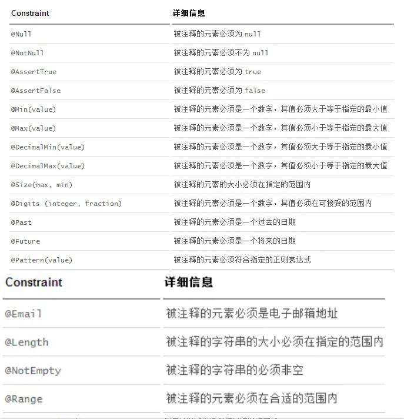

## 原理初探
pom.xml
- spring-boot-dependencies 核心依赖在父工程中
我们在引入一些SpringBoot依赖的时候，不需要指定版本，是因为有这些版本仓库

启动器：就是SpringBoot内置的一些启动场景，可以理解为是多个依赖包的一个封装，引入一个启动器就相当于一次引入了多个依赖包

## 自动配置原理
- SpringBoot在启动的时候从类路径下的META-INF/spring.factories中获取EnableAutoConfiguration指定的值
- 将这些值作为自动配置类导入容器，自动配置类就生效，帮我们进行自动配置工作；
- 整个J2EE的整体解决方案和自动配置都在springboot-autoconfigure的jar包中；
- 它会给容器中导入非常多的自动配置类（xxxAutoConfiguration），就是给容器中导入这个场景需要的所有组件，并配置好这些组件；
- 有了自动配置类，免去了我们手动编写配置注入功能组件等的工作；

### 精髓
1. SpringBoot启动会加载大量的自动配置类
2. 我们看我们需要的功能有没有在SpringBoot默认写好的自动配置类当中；
3. 我们再来看这个自动配置类中到底配置了哪些组件；（只要我们要用的组件存在在其中，我们就不需要再手动配置了）
4. 给容器中自动配置类添加组件的时候，会从properties类中获取某些属性。我们只需要在配置文件中指定这些属性的值即可；

xxxxAutoConfigurartion：自动配置类；给容器中添加组件
xxxxProperties:封装配置文件中相关属性；

### 配置类生效
自动配置类必须在一定的条件下才能生效；依靠@Conditional派生注解来控制，必须是@Conditional指定的条件成立，才给容器中添加组件，配置配里面的所有内容才生效


我们可以通过启用 debug=true属性；来让控制台打印自动配置报告，这样我们就可以很方便的知道哪些自动配置类生效
```properties
#开启springboot的调试类
debug=true
```

## 配置文件语法
- properties文件
```properties
key=value
```
- yml文件
```yml
key: value

# 对象
student01:
  name: 李爽
  age: 20

# 行内写法
student02: {name: 张三,age: 22}

# 数组
list01:
  - dog
  - cat
  - dark

# 行内写法
list02: [dog,pig,cat]
```

## 通过配置文件注入值
- User.java
```java
@Data
@AllArgsConstructor
@NoArgsConstructor
@Component
public class User {
    private String name;
    private int age;
    private Date birthday;
    private String[] likes;
    private Map<String,Object> maps;
    private List<Object> lists;
}
```
- application.yml
```yml
user1:
  name: 李爽
  age: 18
  birthday: 2001/4/3
  likes:
    - 乒乓
    - 唱歌
    - 编程
  maps: {k1: v1,k2: v2}
  lists:
    - list1
    - list2
    - list3
```

## 从指定配置文件拿值
```java
@Data
@AllArgsConstructor
@NoArgsConstructor
@Component
// 加载指定配置文件
@PropertySource(value = "classpath:demo.properties")
public class User {
    // EL表达式取值
    @Value("${name}")
    private String name;
}
```
- demo.properties
```properties
name = 李爽
```

## 松散绑定
yml中写的last-name和lastName是一样的，`-`后面跟着的字母默认是大写的，这就是松散绑定。

## JSR303校验



常用注解
```java
@NotNull(message="名字不能为空")
private String userName;
@Max(value=120,message="年龄最大不能查过120")
private int age;
@Email(message="邮箱格式错误")
private String email;

空检查
@Null       验证对象是否为null
@NotNull    验证对象是否不为null, 无法查检长度为0的字符串
@NotBlank   检查约束字符串是不是Null还有被Trim的长度是否大于0,只对字符串,且会去掉前后空格.
@NotEmpty   检查约束元素是否为NULL或者是EMPTY.
    
Booelan检查
@AssertTrue     验证 Boolean 对象是否为 true  
@AssertFalse    验证 Boolean 对象是否为 false  
    
长度检查
@Size(min=, max=) 验证对象（Array,Collection,Map,String）长度是否在给定的范围之内  
@Length(min=, max=) string is between min and max included.

日期检查
@Past       验证 Date 和 Calendar 对象是否在当前时间之前  
@Future     验证 Date 和 Calendar 对象是否在当前时间之后  
@Pattern    验证 String 对象是否符合正则表达式的规则

.......等等
除此以外，我们还可以自定义一些数据校验规则
```

## 配置文件加载路径
官方定义了4个配置文件可以被加载的路径，自动加载名为application的配置文件
1. file:./config/
2. file:./
3. classpath:/config/
4. classpath:/

加载优先级
```
优先级1：项目路径下的config文件夹配置文件
优先级2：项目路径下配置文件
优先级3：资源路径下的config文件夹配置文件
优先级4：资源路径下配置文件
```

## 多环境切换
编写多套配置文件，用于多个环境
- application-test.properties 代表测试环境配置
- application-dev.properties 代表开发环境配置

在主配置文件里面激活
- application.properties
```properties
spring.profiles.active=dev
```

和properties配置文件中一样，但是使用yml去实现不需要创建多个配置文件，更加方便了!
```yml

server:
  port: 8081
#选择要激活那个环境块
spring:
  profiles:
    active: prod

---
server:
  port: 8083
spring:
  profiles: dev #配置环境的名称


---

server:
  port: 8084
spring:
  profiles: prod  #配置环境的名称
```

注意：如果yml和properties同时都配置了端口，并且没有激活其他环境 ， 默认会使用properties配置文件的！

## 静态资源处理
1. 通过源码分析可知，通过webjar导入的静态资源会自动放行
2. `classpath:/META-INF/resources/`、`classpath:/resources/`、`classpath:/static/`、`classpath:/public/`这四个路径下的静态资源会被放行，优先级：`resources>static>public`
3. 可以通过配置文件手动设置静态资源路径，不过设置过后，默认的几个路径都会失效
```yml
spring.resources.static-locations=classpath:/mystatic/,classpath:/mystatic2/
```

## 扩展使用SpringMVC
官方文档如下
> If you want to keep Spring Boot MVC features and you want to add additional MVC configuration (interceptors, formatters, view controllers, and other features), you can add your own @Configuration class of type WebMvcConfigurer but without @EnableWebMvc. If you wish to provide custom instances of RequestMappingHandlerMapping, RequestMappingHandlerAdapter, or ExceptionHandlerExceptionResolver, you can declare a WebMvcRegistrationsAdapter instance to provide such components.

1. 我们要做的就是编写一个@Configuration配置类，并且类型要为WebMvcConfigurer
2. 不能标注@EnableWebMvc注解：从源码分析可知，此注解会导入一个DelegatingWebMvcConfiguration类，webmvc的自动配置类上有注解限制，只有在DelegatingWebMvcConfiguration类不存在时它才会生效，所以@EnableWebMvc注解会使webmvc的默认配置失效，慎用
3. 我们来创建一个扩展类
```java
//应类型要求为WebMvcConfigurer，所以我们实现其接口
//可以使用自定义类扩展MVC的功能
@Configuration
public class MyMvcConfig implements WebMvcConfigurer {

    @Override
    public void addViewControllers(ViewControllerRegistry registry) {
        // 浏览器发送/test ， 就会跳转到test页面；
        registry.addViewController("/test").setViewName("test");
    }

    
    @Bean //在IOC容器中注册我们自定义的视图解析器
    public ViewResolver myViewResolver(){
        return new MyViewResolver();
    }
}

//我们写一个静态内部类，实现ViewResolver接口，看做是一个自定义的视图解析器
private static class MyViewResolver implements ViewResolver{
    @Override
    public View resolveViewName(String s, Locale locale) throws Exception {
        return null;
    }
}
```
通过这个配置类，我们还可以添加很多东西，对SpringMVC进行扩展，例如拦截器

## 页面国际化
### 配置文件编写
1. 我们在resources资源文件下新建一个i18n目录，存放国际化配置文件
2. 建立一个`login.properties`文件，还有一个`login_zh_CN.properties`发现IDEA自动识别了我们要做国际化操作，文件夹变了
3. 右键点击文件夹，可以再快速地创建新的配置文件，来对应不同的国家语言

- login.properties
```properties
login.btn=登录
login.password=密码
login.remember=记住我
login.tip=请登录
login.username=用户名
```
- login_zh_CN.properties
```properties
login.btn=登录
login.password=密码
login.remember=记住我
login.tip=请登录
login.username=用户名
```
- login_en_US.properties
```properties
login.btn=Sign in
login.password=Password
login.remember=Remember me
login.tip=Please sign in
login.username=Username
```

### 配置springboot
```yml
spring:
  messages:
    basename: i18n.login
```
在webmvc的自动配置文件中有一个区域信息解析器`LocaleResolver`，我们可以自己写一个类，来覆盖它，完成国际化切换的操作
- MyLocaleResolver
```java
//可以在链接上携带区域信息
public class MyLocaleResolver implements LocaleResolver {

    //解析请求
    @Override
    public Locale resolveLocale(HttpServletRequest request) {
        // 获取参数l
        String language = request.getParameter("l");
        // 如果没有获取到就使用系统默认的区域
        Locale locale = Locale.getDefault();
        //如果请求链接不为空
        if (!StringUtils.isEmpty(language)){
            //分割请求参数
            String[] split = language.split("_");
            //国家，地区
            locale = new Locale(split[0],split[1]);
        }
        return locale;
    }

    @Override
    public void setLocale(HttpServletRequest httpServletRequest, HttpServletResponse httpServletResponse, Locale locale) {

    }
}
```
在IOC中注册我们的自定义类
- MyMvcConfig
```java
@Configuration
public class MyMvcConfig implements WebMvcConfigurer {
    @Bean
    public LocaleResolver localeResolver(){
        return new MyLocaleResolver();
    }
}
```

### 修改前端代码
```html
<form class="form-signin" th:action="@{/index}" method="post">
    
    <h1 class="h3 mb-3 font-weight-normal" th:text="#{login.tip}"></h1>
    <label for="username" class="sr-only" th:text="#{login.username}"></label>
    <input type="text" id="username" class="form-control" th:placeholder="#{login.username}" name="username">
    <label for="password" class="sr-only" th:text="#{login.password}"></label>
    <input type="password" id="password" class="form-control" th:placeholder="#{login.password}" name="password">
    <div class="checkbox mb-3">
        <label>
            <input type="checkbox" value="remember-me" th:text="#{login.remember}">
        </label>
    </div>
    <button class="btn btn-lg btn-primary btn-block" type="submit" th:text="#{login.btn}"></button>
    <p class="mt-5 mb-3 text-muted">© 2017-2018</p>

    <!-- 这里传入参数不需要使用 ？使用 （key=value）-->
    <a class="btn btn-sm" th:href="@{/login(l='zh_CN')}">中文</a>
    <a class="btn btn-sm" th:href="@{/login(l='en_US')}">English</a>
</form>
```

## 配置Druid
1. 导入依赖
```xml
<!-- https://mvnrepository.com/artifact/com.alibaba/druid -->
<dependency>
    <groupId>com.alibaba</groupId>
    <artifactId>druid</artifactId>
    <version>1.1.21</version>
</dependency>

<!-- https://mvnrepository.com/artifact/log4j/log4j -->
<dependency>
    <groupId>log4j</groupId>
    <artifactId>log4j</artifactId>
    <version>1.2.17</version>
</dependency>
```
2. 添加springboot配置
```yml
spring:
  datasource:
    username: root
    password: 123456
    url: jdbc:mysql://localhost:3306/springboot?serverTimezone=UTC&useUnicode=true&characterEncoding=utf-8
    driver-class-name: com.mysql.cj.jdbc.Driver
    type: com.alibaba.druid.pool.DruidDataSource # 自定义数据源
    
    #Spring Boot 默认是不注入这些属性值的，需要自己绑定
    #druid 数据源专有配置
    initialSize: 5
    minIdle: 5
    maxActive: 20
    maxWait: 60000
    timeBetweenEvictionRunsMillis: 60000
    minEvictableIdleTimeMillis: 300000
    validationQuery: SELECT 1 FROM DUAL
    testWhileIdle: true
    testOnBorrow: false
    testOnReturn: false
    poolPreparedStatements: true

    #配置监控统计拦截的filters，stat:监控统计、log4j：日志记录、wall：防御sql注入
    #如果允许时报错  java.lang.ClassNotFoundException: org.apache.log4j.Priority
    #则导入 log4j 依赖即可，Maven 地址：https://mvnrepository.com/artifact/log4j/log4j
    filters: stat,wall,log4j
    maxPoolPreparedStatementPerConnectionSize: 20
    useGlobalDataSourceStat: true
    connectionProperties: druid.stat.mergeSql=true;druid.stat.slowSqlMillis=500
```
3. 添加配置类
```java
package com.kuang.config;

import com.alibaba.druid.pool.DruidDataSource;
import org.springframework.boot.context.properties.ConfigurationProperties;
import org.springframework.context.annotation.Bean;
import org.springframework.context.annotation.Configuration;

import javax.sql.DataSource;

@Configuration
public class DruidConfig {

    /*
       将自定义的 Druid数据源添加到容器中，不再让 Spring Boot 自动创建
       绑定全局配置文件中的 druid 数据源属性到 com.alibaba.druid.pool.DruidDataSource从而让它们生效
       @ConfigurationProperties(prefix = "spring.datasource")：作用就是将 全局配置文件中
       前缀为 spring.datasource的属性值注入到 com.alibaba.druid.pool.DruidDataSource 的同名参数中
     */
    @ConfigurationProperties(prefix = "spring.datasource")
    @Bean
    public DataSource druidDataSource() {
        return new DruidDataSource();
    }

}
```

### 配置Druid数据源监控
```java
@Bean
public ServletRegistrationBean statViewServlet() {
    ServletRegistrationBean bean = new ServletRegistrationBean(new StatViewServlet(), "/druid/*");

    // 这些参数可以在 com.alibaba.druid.support.http.StatViewServlet
    // 的父类 com.alibaba.druid.support.http.ResourceServlet 中找到
    Map<String, String> initParams = new HashMap<>();
    initParams.put("loginUsername", "admin"); //后台管理界面的登录账号
    initParams.put("loginPassword", "123456"); //后台管理界面的登录密码

    //后台允许谁可以访问
    //initParams.put("allow", "localhost")：表示只有本机可以访问
    //initParams.put("allow", "")：为空或者为null时，表示允许所有访问
    initParams.put("allow", "");
    //deny：Druid 后台拒绝谁访问
    //initParams.put("kuangshen", "192.168.1.20");表示禁止此ip访问

    //设置初始化参数
    bean.setInitParameters(initParams);
    return bean;
}
```
配置过滤
```java
//配置 Druid 监控 之  web 监控的 filter
//WebStatFilter：用于配置Web和Druid数据源之间的管理关联监控统计
@Bean
public FilterRegistrationBean webStatFilter() {
    FilterRegistrationBean bean = new FilterRegistrationBean();
    bean.setFilter(new WebStatFilter());

    //exclusions：设置哪些请求进行过滤排除掉，从而不进行统计
    Map<String, String> initParams = new HashMap<>();
    initParams.put("exclusions", "*.js,*.css,/druid/*,/jdbc/*");
    bean.setInitParameters(initParams);

    //"/*" 表示过滤所有请求
    bean.setUrlPatterns(Arrays.asList("/*"));
    return bean;
}
```

## 整合Mybati
1. 导入依赖
```xml
<dependency>
    <groupId>org.mybatis.spring.boot</groupId>
    <artifactId>mybatis-spring-boot-starter</artifactId>
    <version>1.3.2</version>
</dependency>
```
2. 添加配置
```yml
# mybatis配置
mybatis:
  mapper-locations: classpath:mapper/*Mapper.xml
  type-aliases-package: cn.com.scitc.studentmanager.pojo
```
3. 实体类
```java
@Data
@NoArgsConstructor
@AllArgsConstructor
@Component
public class Student {
    private Integer id;
    private String name;
    private Integer age;
    private Integer sex;
    private String num;
    private String grade;
    private String clazz;
    private String address;
}
```
4. mapper接口
```java
@Mapper
public interface StudentMapper {
    List<Student> listStudent();
    void addStudent(Student student);
    void deleteStudent(Integer id);
    void updateStudent(Student student);
    List<Student> findByNumContaining(String num);
    List<Student> findByNameContaining(String name);
    Student findById(Integer id);
}
```
5. mapper配置
```xml
<?xml version="1.0" encoding="UTF-8"?>
<!DOCTYPE mapper PUBLIC "-//mybatis.org//DTD Mapper 3.0//EN" "http://mybatis.org/dtd/mybatis-3-mapper.dtd">
<mapper namespace="cn.com.scitc.studentmanager.mapper.StudentMapper">

    <resultMap id="BaseResultMap" type="cn.com.scitc.studentmanager.pojo.Student">
        <result column="id" jdbcType="INTEGER" property="id" />
        <result column="name" jdbcType="VARCHAR" property="name" />
        <result column="age" jdbcType="INTEGER" property="age" />
        <result column="sex" jdbcType="INTEGER" property="sex" />
        <result column="num" jdbcType="VARCHAR" property="num" />
        <result column="grade" jdbcType="VARCHAR" property="grade" />
        <result column="clazz" jdbcType="VARCHAR" property="clazz" />
        <result column="address" jdbcType="VARCHAR" property="address" />
    </resultMap>

    <select id="listStudent" resultMap="BaseResultMap">
        select * from student
    </select>

    <insert id="addStudent">
        insert into student (name,age,sex,num,grade,clazz,address) values(#{name},#{age},#{sex},#{num},#{grade},#{clazz},#{address})
    </insert>

    <delete id="deleteStudent">
        delete from student where id = #{id}
    </delete>

    <update id="updateStudent">
        update student set name=#{name}, age=#{age}, sex=#{sex}, num=#{num}, grade=#{grade}, clazz=#{clazz}, address=#{address} where id=#{id}
    </update>

    <select id="findByNumContaining" resultMap="BaseResultMap">
        select * from student where num = #{num}
    </select>

    <select id="findByNameContaining" resultMap="BaseResultMap">
        select * from student where name = #{name}
    </select>

    <select id="findById" resultMap="BaseResultMap">
        select * from student where id = #{id}
    </select>
</mapper>
```

## SpringSecurity
> Spring Security 框架都有很好的支持。在用户认证方面，Spring Security 框架支持主流的认证方式，包括 HTTP 基本认证、HTTP 表单验证、HTTP 摘要认证、OpenID 和 LDAP 等。在用户授权方面，Spring Security 提供了基于角色的访问控制和访问控制列表（Access Control List，ACL），可以对应用中的领域对象进行细粒度的控制。

Spring Security的两个主要目标是 “认证” 和 “授权”（访问控制）。

### 认证（Authentication）
身份验证是关于验证您的凭据，如用户名/用户ID和密码，以验证您的身份。
身份验证通常通过用户名和密码完成，有时与身份验证因素结合使用。

### 授权（Authorization）
授权发生在系统成功验证您的身份后，最终会授予您访问资源（如信息，文件，数据库，资金，位置，几乎任何内容）的完全权限。
这个概念是通用的，而不是只在Spring Security 中存在。

### 使用
1. 导入依赖
```xml
<dependency>
   <groupId>org.springframework.boot</groupId>
   <artifactId>spring-boot-starter-security</artifactId>
</dependency>
```
2. 添加配置类
```java
@EnableWebSecurity // 开启WebSecurity模式
public class SecurityConfig extends WebSecurityConfigurerAdapter {

    // 定制请求的授权规则
    @Override
    protected void configure(HttpSecurity http) throws Exception {
        // 首页所有人可以访问
        http.authorizeRequests().antMatchers("/").permitAll()
                .antMatchers("/level1/**").hasRole("vip1")
                .antMatchers("/level2/**").hasRole("vip2")
                .antMatchers("/level3/**").hasRole("vip3");

        // 开启自动配置的登录功能
        // /login 请求来到登录页
        // /login?error 重定向到这里表示登录失败
        http.formLogin();

        // 定制登录页面
        // http.formLogin()
        //  .usernameParameter("username")
        //  .passwordParameter("password")
        //  .loginPage("/toLogin")
        //  .loginProcessingUrl("/login"); // 登陆表单提交请求

        //....
        //开启自动配置的注销的功能
        // /logout 注销请求
        http.csrf().disable();//关闭csrf功能:跨站请求伪造,默认只能通过post方式提交logout请求
        http.logout().logoutSuccessUrl("/");

        //记住我
        http.rememberMe();

        //定制记住我的参数！
        //http.rememberMe().rememberMeParameter("remember");
    }

    //定义认证规则
    @Override
    protected void configure(AuthenticationManagerBuilder auth) throws Exception {
        //在内存中定义，也可以在jdbc中去拿....
        auth.inMemoryAuthentication().passwordEncoder(new BCryptPasswordEncoder())
                .withUser("kuangshen").password(new BCryptPasswordEncoder().encode("123456")).roles("vip2","vip3")
                .and()
                .withUser("root").password(new BCryptPasswordEncoder().encode("123456")).roles("vip1","vip2","vip3")
                .and()
                .withUser("guest").password(new BCryptPasswordEncoder().encode("123456")).roles("vip1","vip2");
    }
}
```

## Shiro
### 什么是Shiro
- 官网：http://shiro.apache.org/
- 是一款主流的 Java 安全框架，不依赖任何容器，可以运行在 Java SE 和 Java EE 项目中，它的主要作用是对访问系统的用户进行身份认证、授权、会话管理、加密等操作。
- Shiro就是用来解决安全管理的系统化框架。

### Shiro 核心组件
用户、角色、权限

给用户赋予角色，给角色赋予权限
1. UsernamePasswordToken，Shiro 用来封装用户登录信息，使用用户的登录信息来创建令牌 Token。
2. SecurityManager，Shiro 的核心部分，负责安全认证和授权。
3. Suject，Shiro 的一个抽象概念，包含了用户信息。
4. Realm，开发者自定义的模块，根据项目的需求，验证和授权的逻辑全部写在 Realm 中。
5. AuthenticationInfo，用户的角色信息集合，认证时使用。
6. AuthorzationInfo，角色的权限信息集合，授权时使用。
7. DefaultWebSecurityManager，安全管理器，开发者自定义的 Realm 需要注入到 DefaultWebSecurityManager 进行管理才能生效。
8. ShiroFilterFactoryBean，过滤器工厂，Shiro 的基本运行机制是开发者定制规则，Shiro 去执行，具体的执行操作就是由 ShiroFilterFactoryBean 创建的一个个 Filter 对象来完成。

### Shiro的运行机制


### 使用
1. 导入依赖
```xml
<dependency>
    <groupId>org.apache.shiro</groupId>
    <artifactId>shiro-spring</artifactId>
    <version>1.8.0</version>
</dependency>
```
2. 创建Shiro过滤器，也就是流程中的Realm
```java
public class AccoutRealm extends AuthorizingRealm {

    @Autowired
    private AccountService accountService;

    /**
     * 授权
     * @param principalCollection
     * @return
     */
    @Override
    protected AuthorizationInfo doGetAuthorizationInfo(PrincipalCollection principalCollection) {
        // 获取当前登录用户
        Subject subject = SecurityUtils.getSubject();
        Account account = (Account) subject.getPrincipal();

        // 设置角色集合，用Set集合防止重复
        Set<String> roles = new HashSet<>();
        // 从数据库中拿到角色信息加入到集合中
        roles.add(account.getRole());
        SimpleAuthorizationInfo info = new SimpleAuthorizationInfo(roles);
        
        // 从数据库中拿到权限信息加入到集合中
        info.addStringPermission(account.getParms());
        
        return info;
    }


    /**
     * 认证
     * @param authenticationToken
     * @return
     * @throws AuthenticationException
     */
    @Override
    protected AuthenticationInfo doGetAuthenticationInfo(AuthenticationToken authenticationToken) throws AuthenticationException {
        // 获取控制器传入的token信息
        UsernamePasswordToken token = (UsernamePasswordToken) authenticationToken;
        // 从数据库中查询到用户，取出用户名与token中的用户名进行对比
        Account account = accountService.findByUsername(token.getUsername());
        if(account != null){
            // 如果用户存在，则传入SimpleAuthenticationInfo进行自行的密码验证
            // 参数一：数据库查到的对象
            // 参数二：数据库中查到的密码
            // 参数三：Realm的名字，这里直接使用getName()获取当前类的名字即可
            return new SimpleAuthenticationInfo(account,account.getPassword(),getName());
        }
        return null;
    }
}
```
3. 创建Shiro配置类
```java
@Configuration
public class ShiroConfig {

    @Bean
    public ShiroFilterFactoryBean shiroFilterFactoryBean(@Qualifier("securityManager") DefaultWebSecurityManager securityManager){
        ShiroFilterFactoryBean factoryBean = new ShiroFilterFactoryBean();
        factoryBean.setSecurityManager(securityManager);

        //页面权限设置
        //1、必须登录才能访问 /main
        //2、当前用户必须拥有 manage 权限才能访问 /manage
        //3、当前用户必须拥有 admin 角色才能访问 /administrator
        Map<String,String> map = new HashMap<>();
        map.put("/main","authc");
        map.put("/manager","perms[manager]");
        map.put("/administrator","roles[admin]");
        factoryBean.setFilterChainDefinitionMap(map);

        // 设置登录页
        factoryBean.setLoginUrl("/toLogin");

        // 设置未授权页面
        factoryBean.setUnauthorizedUrl("/unauth");

        return factoryBean;
    }


    @Bean
    public DefaultWebSecurityManager securityManager(@Qualifier("accoutRealm") AccoutRealm accoutRealm){
        DefaultWebSecurityManager manager = new DefaultWebSecurityManager();
        manager.setRealm(accoutRealm);
        return manager;
    }

    @Bean
    public AccoutRealm accoutRealm(){
        return new AccoutRealm();
    }
}
```
认证授权规则:
- 认证过滤
```
anon：无需认证。
authc：必须认证。
authcBasic：需要通过 HTTPBasic 认证。
user：不一定通过认证，只要曾经被 Shiro 记录即可，比如：记住我。
```
- 授权过滤
```
perms：必须拥有某个权限才能访问。
role：必须拥有某个角色才能访问。
port：请求的端口必须是指定值才可以。
rest：请求必须基于 RESTful，POST、PUT、GET、DELETE。
ssl：必须是安全的 URL 请求，协议 HTTPS。
```
4. 编写控制器
```java
@RequestMapping(value = {"/login"})
public String login(String username, String password, Model model) {
    Subject subject = SecurityUtils.getSubject();
    UsernamePasswordToken token = new UsernamePasswordToken(username,password);

    try{
        // 调用shiro，传入token
        subject.login(token);
        return "index";
    }catch (UnknownAccountException e) {
        e.printStackTrace();
        model.addAttribute("msg","用户名错误");
        return "login";
    }catch (IncorrectCredentialsException e) {
        e.printStackTrace();
        model.addAttribute("msg","密码错误");
        return "login";
    }
}
```

### Shiro整合Thymeleaf
1. 引入依赖
```xml
<dependency>
    <groupId>com.github.theborakompanioni</groupId>
    <artifactId>thymeleaf-extras-shiro</artifactId>
    <version>2.0.0</version>
</dependency>
```
2. 在IOC容器注册
```java
@Bean
public ShiroDialect shiroDialect(){
    return new ShiroDialect();
}
```
3. 页面
```html
<!DOCTYPE html>
<html lang="en" xmlns:th="http://www.thymeleaf.org" xmlns:shiro="http://www.thymeleaf.org/thymeleaf-extras-shiro">
<head>
    <meta charset="UTF-8">
    <title>Title</title>
    <link rel="shortcut icon" href="#"/>
</head>
<body>
    <h1>index</h1>
    <div th:if="${session.account != null}">
        <span th:text="${session.account.username}+'欢迎回来！'"></span><a href="/logout">退出</a>
    </div>
    <a href="/main">main</a> <br/>
    <div shiro:hasPermission="manage">
        <a href="manage">manage</a> <br/>
    </div>
    <div shiro:hasRole="administrator">
        <a href="/administrator">administrator</a>
    </div>
</body>
</html>
```

## Swagger
### 简单上手
1. 引入依赖
```xml
<dependency>
    <groupId>io.springfox</groupId>
    <artifactId>springfox-boot-starter</artifactId>
    <version>3.0.0</version>
</dependency>
```
2. 启动程序，访问[http://localhost:8080/swagger-ui/index.html](http://localhost:8080/swagger-ui/index.html)
3. 自定义文档信息
```java
// 自定义swagger3文档信息
@Configuration
@ConditionalOnProperty(value = "springfox.documentation.enabled", havingValue = "true", matchIfMissing = true)
public class Swagger3Config {
    @Bean
    public Docket createRestApi() {
        return new Docket(DocumentationType.OAS_30)
                .apiInfo(apiInfo())
                .select()
                .apis(RequestHandlerSelectors.withMethodAnnotation(ApiOperation.class))
                .paths(PathSelectors.any())
                .build();
    }

    private ApiInfo apiInfo() {
        return new ApiInfoBuilder()
                .title("这是标题")
                .description("这是链接")
                .contact(new Contact("JohnCena", "https://jcxiaozhan.gitee.io", "349636607@qq.com"))
                .version("1.0.0")
                .build();
    }
}
```

### 分组：配置多个Docket即可
```java
@Bean
public Docket docket1(){
   return new Docket(DocumentationType.SWAGGER_2).groupName("group1");
}
@Bean
public Docket docket2(){
   return new Docket(DocumentationType.SWAGGER_2).groupName("group2");
}
@Bean
public Docket docket3(){
   return new Docket(DocumentationType.SWAGGER_2).groupName("group3");
}
```

### 常用注解
```java
// 作用在模块类上
@Api(tags = "xxx模块说明")

// 作用在接口方法上
@ApiOperation("xxx接口说明")

// 作用在模型类上：如VO、BO
@ApiModel("xxxPOJO说明")

// 作用在类方法和属性上，hidden设置为true可以隐藏该属性
@ApiModelProperty(value = "xxx属性说明",hidden = true)

// 作用在参数、方法和字段上，类似@ApiModelProperty
@ApiParam("xxx参数说明")
```

## 任务
### 异步任务
一些功能在执行的时候想不让服务器阻塞，就要用到异步任务，比如邮件发送，下面模拟一个简单的异步任务
1. 在启动类开启异步支持
```java
@SpringBootApplication
@EnableAsync // 开启异步
public class SpringbootStudy2Application {
    public static void main(String[] args) {
        SpringApplication.run(SpringbootStudy2Application.class, args);
    }
}
```
2. 业务类
```java
@Service
public class AsyncService {
    @Async // 标注这是一个异步处理方法，执行过程就不会阻塞
    public void test() {
        try {
            // 线程睡眠3秒，模拟邮件发送过程
            System.out.println("邮件发送中");
            Thread.sleep(3000);
        } catch (InterruptedException e) {
            e.printStackTrace();
        }
    }
}
```
3. 控制类
```java
@RequestMapping("/sync")
@ResponseBody
public String sync() {
    asyncService.test();
    return "发送成功";
}
```
最后们可以看到，用户访问接口，页面立即显示发送成功，后台任务还在执行中，不会引起阻塞

### 邮件任务
1. 导入依赖
```xml
<dependency>
   <groupId>org.springframework.boot</groupId>
   <artifactId>spring-boot-starter-mail</artifactId>
</dependency>
```
2. 添加配置
```yml
spring:
  mail:
    username: 349636607@qq.com
    password: idfehdptoqvibicd
    host: smtp.qq.com
```
3. 编写测试类
```java
@Autowired
JavaMailSenderImpl mailSender;

@Test
public void contextLoads() {
    //邮件设置1：一个简单的邮件
    SimpleMailMessage message = new SimpleMailMessage();
    message.setSubject("通知-明天来狂神这听课");
    message.setText("今晚7:30开会");

    message.setTo("2036786419@qq.com");
    message.setFrom("349636607@qq.com");
    mailSender.send(message);
}

@Test
public void contextLoads2() throws MessagingException {
    //邮件设置2：一个复杂的邮件
    MimeMessage mimeMessage = mailSender.createMimeMessage();
    MimeMessageHelper helper = new MimeMessageHelper(mimeMessage, true);

    helper.setSubject("通知-明天来狂神这听课");
    helper.setText("<b style='color:red'>今天 7:30来开会</b>",true);

    //发送附件
    helper.addAttachment("1.jpg",new File(""));
    helper.addAttachment("2.jpg",new File(""));

    helper.setTo("24736743@qq.com");
    helper.setFrom("24736743@qq.com");

    mailSender.send(mimeMessage);
}
```

### 定时任务
1. 在启动类上开启定时任务的支持
```java
@EnableScheduling //开启定时任务支持
@SpringBootApplication
public class SpringbootTaskApplication {
   public static void main(String[] args) {
       SpringApplication.run(SpringbootTaskApplication.class, args);
  }
}
```
2. 注解填写cron表达式，达到定时执行函数的效果
```java
@Service
public class ScheduledService {
   
   //秒   分   时     日   月   周几
   //0 * * * * MON-FRI
   //注意cron表达式的用法；
   @Scheduled(cron = "0 * * * * 0-7")
   public void hello(){
       System.out.println("hello.....");
  }
}
```
cron表达式详解：[http://www.bejson.com/othertools/cron/](http://www.bejson.com/othertools/cron/)