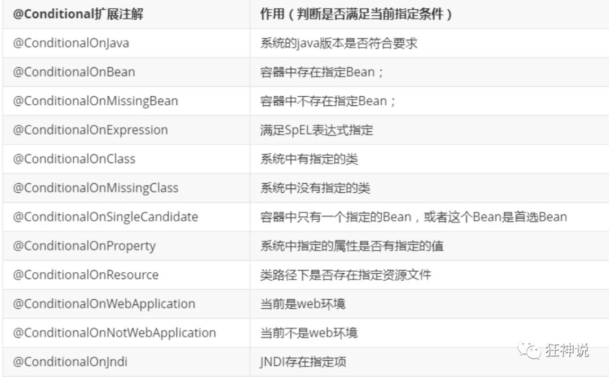

## SpringBoot简介

### 回顾Spring

Spring是一个开源框架，2003 年兴起的一个轻量级的Java开发框架，作者：Rod Johnson

**Spring是为了解决企业级应用开发的复杂性而创建的，简化开发。**

### Spring是如何简化Java开发的

为了降低Java开发的复杂性，Spring采用了以下4种关键策略：

1、基于POJO的轻量级和最小侵入性编程，所有东西都是bean；

2、通过IOC，依赖注入（DI）和面向接口实现松耦合；

3、基于切面（AOP）和惯例进行声明式编程；

4、通过切面和模版减少样式代码，RedisTemplate，xxxTemplate...

### 什么是SpringBoot

> Spring Boot是由Pivotal团队提供的全新[框架](https://baike.baidu.com/item/框架/1212667?fromModule=lemma_inlink)，其设计目的是用来[简化](https://baike.baidu.com/item/简化/3374416?fromModule=lemma_inlink)新[Spring](https://baike.baidu.com/item/Spring/85061?fromModule=lemma_inlink)应用的初始搭建以及开发过程。该框架使用了特定的方式来进行配置，从而使开发人员不再需要定义样板化的配置。通过这种方式，Spring Boot致力于在蓬勃发展的快速应用开发领域(rapid application development)成为领导者。

## Spring Boot的主要优点

- 为所有Spring开发者更快的入门
- **开箱即用**，提供各种默认配置来简化项目配置
- 内嵌式容器简化Web项目
- 没有冗余代码生成和XML配置的要求

## Pom文件分析

```xml
<?xml version="1.0" encoding="UTF-8"?>
<project xmlns="http://maven.apache.org/POM/4.0.0" xmlns:xsi="http://www.w3.org/2001/XMLSchema-instance"
         xsi:schemaLocation="http://maven.apache.org/POM/4.0.0 https://maven.apache.org/xsd/maven-4.0.0.xsd">
  <modelVersion>4.0.0</modelVersion>
  <!-- SpringBoot默认父依赖 -->
  <parent>
    <groupId>org.springframework.boot</groupId>
    <artifactId>spring-boot-starter-parent</artifactId>
    <version>2.7.3</version>
    <relativePath/> <!-- lookup parent from repository -->
  </parent>
  <!-- 项目信息 -->
  <groupId>com</groupId>
  <artifactId>SpringBootStudy</artifactId>
  <version>0.0.1-SNAPSHOT</version>
  <name>SpringBootStudy</name>
  <description>SpringBootStudy</description>
  <properties>
    <java.version>1.8</java.version>
  </properties>

  <dependencies>
    <!-- web场景启动器 -->
    <dependency>
      <groupId>org.springframework.boot</groupId>
      <artifactId>spring-boot-starter-web</artifactId>
    </dependency>
    <!-- springboot单元测试 -->
    <dependency>
      <groupId>org.springframework.boot</groupId>
      <artifactId>spring-boot-starter-test</artifactId>
      <scope>test</scope>
    </dependency>
  </dependencies>

  <build>
    <plugins>
      <!-- 打包插件 -->
      <plugin>
        <groupId>org.springframework.boot</groupId>
        <artifactId>spring-boot-maven-plugin</artifactId>
      </plugin>
    </plugins>
  </build>

</project>
```

### 依赖管理

SpirngBoot的依赖由父工程的父工程统一管理，所以我们在使用启动器的时候，不用手动指定版本号

`spring-boot-starter-parent` => `spring-boot-dependencies`

```xml
<parent>
    <groupId>org.springframework.boot</groupId>
    <artifactId>spring-boot-dependencies</artifactId>
    <version>2.7.3</version>
</parent>
```

### 启动器

**springboot-boot-starter-xxx**：就是spring-boot的场景启动器

**spring-boot-starter-web**：帮我们导入了web模块正常运行所依赖的组件

SpringBoot将所有的功能场景都抽取出来，做成一个个的starter （启动器），只需要在项目中引入这些starter即可，所有相关的依赖都会导入进来，我们要用什么功能就导入什么样的场景启动器即可，我们未来也可以自己自定义starter。

```xml
<dependency>
    <groupId>org.springframework.boot</groupId>
    <artifactId>spring-boot-starter-web</artifactId>
</dependency>
```

## 热部署

导入如下依赖，修改代码之后只要重新编译即可看到效果，不用重新部署

```xml
<!-- springBoot devtools的热部署 修改代码之后需要重新编译一下即可 -->
<dependency>
    <groupId>org.springframework.boot</groupId>
    <artifactId>spring-boot-devtools</artifactId>
    <optional>true</optional>
</dependency>
```

## 自动装配原理

### @SpringBootApplication

> 作用：标注在某个类上说明这个类是SpringBoot的主启动类 ，SpringBoot就应该运行这个类的main方法来启动SpringBoot应用；

进入这个注解：可以看到上面还有很多其他注解！

```java
@SpringBootConfiguration
@EnableAutoConfiguration
@ComponentScan(
    excludeFilters = {@Filter(
    type = FilterType.CUSTOM,
    classes = {TypeExcludeFilter.class}
), @Filter(
    type = FilterType.CUSTOM,
    classes = {AutoConfigurationExcludeFilter.class}
)}
)
public @interface SpringBootApplication {
    // ......
}
```

#### 1. @ComponentScan

> 作用：自动扫描并加载符合条件的组件或者bean，将这个bean定义加载到IOC容器中

#### 2. @SpringBootConfiguration

> 作用：SpringBoot的配置类 ，标注在某个类上 ， 表示这是一个SpringBoot的配置类；

进入这个注解查看

```java
// 点进去得到下面的 @Component
@Configuration
public @interface SpringBootConfiguration {}

@Component
public @interface Configuration {}
```

这里的`@Configuration`，说明这是一个配置类 ，配置类就是对应Spring的xml 配置文件；

里面的`@Component`这就说明，启动类本身也是Spring中的一个组件而已，负责启动应用！

#### 3. @EnableAutoConfiguration

以前我们需要自己配置的东西，而现在SpringBoot可以自动帮我们配置 ；@EnableAutoConfiguration告诉SpringBoot开启自动配置功能，这样自动配置才能生效；

进入这个注解查看

```java
@AutoConfigurationPackage
@Import(AutoConfigurationImportSelector.class)
public @interface EnableAutoConfiguration {
// ......
}
```

##### 3.1 @AutoConfigurationPackage

> 作用：自动配置包

进入这个注解查看

```java
@Import(AutoConfigurationPackages.Registrar.class)
public @interface AutoConfigurationPackage {
// ......
}
```

`@Import`：Spring底层注解@import ， 给容器中导入一个组件

`Registrar.class`：将主启动类的所在包及包下面所有子包里面的所有组件扫描到Spring容器 ；

##### 3.2 @Import(AutoConfigurationImportSelector.class)

> 作用：给容器导入组件

AutoConfigurationImportSelector ：自动配置导入选择器，那么它会导入哪些组件的选择器呢？我们点击去这个类看源码

==分析源码可知：SpringBoot在启动的时候从`org.springframework.boot:spring-boot-autoconfigure/META-INF/spring.factories`中获取EnableAutoConfiguration指定的值==

```java
// 获得候选的配置
protected List<String> getCandidateConfigurations(AnnotationMetadata metadata, AnnotationAttributes attributes) {
    //这里的getSpringFactoriesLoaderFactoryClass()方法
    //返回的就是我们最开始看的启动自动导入配置文件的注解类；EnableAutoConfiguration
    List<String> configurations = SpringFactoriesLoader.loadFactoryNames(this.getSpringFactoriesLoaderFactoryClass(), this.getBeanClassLoader());
    Assert.notEmpty(configurations, "No auto configuration classes found in META-INF/spring.factories. If you are using a custom packaging, make sure that file is correct.");
    return configurations;
}

//上面调用了SpringFactoriesLoader类的静态方法loadFactoryNames()
public static List<String> loadFactoryNames(Class<?> factoryClass, @Nullable ClassLoader classLoader) {
    String factoryClassName = factoryClass.getName();
    //这里它又调用了loadSpringFactories方法
    return (List)loadSpringFactories(classLoader).getOrDefault(factoryClassName, Collections.emptyList());
}
```

```java
//loadSpringFactories()方法
private static Map<String, List<String>> loadSpringFactories(@Nullable ClassLoader classLoader) {
    //获得classLoader ， 我们返回可以看到这里得到的就是EnableAutoConfiguration标注的类本身
    MultiValueMap<String, String> result = (MultiValueMap)cache.get(classLoader);
    if (result != null) {
        return result;
    } else {
        try {
            //去获取一个资源 "META-INF/spring.factories"
            Enumeration<URL> urls = classLoader != null ? classLoader.getResources("META-INF/spring.factories") : ClassLoader.getSystemResources("META-INF/spring.factories");
            LinkedMultiValueMap result = new LinkedMultiValueMap();

            //将读取到的资源遍历，封装成为一个Properties
            while(urls.hasMoreElements()) {
                URL url = (URL)urls.nextElement();
                UrlResource resource = new UrlResource(url);
                Properties properties = PropertiesLoaderUtils.loadProperties(resource);
                Iterator var6 = properties.entrySet().iterator();

                while(var6.hasNext()) {
                    Entry<?, ?> entry = (Entry)var6.next();
                    String factoryClassName = ((String)entry.getKey()).trim();
                    String[] var9 = StringUtils.commaDelimitedListToStringArray((String)entry.getValue());
                    int var10 = var9.length;

                    for(int var11 = 0; var11 < var10; ++var11) {
                        String factoryName = var9[var11];
                        result.add(factoryClassName, factoryName.trim());
                    }
                }
            }

            cache.put(classLoader, result);
            return result;
        } catch (IOException var13) {
            throw new IllegalArgumentException("Unable to load factories from location [META-INF/spring.factories]", var13);
        }
    }
}
```

### 总结

1. SpringBoot在启动的时候从`org.springframework.boot:spring-boot-autoconfigure/META-INF/spring.factories`中获取EnableAutoConfiguration指定的值
2. 将这些值作为自动配置类导入容器 ，自动配置类就生效，帮我们进行自动配置工作
3. 整个J2EE的整体解决方案和自动配置都在springboot-autoconfigure的jar包中
4. 它会给容器中导入非常多的自动配置类（xxxAutoConfiguration），就是给容器中导入这个场景需要的所有组件，并配置好这些组件
5. 有了自动配置类，免去了我们手动编写配置注入功能组件等的工作

### 配置文件配置规律(旧版本)

我们已经知道SpringBoot在启动的时候会读取`spring.factories`文件来决定哪些类需要进行装配

我们以文件中的**HttpEncodingAutoConfiguration（Http编码自动配置）**为例解释自动配置原理；

```java
//表示这是一个配置类，和以前编写的配置文件一样，也可以给容器中添加组件；
@Configuration 

//启动指定类的ConfigurationProperties功能；
	//进入这个HttpProperties查看，将配置文件中对应的值和HttpProperties绑定起来；
	//并把HttpProperties加入到ioc容器中
	//我们所写的配置其实就是在修改HttpProperties类的属性
@EnableConfigurationProperties({HttpProperties.class}) 

//Spring底层@Conditional注解
  //根据不同的条件判断，如果满足指定的条件，整个配置类里面的配置就会生效；
  //这里的意思就是判断当前应用是否是web应用，如果是，当前配置类生效
@ConditionalOnWebApplication(
    type = Type.SERVLET
)

//判断当前项目有没有这个类CharacterEncodingFilter；SpringMVC中进行乱码解决的过滤器；
@ConditionalOnClass({CharacterEncodingFilter.class})

//判断配置文件中是否存在某个配置：spring.http.encoding.enabled；
  //如果不存在，判断也是成立的
  //即使我们配置文件中不配置pring.http.encoding.enabled=true，也是默认生效的；
@ConditionalOnProperty(
    prefix = "spring.http.encoding",
    value = {"enabled"},
    matchIfMissing = true
)

public class HttpEncodingAutoConfiguration {
    //他已经和SpringBoot的配置文件映射了
    private final Encoding properties;
    //只有一个有参构造器的情况下，参数的值就会从容器中拿
    public HttpEncodingAutoConfiguration(HttpProperties properties) {
        this.properties = properties.getEncoding();
    }
    
    //给容器中添加一个组件，这个组件的某些值需要从properties中获取
    @Bean
    @ConditionalOnMissingBean //判断容器没有这个组件？
    public CharacterEncodingFilter characterEncodingFilter() {
        CharacterEncodingFilter filter = new OrderedCharacterEncodingFilter();
        filter.setEncoding(this.properties.getCharset().name());
        filter.setForceRequestEncoding(this.properties.shouldForce(org.springframework.boot.autoconfigure.http.HttpProperties.Encoding.Type.REQUEST));
        filter.setForceResponseEncoding(this.properties.shouldForce(org.springframework.boot.autoconfigure.http.HttpProperties.Encoding.Type.RESPONSE));
        return filter;
    }
    //。。。。。。。
}
```

- 一但这个配置类生效；这个配置类就会给容器中添加各种组件；
- 这些组件的属性是从对应的properties类中获取的，这些类里面的每一个属性又是和配置文件绑定的；
- 所有在配置文件中能配置的属性都是在xxxxProperties类中封装着；
- 配置文件能配置什么就可以参照某个功能对应的这个属性类

```java
//从配置文件中获取指定的值和bean的属性进行绑定
@ConfigurationProperties(prefix = "spring.http") 
public class HttpProperties {
    // .....
}
```

1、SpringBoot启动会加载大量的自动配置类

2、我们看我们需要的功能有没有在SpringBoot默认写好的自动配置类当中；

3、我们再来看这个自动配置类中到底配置了哪些组件；（只要我们要用的组件存在在其中，我们就不需要再手动配置了）

4、给容器中自动配置类添加组件的时候，会从properties类中获取某些属性。我们只需要在配置文件中指定这些属性的值即可；

**xxxxAutoConfigurartion：自动配置类；**给容器中添加组件

**xxxxProperties:封装配置文件中相关属性；**

### 配置文件配置规律(springboot2.7+)

在springboot2.7之后，自动装配类的加载方式有了一些变化，官方不再推荐使用`spring.factories`来自动装配（springboot3将弃用spring.factories），但是也向下兼容，所以一些通过老板方式自定义的starter依旧生效

新版springboot将之前的自动装配类全部写到了`org.springframework.boot:spring-boot-autoconfigure/META-INF/spring/org.springframework.boot.autoconfigure.AutoConfiguration.imports`这个文件中

### 新老版本比对

|          原配置           |                            新配置                            |
| :-----------------------: | :----------------------------------------------------------: |
| META-INF/spring.factories | META-INF/spring/org.springframework.boot.autoconfigure.AutoConfiguration.imports |
|      @Configuration       |                      @AutoConfiguration                      |

新注解@AutoConfiguration是被用在META-INF/spring/org.springframework.boot.autoconfigure.AutoConfiguration.imports中的自动化配置类上用来替换@Configuration、@AutoConfigurationAfter、@AutoConfigurationBefore注解，其中@Configuration对应的proxyBeanMethods属性值一直为false。

### @Conditional注解

了解完自动装配的原理后，我们来关注一个细节问题，**自动配置类必须在一定的条件下才能生效；**



我们可以开启springboot调试类，在控制台查看哪些类被自动装配了

```yaml
# 开启springboot的调试类
debug: true
```

- Positive matches:（自动配置类启用的：正匹配）

- Negative matches:（没有启动，没有匹配成功的自动配置类：负匹配）

- Unconditional classes: （没有条件的类）

## 配置文件

### 基本语法

1. properties文件

```properties
key=value
```

2. yaml文件

> YAML是 "YAML Ain't a Markup Language" （YAML不是一种标记语言）的递归缩写。在开发的这种语言时，YAML 的意思其实是："Yet Another Markup Language"（仍是一种标记语言）

==这种语言以数据作为中心，而不是以标记语言为重点==

```yaml
key: value

# 对象
student01:
  name: 李爽
  age: 20

# 行内写法
student02: {name: 张三,age: 22}

# 数组
list01:
  - dog
  - cat
  - dark

# 行内写法
list02: [dog,pig,cat]
```

==注：==

- “ ” 双引号，不会转义字符串里面的特殊字符 ， 特殊字符会作为本身想表示的意思；

  比如 ：name: "kuang \n shen"  输出 ：kuang  换行  shen

- ' ' 单引号，会转义特殊字符 ， 特殊字符最终会变成和普通字符一样输出

  比如 ：name: ‘kuang \n shen’  输出 ：kuang  \n  shen

### 属性值注入

`Person.java`

```java
@Component //注册bean到容器中
public class Person {
    private String name;
    private Integer age;
    private Boolean happy;
    private Date birth;
    private Map<String,Object> maps;
    private List<Object> lists;
    
    //有参无参构造、get、set方法、toString()方法  
}
```

`application.yml`

```yaml
person:
  name: qinjiang
  age: 3
  happy: false
  birth: 2000/01/01
  maps: {k1: v1,k2: v2}
  lists:
   - code
   - girl
   - music
```

`Person.java`

```java
/*
@ConfigurationProperties作用：
将配置文件中配置的每一个属性的值，映射到这个组件中；
告诉SpringBoot将本类中的所有属性和配置文件中相关的配置进行绑定
参数 prefix = “person” : 将配置文件中的person下面的所有属性一一对应
*/
@Component //注册bean
@ConfigurationProperties(prefix = "person")
public class Person {
    private String name;
    private Integer age;
    private Boolean happy;
    private Date birth;
    private Map<String,Object> maps;
    private List<Object> lists;
    private Dog dog;
}
```

通过yaml进行属性值注入，会有警告，但不会影响运行，我们可以导入下面依赖来消除警告

```xml
<!-- 导入配置文件处理器，配置文件进行绑定就会有提示，需要重启 -->
<dependency>
  <groupId>org.springframework.boot</groupId>
  <artifactId>spring-boot-configuration-processor</artifactId>
  <optional>true</optional>
</dependency>
```

使用properties配置文件来进行属性值注入

### 配置文件的加载

**@PropertySource ：**加载指定的配置文件；

**@configurationProperties**：默认从全局配置文件中获取值；

测试**@configurationProperties**+**properties配置文件**的方式注入属性值

`application.properties`

```properties
name=李爽
age=21
```

`Person.java`

```java
@Data
@NoArgsConstructor
@AllArgsConstructor
@PropertySource("classpath:application.properties")
@Component
public class Person {
    @Value("${name}")
    private String name;
    @Value("${age}")
    private int age;
}
```

### yaml与properties的区别

|              |       yaml       |      properties       |
| :----------: | :--------------: | :-------------------: |
|     功能     | 批量注入配置属性 | 使用Value单个指定属性 |
|   松散绑定   |       支持       |        不支持         |
|     SpEL     |      不支持      |         支持          |
|    JSR303    |       支持       |        不支持         |
| 复杂类型封装 |       支持       |        不支持         |

松散绑定：驼峰与中划线两者之间的自动映射，例如firstName与first-name

SpEL：springboot提供的一些可以直接用与EL表达式的值，例如${random.uuid}

## JSR303校验


### 简单使用

1. 导入依赖

```xml
<dependency>
    <groupId>org.springframework.boot</groupId>
    <artifactId>spring-boot-starter-validation</artifactId>
</dependency>
```

2. `Person.java`

```java
@Validated	//开启数据校验
public class Person {
    private String name;

    //验证是否符合邮箱格式
    @Email
    private int age;
}
```

### 常用注解

```java
@NotNull(message="名字不能为空")
private String userName;
@Max(value=120,message="年龄最大不能查过120")
private int age;
@Email(message="邮箱格式错误")
private String email;

空检查
@Null       验证对象是否为null
@NotNull    验证对象是否不为null, 无法查检长度为0的字符串
@NotBlank   检查约束字符串是不是Null还有被Trim的长度是否大于0,只对字符串,且会去掉前后空格.
@NotEmpty   检查约束元素是否为NULL或者是EMPTY.
    
Booelan检查
@AssertTrue     验证 Boolean 对象是否为 true  
@AssertFalse    验证 Boolean 对象是否为 false  
    
长度检查
@Size(min=, max=) 验证对象（Array,Collection,Map,String）长度是否在给定的范围之内  
@Length(min=, max=) string is between min and max included.

日期检查
@Past       验证 Date 和 Calendar 对象是否在当前时间之前  
@Future     验证 Date 和 Calendar 对象是否在当前时间之后  
@Pattern    验证 String 对象是否符合正则表达式的规则

.......等等
除此以外，我们还可以自定义一些数据校验规则
```

## SpringBoot多环境配置切换

### 配置文件加载路径及优先级

官方定义了4个配置文件可以被加载的路径，自动加载名为application的配置文件

1. file:./config/
2. file:./
3. classpath:/config/
4. classpath:/

加载优先级

```
优先级1：项目路径下的config文件夹内的配置文件
优先级2：项目路径下的配置文件
优先级3：资源路径下的config文件夹内的配置文件
优先级4：资源路径下的配置文件
```

### 多环境配置

我们在主配置文件编写的时候，文件名可以是 application-{profile}.properties/yml , 用来指定多个环境版本；

例如：

- application-test.properties 代表测试环境配置

- application-dev.properties 代表开发环境配置

在主配置文件中激活配置

`application.properties`

```properties
#比如在配置文件中指定使用dev环境，我们可以通过设置不同的端口号进行测试；
#我们启动SpringBoot，就可以看到已经切换到dev下的配置了；
spring.profiles.active=dev
```

> yaml的多文档块

和properties配置文件中一样，但是使用yml去实现不需要创建多个配置文件，更加方便了 !

```yaml
server:
  port: 8081
#选择要激活那个环境块
spring:
  profiles:
    active: test

---
server:
  port: 8083
spring:
  profiles: dev #配置环境的名称


---
server:
  port: 8084
spring:
  profiles: test  #配置环境的名称
```

==注：如果yml和properties同时都配置了端口，并且没有激活其他环境 ， 默认会使用properties配置文件的！==

## SpringBoot Web

### 静态资源处理

在普通的JavaWeb项目中，我们在main/webapp这个路径下放我们的静态资源。

### webjars

Webjars本质就是以jar包的方式引入我们的静态资源 ， 我们以前要导入一个静态资源文件，直接导入即可。

使用SpringBoot需要使用Webjars，我们可以去搜索一下：

网站：https://www.webjars.org 

要使用jQuery，我们只要要引入jQuery对应版本的pom依赖即可！

我们可以在`/webjars/**`这个路径下引用我们导入的webjar资源

```xml
<dependency>
    <groupId>org.webjars</groupId>
    <artifactId>jquery</artifactId>
    <version>3.4.1</version>
</dependency>
```

### SpringBoot默认静态资源加载路径

1. `classpath:/META-INF/resources/`
2. `classpath:/resources/`
3. `classpath:/static/`
4. `classpath:/public/`

上面是SpringBoot的四个默认静态资源加载路径，通过测试我们可以得出，他们的优先级情况是`1 > 2 > 3 > 4`

可以通过配置文件手动设置静态资源路径，不过设置过后，几个默认路径都会失效

## Thymeleaf模板引擎

html文件根标签属性引入Thymeleaf
```html
<html lang="en" xmlns:th="http://www.thymeleaf.org">
```
语法
```html
<h1 th:text="'姓名：'+${name}"></h1>
<h1 th:text="|姓名：${name}|"></h1>
<h1 th:utext="'姓名：'+${name}"></h1>
<h1 th:each="user:${users}" th:text="${user}"></h1>
```
fragment标签与insert、replace、include属性
```html
<!-- 用fragment标签定义 -->
<footer th:fragment="copy">
  &copy; 2011 The Good Thymes Virtual Grocery
</footer>

<!-- 用insert属性在元素下引用定义好的片段 -->
<!-- 效果如下 
<div>
    <footer>
        &copy; 2011 The Good Thymes Virtual Grocery
    </footer>
</div> 
-->
<div th:insert="footer :: copy"></div>

<!-- 用replace属性在元素下引用定义好的片段 -->
<!-- 效果如下 
<footer>
    &copy; 2011 The Good Thymes Virtual Grocery
</footer>
-->
<div th:replace="footer :: copy"></div>

<!-- 用include属性在元素下引用定义好的片段 -->
<!-- 效果如下 
<div>
    &copy; 2011 The Good Thymes Virtual Grocery
</div>
-->
<div th:include="footer :: copy"></div>

<!-- 注：当定义标签与使用标签不存在于同一个目录中时，引用时要带上路径 -->
<div th:insert="main/footer :: copy"></div>
```

## SpringMVC自动装配

> 文档地址：https://docs.spring.io/spring-boot/docs/2.2.5.RELEASE/reference/htmlsingle/#boot-features-spring-mvc-auto-configuration

```java
Spring MVC Auto-configuration
// Spring Boot为Spring MVC提供了自动配置，它可以很好地与大多数应用程序一起工作。
Spring Boot provides auto-configuration for Spring MVC that works well with most applications.
// 自动配置在Spring默认设置的基础上添加了以下功能：
The auto-configuration adds the following features on top of Spring’s defaults:
// 包含视图解析器
Inclusion of ContentNegotiatingViewResolver and BeanNameViewResolver beans.
// 支持静态资源文件夹的路径，以及webjars
Support for serving static resources, including support for WebJars 
// 自动注册了Converter：
// 转换器，这就是我们网页提交数据到后台自动封装成为对象的东西，比如把"1"字符串自动转换为int类型
// Formatter：【格式化器，比如页面给我们了一个2019-8-10，它会给我们自动格式化为Date对象】
Automatic registration of Converter, GenericConverter, and Formatter beans.
// HttpMessageConverters
// SpringMVC用来转换Http请求和响应的的，比如我们要把一个User对象转换为JSON字符串，可以去看官网文档解释；
Support for HttpMessageConverters (covered later in this document).
// 定义错误代码生成规则的
Automatic registration of MessageCodesResolver (covered later in this document).
// 首页定制
Static index.html support.
// 图标定制
Custom Favicon support (covered later in this document).
// 初始化数据绑定器：帮我们把请求数据绑定到JavaBean中！
Automatic use of a ConfigurableWebBindingInitializer bean (covered later in this document).

/*
如果您希望保留Spring Boot MVC功能，并且希望添加其他MVC配置（拦截器、格式化程序、视图控制器和其他功能），则可以添加自己
的@configuration类，类型为webmvcconfiguer，但不添加@EnableWebMvc。如果希望提供
RequestMappingHandlerMapping、RequestMappingHandlerAdapter或ExceptionHandlerExceptionResolver的自定义
实例，则可以声明WebMVCregistrationAdapter实例来提供此类组件。
*/
If you want to keep Spring Boot MVC features and you want to add additional MVC configuration 
(interceptors, formatters, view controllers, and other features), you can add your own 
@Configuration class of type WebMvcConfigurer but without @EnableWebMvc. If you wish to provide 
custom instances of RequestMappingHandlerMapping, RequestMappingHandlerAdapter, or 
ExceptionHandlerExceptionResolver, you can declare a WebMvcRegistrationsAdapter instance to provide such components.

// 如果您想完全控制Spring MVC，可以添加自己的@Configuration，并用@EnableWebMvc进行注释。
If you want to take complete control of Spring MVC, you can add your own @Configuration annotated with @EnableWebMvc.
```

## SpringMVC扩展

探究源码，我们可以得到如下结论：

==ContentNegotiatingViewResolver这个视图解析器就是用来组合所有的视图解析器的，它在IOC容器中查找视图解析器，找到最优解进行赋值使用==

我们尝试向IOC容器中注册一个自定义的视图解析器

```java
@Configuration
public class MyWebMvcConfigurer implements WebMvcConfigurer {
    @Bean //放到bean中
    public ViewResolver myViewResolver(){
        return new MyViewResolver();
    }

    //我们写一个静态内部类，视图解析器就需要实现ViewResolver接口
    private static class MyViewResolver implements ViewResolver{
        @Override
        public View resolveViewName(String s, Locale locale) throws Exception {
            return null;
        }
    }
}
```

之后我们对`DispatcherServlet`类的`doDispatch()`方法进行DeBug发现，我们自定义的视图解析器，也进入了它的视图遍历列表，参与了循环

==结论：所以说，我们如果想要使用自己定制化的东西，我们只需要给容器中添加这个组件就好了！剩下的事情SpringBoot就会帮我们做了！==

## 国际化

1. 在resources资源文件下新建一个i18n文件，存放国际化配置文件
2. 在i18n文件夹内创建多个配置文件，对应多个语言

`login.properties` 默认

```properties
login.btn=登录
login.password=密码
login.remember=记住我
login.tip=请登录
login.username=用户名
```

`login_zh_CN.properties` 中国

```properties
login.btn=登录
login.password=密码
login.remember=记住我
login.tip=请登录
login.username=用户名
```

`login_en_US.properties` 美国

```properties
login.btn=Sign in
login.password=Password
login.remember=Remember me
login.tip=Please sign in
login.username=Username
```

3. 在配置文件中配置语言包位置

```yml
spring:
  messages:
    basename: i18n.login
```

4. 在webmvc的自动配置文件中有一个区域信息解析器`LocaleResolver`，我们可以自己写一个类，来覆盖它，完成国际化切换的操作

`MyLocaleResolver.java`

```java
//可以在链接上携带区域信息
public class MyLocaleResolver implements LocaleResolver {

    //解析请求
    @Override
    public Locale resolveLocale(HttpServletRequest request) {
        // 获取参数l
        String language = request.getParameter("l");
        // 如果没有获取到就使用系统默认的区域
        Locale locale = Locale.getDefault();
        //如果请求链接不为空
        if (!StringUtils.isEmpty(language)){
            //分割请求参数
            String[] split = language.split("_");
            //国家，地区
            locale = new Locale(split[0],split[1]);
        }
        return locale;
    }

    @Override
    public void setLocale(HttpServletRequest httpServletRequest, HttpServletResponse httpServletResponse, Locale locale) {

    }
}
```

5. 在IOC容器中注册我们的自定义解析器

`MyMvcConfig.java`

```java
@Configuration
public class MyMvcConfig implements WebMvcConfigurer {
    @Bean
    public LocaleResolver localeResolver(){
        return new MyLocaleResolver();
    }
}
```

6. 前端进行国际化配置

```html
<form class="form-signin" th:action="@{/index}" method="post">
    
    <!-- 国际化参数用 # 取值 -->
    <h1 class="h3 mb-3 font-weight-normal" th:text="#{login.tip}"></h1>
    <label for="username" class="sr-only" th:text="#{login.username}"></label>
    <input type="text" id="username" class="form-control" th:placeholder="#{login.username}" name="username">
    <label for="password" class="sr-only" th:text="#{login.password}"></label>
    <input type="password" id="password" class="form-control" th:placeholder="#{login.password}" name="password">
    <div class="checkbox mb-3">
        <label>
            <input type="checkbox" value="remember-me" th:text="#{login.remember}">
        </label>
    </div>
    <button class="btn btn-lg btn-primary btn-block" type="submit" th:text="#{login.btn}"></button>
    <p class="mt-5 mb-3 text-muted">© 2017-2018</p>

    <!-- thymeleaf特有传参方式（key=value）-->
    <!-- 通过l参数来控制页面国际化-->
    <a class="btn btn-sm" th:href="@{/login(l='zh_CN')}">中文</a>
    <a class="btn btn-sm" th:href="@{/login(l='en_US')}">English</a>
</form>
```

## 自定义错误页面

可以在springboot的静态资源路径、或者模板引擎目录`templates`下创建`error`目录用来存放自定义的错误页面，页面以错误码命名，例如404.html、5xx.html等，一个页面代表一个错误或一类错误，springboot会识别，并在系统错误发生时进行跳转
