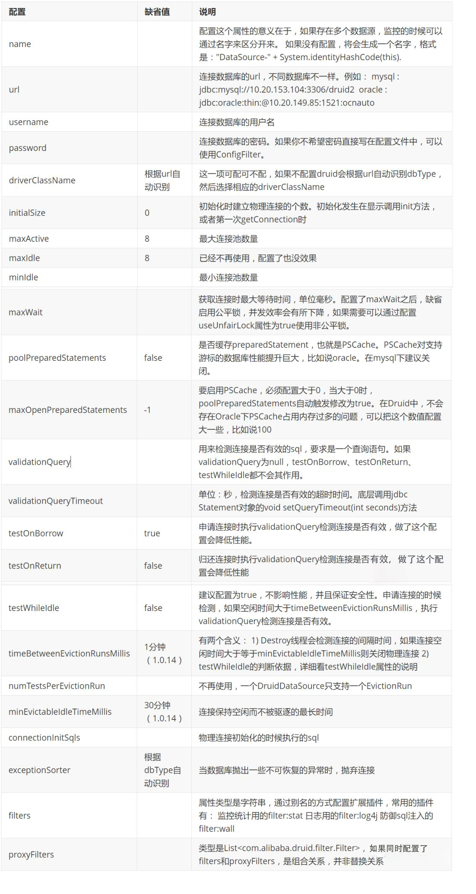

## 简介

### 回顾Spring

Spring是一个开源框架，2003 年兴起的一个轻量级的Java开发框架，作者：Rod Johnson

**Spring是为了解决企业级应用开发的复杂性而创建的，简化开发。**

### Spring是如何简化Java开发的

为了降低Java开发的复杂性，Spring采用了以下4种关键策略：

1、基于POJO的轻量级和最小侵入性编程，所有东西都是bean；

2、通过IOC，依赖注入（DI）和面向接口实现松耦合；

3、基于切面（AOP）和惯例进行声明式编程；

4、通过切面和模版减少样式代码，RedisTemplate，xxxTemplate...

### 什么是SpringBoot

> Spring Boot是由Pivotal团队提供的全新[框架](https://baike.baidu.com/item/框架/1212667?fromModule=lemma_inlink)，其设计目的是用来[简化](https://baike.baidu.com/item/简化/3374416?fromModule=lemma_inlink)新[Spring](https://baike.baidu.com/item/Spring/85061?fromModule=lemma_inlink)应用的初始搭建以及开发过程。该框架使用了特定的方式来进行配置，从而使开发人员不再需要定义样板化的配置。通过这种方式，Spring Boot致力于在蓬勃发展的快速应用开发领域(rapid application development)成为领导者。

## 主要优点

- 为所有Spring开发者更快的入门
- **开箱即用**，提供各种默认配置来简化项目配置
- 内嵌式容器简化Web项目
- 没有冗余代码生成和XML配置的要求

## Pom文件分析

```xml
<?xml version="1.0" encoding="UTF-8"?>
<project xmlns="http://maven.apache.org/POM/4.0.0" xmlns:xsi="http://www.w3.org/2001/XMLSchema-instance"
         xsi:schemaLocation="http://maven.apache.org/POM/4.0.0 https://maven.apache.org/xsd/maven-4.0.0.xsd">
  <modelVersion>4.0.0</modelVersion>
  <!-- SpringBoot默认父依赖 -->
  <parent>
    <groupId>org.springframework.boot</groupId>
    <artifactId>spring-boot-starter-parent</artifactId>
    <version>2.7.3</version>
    <relativePath/> <!-- lookup parent from repository -->
  </parent>
  <!-- 项目信息 -->
  <groupId>com</groupId>
  <artifactId>SpringBootStudy</artifactId>
  <version>0.0.1-SNAPSHOT</version>
  <name>SpringBootStudy</name>
  <description>SpringBootStudy</description>
  <properties>
    <java.version>1.8</java.version>
  </properties>

  <dependencies>
    <!-- web场景启动器 -->
    <dependency>
      <groupId>org.springframework.boot</groupId>
      <artifactId>spring-boot-starter-web</artifactId>
    </dependency>
    <!-- springboot单元测试 -->
    <dependency>
      <groupId>org.springframework.boot</groupId>
      <artifactId>spring-boot-starter-test</artifactId>
      <scope>test</scope>
    </dependency>
  </dependencies>

  <build>
    <plugins>
      <!-- 打包插件 -->
      <plugin>
        <groupId>org.springframework.boot</groupId>
        <artifactId>spring-boot-maven-plugin</artifactId>
      </plugin>
    </plugins>
  </build>

</project>
```

### 依赖管理

SpirngBoot的依赖由父工程的父工程统一管理，所以我们在使用启动器的时候，不用手动指定版本号

`spring-boot-starter-parent` => `spring-boot-dependencies`

```xml
<parent>
    <groupId>org.springframework.boot</groupId>
    <artifactId>spring-boot-dependencies</artifactId>
    <version>2.7.3</version>
</parent>
```

### 启动器

**springboot-boot-starter-xxx**：就是spring-boot的场景启动器

**spring-boot-starter-web**：帮我们导入了web模块正常运行所依赖的组件

SpringBoot将所有的功能场景都抽取出来，做成一个个的starter （启动器），只需要在项目中引入这些starter即可，所有相关的依赖都会导入进来，我们要用什么功能就导入什么样的场景启动器即可，我们未来也可以自己自定义starter。

```xml
<dependency>
    <groupId>org.springframework.boot</groupId>
    <artifactId>spring-boot-starter-web</artifactId>
</dependency>
```

## 热部署

导入如下依赖，修改代码之后只要重新编译即可看到效果，不用重新部署

```xml
<!-- springBoot devtools的热部署 修改代码之后需要重新编译一下即可 -->
<dependency>
    <groupId>org.springframework.boot</groupId>
    <artifactId>spring-boot-devtools</artifactId>
    <optional>true</optional>
</dependency>
```

## 自动装配原理

### @SpringBootApplication

> 作用：标注在某个类上说明这个类是SpringBoot的主启动类 ，SpringBoot就应该运行这个类的main方法来启动SpringBoot应用；

进入这个注解：可以看到上面还有很多其他注解！

```java
@SpringBootConfiguration
@EnableAutoConfiguration
@ComponentScan(
    excludeFilters = {@Filter(
    type = FilterType.CUSTOM,
    classes = {TypeExcludeFilter.class}
), @Filter(
    type = FilterType.CUSTOM,
    classes = {AutoConfigurationExcludeFilter.class}
)}
)
public @interface SpringBootApplication {
    // ......
}
```

#### 1. @ComponentScan

> 作用：自动扫描并加载符合条件的组件或者bean，将这个bean定义加载到IOC容器中

#### 2. @SpringBootConfiguration

> 作用：SpringBoot的配置类 ，标注在某个类上 ， 表示这是一个SpringBoot的配置类；

进入这个注解查看

```java
// 点进去得到下面的 @Component
@Configuration
public @interface SpringBootConfiguration {}

@Component
public @interface Configuration {}
```

这里的`@Configuration`，说明这是一个配置类 ，配置类就是对应Spring的xml 配置文件；

里面的`@Component`这就说明，启动类本身也是Spring中的一个组件而已，负责启动应用！

#### 3. @EnableAutoConfiguration

以前我们需要自己配置的东西，而现在SpringBoot可以自动帮我们配置 ；@EnableAutoConfiguration告诉SpringBoot开启自动配置功能，这样自动配置才能生效；

进入这个注解查看

```java
@AutoConfigurationPackage
@Import(AutoConfigurationImportSelector.class)
public @interface EnableAutoConfiguration {
// ......
}
```

##### 3.1 @AutoConfigurationPackage

> 作用：自动配置包

进入这个注解查看

```java
@Import(AutoConfigurationPackages.Registrar.class)
public @interface AutoConfigurationPackage {
// ......
}
```

`@Import`：Spring底层注解@import ， 给容器中导入一个组件

`Registrar.class`：将主启动类的所在包及包下面所有子包里面的所有组件扫描到Spring容器 ；

##### 3.2 @Import(AutoConfigurationImportSelector.class)

> 作用：给容器导入组件

AutoConfigurationImportSelector ：自动配置导入选择器，那么它会导入哪些组件的选择器呢？我们点击去这个类看源码

==分析源码可知：SpringBoot在启动的时候从`org.springframework.boot:spring-boot-autoconfigure/META-INF/spring.factories`中获取EnableAutoConfiguration指定的值==

```java
// 获得候选的配置
protected List<String> getCandidateConfigurations(AnnotationMetadata metadata, AnnotationAttributes attributes) {
    //这里的getSpringFactoriesLoaderFactoryClass()方法
    //返回的就是我们最开始看的启动自动导入配置文件的注解类；EnableAutoConfiguration
    List<String> configurations = SpringFactoriesLoader.loadFactoryNames(this.getSpringFactoriesLoaderFactoryClass(), this.getBeanClassLoader());
    Assert.notEmpty(configurations, "No auto configuration classes found in META-INF/spring.factories. If you are using a custom packaging, make sure that file is correct.");
    return configurations;
}

//上面调用了SpringFactoriesLoader类的静态方法loadFactoryNames()
public static List<String> loadFactoryNames(Class<?> factoryClass, @Nullable ClassLoader classLoader) {
    String factoryClassName = factoryClass.getName();
    //这里它又调用了loadSpringFactories方法
    return (List)loadSpringFactories(classLoader).getOrDefault(factoryClassName, Collections.emptyList());
}
```

```java
//loadSpringFactories()方法
private static Map<String, List<String>> loadSpringFactories(@Nullable ClassLoader classLoader) {
    //获得classLoader ， 我们返回可以看到这里得到的就是EnableAutoConfiguration标注的类本身
    MultiValueMap<String, String> result = (MultiValueMap)cache.get(classLoader);
    if (result != null) {
        return result;
    } else {
        try {
            //去获取一个资源 "META-INF/spring.factories"
            Enumeration<URL> urls = classLoader != null ? classLoader.getResources("META-INF/spring.factories") : ClassLoader.getSystemResources("META-INF/spring.factories");
            LinkedMultiValueMap result = new LinkedMultiValueMap();

            //将读取到的资源遍历，封装成为一个Properties
            while(urls.hasMoreElements()) {
                URL url = (URL)urls.nextElement();
                UrlResource resource = new UrlResource(url);
                Properties properties = PropertiesLoaderUtils.loadProperties(resource);
                Iterator var6 = properties.entrySet().iterator();

                while(var6.hasNext()) {
                    Entry<?, ?> entry = (Entry)var6.next();
                    String factoryClassName = ((String)entry.getKey()).trim();
                    String[] var9 = StringUtils.commaDelimitedListToStringArray((String)entry.getValue());
                    int var10 = var9.length;

                    for(int var11 = 0; var11 < var10; ++var11) {
                        String factoryName = var9[var11];
                        result.add(factoryClassName, factoryName.trim());
                    }
                }
            }

            cache.put(classLoader, result);
            return result;
        } catch (IOException var13) {
            throw new IllegalArgumentException("Unable to load factories from location [META-INF/spring.factories]", var13);
        }
    }
}
```

### 总结

1. SpringBoot在启动的时候从`org.springframework.boot:spring-boot-autoconfigure/META-INF/spring.factories`中获取EnableAutoConfiguration指定的值
2. 将这些值作为自动配置类导入容器 ，自动配置类就生效，帮我们进行自动配置工作
3. 整个J2EE的整体解决方案和自动配置都在springboot-autoconfigure的jar包中
4. 它会给容器中导入非常多的自动配置类（xxxAutoConfiguration），就是给容器中导入这个场景需要的所有组件，并配置好这些组件
5. 有了自动配置类，免去了我们手动编写配置注入功能组件等的工作

### 配置文件配置规律(旧版本)

我们已经知道SpringBoot在启动的时候会读取`spring.factories`文件来决定哪些类需要进行装配

我们以文件中的**HttpEncodingAutoConfiguration（Http编码自动配置）**为例解释自动配置原理；

```java
//表示这是一个配置类，和以前编写的配置文件一样，也可以给容器中添加组件；
@Configuration 

//启动指定类的ConfigurationProperties功能；
	//进入这个HttpProperties查看，将配置文件中对应的值和HttpProperties绑定起来；
	//并把HttpProperties加入到ioc容器中
	//我们所写的配置其实就是在修改HttpProperties类的属性
@EnableConfigurationProperties({HttpProperties.class}) 

//Spring底层@Conditional注解
  //根据不同的条件判断，如果满足指定的条件，整个配置类里面的配置就会生效；
  //这里的意思就是判断当前应用是否是web应用，如果是，当前配置类生效
@ConditionalOnWebApplication(
    type = Type.SERVLET
)

//判断当前项目有没有这个类CharacterEncodingFilter；SpringMVC中进行乱码解决的过滤器；
@ConditionalOnClass({CharacterEncodingFilter.class})

//判断配置文件中是否存在某个配置：spring.http.encoding.enabled；
  //如果不存在，判断也是成立的
  //即使我们配置文件中不配置pring.http.encoding.enabled=true，也是默认生效的；
@ConditionalOnProperty(
    prefix = "spring.http.encoding",
    value = {"enabled"},
    matchIfMissing = true
)

public class HttpEncodingAutoConfiguration {
    //他已经和SpringBoot的配置文件映射了
    private final Encoding properties;
    //只有一个有参构造器的情况下，参数的值就会从容器中拿
    public HttpEncodingAutoConfiguration(HttpProperties properties) {
        this.properties = properties.getEncoding();
    }
    
    //给容器中添加一个组件，这个组件的某些值需要从properties中获取
    @Bean
    @ConditionalOnMissingBean //判断容器没有这个组件？
    public CharacterEncodingFilter characterEncodingFilter() {
        CharacterEncodingFilter filter = new OrderedCharacterEncodingFilter();
        filter.setEncoding(this.properties.getCharset().name());
        filter.setForceRequestEncoding(this.properties.shouldForce(org.springframework.boot.autoconfigure.http.HttpProperties.Encoding.Type.REQUEST));
        filter.setForceResponseEncoding(this.properties.shouldForce(org.springframework.boot.autoconfigure.http.HttpProperties.Encoding.Type.RESPONSE));
        return filter;
    }
    //。。。。。。。
}
```

- 一但这个配置类生效；这个配置类就会给容器中添加各种组件；
- 这些组件的属性是从对应的properties类中获取的，这些类里面的每一个属性又是和配置文件绑定的；
- 所有在配置文件中能配置的属性都是在xxxxProperties类中封装着；
- 配置文件能配置什么就可以参照某个功能对应的这个属性类

```java
//从配置文件中获取指定的值和bean的属性进行绑定
@ConfigurationProperties(prefix = "spring.http") 
public class HttpProperties {
    // .....
}
```

1、SpringBoot启动会加载大量的自动配置类

2、我们看我们需要的功能有没有在SpringBoot默认写好的自动配置类当中；

3、我们再来看这个自动配置类中到底配置了哪些组件；（只要我们要用的组件存在在其中，我们就不需要再手动配置了）

4、给容器中自动配置类添加组件的时候，会从properties类中获取某些属性。我们只需要在配置文件中指定这些属性的值即可；

**xxxxAutoConfigurartion：自动配置类；**给容器中添加组件

**xxxxProperties:封装配置文件中相关属性；**

### 配置文件配置规律(springboot2.7+)

在springboot2.7之后，自动装配类的加载方式有了一些变化，官方不再推荐使用`spring.factories`来自动装配（springboot3将弃用spring.factories），但是也向下兼容，所以一些通过老板方式自定义的starter依旧生效

新版springboot将之前的自动装配类全部写到了`org.springframework.boot:spring-boot-autoconfigure/META-INF/spring/org.springframework.boot.autoconfigure.AutoConfiguration.imports`这个文件中

### 新老版本比对

|          原配置           |                            新配置                            |
| :-----------------------: | :----------------------------------------------------------: |
| META-INF/spring.factories | META-INF/spring/org.springframework.boot.autoconfigure.AutoConfiguration.imports |
|      @Configuration       |                      @AutoConfiguration                      |

新注解@AutoConfiguration是被用在META-INF/spring/org.springframework.boot.autoconfigure.AutoConfiguration.imports中的自动化配置类上用来替换@Configuration、@AutoConfigurationAfter、@AutoConfigurationBefore注解，其中@Configuration对应的proxyBeanMethods属性值一直为false。

### @Conditional注解

了解完自动装配的原理后，我们来关注一个细节问题，**自动配置类必须在一定的条件下才能生效；**


我们可以开启springboot调试类，在控制台查看哪些类被自动装配了

```yaml
# 开启springboot的调试类
debug: true
```

- Positive matches:（自动配置类启用的：正匹配）

- Negative matches:（没有启动，没有匹配成功的自动配置类：负匹配）

- Unconditional classes: （没有条件的类）

## 配置文件

### 基本语法

1. properties文件

```properties
key=value
```

2. yaml文件

> YAML是 "YAML Ain't a Markup Language" （YAML不是一种标记语言）的递归缩写。在开发的这种语言时，YAML 的意思其实是："Yet Another Markup Language"（仍是一种标记语言）

==这种语言以数据作为中心，而不是以标记语言为重点==

```yaml
key: value

# 对象
student01:
  name: 李爽
  age: 20

# 行内写法
student02: {name: 张三,age: 22}

# 数组
list01:
  - dog
  - cat
  - dark

# 行内写法
list02: [dog,pig,cat]
```

==注：==

- “ ” 双引号，不会转义字符串里面的特殊字符 ， 特殊字符会作为本身想表示的意思；

  比如 ：name: "kuang \n shen"  输出 ：kuang  换行  shen

- ' ' 单引号，会转义特殊字符 ， 特殊字符最终会变成和普通字符一样输出

  比如 ：name: ‘kuang \n shen’  输出 ：kuang  \n  shen

### 属性值注入

`Person.java`

```java
@Component //注册bean到容器中
public class Person {
    private String name;
    private Integer age;
    private Boolean happy;
    private Date birth;
    private Map<String,Object> maps;
    private List<Object> lists;
    
    //有参无参构造、get、set方法、toString()方法  
}
```

`application.yml`

```yaml
person:
  name: qinjiang
  age: 3
  happy: false
  birth: 2000/01/01
  maps: {k1: v1,k2: v2}
  lists:
   - code
   - girl
   - music
```

`Person.java`

```java
/*
@ConfigurationProperties作用：
将配置文件中配置的每一个属性的值，映射到这个组件中；
告诉SpringBoot将本类中的所有属性和配置文件中相关的配置进行绑定
参数 prefix = “person” : 将配置文件中的person下面的所有属性一一对应
*/
@Component //注册bean
@ConfigurationProperties(prefix = "person")
public class Person {
    private String name;
    private Integer age;
    private Boolean happy;
    private Date birth;
    private Map<String,Object> maps;
    private List<Object> lists;
    private Dog dog;
}
```

通过yaml进行属性值注入，会有警告，但不会影响运行，我们可以导入下面依赖来消除警告

```xml
<!-- 导入配置文件处理器，配置文件进行绑定就会有提示，需要重启 -->
<dependency>
  <groupId>org.springframework.boot</groupId>
  <artifactId>spring-boot-configuration-processor</artifactId>
  <optional>true</optional>
</dependency>
```

使用properties配置文件来进行属性值注入

### 配置文件的加载

**@PropertySource ：**加载指定的配置文件；

**@configurationProperties**：默认从全局配置文件中获取值；

测试**@configurationProperties**+**properties配置文件**的方式注入属性值

`application.properties`

```properties
name=李爽
age=21
```

`Person.java`

```java
@Data
@NoArgsConstructor
@AllArgsConstructor
@PropertySource("classpath:application.properties")
@Component
public class Person {
    @Value("${name}")
    private String name;
    @Value("${age}")
    private int age;
}
```

### yaml与properties的区别

|              |       yaml       |      properties       |
| :----------: | :--------------: | :-------------------: |
|     功能     | 批量注入配置属性 | 使用Value单个指定属性 |
|   松散绑定   |       支持       |        不支持         |
|     SpEL     |      不支持      |         支持          |
|    JSR303    |       支持       |        不支持         |
| 复杂类型封装 |       支持       |        不支持         |

松散绑定：驼峰与中划线两者之间的自动映射，例如firstName与first-name

SpEL：springboot提供的一些可以直接用与EL表达式的值，例如${random.uuid}

## JSR303校验


### 简单使用

1. 导入依赖

```xml
<dependency>
    <groupId>org.springframework.boot</groupId>
    <artifactId>spring-boot-starter-validation</artifactId>
</dependency>
```

2. `Person.java`

```java
@Validated	//开启数据校验
public class Person {
    private String name;

    //验证是否符合邮箱格式
    @Email
    private int age;
}
```

### 常用注解

```java
@NotNull(message="名字不能为空")
private String userName;
@Max(value=120,message="年龄最大不能查过120")
private int age;
@Email(message="邮箱格式错误")
private String email;

空检查
@Null       验证对象是否为null
@NotNull    验证对象是否不为null, 无法查检长度为0的字符串
@NotBlank   检查约束字符串是不是Null还有被Trim的长度是否大于0,只对字符串,且会去掉前后空格.
@NotEmpty   检查约束元素是否为NULL或者是EMPTY.
    
Booelan检查
@AssertTrue     验证 Boolean 对象是否为 true  
@AssertFalse    验证 Boolean 对象是否为 false  
    
长度检查
@Size(min=, max=) 验证对象（Array,Collection,Map,String）长度是否在给定的范围之内  
@Length(min=, max=) string is between min and max included.

日期检查
@Past       验证 Date 和 Calendar 对象是否在当前时间之前  
@Future     验证 Date 和 Calendar 对象是否在当前时间之后  
@Pattern    验证 String 对象是否符合正则表达式的规则

.......等等
除此以外，我们还可以自定义一些数据校验规则
```

## 多环境配置切换

### 配置文件加载路径及优先级

官方定义了4个配置文件可以被加载的路径，自动加载名为application的配置文件

1. file:./config/
2. file:./
3. classpath:/config/
4. classpath:/

加载优先级

```
优先级1：项目路径下的config文件夹内的配置文件
优先级2：项目路径下的配置文件
优先级3：资源路径下的config文件夹内的配置文件
优先级4：资源路径下的配置文件
```

### 多环境配置

我们在主配置文件编写的时候，文件名可以是 application-{profile}.properties/yml , 用来指定多个环境版本；

例如：

- application-test.properties 代表测试环境配置

- application-dev.properties 代表开发环境配置

在主配置文件中激活配置

`application.properties`

```properties
#比如在配置文件中指定使用dev环境，我们可以通过设置不同的端口号进行测试；
#我们启动SpringBoot，就可以看到已经切换到dev下的配置了；
spring.profiles.active=dev
```

> yaml的多文档块

和properties配置文件中一样，但是使用yml去实现不需要创建多个配置文件，更加方便了 !

```yaml
server:
  port: 8081
#选择要激活那个环境块
spring:
  profiles:
    active: test

---
server:
  port: 8083
spring:
  profiles: dev #配置环境的名称


---
server:
  port: 8084
spring:
  profiles: test  #配置环境的名称
```

==注：如果yml和properties同时都配置了端口，并且没有激活其他环境 ， 默认会使用properties配置文件的！==

## SpringBoot Web

### 静态资源处理

在普通的JavaWeb项目中，我们在main/webapp这个路径下放我们的静态资源。

### webjars

Webjars本质就是以jar包的方式引入我们的静态资源 ， 我们以前要导入一个静态资源文件，直接导入即可。

使用SpringBoot需要使用Webjars，我们可以去搜索一下：

网站：https://www.webjars.org 

要使用jQuery，我们只要要引入jQuery对应版本的pom依赖即可！

我们可以在`/webjars/**`这个路径下引用我们导入的webjar资源

```xml
<dependency>
    <groupId>org.webjars</groupId>
    <artifactId>jquery</artifactId>
    <version>3.4.1</version>
</dependency>
```

### SpringBoot默认静态资源加载路径

1. `classpath:/META-INF/resources/`
2. `classpath:/resources/`
3. `classpath:/static/`
4. `classpath:/public/`

上面是SpringBoot的四个默认静态资源加载路径，通过测试我们可以得出，他们的优先级情况是`1 > 2 > 3 > 4`

可以通过配置文件手动设置静态资源路径，不过设置过后，几个默认路径都会失效

## Thymeleaf模板引擎

html文件根标签属性引入Thymeleaf
```html
<html lang="en" xmlns:th="http://www.thymeleaf.org">
```
语法
```html
<h1 th:text="'姓名：'+${name}"></h1>
<h1 th:text="|姓名：${name}|"></h1>
<h1 th:utext="'姓名：'+${name}"></h1>
<h1 th:each="user:${users}" th:text="${user}"></h1>
```
fragment标签与insert、replace、include属性
```html
<!-- 用fragment标签定义 -->
<footer th:fragment="copy">
  &copy; 2011 The Good Thymes Virtual Grocery
</footer>

<!-- 用insert属性在元素下引用定义好的片段 -->
<!-- 效果如下 
<div>
    <footer>
        &copy; 2011 The Good Thymes Virtual Grocery
    </footer>
</div> 
-->
<div th:insert="footer :: copy"></div>

<!-- 用replace属性在元素下引用定义好的片段 -->
<!-- 效果如下 
<footer>
    &copy; 2011 The Good Thymes Virtual Grocery
</footer>
-->
<div th:replace="footer :: copy"></div>

<!-- 用include属性在元素下引用定义好的片段 -->
<!-- 效果如下 
<div>
    &copy; 2011 The Good Thymes Virtual Grocery
</div>
-->
<div th:include="footer :: copy"></div>

<!-- 注：当定义标签与使用标签不存在于同一个目录中时，引用时要带上路径 -->
<div th:insert="main/footer :: copy"></div>
```

## SpringMVC自动装配

> 文档地址：https://docs.spring.io/spring-boot/docs/2.2.5.RELEASE/reference/htmlsingle/#boot-features-spring-mvc-auto-configuration

```java
Spring MVC Auto-configuration
// Spring Boot为Spring MVC提供了自动配置，它可以很好地与大多数应用程序一起工作。
Spring Boot provides auto-configuration for Spring MVC that works well with most applications.
// 自动配置在Spring默认设置的基础上添加了以下功能：
The auto-configuration adds the following features on top of Spring’s defaults:
// 包含视图解析器
Inclusion of ContentNegotiatingViewResolver and BeanNameViewResolver beans.
// 支持静态资源文件夹的路径，以及webjars
Support for serving static resources, including support for WebJars 
// 自动注册了Converter：
// 转换器，这就是我们网页提交数据到后台自动封装成为对象的东西，比如把"1"字符串自动转换为int类型
// Formatter：【格式化器，比如页面给我们了一个2019-8-10，它会给我们自动格式化为Date对象】
Automatic registration of Converter, GenericConverter, and Formatter beans.
// HttpMessageConverters
// SpringMVC用来转换Http请求和响应的的，比如我们要把一个User对象转换为JSON字符串，可以去看官网文档解释；
Support for HttpMessageConverters (covered later in this document).
// 定义错误代码生成规则的
Automatic registration of MessageCodesResolver (covered later in this document).
// 首页定制
Static index.html support.
// 图标定制
Custom Favicon support (covered later in this document).
// 初始化数据绑定器：帮我们把请求数据绑定到JavaBean中！
Automatic use of a ConfigurableWebBindingInitializer bean (covered later in this document).

/*
如果您希望保留Spring Boot MVC功能，并且希望添加其他MVC配置（拦截器、格式化程序、视图控制器和其他功能），则可以添加自己
的@configuration类，类型为webmvcconfiguer，但不添加@EnableWebMvc。如果希望提供
RequestMappingHandlerMapping、RequestMappingHandlerAdapter或ExceptionHandlerExceptionResolver的自定义
实例，则可以声明WebMVCregistrationAdapter实例来提供此类组件。
*/
If you want to keep Spring Boot MVC features and you want to add additional MVC configuration 
(interceptors, formatters, view controllers, and other features), you can add your own 
@Configuration class of type WebMvcConfigurer but without @EnableWebMvc. If you wish to provide 
custom instances of RequestMappingHandlerMapping, RequestMappingHandlerAdapter, or 
ExceptionHandlerExceptionResolver, you can declare a WebMvcRegistrationsAdapter instance to provide such components.

// 如果您想完全控制Spring MVC，可以添加自己的@Configuration，并用@EnableWebMvc进行注释。
If you want to take complete control of Spring MVC, you can add your own @Configuration annotated with @EnableWebMvc.
```

## SpringMVC扩展

探究源码，我们可以得到如下结论：

==ContentNegotiatingViewResolver这个视图解析器就是用来组合所有的视图解析器的，它在IOC容器中查找视图解析器，找到最优解进行赋值使用==

我们尝试向IOC容器中注册一个自定义的视图解析器

```java
@Configuration
public class MyWebMvcConfigurer implements WebMvcConfigurer {
    @Bean //放到bean中
    public ViewResolver myViewResolver(){
        return new MyViewResolver();
    }

    //我们写一个静态内部类，视图解析器就需要实现ViewResolver接口
    private static class MyViewResolver implements ViewResolver{
        @Override
        public View resolveViewName(String s, Locale locale) throws Exception {
            return null;
        }
    }
}
```

之后我们对`DispatcherServlet`类的`doDispatch()`方法进行DeBug发现，我们自定义的视图解析器，也进入了它的视图遍历列表，参与了循环

==结论：所以说，我们如果想要使用自己定制化的东西，我们只需要给容器中添加这个组件就好了！剩下的事情SpringBoot就会帮我们做了！==

## 国际化

1. 在resources资源文件下新建一个i18n文件，存放国际化配置文件
2. 在i18n文件夹内创建多个配置文件，对应多个语言

`login.properties` 默认

```properties
login.btn=登录
login.password=密码
login.remember=记住我
login.tip=请登录
login.username=用户名
```

`login_zh_CN.properties` 中国

```properties
login.btn=登录
login.password=密码
login.remember=记住我
login.tip=请登录
login.username=用户名
```

`login_en_US.properties` 美国

```properties
login.btn=Sign in
login.password=Password
login.remember=Remember me
login.tip=Please sign in
login.username=Username
```

3. 在配置文件中配置语言包位置

```yml
spring:
  messages:
    basename: i18n.login
```

4. 在webmvc的自动配置文件中有一个区域信息解析器`LocaleResolver`，我们可以自己写一个类，来覆盖它，完成国际化切换的操作

`MyLocaleResolver.java`

```java
//可以在链接上携带区域信息
public class MyLocaleResolver implements LocaleResolver {

    //解析请求
    @Override
    public Locale resolveLocale(HttpServletRequest request) {
        // 获取参数l
        String language = request.getParameter("l");
        // 如果没有获取到就使用系统默认的区域
        Locale locale = Locale.getDefault();
        //如果请求链接不为空
        if (!StringUtils.isEmpty(language)){
            //分割请求参数
            String[] split = language.split("_");
            //国家，地区
            locale = new Locale(split[0],split[1]);
        }
        return locale;
    }

    @Override
    public void setLocale(HttpServletRequest httpServletRequest, HttpServletResponse httpServletResponse, Locale locale) {

    }
}
```

5. 在IOC容器中注册我们的自定义解析器

`MyMvcConfig.java`

```java
@Configuration
public class MyMvcConfig implements WebMvcConfigurer {
    @Bean
    public LocaleResolver localeResolver(){
        return new MyLocaleResolver();
    }
}
```

6. 前端进行国际化配置

```html
<form class="form-signin" th:action="@{/index}" method="post">
    
    <!-- 国际化参数用 # 取值 -->
    <h1 class="h3 mb-3 font-weight-normal" th:text="#{login.tip}"></h1>
    <label for="username" class="sr-only" th:text="#{login.username}"></label>
    <input type="text" id="username" class="form-control" th:placeholder="#{login.username}" name="username">
    <label for="password" class="sr-only" th:text="#{login.password}"></label>
    <input type="password" id="password" class="form-control" th:placeholder="#{login.password}" name="password">
    <div class="checkbox mb-3">
        <label>
            <input type="checkbox" value="remember-me" th:text="#{login.remember}">
        </label>
    </div>
    <button class="btn btn-lg btn-primary btn-block" type="submit" th:text="#{login.btn}"></button>
    <p class="mt-5 mb-3 text-muted">© 2017-2018</p>

    <!-- thymeleaf特有传参方式（key=value）-->
    <!-- 通过l参数来控制页面国际化-->
    <a class="btn btn-sm" th:href="@{/login(l='zh_CN')}">中文</a>
    <a class="btn btn-sm" th:href="@{/login(l='en_US')}">English</a>
</form>
```

## 自定义错误页面

可以在springboot的静态资源路径、或者模板引擎目录`templates`下创建`error`目录用来存放自定义的错误页面，页面以错误码命名，例如404.html、5xx.html等，一个页面代表一个错误或一类错误，springboot会识别，并在系统错误发生时进行跳转

## SpringData

对于数据访问层，无论是SQL(关系型数据库) 还是NOSQL(非关系型数据库)，SpringBoot底层都是采用 SpringData的方式进行统一处理。

SpringBoot底层都是采用Spring Data的方式进行统一处理各种数据库，SpringData也是Spring中与 SpringBoot、SpringCloud等齐名的知名项目。

SpingData 官网：https://spring.io/projects/spring-data

数据库相关的启动器，可以参考官方文档：

https://docs.spring.io/spring-boot/docs/2.2.5.RELEASE/reference/htmlsingle/#using-boot-starter

### 测试JDBC

1. 导入依赖

```xml
<dependency>
    <groupId>org.springframework.boot</groupId>
    <artifactId>spring-boot-starter-jdbc</artifactId>
</dependency>
<dependency>
    <groupId>mysql</groupId>
    <artifactId>mysql-connector-java</artifactId>
    <scope>runtime</scope>
</dependency>
```

2. 配置数据库连接参数

```yaml
spring:
  datasource:
    driver-class-name: com.mysql.jdbc.Driver
    url: jdbc:mysql://localhost:3306/springboot-data?useSSL=true&amp;useUnicode=true&amp;characterEncoding=utf8&amp;serverTimezone=GMT%2B8
    username: root
    password: lishuang001219
```

3. 测试，使用`jdbcTemplate`

```java
@SpringBootTest
public class MyTest {

    @Autowired
    JdbcTemplate jdbcTemplate;

    @Test
    public void text() {
        String sql = "select * from user";
        List<Map<String, Object>> maps = jdbcTemplate.queryForList(sql);
        System.out.println(maps);
    }
}
```

### JdbcTemplate常用方法

- execute方法：可以用于执行任何SQL语句，一般用于执行DDL语句；
- update方法及batchUpdate方法：update方法用于执行新增、修改、删除等语句；batchUpdate方法用于执行批处理相关语句；
- query方法及queryForXXX方法：用于执行查询相关语句；
- call方法：用于执行存储过程、函数相关语句。

## Druid数据源

### 简介

Java程序很大一部分要操作数据库，为了提高性能操作数据库的时候，又不得不使用数据库连接池。

Druid是阿里巴巴开源平台上一个数据库连接池实现，结合了 C3P0、DBCP 等数据库连接池的优点，同时加入了日志监控。

Druid可以很好的监控数据库池连接和SQL的执行情况，天生就是针对监控而生的数据库连接池。

Druid已经在阿里巴巴部署了超过600个应用，经过一年多生产环境大规模部署的严苛考验。

Spring Boot 2.0 以上默认使用Hikari数据源，可以说Hikari与Driud都是当前JavaWeb上最优秀的数据源，我们来重点介绍SpringBoot如何集成Druid数据源，如何实现数据库监控。

Github地址：https://github.com/alibaba/druid/

### Druid的基本配置参数



### 使用

1. 导入依赖

```xml
<!-- https://mvnrepository.com/artifact/com.alibaba/druid -->
<dependency>
    <groupId>com.alibaba</groupId>
    <artifactId>druid</artifactId>
    <version>1.1.21</version>
</dependency>

<!-- https://mvnrepository.com/artifact/log4j/log4j -->
<dependency>
    <groupId>log4j</groupId>
    <artifactId>log4j</artifactId>
    <version>1.2.17</version>
</dependency>
```
2. 指定数据源为Druid，并配置相关参数
```yml
spring:
  datasource:
    username: root
    password: 123456
    url: jdbc:mysql://localhost:3306/springboot?serverTimezone=UTC&useUnicode=true&characterEncoding=utf-8
    driver-class-name: com.mysql.cj.jdbc.Driver
    type: com.alibaba.druid.pool.DruidDataSource # 自定义数据源
    
    #Spring Boot 默认是不注入这些属性值的，需要自己绑定
    #druid 数据源专有配置
    initialSize: 5
    minIdle: 5
    maxActive: 20
    maxWait: 60000
    timeBetweenEvictionRunsMillis: 60000
    minEvictableIdleTimeMillis: 300000
    validationQuery: SELECT 1 FROM DUAL
    testWhileIdle: true
    testOnBorrow: false
    testOnReturn: false
    poolPreparedStatements: true

    #配置监控统计拦截的filters，stat:监控统计、log4j：日志记录、wall：防御sql注入
    #如果允许时报错  java.lang.ClassNotFoundException: org.apache.log4j.Priority
    #则导入 log4j 依赖即可，Maven 地址：https://mvnrepository.com/artifact/log4j/log4j
    filters: stat,wall,log4j
    maxPoolPreparedStatementPerConnectionSize: 20
    useGlobalDataSourceStat: true
    connectionProperties: druid.stat.mergeSql=true;druid.stat.slowSqlMillis=500
```
3. 添加配置类
```java
package com.kuang.config;

import com.alibaba.druid.pool.DruidDataSource;
import org.springframework.boot.context.properties.ConfigurationProperties;
import org.springframework.context.annotation.Bean;
import org.springframework.context.annotation.Configuration;

import javax.sql.DataSource;

@Configuration
public class DruidConfig {

    /*
       将自定义的 Druid数据源添加到容器中，不再让Spring Boot自动创建
       绑定全局配置文件中的 druid 数据源属性到 com.alibaba.druid.pool.DruidDataSource从而让它们生效
       @ConfigurationProperties(prefix = "spring.datasource")：作用就是将 全局配置文件中
       前缀为 spring.datasource的属性值注入到 com.alibaba.druid.pool.DruidDataSource 的同名参数中
     */
    @ConfigurationProperties(prefix = "spring.datasource")
    @Bean
    public DataSource druidDataSource() {
        return new DruidDataSource();
    }

}
```

### 配置Druid数据源监控

Druid 数据源具有监控的功能，并提供了一个 web 界面方便用户查看，类似安装 路由器 时，人家也提供了一个默认的 web 页面。

所以第一步需要设置 Druid 的后台管理页面，比如 登录账号、密码 等；配置后台管理；

```java
//配置Druid监控管理后台的Servlet；
//SpringBoot内置的Servlet容器时没有web.xml文件，所以使用 SpringBoot特有的方式注册Servlet
@Bean
public ServletRegistrationBean statViewServlet() {
    ServletRegistrationBean bean = new ServletRegistrationBean(new StatViewServlet(), "/druid/*");

    // 这些参数可以在 com.alibaba.druid.support.http.StatViewServlet
    // 的父类 com.alibaba.druid.support.http.ResourceServlet 中找到
    Map<String, String> initParams = new HashMap<>();
    initParams.put("loginUsername", "admin"); //后台管理界面的登录账号
    initParams.put("loginPassword", "123456"); //后台管理界面的登录密码

    //后台允许谁可以访问
    //initParams.put("allow", "localhost")：表示只有本机可以访问
    //initParams.put("allow", "")：为空或者为null时，表示允许所有访问
    initParams.put("allow", "");
    //deny：Druid 后台拒绝谁访问
    //initParams.put("kuangshen", "192.168.1.20");表示禁止此ip访问

    //设置初始化参数
    bean.setInitParameters(initParams);
    return bean;
}
```
配置Druid web监控filter过滤器
```java
//WebStatFilter：用于配置Web和Druid数据源之间的管理关联监控统计
@Bean
public FilterRegistrationBean webStatFilter() {
    FilterRegistrationBean bean = new FilterRegistrationBean();
    bean.setFilter(new WebStatFilter());

    //exclusions：设置哪些请求进行过滤排除掉，从而不进行统计
    Map<String, String> initParams = new HashMap<>();
    initParams.put("exclusions", "*.js,*.css,/druid/*,/jdbc/*");
    bean.setInitParameters(initParams);

    //"/*" 表示过滤所有请求
    bean.setUrlPatterns(Arrays.asList("/*"));
    return bean;
}
```

## 整合Mybatis

1. 导入依赖

```xml
<dependency>
    <groupId>org.mybatis.spring.boot</groupId>
    <artifactId>mybatis-spring-boot-starter</artifactId>
    <version>2.2.2</version>
</dependency>
```

2. 在springboot配置文件中进行mybatis的相关配置

```yaml
mybatis:
  # 指定mapper.xml的位置
  mapper-locations: classpath:mybatis/mapper/*.xml
  # 扫描包配置别名
  type-aliases-package: com.entity
  configuration:
    #默认开启驼峰命名法，可以不用设置该属性
    map-underscore-to-camel-case: true
```

3. 创建实体类

```java
@Data
@NoArgsConstructor
@AllArgsConstructor
public class User {
    private Integer id;
    private String name;
    private Integer age;
}
```

4. 创建Mapper接口

```java
@Mapper
@Repository
public interface UserMapper {
    List<User> userList();
}
```

5. 创建XML映射文件

```xml
<?xml version="1.0" encoding="UTF-8" ?>
<!DOCTYPE mapper
  PUBLIC "-//mybatis.org//DTD Mapper 3.0//EN"
  "http://mybatis.org/dtd/mybatis-3-mapper.dtd">
<!-- namespace命名空间：绑定一个对应的Mapper接口 -->
<mapper namespace="com.mapper.UserMapper">
  <!-- sql语句 -->
  <!-- id对应接口中定义的方法 resultType表示结果集类型 -->
  <select id="userList" resultType="User">
    select * from user
  </select>
</mapper>
```

6. 创建Controller

```java
@RestController
public class UserController {
    @Autowired
    UserMapper userMapper;

    @RequestMapping("/list")
    public String list(){
        return userMapper.userList().toString();
    }
}
```

7. 测试

```
http://localhost:8080/list
```

## SpringSecurity

> Spring 是一个非常流行和成功的 Java 应用开发框架。Spring Security 基于 Spring 框架，提供了一套 Web 应用安全性的完整解决方案。一般来说，Web 应用的安全性包括用户认证（Authentication）和用户授权（Authorization）两个部分。

### 用户认证

用户认证指的是验证某个用户是否为系统中的合法主体，也就是说用户能否访问该系统。用户认证一般要求用户提供用户名和密码。系统通过校验用户名和密码来完成认证过程。

### 用户授权

用户授权指的是验证某个用户是否有权限执行某个操作。在一个系统中，不同用户所具有的权限是不同的。比如对一个文件来说，有的用户只能进行读取，而有的用户可以进行修改。一般来说，系统会为不同的用户分配不同的角色，而每个角色则对应一系列的权限。

### 使用

==SpringSecurity是基于AOP实现的，所以我们在不用改变原有代码的前提下，就能加入安全验证==

1. 导入依赖

```xml
<dependency>
    <groupId>org.springframework.boot</groupId>
    <artifactId>spring-boot-starter-security</artifactId>
    <version>2.7.3</version>
</dependency>
```

2. 创建Spring Security配置类

参考官网：https://spring.io/projects/spring-security

`SecurityConfig`

```java
@EnableWebSecurity // 开启WebSecurity模式
public class SecurityConfig extends WebSecurityConfigurerAdapter {

    // 定制请求的授权规则
    @Override
    protected void configure(HttpSecurity http) throws Exception {
        // 链式编程
        http.authorizeRequests()
            // 首页所有人可以访问
            .antMatchers("/").permitAll()
            // 拥有vip1权限的用户可以访问如下url的页面
            .antMatchers("/level1/**").hasRole("vip1")
            .antMatchers("/level2/**").hasRole("vip2")
            .antMatchers("/level3/**").hasRole("vip3");

        // 开启登录功能
        // 默认/login请求来到登录页，login?error 重定向到这里表示登录失败
        http.formLogin();

//        // 定制登录页面
//        http.formLogin()
//            // 自定义登录页面地址
//            .loginPage("/loginPage")
//            // 自定义登录验证地址
//            .loginProcessingUrl("/loginValidation")
//            // 自定义password对应name
//            .passwordParameter("pwd")
//            // 自定义username对应name
//            .usernameParameter("user");


        http.csrf().disable();//关闭csrf功能:跨站请求伪造,默认只能通过post方式提交logout请求
        //开启注销功能
        // 默认/logout为注销请求
        http.logout()
            //注销成功跳转url
            .logoutSuccessUrl("/");

        // 开启记住我
        http.rememberMe()
            // 自定义记住我复选框对应name
            .rememberMeParameter("rememberMe");

    }

    //定制认证规则
    @Override
    protected void configure(AuthenticationManagerBuilder auth) throws Exception {
        // inMemoryAuthentication在内存中定义，也可以在jdbc中去拿，将inMemoryAuthentication()替换为jdbcAuthentication()即可
        // passwordEncoder定义密码的加密规则，有多种加密方式可选，bcrypt是官方推荐的
        auth.inMemoryAuthentication().passwordEncoder(new BCryptPasswordEncoder())
                .withUser("kuangshen").password(new BCryptPasswordEncoder().encode("123456")).roles("vip2","vip3")
                .and()
                .withUser("root").password(new BCryptPasswordEncoder().encode("123456")).roles("vip1","vip2","vip3")
                .and()
                .withUser("guest").password(new BCryptPasswordEncoder().encode("123456")).roles("vip1","vip2");
    }
}
```

### thymeleaf与springsecurity结合获取登录信息

1. 导入依赖

```xml
<!-- https://mvnrepository.com/artifact/org.thymeleaf.extras/thymeleaf-extras-springsecurity5 -->
<dependency>
    <groupId>org.thymeleaf.extras</groupId>
    <artifactId>thymeleaf-extras-springsecurity5</artifactId>
    <version>3.0.4.RELEASE</version>
</dependency>
```

2. 使用

```html
<!DOCTYPE html>
<html lang="en" xmlns:th="http://www.thymeleaf.org" xmlns:sec="http://www.thymeleaf.org/thymeleaf-extras-springsecurity5">
<head>
    <meta charset="UTF-8">
    <title>Title</title>
</head>
<body>
    <div>
        <!--如果未登录-->
        <div sec:authorize="isAnonymous()">
            <a class="item" th:href="@{/login}">
               登录
            </a>
        </div>

        <!--如果已登录-->
        <div sec:authorize="isAuthenticated()">
            <a class="item">
                用户名：<span sec:authentication="name"></span>
                角色：<span sec:authentication="principal.authorities"></span>
            </a>
        </div>
    </div>
    <div>
        <a th:href="@{/main/hello}">去hello页面</a>
    </div>
</body>
</html>
```

#### sec:authorize

1. sec:authorize="isAnonymous()" //用户为游客则显示
2. sec:authorize="isAuthenticated()" //用户通过验证则显示
3. sec:authorize="hasRole('common')" //用户为common角色则显示
4. sec:authorize="hasAuthority('ROLE_vip')"//用户为ROLE_vip权限则显示

#### sec:authentication

1. sec:authentication="name"  //当前用户的用户名
2. sec:authentication="principal.username" //同上
3. sec:authentication="principal.authorities" //当前用户的身份
4. sec:authentication="principal.password" //当前用户的密码(显示不出来，但确实有)

## Shiro

### 什么是Shiro

- 官网：http://shiro.apache.org/
- 是一款主流的 Java 安全框架，不依赖任何容器，可以运行在 Java SE 和 Java EE 项目中，它的主要作用是对访问系统的用户进行身份认证、授权、会话管理、加密等操作。
- Shiro就是用来解决安全管理的系统化框架。

### Shiro 核心组件

用户、角色、权限

给用户赋予角色，给角色赋予权限

1. UsernamePasswordToken，Shiro 用来封装用户登录信息，使用用户的登录信息来创建令牌 Token。
2. SecurityManager，Shiro 的核心部分，负责安全认证和授权。
3. Suject，Shiro 的一个抽象概念，包含了用户信息。
4. Realm，开发者自定义的模块，根据项目的需求，验证和授权的逻辑全部写在 Realm 中。
5. AuthenticationInfo，用户的角色信息集合，认证时使用。
6. AuthorzationInfo，角色的权限信息集合，授权时使用。
7. DefaultWebSecurityManager，安全管理器，开发者自定义的 Realm 需要注入到 DefaultWebSecurityManager 进行管理才能生效。
8. ShiroFilterFactoryBean，过滤器工厂，Shiro 的基本运行机制是开发者定制规则，Shiro 去执行，具体的执行操作就是由 ShiroFilterFactoryBean 创建的一个个 Filter 对象来完成。

### Shiro的运行机制


### 使用
1. 导入依赖
```xml
<dependency>
    <groupId>org.apache.shiro</groupId>
    <artifactId>shiro-spring</artifactId>
    <version>1.8.0</version>
</dependency>
```
2. 创建Shiro过滤器，也就是流程中的Realm，控制认证和授权
```java
public class AccoutRealm extends AuthorizingRealm {

    @Autowired
    private AccountService accountService;

    /**
     * 授权
     * @param principalCollection
     * @return
     */
    @Override
    protected AuthorizationInfo doGetAuthorizationInfo(PrincipalCollection principalCollection) {
        // 获取当前登录用户
        Subject subject = SecurityUtils.getSubject();
        Account account = (Account) subject.getPrincipal();

        // 设置角色集合，用Set集合防止重复
        Set<String> roles = new HashSet<>();
        // 从数据库中拿到角色信息加入到集合中
        roles.add(account.getRole());
        SimpleAuthorizationInfo info = new SimpleAuthorizationInfo(roles);
        
        // 从数据库中拿到权限信息加入到集合中
        info.addStringPermission(account.getParms());
        
        return info;
    }


    /**
     * 认证
     * @param authenticationToken
     * @return
     * @throws AuthenticationException
     */
    @Override
    protected AuthenticationInfo doGetAuthenticationInfo(AuthenticationToken authenticationToken) throws AuthenticationException {
        // 获取控制器传入的token信息
        UsernamePasswordToken token = (UsernamePasswordToken) authenticationToken;
        // 从数据库中查询到用户，取出用户名与token中的用户名进行对比
        Account account = accountService.findByUsername(token.getUsername());
        if(account != null){
            // 如果用户存在，则传入SimpleAuthenticationInfo进行密码验证
            // 参数一：数据库查到的对象
            // 参数二：数据库中查到的密码
            // 参数三：Realm的名字，这里直接使用getName()获取当前类的名字即可
            return new SimpleAuthenticationInfo(account,account.getPassword(),getName());
        }
        return null;
    }
}
```
3. 创建Shiro配置类，控制页面的拦截
```java
@Configuration
public class ShiroConfig {

    @Bean
    public ShiroFilterFactoryBean shiroFilterFactoryBean(@Qualifier("securityManager") DefaultWebSecurityManager securityManager){
        ShiroFilterFactoryBean factoryBean = new ShiroFilterFactoryBean();
        factoryBean.setSecurityManager(securityManager);

        //页面权限设置
        //1、必须登录才能访问 /main
        //2、当前用户必须拥有 manage 权限才能访问 /manage
        //3、当前用户必须拥有 admin 角色才能访问 /administrator
        Map<String,String> map = new HashMap<>();
        map.put("/main","authc");
        map.put("/manager","perms[manager]");
        map.put("/administrator","roles[admin]");
        factoryBean.setFilterChainDefinitionMap(map);

        // 自定义登录页
        factoryBean.setLoginUrl("/toLogin");

        // 自定义未授权页面
        factoryBean.setUnauthorizedUrl("/unauth");

        return factoryBean;
    }


    @Bean
    public DefaultWebSecurityManager securityManager(@Qualifier("accoutRealm") AccoutRealm accoutRealm){
        DefaultWebSecurityManager manager = new DefaultWebSecurityManager();
        manager.setRealm(accoutRealm);
        return manager;
    }

    @Bean
    public AccoutRealm accoutRealm(){
        return new AccoutRealm();
    }
}
```
认证授权规则:
- 认证过滤
```
anon：无需认证。
authc：必须认证。
authcBasic：需要通过 HTTPBasic 认证。
user：不一定通过认证，只要曾经被 Shiro 记录即可，比如：记住我。
```
- 授权过滤
```
perms：必须拥有某个权限才能访问。
role：必须拥有某个角色才能访问。
port：请求的端口必须是指定值才可以。
rest：请求必须基于 RESTful，POST、PUT、GET、DELETE。
ssl：必须是安全的 URL 请求，协议 HTTPS。
```
4. 编写控制器
```java
@RequestMapping(value = {"/login"})
public String login(String username, String password, Model model) {
    Subject subject = SecurityUtils.getSubject();
    UsernamePasswordToken token = new UsernamePasswordToken(username,password);

    try{
        // 调用shiro，传入token
        subject.login(token);
        return "index";
    }catch (UnknownAccountException e) {
        e.printStackTrace();
        model.addAttribute("msg","用户名错误");
        return "login";
    }catch (IncorrectCredentialsException e) {
        e.printStackTrace();
        model.addAttribute("msg","密码错误");
        return "login";
    }
}
```

### Shiro整合Thymeleaf
1. 引入依赖
```xml
<dependency>
    <groupId>com.github.theborakompanioni</groupId>
    <artifactId>thymeleaf-extras-shiro</artifactId>
    <version>2.0.0</version>
</dependency>
```
2. 在IOC容器注册
```java
@Configuration
public class ShiroConfig {
    @Bean
    public ShiroDialect shiroDialect(){
        return new ShiroDialect();
    }
}
```
3. 页面
```html
<!DOCTYPE html>
<html lang="en" xmlns:th="http://www.thymeleaf.org" xmlns:shiro="http://www.thymeleaf.org/thymeleaf-extras-shiro">
<head>
    <meta charset="UTF-8">
    <title>Title</title>
    <link rel="shortcut icon" href="#"/>
</head>
<body>
    <h1>index</h1>
    <div th:if="${session.account != null}">
        <span th:text="${session.account.username}+'欢迎回来！'"></span><a href="/logout">退出</a>
    </div>
    <a href="/main">main</a> <br/>
    <!-- 是否有对应权限 -->
    <div shiro:hasPermission="manage">
        <a href="manage">manage</a> <br/>
    </div>
    <!-- 是否有对应角色 -->
    <div shiro:hasRole="administrator">
        <a href="/administrator">administrator</a>
    </div>
</body>
</html>
```

## Swagger
### 什么是Swagger

> swagger是一套基于OpenAPI规范构建的开源工具，使用RestApi

- 官网：https://swagger.io/
- 号称世界上最流行的API框架
- Restful Api 文档在线自动生成器 => **API 文档 与API 定义同步更新**
- 直接运行，在线测试API
- 支持多种语言 （如：Java，PHP等）

### 简单使用

1. 引入依赖
```xml
<!-- 法一：使用starter快速导入 -->
<dependency>
    <groupId>io.springfox</groupId>
    <artifactId>springfox-boot-starter</artifactId>
    <version>3.0.0</version>
</dependency>
```
```xml
<!-- 法二：单独导入 -->
<!-- https://mvnrepository.com/artifact/io.springfox/springfox-swagger2 -->
<dependency>
   <groupId>io.springfox</groupId>
   <artifactId>springfox-swagger2</artifactId>
   <version>2.9.2</version>
</dependency>
<!-- https://mvnrepository.com/artifact/io.springfox/springfox-swagger-ui -->
<dependency>
   <groupId>io.springfox</groupId>
   <artifactId>springfox-swagger-ui</artifactId>
   <version>2.9.2</version>
</dependency>
```

2. 编写Swagger配置类

`SwaggerConfig.java`

```java
@Configuration //配置类
@EnableSwagger2// 开启Swagger2的自动配置
public class SwaggerConfig {  
}
```

3. SpringBoot2.7+需要添加额外配置

```yaml
spring:
  mvc:
    pathmatch:
      matching-strategy: ant_path_matcher
```

4. 启动程序，访问[http://localhost:8080/swagger-ui/index.html](http://localhost:8080/swagger-ui/index.html)

### 配置Swagger

#### 配置Swagger文档信息

```java
@Configuration
@EnableSwagger2 //开启Swagger2的自动配置
public class SwaggerConfig {

    //1.Swagger实例Bean是Docket，所以通过配置Docket实例来配置Swaggger
    @Bean
    public Docket docket() {
        return new Docket(DocumentationType.SWAGGER_2)
                //关联ApiInfo
                .apiInfo(apiInfo());
    }

    //2.可以通过apiInfo()属性配置文档信息
    private ApiInfo apiInfo() {
        Contact contact = new Contact("联系人名字", "http://xxx.xxx.com/联系人访问链接", "联系人邮箱");
        return new ApiInfo(
                "Swagger学习", // 标题
                "学习演示如何配置Swagger", // 描述
                "v1.0", // 版本
                "http://terms.service.url/组织链接", // 组织链接
                contact, // 联系人信息
                "Apach 2.0 许可", // 许可
                "许可链接", // 许可连接
                new ArrayList<>()// 扩展
        );
    }
}
```

#### 配置扫描接口

```java
@Configuration
@EnableSwagger2 //开启Swagger2的自动配置
public class SwaggerConfig {

    @Bean
    public Docket docket() {
        return new Docket(DocumentationType.SWAGGER_2)
                //通过.select()方法，去配置哪些接口需要被Swagger扫描
                .select()
                //RequestHandlerSelectors配置扫描规则，basePackage通过包扫描
                .apis(RequestHandlerSelectors.basePackage("com.controller"))
                //配置过滤规则，只扫描以/user开头的接口
                .paths(PathSelectors.ant("/user/**"))
                .build();
    }
}
```

- RequestHandlerSelectors.的详细配置

```java
//扫描所有接口
any()

//任何接口都不扫描
none()

//通过方法上的注解扫描，如withMethodAnnotation(GetMapping.class)只扫描get请求
withMethodAnnotation(final Class<? extends Annotation> annotation)

//通过类上的注解扫描，如withClassAnnotation(Controller.class)只扫描有controller注解的类中的接口
withClassAnnotation(final Class<? extends Annotation> annotation)

//根据包路径扫描接口
basePackage(final String basePackage)
```

- PathSelectors.的详细配置

```java
//任何请求都扫描
any()

//任何请求都不扫描
none()

//通过正则表达式控制
regex(final String pathRegex)

//通过ant()控制
ant(final String antPattern)
```

#### 配置Swagger开关

```java
@Configuration
@EnableSwagger2 //开启Swagger2的自动配置
public class SwaggerConfig {

    @Bean
    public Docket docket() {
        return new Docket(DocumentationType.SWAGGER_2)
                //配置是否启用Swagger，如果是false，在浏览器将无法访问
                .enable(false);
    }
}
```

通过区分配置文件来动态控制Swagger的开启和关闭

```java
@Configuration
@EnableSwagger2 //开启Swagger2的自动配置
public class SwaggerConfig {

    @Bean
    public Docket docket(Environment environment) {
        // 设置要开启swagger的环境
        Profiles of = Profiles.of("dev","test");
        // 判断当前是否处于该环境
        // 通过 enable() 接收此参数判断是否处于指定环境下
        boolean flag = environment.acceptsProfiles(of);

        return new Docket(DocumentationType.SWAGGER_2)
                .enable(flag);
    }
}
```

### 分组：配置多个Docket即可

```java
@Bean
public Docket docket1(){
   return new Docket(DocumentationType.SWAGGER_2).groupName("group1");
}
@Bean
public Docket docket2(){
   return new Docket(DocumentationType.SWAGGER_2).groupName("group2");
}
@Bean
public Docket docket3(){
   return new Docket(DocumentationType.SWAGGER_2).groupName("group3");
}
```

### 常用注解
```java
//作用在模块类上
@Api(tags = "xxx模块说明")

// 作用在接口方法上
@ApiOperation("xxx接口说明")

// 作用在模型类上：如VO、BO
@ApiModel("xxxPOJO说明")

// 作用在类方法和属性上，hidden设置为true可以隐藏该属性
@ApiModelProperty(value = "xxx属性说明",hidden = true)

// 作用在参数、方法和字段上，类似@ApiModelProperty
@ApiParam("xxx参数说明")
```

## 任务
### 异步任务
一些功能在执行的时候想不让服务器阻塞，就要用到异步任务，比如邮件发送，下面模拟一个简单的异步任务
1. 在启动类开启异步支持
```java
@EnableAsync //开启异步
@SpringBootApplication
public class SpringbootStudy2Application {
    public static void main(String[] args) {
        SpringApplication.run(SpringbootStudy2Application.class, args);
    }
}
```
2. 业务类

不使用异步：在执行业务时，线程阻塞，网页会空白，等待业务执行，影响用户体验

```java
@Service
public class AsyncService {
    public void test() {
        try {
            // 线程睡眠3秒，模拟邮件发送过程
            Thread.sleep(3000);
            System.out.println("邮件发送成功");
        } catch (InterruptedException e) {
            e.printStackTrace();
        }
    }
}
```
使用异步：网页瞬间加载，业务在异步执行，用户无需等待业务的执行

```java
@Service
public class AsyncService {
    @Async //标注这是一个异步处理方法，执行过程就不会阻塞
    public void test() {
        try {
            // 线程睡眠3秒，模拟邮件发送过程
            Thread.sleep(3000);
            System.out.println("邮件发送成功");
        } catch (InterruptedException e) {
            e.printStackTrace();
        }
    }
}
```

3. 控制类

```java
@RequestMapping("/sync")
@ResponseBody
public String sync() {
    asyncService.test();
    return "success";
}
```
### 邮件任务
1. 导入依赖
```xml
<dependency>
   <groupId>org.springframework.boot</groupId>
   <artifactId>spring-boot-starter-mail</artifactId>
</dependency>
```
2. 添加配置
```yml
spring:
  mail:
    username: 349636607@qq.com
    password: 16位授权码
    host: smtp.qq.com
```
3. 编写测试类
```java
@SpringBootTest
public class MyTest {
    @Autowired
    JavaMailSenderImpl mailSender;

    @Test
    public void contextLoads() {
        //邮件设置1：一个简单的邮件
        SimpleMailMessage message = new SimpleMailMessage();
        message.setSubject("通知-明天来狂神这听课");
        message.setText("今晚7:30开会");

        message.setTo("349636607@qq.com");
        message.setFrom("349636607@qq.com");
        mailSender.send(message);
    }

    @Test
    public void contextLoads2() throws MessagingException {
        //邮件设置2：一个复杂的邮件
        MimeMessage mimeMessage = mailSender.createMimeMessage();
        MimeMessageHelper helper = new MimeMessageHelper(mimeMessage, true);

        helper.setSubject("通知-明天来狂神这听课");
        helper.setText("<b style='color:red'>今天 7:30来开会</b>",true);

        //发送附件
        helper.addAttachment("1.jpg",new File("D:\\一些文档\\1.jpg"));

        helper.setTo("349636607@qq.com");
        helper.setFrom("349636607@qq.com");

        mailSender.send(mimeMessage);
    }
}
```

### 定时任务
1. 在启动类上开启定时任务的支持
```java
@EnableScheduling //开启定时任务支持
@SpringBootApplication
public class SpringbootTaskApplication {
   public static void main(String[] args) {
       SpringApplication.run(SpringbootTaskApplication.class, args);
  }
}
```
2. 注解填写cron表达式，达到定时执行函数的效果
```java
@Service
public class ScheduledService {
   
   //秒 分 时 日 月 周几
   //0 * * * * MON-FRI
   //注意cron表达式的用法；
   @Scheduled(cron = "0 * * * * 0-7")
   public void hello(){
       System.out.println("hello.....");
  }
}
```
cron表达式详解：[http://www.bejson.com/othertools/cron/](http://www.bejson.com/othertools/cron/)

## Dubbo和Zookeeper

### 分布式理论

> 分布式系统是若干独立计算机的集合，这些计算机对于用户来说就像单个相关系统。分布式系统是建立在网络之上的软件系统。

分布式系统是由一组通过网络进行通信、为了完成共同的任务而协调工作的计算机节点组成的系统。分布式系统的出现是为了用廉价的、普通的机器完成单个计算机无法完成的计算、存储任务。其目的是**利用更多的机器，处理更多的数据**。

==只有当单个节点的处理能力无法满足日益增长的计算、存储任务的时候，且硬件的提升（加内存、加磁盘、使用更好的CPU）高昂到得不偿失的时候，应用程序也不能进一步优化的时候，我们才需要考虑分布式系统。==因为，分布式系统要解决的问题本身就是和单机系统一样的，而由于分布式系统多节点、通过网络通信的拓扑结构，会引入很多单机系统没有的问题，为了解决这些问题又会引入更多的机制、协议，带来更多的问题。

### Dubbo背景

随着互联网的发展，网站应用的规模不断扩大，常规的垂直应用架构已无法应对，分布式服务架构以及流动计算架构势在必行，急需一个治理系统确保架构有条不紊的演进。


#### 单一应用架构

当网站流量很小时，只需一个应用，将所有功能都部署在一起，以减少部署节点和成本。此时，用于简化增删改查工作量的数据访问框架(ORM)是关键。

**缺点：**

- 性能扩展比较难

- 协同开发问题

- 不利于升级维护

#### 垂直应用架构

当访问量逐渐增大，单一应用增加机器带来的加速度越来越小，提升效率的方法之一是将应用拆成互不相干的几个应用，以提升效率。此时，用于加速前端页面开发的Web框架(MVC)是关键。

通过切分业务来实现各个模块独立部署，降低了维护和部署的难度，团队各司其职更易管理，性能扩展也更方便，更有针对性。

**缺点：**

- 公用模块无法重复利用
- 开发性的浪费

#### 分布式服务架构

当垂直应用越来越多，应用之间交互不可避免，将核心业务抽取出来，作为独立的服务，逐渐形成稳定的服务中心，使前端应用能更快速的响应多变的市场需求。此时，用于提高业务复用及整合的分布式服务框架(RPC)是关键。

#### 流动计算架构

当服务越来越多，容量的评估，小服务资源的浪费等问题逐渐显现，此时需增加一个调度中心基于访问压力实时管理集群容量，提高集群利用率。此时，用于提高机器利用率的资源调度和治理中心(SOA)是关键。

### 什么是RPC

> RPC【Remote Procedure Call】是指远程过程调用，是一种进程间通信方式，他是一种技术的思想，而不是规范。它允许程序调用另一个地址空间（通常是共享网络的另一台机器上）的过程或函数，而不用程序员显式编码这个远程调用的细节。即程序员无论是调用本地的还是远程的函数，本质上编写的调用代码基本相同。

也就是说两台服务器A、B，一个应用部署在A服务器上，想要调用B服务器上应用提供的函数/方法，由于不在一个内存空间，不能直接调用，需要通过网络来表达调用的语义和传达调用的数据。为什么要用RPC呢？就是无法在一个进程内，甚至一个计算机内通过本地调用的方式完成的需求，比如不同的系统间的通讯，甚至不同的组织间的通讯，由于计算能力需要横向扩展，需要在多台机器组成的集群上部署应用。RPC就是要像调用本地的函数一样去调远程函数

RPC两个核心模块：通讯、序列化。

### Dubbo是什么

> Apache Dubbo 是一款 RPC 服务开发框架，用于解决微服务架构下的服务治理与通信问题，官方提供了 Java、Golang 等多语言 SDK 实现。使用 Dubbo 开发的微服务原生具备相互之间的远程地址发现与通信能力， 利用 Dubbo 提供的丰富服务治理特性，可以实现诸如服务发现、负载均衡、流量调度等服务治理诉求。Dubbo 被设计为高度可扩展，用户可以方便的实现流量拦截、选址的各种定制逻辑。

### Dubbo工作流程


**服务提供者**（Provider）：暴露服务的服务提供方，服务提供者在启动时，向注册中心注册自己提供的服务。

**服务消费者**（Consumer）：调用远程服务的服务消费方，服务消费者在启动时，向注册中心订阅自己所需的服务，服务消费者，从提供者地址列表中，基于软负载均衡算法，选一台提供者进行调用，如果调用失败，再选另一台调用。

**注册中心**（Registry）：注册中心返回服务提供者地址列表给消费者，如果有变更，注册中心将基于长连接推送变更数据给消费者

**监控中心**（Monitor）：服务消费者和提供者，在内存中累计调用次数和调用时间，定时每分钟发送一次统计数据到监控中心

**调用关系说明**

服务容器负责启动，加载，运行服务提供者。

服务提供者在启动时，向注册中心注册自己提供的服务。

服务消费者在启动时，向注册中心订阅自己所需的服务。

注册中心返回服务提供者地址列表给消费者，如果有变更，注册中心将基于长连接推送变更数据给消费者。

服务消费者，从提供者地址列表中，基于软负载均衡算法，选一台提供者进行调用，如果调用失败，再选另一台调用。

服务消费者和提供者，在内存中累计调用次数和调用时间，定时每分钟发送一次统计数据到监控中心。

### Windows下安装Zookeeper

1. 下载压缩包解压

官方发布地址：[https://zookeeper.apache.org/releases.html](https://zookeeper.apache.org/releases.html)

2. 启动服务端

`ZooKeeper\apache-zookeeper-3.7.1\bin\zkServer.cmd`

如果报错，可能缺少配置文件，在`conf`路径下将`zoo_sample.cfg`复制一份重命名为`zoo.cfg`即可

```properties
# 修改端口，防止8080端口被占用，Dubbo-Admin的一些依赖要使用8080端口
admin.serverPort=8001
```

3. 测试

- 打开服务端`ZooKeeper\apache-zookeeper-3.7.1\bin\zkServer.cmd`
- 打开客户端`ZooKeeper\apache-zookeeper-3.7.1\bin\zkCli.cmd`

- `ls /` 列出zookeeper根下保存的所有节点

### Windows下安装Dubbo-Admin

dubbo本身并不是一个服务软件。它其实就是一个jar包，能够帮你的java程序连接到zookeeper，并利用zookeeper消费、提供服务。

但是为了让用户更好的管理监控众多的dubbo服务，官方提供了一个可视化的监控程序dubbo-admin，不过这个监控即使不装也不影响使用。

1. 下载项目

地址：[https://github.com/apache/dubbo-admin/tree/master](https://github.com/apache/dubbo-admin/tree/master)

2. 将项目打为jar包，管理员运行cmd

```shell
mvn clean package -Dmaven.test.skip=true
```

3. 运行jar包，==首先要开启ZooKeeper的服务==

`Dubbo-Admin\dubbo-admin-server\target\`

```
java -jar dubbo-admin-server-0.4.0.jar
```

4. 运行前端

`Dubbo-Admin\dubbo-admin-ui`

```shell
# 安装依赖
npm install

# 启动
npm run dev
```

5. 访问监控页面

http://localhost:8082/

账号和密码都为root

## 分布式项目测试（Dubbo+Zookeeper+SpringBoot）

1. IDEA新建空白项目，创建两个SpringBoot子模块分别作为生产者和消费者，勾选Web依赖
2. 两个模块都需要导入相同依赖

```xml
<!--dubbo启动器-->
<dependency>
    <groupId>org.apache.dubbo</groupId>
    <artifactId>dubbo-spring-boot-starter</artifactId>
    <version>3.0.5</version>
</dependency>
<!--zookeeper及其相关依赖-->
<dependency>
    <groupId>org.apache.curator</groupId>
    <artifactId>curator-recipes</artifactId>
    <version>5.2.0</version>
</dependency>
<dependency>
    <groupId>org.apache.curator</groupId>
    <artifactId>curator-x-discovery</artifactId>
    <version>5.2.0</version>
</dependency>
<dependency>
    <groupId>org.apache.zookeeper</groupId>
    <artifactId>zookeeper</artifactId>
    <version>3.6.3</version>
</dependency>
```

3. 编写服务提供者（provider-server）模块的代码

```java
//卖票接口
public interface TicketService {
    String getTicket();
}
```

```java
//卖票实现类
@DubboService //标记这个类需要被扫描到注册中心
@Service //标记这是一个Spring组件
public class TicketServiceImpl implements TicketService {
    @Override
    public String getTicket() {
        return "拿到了一张票";
    }
}
```

```properties
server.port=8081
# 当前应用名字
dubbo.application.name=provider-server
# 注册中心地址
dubbo.registry.address=zookeeper://127.0.0.1:2181
# 扫描指定包下服务
dubbo.scan.base-packages=com.service.impl
# 避免dubbo默认端口被java占用的情况，默认为20880
dubbo.protocol.port=20990
```

4. 编写服务消费者（consumer-server）模块的代码

```java
@Service
public class UserServiceImpl {
    //使用DubboReference拿到注册中心的服务
    //法一：包的层级目录完全与服务提供者相同，将服务提供者的接口放到当前目录下
    //法二：在pom文件中插入坐标
    @DubboReference
    TicketService ticketService;

    public String bugTicket(){
        return ticketService.getTicket();
    }
}
```

5. 在消费者模块编写测试类

```java
@SpringBootTest
class ConsumerServerApplicationTests {
    @Autowired
    UserService userService;
    
    @Test
    void contextLoads() {
        System.out.println(userService.bugTicket());
    }
}
```

6. 测试

==>启动Zookeeper服务端

==>启动服务提供者（provider-server）模块

==>启动Dubbo-Admin服务端

==>启动Dubbo-Admin前端

==>启动测试类

我们可以在控制台看到打印的结果，也可以通过Dubbo-Admin的监控页面看到注册中心的注册的服务

### 项目结构


