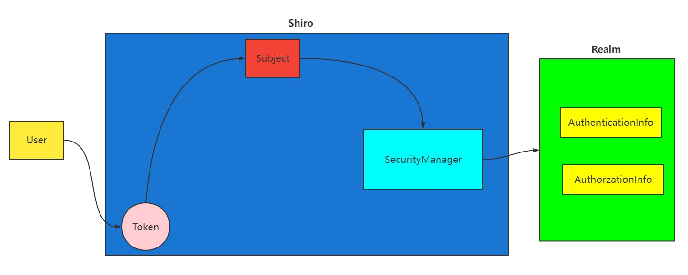

## Shiro
### 什么是Shiro
- 官网：http://shiro.apache.org/
- 是一款主流的 Java 安全框架，不依赖任何容器，可以运行在 Java SE 和 Java EE 项目中，它的主要作用是对访问系统的用户进行身份认证、授权、会话管理、加密等操作。
- Shiro就是用来解决安全管理的系统化框架。

### Shiro 核心组件
用户、角色、权限

给用户赋予角色，给角色赋予权限
1. UsernamePasswordToken，Shiro 用来封装用户登录信息，使用用户的登录信息来创建令牌 Token。
2. SecurityManager，Shiro 的核心部分，负责安全认证和授权。
3. Suject，Shiro 的一个抽象概念，包含了用户信息。
4. Realm，开发者自定义的模块，根据项目的需求，验证和授权的逻辑全部写在 Realm 中。
5. AuthenticationInfo，用户的角色信息集合，认证时使用。
6. AuthorzationInfo，角色的权限信息集合，授权时使用。
7. DefaultWebSecurityManager，安全管理器，开发者自定义的 Realm 需要注入到 DefaultWebSecurityManager 进行管理才能生效。
8. ShiroFilterFactoryBean，过滤器工厂，Shiro 的基本运行机制是开发者定制规则，Shiro 去执行，具体的执行操作就是由 ShiroFilterFactoryBean 创建的一个个 Filter 对象来完成。

### Shiro的运行机制



### 使用
1. 导入依赖
```xml
<dependency>
    <groupId>org.apache.shiro</groupId>
    <artifactId>shiro-spring</artifactId>
    <version>1.8.0</version>
</dependency>
```
2. 创建Shiro过滤器，也就是流程中的Realm
```java
public class AccoutRealm extends AuthorizingRealm {

    @Autowired
    private AccountService accountService;

    /**
     * 授权
     * @param principalCollection
     * @return
     */
    @Override
    protected AuthorizationInfo doGetAuthorizationInfo(PrincipalCollection principalCollection) {
        // 获取当前登录用户
        Subject subject = SecurityUtils.getSubject();
        Account account = (Account) subject.getPrincipal();

        // 设置角色集合，用Set集合防止重复
        Set<String> roles = new HashSet<>();
        // 从数据库中拿到角色信息加入到集合中
        roles.add(account.getRole());
        SimpleAuthorizationInfo info = new SimpleAuthorizationInfo(roles);
        
        // 从数据库中拿到权限信息加入到集合中
        info.addStringPermission(account.getParms());
        
        return info;
    }


    /**
     * 认证
     * @param authenticationToken
     * @return
     * @throws AuthenticationException
     */
    @Override
    protected AuthenticationInfo doGetAuthenticationInfo(AuthenticationToken authenticationToken) throws AuthenticationException {
        // 获取控制器传入的token信息
        UsernamePasswordToken token = (UsernamePasswordToken) authenticationToken;
        // 从数据库中查询到用户，取出用户名与token中的用户名进行对比
        Account account = accountService.findByUsername(token.getUsername());
        if(account != null){
            // 如果用户存在，则传入SimpleAuthenticationInfo进行自行的密码验证
            // 参数一：数据库查到的对象
            // 参数二：数据库中查到的密码
            // 参数三：Realm的名字，这里直接使用getName()获取当前类的名字即可
            return new SimpleAuthenticationInfo(account,account.getPassword(),getName());
        }
        return null;
    }
}
```
3. 创建Shiro配置类
```java
@Configuration
public class ShiroConfig {

    @Bean
    public ShiroFilterFactoryBean shiroFilterFactoryBean(@Qualifier("securityManager") DefaultWebSecurityManager securityManager){
        ShiroFilterFactoryBean factoryBean = new ShiroFilterFactoryBean();
        factoryBean.setSecurityManager(securityManager);

        //页面权限设置
        //1、必须登录才能访问 /main
        //2、当前用户必须拥有 manage 权限才能访问 /manage
        //3、当前用户必须拥有 admin 角色才能访问 /administrator
        Map<String,String> map = new HashMap<>();
        map.put("/main","authc");
        map.put("/manager","perms[manager]");
        map.put("/administrator","roles[admin]");
        factoryBean.setFilterChainDefinitionMap(map);

        // 设置登录页
        factoryBean.setLoginUrl("/toLogin");

        // 设置未授权页面
        factoryBean.setUnauthorizedUrl("/unauth");

        return factoryBean;
    }


    @Bean
    public DefaultWebSecurityManager securityManager(@Qualifier("accoutRealm") AccoutRealm accoutRealm){
        DefaultWebSecurityManager manager = new DefaultWebSecurityManager();
        manager.setRealm(accoutRealm);
        return manager;
    }

    @Bean
    public AccoutRealm accoutRealm(){
        return new AccoutRealm();
    }
}
```
认证授权规则:
- 认证过滤
```
anon：无需认证。
authc：必须认证。
authcBasic：需要通过 HTTPBasic 认证。
user：不一定通过认证，只要曾经被 Shiro 记录即可，比如：记住我。
```
- 授权过滤
```
perms：必须拥有某个权限才能访问。
role：必须拥有某个角色才能访问。
port：请求的端口必须是指定值才可以。
rest：请求必须基于 RESTful，POST、PUT、GET、DELETE。
ssl：必须是安全的 URL 请求，协议 HTTPS。
```
4. 编写控制器
```java
@RequestMapping(value = {"/login"})
public String login(String username, String password, Model model) {
    Subject subject = SecurityUtils.getSubject();
    UsernamePasswordToken token = new UsernamePasswordToken(username,password);

    try{
        // 调用shiro，传入token
        subject.login(token);
        return "index";
    }catch (UnknownAccountException e) {
        e.printStackTrace();
        model.addAttribute("msg","用户名错误");
        return "login";
    }catch (IncorrectCredentialsException e) {
        e.printStackTrace();
        model.addAttribute("msg","密码错误");
        return "login";
    }
}
```

### Shiro整合Thymeleaf
1. 引入依赖
```xml
<dependency>
    <groupId>com.github.theborakompanioni</groupId>
    <artifactId>thymeleaf-extras-shiro</artifactId>
    <version>2.0.0</version>
</dependency>
```
2. 在IOC容器注册
```java
@Bean
public ShiroDialect shiroDialect(){
    return new ShiroDialect();
}
```
3. 页面
```html
<!DOCTYPE html>
<html lang="en" xmlns:th="http://www.thymeleaf.org" xmlns:shiro="http://www.thymeleaf.org/thymeleaf-extras-shiro">
<head>
    <meta charset="UTF-8">
    <title>Title</title>
    <link rel="shortcut icon" href="#"/>
</head>
<body>
    <h1>index</h1>
    <div th:if="${session.account != null}">
        <span th:text="${session.account.username}+'欢迎回来！'"></span><a href="/logout">退出</a>
    </div>
    <a href="/main">main</a> <br/>
    <div shiro:hasPermission="manage">
        <a href="manage">manage</a> <br/>
    </div>
    <div shiro:hasRole="administrator">
        <a href="/administrator">administrator</a>
    </div>
</body>
</html>
```

## Swagger
### 简单上手
1. 引入依赖
```xml
<dependency>
    <groupId>io.springfox</groupId>
    <artifactId>springfox-boot-starter</artifactId>
    <version>3.0.0</version>
</dependency>
```
2. 启动程序，访问[http://localhost:8080/swagger-ui/index.html](http://localhost:8080/swagger-ui/index.html)
3. 自定义文档信息
```java
// 自定义swagger3文档信息
@Configuration
@ConditionalOnProperty(value = "springfox.documentation.enabled", havingValue = "true", matchIfMissing = true)
public class Swagger3Config {
    @Bean
    public Docket createRestApi() {
        return new Docket(DocumentationType.OAS_30)
                .apiInfo(apiInfo())
                .select()
                .apis(RequestHandlerSelectors.withMethodAnnotation(ApiOperation.class))
                .paths(PathSelectors.any())
                .build();
    }

    private ApiInfo apiInfo() {
        return new ApiInfoBuilder()
                .title("这是标题")
                .description("这是链接")
                .contact(new Contact("JohnCena", "https://jcxiaozhan.gitee.io", "349636607@qq.com"))
                .version("1.0.0")
                .build();
    }
}
```

### 分组：配置多个Docket即可
```java
@Bean
public Docket docket1(){
   return new Docket(DocumentationType.SWAGGER_2).groupName("group1");
}
@Bean
public Docket docket2(){
   return new Docket(DocumentationType.SWAGGER_2).groupName("group2");
}
@Bean
public Docket docket3(){
   return new Docket(DocumentationType.SWAGGER_2).groupName("group3");
}
```

### 常用注解
```java
// 作用在模块类上
@Api(tags = "xxx模块说明")

// 作用在接口方法上
@ApiOperation("xxx接口说明")

// 作用在模型类上：如VO、BO
@ApiModel("xxxPOJO说明")

// 作用在类方法和属性上，hidden设置为true可以隐藏该属性
@ApiModelProperty(value = "xxx属性说明",hidden = true)

// 作用在参数、方法和字段上，类似@ApiModelProperty
@ApiParam("xxx参数说明")
```

## 任务
### 异步任务
一些功能在执行的时候想不让服务器阻塞，就要用到异步任务，比如邮件发送，下面模拟一个简单的异步任务
1. 在启动类开启异步支持
```java
@SpringBootApplication
@EnableAsync // 开启异步
public class SpringbootStudy2Application {
    public static void main(String[] args) {
        SpringApplication.run(SpringbootStudy2Application.class, args);
    }
}
```
2. 业务类
```java
@Service
public class AsyncService {
    @Async // 标注这是一个异步处理方法，执行过程就不会阻塞
    public void test() {
        try {
            // 线程睡眠3秒，模拟邮件发送过程
            System.out.println("邮件发送中");
            Thread.sleep(3000);
        } catch (InterruptedException e) {
            e.printStackTrace();
        }
    }
}
```
3. 控制类
```java
@RequestMapping("/sync")
@ResponseBody
public String sync() {
    asyncService.test();
    return "发送成功";
}
```
最后们可以看到，用户访问接口，页面立即显示发送成功，后台任务还在执行中，不会引起阻塞

### 邮件任务
1. 导入依赖
```xml
<dependency>
   <groupId>org.springframework.boot</groupId>
   <artifactId>spring-boot-starter-mail</artifactId>
</dependency>
```
2. 添加配置
```yml
spring:
  mail:
    username: 349636607@qq.com
    password: idfehdptoqvibicd
    host: smtp.qq.com
```
3. 编写测试类
```java
@Autowired
JavaMailSenderImpl mailSender;

@Test
public void contextLoads() {
    //邮件设置1：一个简单的邮件
    SimpleMailMessage message = new SimpleMailMessage();
    message.setSubject("通知-明天来狂神这听课");
    message.setText("今晚7:30开会");

    message.setTo("2036786419@qq.com");
    message.setFrom("349636607@qq.com");
    mailSender.send(message);
}

@Test
public void contextLoads2() throws MessagingException {
    //邮件设置2：一个复杂的邮件
    MimeMessage mimeMessage = mailSender.createMimeMessage();
    MimeMessageHelper helper = new MimeMessageHelper(mimeMessage, true);

    helper.setSubject("通知-明天来狂神这听课");
    helper.setText("<b style='color:red'>今天 7:30来开会</b>",true);

    //发送附件
    helper.addAttachment("1.jpg",new File(""));
    helper.addAttachment("2.jpg",new File(""));

    helper.setTo("24736743@qq.com");
    helper.setFrom("24736743@qq.com");

    mailSender.send(mimeMessage);
}
```

### 定时任务
1. 在启动类上开启定时任务的支持
```java
@EnableScheduling //开启定时任务支持
@SpringBootApplication
public class SpringbootTaskApplication {
   public static void main(String[] args) {
       SpringApplication.run(SpringbootTaskApplication.class, args);
  }
}
```
2. 注解填写cron表达式，达到定时执行函数的效果
```java
@Service
public class ScheduledService {
   
   //秒   分   时     日   月   周几
   //0 * * * * MON-FRI
   //注意cron表达式的用法；
   @Scheduled(cron = "0 * * * * 0-7")
   public void hello(){
       System.out.println("hello.....");
  }
}
```
cron表达式详解：[http://www.bejson.com/othertools/cron/](http://www.bejson.com/othertools/cron/)

## ------------------------------------------------

## Hibernate

实体类中注解主键自增

```java
@id
@GeneratedValue(strategy = GenerationType.IDENTITY)
```

配置文件

```
配置Hibernate的对应命名规则
spring.jpa.hibernate.naming.physical-strategy=org.hibernate.boot.model.naming.PhysicalNamingStrategyStandardImpl

根据实体类自动创建表
spring.jpa.hibernate.ddl-auto=update

ddl-auto：create ----每次运行该程序，没有表格会新建表格，表内有数据会清空；
ddl-auto：create-drop ----每次程序结束的时候会清空表
ddl-auto：update ---- 每次运行程序，没有表格会新建表格，表内有数据不会清空，只会更新
ddl-auto： validate ---- 运行程序会校验数据与数据库的字段类型是否相同，不同会报错。

显示执行的sql语句
spring.jpa.show-sql=true
```

## 日志

简单使用(slf4j)

```java
private Logger logger = LoggerFactory.getLogger(getClass());
logger.info("Hello World");
```

配置

```properties
logging.level.root=warn  //整体隔离等级为warn(只有warn信息打印)
logging.level.cn.com.scitc.webapp3.*=info  //项目隔离等级为info(项目下info及其以上等级的日志会打印)
```

## SpringDataJPA使用druid数据源

1. 新建项目
   JAP+Mysql

2. pom.xml

```xml
<dependency>
    <groupId>org.springframework.boot</groupId>
    <artifactId>spring-boot-starter-data-jpa</artifactId>
</dependency>
<dependency>
    <groupId>org.springframework.boot</groupId>
    <artifactId>spring-boot-starter-web</artifactId>
</dependency>
<dependency>
    <groupId>org.springframework.boot</groupId>
    <artifactId>spring-boot-devtools</artifactId>
    <scope>runtime</scope>
    <optional>true</optional>
</dependency>
<dependency>
    <groupId>mysql</groupId>
    <artifactId>mysql-connector-java</artifactId>
</dependency>
<dependency>
    <groupId>log4j</groupId>
    <artifactId>log4j</artifactId>
    <version>1.2.17</version>
</dependency>
<!--引入druid依赖-->
<dependency>
    <groupId>com.alibaba</groupId>
    <artifactId>druid</artifactId>
    <version>1.0.31</version>
</dependency>
<dependency>
    <groupId>org.springframework.boot</groupId>
    <artifactId>spring-boot-starter-test</artifactId>
    <scope>test</scope>
</dependency>
```

3. 添加配置类

```java
package cn.com.scitc.webapp3.config;


import com.alibaba.druid.pool.DruidDataSource;
import com.alibaba.druid.support.http.StatViewServlet;
import com.alibaba.druid.support.http.WebStatFilter;
import org.springframework.beans.factory.annotation.Value;
import org.springframework.boot.web.servlet.FilterRegistrationBean;
import org.springframework.boot.web.servlet.ServletRegistrationBean;
import org.springframework.context.annotation.Bean;
import org.springframework.context.annotation.Configuration;
import org.springframework.context.annotation.Primary;

import javax.sql.DataSource;
import java.sql.SQLException;

@Configuration
public class DruidConfiguration {
    @Value("${spring.datasource.url}")
    private String dbUrl;
    @Value("${spring.datasource.username}")
    private String username;
    @Value("${spring.datasource.password}")
    private String password;
    @Value("${spring.datasource.driver-class-name}")
    private String driverClassName;
    @Value("${spring.datasource.initialSize}")
    private int initialSize;
    @Value("${spring.datasource.minIdle}")
    private int minIdle;
    @Value("${spring.datasource.maxActive}")
    private int maxActive;
    @Value("${spring.datasource.maxWait}")
    private int maxWait;
    @Value("${spring.datasource.timeBetweenEvictionRunsMillis}")
    private int timeBetweenEvictionRunsMillis;
    @Value("${spring.datasource.minEvictableIdleTimeMillis}")
    private int minEvictableIdleTimeMillis;
    @Value("${spring.datasource.validationQuery}")
    private String validationQuery;
    @Value("${spring.datasource.testWhileIdle}")
    private boolean testWhileIdle;
    @Value("${spring.datasource.testOnBorrow}")
    private boolean testOnBorrow;
    @Value("${spring.datasource.testOnReturn}")
    private boolean testOnReturn;
    @Value("${spring.datasource.poolPreparedStatements}")
    private boolean poolPreparedStatements;
    @Value("${spring.datasource.maxPoolPreparedStatementPerConnectionSize}")
    private int maxPoolPreparedStatementPerConnectionSize;
    @Value("${spring.datasource.filters}")
    private String filters;
    @Value("${spring.datasource.connectionProperties}")
    private String connectionProperties;
    @Value("${spring.datasource.useGlobalDataSourceStat}")
    private boolean useGlobalDataSourceStat;

    @Bean
    public ServletRegistrationBean druidStatViewServlet() {
        ServletRegistrationBean registrationBean = new ServletRegistrationBean(new StatViewServlet(), "/druid/*");
        registrationBean.addInitParameter("allow", "127.0.0.1");
        registrationBean.addInitParameter("deny", "192.168.100.106");
        registrationBean.addInitParameter("loginUsername", "admin");
        registrationBean.addInitParameter("loginPassword", "123456");
        registrationBean.addInitParameter("resetEnable", "false");

        return registrationBean;
    }

    @Bean
    public FilterRegistrationBean druidWebStatViewFilter() {
        FilterRegistrationBean registrationBean = new FilterRegistrationBean(new WebStatFilter());
        registrationBean.addInitParameter("urlPatterns", "/*");
        registrationBean.addInitParameter("exclusions", "*.js,*.gif,*.jpg,*.bmp,*.png,*.css,*.ico,/druid/*");

        return registrationBean;

    }

    @Bean     //声明其为Bean实例
    @Primary  //在同样的DataSource中，首先使用被标注的DataSource
    public DataSource dataSource(){
        DruidDataSource datasource = new DruidDataSource();
        datasource.setUrl(this.dbUrl);
        datasource.setUsername(username);
        datasource.setPassword(password);
        datasource.setDriverClassName(driverClassName);

        //configuration
        datasource.setInitialSize(initialSize);
        datasource.setMinIdle(minIdle);
        datasource.setMaxActive(maxActive);
        datasource.setMaxWait(maxWait);
        datasource.setTimeBetweenEvictionRunsMillis(timeBetweenEvictionRunsMillis);
        datasource.setMinEvictableIdleTimeMillis(minEvictableIdleTimeMillis);
        datasource.setValidationQuery(validationQuery);
        datasource.setTestWhileIdle(testWhileIdle);
        datasource.setTestOnBorrow(testOnBorrow);
        datasource.setTestOnReturn(testOnReturn);
        datasource.setPoolPreparedStatements(poolPreparedStatements);
        datasource.setMaxPoolPreparedStatementPerConnectionSize(maxPoolPreparedStatementPerConnectionSize);
        datasource.setUseGlobalDataSourceStat(useGlobalDataSourceStat);
        try {
            datasource.setFilters(filters);
        } catch (SQLException e) {
            System.err.println("druid configuration initialization filter: "+ e);
        }
        datasource.setConnectionProperties(connectionProperties);
        return datasource;
    }
}
```

4. 修改springboot配置文件

```properties
spring.datasource.url=jdbc:mysql://localhost:3306/webapp1901
spring.datasource.driver-class-name=com.mysql.cj.jdbc.Driver
spring.datasource.username=root
spring.datasource.password=lishuang001219

spring.jpa.hibernate.naming.physical-strategy=org.hibernate.boot.model.naming.PhysicalNamingStrategyStandardImpl
spring.jpa.hibernate.ddl-auto=update
spring.jpa.show-sql=true

logging.level.root=warn
logging.level.cn.com.scitc.webapp3.*=info

##########################  druid配置   ##########################
spring.datasource.type=com.alibaba.druid.pool.DruidDataSource
#最大活跃数
spring.datasource.maxActive=20
#初始化数量
spring.datasource.initialSize=5
#最小活跃数
spring.datasource.minIdle=5
#配置超时等待时间
spring.datasource.maxWait=60000
#配置间隔多久才进行一次检测，检测需要关闭的空闲连接，单位是毫秒
spring.datasource.timeBetweenEvictionRunsMillis=60000
#配置一个连接在池中最小生存的时间，单位是毫秒
spring.datasource.minEvictableIdleTimeMillis=300000
spring.datasource.validationQuery=SELECT 1 FROM t_user
spring.datasource.testWhileIdle=true
spring.datasource.testOnBorrow=false
spring.datasource.exceptionSorter=true
spring.datasource.testOnReturn=false
#打开PSCache，并且指定每个连接上PSCache的大小
spring.datasource.poolPreparedStatements=true
spring.datasource.maxPoolPreparedStatementPerConnectionSize=20
#配置监控统计拦截的filters，去掉后监控界面sql无法统计，'wall'用于防火墙
spring.datasource.filters=stat,wall,log4j
#通过connectProperties属性来打开mergeSql功能；慢SQL记录
spring.datasource.connectionProperties=druid.stat.mergeSql=true;druid.stat.slowSqlMillis=500
#合并多个DruidDataSource的监控数据
spring.datasource.useGlobalDataSourceStat=true
```

6. 添加log4j配置文件

```properties
log4j.rootLogger=DEBUG, stdout
log4j.appender.stdout=org.apache.log4j.ConsoleAppender
log4j.appender.stdout.layout=org.apache.log4j.PatternLayout
log4j.appender.stdout.layout.ConversionPattern=%5p [%t] - %m%n
```


