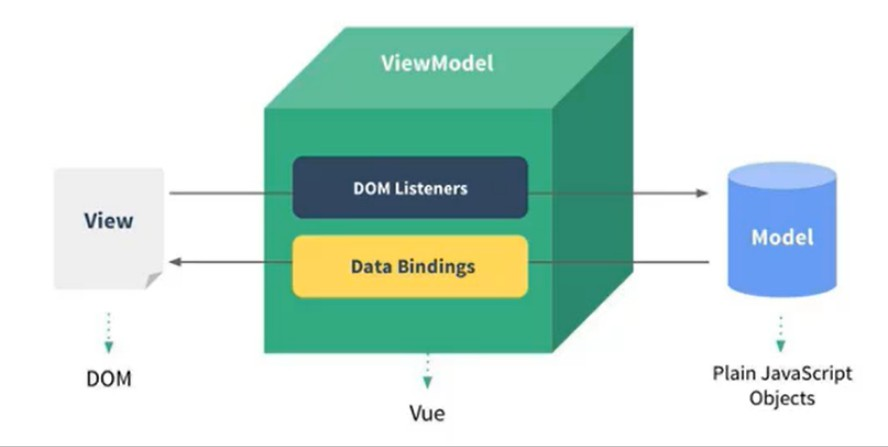
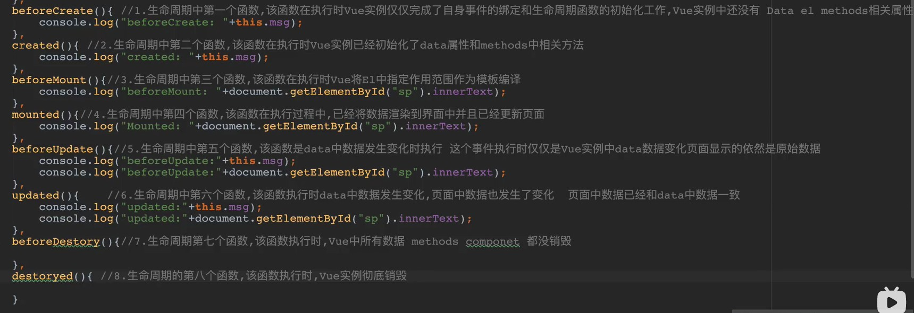

## MVVM



### View层
- 视图层
- 在我们前端开发中，通常就是DOM层
- 主要的作用是给用户展示各种信息

#### Model层
- 数据层
- 数据可能是我们固定的死数据，更多的是来自我们服务器，从网络上请求下来的数据
- 在我们计数器的案例中，就是后面抽取出来的obj，当然，里面的数据可能没有这么简单

### ViewModel层
- 视图模型层
- 视图模型层是View和 Model沟通的桥梁
- 一方面它实现了Data Binding，也就是数据绑定，将Model的改变实时的反应到View中
- 另一方面它实现了DOM Listener，也就是DOM监听，当DOM发生一些事件(点击、滚动、 touch等)时，可以监听
到，并在需要的情况下改变对应的Data

## 向Vue实例传入的options
所有选项：[https://cn.vuejs.org/v2/api/](https://cn.vuejs.org/v2/api/)

三个常用选项
- el:
    类型：string | HTMLElement
    作用：指定Vue实例接管的DOM
- data:
    类型：Object | Function(在vue组件中data必须是一个函数)
    作用：Vue实例对应的数据对象
- methods:
    类型：Function
    作用：定义属于Vue的一些方法，可以在其他地方调用

## 生命周期



## 基础语法
> v-once

该指令表示元素和组件只渲染一次，不会随着数据的改变而改变
```html
<h2 v-once>{{msg}}</h2>

data: {
    msg: '你好'
}
```

> v-html

该指令在渲染页面时，如果数据是一个html标签，会对其进行解析
```html
<h2 v-html="url"></h2>

data: {
    url: '<a href="www.baidu.com">百度</a>'
}
```

> v-text

该指令在渲染页面时，如果数据是一个html标签，不会对其进行解析，会原封不动以字符串的形式渲染到页面上
```html
<h2 v-html="url"></h2>

data: {
    url: '<a href="www.baidu.com">百度</a>'
}
```

> v-pre

该指令使标签不进行数据绑定，按照原格式输出到页面
```html
<h2 v-pre>{{msg}}</h2>

data: {
    msg: '你好'
}
```

> v-bind

该指令用于动态绑定属性值，属性值由data里面的变量来赋予
```html
<a v-bind:href="url">淘宝</a>
<!-- 简写 -->
<a :href="url2">百度一下</a>

data: {
    url: 'https://www.taobao.com/',
    url2: 'www.baidu.com'
},
```
可以用该指令来动态地控制class属性
```html
<!-- 通过data动态控制class，如果class原本定义了值，会进行合并 -->
<h2 class="demo" :class="{active: isActive, line: isLine}">{{msg}}</h2>

data: {
    msg: '你好',
    isActive: true,
    isLine: true
}
```

## 计算属性
当多个属性值需要处理之后再展示到页面上的时候，推荐使用计算属性，计算属性有缓存机制，比方法好一些
```html
<div id='app'>
    {{fullName}}
</div>

data: {
    msg: '你好',
    firstName: '张',
    lastName: '三'
}

computed: {
    fullName() {
        return this.firstName + ' ' + this.lastName;
    }
}
```

## vue是什么
vue是前端的一种开发框架，它主要解决前端开发中的核心痛点——复杂的DOM操作

## vue的特点
- 渐进式
- 组件化
- 响应式

## 环境搭建
1. 安装node.js
2. 下载淘宝镜像源代替npm
```
npm install -g cnpm -registry=https://registry.npm.taobao.org
```
3. 下载vue脚手架
```
卸载
cnpm uninstall --global vue-cli

2.x版本
cnpm install --global vue-cli

3.x版本
cnpm install --global @vue/cli
```
4. 创建项目
```
vue init webpack 项目名称(不可中文，不可大写)

创建过程报错
Ctrl+C结束任务，切换到项目目录内
执行如下命令
cnpm install
```
5. 运行项目
```
npm start
```

## 第一个vue程序
```html
<script src="https://cdn.jsdelivr.net/npm/vue"></script>
<body>
<div id="app">
    <!-- 插值语法 -->
  <p>{{ message }}</p>
    <!-- 指令语法 -->
  <p v-text="message"></p>
</div>

<script>
new Vue({
    // el用于指定当前Vue实例为哪个容器服务，值通常为css选择器字符串
  el: '#app',
    //data中用于存储数据，数据供el所指定的容器去使用
  data: {
    message: 'Hello Vue.js!'
  }
})
</script>
</body>
```

## Vue模板语法有两大类
1. 插值语法
    功能：用于解析标签体内容。
    写法：{{xxx}}，xxx是js表达式，且可以直接读取到data中的所有属性。
2. 指令语法
    功能：用于解析标签（包括：标签属性、标签体内容、绑定事件.....）。
    举例：v-bind:href="xxx" 或  简写为 :href="xxx"，xxx同样要写js表达式，
        且可以直接读取到data中的所有属性。
    备注：Vue中有很多的指令，且形式都是：v-????，此处我们只是拿v-bind举个例子。

## 指令
v-text：用于解析便标签内容
```html
<!-- 插值语法 -->
<p>{{ message }}</p>
<!-- 指令语法 -->
<p v-text="message"></p>
<!-- 还可以是使用字符串的拼接 -->
<p v-text="message + '!!!'"></p>
```

v-html：用于存放内容为html标签的情况下
```html
<p v-html="message"></p>
```

v-on：用于事件触发
```html
<!-- 完整 -->
<input type="button" value="单击" v-on:dblclick="dolt">
<!-- 简写 -->
<input type="button" value="单击" @click="dolt">
<!-- 调用带参函数，第一个值传一个事件对象进去，后续再传入自定义的值 -->
<input type="button" value="单击" @click="dolt($event,a,b)">
```

v-show：布尔值判断，如果为true就显示为false就隐藏，本质是为元素加上一个display:none的css属性
```html
<!-- 法一：直接使用布尔值 -->

<!-- 法二：使用data中存放的布尔值 -->

<!-- 法三：通过判断得到布尔值 -->
=18">
```

v-if：布尔值判断，如果为true就显示为false就隐藏，本质是在DOM树上直接增加或者删除元素，v-if可以和:v-else-if、v-else一起使用，但要求结构不能被“打断”
```html
<!-- 法一：直接使用布尔值 -->

<!-- 法二：使用data中存放的布尔值 -->

<!-- 法三：通过判断得到布尔值 -->
=18">

<div v-if="n === 1">Angular</div>
<div v-else-if="n === 2">React</div>
<div v-else-if="n === 3">Vue</div>
<div v-else>哈哈</div>

<!-- v-if与template的配合使用，好处是渲染之后的DOM结构中不会存在template标签 -->
<template v-if="n === 1">
  <h2>你好</h2>
  <h2>尚硅谷</h2>
  <h2>北京</h2>
</template>
```

v-for：用于展示列表数据，可遍历：数组、对象、字符串（用的很少）、指定次数（用的很少）
```html
<!-- 准备好一个容器-->
<div id="root">
  <!-- 遍历数组 -->
  <h2>人员列表（遍历数组）</h2>
  <ul>
    <li v-for="(p,index) of persons" :key="index">
      {{p.name}}-{{p.age}}
    </li>
  </ul>

  <!-- 遍历对象 -->
  <h2>汽车信息（遍历对象）</h2>
  <ul>
    <li v-for="(value,k) of car" :key="k">
      {{k}}-{{value}}
    </li>
  </ul>

  <!-- 遍历字符串 -->
  <h2>测试遍历字符串（用得少）</h2>
  <ul>
    <li v-for="(char,index) of str" :key="index">
      {{char}}-{{index}}
    </li>
  </ul>
  
  <!-- 遍历指定次数 -->
  <h2>测试遍历指定次数（用得少）</h2>
  <ul>
    <li v-for="(number,index) of 5" :key="index">
      {{index}}-{{number}}
    </li>
  </ul>
</div>

<script type="text/javascript">
  new Vue({
    el:'#root',
    data:{
      persons:[
        {id:'001',name:'张三',age:18},
        {id:'002',name:'李四',age:19},
        {id:'003',name:'王五',age:20}
      ],
      car:{
        name:'奥迪A8',
        price:'70万',
        color:'黑色'
      },
      str:'hello'
    }
  })
</script>
```

v-bind：v-bind用于数据绑定，将data中的值绑定到属性中
```html
<!-- 完整 -->

<!-- 简写 -->

```

v-model：用于表单元素的双向数据绑定(表单值改变会同步到data中，data中值改变会同步到表单中)
```html
<!-- 完整 -->
<input type="text" v-model:value="message">
<!-- 简写 -->
<input type="text" v-model="message">
```

## el的两种写法
```javascript
const v = new Vue({
  //第一种写法(实例化时自动挂载)
  el:'#root', 
  data:{
    name:'李爽'
  }
})
		
//第二种写法(手动控制挂载)
v.$mount('#root')
```

## data的两种写法
```javascript
// 对象式
new Vue({
  data:{
    name:'李爽'
  }
})

// 函数式
new Vue({
  data(){
    return: {
      name:'李爽'
    }
  }
})
```

## Object.defineproperty
```javascript
let number = 18
let person = {
  name:'张三',
  sex:'男',
}

Object.defineProperty(person,'age',{
  // value:18,
  // enumerable:true, //控制属性是否可以枚举，默认值是false
  // writable:true, //控制属性是否可以被修改，默认值是false
  // configurable:true //控制属性是否可以被删除，默认值是false

  //当有人读取person的age属性时，get函数(getter)就会被调用，且返回值就是age的值
  get(){
    console.log('有人读取age属性了')
    return number
  },

  //当有人修改person的age属性时，set函数(setter)就会被调用，且会收到修改的具体值
  set(value){
    console.log('有人修改了age属性，且值是',value)
    number = value
  }

})
```

## 事件修饰符
- 常用
stop：阻止冒泡
prevent：阻止默认行为
self：只监听自己触发的事件，不关心事件冒泡带来的事件
once：只执行一次特定事件

- 不常用
capture：使用事件的捕获模式
passive：事件的默认行为立即执行，无需等待事件回调执行完毕

事件修饰符可以连续使用
```html
<!-- 例如同时阻止事件默认行为和冒泡行为 -->
<a type="button" value="单击" @click.stop.prevent="dolt">点我弹窗</a>
```
## 键盘事件
Vue中常用的按键别名
```
回车 => enter
删除 => delete (捕获“删除”和“退格”键)
退出 => esc
空格 => space
换行 => tab (特殊，必须配合keydown去使用)
上 => up
下 => down
左 => left
右 => right
```1
系统修饰键（用法特殊）：ctrl、alt、shift、meta
```
配合keyup使用：按下修饰键的同时，再按下其他键，随后释放其他键，事件才被触发
配合keydown使用：正常触发事件
```
键盘事件可以拼接，代表组合按键
```html
<input type="text" @keyup.ctrl.y="demo">
```

## 计算属性
1.定义：要用的属性不存在，要通过已有属性计算得来。
2.原理：底层借助了Objcet.defineproperty方法提供的getter和setter。
3.get函数什么时候执行？
  - 初次读取时会执行一次。
  - 当依赖的数据发生改变时会被再次调用。

4.优势：与methods实现相比，内部有缓存机制（复用），效率更高，调试方便。
```javascript
new Vue({
  el: '#app',
  data: {
    firstName:'张',
    lastName:'三',
  },
  computed:{
    fullName:{
      //get有什么作用？当有人读取fullName时，get就会被调用，且返回值就作为fullName的值
      //get什么时候调用？1.初次读取fullName时。2.所依赖的数据发生变化时。
      get(){
        console.log('get被调用了');
        // console.log(this) //此处的this是vm
        return this.firstName + '-' + this.lastName
      },
      //set什么时候调用? 当fullName被修改时。
      set(value){
        console.log('set',value);
        const arr = value.split('-');
        this.firstName = arr[0];
        this.lastName = arr[1];
      }
    }
  }
})
```
一般情况下，计算属性是只读取不修改的(无set方法)，此情况下可以简写
```javascript
computed:{
  fullName(){
      console.log('get被调用了');
      return this.firstName + '-' + this.lastName
  }
}
```

## 监视属性
监视属性watch
1. 当被监视的属性变化时, 回调函数自动调用, 进行相关操作
2. 监视的属性必须存在，才能进行监视
3. 监视的两种写法：
- new Vue时传入watch配置
```javascript
new Vue({
  el:'#root',
  data:{
    isHot:true,
  },
  computed:{
    info(){
      return this.isHot ? '炎热' : '凉爽'
    }
  },
  methods: {
    changeWeather(){
      this.isHot = !this.isHot
    }
  },
  watch:{
    isHot:{
      immediate:true, //初始化时让handler调用一下
      //handler什么时候调用？当isHot发生改变时。
      handler(newValue,oldValue){
        console.log('isHot被修改了',newValue,oldValue);
      }
    }
  }
})
```
- 通过vm.$watch监视
```javascript
const vm = new Vue({
  el:'#root',
  data:{
    isHot:true,
  },
  computed:{
    info(){
      return this.isHot ? '炎热' : '凉爽'
    }
  },
  methods: {
    changeWeather(){
      this.isHot = !this.isHot
    }
  }
})

vm.$watch('isHot',{
  immediate:true, //初始化时让handler调用一下
  //handler什么时候调用？当isHot发生改变时。
  handler(newValue,oldValue){
    console.log('isHot被修改了',newValue,oldValue)
  }
})
```
深度监视
1. Vue中的watch默认不监测对象内部值的改变（一层）
2. 配置deep:true可以监测对象内部值改变（多层）
3. Vue自身可以监测对象内部值的改变，但Vue提供的watch默认不可以
4. 使用watch时根据数据的具体结构，决定是否采用深度监视
```javascript
watch:{
  isHot:{
    // immediate:true, //初始化时让handler调用一下
    //handler什么时候调用？当isHot发生改变时。
    handler(newValue,oldValue){
      console.log('isHot被修改了',newValue,oldValue)
    }
  },
  //监视多级结构中某个属性的变化
  /* 'numbers.a':{
    handler(){
      console.log('a被改变了')
    }
  } */
  //监视多级结构中所有属性的变化
  numbers:{
    deep:true,
    handler(){
      console.log('numbers改变了')
    }
  }
}
```
在不需要immediate和deep属性的情况下，可以简写监听属性
```javascript
const vm = new Vue({
  el:'#root',
  data:{
    isHot:true,
  },
  computed:{
    info(){
      return this.isHot ? '炎热' : '凉爽'
    }
  },
  methods: {
    changeWeather(){
      this.isHot = !this.isHot
    }
  },
  watch:{
    isHot(newValue,oldValue){
      console.log('isHot被修改了',newValue,oldValue,this)
    }
  }
})

vm.$watch('isHot',(newValue,oldValue)=>{
  console.log('isHot被修改了',newValue,oldValue,this)
})
```

## 绑定样式
```html
<!-- 准备好一个容器-->
<div id="root">
  <!-- 绑定class样式--字符串写法，适用于：样式的类名不确定，需要动态指定 -->
  <div class="basic" :class="mood" @click="changeMood">{{name}}</div> <br/><br/>

  <!-- 绑定class样式--数组写法，适用于：要绑定的样式个数不确定、名字也不确定 -->
  <div class="basic" :class="classArr">{{name}}</div> <br/><br/>

  <!-- 绑定class样式--对象写法，适用于：要绑定的样式个数确定、名字也确定，但要动态决定用不用 -->
  <div class="basic" :class="classObj">{{name}}</div> <br/><br/>

  <!-- 绑定style样式--对象写法 -->
  <div class="basic" :style="styleObj">{{name}}</div> <br/><br/>
  <!-- 绑定style样式--数组写法 -->
  <div class="basic" :style="styleArr">{{name}}</div>
</div>

<script type="text/javascript">
		new Vue({
			el:'#root',
			data:{
				name:'尚硅谷',
				mood:'normal',
				classArr:['atguigu1','atguigu2','atguigu3'],
				classObj:{
					atguigu1:false,
					atguigu2:false,
				},
				styleObj:{
					fontSize: '40px',
					color:'red',
				},
				styleObj2:{
					backgroundColor:'orange'
				},
				styleArr:[
					{
						fontSize: '40px',
						color:'blue',
					},
					{
						backgroundColor:'gray'
					}
				]
			}
		})
</script>
```

## computed和watch之间的区别
1. computed能完成的功能，watch都可以完成
2. watch能完成的功能，computed不一定能完成，例如：watch可以进行异步操作

```markdown
两个原则：
- 所被Vue管理的函数，最好写成普通函数，这样this的指向才是vm 或 组件实例对象
- 所有不被Vue所管理的函数（定时器的回调函数、ajax的回调函数等、Promise的回调函数），最好写成箭头函数，这样this的指向才是vm 或 组件实例对象
```

## 模糊搜索
```javascript
//用watch实现 
/* new Vue({
  el:'#root',
  data:{
    keyWord:'',
    persons:[
      {id:'001',name:'马冬梅',age:19,sex:'女'},
      {id:'002',name:'周冬雨',age:20,sex:'女'},
      {id:'003',name:'周杰伦',age:21,sex:'男'},
      {id:'004',name:'温兆伦',age:22,sex:'男'}
    ],
    filPerons:[]
  },
  watch:{
    keyWord:{
      immediate:true,
      handler(val){
        this.filPerons = this.persons.filter((p)=>{
          return p.name.indexOf(val) !== -1
        })
      }
    }
  }
}) */

//用computed实现
new Vue({
  el:'#root',
  data:{
    keyWord:'',
    persons:[
      {id:'001',name:'马冬梅',age:19,sex:'女'},
      {id:'002',name:'周冬雨',age:20,sex:'女'},
      {id:'003',name:'周杰伦',age:21,sex:'男'},
      {id:'004',name:'温兆伦',age:22,sex:'男'}
    ]
  },
  computed:{
    filPerons(){
      return this.persons.filter((p)=>{
        return p.name.indexOf(this.keyWord) !== -1
      })
    }
  }
})
```

## VueCli开发项目的方式
```
一切皆组件，组件是以.vue结尾的文件，其中的内容由js代码，html代码，css代码组成

1.VueCli开发方式是在项目中开发一个一个组件对应一个业务功能模块，日后可以将多个组件组合到一起形成一个前端系统

2.日后在使用vue Cli进行开发时不再书写html文件,编写的是一个个组件(组件后缀，vue结尾的文件)，日后打包时vue cli会将组件编译成运行的html文件
```

## Vue Cli中引入Axios异步
1. 下载axios
```
cnpm install axios --save-dev
```
2. 在main.js中引入axios
```javascript
import axios from 'axios'
```
3. main.js中添加语句
```javascript
Vue.prototype.$http=axios
```

## Axios请求
```javascript
this.$http.get("https://api.vvhan.com/api/ian").then((res)=>{

});
```

## Axios并发请求
```javascript
axios.add([axios.get(""),axios.post("",{})]).then(){
  axios.spread(function(res1,res2){

  })
}
```

## 路由
1. 在index.js中引入Vue组件
```javascript
import HelloWorld from '../components/HelloWorld'
```
2. 在index.js配置项中添加
```javascript
{path: '/',name: 'HelloWorld',component: HelloWorld} //name可选，不重要
```
3. 在Vue组件中添加标签来使用路由
```html
<!-- 专用标签 -->
<router-link to="/foo">foo</router-link>
<!-- a标签 -->
<a href="#/page2">page2</a>
```

## 子路由
1. 在index.js中引入Vue组件
```javascript
import Page2 from "../components/Page2"
import Page2Child from "../components/Page2Child"
```
2. 在index.js配置项中添加
```javascript
{
  path: '/page2',
  component: Page2,
  // 子页面
  children:[
    {path: 'child',component: Page2Child}
  ]
}
```
3. 在Vue组件中添加标签来使用路由
```html
<!-- 专用标签 -->
<router-link to="/page2/child">子页面</router-link>

<!-- a标签 -->
<a href="#/page2/child">子页面</a>
```

## Vue Cli中引入ElementUI
1. 下载
```
cnpm i element-ui -S
```
2. 在main.js中引入
```javascript
import ElementUI from 'element-ui';
import 'element-ui/lib/theme-chalk/index.css';
```
3. 在main.js中添加语句
```javascript
Vue.use(ElementUI)
```

## Vue与Springboot项目的整合
1. Vue项目打包
```
npm run build
```
2. 打包会的到一个dist文件夹，将dist文件内的东西(一个文件夹+一个index.html文件)复制到Springboot项目下的resources/static中，完成整合
