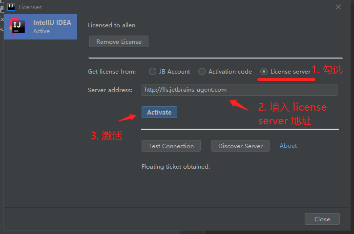
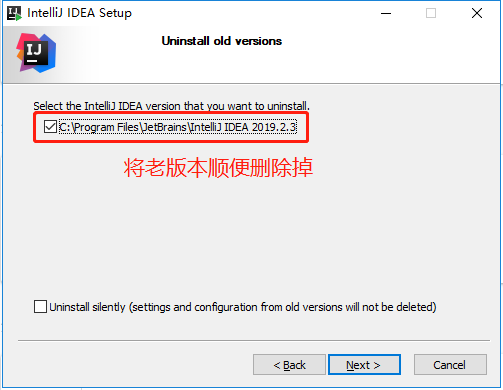
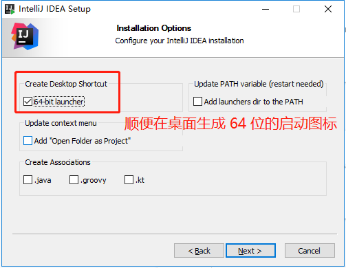
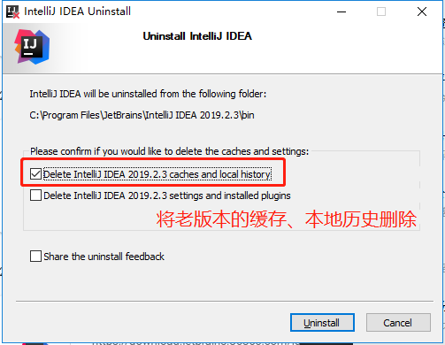
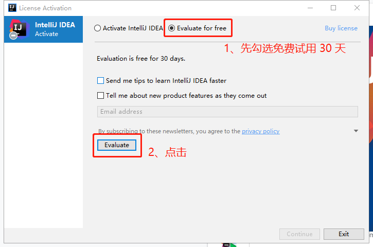
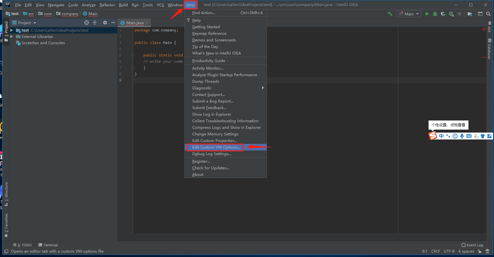
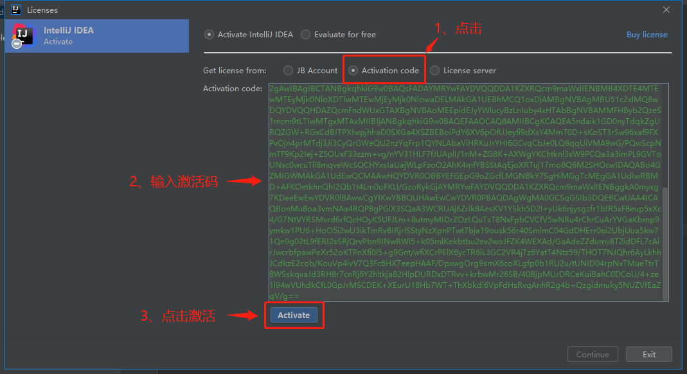
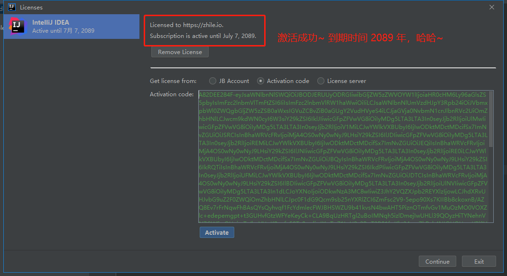
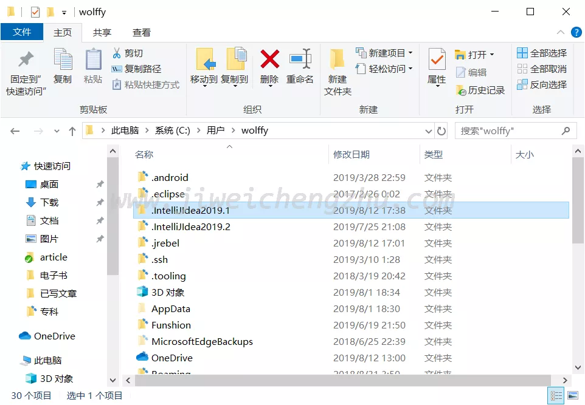
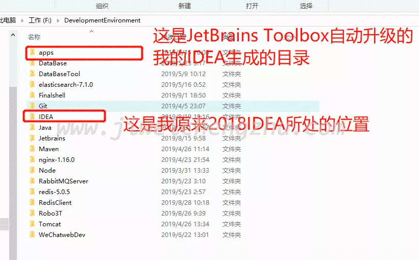

开启更多功能，提升办公效能

**申明：本教程 IntelliJ IDEA 破解补丁、激活码均收集于网络，请勿商用，仅供个人学习使用，如有侵权，请联系作者删除。**

**IDEA 最新破解补丁&激活码压缩包网盘地址：**

链接: https://pan.baidu.com/s/1PXbWw1ZfOx010FGRp0jNag 

提取码: c5xx

注意：偶尔会百度网盘抽风，出现**失效**或者**提取码错误**的情况，**刷新再试几次**，若真的失效了，不妨后台告知我，我看到后会及时更新，感谢~

PS: 破解教程请以本文为主，这篇文章会及时更新，别的地方可能是老的教程，请详细阅读以下内容~

PS: 破解教程请以本文为主，这篇文章会及时更新，别的地方可能是老的教程，请详细阅读以下内容~

PS: 破解教程请以本文为主，这篇文章会及时更新，别的地方可能是老的教程，请详细阅读以下内容~

============== 2020年4月12日更新

2020版本的IDEA已经支持破解辣，最新破解、激活码已经更新到上面的网盘中，大家可以使用破解补丁+激活码的方式来破解了，具体步骤参考下面的文档，与 2019.3 版本一致~

详细激活教程：[https://shimo.im/docs/eavXX1p7YiQMv9oS/ ](https://shimo.im/docs/eavXX1p7YiQMv9oS/ 《副本 IDEA 2020版本最新破解教程, 可激活至2089年，持续更新中~》，可复制链接后用石墨文档 App 或小程序打开)

============== 2020年3月19日更新

IDEA 目前最新版本已经是 2019.3.4 了，本文中的破解方法只针对于版本小于或等于 2019.3.3，对于 IDEA 2019.3.4 ，有如下两种激活方案：

1. 先配置好破解补丁，破解补丁的配置教程见下文，然后使用license server方式激活，而不是激活码，此方法需要联网，操作如下：

license 地址：

[http://fls.jetbrains-agent.com](http://fls.jetbrains-agent.com/)

2.或者用笔者亲测激活成功的 2019.3.3 的 IDEA 安装包，激活方式是破解补丁+激活码，教程见下文，安装包网盘地址如下：

链接: https://pan.baidu.com/s/1PXbWw1ZfOx010FGRp0jNag 

提取码: c5xx

详细破解教程如下

👇👇👇

**教程以本文为准，笔者会第一时间更新这篇文章，包括一些激活失败的原因汇总都在下面，所以最新的破解教程参照下面的步骤：**

👇👇👇

## 注意

- 本教程适用于 Windows、Mac 系统，文中以 Windows 系统来演示，Mac 系统也是步骤一致的。

- 本教程适用于 JetBrains 全系列产品，包括 IDEA、Pycharm、WebStorm、Phpstorm、Datagrip、RubyMine、CLion、AppCode 等。

- 本教程无需修改 hosts 文件。

## 一、前言

废话少说，开始激活破解 ...

## 二、下载最新的 IDEA 

其实也可以从老版本直接升级，这里为了照顾大部分人可能第一次安装，我们选择从官网下载，最新版本下载地址为: https://www.jetbrains.com/idea/download/

老版本下载地址：https://www.jetbrains.com/idea/download/other.html

点击下载，静待下载完成~

## 三、启动 IDEA 安装包

这里笔者机器上，之前是安装过 IDEA 2019.2.3 版本的，所以提示是否删除老版本，这里我们选择删除老版本：

>  注意: 若你第一次安装，是没有这一步的，跳过看后面即可~

继续点击下一步，这里笔者的电脑是 64 位的，顺便将 64 位的 IDEA 启动图标生成到桌面上：

点击下一步，这里又弹出卸载老版本 IDEA 2019.2.3 可以做的操作，如果是第一次安装，则没有这一步，看下面步骤即可~

这里由于我之前安装有老版本的 IDEA, 选择将老版本的缓存、本地历史也删除掉：

>  注意：很多小伙伴激活失败，很可能是之前老版本的遗留缓存导致的，在升级的时候，一定记住要给删除掉，否则，可能导致激活失败的情况~

继续点击下一步，启动 IDEA , 启动成功后，我们可以看到 IDEA 新的欢迎界面如下:

## 四、开始激活

激活之前，需要注意，无需修改 host 文件，如果之前添加了东西，记得删除掉。

如下图所示，我们先选择免费试用 30 天，先进去再说:

## 五、配置破解补丁

进去过后，我们随便建个项目，点击菜单栏 **Help -> Edit Custom VM Options**:

>  注意：切记一定要通过 IDEA 来修改 .vmoptions 文件，不要手动直接去修改，现在 IDEA 针对反破解已经越来越严格了~

下载破解补丁成功以后，笔者将它放置在了 IDEA 的安装目录 /bin 路径下，以防止后面被自己误删:

>  注意：补丁全路径中不要包含中文，否则，可能导致破解失败！

在 .vmoptions 文件中配置我们补丁放置的全路径位置，注意 -javaagent: 为前缀，不用动，后面填写破解补丁的全路径，格式如下:

-javaagent:C:\Program Files\JetBrains\IntelliJ IDEA 2019.3\bin\jetbrains-agent.jar

>  注意: 你的补丁放置位置可能和我不一样，请改成自己电脑补丁放置的全路径。

> **IDEA 最新破解补丁&激活码压缩包网盘地址：**

链接: https://pan.baidu.com/s/1PXbWw1ZfOx010FGRp0jNag 

提取码: c5xx

注意：偶尔会百度网盘抽风，出现失效的情况，刷新再试几次，若真的失效了，不妨后台告知我，我看到后会及时更新，感谢~

## 六、重启 IDEA

配置好破解补丁以后，一定要重启 IDEA.

## 七、填入激活码，激活

重启成功以后，开始填入激活码，点击菜单栏 **Help -> Register**:

>  注意：**激活码需搭配上面的破解补丁一起使用**才有效！！！

> 

> 激活码一同放在了网盘链接中，注意查看。

点击激活:

可以看到，已经激活到 2089 年了，开心编码吧~

## 八、激活成功后，千万别升级IDEA

IDEA 经常会提示你升级版本，有的同学会忍不住点击升级，千万别点。

升级过后，当前的破解办法大概率会失效，稳住，我们能赢~

👇👇👇**下面是各种激活失败原因的汇总，如果你也激活失败了，对号入座，看有没有发生同样的情况。**

如果下面的汇总依然解决不了你的问题，可以在公众号回复关键字: **加群**，群里有很多小伙伴激活成功了，可以询问~

## 补充：最新补丁出现弹框问题如何解决？

解决方法：网盘中最新补丁的目录下有个 important.txt 的文件，将它拷贝到和补丁同一级目录下，重启 IDEA, 即可解决弹框问题~

## 八、IDEA 2019 各种激活失败原因汇总

## 8.1 补丁位置和命名有误，导致idea启动不了

1、有群友反应，在利用补丁进行永久激活的时候，中文目录会导致idea启动不了；

2、跟大家说了很多次，一定要细心，昨天碰见一个群友，一直说加了补丁只有启动不了idea，正好放假空闲，我就给他远程了一波，发现他的电脑将文件扩展名隐藏了，补丁后面的.jar后缀看不到了，然后他死扣我文章中截图的示例，为了保持一致，他竟然手动改了一个.jar，这样一来他的文件就成了agents.jar.jar；

3、还碰见一个群友，他下载的是一个zip，他连解压都不会，直接将后缀改为了jar，如：agents.zip -> agents.jar，把我秀的头晕眼花；

## 8.2 License key is in legacy format

如很多小伙伴反映输入激活码，点击激活后，报错：License key is in legacy format，

一般是破解补丁包的版本不对应导致的，请注意对应版本号，比如：2019.3.3 版本的一定要使用最新的破解补丁。

但是，也有些小伙伴反馈说，他们在windows系统上也遇到同样的报错，重启idea再试就ok了。

补充：有些小伙伴是通过重启电脑才ok的，下面是激活成功的小伙伴，后台回复我的：

遇到同样情况的小伙伴，不妨都试一试~

## 8.3 更改了hosts文件，导致“error 1653219”错误

很多人在激活时都碰到“error 1653219”的提示，我真的是不知道到底还要说几遍，在教程开篇就指出了“不用修改hosts”，但是依旧不看，跑到群里来，上来就问为什么不行，恕我直言，这种粗心大意的毛病不改过来，以后在工作中有的亏吃。

## 8.4 导致 error 1653219，另外一个原因

很多小伙伴私聊我反应说，完全按照了你的 idea 激活教程走的，可最后还是没能激活成功，提示错误信息为:

Your activation code could not be validated (error 1653219)

换了好几个激活码都不行，还骂我垃圾🤣，额...

Your activation code could not be validated (error 1653219)

就我本人的机器而言，确实没有碰到这种错误，我没有在 host 文件里添加任何东西是激活成功了的。

于是乎，Google 了一番，网上给出了解决方案：

在 host 文件中添加如下配置：

0.0.0.0 https://account.jetbrains.com:443

**只需要屏蔽 443 端口即可，jetbrains 官网的还是不能屏蔽哦，大家如果碰到这种错误，不妨试一试。**

**注意：如果你添加了下面两行，记得注释掉。**

\# 0.0.0.0 account.jetbrains.com

\# 0.0.0.0 www.jetbrains.com

## 8.5 用户目录下存在两份配置文件，导致“key is invalid”

如果idea是从低版本升级到高版本的，在用户目录下会有两份config，虽然放着也没什么事，但是最近看到有人因为这个原因而导致激活失败“key is invalid”，大家如果也有两份，只需要保持和当前idea版本对应的那一份就可以了。

## 8.6 用户目录下存在两份配置文件，导致idea启动时提示jdk环境变量有问题

1、碰见一个连“用户目录”都不知道的群友，大家在破解之前，最好先了解一下电脑的基础知识，否则真的是自己找罪受；

2、今天碰到一个群友的问题，在idea中引入了激活补丁之后，导致启动不了idea，一直弹框说jdk有问题，检查过后发现路径并没有问题，也不存在中文目录的问题，最后远程发现是因为在用户目录下存在多份配置文件，关于这个重复版本的多份配置文件问题，在上面解决“key is invalid”问题的时候已经提到过了，大家一定要注意，将文章仔细看完，不要只看一点点就觉着自己会了。。。

## 8.7 盘符问题导致找不到补丁，idea启动不了

有群友在激活的时候，出现了idea启动不了的情况，再三检查路径和目录都没问题，但依旧打不开，他是windows电脑，所以盘符后跟的都是右斜杠，后来改成左斜杠之后，竟然好了，神奇！！！

如：D:\jetbrains-agent.jar -> D:/jetbrains-agent.jar

## 8.8 用户目录下的配置文件版本与idea不一致，导致激活失败

有群友在激活失败时，检查了上述所有可能的问题，都没有发现异常，但就是激活不了，后来发现是他的配置文件和idea版本不一致，他的idea是2019.2的了，用户目录下的配置确是2019.1版本的。

## 8.9 JetBrains Tookbox创建了新目录，导致激活不成功

今天有一个群友碰见了一个让我匪夷所思的问题，他也是激活的时候一直提示“key is invalid”，但是在用户目录下修改了也不生效，也就是说常规的修改方式一直都是不行的，后来还是他自己发现了端倪，Jetbrains官方推荐了一个“Toolbox App”的工具来更新升级idea，跟正常的升级不太一样，它会重新创建一个文件夹来做更新，所以修改文件都需要去它新创建的那个文件夹下，这个脑回路，我一时半会儿硬是理解不了。。。

如下图所示：

非要跑到apps的那个文件夹下修改才可以：

如果下面的汇总依然解决不了你的问题，可以在公众号回复关键字: **加群**，QQ群里有很多小伙伴激活成功了，可以询问~

六万零八百二十三 阅[举报](https://shimo.im/docs/52dekJN4tiUAaBgv/read#)