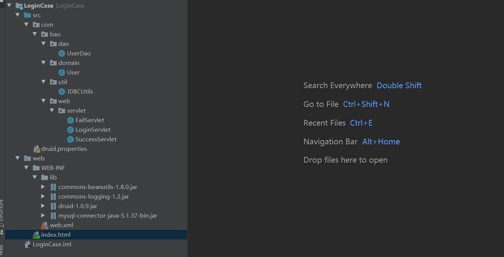
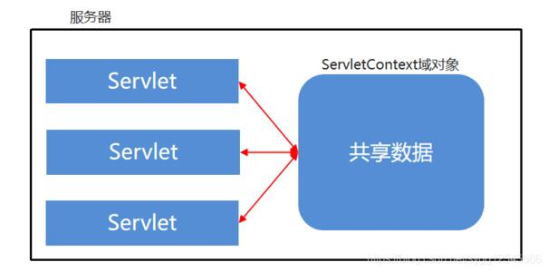
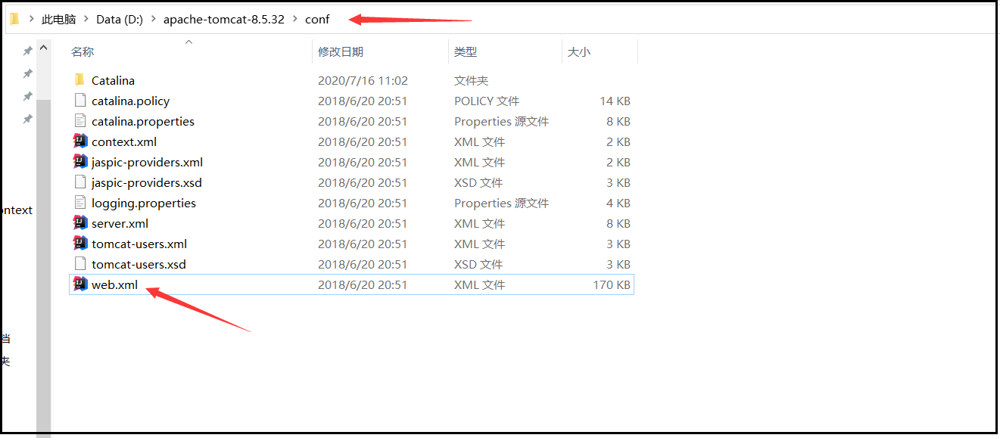

# Servlet

* 概念：运行在服务器端的小程序
*  server applet 的缩写
* Servlet就是一个接口，定义了Java类被浏览器访问到(tomcat识别)的规则。
  * servlet是一个规则
* 将来我们自定义一个类，实现Servlet接口，复写方法。

> 理解：我们曾经使用mian方法调用类、接口等，现在我们使用tomcat服务器来调用

##快速入门

 	1. 创建JavaEE项目
 	2. 定义一个类，实现Servlet接口
 	3. 实现接口中的抽象方法

```java
package com.bao.demo1;

import javax.servlet.*;
import java.io.IOException;

public class ServletDemo1 implements Servlet {
    @Override
    public void init(ServletConfig servletConfig) throws ServletException {
        
    }

    @Override
    public ServletConfig getServletConfig() {
        return null;
    }

    @Override
    public void service(ServletRequest servletRequest, ServletResponse servletResponse) throws ServletException, IOException {
		System.out.println("hello,servlet");
    }

    @Override
    public String getServletInfo() {
        return null;
    }

    @Override
    public void destroy() {

    }
}
```

4. 在web.xml中配置Servlet

> 只有配置了servlet才能够被浏览器访问

```java
<?xml version="1.0" encoding="UTF-8"?>
<web-app xmlns="http://xmlns.jcp.org/xml/ns/javaee"
         xmlns:xsi="http://www.w3.org/2001/XMLSchema-instance"
         xsi:schemaLocation="http://xmlns.jcp.org/xml/ns/javaee http://xmlns.jcp.org/xml/ns/javaee/web-app_4_0.xsd"
         version="4.0">
             
    <!--配置Servlet -->
    <servlet>
        <servlet-name>demo1</servlet-name>
        <servlet-class>com.bao.web.servlet.ServletDemo1</servlet-class>
    </servlet>

    <servlet-mapping>
        <servlet-name>demo1</servlet-name>
        <url-pattern>/demo1</url-pattern>
    </servlet-mapping>

    <!--配置Servlet -->
    <!--<servlet>
        <servlet-name>demo2</servlet-name>
        <servlet-class>com.bao.web.servlet.ServletDemo2</servlet-class>
        &lt;!&ndash;指定Servlet的创建时机
            1.第一次被访问时创建
                * <load-on-startup>的值为负数
            2.在服务器启动时，创建
                * <load-on-startup>的值为0或正整数
        &ndash;&gt;

        <load-on-startup>-5</load-on-startup>
    </servlet>

    <servlet-mapping>
        <servlet-name>demo2</servlet-name>
        <url-pattern>/demo2</url-pattern>
    </servlet-mapping>-->
</web-app>
```

##执行原理

```java
1. 当服务器接受到客户端浏览器的请求后，会解析请求URL路径，获取访问的Servlet的资源路径
2. 查找web.xml文件，是否有对应的<url-pattern>标签体内容。
3. 如果有，则再找到对应的<servlet-class>全类名
4. tomcat会将字节码文件加载进内存，并且创建其对象
5. 调用其方法
```


##Servlet中的生命周期方法

	1. 被创建：执行init方法，只执行一次
		* Servlet什么时候被创建？
			* 默认情况下，第一次被访问时，Servlet被创建
			* 可以配置执行Servlet的创建时机。
				* 在<servlet>标签下配置
					1. 第一次被访问时创建(默认)
	            		* <load-on-startup>的值为负数
		            2. 在服务器启动时，创建
		                * <load-on-startup>的值为0或正整数
	    		* Servlet的init方法，只执行一次，说明一个Servlet在内存中只存在一个对象，Servlet是单例的
			* 多个用户同时访问时，可能存在线程安全问题。
			* 解决：尽量不要在Servlet中定义成员变量。即使定义了成员变量，也不要修改值
	
	2. 提供服务：执行service方法，可以执行多次
		* 每次访问Servlet时，Service方法都会被调用一次。
	3. 被销毁：执行destroy方法，只执行一次
		* destroy方法在Servlet被销毁时执行。服务器关闭时，Servlet被销毁
		* 只有服务器正常关闭时，才会执行destroy方法。
		* destroy方法在Servlet被销毁之前执行，一般用于释放资源
	4. getServletConfig和getServletInfo方法了解即可
	    * getServletConfig():获取ServletConfig对象，也就是Servlet的配置对象
	    * getServletInfo():获取Servlet的一些信息，版本，作者等
```java
package com.bao.web.servlet;

import javax.servlet.*;
import java.io.IOException;

public class ServletDemo1 implements Servlet {
    @Override
    public void init(ServletConfig servletConfig) throws ServletException {
        System.out.println("init.......");
    }

    @Override
    public ServletConfig getServletConfig() {
        return null;
    }

    @Override
    public void service(ServletRequest servletRequest, ServletResponse servletResponse) throws ServletException, IOException {
        System.out.println("hello,servlet");
    }

    @Override
    public String getServletInfo() {
        return null;
    }

    @Override
    public void destroy() {
        System.out.println("destroy......");
    }
}
```

web.xml

```xml
<?xml version="1.0" encoding="UTF-8"?>
<web-app xmlns="http://xmlns.jcp.org/xml/ns/javaee"
         xmlns:xsi="http://www.w3.org/2001/XMLSchema-instance"
         xsi:schemaLocation="http://xmlns.jcp.org/xml/ns/javaee http://xmlns.jcp.org/xml/ns/javaee/web-app_4_0.xsd"
         version="4.0">
    <!--配置Servlet -->
    <!--<servlet>
        <servlet-name>demo1</servlet-name>
        <servlet-class>com.bao.web.servlet.ServletDemo1</servlet-class>
    </servlet>

    <servlet-mapping>
        <servlet-name>demo1</servlet-name>
        <url-pattern>/demo1</url-pattern>
    </servlet-mapping>-->

    <!--配置Servlet -->
    <servlet>
        <servlet-name>demo1</servlet-name>
        <servlet-class>com.bao.web.servlet.ServletDemo1</servlet-class>
        <!--指定Servlet的创建时机
            1.第一次被访问时创建
                * <load-on-startup>的值为负数
            2.在服务器启动时，创建
                * <load-on-startup>的值为0或正整数
        -->

        <load-on-startup>-1</load-on-startup>
    </servlet>

    <servlet-mapping>
        <servlet-name>demo1</servlet-name>
        <url-pattern>/demo1</url-pattern>
    </servlet-mapping>
</web-app>
```

##Servlet3.0

	* 好处：
		* 支持注解配置。可以不需要web.xml了。
	
	* 步骤：
		1. 创建JavaEE项目，选择Servlet的版本3.0以上，可以不创建web.xml
		2. 定义一个类，实现Servlet接口
		3. 复写方法
		4. 在类上使用@WebServlet注解，进行配置
```java
package com.bao.web.servlet;

import javax.servlet.*;
import javax.servlet.annotation.WebServlet;
import java.io.IOException;

@WebServlet("/demo2")//资源路径
public class ServletDemo2 implements Servlet {
    @Override
    public void init(ServletConfig servletConfig) throws ServletException {

    }

    @Override
    public ServletConfig getServletConfig() {
        return null;
    }

    @Override
    public void service(ServletRequest servletRequest, ServletResponse servletResponse) throws ServletException, IOException {
        System.out.println("servlet2");
    }

    @Override
    public String getServletInfo() {
        return null;
    }

    @Override
    public void destroy() {

    }
}
```

## Servlet的体系结构

```
Servlet -- 接口
	|
GenericServlet -- 抽象类
	|
HttpServlet  -- 抽象类

* GenericServlet：将Servlet接口中其他的方法做了默认空实现，只将service()方法作为抽象
	* 将来定义Servlet类时，可以继承GenericServlet，实现service()方法即可
	* 但是开发中还是不会继承该类，而是会继承HttpServlet

* HttpServlet：对http协议进行了封装，简化了操作
	* 前端发送请求会使用get或post方法，而该类复写service时，进行了请求方法类型的判断，简化了操作
	
* 继承HttpServlet的步骤
	1. 定义类继承HttpServlet
	2. 复写doGet/doPost方法
	
```

- 查看HttpSetvlet类的service方法


## 继承HttpServlet的代码实现

```java
package com.bao.web.servlet;

import javax.servlet.ServletException;
import javax.servlet.annotation.WebServlet;
import javax.servlet.http.HttpServlet;
import javax.servlet.http.HttpServletRequest;
import javax.servlet.http.HttpServletResponse;
import java.io.IOException;

@WebServlet("/demo5")
public class ServletDemo5 extends HttpServlet {
    @Override
    protected void doGet(HttpServletRequest req, HttpServletResponse resp) throws ServletException, IOException {
        System.out.println("doget--------------------哈哈");
    }

    @Override
    protected void doPost(HttpServletRequest req, HttpServletResponse resp) throws ServletException, IOException {
        System.out.println("dopost--------------------哈哈");
    }
}
```

```jsp
<%@ page contentType="text/html;charset=UTF-8" language="java" %>
<html>
  <head>
    <title>$Title$</title>
  </head>
  <body>
<%--    <form action="/web02/demo5" method="get">
      用户名：<input type="text" name="username">
      <input type="submit" value="提交">
    </form>--%>
      
  <form action="/web02/demo5" method="post">
    用户名：<input type="text" name="username" placeholder="请输入用户名">
    <input type="submit" value="提交">
  </form>
  </body>
</html>
```


## Servlet相关配置

	1. urlPatterns:Servlet访问路径
		1. 一个Servlet可以定义多个访问路径 ： @WebServlet({"/d4","/dd4","/ddd4"})
		2. 路径定义规则：
			1. /xxx：路径匹配
			2. /xxx/xxx:多层路径，目录结构
			3. *.do：扩展名匹配
```java
package com.bao.web.servlet;

import javax.servlet.*;
import javax.servlet.annotation.WebServlet;
import javax.servlet.http.HttpServlet;
import javax.servlet.http.HttpServletRequest;
import javax.servlet.http.HttpServletResponse;
import java.io.IOException;

//@WebServlet("/demo2")
//@WebServlet({"/demo2","/demo3","/demo4"})
//@WebServlet("/demo/demo2")
//@WebServlet("/demo/*")
//@WebServlet("/*")//优先级最低
//@WebServlet("*.do")
@WebServlet("*.abc")
/*1、扩展名可以随便写2、注意不要加正斜杠*/

public class ServletDemo2 extends HttpServlet {
    @Override
    protected void doGet(HttpServletRequest req, HttpServletResponse resp) throws ServletException, IOException {
        System.out.println("doGet......");
    }

    @Override
    protected void doPost(HttpServletRequest req, HttpServletResponse resp) throws ServletException, IOException {
        System.out.println("doPost......");
    }
}
```


# Http：请求消息

##概念

```
Hyper Text Transfer Protocol 超文本传输协议
	* 传输协议：定义了，客户端和服务器端通信时，发送数据的格式
	* 特点：
		1. 基于TCP/IP的高级协议
		2. 默认端口号:80
		3. 基于请求/响应模型的:一次请求对应一次响应
		4. 无状态的：每次请求之间相互独立，不能交互数据

	* 历史版本：
		* 1.0：每一次请求响应都会建立新的连接
		* 1.1：建立连接后复用连接
```

##请求消息数据格式

	1. 请求行
		请求方式 请求url 请求协议/版本
		GET /login.html	HTTP/1.1
	
		* 请求方式：
			* HTTP协议有7中请求方式，常用的有2种
				* GET：
					1. 请求参数在请求行中，在url后。
					2. 请求的url长度有限制的
					3. 不太安全
				* POST：
					1. 请求参数在请求体中
					2. 请求的url长度没有限制的
					3. 相对安全
					
	2. 请求头：客户端浏览器告诉服务器一些信息
		请求头名称: 请求头值（多个值用逗号隔开）
		* 常见的请求头：
			1. Host：哪台计算机
			2. User-Agent：浏览器告诉服务器，我访问你使用的浏览器版本信息
				* 可以在服务器端获取该头的信息，解决浏览器的兼容性问题
	
			3. Referer：http://localhost/login.html
				* 告诉服务器，我(当前请求)从哪里来？
					* 作用：
						1. 防盗链：
						2. 统计工作：
		* 了解请求头：
	    	4. Connection：表示状态，活着的，可以复用链接
	        5. Accept：作为浏览器告诉服务器我可以接收信息的格式
	        6. Accept-Language：我可以支持的语言环境
	        7. Accept-Encoding：我可以接收的压缩格式
	
	3. 请求空行
		空行，就是用于分割POST请求的请求头和请求体的。
		
	4. 请求体(正文)：
		* 当请求方式为post时才会有
		* 封装POST请求消息的请求参数的
	
	* 完整的请求消息（字符串格式）：
		POST /httpDemo1/HttpTest1 HTTP/1.1
	    Host: localhost:8080
	    User-Agent: Mozilla/5.0 (Windows NT 10.0; Win64; x64; rv:83.0) Gecko/20100101 Firefox/83.0
	    Accept: text/html,application/xhtml+xml,application/xml;q=0.9,image/webp,*/*;q=0.8
	    Accept-Language: zh-CN,zh;q=0.8,zh-TW;q=0.7,zh-HK;q=0.5,en-US;q=0.3,en;q=0.2
	    Accept-Encoding: gzip, deflate
	    Content-Type: application/x-www-form-urlencoded
	    Content-Length: 13
	    Origin: http://localhost:8080
	    Connection: keep-alive
	    Referer: http://localhost:8080/httpDemo1/
	    Cookie: JSESSIONID=7663BFB4D313E801E2B1C1F43F2F19C0; Idea-bd098543=aa75eb7c-b393-4a74-9e81-ea97b66571d6
	    Upgrade-Insecure-Requests: 1
	    Pragma: no-cache
	    Cache-Control: no-cache
		
		username=zhangsan	


# Request

## 原理

```java
1)tomcat服务器会根据请求url中的资源路径，创建对应的class对象(加载进内存)

2)tomcat服务器，会创建request和response对象，request对象中封装请求消息数据

3)tomcat将request和response两个对象传递给service方法，并且调用service方法

4)程序员可以通过request对象获取请求消息数据，通过response对象设置响应消息数据

5)服务器在给浏览器做出响应之前，先会从response对象拿程序员设置的响应消息数据

理解：request和response对象是由服务器创建的，我们只是来使用它们
	 request对象是来获取请求消息，response对象是来设置响应消息
```

### 图解


### request对象继承体系

```java
	ServletRequest		--	接口
		|	继承
	HttpServletRequest	-- 接口
		|	实现
	org.apache.catalina.connector.RequestFacade 类(tomcat编写的)
	
理解：tomcat编写RequestFacade类并且实现了HttpServletRequest接口
```

##request功能

### 获取请求消息数据

####获取请求行数据

	* GET /RequestDemo1/demo1?name=zhangsan HTTP/1.1
	* 方法：
		1. 获取请求方式 ：GET
			* String getMethod()  
		2. (*)获取虚拟目录：/RequestDemo1
			* String getContextPath()
		3. 获取Servlet路径: /demo1
			* String getServletPath()
		4. 获取get方式请求参数：name=zhangsan
			* String getQueryString()
		5. (*)获取请求URI：/RequestDemo1/demo1
			* String getRequestURI():		/RequestDemo1/demo1
			* StringBuffer getRequestURL()  :http://localhost/RequestDemo1/demo1
	
			* URL:统一资源定位符 ： http://localhost/RequestDemo1/demo1	中华人民共和国
			* URI：统一资源标识符 : /RequestDemo1/demo1					共和国
		
		6. 获取协议及版本：HTTP/1.1
			* String getProtocol()
	
		7. 获取客户机的IP地址：
			* String getRemoteAddr()
#### 代码演示

```jsp
<%@ page contentType="text/html;charset=UTF-8" language="java" %>
<html>
  <head>
    <title>$Title$</title>
  </head>
  <body>
    <form action="/RequestTest/requestDemo1" method="post">
      <input type="text" name="username">
      <input type="submit" value="提交">
    </form>
  </body>
</html>
```

```java
package com.bao.web.servlet;

import javax.servlet.ServletException;
import javax.servlet.annotation.WebServlet;
import javax.servlet.http.HttpServlet;
import javax.servlet.http.HttpServletRequest;
import javax.servlet.http.HttpServletResponse;
import java.io.IOException;

@WebServlet("/requestDemo1")
public class RequestDemo1 extends HttpServlet {
    @Override
    protected void doGet(HttpServletRequest req, HttpServletResponse resp) throws ServletException, IOException {
        //1. 获取请求方式 ：GET
        String method = req.getMethod();
        System.out.println(method);
        //2.(*)获取虚拟目录：/RequestTest
        String contextPath = req.getContextPath();
        System.out.println(contextPath);
        //3. 获取Servlet的资源路径: /requestDemo1
        String servletPath = req.getServletPath();
        System.out.println(servletPath);
        //4. 获取get方式请求参数：username=zhangsan
        String queryString = req.getQueryString();
        System.out.println(queryString);
        //5.(*)获取请求URI：/RequestTest/requestDemo1
        String requestURI = req.getRequestURI();
        //获取请求URL：http://localhost:8080/RequestTest/requestDemo1
        StringBuffer requestURL = req.getRequestURL();
        System.out.println(requestURI);
        System.out.println(requestURL);
        //6. 获取协议及版本：HTTP/1.1
        String protocol = req.getProtocol();
        System.out.println(protocol);
        //7. 获取客户机的IP地址：0:0:0:0:0:0:0:1(ipv6的表现形式，相当于127.0.0.1，为本机地址)
        String remoteAddr = req.getRemoteAddr();
        System.out.println(remoteAddr);

    }

    @Override
    protected void doPost(HttpServletRequest req, HttpServletResponse resp) throws ServletException, IOException {
        this.doGet(req,resp);
    }
}

```


####获取请求头数据

	* 方法：
		* (*)String getHeader(String name):通过请求头的名称获取请求头的值
		* Enumeration<String> getHeaderNames():获取所有的请求头名称
			* Enumeration对象类似于迭代器
#### 代码演示

```java
package com.bao.web.servlet;

import javax.servlet.ServletException;
import javax.servlet.annotation.WebServlet;
import javax.servlet.http.HttpServlet;
import javax.servlet.http.HttpServletRequest;
import javax.servlet.http.HttpServletResponse;
import java.io.IOException;
import java.util.Enumeration;

@WebServlet("/HttpTest1")
public class HttpTest1 extends HttpServlet {
    @Override
    protected void doGet(HttpServletRequest req, HttpServletResponse resp) throws ServletException, IOException {
        //演示获取所有请求头数据
        //1.获取所有请求头名称
        Enumeration<String> headerNames = req.getHeaderNames();
        //2.遍历
        while(headerNames.hasMoreElements()){
            //获取请求头的名称
            String name = headerNames.nextElement();
            //根据名称获取请求头的值
            String value = req.getHeader(name);
            System.out.println(name+"---"+value);
        }

        //演示获取某个请求头数据：user-agent
        String agent = req.getHeader("user-agent");
        //判断agent的浏览器版本
        if(agent.contains("Chrome")){
            //谷歌
            System.out.println("谷歌...");
        }else if(agent.contains("Firefox")){
            //火狐
            System.out.println("火狐...");
        }

    }

    @Override
    protected void doPost(HttpServletRequest req, HttpServletResponse resp) throws ServletException, IOException {
        this.doGet(req,resp);
    }

}
```

####获取请求体数据

	* 请求体：只有POST请求方式，才有请求体，在请求体中封装了POST请求的请求参数
	* 步骤：
	1. 获取流对象
	    *  BufferedReader getReader()：获取字符输入流，只能操作字符数据
	    *  ServletInputStream getInputStream()：获取字节输入流，可以操作所有类型数据(在文件上传知识点后讲解)
	2. 再从流对象中拿数据

#### 代码演示

regist.html

```html
<!DOCTYPE html>
<html lang="en">
<head>
    <meta charset="UTF-8">
    <title>注册页面</title>
</head>
<body>

<form action="/httpDemo1/requestDemo1" method="post">
    <input type="text" placeholder="请输入用户名" name="username"><br>
    <input type="text" placeholder="请输入密码" name="password"><br>
    <input type="submit" value="注册">
</form>

</body>
</html>
```

RequestDemo1

```java
package com.bao.web.servlet;

import javax.servlet.ServletException;
import javax.servlet.annotation.WebServlet;
import javax.servlet.http.HttpServlet;
import javax.servlet.http.HttpServletRequest;
import javax.servlet.http.HttpServletResponse;
import java.io.BufferedReader;
import java.io.IOException;

@WebServlet("/requestDemo1")
public class RequestDemo1 extends HttpServlet {
    protected void doPost(HttpServletRequest request, HttpServletResponse response) throws ServletException, IOException {
        //获取请求消息体--请求参数
        //1.获取字符流
        BufferedReader br = request.getReader();
        //2.读取数据
        String line = null;
        while((line = br.readLine()) != null){
            System.out.println(line);
        }
    }

    protected void doGet(HttpServletRequest request, HttpServletResponse response) throws ServletException, IOException {
        this.doPost(request,response);
    }
}
```


###其他功能

####获取请求参数通用方式

> 不论get还是post请求方式都可以使用下列方法来获取请求参数

```
1. String getParameter(String name):根据参数名称获取参数值    username=zs&password=123
2. String[] getParameterValues(String name):根据参数名称获取参数值的数组  hobby=xx&hobby=game
3. Enumeration<String> getParameterNames():获取所有请求的参数名称
4. Map<String,String[]> getParameterMap():获取所有参数的map集合
```

```
* 中文乱码问题：
    * get方式：tomcat 8 已经将get方式乱码问题解决了
    * post方式：会乱码
* 解决：
	* 在获取参数前，设置request的编码：request.setCharacterEncoding("utf-8");
	* request.setCharacterEncoding("utf-8")：用来确保发往服务器的参数的编码格式，设置从request中取得的值或从数据库中取出的值
```

#### 代码

```jsp
<html lang="en">
    <head>
        <meta charset="UTF-8">
        <title>注册页面</title>
    </head>
    <body>
        <form action="/RequestTest/requestDemo2" method="post">
            <input type="text" placeholder="请输入用户名" name="username"><br>
            <input type="text" placeholder="请输入密码" name="password"><br>

            <input type="checkbox" name="hobby" value="game">游戏
            <input type="checkbox" name="hobby" value="study">学习
            <input type="checkbox" name="hobby" value="run">跑步
            <br>

            <input type="submit" value="注册">

        </form>
    </body>
</html>
```

```java
package com.bao.web.servlet;

import javax.servlet.ServletException;
import javax.servlet.annotation.WebServlet;
import javax.servlet.http.HttpServlet;
import javax.servlet.http.HttpServletRequest;
import javax.servlet.http.HttpServletResponse;
import java.io.IOException;
import java.util.Map;
import java.util.Set;

@WebServlet("/requestDemo2")
public class RequestDemo2 extends HttpServlet {
    protected void doPost(HttpServletRequest request, HttpServletResponse response) throws ServletException, IOException {
        //post 获取请求参数
        //解决乱码问题
        request.setCharacterEncoding("utf-8");
        //根据参数名称获取参数值
        String username = request.getParameter("username");
        //System.out.println("post");
        System.out.println(username);
        System.out.println("--------------------");
        //根据参数名称获取参数值的数组
        String[] hobbies = request.getParameterValues("hobby");
        for (String hobby : hobbies) {
            System.out.println(hobby);
        }
        System.out.println("--------------------");

        //获取所有请求的参数名称
        /*Enumeration<String> parameterNames = request.getParameterNames();
        while(parameterNames.hasMoreElements()){
            String name = parameterNames.nextElement();
            System.out.println(name);
            String value = request.getParameter(name);
            System.out.println(value);
            System.out.println("----------------");
        }*/

        // 获取所有参数的map集合
        Map<String, String[]> parameterMap = request.getParameterMap();
        //遍历
        Set<String> keyset = parameterMap.keySet();
        for (String name : keyset) {
            System.out.println(name);
            //通过键获取值
            String[] values = parameterMap.get(name);
            for (String value : values) {
                System.out.println(value);
            }
            System.out.println("----");
        }

    }

    protected void doGet(HttpServletRequest request, HttpServletResponse response) throws ServletException, IOException {
        //get 获取请求参数
/*
        //根据参数名称获取参数值
        String username = request.getParameter("username");
        System.out.println("get");
        System.out.println(username);*/

        this.doPost(request,response);
    }
}
```


####请求转发

> 一种在服务器内部的资源跳转方式

```
步骤：
    1. 通过request对象获取请求转发器对象：RequestDispatcher getRequestDispatcher(String path)
    2. 使用RequestDispatcher对象来进行转发：forward(ServletRequest request, ServletResponse response) 

特点：
    1. 浏览器地址栏路径不发生变化
    2. 只能转发到当前服务器内部资源中。
    3. 转发是一次请求
    4. 转发时不需要加虚拟目录
    
```

#### 图解


```java
package com.bao.web.servlet;

import javax.servlet.RequestDispatcher;
import javax.servlet.ServletException;
import javax.servlet.annotation.WebServlet;
import javax.servlet.http.HttpServlet;
import javax.servlet.http.HttpServletRequest;
import javax.servlet.http.HttpServletResponse;
import java.io.IOException;
import java.util.Map;
import java.util.Set;

@WebServlet("/requestDemo3")
public class RequestDemo3 extends HttpServlet {
    protected void doPost(HttpServletRequest request, HttpServletResponse response) throws ServletException, IOException {
        System.out.println("Demo3...........");
        //转发到demo4资源
//        RequestDispatcher requestDispatcher = request.getRequestDispatcher("/requestDemo4");
        RequestDispatcher requestDispatcher = request.getRequestDispatcher("https://www.baidu.com/");//404
        requestDispatcher.forward(request,response);

    }

    protected void doGet(HttpServletRequest request, HttpServletResponse response) throws ServletException, IOException {

        this.doPost(request,response);
    }
}
```

```java
package com.bao.web.servlet;

import javax.servlet.ServletException;
import javax.servlet.annotation.WebServlet;
import javax.servlet.http.HttpServlet;
import javax.servlet.http.HttpServletRequest;
import javax.servlet.http.HttpServletResponse;
import java.io.IOException;

@WebServlet("/requestDemo4")
public class RequestDemo4 extends HttpServlet {
    protected void doPost(HttpServletRequest request, HttpServletResponse response) throws ServletException, IOException {
        System.out.println("Demo4.........");

    }

    protected void doGet(HttpServletRequest request, HttpServletResponse response) throws ServletException, IOException {
        this.doPost(request,response);
    }
}
```

####共享数据

    * 域对象：一个有作用范围的对象，可以在范围内共享数据
    * request域：代表一次请求的范围，一般用于请求转发的多个资源中共享数据
    * 方法：
        1. void setAttribute(String name,Object obj):存储数据
        2. Object getAttitude(String name):通过键获取值
        3. void removeAttribute(String name):通过键移除键值对
```java
package com.bao.web.servlet;

import javax.servlet.ServletException;
import javax.servlet.annotation.WebServlet;
import javax.servlet.http.HttpServlet;
import javax.servlet.http.HttpServletRequest;
import javax.servlet.http.HttpServletResponse;
import java.io.IOException;

@WebServlet("/requestDemo5")
public class RequestDemo5 extends HttpServlet {
    protected void doPost(HttpServletRequest request, HttpServletResponse response) throws ServletException, IOException {
        //存储数据到request域中
        request.setAttribute("msg","hello");
        request.removeAttribute("msg");
        request.getRequestDispatcher("/requestDemo6").forward(request,response);
    }

    protected void doGet(HttpServletRequest request, HttpServletResponse response) throws ServletException, IOException {
        this.doPost(request,response);
    }
}
```

```java
package com.bao.web.servlet;

import javax.servlet.ServletException;
import javax.servlet.annotation.WebServlet;
import javax.servlet.http.HttpServlet;
import javax.servlet.http.HttpServletRequest;
import javax.servlet.http.HttpServletResponse;
import java.io.IOException;

@WebServlet("/requestDemo6")
public class RequestDemo6 extends HttpServlet {
    protected void doPost(HttpServletRequest request, HttpServletResponse response) throws ServletException, IOException {
        //获取数据
        Object msg = request.getAttribute("msg");
        System.out.println(msg);
        System.out.println("demo6被访问了。。。");
    }

    protected void doGet(HttpServletRequest request, HttpServletResponse response) throws ServletException, IOException {
        this.doPost(request,response);
    }
}
```


# 案例：用户登录

## 注意

```
8. login.html中form表单的action路径的写法
	* 虚拟目录+Servlet的资源路径

9. BeanUtils工具类，简化数据封装
	* 用于封装JavaBean的
	1. JavaBean：标准的Java类
		1. 要求：
			1. 类必须被public修饰
			2. 必须提供空参的构造器
			3. 成员变量必须使用private修饰
			4. 提供公共setter和getter方法
		2. 功能：封装数据
	2. 概念：
		成员变量：定义在类中方法外的变量
		属性：setter和getter方法截取后首字母小写的产物
			例如：getUsername() --> Username--> username
	3. 方法：
		populate(Object obj , Map map):将map集合的键值对信息，封装到对应的JavaBean对象中
```

##用户登录案例需求

	1.编写login.html登录页面
		username & password 两个输入框
	2.使用Druid数据库连接池技术,操作mysql数据库中user表
	3.使用JDBCUtils工具类
	4.登录成功跳转到SuccessServlet展示：登录成功！用户名,欢迎您
	5.登录失败跳转到FailServlet展示：登录失败，用户名或密码错误
## 创建表

```sql
CREATE TABLE USER(	
    id INT PRIMARY KEY AUTO_INCREMENT,
    username VARCHAR(32) UNIQUE NOT NULL,
    password VARCHAR(32) NOT NULL,
    gender VARCHAR(32) NOT NULL
);
```
## 创建页面

```html
<!DOCTYPE html>
<html lang="en">
<head>
    <meta charset="UTF-8">
    <title>登录</title>
</head>
<body>
<form action="/LoginCase/loginServlet" method="post">
    用户名:<input type="text" name="username"> <br>
    密码:<input type="password" name="password"><br>

    <input type="submit" value="登录">

</form>
</body>
</html>
```

## 后台代码

### 结构展示



### User

```java
package com.bao.domain;


/**
 * 用户的实体类
 */
public class User {

    private int id;
    private String username;
    private String password;
    private String gender;

    public void setHehe(String gender){
        this.gender = gender;
    }

    public String getHehe(){
        return gender;
    }

    public int getId() {
        return id;
    }

    public void setId(int id) {
        this.id = id;
    }

    public String getUsername() {
        return username;
    }

    public void setUsername(String username) {
        this.username = username;
    }

    public String getPassword() {
        return password;
    }

    public void setPassword(String password) {
        this.password = password;
    }

    @Override
    public String toString() {
        return "User{" +
                "id=" + id +
                ", username='" + username + '\'' +
                ", password='" + password + '\'' +
                ", gender='" + gender + '\'' +
                '}';
    }
}
```

### JDBCUtils

```java
package com.bao.utils;

import com.alibaba.druid.pool.DruidDataSourceFactory;

import javax.sql.DataSource;
import java.io.IOException;
import java.io.InputStream;
import java.sql.Connection;
import java.sql.ResultSet;
import java.sql.SQLException;
import java.sql.Statement;
import java.util.Properties;

/**
 * JDBC工具类 使用Durid连接池
 */
public class JDBCUtils {

    private static DataSource ds ;

    static {

        try {
            //1.加载配置文件
            Properties pro = new Properties();
            //使用ClassLoader加载配置文件，获取字节输入流
            InputStream is = JDBCUtils.class.getClassLoader().getResourceAsStream("druid.properties");
            pro.load(is);
            //2.初始化连接池对象
            ds = DruidDataSourceFactory.createDataSource(pro);

        } catch (IOException e) {
            e.printStackTrace();
        } catch (Exception e) {
            e.printStackTrace();
        }
    }

    /**
     * 获取连接池对象
     */
    public static DataSource getDataSource(){
        return ds;
    }


    /**
     * 获取连接Connection对象
     */
    public static Connection getConnection() throws SQLException {
        return  ds.getConnection();
    }

    /**
     * 释放资源
     */
    public static void close(Statement stmt, Connection conn) {
        close(null, stmt, conn);
    }
    public static void close(ResultSet rs, Statement stmt, Connection conn) {
        if (rs != null) {
            try {
                rs.close();
            } catch (SQLException e) {
                e.printStackTrace();
            }
        }
        if (stmt != null) {
            try {
                stmt.close();
            } catch (SQLException e) {
                e.printStackTrace();
            }
        }

        if (conn != null) {
            try {
                conn.close();//归还连接
            } catch (SQLException e) {
                e.printStackTrace();
            }
        }
    }
}
```

### LoginServlet

```java
package com.bao.web.servlet;

import com.bao.dao.UserDao;
import com.bao.domain.User;
import org.apache.commons.beanutils.BeanUtils;

import javax.servlet.ServletException;
import javax.servlet.annotation.WebServlet;
import javax.servlet.http.HttpServlet;
import javax.servlet.http.HttpServletRequest;
import javax.servlet.http.HttpServletResponse;
import java.io.IOException;
import java.lang.reflect.InvocationTargetException;
import java.util.Map;


@WebServlet("/loginServlet")
public class LoginServlet extends HttpServlet {

    @Override
    protected void doGet(HttpServletRequest req, HttpServletResponse resp) throws ServletException, IOException {
        //1.设置编码
        req.setCharacterEncoding("utf-8");
        //2.获取所有请求参数
        Map<String, String[]> map = req.getParameterMap();
        //3.创建User对象
        User loginUser = new User();
        //3.2使用BeanUtils封装
        try {
            BeanUtils.populate(loginUser,map);//自动将map集合中的数据封装到user中
        } catch (IllegalAccessException e) {
            e.printStackTrace();
        } catch (InvocationTargetException e) {
            e.printStackTrace();
        }
        //4.调用UserDao的login方法
        UserDao dao = new UserDao();
        User user = dao.login(loginUser);

        //5.判断user
        if(user == null){
            //登录失败
            req.getRequestDispatcher("/failServlet").forward(req,resp);
        }else{
            //登录成功
            //存储数据
            req.setAttribute("user",user);
            //转发
            req.getRequestDispatcher("/successServlet").forward(req,resp);
        }

    }

    @Override
    protected void doPost(HttpServletRequest req, HttpServletResponse resp) throws ServletException, IOException {
        this.doGet(req,resp);
    }
}
```

###FailServlet

```java
package com.bao.web.servlet;

import javax.servlet.ServletException;
import javax.servlet.annotation.WebServlet;
import javax.servlet.http.HttpServlet;
import javax.servlet.http.HttpServletRequest;
import javax.servlet.http.HttpServletResponse;
import java.io.IOException;

@WebServlet("/failServlet")
public class FailServlet extends HttpServlet {
    protected void doPost(HttpServletRequest request, HttpServletResponse response) throws ServletException, IOException {
        //给页面写一句话
        //设置编码
        response.setContentType("text/html;charset=utf-8");
        //输出
        response.getWriter().write("登录失败，用户名或密码错误");

    }

    protected void doGet(HttpServletRequest request, HttpServletResponse response) throws ServletException, IOException {
        this.doPost(request,response);
    }
}
```

###SuccessServlet

```java
package com.bao.web.servlet;

import com.bao.domain.User;

import javax.servlet.ServletException;
import javax.servlet.http.HttpServlet;
import javax.servlet.http.HttpServletRequest;
import javax.servlet.http.HttpServletResponse;
import java.io.IOException;

public class SuccessServlet extends HttpServlet {
    @Override
    protected void doGet(HttpServletRequest req, HttpServletResponse resp) throws ServletException, IOException {
        //获取request域中共享的user对象
        User user = (User) req.getAttribute("user");
        if(user != null){
            //给页面写一句话
            //设置编码
            resp.setContentType("text/html;charset=utf-8");
            //输出
            resp.getWriter().write("登录成功！"+user.getUsername()+",欢迎您");
        }
    }

    @Override
    protected void doPost(HttpServletRequest req, HttpServletResponse resp) throws ServletException, IOException {
        this.doGet(req,resp);
    }
}

```

### UserDao

```java
package com.bao.dao;


import com.bao.domain.User;
import com.bao.util.JDBCUtils;

import java.sql.Connection;
import java.sql.PreparedStatement;
import java.sql.ResultSet;
import java.sql.SQLException;

/**
 * 操作数据库中User表的类
 */
public class UserDao {
    /**
     * 登录方法
     *
     * @param loginUser 只有用户名和密码
     * @return user包含用户全部数据, 没有查询到，返回null
     */
    public User login(User loginUser) {
        User user = new User();
        try {
            //1.编写sql
            String sql = "select * from user where username = ? and password = ?";
            //2.得到连接
            Connection connection = JDBCUtils.getConnection();
            //3.获取preparedStatement对象
            PreparedStatement preparedStatement = connection.prepareStatement(sql);
            //4.给占位符赋值
            preparedStatement.setString(1, loginUser.getUsername());
            preparedStatement.setString(2, loginUser.getPassword());
            //5.得到返回值
            ResultSet resultSet = preparedStatement.executeQuery();
            while (resultSet.next()) {
                user.setId(resultSet.getInt(1));
                user.setUsername(resultSet.getString(2));
                user.setPassword(resultSet.getString(3));
                user.setHehe(resultSet.getString(4));
                return user;
            }
        } catch (SQLException e) {
            e.printStackTrace();
        }
        return null;
    }
}
```

### druid.properties

```properties
driverClassName=com.mysql.jdbc.Driver
url=jdbc:mysql:///db3?characterEncoding=utf-8
username=root
password=root
# 初始化连接数量
initialSize=5
# 最大连接数
maxActive=10
# 最大等待时间
maxWait=3000
```


# Http：响应消息

##概念

> 服务器端发送给客户端的数据

##响应消息数据格式

	1. 响应行
		1. 组成：协议/版本 响应状态码 状态码描述
		2. 响应状态码：服务器告诉客户端浏览器本次请求和响应的一个状态。
			1. 状态码都是3位数字 
			2. 分类：
				1. 1xx：服务器接收客户端消息，但没有接受完成，等待一段时间后，发送1xx状态码
				2. 2xx：成功。代表：200
				3. 3xx：重定向。代表：302(重定向)，304(访问缓存)
				4. 4xx：客户端错误。
					* 重点：
						* 404：请求路径没有对应的资源
						* 405：请求方式没有对应的doXxx方法
				5. 5xx：服务器端错误。
					* 重点：500(服务器内部出现异常)
	
	2. 响应头：
		1. 格式：头名称： 值
		2. 常见的响应头：
			1. Content-Type：服务器告诉客户端本次响应体数据格式
			2. Content-disposition：服务器告诉客户端以什么格式打开响应体数据
				* 值：
					* in-line:默认值,在当前页面内打开
					* attachment;filename=xxx：以附件形式打开响应体。（文件下载时讲）
	
	3. 响应空行
	
	4. 响应体:传输的数据
	
	* 完整响应字符串格式
		HTTP/1.1 200 OK
	    date: Sat, 19 Dec 2020 07:42:36 GMT
	    content-type: text/html; charset=UTF-8
	    server: nginx
	    vary: Origin,Accept-Encoding
	    content-encoding: gzip
	    expires: Sat, 19 Dec 2020 07:42:35 GMT
	    cache-control: no-cache
	    x-cache-webcdn: MISS from ks-sccd-cmcc-w-02
	    X-Firefox-Spdy: h2
	    
		<html>
		  <head>
		    <title>$Title$</title>
		  </head>
		  <body>
		  hello , response
		  </body>
		</html>


# Response

##功能：设置响应消息

	1. 设置响应行
		1. 格式：HTTP/1.1 200 ok
		2. 设置状态码：setStatus(int sc) 
		
	2. 设置响应头：setHeader(String name, String value) 
		
	3. 设置响应体：
		* 使用步骤：
			1. 获取输出流
				* 字符输出流：PrintWriter getWriter()
	
				* 字节输出流：ServletOutputStream getOutputStream()
	
			2. 使用输出流，将数据输出到客户端浏览器


##案例：重定向

### 概述

```
* 重定向是什么：资源跳转的方式

* 重定向的特点:redirect
	1. 地址栏发生变化
	2. 重定向可以访问其他站点(服务器)的资源
	3. 重定向是两次请求。不能使用request对象来共享数据
	
* 转发的特点：forward
	1. 转发地址栏路径不变
	2. 转发只能访问当前服务器下的资源
	3. 转发是一次请求，可以使用request对象来共享数据
```

### 代码演示

```java
package com.bao.web.servlet;

import javax.servlet.ServletException;
import javax.servlet.annotation.WebServlet;
import javax.servlet.http.HttpServlet;
import javax.servlet.http.HttpServletRequest;
import javax.servlet.http.HttpServletResponse;
import java.io.IOException;

/**
 * 重定向
 */

@WebServlet("/responseDemo1")
public class ResponseDemo1 extends HttpServlet {
    protected void doPost(HttpServletRequest request, HttpServletResponse response) throws ServletException, IOException {
        //需求：访问/responseDemo1，会自动跳转到/responseDemo2资源
        System.out.println("demo1........");
/*
        //1. 设置状态码为302
        response.setStatus(302);
        //2.设置响应头location，设置要跳转的路径
        response.setHeader("location","/ResponseTest1/responseDemo2");
*/
        //简单的重定向方法
        response.sendRedirect("/ResponseTest1/responseDemo2");
//        response.sendRedirect("https://www.baidu.com/");
    }

    protected void doGet(HttpServletRequest request, HttpServletResponse response) throws ServletException, IOException {
        this.doPost(request,response);
    }
}
```

```java
package com.bao.web.servlet;

import javax.servlet.ServletException;
import javax.servlet.annotation.WebServlet;
import javax.servlet.http.HttpServlet;
import javax.servlet.http.HttpServletRequest;
import javax.servlet.http.HttpServletResponse;
import java.io.IOException;

@WebServlet("/responseDemo2")
public class ResponseDemo2 extends HttpServlet {
    protected void doPost(HttpServletRequest request, HttpServletResponse response) throws ServletException, IOException {
        System.out.println("demo2........");

    }

    protected void doGet(HttpServletRequest request, HttpServletResponse response) throws ServletException, IOException {
        this.doPost(request,response);
    }
}
```

##路径写法

	1. 相对路径：通过相对路径不可以确定唯一资源
		* 如：./index.html
		* 不以/开头，以.开头路径
	
		* 规则：找到当前资源和目标资源之间的相对位置关系
			* ./：当前目录
			* ../:后退一级目录
	2. 绝对路径：通过绝对路径可以确定唯一资源
		* 如：http://localhost/ResponseTest1/responseDemo2		/ResponseTest1/responseDemo2
		* 以/开头的路径

```
* 规则：判断请求从哪里发出的
    * (从客户端发出)给客户端浏览器使用：需要加虚拟目录
        * 建议虚拟目录动态获取：request.getContextPath()
        * <a> , <form> 重定向...
    * (服务器内部跳转)给服务器使用：不需要加虚拟目录
    	* 转发
```


```html
<!DOCTYPE html>
<html lang="en">
<head>
    <meta charset="UTF-8">
    <title>Title</title>
</head>
<body>
    <h1>相对路径</h1>
    <h1>找到当前资源和目标资源之间的相对位置关系</h1>
    <P>
        当前资源:location.html
        http://localhost/ResponseTest1/location.html
    </P>
    <P>
        目标资源:responseDemo2
        http://localhost/ResponseTest1/responseDemo2
    </P>

    <a href="./responseDemo2">相对路径：responseDemo2</a><br>
    <a href="responseDemo2">相对路径："./"可以省略-responseDemo2</a>

    <hr>

    <h1>绝对路径</h1>
    <a href="/ResponseTest1/responseDemo2">
        绝对路径：需要加虚拟目录-responseDemo2
    </a>

</body>
</html>
```

##案例：服务器输出字符数据到浏览器

```java
* 步骤：
	1. 获取字符输出流
	2. 输出数据

* 注意：
	* 乱码问题：
		1. 获取流
			PrintWriter pw = response.getWriter();
			获取的流的默认编码是ISO-8859-1
		2. 设置该流的默认编码
        	response.setCharacterEncoding("utf-8");
			作用是告诉servlet用utf-8转码，而不是用默认的ISO-8859-1
		3. 告诉浏览器响应体使用的编码
            简单的形式：在获取流之前设置编码
            	response.setContentType("text/html;charset=utf-8");
			作用是让浏览器用utf-8来解析返回的数据
```
```java
package com.bao.web.servlet;

import javax.servlet.ServletException;
import javax.servlet.annotation.WebServlet;
import javax.servlet.http.HttpServlet;
import javax.servlet.http.HttpServletRequest;
import javax.servlet.http.HttpServletResponse;
import java.io.IOException;
import java.io.PrintWriter;

@WebServlet("/responseDemo3")
public class ResponseDemo3 extends HttpServlet {
    protected void doPost(HttpServletRequest request, HttpServletResponse response) throws ServletException, IOException {
        //流的默认编码字符集为：ISO-8859-1，我们把它设置为utf-8，需要在获取流前设置
         response.setCharacterEncoding("utf-8");

        //告诉浏览器，服务器发送的消息体数据的编码。建议浏览器使用该编码解码
//        response.setHeader("content-type","text/html;charset=utf-8");
        //简单的形式，设置编码
        response.setContentType("text/html;charset=utf-8");

        //1.获取字符输出流
        PrintWriter pw = response.getWriter();
        //2.输出数据
//        pw.write("<h1>hello response</h1>");
        pw.write("你好,我好,response");
    }

    protected void doGet(HttpServletRequest request, HttpServletResponse response) throws ServletException, IOException {
        this.doPost(request,response);
    }
}
```

##案例：服务器输出字节数据到浏览器

	* 步骤：
		1. 获取字节输出流
		2. 输出数据
```java
package com.bao.web.servlet;

import javax.servlet.ServletException;
import javax.servlet.ServletOutputStream;
import javax.servlet.annotation.WebServlet;
import javax.servlet.http.HttpServlet;
import javax.servlet.http.HttpServletRequest;
import javax.servlet.http.HttpServletResponse;
import java.io.IOException;

@WebServlet("/responseDemo4")
public class ResponseDemo4 extends HttpServlet {
    protected void doPost(HttpServletRequest request, HttpServletResponse response) throws ServletException, IOException {
//        response.setContentType("text/html;charset=utf-8");

        //1.获取字节输出流
        ServletOutputStream sos = response.getOutputStream();
        //2.输出数据
        sos.write("你好吗".getBytes());//与浏览器编码字符集相同不需要转码
//        sos.write("你好".getBytes("utf-8"));
//        sos.write("<h1>hello response</h1>".getBytes("utf-8"));//浏览器可以解析
    }

    protected void doGet(HttpServletRequest request, HttpServletResponse response) throws ServletException, IOException {
        this.doPost(request,response);
    }
}
```


# ServletContext

##概念

```
ServletContext代表整个web应用，可以和程序的容器(服务器)来通信
理解：
	ServletContext官方叫servlet上下文。服务器会为每一个工程创建一个对象，这个对象就是ServletContext对象。这个对象全局唯一，而且工程内部的所有servlet都共享这个对象。所以叫全局应用程序共享对象。
```

###图解



##获取

```java
1. 通过request对象获取
	request.getServletContext();
2. 通过HttpServlet获取
	this.getServletContext();
```
```java
package com.bao.web.servletcontext;

import javax.servlet.ServletContext;
import javax.servlet.ServletException;
import javax.servlet.annotation.WebServlet;
import javax.servlet.http.HttpServlet;
import javax.servlet.http.HttpServletRequest;
import javax.servlet.http.HttpServletResponse;
import java.io.IOException;

@WebServlet("/servletContextDemo1")
public class ServletContextDemo1 extends HttpServlet {
    protected void doPost(HttpServletRequest request, HttpServletResponse response) throws ServletException, IOException {
        
        //1. 通过request对象获取
        ServletContext context1 = request.getServletContext();
        //2. 通过HttpServlet获取
        ServletContext context2 = this.getServletContext();

        System.out.println(context1);
        System.out.println(context2);

        System.out.println(context1 == context2);//true
        
    }

    protected void doGet(HttpServletRequest request, HttpServletResponse response) throws ServletException, IOException {
        this.doPost(request,response);
    }
}
```

##功能

###1. 获取MIME类型
	* MIME类型:在互联网通信过程中定义的一种文件数据类型，有利于网络识别数据的类型
		* 格式： 大类型/小类型   text/html		image/jpeg
	* 获取：String getMimeType(String file)  
#### 查看MIME类型



####代码

```java
package com.bao.web.servletcontext;

import javax.servlet.ServletContext;
import javax.servlet.ServletException;
import javax.servlet.annotation.WebServlet;
import javax.servlet.http.HttpServlet;
import javax.servlet.http.HttpServletRequest;
import javax.servlet.http.HttpServletResponse;
import java.io.IOException;

@WebServlet("/servletContextDemo2")
public class ServletContextDemo2 extends HttpServlet {
    protected void doPost(HttpServletRequest request, HttpServletResponse response) throws ServletException, IOException {

        //2. 通过HttpServlet获取
        ServletContext context = this.getServletContext();

        //3. 定义文件名称
        String filename = "a.jpg";//image/jpeg

        //4.获取MIME类型
        String mimeType = context.getMimeType(filename);
        System.out.println(mimeType);

    }

    protected void doGet(HttpServletRequest request, HttpServletResponse response) throws ServletException, IOException {
        this.doPost(request,response);
    }
}
```

###2. 域对象：共享数据
```java
1. setAttribute(String name,Object value)
2. getAttribute(String name)
3. removeAttribute(String name)

* ServletContext对象范围：所有用户所有请求的数据
```
#### 代码演示：查看两个servlet是否能够共享数据

```java
package com.bao.web.servletcontext;

import javax.servlet.ServletContext;
import javax.servlet.ServletException;
import javax.servlet.annotation.WebServlet;
import javax.servlet.http.HttpServlet;
import javax.servlet.http.HttpServletRequest;
import javax.servlet.http.HttpServletResponse;
import java.io.IOException;

@WebServlet("/servletContextDemo3")
public class ServletContextDemo3 extends HttpServlet {
    protected void doPost(HttpServletRequest request, HttpServletResponse response) throws ServletException, IOException {

        //2. 通过HttpServlet获取
        ServletContext context = this.getServletContext();

        //设置数据
        context.setAttribute("msg","haha");

    }

    protected void doGet(HttpServletRequest request, HttpServletResponse response) throws ServletException, IOException {
        this.doPost(request,response);
    }
}
```

```java
package com.bao.web.servletcontext;

import javax.servlet.ServletContext;
import javax.servlet.ServletException;
import javax.servlet.annotation.WebServlet;
import javax.servlet.http.HttpServlet;
import javax.servlet.http.HttpServletRequest;
import javax.servlet.http.HttpServletResponse;
import java.io.IOException;

@WebServlet("/servletContextDemo4")
public class ServletContextDemo4 extends HttpServlet {
    protected void doPost(HttpServletRequest request, HttpServletResponse response) throws ServletException, IOException {

        //2. 通过HttpServlet获取
        ServletContext context = this.getServletContext();

        //获取数据
        Object msg = context.getAttribute("msg");
        System.out.println(msg);

    }

    protected void doGet(HttpServletRequest request, HttpServletResponse response) throws ServletException, IOException {
        this.doPost(request,response);
    }
}
```

###3. 获取文件的真实路径
	真实路径：获取文件在服务器中的路径
	方法：String getRealPath(String path)  
```java
package com.bao.web.servletcontext;

import javax.servlet.ServletContext;
import javax.servlet.ServletException;
import javax.servlet.annotation.WebServlet;
import javax.servlet.http.HttpServlet;
import javax.servlet.http.HttpServletRequest;
import javax.servlet.http.HttpServletResponse;
import java.io.File;
import java.io.IOException;

@WebServlet("/servletContextDemo5")
public class ServletContextDemo5 extends HttpServlet {
    protected void doPost(HttpServletRequest request, HttpServletResponse response) throws ServletException, IOException {

        // 通过HttpServlet获取
        ServletContext context = this.getServletContext();

        // 获取文件的服务器路径
        String b = context.getRealPath("/b.txt");//web目录下资源访问
        System.out.println(b);
        File file = new File(b);//获取了路径就可以加载并读取文件内容

        String c = context.getRealPath("/WEB-INF/c.txt");//WEB-INF目录下的资源访问
        System.out.println(c);

        String a = context.getRealPath("/WEB-INF/classes/a.txt");//src目录下的资源访问
        System.out.println(a);
    }

    protected void doGet(HttpServletRequest request, HttpServletResponse response) throws ServletException, IOException {
        this.doPost(request,response);
    }
}

```


# 文件下载案例

##需求

	1. 页面显示超链接
	2. 点击超链接后弹出下载提示框
	3. 完成图片、视频文件下载

##分析


	1. 超链接指向的资源如果能够被浏览器解析，则在浏览器中展示，如果不能解析，则弹出下载提示框。不满足需求
	2. 任何资源都必须弹出下载提示框
	3. 使用响应头设置资源的打开方式：
		* content-disposition:attachment;filename=xxx

##步骤


	1. 定义页面，编辑超链接href属性，指向Servlet，传递资源名称filename
	2. 定义Servlet
	    1. 获取文件名称
	    2. 使用字节输入流加载文件进内存
	    3. 指定response的响应头： content-disposition:attachment;filename=xxx
	    4. 将数据写出到response输出流

##有可能遇到的问题


	解决中文文件名问题
	    1. 获取客户端使用的浏览器版本信息
	    2. 根据不同的版本信息，设置filename的编码方式不同
## 代码演示

### download.html

```html
<!DOCTYPE html>
<html lang="en">
<head>
    <meta charset="UTF-8">
    <title>Title</title>
</head>
<body>
    <a href="/ResFileDownloadCase/img/九尾.jpg">图片1</a>
    <a href="/ResFileDownloadCase/img/java.wmv">视频</a>
    <hr>
    <a href="/ResFileDownloadCase/downloadServlet?filename=九尾.jpg">图片九尾</a>
    <a href="/ResFileDownloadCase/downloadServlet?filename=jiuwei.jpg">图片jiuwei</a>
    <a href="/ResFileDownloadCase/downloadServlet?filename=java.wmv">视频</a>

</body>
</html>
```

### DownloadServlet

```java
package com.bao.web.download;

import javax.servlet.ServletContext;
import javax.servlet.ServletException;
import javax.servlet.ServletOutputStream;
import javax.servlet.annotation.WebServlet;
import javax.servlet.http.HttpServlet;
import javax.servlet.http.HttpServletRequest;
import javax.servlet.http.HttpServletResponse;
import java.io.FileInputStream;
import java.io.IOException;

@WebServlet("/downloadServlet")
public class DownloadServlet extends HttpServlet {
    protected void doPost(HttpServletRequest request, HttpServletResponse response) throws ServletException, IOException {
        //1.获取请求参数，文件名称
        String filename = request.getParameter("filename");
        //2.使用字节输入流加载文件进内存
        //2.1找到文件服务器路径
        ServletContext servletContext = this.getServletContext();
        String realPath = servletContext.getRealPath("/img/" + filename);
        //2.2用字节流关联
        FileInputStream fis = new FileInputStream(realPath);

        //3.设置response的响应头
/*
        //解决中文文件名问题
        //1.获取user-agent请求头、
        String agent = request.getHeader("user-agent");
        //2.使用工具类方法编码文件名即可
        filename = DownLoadUtils.getFileName(agent, filename);
*/
        //3.1设置响应头类型：content-type
        String mimeType = servletContext.getMimeType(filename);//获取文件的mime类型
        response.setHeader("content-type",mimeType);

        //3.2设置响应头打开方式:content-disposition
        response.setHeader("content-disposition","attachment;filename="+filename);

        //4.将输入流的数据写出到输出流中
        ServletOutputStream sos = response.getOutputStream();
        byte[] buff = new byte[1024 * 8];
        int len = 0;
        while((len = fis.read(buff)) != -1){
            sos.write(buff,0,len);
        }

        fis.close();
    }

    protected void doGet(HttpServletRequest request, HttpServletResponse response) throws ServletException, IOException {
        this.doPost(request,response);
    }
}
```

### DownloadUtils

> 浏览器文件下载中文乱码工具类
>
> 不需要记住代码，可在网上查找即可，直接使用

```java
package com.bao.web.utils;

import sun.misc.BASE64Encoder;
import java.io.UnsupportedEncodingException;
import java.net.URLEncoder;


public class DownLoadUtils {

    public static String getFileName(String agent, String filename) throws UnsupportedEncodingException {
        if (agent.contains("MSIE")) {
            // IE浏览器
            filename = URLEncoder.encode(filename, "utf-8");
            filename = filename.replace("+", " ");
        } else if (agent.contains("Firefox")) {
            // 火狐浏览器
            BASE64Encoder base64Encoder = new BASE64Encoder();
            filename = "=?utf-8?B?" + base64Encoder.encode(filename.getBytes("utf-8")) + "?=";
        } else {
            // 其它浏览器
            filename = URLEncoder.encode(filename, "utf-8");
        }
        return filename;
    }
}
```

