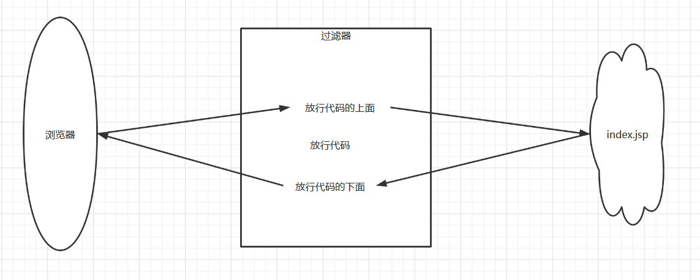
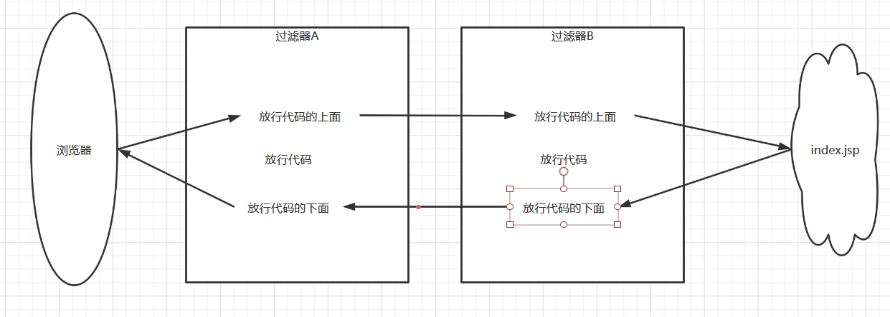

# Filter：过滤器

##1. 概念
	* 生活中的过滤器：净水器,空气净化器，收费站、保安大叔
	* web中的过滤器：当访问服务器的资源时，过滤器可以将请求拦截下来，完成一些特殊的功能。
	* 过滤器的作用：
		* 一般用于完成通用的操作。如：登录验证、统一编码处理、敏感字符过滤...
##2. 快速入门
	步骤：
		1. 定义一个类，实现接口Filter
		2. 复写方法
		3. 配置拦截路径
			1. 注解
			2. web.xml
###注解

```java
package com.bao.web.filter;

import javax.servlet.*;
import javax.servlet.annotation.WebFilter;
import java.io.IOException;

@WebFilter("/*")
public class FilterDemo1 implements Filter {
    @Override
    public void init(FilterConfig filterConfig) throws ServletException {

    }

    @Override
    public void doFilter(ServletRequest servletRequest, ServletResponse servletResponse, FilterChain filterChain) throws IOException, ServletException {
        System.out.println("filterDemo1被执行了");
        //放行
//        filterChain.doFilter(servletRequest,servletResponse);
    }

    @Override
    public void destroy() {

    }
}
```

```jsp
<%@ page contentType="text/html;charset=UTF-8" language="java" %>
<html>
  <head>
    <title>$Title$</title>
  </head>
  <body>
    index.jsp
  </body>
</html>
```


##3. 过滤器细节
###1. web.xml配置	

```xml
<?xml version="1.0" encoding="UTF-8"?>
<web-app xmlns="http://xmlns.jcp.org/xml/ns/javaee"
         xmlns:xsi="http://www.w3.org/2001/XMLSchema-instance"
         xsi:schemaLocation="http://xmlns.jcp.org/xml/ns/javaee http://xmlns.jcp.org/xml/ns/javaee/web-app_4_0.xsd"
         version="4.0">

    <filter>
        <filter-name>demo1</filter-name>
        <filter-class>com.bao.web.filter.FilterDemo1</filter-class>
    </filter>
    <filter-mapping>
        <filter-name>demo1</filter-name>
        <!-- 拦截路径 -->
        <url-pattern>/*</url-pattern>
    </filter-mapping>
</web-app>
```

###	2. 过滤器执行流程
	1. 执行过滤器放行代码上面的代码
	2. 放行
	3. 执行过滤器放行代码下面的代码
图解



```java
package com.bao.web.filter;

import javax.servlet.*;
import javax.servlet.annotation.WebFilter;
import java.io.IOException;

@WebFilter("/*")
public class FilterDemo2 implements Filter {
    public void doFilter(ServletRequest req, ServletResponse resp, FilterChain chain) throws ServletException, IOException {
        //对request对象请求消息增强
        System.out.println("filterDemo2执行了....");
        //放行
        chain.doFilter(req, resp);
        //对response对象的响应消息增强
        System.out.println("filterDemo2回来了...");
    }
    public void init(FilterConfig config) throws ServletException {
    }
    public void destroy() {
    }
}
```

```html
<%@ page contentType="text/html;charset=UTF-8" language="java" %>
<html>
  <head>
    <title>$Title$</title>
  </head>
  <body>
      index.jsp....
      <%
        System.out.println("index.jsp....");
      %>
  </body>
</html>
```

###	3. 过滤器生命周期方法

	1. init:在服务器启动后，会创建Filter对象，然后调用init方法。只执行一次。用于加载资源
	2. doFilter:每一次请求被拦截资源时，会执行。执行多次
	3. destroy:在服务器关闭后，Filter对象被销毁。如果服务器是正常关闭，则会执行destroy方法。只执行一次。用于释放资源
```java
package com.bao.web.filter;

import javax.servlet.*;
import javax.servlet.annotation.WebFilter;
import java.io.IOException;

@WebFilter("/*")
public class FilterDemo3 implements Filter {

    /**
     * 每一次请求被拦截资源时，会执行。执行多次
     * @param req
     * @param resp
     * @param chain
     * @throws ServletException
     * @throws IOException
     */
    public void doFilter(ServletRequest req, ServletResponse resp, FilterChain chain) throws ServletException, IOException {
        System.out.println("doFilter....");
        chain.doFilter(req, resp);
    }

    /**
     * 在服务器启动后，会创建Filter对象，然后调用init方法。只执行一次。用于加载资源
     * @param config
     * @throws ServletException
     */
    public void init(FilterConfig config) throws ServletException {
        System.out.println("init....");
    }

    /**
     * 在服务器关闭后，Filter对象被销毁。如果服务器是正常关闭，则会执行destroy方法。只执行一次。用于释放资源
     */
    public void destroy() {
        System.out.println("destroy....");
    }

}
```

###	4. 过滤器配置详解

####拦截路径配置
	1. 具体资源路径： /index.jsp   只有访问index.jsp资源时，过滤器才会被执行
	2. 拦截目录： /user/*	访问/user下的所有资源时，过滤器都会被执行
	3. 后缀名拦截： *.jsp		访问所有后缀名为jsp资源时，过滤器都会被执行
	4. 拦截所有资源：/*		访问所有资源时，过滤器都会被执行
```java
package com.bao.web.filter;

import javax.servlet.*;
import java.io.IOException;

//@WebFilter("/index.jsp") //1. 具体资源路径： /index.jsp   只有访问index.jsp资源时，过滤器才会被执行
//@WebFilter("/user/*") //2. 拦截目录： /user/* 访问/user下的所有资源时，过滤器都会被执行
//@WebFilter("*.jsp")   //3. 后缀名拦截： *.jsp     访问所有后缀名为jsp资源时，过滤器都会被执行
public class FilterDemo4 implements Filter {    
    public void doFilter(ServletRequest req, ServletResponse resp, FilterChain chain) throws ServletException, IOException {
        System.out.println("filterDemo4....");
        chain.doFilter(req, resp);
    }
    public void init(FilterConfig config) throws ServletException {
    }
    public void destroy() {
    }

}
```

```jsp
<%@ page contentType="text/html;charset=UTF-8" language="java" %>
<html>
<head>
    <title>hello</title>
</head>
<body>
hello.jsp...
</body>
</html>

```

```java
package com.bao.web.servlet;

import javax.servlet.ServletException;
import javax.servlet.annotation.WebServlet;
import javax.servlet.http.HttpServlet;
import javax.servlet.http.HttpServletRequest;
import javax.servlet.http.HttpServletResponse;
import java.io.IOException;

@WebServlet("/user/findAllServlet")
public class ServletDemo1 extends HttpServlet {
    protected void doPost(HttpServletRequest request, HttpServletResponse response) throws ServletException, IOException {
        System.out.println("findAllServlet...");
    }

    protected void doGet(HttpServletRequest request, HttpServletResponse response) throws ServletException, IOException {
        this.doPost(request, response);
    }
}
```

```java
package com.bao.web.servlet;

import javax.servlet.ServletException;
import javax.servlet.annotation.WebServlet;
import javax.servlet.http.HttpServlet;
import javax.servlet.http.HttpServletRequest;
import javax.servlet.http.HttpServletResponse;
import java.io.IOException;

@WebServlet("/user/updateServlet")
public class ServletDemo2 extends HttpServlet {
    protected void doPost(HttpServletRequest request, HttpServletResponse response) throws ServletException, IOException {
        System.out.println("updateServlet...");
    }

    protected void doGet(HttpServletRequest request, HttpServletResponse response) throws ServletException, IOException {
        this.doPost(request, response);
    }
}
```

####拦截方式配置：资源被访问的方式
	* 注解配置：
		* 设置dispatcherTypes属性
			1. REQUEST：默认值。浏览器直接请求资源
			2. FORWARD：转发访问资源
			3. INCLUDE：包含访问资源
			4. ERROR：错误跳转资源
			5. ASYNC：异步访问资源
	* web.xml配置
		* 设置<dispatcher></dispatcher>标签即可
```java
package com.bao.web.filter;

import javax.servlet.*;
import java.io.IOException;

//浏览器直接请求index.jsp资源时，该过滤器会被执行
//@WebFilter(value="/index.jsp",dispatcherTypes = DispatcherType.REQUEST)
//只有转发访问index.jsp时，该过滤器才会被执行
//@WebFilter(value="/index.jsp",dispatcherTypes = DispatcherType.FORWARD)

//浏览器直接请求index.jsp或者转发访问index.jsp。该过滤器才会被执行
//@WebFilter(value="/*",dispatcherTypes ={ DispatcherType.FORWARD,DispatcherType.REQUEST})
public class FilterDemo5 implements Filter {
    
    public void doFilter(ServletRequest req, ServletResponse resp, FilterChain chain) throws ServletException, IOException {
        System.out.println("filterDemo5....");
        chain.doFilter(req, resp);
    }

    public void init(FilterConfig config) throws ServletException {

    }

    public void destroy() {
    }

}
```


###5. 过滤器链(配置多个过滤器)

	* 执行顺序：如果有两个过滤器：过滤器1和过滤器2
		1. 过滤器1
		2. 过滤器2
		3. 资源执行
		4. 过滤器2
		5. 过滤器1 
	
	* 过滤器先后顺序问题：
		1. 注解配置：按照类名的字符串比较规则比较，值小的先执行
			* 如： AFilter 和 BFilter，AFilter就先执行了。
		2. web.xml配置： <filter-mapping>谁定义在上边，谁先执行

图解



```java
package com.bao.web.filter;

import javax.servlet.*;
import javax.servlet.annotation.WebFilter;
import java.io.IOException;

@WebFilter("/*")
public class FilterDemo6 implements Filter {
    
    public void doFilter(ServletRequest req, ServletResponse resp, FilterChain chain) throws ServletException, IOException {
        System.out.println("filterDemo6执行了...");

        chain.doFilter(req, resp);

        System.out.println("filterDemo6回来了...");
    }

    public void init(FilterConfig config) throws ServletException {

    }

    public void destroy() {
    }

}
```

```java
package com.bao.web.filter;

import javax.servlet.*;
import javax.servlet.annotation.WebFilter;
import java.io.IOException;

@WebFilter("/*")
public class FilterDemo7 implements Filter {

    public void doFilter(ServletRequest req, ServletResponse resp, FilterChain chain) throws ServletException, IOException {
        System.out.println("filterDemo7执行了...");

        chain.doFilter(req, resp);

        System.out.println("filterDemo7回来了...");
    }

    public void init(FilterConfig config) throws ServletException {

    }

    public void destroy() {
    }

}
```


##4. 案例

###案例1_登录验证
	* 需求：
		1. 访问用户信息列表展示案例的资源。验证其是否登录
		2. 如果登录了，则直接放行。
		3. 如果没有登录，则跳转到登录页面，提示"您尚未登录，请先登录"。

####LoginServlet

```java
package com.bao.web.servlet;

import com.bao.entity.User;

import javax.servlet.ServletException;
import javax.servlet.annotation.WebServlet;
import javax.servlet.http.HttpServlet;
import javax.servlet.http.HttpServletRequest;
import javax.servlet.http.HttpServletResponse;
import javax.servlet.http.HttpSession;
import java.io.IOException;
import java.util.ArrayList;
import java.util.Objects;

@WebServlet("/loginServlet")
public class LoginServlet extends HttpServlet {
    protected void doPost(HttpServletRequest request, HttpServletResponse response) throws ServletException, IOException {
        String username = request.getParameter("username");
        String password = request.getParameter("password");
        if (Objects.equals(username,"aaa") && Objects.equals(password,"123")){
            //登录成功
            // 传递User数据到页面
            ArrayList<User> users = new ArrayList<>();
            users.add(new User("路飞",16,"男"));
            users.add(new User("索隆",24,"男"));
            users.add(new User("山治",22,"男"));
            users.add(new User("甚平",35,"男"));

            // 跳转成功页面
            HttpSession session = request.getSession();
            session.setAttribute("username",username);
            session.setAttribute("users",users);
            String contextPath = request.getContextPath();
            response.sendRedirect(contextPath+"/list.jsp");

        }else {
            //失败
            request.setAttribute("error","用户名或密码错误");
            request.getRequestDispatcher("/login.jsp").forward(request,response);
        }

    }

    protected void doGet(HttpServletRequest request, HttpServletResponse response) throws ServletException, IOException {
        this.doPost(request, response);
    }
}
```

####login.jsp

```jsp
<%@ page contentType="text/html;charset=UTF-8" language="java" isErrorPage="true" %>
<html>
<head>
    <title>Title</title>
</head>
<body>
    <form action="${pageContext.request.contextPath}/loginServlet" method="post">
        用户名：<input type="text" name="username" placeholder="请输入用户名"><br>
        密码：<input type="password" name="password" placeholder="请输入用户名"><br>
        <input type="submit" value="登录">

        <%
            Object error = request.getAttribute("error");
        %>
        <p><%= error == null ? " " : error %></p>
    </form>

</body>
</html>

```


#### list.jsp

```jsp
<%@ page contentType="text/html;charset=UTF-8" language="java" %>
<%@ taglib prefix="c" uri="http://java.sun.com/jsp/jstl/core" %>
<html>
<head>
    <title>Title</title>
</head>
<body>

    <table border="1" style="align-content: center;width: 400px;margin: auto">
        <caption>学生表</caption>
        <c:forEach items="${sessionScope.users}" var="user" varStatus="s">
            <tr>
                <td>${s.count}</td>
                <td>${user.name}</td>
                <td>${user.age}</td>
                <td>${user.gender}</td>
            </tr>
        </c:forEach>
    </table>

</body>
</html>

```

#### user

```java
package com.bao.entity;

public class User {
    private String name;
    private Integer age;
    private String gender;

    public String getName() {
        return name;
    }

    public void setName(String name) {
        this.name = name;
    }

    public Integer getAge() {
        return age;
    }

    public void setAge(Integer age) {
        this.age = age;
    }

    public String getGender() {
        return gender;
    }

    public void setGender(String gender) {
        this.gender = gender;
    }

    public User(String name, Integer age, String gender) {
        this.name = name;
        this.age = age;
        this.gender = gender;
    }
}
```

#### loginFilter

```java
package com.bao.web.filter;

import com.sun.deploy.net.HttpRequest;

import javax.servlet.*;
import javax.servlet.annotation.WebFilter;
import javax.servlet.http.HttpServletRequest;
import javax.servlet.http.HttpSession;
import java.io.IOException;

@WebFilter("/list.jsp")
public class LoginFilter implements Filter {
    public void destroy() {
    }

    public void doFilter(ServletRequest req, ServletResponse resp, FilterChain chain) throws ServletException, IOException {
        HttpServletRequest request = (HttpServletRequest)req;
        HttpSession session = request.getSession();
        Object username = session.getAttribute("username");
        if (username == null){
            request.setAttribute("error","您还未登录,请先登录");
            request.getRequestDispatcher("/login.jsp").forward(request,resp);
        }else{
            chain.doFilter(req, resp);
        }
    }

    public void init(FilterConfig config) throws ServletException {

    }

}
```


# Listener：监听器

##概念：web的三大组件之一。
	* 事件监听机制
		* 事件   ：一件事情
		* 事件源 ：事件发生的地方
		* 监听器 ：一个对象
		* 注册监听：将事件、事件源、监听器绑定在一起。 当事件源上发生某个事件后，执行监听器代码

```java
* ServletContextListener:监听ServletContext对象的创建和销毁
    * ServletContext对象在服务器启动后自动创建
	* 方法：
		* void contextDestroyed(ServletContextEvent sce) ：ServletContext对象被销毁之前会调用该方法
		* void contextInitialized(ServletContextEvent sce) ：ServletContext对象创建后会调用该方法
	* 步骤：
		1. 定义一个类，实现ServletContextListener接口
		2. 复写方法
		3. 配置
			1. web.xml
					<listener>
 					 <listener-class>com.bao.web.listener.ContextLoaderListener</listener-class>
 					</listener>
					* 指定初始化参数<context-param>
			2. 注解：
				* @WebListener
```

 ## 入门演示

###ContextLoaderListener

```java
package com.bao.web.listener;

import javax.servlet.ServletContextEvent;
import javax.servlet.ServletContextListener;

public class ContextLoaderListener implements ServletContextListener {
    /**
     * servletContext对象创建的时候自动调用该方法
     * @param servletContextEvent
     */
    @Override
    public void contextInitialized(ServletContextEvent servletContextEvent) {
        System.out.println("servletContext对象创建了");
    }

    /**
     * servletContext对象正常销毁的时候自动调用
     * @param servletContextEvent
     */
    @Override
    public void contextDestroyed(ServletContextEvent servletContextEvent) {
        System.out.println("servletContext对象销毁了");
    }
}
```

###web.xml

```xml
<?xml version="1.0" encoding="UTF-8"?>
<web-app xmlns="http://xmlns.jcp.org/xml/ns/javaee"
         xmlns:xsi="http://www.w3.org/2001/XMLSchema-instance"
         xsi:schemaLocation="http://xmlns.jcp.org/xml/ns/javaee http://xmlns.jcp.org/xml/ns/javaee/web-app_4_0.xsd"
         version="4.0">
    <listener>
        <listener-class>com.bao.web.listener.ContextLoaderListener</listener-class>
    </listener>
</web-app>
```

## 注解：加载资源进内存

###ContextLoaderListener

```java
package com.bao.web.listener;

import javax.servlet.ServletContext;
import javax.servlet.ServletContextEvent;
import javax.servlet.ServletContextListener;
import javax.servlet.annotation.WebListener;
import java.io.FileInputStream;
import java.io.FileNotFoundException;

@WebListener
public class ContextLoaderListener implements ServletContextListener {
    /**
     * servletContext对象创建的时候自动调用该方法
     * @param servletContextEvent
     */
    @Override
    public void contextInitialized(ServletContextEvent servletContextEvent) {
//        System.out.println("servletContext对象创建了");
        //该方法一般用于加载资源文件
        //1.获取servletContext对象
        ServletContext servletContext = servletContextEvent.getServletContext();
        //2.加载资源文件
        String contextConfigLocation = servletContext.getInitParameter("contextConfigLocation");
        //3.获取真实路径
        String realPath = servletContext.getRealPath(contextConfigLocation);
        System.out.println(realPath);
        //4.加载进内存
        try {
            FileInputStream fileInputStream = new FileInputStream(realPath);
            System.out.println(fileInputStream);//打印出流对象证明可以加载进内存
        } catch (FileNotFoundException e) {
            e.printStackTrace();
        }
    }

    /**
     * servletContext对象正常销毁的时候自动调用
     * @param servletContextEvent
     */
    @Override
    public void contextDestroyed(ServletContextEvent servletContextEvent) {
        System.out.println("servletContext对象销毁了");
    }
}
```

### web.xml

```xml
<?xml version="1.0" encoding="UTF-8"?>
<web-app xmlns="http://xmlns.jcp.org/xml/ns/javaee"
         xmlns:xsi="http://www.w3.org/2001/XMLSchema-instance"
         xsi:schemaLocation="http://xmlns.jcp.org/xml/ns/javaee http://xmlns.jcp.org/xml/ns/javaee/web-app_4_0.xsd"
         version="4.0">
    <!--<listener>
        <listener-class>com.bao.web.listener.ContextLoaderListener</listener-class>
    </listener>-->

    <!--配置资源文件的路径-->
    <context-param>
        <param-name>contextConfigLocation</param-name>
        <param-value>/WEB-INF/applicationContext.xml</param-value>
    </context-param>

</web-app>
```

