### 前言

目前官网上的MySQL版本有5.5，5.6，5.7和8，在开发的时候我们一般要选择比最新版低1到2个版本的，因此选择了5.7作为要安装的数据库

### 1.下载步骤

1. 访问官方网站：https://www.mysql.com/
    选择Downloads下的Community
    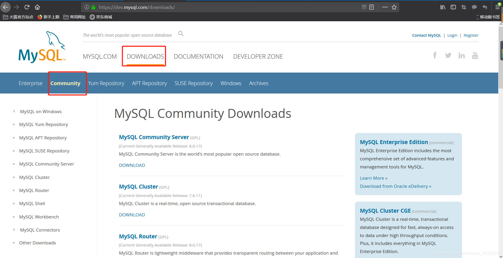
2. 下载对应的版本
    点击上图的**MySQL Community Server**,进入下载界面：
    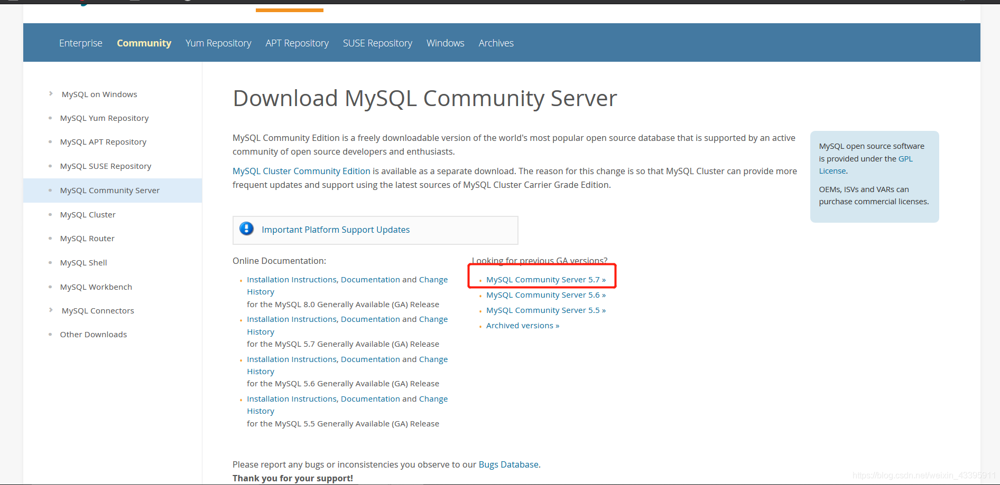找到**MySQL Community Server 5.7**这一链接，点击进入：
    根据你电脑的版本选择**下载对应的ZIP文件**，我的电脑是64位的，因此选择这项进行下载，点击**Download**会进入以下界面：
    点击**No thanks，just start my download**就好，然后开始下载
    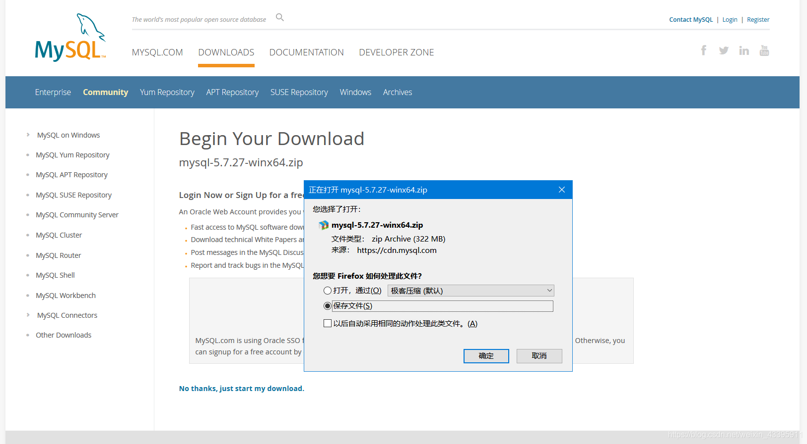下载完毕后将文件解压到你想保存到的盘和目录内。我是将文件解压到**E:\Program Files\Mysql**目录下面。
    
    以上就完成了下载的全部工作。

### 2.配置环境变量

1. 系统—>高级系统设置—>环境变量—>系统变量
    点击**新建**，变量名为：**MYSQL_HOME**，添加你的mysql-5.7.27-winx64文件夹所在位置。
    我的是在**E:\Program Files\Mysql\mysql-5.7.27-winx64**，如图：
    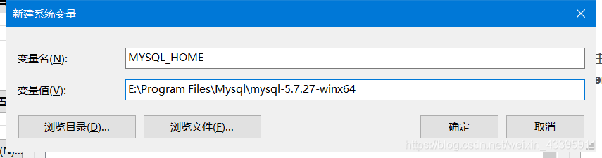
2. 编辑Path，复制`;%MYSQL_HOME%\bin`到原有值的后面，如图：
    

###3.配置my.ini文件

在你的mysql-5.7.27-winx64目录下新建my.ini文件，我的是在E:\Program Files\Mysql\mysql-5.7.27-winx64目录下新建，my.ini文件的内容为：

```sql
[mysqld]
#端口号
port = 3306
#mysql-5.7.27-winx64的路径
basedir=E:\\Program Files\\Mysql\\mysql-5.7.27-winx64
#mysql-5.7.27-winx64的路径+\\data
datadir=E:\\Program Files\\Mysql\\mysql-5.7.27-winx64\\data 
#最大连接数
max_connections=200
#编码
character-set-server=utf8

default-storage-engine=INNODB

sql_mode=NO_ENGINE_SUBSTITUTION,STRICT_TRANS_TABLES

[mysql]
#编码
default-character-set=utf8 

```


 创建完成后进入下一步。

### 4.安装MySQL

1.在输入框内输入cmd，**以管理员的身份运行**，注意这里**一定一定一定要以管理员的身份运行**，否则在安装过程中会出现因为管理权限不够而导致的**Install/Remove of the Service Denied!（安装/卸载服务被拒绝）**，这一点非常重要！
 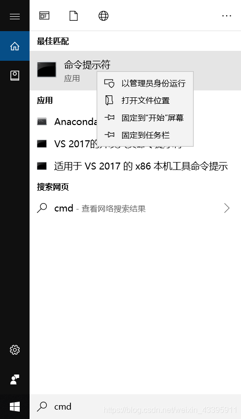

1. 在**cmd**中进入到**E:\Program Files\Mysql\mysql-5.7.27-winx64\bin**目录下:
    输入安装命令：`mysqld -install`，若出现**Service successfully installed**，证明安装成功；如出现**Install of the Service Denied**，则说明没有以管理员权限来运行cmd：
    
    然后继续输入命令：`mysqld --initialize`，此时不会有任何提示：
    
    再输入启动命令：`net start mysql`，出现以下提示证明MySQL启动成功：
    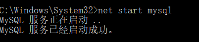

### 5.设置MySQL密码

1.在这里设置密码主要是为了解决：ERROR 1045 (28000): Access denied for user ‘root’@‘localhost’ (using password: NO)的问题
 \2. 首先停止MySQL服务,输入命令行`net stop mysql`：
 
 \3. 在E:\Program Files\Mysql\mysql-5.7.27-winx64目录下找到**my.ini**，在[mysqld]字段下任意一行添加`skip-grant-tables`，保存即可：
 \4. 重启MySQL,输入启动命令：`net start mysql`，出现以下提示证明MySQL启动成功：
 
 在输入命令`mysql -u root -p`，不需要输入密码，直接回车：
 进入MySQL成功！
 \5. 输入命令行`use mysql`，进入数据库：
 
 6.输入命令行`update user set authentication_string=password("root") where user="root";`root是你设置的新密码，敲击回车后若出现以下信息，证明修改成功！
 
 \7. 手动停止MySQL服务，在win10搜索栏内输入**服务**，找到**MySQL**。点击右键，然后点击停止即可。
 然后在刚刚的my.ini文件中删除**skip-grant-tables**这一行，保存关闭。
 \8. 再次启动cmd（管理员身份），输入启动命令：`net start mysql`，再输入`mysql -u root -p`，再输入你刚刚设置的密码，出现以下信息证明设置成功！
 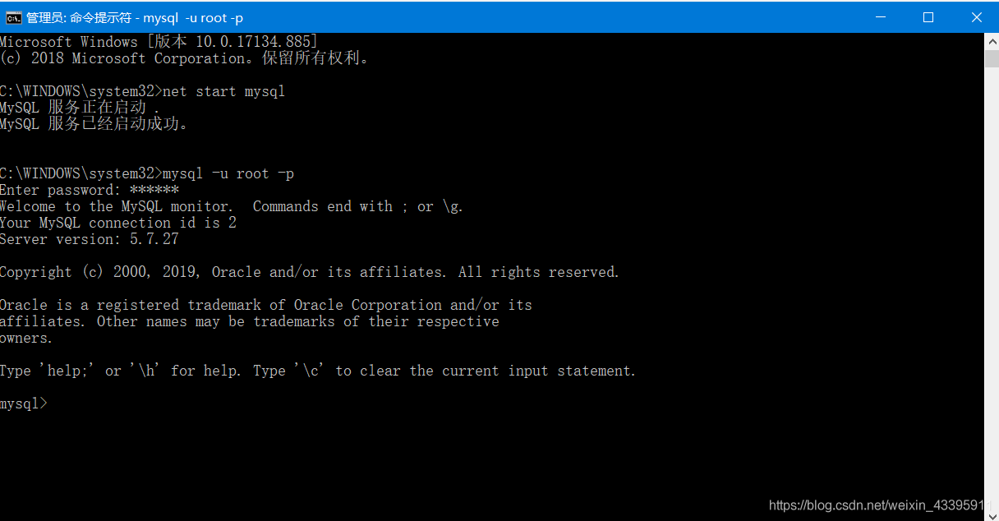然后输入命令行`use mysql`验证一下，结果报错：
 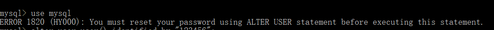既然没有重置密码，那就重置一下呗
 键入命令行`alter user user() identified by "xxxxxx";`我的密码是123456，因此我键入 `alter user user() identified by "123456";`回车！离胜利越来越近了！
 再次输入命令行`use mysql`验证一下，成功！
 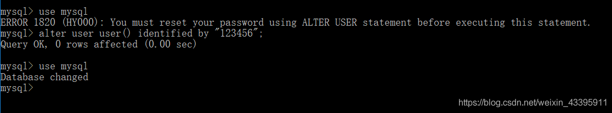

### 卸载

####删除Mysql文档

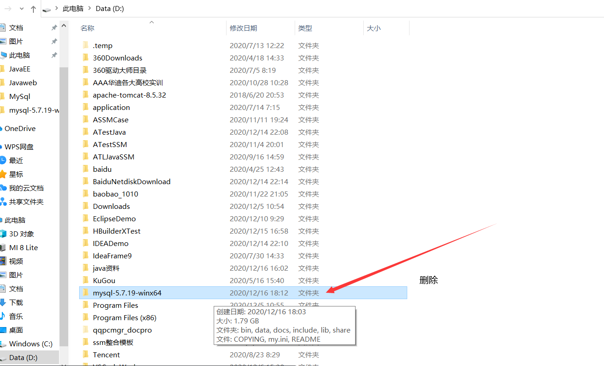


#### 删除Mysql文件夹


#### 删除环境变量

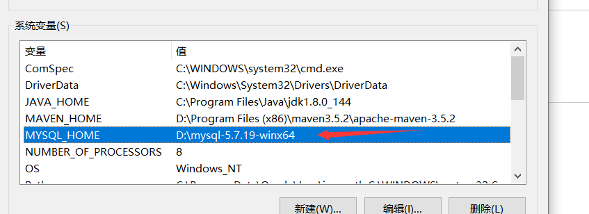

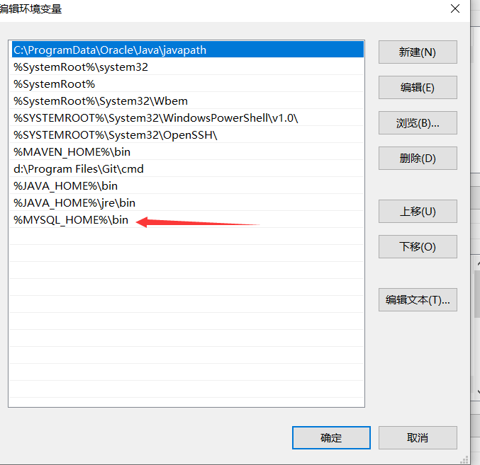

#### 命令行删除

卸载mysql后再安装输入mysqld --install 回车后提示The service already exists!


原因：卸载的时候没有卸载干净

方法：

一、重新以管理员身份打开cmd

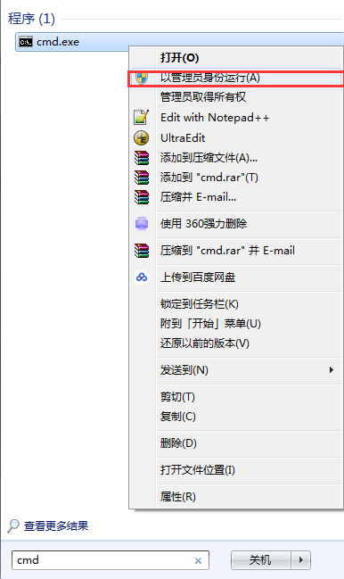

二、输入命令sc query mysql 查看名为mysql的服务


 三、输入命令sc delete mysql，删除该mysql 


四、再执行mysqld --install 就能成功了


### 总结

安装途中会遇到很多问题，在此总结并附上解决链接：
 1.[找不到my.ini文件](https://blog.csdn.net/baidu_41909653/article/details/82148455)
 2.[ERROR 1045 (28000): Access denied for user ‘ODBC’@‘localhost’ (using password: NO)](https://blog.csdn.net/weixin_44537194/article/details/88261364)
 3.[ERROR 1045 (28000): Access denied for user ‘ODBC’@‘localhost’ (using password: YES)](https://blog.csdn.net/weixin_41688619/article/details/79879003)
 4.[Unknown column ‘password’ in ‘field list’](https://blog.csdn.net/u010603691/article/details/50379282)
 5.[You must reset your password using ALTER USER statement before executing this statement](https://blog.csdn.net/hj7jay/article/details/65626766)