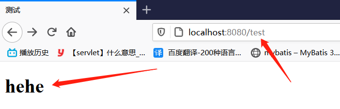
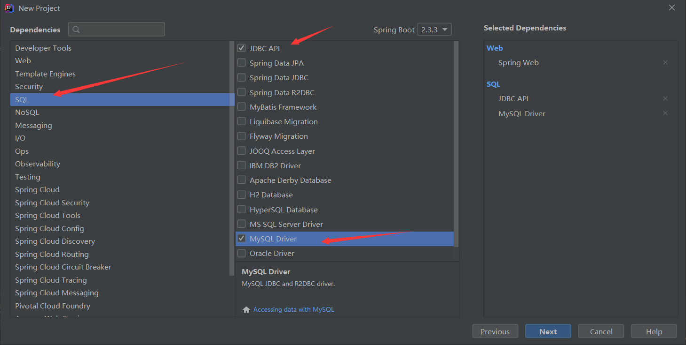
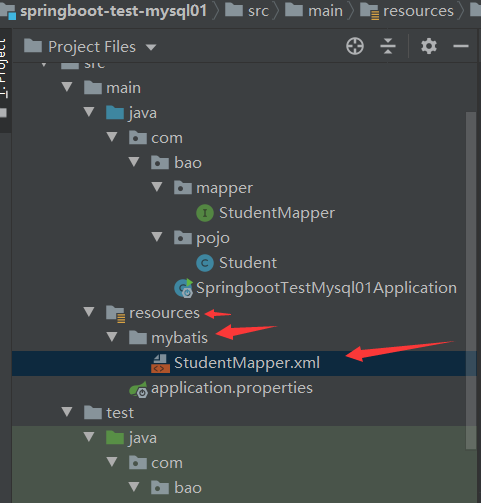

	typora-root-url: images

## 6、Thymeleaf

### 模板引擎

前端交给我们的页面，是html页面。如果是我们以前开发，我们需要把他们转成jsp页面，jsp好处就是当我们查出一些数据转发到JSP页面以后，我们可以用jsp轻松实现数据的显示，及交互等。

jsp支持非常强大的功能，包括能写Java代码，但是呢，我们现在的这种情况，SpringBoot这个项目首先是以jar的方式，不是war，第二，我们用的还是嵌入式的Tomcat，所以，**他现在默认是不支持jsp的**。

那么不支持jsp，直接用纯静态页面的方式开发会带来非常大的麻烦，这就需要用到thymeleaf模板引擎


**SpringBoot推荐使用模板引擎：**

模板引擎的作用就是我们来写一个页面模板，比如有些值，是动态的，我们写一些表达式。而这些值，从哪来呢，就是我们在后台封装一些数据。然后把这个模板和这个数据交给我们模板引擎，模板引擎按照我们这个数据帮你把这表达式解析、填充到我们指定的位置，然后把这个数据最终生成一个我们想要的内容给我们写出来，这就是我们这个模板引擎，不管是jsp模板引擎还是其他模板引擎，都是这个思想。不同模板引擎之间，语法不一样。Thymeleaf模板引擎是一个高级语言的模板引擎，语法简单、功能强大。

### 简单使用Thymeleaf

1. 导入对应的pom依赖：

   1. ```xml
      <!--导入thymeleaf依赖-->
      <dependency>
          <groupId>org.springframework.boot</groupId>
          <artifactId>spring-boot-starter-thymeleaf</artifactId>
      </dependency>
      ```

2. 编写前端html页面

   1. ```html
      <!DOCTYPE html>
      <!--使用thymeleaf需要导入约束-->
      <html lang="en" xmlns:th="http://www.thymeleaf.org">
      <head>
          <meta charset="UTF-8">
          <title>测试</title>
      </head>
      <body>
          <h1>hehe</h1>
      
          <!--所有的html元素都可以被Thymeleaf替换接管： th:元素名-->
          <div th:text="${msg}"></div>
      </body>
      </html>
      ```

3. 编写controller层

   1. ```java
      package com.bao.controller;
      
      import org.springframework.stereotype.Controller;
      import org.springframework.ui.Model;
      import org.springframework.web.bind.annotation.RequestMapping;
      
      @Controller
      public class DemoTest {
      
          @RequestMapping("/test")
          public String test1(Model model){
              model.addAttribute("msg","hello,thymeleaf");
              return "test";
          }
      }
      
      ```

4. 访问结果

   1. 

### Thymeleaf 简单语法学习

1、 我们编写一个Controller，放一些数据

```java
package com.bao.controller;

import org.springframework.stereotype.Controller;
import org.springframework.ui.Model;
import org.springframework.web.bind.annotation.RequestMapping;

import java.util.Arrays;

@Controller
public class DemoTest {

    @RequestMapping("/test")
    public String test1(Model model){
        model.addAttribute("msg","hello,thymeleaf");
        model.addAttribute("msg1","<h1>hello,thymeleaf</h1>");
        model.addAttribute("users", Arrays.asList("孙七","周八","吴九"));//存一个list集合
        return "test";
    }
}

```

2、页面

```html
<!DOCTYPE html>
<!--使用thymeleaf需要导入约束-->
<html lang="en" xmlns:th="http://www.thymeleaf.org">
<head>
    <meta charset="UTF-8">
    <title>测试</title>
</head>
<body>
    <h1>hehe</h1>

    <!--所有的html元素都可以被Thymeleaf替换接管： th:元素名-->
    <div th:text="${msg}"></div>

    <!--utext和text的区别：
        utext：会解析html，展示相应的样式
        text：不会解析html-->
    <div th:utext="${msg1}"></div>
    <div th:text="${msg1}"></div>
    
	<!--与foreach类似，用于遍历集合-->
    <h1 th:each="user:${users}" th:text="${user}"></h1>

</body>
</html>
```

3、访问结果


## 7、整合MyBatis

### 0、搭建环境

1. 

2. 数据库创建数据

   ```sql
   DROP TABLE IF EXISTS `student`;
   CREATE TABLE `student`  (
     `id` int(10) NOT NULL AUTO_INCREMENT,
     `name` varchar(255) CHARACTER SET utf8 COLLATE utf8_general_ci NOT NULL,
     PRIMARY KEY (`id`) USING BTREE
   ) ENGINE = InnoDB AUTO_INCREMENT = 6 CHARACTER SET = utf8 COLLATE = utf8_general_ci ROW_FORMAT = Dynamic;
   
   INSERT INTO `student` VALUES (1, '刘一');
   INSERT INTO `student` VALUES (2, '陈二');
   INSERT INTO `student` VALUES (3, '张三');
   INSERT INTO `student` VALUES (4, '李四');
   ```

   

### 1、导入 Mybatis与SpringBoot整合所需要的依赖

```xml
<dependency>
    <groupId>org.mybatis.spring.boot</groupId>
    <artifactId>mybatis-spring-boot-starter</artifactId>
    <version>2.1.1</version>
</dependency>
```

### 2、配置数据库连接信息

```properties
spring.datasource.username=root
spring.datasource.password=root
spring.datasource.url=jdbc:mysql://localhost:3306/springboot?serverTimezone=UTC&useUnicode=true&characterEncoding=utf-8
spring.datasource.driver-class-name=com.mysql.cj.jdbc.Driver

#整合mybatis
#设置别名
mybatis.type-aliases-package=com.bao.pojo
#设置mapper的地址
mybatis.mapper-locations=classpath:mybatis/*.xml
```

 

### **4、创建实体类，导入 Lombok！**

Student.java

```java
package com.bao.pojo;

import lombok.AllArgsConstructor;
import lombok.Data;
import lombok.NoArgsConstructor;
import org.springframework.stereotype.Component;

@Component
@Data
@NoArgsConstructor
@AllArgsConstructor
public class Student {
    private Integer id;
    private String name;
}
```

### **5、创建mapper目录以及对应的 Mapper 接口**

StudentMapper.java

```java
package com.bao.mapper;

import com.bao.pojo.Student;
import org.apache.ibatis.annotations.Mapper;
import org.springframework.stereotype.Repository;

import java.util.List;

@Repository
@Mapper//证明该类是一个Mapper类
public interface StudentMapper {
    /*查询所有*/
    List<Student> queryStudenAll();

    /*通过id查询学生信息*/
    Student queryStudentById(Integer id);
}

```

### **6、对应的Mapper映射文件**

StudentMapper.xml

位置：

​	

```xml
<?xml version="1.0" encoding="UTF-8" ?>
<!DOCTYPE mapper
        PUBLIC "-//mybatis.org//DTD Config 3.0//EN"
        "http://mybatis.org/dtd/mybatis-3-mapper.dtd">
<mapper namespace="com.bao.mapper.StudentMapper">
    <select id="queryStudenAll" resultType="Student">
        select * from student
    </select>
    
    <select id="queryStudentById" resultType="Student" parameterType="int">
        select * from student where id = #{id}
    </select>

</mapper>
```

### **7、maven配置资源过滤问题**

```xml
<resources>
    <resource>
        <directory>src/main/java</directory>
        <includes>
            <include>**/*.xml</include>
        </includes>
        <filtering>true</filtering>
    </resource>
</resources>
```

**8、编写测试**

```java
@Autowired
private StudentMapper studentMapper;

@Test
void contextLoads() {
    List<Student> students = studentMapper.queryStudenAll();
    for (Student student : students) {
        System.out.println(student);
    }
    System.out.println("------------");
    Student student = studentMapper.queryStudentById(2);
    System.out.println(student);

}
```


### 8、导入Lombok

```xml
<!-- https://mvnrepository.com/artifact/org.projectlombok/lombok -->
<dependency>
    <groupId>org.projectlombok</groupId>
    <artifactId>lombok</artifactId>
    <version>1.18.12</version>
</dependency>
```


### 9、增删改

1. Mapper接口

   1. ```xml
      <insert id="addStudent" parameterType="Student">
          insert into student(name) values (#{name});
      </insert>
      
      <delete id="deleteStudentById" parameterType="int">
          delete from student where id = #{id}
      </delete>
      
      <update id="updateSudentById" parameterType="Student">
          update student
          <set>
              <if test="name != null and name != ''">
                  name = #{name}
              </if>
          </set>
          where id = #{id};
      </update>
      ```

2. Mapper映射文件

   1. ```java
      @Autowired
      private StudentMapper studentMapper;
      
      @Test
      void contextLoads() {
          int i = studentMapper.addStudent(new Student("赵六"));
          List<Student> students = studentMapper.queryStudenAll();
          for (Student student : students) {
              System.out.println(student);
          }
          System.out.println("------------");
          studentMapper.updateSudentById(new Student(5, "孙七"));
          List<Student> students2 = studentMapper.queryStudenAll();
          for (Student student : students2) {
              System.out.println(student);
          }
          System.out.println("------------");
          int i1 = studentMapper.deleteStudentById(5);
          List<Student> students3 = studentMapper.queryStudenAll();
          for (Student student : students3) {
              System.out.println(student);
          }
      
      }
      ```

      