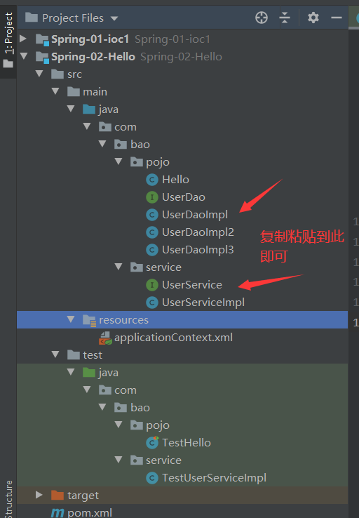
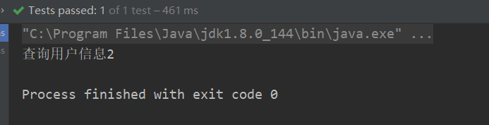

# Spring简介

## 简介

2002年，Rod Jahnson首次推出了Spring框架雏形interface21框架。

2004年3月24日，Spring框架以interface21框架为基础，经过重新设计，发布了1.0正式版。

很难想象Rod Johnson的学历 , 他是悉尼大学的博士，然而他的专业不是计算机，而是音乐学。

Spring理念 : 使现有技术更加实用 . 本身就是一个大杂烩 , **整合现有的框架技术**

## 优点

> 1. Spring是一个开源免费的框架 , 容器
> 2. Spring是一个轻量级的框架 , 非侵入式的
>    1. 轻量级：本身很小
>    2. 非侵入式：使用它不会影响原来代码的情况
> 3. 控制反转 IoC  , 面向切面 Aop
> 4. 对事物的支持 , 对框架的支持
> 5. 一句话概括：Spring是一个轻量级的控制反转(IoC)和面向切面(AOP)的容器（框架）。
>

## 组成


> 各模块概述

**1. 核心容器SpringCode：** 核心容器提供Spring框架的基本功能。—-它主要的组件就是BeanFactory,是工厂模式的实现。同时BeanFactory适用控制反转（IOC）思想将应用程序的配置和依赖性规范与实际的应用程序分开。

**2. Spring Context：** Spring上下文是一个配置文件，主要向框架提供上下文信息。

**3. SpringAop：** 通过配置管理特性，SpringAOP模块直接将面向切面地编程功能集成到了Spring框架中，所以，它可以很容易地使Spring框架管理的任何对象支持AOP。SpringAOP模块也是基于Spring的应用程序中的对象提供了事务管理服务。—–比较强大的功能

**4. SpringDAO：** 它主要和dao层相关联,可以用该结构来管理异常处理和不同数据库供应商抛出的错误信息。其中异常层次结构简化了错误处理，并且极大地降低了需要编写地异常代码数据（例如打开和关闭连接）。

**5. Spring ORM ：** Spring框架中插入了若干个ORM框架，从而提供了ORM的对象关系工具，其中包括 JDO、Hibernate 和 iBatis SQL Map。所有这些都遵从 Spring 的通用事务和 DAO 异常层次结构。

**6. SpringWEB模块：** Web 上下文模块建立在应用程序上下文模块之上，为基于 Web 的应用程序提供了上下文。Web 模块还简化了处理多部分请求以及将请求参数绑定到域对象的工作。

**7. SpringMVC**：MVC 框架是一个全功能的构建 Web 应用程序的 MVC  实现。通过策略接口，MVC 框架变成为高度可配置的，MVC 容纳了大量视图技术，其中包括  JSP、FreeMarker、Velocity、Tiles（jsp布局）、iText（报表处理） 和 poi。

##拓展

**Spring Boot与Spring Cloud**

- Spring Boot 是 Spring 的一套快速配置脚手架，可以基于Spring Boot 快速开发单个微服务;
- Spring Cloud是基于Spring Boot实现的；
- Spring Boot专注于快速、方便集成的单个微服务个体，Spring Cloud关注全局的服务治理框架；
- Spring Boot使用了约束优于配置的理念，很多集成方案已经帮你选择好了，能不配置就不配置 , Spring Cloud很大的一部分是基于Spring Boot来实现，Spring Boot可以离开Spring Cloud独立使用开发项目，但是Spring Cloud离不开Spring Boot，属于依赖的关系。
- SpringBoot在SpringClound中起到了承上启下的作用，如果你要学习SpringCloud必须要学习SpringBoot。

# IOC理论推导

## 环境搭建并测试

### 导入依赖

```xml
<!-- 导入这一个包，可以同时导入Spring的其他核心jar包 -->
<dependency>
    <groupId>org.springframework</groupId>
    <artifactId>spring-webmvc</artifactId>
    <version>5.2.0.RELEASE</version>
</dependency>
<!-- spring与mybatis整合所需要的包 -->
<dependency>
    <groupId>org.springframework</groupId>
    <artifactId>spring-jdbc</artifactId>
    <version>5.3.4</version>
</dependency>
```

### dao层接口

```java
package com.bao.dao;

public interface UserDao {
    String show();
}
```

### dao层实现类

```java
package com.bao.dao;

public class UserDaoImpl implements UserDao {

    @Override
    public String show() {
        return "查询用户信息";
    }
}
```

```java
package com.bao.dao;

public class UserDaoImpl2 implements UserDao {

    @Override
    public String show() {
        return "查询用户信息2";
    }
}
```

```java
package com.bao.dao;

public class UserDaoImpl3 implements UserDao {

    @Override
    public String show() {
        return "查询用户信息3";
    }
}
```

### service层接口

```java
package com.bao.service;

public interface UserService {
    String show();
}
```

### service层实现类

```java
package com.bao.service;

import com.bao.dao.UserDao;
import com.bao.dao.UserDaoImpl;
import com.bao.dao.UserDaoImpl2;
import com.bao.dao.UserDaoImpl3;

public class UserServiceImpl implements UserService{
    private UserDao userDao = new UserDaoImpl3();

    @Override
    public String show() {
        return userDao.show();
    }
}
```

### 测试

```java
package com.bao.service;

import org.junit.Test;

public class TestUserService {
    @Test
    public void showTest(){
        UserService userService = new UserServiceImpl();
        System.out.println(userService.show());
    }
}
```

### 说明

> 在操作过程中，我们发现，在我们写完的原有的功能基础之上，当用户的请求发生变化时，我们需要手动修改代码，这说明我们的代码设计的不够合理，我们需要进行设计的优化

### 优化

#### 第一种：set注入

1. dao层不变

2. service层接口不变

3. service层实现类

   ```java
   package com.bao.service;
   
   import com.bao.dao.UserDao;
   import com.bao.dao.UserDaoImpl;
   import com.bao.dao.UserDaoImpl2;
   import com.bao.dao.UserDaoImpl3;
   
   public class UserServiceImpl implements UserService{
       /*private UserDao userDao = new UserDaoImpl3();*/
       private UserDao userDao;
   
       public void setUserDao(UserDao userDao) {
           this.userDao = userDao;
       }
   
       @Override
       public String show() {
           return userDao.show();
       }
   }
   ```

4. 测试类

   ```java
   package com.bao.service;
   
   import com.bao.dao.UserDaoImpl2;
   import com.bao.dao.UserDaoImpl3;
   import org.junit.Test;
   
   public class TestUserService {
       @Test
       public void showTest(){
           UserService userService = new UserServiceImpl();
           ((UserServiceImpl) userService).setUserDao(new UserDaoImpl2());
           System.out.println(userService.show());
       }
   }
   ```

#### 第二种：构造器注入

1. dao层不变

2. service层接口不变

3. service层实现类

   ```java
   package com.bao.service;
   
   import com.bao.dao.UserDao;
   import com.bao.dao.UserDaoImpl;
   import com.bao.dao.UserDaoImpl2;
   import com.bao.dao.UserDaoImpl3;
   
   public class UserServiceImpl implements UserService{
       /*private UserDao userDao = new UserDaoImpl3();*/
       private UserDao userDao;
   
       public UserServiceImpl(UserDao userDao) {
           this.userDao = userDao;
       }
   
       @Override
       public String show() {
           return userDao.show();
       }
   }
   ```

4. 测试类

   ```java
   package com.bao.service;
   
   import com.bao.dao.UserDaoImpl2;
   import com.bao.dao.UserDaoImpl3;
   import org.junit.Test;
   
   public class TestUserService {
       @Test
       public void showTest(){
           UserService userService = new UserServiceImpl(new UserDaoImpl3());
           System.out.println(userService.show());
       }
   }
   ```

### 说明

      1. 之前由程序员创建对象，控制权（创建对象的控制权）在程序员手上
      2. 使用了set或constructor注入时控制权交给了调用者（用户），程序不再有主动性，而是变成了被动的接受对象
      3. 这种思想，从本质上解决了问题程序员管理对象的创建的问题，系统的耦合性大大降低，这是ioc的原型

## IOC的本质

> 1. **控制反转IoC(Inversion of Control)，是一种设计思想，DI(依赖注入)是实现IoC的一种方法**，也有人认为DI只是IoC的另一种说法。没有IoC的程序中 , 我们使用面向对象编程 , 对象的创建与对象间的依赖关系完全编码在程序中，对象的创建由程序自己控制，控制反转后将对象的创建转移给第三方
> 2. 总结：控制反转就是创建对象的控制权反转了，由程序员反转到用户手上了
> 3. **IoC是Spring框架的核心内容**，使用多种方式完美的实现了IoC，可以使用XML配置，也可以使用注解，新版本的Spring也可以零配置实现IoC。Spring容器在初始化时先读取配置文件，根据配置文件或元数据创建与组织对象存入容器中，程序使用时再从Ioc容器中取出需要的对象。
> 4. 采用XML方式配置Bean的时候，Bean的定义信息是和实现分离的，而采用注解的方式可以把两者合为一体，Bean的定义信息直接以注解的形式定义在实现类中，从而达到了零配置的目的
> 
>**总结：控制反转是一种通过描述（XML或注解）并通过第三方去生产或获取特定对象的方式。在Spring中实现控制反转的是IoC容器，其实现方法是依赖注入（Dependency Injection,DI）。**

# Spring入门 

## 导入spring-webmvc坐标

```xml
<dependency>
    <groupId>org.springframework</groupId>
    <artifactId>spring-webmvc</artifactId>
    <version>5.2.0.RELEASE</version>
</dependency>
```

## 创建实体类Hello

```java
package com.bao.pojo;

public class Hello {
    private String talk;

    @Override
    public String toString() {
        return "Hello{" +
                "talk='" + talk + '\'' +
                '}';
    }

    public String getTalk() {
        return talk;
    }

    public void setTalk(String talk) {
        this.talk = talk;
    }
}
```

## 创建spring的配置文件


文件名称为：applicationContext.xml

```xml
<?xml version="1.0" encoding="UTF-8"?>
<beans xmlns="http://www.springframework.org/schema/beans"
       xmlns:xsi="http://www.w3.org/2001/XMLSchema-instance"
       xsi:schemaLocation="http://www.springframework.org/schema/beans
       http://www.springframework.org/schema/beans/spring-beans.xsd">
    <!--使用Spring来创建对象，在spring中这些对象都被称之为bean;
        注意：交给Spring创建对象的前提是需要类创建了相应的set方法！！！-->
    <!--id:相当于对象名（变量名）
        class：该类型的全限定名称
        property:设置该对象的属性
        name：该对象的属性名
        value：属性具体的值，只能写基本数据类型
        ref：引用spring容器中创建好的对象
    -->
    <bean id="hello" class="com.bao.pojo.Hello">
        <property name="talk" value="你好，Spring"/>
    </bean>
</beans>
```

## 测试类

```java
package com.bao.pojo;

import org.junit.Test;
import org.springframework.context.support.ClassPathXmlApplicationContext;

public class TestHello {
    @Test
    public void Test1(){
        ClassPathXmlApplicationContext context =
                new ClassPathXmlApplicationContext("applicationContext.xml");
        Hello hello = (Hello) context.getBean("hello");
        System.out.println(hello.toString());
    }
}
```

## 结果


# 多个bean

## 实体类



## 配置文件

```xml
<?xml version="1.0" encoding="UTF-8"?>
<beans xmlns="http://www.springframework.org/schema/beans"
       xmlns:xsi="http://www.w3.org/2001/XMLSchema-instance"
       xsi:schemaLocation="http://www.springframework.org/schema/beans
       http://www.springframework.org/schema/beans/spring-beans.xsd">
    <!--使用Spring来创建对象，在spring中这些对象都被称之为bean;
        注意：交给Spring创建对象的前提是需要类创建了相应的set方法！！！-->
    <!--id:相当于对象名（变量名）
        class：该类型的全限定名称
        property:设置该对象的属性
        name：该对象的属性名
        value：具体的值，基本数据类型
        ref：引用spring容器中创建好的对象
    -->
    <bean id="hello" class="com.bao.pojo.Hello">
        <property name="talk" value="你好，Spring"/>
    </bean>

    <bean id="userDaoImpl" class="com.bao.pojo.UserDaoImpl"/>
    <bean id="userDaoImpl2" class="com.bao.pojo.UserDaoImpl2"/>
    <bean id="userDaoImpl3" class="com.bao.pojo.UserDaoImpl3"/>
    <!--注意：交给Spring创建对象的前提是需要类创建了相应的set方法-->
    <bean id="userServiceImpl" class="com.bao.service.UserServiceImpl">
        <property name="userDao" ref="userDaoImpl2"/>
    </bean>
</beans>
```

## 测试类

```java
package com.bao.service;

import org.junit.Test;
import org.springframework.context.ApplicationContext;
import org.springframework.context.support.ClassPathXmlApplicationContext;

public class TestUserServiceImpl {
    @Test
    public void showTest(){
        ApplicationContext context = new ClassPathXmlApplicationContext("applicationContext.xml");
        UserService userServiceImpl = (UserService) context.getBean("userServiceImpl");
        System.out.println(userServiceImpl.show());
    }
}
```

## 结果



# IOC创建对象的方式

## 无参构造方式创建（默认方式）

### 思路

> 在实体类中创建有参构造，覆盖无参构造方法

### 实体类

```java
package com.bao.pojo;

public class Hello {
    private String string;

    /*创建有参构造，覆盖无参构造方法*/
    public Hello(String string) {
        this.string = string;
    }

    @Override
    public String toString() {
        return "Hello{" +
                "string='" + string + '\'' +
                '}';
    }

    public String getString() {
        return string;
    }

    public void setString(String string) {
        this.string = string;
    }

}
```

### 配置文件


### 测试

```java
package com.bao.pojo;

import org.junit.Test;
import org.springframework.context.support.ClassPathXmlApplicationContext;

public class TestHello {
    @Test
    public void Test1(){
        ClassPathXmlApplicationContext context =
                new ClassPathXmlApplicationContext("applicationContext.xml");
        Hello hello = (Hello) context.getBean("hello");
        System.out.println(hello.toString());
    }
}
```

### 测试结果


## 有参构造方式创建

### 实体类

```java
package com.bao.pojo;

public class User {
    private String name;

    @Override
    public String toString() {
        return "User{" +
                "name='" + name + '\'' +
                '}';
    }

    public User(String name) {
        this.name = name;
    }

    public String getName() {
        return name;
    }

    public void setName(String name) {
        this.name = name;
    }
}

```

### spring配置文件

```xml
<?xml version="1.0" encoding="UTF-8"?>
<beans xmlns="http://www.springframework.org/schema/beans"
       xmlns:xsi="http://www.w3.org/2001/XMLSchema-instance"
       xsi:schemaLocation="http://www.springframework.org/schema/beans
       http://www.springframework.org/schema/beans/spring-beans.xsd">

    <!--有参构造赋值：1.下标赋值-->
    <!--<bean id="user" class="com.bao.pojo.User">
        <constructor-arg index="0" value="陈一"/>
    </bean>-->
    <!--有参构造赋值：2.数据类型赋值（不建议使用）-->
    <!--<bean id="user" class="com.bao.pojo.User">
        <constructor-arg type="java.lang.String" value="刘一"/>
    </bean>-->
    <!--有参构造赋值：3.参数名赋值（常用）-->
    <bean id="user" class="com.bao.pojo.User">
        <constructor-arg name="name" value="陈二"/>
    </bean>
</beans>
```

### 测试类

```java
package com.bao.pojo;

import org.junit.Test;
import org.springframework.context.ApplicationContext;
import org.springframework.context.support.ClassPathXmlApplicationContext;

public class TestUser {
    @Test
    public void userTest1(){
        ApplicationContext context = new ClassPathXmlApplicationContext("applicationContext.xml");
        User user = (User) context.getBean("user");
        System.out.println(user);
    }
}
```

### 注意

```java
/*当读取配置文件，创建容器时就会创建容器中的所有bean*/
ApplicationContext context = new ClassPathXmlApplicationContext("applicationContext.xml");
/*无论获取几次相同的bean都是同一个，创建bena的方式是单例的*/
User user = (User) context.getBean("user");
User user1 = (User) context.getBean("user");
System.out.println(user == user1);
```


# Spring的配置

## 别名

### 配置文件

```xml
<bean id="user" class="com.bao.pojo.User">
    <constructor-arg index="0" value="陈二"/>
</bean>
<!--设置别名：相当于多了一个名字，两个名字都可以用-->
<alias name="user" alias="userNewName"/>
```

### 测试类

```java
package com.bao.pojo;

import org.junit.Test;
import org.springframework.context.ApplicationContext;
import org.springframework.context.support.ClassPathXmlApplicationContext;

public class TestUser {
    @Test
    public void userTest1(){
        /*当读取配置文件，创建容器时就会创建容器中的所有bean*/
        ApplicationContext context = new ClassPathXmlApplicationContext("applicationContext.xml");
        User user = (User) context.getBean("user");
        User userNewName = (User) context.getBean("userNewName");
        System.out.println(user);
        System.out.println(userNewName);
    }
}
```

##  Bean的配置

### 配置文件

```xml
<!--name:在标签内设置name属性也可以设置别名，并且可以设置多个别名；
    多个别名可以用“逗号”，“空格”，“分号”分割
    -->
<bean id="user" class="com.bao.pojo.User" name="u1,u2 u3;u4">
    <constructor-arg index="0" value="陈二"/>
</bean>
```

### 测试类

```java
package com.bao.pojo;

import org.junit.Test;
import org.springframework.context.ApplicationContext;
import org.springframework.context.support.ClassPathXmlApplicationContext;

public class TestUser {
    @Test
    public void userTest1(){
        /*当读取配置文件，创建容器时就会创建容器中的所有bean*/
        ApplicationContext context = new ClassPathXmlApplicationContext("applicationContext.xml");
        User userNewName1 = (User) context.getBean("u1");
        User userNewName2 = (User) context.getBean("u2");
        User userNewName3 = (User) context.getBean("u3");
        User userNewName4 = (User) context.getBean("u4");
        System.out.println(userNewName1);
        System.out.println(userNewName2);
        System.out.println(userNewName3);
        System.out.println(userNewName4);
    }
}
```

## import

1. import一般用于团队开发，它可以将多个配置文件导入合并为一个

2. 假设，现在项目中有多个人进行开发，这三个人负责不同的类开发，不同的类需要注册在不同的bean中，我们可以用import将多个bean.xml合并为一个总的

   ```xml
   <?xml version="1.0" encoding="UTF-8"?>
   <beans xmlns="http://www.springframework.org/schema/beans"
          xmlns:xsi="http://www.w3.org/2001/XMLSchema-instance"
          xsi:schemaLocation="http://www.springframework.org/schema/beans
          http://www.springframework.org/schema/beans/spring-beans.xsd">
   
       <import resource="bean1.xml"/>
       <import resource="bean2.xml"/>
   
   </beans>
   ```

4. 注意：bean1.xml和bean2.xml要有所区别，否则有可能会报错

# 依赖注入（Dependency injection）

## 理解

> 依赖：bean对象的创建依赖容器(Spring框架)
>
> 注入：bean对象的所有属性，在容器创建

## 构造器注入

​	前面已讲

## Set方式注入(重点)

### 实体类

```java
package com.bao.pojo;

public class Address {
    private String address;

    @Override
    public String toString() {
        return "Address{" +
                "address='" + address + '\'' +
                '}';
    }

    public String getAddress() {
        return address;
    }

    public void setAddress(String address) {
        this.address = address;
    }
}
```

```java
package com.bao.pojo;

import java.util.*;

public class Student {
    private String name;
    private Address address;
    private String[] books;
    private List<String> hobbys;
    private Map<String,String> card;//学籍信息
    private Set<String> games;
    private String wife;//妻子
    private Properties info;//信息

    @Override
    public String toString() {
        return "Student{" +
                "name='" + name + '\'' +
                ", address=" + address +
                ", books=" + Arrays.toString(books) +
                ", hobbys=" + hobbys +
                ", card=" + card +
                ", games=" + games +
                ", wife='" + wife + '\'' +
                ", info=" + info +
                '}';
    }

    public void setName(String name) {
        this.name = name;
    }

    public void setAddress(Address address) {
        this.address = address;
    }

    public void setBooks(String[] books) {
        this.books = books;
    }

    public void setHobbys(List<String> hobbys) {
        this.hobbys = hobbys;
    }

    public void setCard(Map<String, String> card) {
        this.card = card;
    }

    public void setGames(Set<String> games) {
        this.games = games;
    }

    public void setWife(String wife) {
        this.wife = wife;
    }

    public void setInfo(Properties info) {
        this.info = info;
    }
}
```

### 配置文件

```xml
<?xml version="1.0" encoding="UTF-8"?>
<beans xmlns="http://www.springframework.org/schema/beans"
       xmlns:xsi="http://www.w3.org/2001/XMLSchema-instance"
       xsi:schemaLocation="http://www.springframework.org/schema/beans http://www.springframework.org/schema/beans/spring-beans.xsd">

    <bean name="address" class="com.bao.pojo.Address">
        <property name="address" value="火星"/>
    </bean>

    <bean name="student" class="com.bao.pojo.Student">
        <!--普通注入-->
        <property name="name" value="刘一"/>
        <!--bean注入-->
        <property name="address" ref="address"/>
        <!--数组注入-->
        <property name="books">
            <array>
                <value>毛泽东自传</value>
                <value>机器的灵魂时代</value>
                <value>java编程与思想</value>
            </array>
        </property>
        <!--List注入-->
        <property name="hobbys">
            <list>
                <value>读书</value>
                <value>运动</value>
                <value>敲代码</value>
            </list>
        </property>
        <!--Map注入-->
        <property name="card">
            <map>
                <entry key="姓名" value="刘一"/>
                <entry key="学号" value="2020123"/>
            </map>
        </property>
        <!--Set注入-->
        <property name="games">
            <set>
                <value>俄罗斯方块</value>
                <value>魂斗罗</value>
                <value>合金弹头</value>
            </set>
        </property>
        <!--null值注入-->
        <property name="wife">
            <null/>
        </property>
        <!--properties注入-->
        <property name="info">
            <props>
                <prop key="java">100</prop>
                <prop key="Web">99</prop>
                <prop key="MySql">95</prop>
            </props>
        </property>
    </bean>

</beans>
```

### 测试类

```java
package com.bao.pojo;

import org.junit.Test;
import org.springframework.context.ApplicationContext;
import org.springframework.context.support.ClassPathXmlApplicationContext;

public class TestStudent {
    @Test
    public void MyTest1(){
        ApplicationContext context = new ClassPathXmlApplicationContext("applicationContext.xml");
        Student student = (Student) context.getBean("student");
        System.out.println(student);
        /*
        Student{
            name='刘一',
            address=Address{address='火星'},
            books=[毛泽东自传, 机器的灵魂时代, java编程与思想],
            hobbys=[读书, 运动, 敲代码],
            card={姓名=刘一, 学号=2020123},
            games=[俄罗斯方块, 魂斗罗, 合金弹头],
            wife='null',
            info={java=100, MySql=95, Web=99}}
         * */
    }
}
```

## 拓展方式注入

> 使用p命名和c命名注入

### 提前导入约束

```xml
xmlns:p="http://www.springframework.org/schema/p"
xmlns:c="http://www.springframework.org/schema/c"
```

### 配置类

```xml
<?xml version="1.0" encoding="UTF-8"?>
<beans xmlns="http://www.springframework.org/schema/beans"
       xmlns:xsi="http://www.w3.org/2001/XMLSchema-instance"
       xmlns:p="http://www.springframework.org/schema/p"
       xmlns:c="http://www.springframework.org/schema/c"
       xsi:schemaLocation="http://www.springframework.org/schema/beans
       http://www.springframework.org/schema/beans/spring-beans.xsd">

    <!--p命名空间的注入，可以直接注入简单属性的值 -property-->
    <bean id="user" class="com.bao.pojo.User" p:name="陈二" p:age="18"/>

    <!--c命名空间注入，通过构造器注入  -constructor-arg
        注：需要创建有参构造-->
    <bean id="userTwo" class="com.bao.pojo.User" c:name="郑十" c:age="19"/>

</beans>
```

### 测试类

```java
@Test
public void UserTest1(){
    ApplicationContext context = new ClassPathXmlApplicationContext("applicationContext.xml");
    User user = context.getBean("user", User.class);
    User userTwo = context.getBean("userTwo", User.class);
    System.out.println(user);
    System.out.println(userTwo);
}
```

## bean的作用域

> 作用域限定了Spring  Bean的作用范围，在Spring配置文件定义Bean时，通过声明scope配置项，可以灵活定义Bean的作用范围。例如，当你希望每次IOC容器返回的Bean是同一个实例时，可以设置scope为singleton；当你希望每次IOC容器返回的Bean实例是一个新的实例时，可以设置scope为prototype。
>

> scope配置项有5个属性，用于描述不同的作用域。
>

> ① singleton（默认值）
>
> 使用该属性定义Bean时，IOC容器仅创建一个Bean实例，IOC容器每次返回的是同一个Bean实例。
>
> ② prototype
>
> 使用该属性定义Bean时，IOC容器可以创建多个Bean实例，每次返回的都是一个新的实例。
>
> ③ request
>
> 该属性仅对HTTP请求产生作用，使用该属性定义Bean时，每次HTTP请求都会创建一个新的Bean，适用于WebApplicationContext环境。
>
> ④ session
>
> 该属性仅用于HTTP Session，同一个Session共享一个Bean实例。不同Session使用不同的实例。
>
> ⑤ global-session
>
> 该属性仅用于HTTP Session，同session作用域不同的是，所有的Session共享一个Bean实例。

singleton

```xml
<bean id="user" class="com.bao.pojo.User" p:name="陈二" p:age="18" scope="singleton"/>
```

```java
@Test
public void UserTest2(){
    ApplicationContext context = new ClassPathXmlApplicationContext("applicationContext.xml");
    User user1 = context.getBean("user", User.class);
    User user2 = context.getBean("user", User.class);
    System.out.println(user1 == user2);
}
```

prototype

```xml
<bean id="user" class="com.bao.pojo.User" p:name="陈二" p:age="18" scope="prototype"/>
```

```java
@Test
public void UserTest2(){
    ApplicationContext context = new ClassPathXmlApplicationContext("applicationContext.xml");
    User user1 = context.getBean("user", User.class);
    User user2 = context.getBean("user", User.class);
    System.out.println(user1 == user2);
}
```

# bean的自动装配

> 自动装配理解：自动给bean的属性赋值

##Spring中bean有三种装配机制

1. 在xml中显式配置(这是我们刚才一直使用的方式)
2. 在java中显式配置(后期再讲)
3. 隐式的自动装配bean(本章重点)

## 自动装配环境搭建

### 实体类

```java
package com.bao.pojo;

public class Cat {
    public void eat(){
        System.out.println("吃鱼");
    }
}
```

```java
package com.bao.pojo;

public class Dog {
    public void eat(){
        System.out.println("吃肉");
    }
}
```

```java
package com.bao.pojo;

public class People {
    private String name;
    private Dog dog;
    private Cat cat;

    @Override
    public String toString() {
        return "People{" +
                "name='" + name + '\'' +
                ", dog=" + dog +
                ", cat=" + cat +
                '}';
    }

    public String getName() {
        return name;
    }

    public void setName(String name) {
        this.name = name;
    }

    public Dog getDog() {
        return dog;
    }

    public void setDog(Dog dog) {
        this.dog = dog;
    }

    public Cat getCat() {
        return cat;
    }

    public void setCat(Cat cat) {
        this.cat = cat;
    }
}
```

### 配置文件

```xml
<?xml version="1.0" encoding="UTF-8"?>
<beans xmlns="http://www.springframework.org/schema/beans"
       xmlns:xsi="http://www.w3.org/2001/XMLSchema-instance"
       xsi:schemaLocation="http://www.springframework.org/schema/beans http://www.springframework.org/schema/beans/spring-beans.xsd">

    <bean id="dog" class="com.bao.pojo.Dog"/>
    <bean id="cat" class="com.bao.pojo.Cat"/>
    <bean id="people" class="com.bao.pojo.People">
        <property name="name" value="刘一"/>
        <property name="cat" ref="cat"/>
        <property name="dog" ref="dog"/>
    </bean>

</beans>
```

### 测试类

```java
import com.bao.pojo.People;
import org.junit.Test;
import org.springframework.context.ApplicationContext;
import org.springframework.context.support.ClassPathXmlApplicationContext;

public class MyTest {
    @Test
    public void MyTest1(){
        ApplicationContext context = new ClassPathXmlApplicationContext("applicationContext.xml");
        People people = context.getBean("people", People.class);
        System.out.println(people.getName());
        people.getCat().eat();
        people.getDog().eat();
    }

}
```

## ByName和byType自动装配

### 配置文件

```xml
<?xml version="1.0" encoding="UTF-8"?>
<beans xmlns="http://www.springframework.org/schema/beans"
       xmlns:xsi="http://www.w3.org/2001/XMLSchema-instance"
       xsi:schemaLocation="http://www.springframework.org/schema/beans http://www.springframework.org/schema/beans/spring-beans.xsd">

    <bean id="dog" class="com.bao.pojo.Dog"/>
    <bean id="cat" class="com.bao.pojo.Cat"/>
    <!--byName:会自动在容器的上下文中查找和自己对象set方法后面的属性名对应的beanid-->
    <!--<bean id="people" class="com.bao.pojo.People" autowire="byName">
        <property name="name" value="刘一"/>
    </bean>-->
    <!--byType:会自动在容器的上下文中查找和自己对象属性类型相同的bean-->
    <bean id="people" class="com.bao.pojo.People" autowire="byType">
        <property name="name" value="刘一"/>
    </bean>

</beans>
```

### 测试类

```java
import com.bao.pojo.People;
import org.junit.Test;
import org.springframework.context.ApplicationContext;
import org.springframework.context.support.ClassPathXmlApplicationContext;

public class MyTest {
    @Test
    public void MyTest1(){
        ApplicationContext context = new ClassPathXmlApplicationContext("applicationContext.xml");
        People people = context.getBean("people", People.class);
        System.out.println(people.getName());
        people.getCat().eat();
        people.getDog().eat();
    }

}
```

### 注意

> 1. byName:
>    1. 会自动在容器的上下文中查找和自己对象set方法后面的属性名对应的beanId
>    2. 要求所有的bean的id唯一
> 2. byType:
>    1. 会自动在容器的上下文中查找和自己对象属性类型相同的bean
>    2. 要求bean的类型唯一
>

## 使用注解自动装配

### 配置文件导入约束：context约束，同时添加注解支持

```xml
<?xml version="1.0" encoding="UTF-8"?>
<beans xmlns="http://www.springframework.org/schema/beans"
       xmlns:xsi="http://www.w3.org/2001/XMLSchema-instance"
       xmlns:context="http://www.springframework.org/schema/context"
       xsi:schemaLocation="http://www.springframework.org/schema/beans
       http://www.springframework.org/schema/beans/spring-beans.xsd
       http://www.springframework.org/schema/context
       http://www.springframework.org/schema/context/spring-context.xsd">

    <!--开启注解支持-->
    <context:annotation-config/>
    <bean id="dog" class="com.bao.pojo.Dog"/>
    <bean id="cat" class="com.bao.pojo.Cat"/>
    <bean id="people" class="com.bao.pojo.People"/>
</beans>
```

### 实体类中的属性添加@Autowired注解

```java
package com.bao.pojo;

import org.springframework.beans.factory.annotation.Autowired;

public class People {
    /**注意；配置文件中的bean标签的id值要与实体类的属性名一致**/
    private String name;
    @Autowired
    private Dog dog;
    @Autowired
    private Cat cat;

    @Override
    public String toString() {
        return "People{" +
                "name='" + name + '\'' +
                ", dog=" + dog +
                ", cat=" + cat +
                '}';
    }

    public String getName() {
        return name;
    }

    public Dog getDog() {
        return dog;
    }

    public Cat getCat() {
        return cat;
    }
}
```

### 测试类

```java
@Test
public void MyTest2(){
    ApplicationContext context = new ClassPathXmlApplicationContext("beans2.xml");
    People people = context.getBean("people", People.class);
    System.out.println(people.getName());
    people.getCat().eat();
    people.getDog().eat();
}
```

###注意

1. @Autowired直接在属性上使用即可，也可以直接在set方法上使用
2. 使用@Autowired可以不再编写set方法了，前提是你这个自动装配的的属性在IOC（Spring）容器中存在，且配置文件中的bean标签的id值要与实体类的属性名一致
