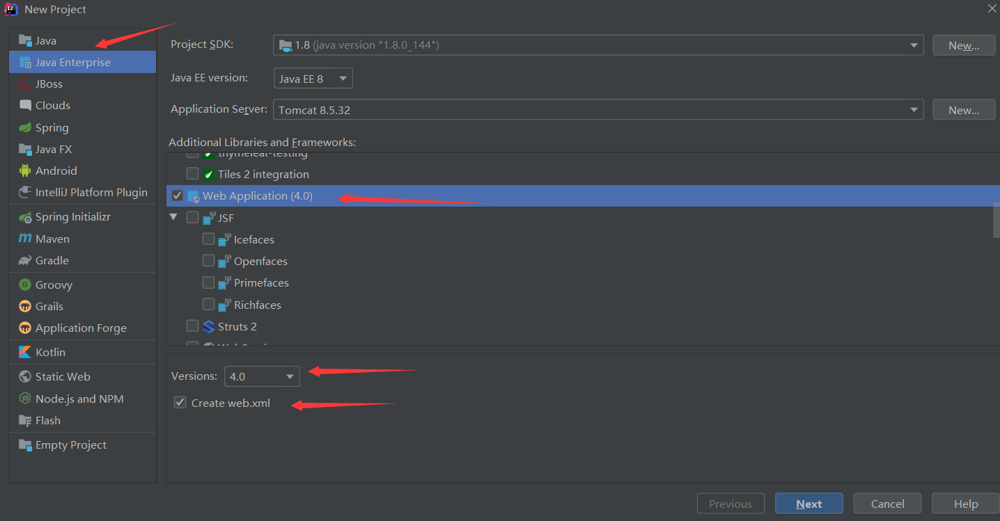
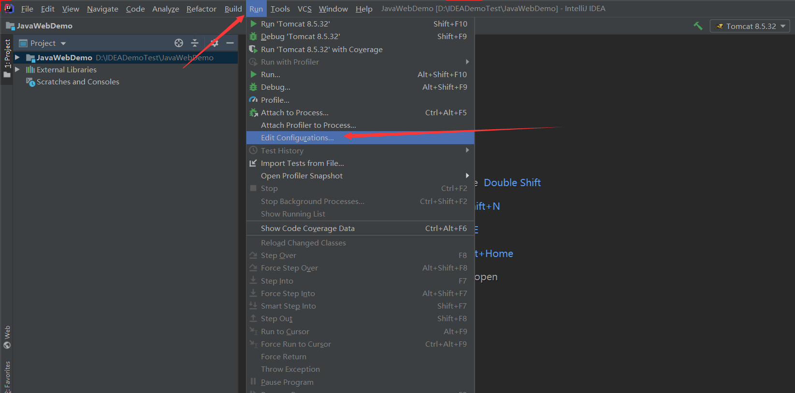
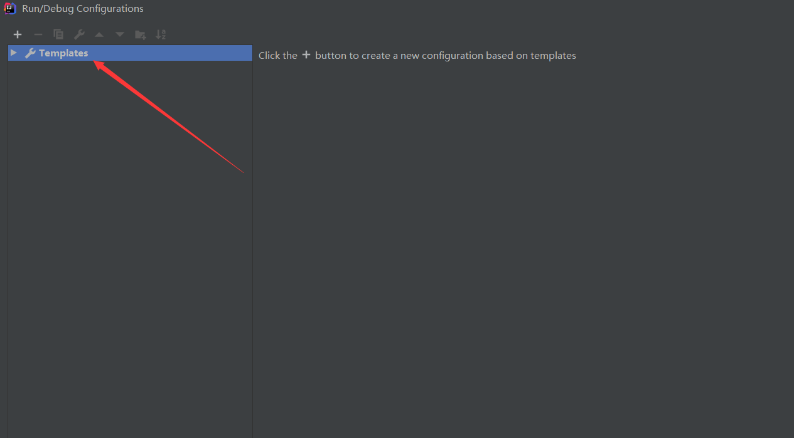
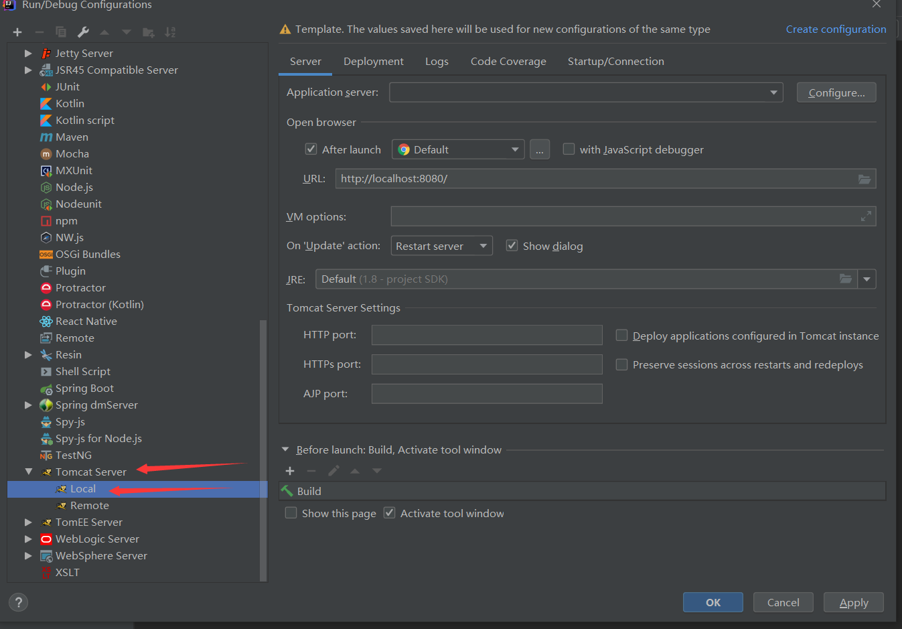
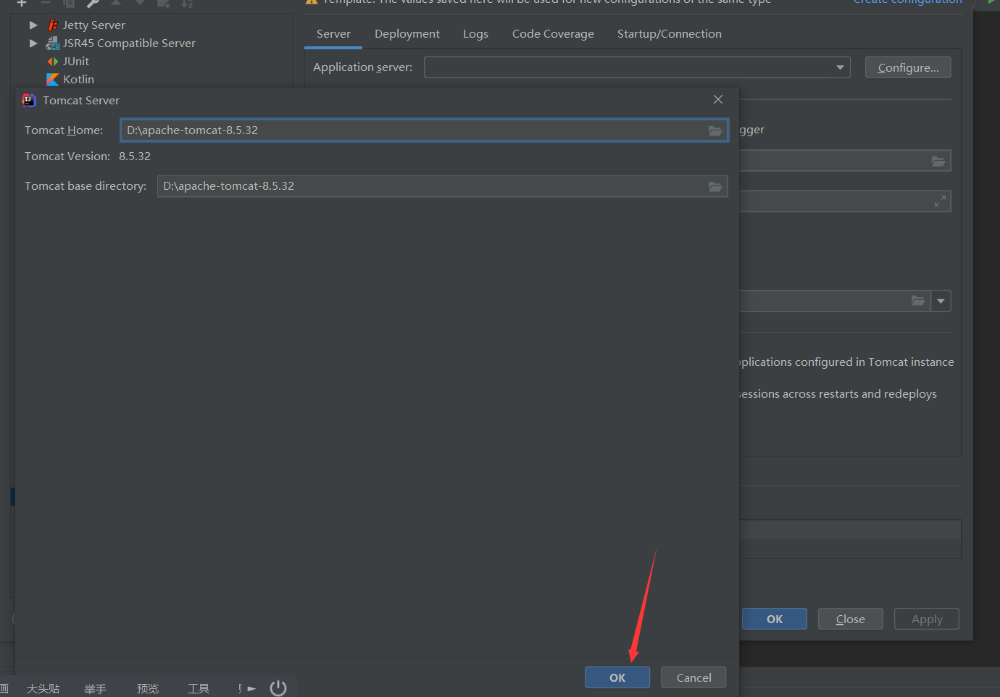
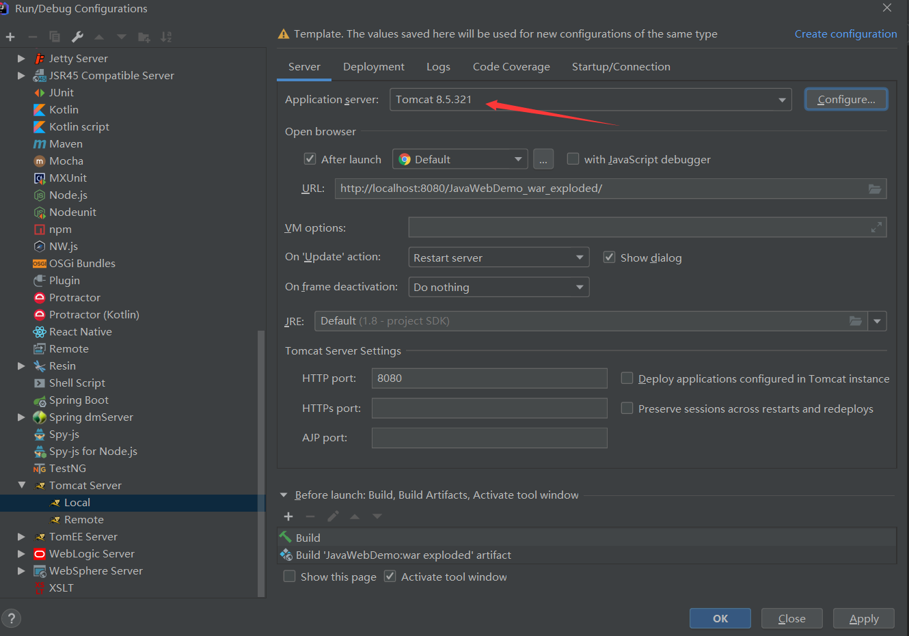
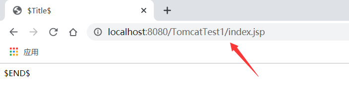
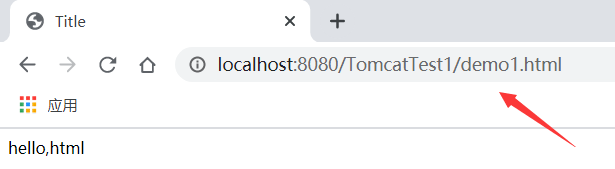

#web相关概念回顾

	1. 软件架构
		1. C/S：客户端/服务器端
		2. B/S：浏览器/服务器端
	
	2. 资源分类
		1. 静态资源：所有用户访问后，得到的结果都是一样的，称为静态资源.静态资源可以直接被浏览器解析
			* 如： html,css,JavaScript
		2. 动态资源:每个用户访问相同资源后，得到的结果可能不一样。称为动态资源。动态资源被访问后，需要先转换为静态资源，在返回给浏览器
			* 如：servlet/jsp,php,asp....


	3. 网络通信三要素
		1. IP：电子设备(计算机)在网络中的唯一标识。
		2. 端口：应用程序在计算机中的唯一标识。 0~65536
		3. 传输协议：规定了数据传输的规则
			1. 基础协议：
				1. tcp:安全协议，三次握手。 速度稍慢
				2. udp：不安全协议。 速度快

#web服务器软件

	* 服务器：安装了服务器软件的计算机
	* 服务器软件：接收用户的请求，处理请求，做出响应的软件
	* web服务器软件：接收用户的请求，处理请求，做出响应。
		* 在web服务器软件中，可以部署web项目，让用户通过浏览器来访问这些项目
		* web服务器软件也被称为web容器


	* 常见的java相关的web服务器软件：
		* webLogic：oracle公司，大型的JavaEE服务器，支持所有的JavaEE规范，收费的。
		* webSphere：IBM公司，大型的JavaEE服务器，支持所有的JavaEE规范，收费的。
		* JBOSS：JBOSS公司的，大型的JavaEE服务器，支持所有的JavaEE规范，收费的。
		* Tomcat：Apache基金组织，中小型的JavaEE服务器，仅仅支持少量的JavaEE规范servlet/jsp。开源的，免费的。
		
	* JavaEE：Java语言在企业级开发中使用的技术规范的总和，一共规定了13项大的规范

##JavaEE的13种核心技术  

```
java的大方向就是JavaEE，JavaEE不仅仅是socket编程，具体包括13中核心技术。

　　JAVAEE平台由一整套服务（Services）、应用程序接口（APIs）和协议构成，它对开发基于Web的多层应用提供了功能支持，下面对JAVAEE中的13种技术规范进行简单的描述

　　1、JDBC(Java Database Connectivity) 　　JDBC API为访问不同的数据库提供了一种统一的途径，象ODBC一样，JDBC对开发者屏蔽了一些细节问题，另外，JDCB对数据库的访问也具有平台无关性。

　　2、JNDI(Java Name and Directory Interface) 　　JNDI API被用于执行名字和目录服务。它提供了一致的模型来存取和操作企业级的资源如DNS和LDAP，本地文件系统，或应用服务器中的对象。

　　3、EJB(Enterprise JavaBean) 　　JAVAEE技术之所以赢得媒体广泛重视的原因之一就是EJB。它们提供了一个框架来开发和实施分布式商务逻辑，由此很显著地简化了具有可伸缩性和高度复杂的企业级应用的开发。EJB规范定义了EJB组件在何时如何与它们的容器进行交互作用。容器负责提供公用的服务，例如目录服务、事务管理、安全性、资源缓冲池以及容错性。但这里值得注意的是，EJB并不是实现JAVAEE的唯一途径。正是由于JAVAEE的开放性，使得有的厂商能够以一种和EJB平行的方式来达到同样的目的。

　　4、RMI(Remote Method Invoke) 　　正如其名字所表示的那样，RMI协议调用远程对象上方法。它使用了序列化方式在客户端和服务器端传递数据。RMI是一种被EJB使用的更底层的协议。

　　5、Java IDL/CORBA 　　在Java IDL的支持下，开发人员可以将Java和CORBA集成在一起。他们可以创建Java对象并使之可在CORBA ORB中展开, 或者他们还可以创建Java类并作为和其它ORB一起展开的CORBA对象的客户。后一种方法提供了另外一种途径，通过它Java可以被用于将你的新的应用和旧的系统相集成。

　　6、JSP(Java Server Pages) 　　JSP页面由HTML代码和嵌入其中的Java代码所组成。服务器在页面被客户端所请求以后对这些Java代码进行处理，然后将生成的HTML页面返回给客户端的浏览器。

　　7、Java Servlet 　　Servlet是一种小型的Java程序，它扩展了Web服务器的功能。作为一种服务器端的应用，当被请求时开始执行，这和CGI Perl脚本很相似。Servlet提供的功能大多与JSP类似，不过实现的方式不同。JSP通常是大多数HTML代码中嵌入少量的Java代码，而servlets全部由Java写成并且生成HTML。

　　8、XML(Extensible Markup Language) 　　XML是一种可以用来定义其它标记语言的语言。它被用来在不同的商务过程中共享数据。 XML的发展和Java是相互独立的，但是，它和Java具有的相同目标正是平台独立性。通过将Java和XML的组合，您可以得到一个完美的具有平台独立性的解决方案。

　　9、JMS(Java Message Service) 　　JMS是用于和面向消息的中间件相互通信的应用程序接口(API)。它既支持点对点的域，有支持发布/订阅(publish/subscribe)类型的域，并且提供对下列类型的支持：经认可的消息传递,事务型消息的传递，一致性消息和具有持久性的订阅者支持。JMS还提供了另 一种方式来对您的应用与旧的后台系统相集成。

　　10、JTA(Java Transaction Architecture) 　　JTA定义了一种标准的API，应用系统由此可以访问各种事务监控。

　　11、JTS(Java Transaction Service) 　　JTS是CORBA OTS事务监控的基本的实现。JTS规定了事务管理器的实现方式。该事务管理器是在高层支持Java Transaction API (JTA)规范，并且在较底层实现OMG OTS specification的Java映像。JTS事务管理器为应用服务器、资源管理器、独立的应用以及通信资源管理器提供了事务服务。

　　12、JavaMail 　　JavaMail是用于存取邮件服务器的API，它提供了一套邮件服务器的抽象类。不仅支持SMTP服务器，也支持IMAP服务器。

　　13、JAF(JavaBeans Activation Framework) 　　JavaMail利用JAF来处理MIME编码的邮件附件。MIME的字节流可以被转换成Java对象，或者转换自Java对象。大多数应用都可以不需要直接使用JAF
```

##Tomcat：web服务器软件

	1. 下载：http://tomcat.apache.org/
	2. 安装：解压压缩包即可。
		* 注意：安装目录建议不要有中文和空格
	3. 卸载：删除目录就行了
- tomcat目录结构


	4. 启动：
		* bin/startup.bat ,双击运行该文件即可
		* 访问：浏览器输入： http://localhost:8080 回车访问自己
						  http://别人的ip:8080 访问别人
		
		* 可能遇到的问题：
			1. 黑窗口一闪而过：
				* 原因： 没有正确配置JAVA_HOME环境变量
				* 解决方案：正确配置JAVA_HOME环境变量
	
			2. 启动报错：端口冲突
				1. 暴力：找到占用的端口号，并且找到对应的进程，杀死该进程
					* netstat -ano：cmd窗口找端口号
					* 资源管理器根据进程pid结束进程
				2. 温柔：修改自身的端口号
					* conf/server.xml 第69行修改端口号
					* 一般会将tomcat的默认端口号修改为80。80端口号是http协议的默认端口号。
						* 好处：在访问时，就不用输入端口号
	5. 关闭：
		1. 正常关闭：
			* bin/shutdown.bat
			* ctrl+c
		2. 强制关闭：
			* 点击启动窗口的×
	6. 配置:
		* 部署项目的方式：
			1. 直接将项目放到webapps目录下即可。(开发)
				* 浏览器访问：http://localhost:8080/虚拟目录/文件名(资源路径)
					例：http://192.168.31.127:8080/test/test.html
				* 简化部署：将项目打成一个war包，再将war包放置到webapps目录下。
					注：war包会自动解压缩
	
			2. 配置conf/server.xml文件(运维)
				在<Host>标签体中配置<Context docBase="D:\hello" path="/hehe" />
				* docBase:项目存放的路径
				* path：虚拟目录
	
			3. 在conf\Catalina\localhost创建任意名称的xml文件。在文件中编写<Context docBase="D:\hello" />(运维)
				* 虚拟目录：xml文件的名称
		
		* 静态项目和动态项目：
			* 目录结构
				* java动态项目的目录结构：
					-- 项目的根目录
						-- WEB-INF目录：
							-- web.xml：web项目的核心配置文件
							-- classes目录：放置字节码文件的目录
							-- lib目录：放置依赖的jar包
#IDEA集成Tomcat


















# 测试项目


- 默认打开index.jsp



- 创建并打开demo1.html




