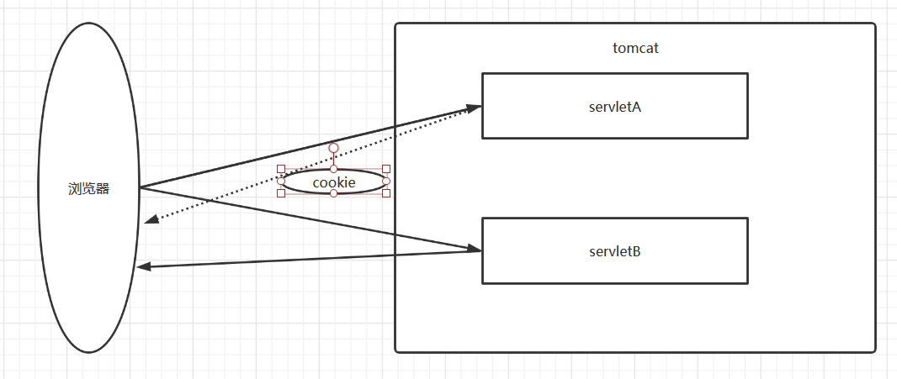
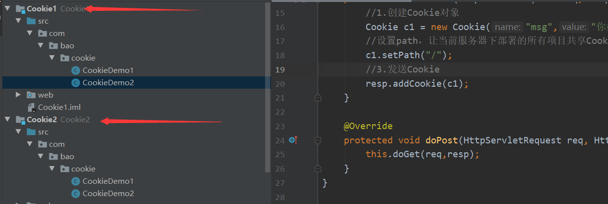

#会话技术

	1. 会话：
		* 浏览器与服务器资源进行交互
		* 一次会话中包含多次请求和响应。
		* 一次会话：浏览器第一次给服务器资源发送请求，会话建立，直到有一方断开为止
		
	2. 功能：在一次会话的范围内的多次请求间，共享数据
	
	3. 方式：
		1. 客户端会话技术：Cookie
		2. 服务器端会话技术：Session


# Cookie

## 1. 概念

> 客户端会话技术，将数据保存到客户端
>
> 当客户端关闭时默认状态下，cookie会被销毁
>
> 当服务器关闭，浏览器不关闭默认情况下，cookie依然可以发送

##2. 快速入门

	* 使用步骤：
		1. 创建Cookie对象，绑定数据
			* new Cookie(String name, String value) 
		2. 发送Cookie对象
			* response.addCookie(Cookie cookie) 
		3. 获取Cookie，拿到数据
			* Cookie[]  request.getCookies()//获取所有的cookie对象
			* String	cookie.getName()//获取cookie对象的键
			* String	cookie.getValue()//获取coolie对象的值
## 代码演示

```java
package com.bao.cookie;

import javax.servlet.ServletException;
import javax.servlet.annotation.WebServlet;
import javax.servlet.http.Cookie;
import javax.servlet.http.HttpServlet;
import javax.servlet.http.HttpServletRequest;
import javax.servlet.http.HttpServletResponse;
import java.io.IOException;

/**
 *
 * Cookie快速入门
 *
 */

@WebServlet("/cookieDemo1")
public class CookieDemo1 extends HttpServlet {
    protected void doPost(HttpServletRequest request, HttpServletResponse response) throws ServletException, IOException {
        //1.创建Cookie对象
        Cookie c = new Cookie("msg","hello");
        //2.发送Cookie
        response.addCookie(c);
        //3.访问了cookieDemo1
        System.out.println("cookieDemo1");
    }

    protected void doGet(HttpServletRequest request, HttpServletResponse response) throws ServletException, IOException {
        this.doPost(request, response);
    }
}
```

```java
package com.bao.cookie;

import javax.servlet.ServletException;
import javax.servlet.annotation.WebServlet;
import javax.servlet.http.Cookie;
import javax.servlet.http.HttpServlet;
import javax.servlet.http.HttpServletRequest;
import javax.servlet.http.HttpServletResponse;
import java.io.IOException;

/**
 *
 * Cookie快速入门
 *
 */

@WebServlet("/cookieDemo2")
public class CookieDemo2 extends HttpServlet {
    protected void doPost(HttpServletRequest request, HttpServletResponse response) throws ServletException, IOException {
       //3. 获取Cookie
        Cookie[] cs = request.getCookies();
        //获取数据，遍历Cookies
        if(cs != null){
            for (Cookie c : cs) {
                String name = c.getName();
                String value = c.getValue();
                System.out.println(name+":"+value);
            }
        }
    }

    protected void doGet(HttpServletRequest request, HttpServletResponse response) throws ServletException, IOException {
        this.doPost(request, response);
    }
}
```

##3. 实现原理

> 基于响应头set-cookie和请求头cookie实现




##4. cookie的细节

###1. 一次可不可以发送多个cookie?

```
* 可以
* 可以创建多个Cookie对象，使用response调用多次addCookie方法发送cookie即可。
```

```java
package com.bao.cookie;

import javax.servlet.ServletException;
import javax.servlet.annotation.WebServlet;
import javax.servlet.http.Cookie;
import javax.servlet.http.HttpServlet;
import javax.servlet.http.HttpServletRequest;
import javax.servlet.http.HttpServletResponse;
import java.io.IOException;

/**
 *
 * Cookie快速入门
 *
 */

@WebServlet("/cookieDemo3")
public class CookieDemo3 extends HttpServlet {
    protected void doPost(HttpServletRequest request, HttpServletResponse response) throws ServletException, IOException {
        //1.创建Cookie对象
        Cookie c1 = new Cookie("msg","hello");
        Cookie c2 = new Cookie("name","zhangsan");
        //2.发送Cookie
        response.addCookie(c1);
        response.addCookie(c2);
    }

    protected void doGet(HttpServletRequest request, HttpServletResponse response) throws ServletException, IOException {
        this.doPost(request, response);
    }
}
```

> 使用CookieDemo2进行接收

### 2. cookie在浏览器中保存多长时间？

	1. 默认情况下，当浏览器关闭后，Cookie数据被销毁
	2. 持久化存储：
		* setMaxAge(int seconds)
			1. 正数：将Cookie数据写到硬盘的文件中。持久化存储。并指定cookie存活时间，时间到后，cookie文件自动失效
			2. 负数：默认值
			3. 零：删除cookie信息
```java
package com.bao.cookie;

import javax.servlet.ServletException;
import javax.servlet.annotation.WebServlet;
import javax.servlet.http.Cookie;
import javax.servlet.http.HttpServlet;
import javax.servlet.http.HttpServletRequest;
import javax.servlet.http.HttpServletResponse;
import java.io.IOException;

/**
 *
 * Cookie快速入门
 *
 */

@WebServlet("/cookieDemo4")
public class CookieDemo4 extends HttpServlet {
    protected void doPost(HttpServletRequest request, HttpServletResponse response) throws ServletException, IOException {
        //1.创建Cookie对象
        Cookie c1 = new Cookie("msg","setMaxAge");
        //2.设置cookie的存活时间
        //c1.setMaxAge(30);//将cookie持久化到硬盘，30秒后会自动删除cookie文件
        //关掉浏览器再次打开，查看是否可以访问到
        //c1.setMaxAge(-1);
        //c1.setMaxAge(300);
        c1.setMaxAge(0);//删除Cookie
        //3.发送Cookie
        response.addCookie(c1);
    }

    protected void doGet(HttpServletRequest request, HttpServletResponse response) throws ServletException, IOException {
        this.doPost(request, response);
    }
}
```

###3. cookie能不能存中文？

	* 在tomcat 8 之前 cookie中不能直接存储中文数据。
	* 在tomcat 8 之后，cookie支持中文数据。
	* 但是不可以存储特殊的字符，需要转码
```java
package com.bao.cookie;

import javax.servlet.ServletException;
import javax.servlet.annotation.WebServlet;
import javax.servlet.http.Cookie;
import javax.servlet.http.HttpServlet;
import javax.servlet.http.HttpServletRequest;
import javax.servlet.http.HttpServletResponse;
import java.io.IOException;

/**
 *
 * Cookie快速入门
 *
 */

@WebServlet("/cookieDemo5")
public class CookieDemo5 extends HttpServlet {
    protected void doPost(HttpServletRequest request, HttpServletResponse response) throws ServletException, IOException {
        //1.创建Cookie对象
        Cookie c1 = new Cookie("msg","你好");
        //3.发送Cookie
        response.addCookie(c1);
    }

    protected void doGet(HttpServletRequest request, HttpServletResponse response) throws ServletException, IOException {
        this.doPost(request, response);
    }
}
```

###4. cookie共享问题？

```java
1. 假设在一个tomcat服务器中，部署了多个web项目，那么在这些web项目中cookie能不能共享？
	* 默认情况下cookie不能共享
	* setPath(String path):设置cookie的获取范围。默认情况下，设置当前的虚拟目录
		* 如果要共享，则可以将path设置为"/"	
```

> 创建两个项目并同时放在服务器中运行访问



```java
package com.bao.cookie;

import javax.servlet.ServletException;
import javax.servlet.annotation.WebServlet;
import javax.servlet.http.Cookie;
import javax.servlet.http.HttpServlet;
import javax.servlet.http.HttpServletRequest;
import javax.servlet.http.HttpServletResponse;
import java.io.IOException;

@WebServlet("/cookieDemo1")
public class CookieDemo1 extends HttpServlet {
    @Override
    protected void doGet(HttpServletRequest req, HttpServletResponse resp) throws ServletException, IOException {
        //1.创建Cookie对象
        Cookie c1 = new Cookie("msg","你好");
        //设置path，让当前服务器下部署的所有项目共享Cookie信息
        c1.setPath("/");
        //3.发送Cookie
        resp.addCookie(c1);
    }

    @Override
    protected void doPost(HttpServletRequest req, HttpServletResponse resp) throws ServletException, IOException {
        this.doGet(req,resp);
    }
}
```

```java
package com.bao.cookie;

import javax.servlet.ServletException;
import javax.servlet.annotation.WebServlet;
import javax.servlet.http.Cookie;
import javax.servlet.http.HttpServlet;
import javax.servlet.http.HttpServletRequest;
import javax.servlet.http.HttpServletResponse;
import java.io.IOException;

@WebServlet("/cookieDemo2")
public class CookieDemo2 extends HttpServlet {
    @Override
    protected void doGet(HttpServletRequest req, HttpServletResponse resp) throws ServletException, IOException {
        //3. 获取Cookie
        Cookie[] cs = req.getCookies();
        //获取数据，遍历Cookies
        if(cs != null){
            for (Cookie c : cs) {
                String name = c.getName();
                String value = c.getValue();
                System.out.println(name+":"+value);
            }
        }
    }

    @Override
    protected void doPost(HttpServletRequest req, HttpServletResponse resp) throws ServletException, IOException {
        this.doGet(req,resp);
    }
}
```


```
2. 不同的tomcat服务器间cookie共享问题？（了解）
    * setDomain(String path):如果设置一级域名相同，那么多个服务器之间cookie可以共享
    * setDomain(".baidu.com"),那么tieba.baidu.com和news.baidu.com中cookie可以共享
```

###5. Cookie的特点和作用

	1. cookie存储数据在客户端浏览器
	2. 浏览器对于单个cookie 的大小有限制(4kb) 以及 对同一个域名下的总cookie数量也有限制(20个)
	
	* 作用：
		1. cookie一般用于存储少量的不太敏感的数据
		2. 在不登录的情况下，完成服务器对客户端的身份识别
##5.案例：记住上一次访问时间

	1. 需求：
		1. 访问一个Servlet，如果是第一次访问，则提示：您好，欢迎您首次访问。
		2. 如果不是第一次访问，则提示：欢迎回来，您上次访问时间为:显示时间字符串
	
	2. 分析：
		1. 可以采用Cookie来完成
		2. 在服务器中的Servlet判断是否有一个名为lastTime的cookie
			1. 有：不是第一次访问
				1. 响应数据：欢迎回来，您上次访问时间为:2018年6月10日11:50:20
				2. 写回Cookie：lastTime=2018年6月10日11:50:01
			2. 没有：是第一次访问
				1. 响应数据：您好，欢迎您首次访问
				2. 写回Cookie：lastTime=2018年6月10日11:50:01
```java
package com.bao.cookie;

import javax.servlet.ServletException;
import javax.servlet.annotation.WebServlet;
import javax.servlet.http.Cookie;
import javax.servlet.http.HttpServlet;
import javax.servlet.http.HttpServletRequest;
import javax.servlet.http.HttpServletResponse;
import java.io.IOException;
import java.net.URLDecoder;
import java.net.URLEncoder;
import java.text.SimpleDateFormat;
import java.util.Date;

@WebServlet("/cookieTest")
public class CookieTest extends HttpServlet {
    protected void doPost(HttpServletRequest request, HttpServletResponse response) throws ServletException, IOException {
        //设置响应的消息体的数据格式以及编码
        response.setContentType("text/html;charset=utf-8");

        //1.获取所有Cookie
        Cookie[] cookies = request.getCookies();
        boolean flag = false;//没有cookie为lastTime
        //2.遍历cookie数组
        if(cookies != null && cookies.length > 0){
            for (Cookie cookie : cookies) {
                //3.获取cookie的名称
                String name = cookie.getName();
                //4.判断名称是否是：lastTime
                if("lastTime".equals(name)){
                    //有该Cookie，不是第一次访问
                    flag = true;//有lastTime的cookie
                    //设置Cookie的value
                    //获取当前时间的字符串，重新设置Cookie的值，重新发送cookie
                    Date date  = new Date();
                    SimpleDateFormat sdf = new SimpleDateFormat("yyyy年MM月dd日 HH:mm:ss");
                    String str_date = sdf.format(date);
                    System.out.println("编码前："+str_date);
                    //URL编码
                    str_date = URLEncoder.encode(str_date,"utf-8");
                    System.out.println("编码后："+str_date);
                    cookie.setValue(str_date);
                    //设置cookie的存活时间
                    cookie.setMaxAge(60 * 60 * 24 * 30);//一个月
                    response.addCookie(cookie);

                    //响应数据
                    //获取Cookie的value，时间
                    String value = cookie.getValue();
                    System.out.println("解码前："+value);
                    //URL解码：
                    value = URLDecoder.decode(value,"utf-8");
                    System.out.println("解码后："+value);
                    response.getWriter().write("<h1>欢迎回来，您上次访问时间为:"+value+"</h1>");

                    break;

                }
            }
        }

        if(cookies == null || cookies.length == 0 || flag == false){
            //没有，第一次访问

            //设置Cookie的value
            //获取当前时间的字符串，重新设置Cookie的值，重新发送cookie
            Date date  = new Date();
            SimpleDateFormat sdf = new SimpleDateFormat("yyyy年MM月dd日 HH:mm:ss");
            String str_date = sdf.format(date);
            System.out.println("编码前："+str_date);
            //URL编码
            str_date = URLEncoder.encode(str_date,"utf-8");
            System.out.println("编码后："+str_date);

            Cookie cookie = new Cookie("lastTime",str_date);
            //设置cookie的存活时间
            cookie.setMaxAge(60 * 60 * 24 * 30);//一个月
            response.addCookie(cookie);

            response.getWriter().write("<h1>您好，欢迎您首次访问</h1>");
        }


    }

    protected void doGet(HttpServletRequest request, HttpServletResponse response) throws ServletException, IOException {
        this.doPost(request, response);
    }
}
```


# JSP入门

##1. 概念

	* Java Server Pages： java服务器端页面
		* 可以理解为：一个特殊的页面，其中既可以定义html标签，又可以定义java代码
		* 用于简化书写！！！
##2. 原理


	* JSP本质上就是一个Servlet
	* jsp的代码首先会转为java代码，之后将java代码编译为class文件，最终运行的也是class文件

```
* 查看编译后的jsp代码
```


```
* HttpJspBase类的父类就是HttpServlet(可以通过百度查找该类)
```


##3. JSP的脚本

> 理解：JSP定义Java代码的方式

```
1. <%  代码 %>：定义的java代码，在service方法中。service方法中可以定义什么，该脚本中就可以定义什么。
	* 方法中可以写什么，这里就可以写什么
2. <%! 代码 %>：定义的java代码，在jsp转换后的java类的成员位置。
	* 类里面可以写什么，这里就可以些什么
3. <%= 代码 %>：定义的java代码，会输出到页面上。输出语句中可以定义什么，该脚本中就可以定义什么。
	* 输出语句可以写什么，这里就可以写什么
```

##4. JSP的内置对象

	* 内置对象：不需要获取和创建，可以直接使用的对象
	* jsp一共有9个内置对象。
	* 今天学习3个：
		* request
		* response
		* out：字符输出流对象。可以将数据输出到页面上。和response.getWriter()类似
			* response.getWriter()和out.write()的区别：
				* 在tomcat服务器真正给客户端做出响应之前，会先找response缓冲区数据，再找out缓冲区数据。
				* response.getWriter()数据输出永远在out.write()之前
```jsp
<%@ page contentType="text/html;charset=UTF-8" language="java" %>
<html>
  <head>
    <title>$Title$</title>
  </head>
  <body>
        <br/>
      <%
        System.out.println("hello jsp11111111111");
        int i = 5;
        String contextPath = request.getContextPath();/*得到虚拟目录*/
        out.print(contextPath);//输出到页面上
      %>

      <%!
        int i = 3;
      %>
      <br/>
      <%= i %>
      <br/>
      <%= "hello" %>

      <br/>
      System.out.println("hello jsp222222222222222");

      <h1>hi~ jsp!</h1>

      <% response.getWriter().write("response....."); %>

  </body>
</html>
```

### 拓展

> **out.print()与out.write()的区别**

> out对象的类型是JspWriter。JspWriter继承了java.io.Writer类。
>
> 1）print方法是子类JspWriter，write是Writer类中定义的方法；
>
> 2）重载的print方法可将各种类型的数据转换成字符串的形式输出，而重载的write方法只能输出字符、字符数组和字符串等与字符相关的数据；
>
> java中有这个方法：print(Object)，没有这个方法：write(Object) 
> 但是却有这个方法：write(String) 
>
> 3）JspWriter类型的out对象使用print方法和write方法都可以输出字符串，但是，如果字符串对象的值为null时，print方法将输出内容为“null”的字符串，而write方法则是抛出NullPointerException异常。
>
> 
>
> 总结： 
>  **out.print()方法，可以输出java对象。** //print为打印，可以打印任何东西
>  **out.write()方法，只能输出字符串。** //write为写字，只能写出字符


## 5. 案例:改造Cookie案例

```jsp
<%@ page import="java.util.Date" %>
<%@ page import="java.text.SimpleDateFormat" %>
<%@ page import="java.net.URLEncoder" %>
<%@ page import="java.net.URLDecoder" %>
<%@ page contentType="text/html;charset=UTF-8" language="java" %>
<html>
<head>
    <title>time</title>
</head>
<body>

<%
    //1.获取所有Cookie
    Cookie[] cookies = request.getCookies();
    boolean flag = false;//没有cookie为lastTime
    //2.遍历cookie数组
    if (cookies != null && cookies.length > 0) {
        for (Cookie cookie : cookies) {
            //3.获取cookie的名称
            String name = cookie.getName();
            //4.判断名称是否是：lastTime
            if ("lastTime".equals(name)) {
                //有该Cookie，不是第一次访问
                flag = true;//有lastTime的cookie
                //设置Cookie的value
                //获取当前时间的字符串，重新设置Cookie的值，重新发送cookie
                Date date = new Date();
                SimpleDateFormat sdf = new SimpleDateFormat("yyyy年MM月dd日 HH:mm:ss");
                String str_date = sdf.format(date);
                System.out.println("编码前：" + str_date);
                //URL编码
                str_date = URLEncoder.encode(str_date, "utf-8");
                System.out.println("编码后：" + str_date);
                cookie.setValue(str_date);
                //设置cookie的存活时间
                cookie.setMaxAge(60 * 60 * 24 * 30);//一个月
                response.addCookie(cookie);

                //响应数据
                //获取Cookie的value，时间
                String value = cookie.getValue();
                System.out.println("解码前：" + value);
                //URL解码：
                value = URLDecoder.decode(value, "utf-8");
                System.out.println("解码后：" + value);
%>
<h1>欢迎回来，您上次访问时间为:<%=value%>
</h1>


<%
                break;

            }
        }
    }

    if (cookies == null || cookies.length == 0 || flag == false) {
        //没有，第一次访问
        //设置Cookie的value
        //获取当前时间的字符串，重新设置Cookie的值，重新发送cookie
        Date date = new Date();
        SimpleDateFormat sdf = new SimpleDateFormat("yyyy年MM月dd日 HH:mm:ss");
        String str_date = sdf.format(date);
        System.out.println("编码前：" + str_date);
        //URL编码
        str_date = URLEncoder.encode(str_date, "utf-8");
        System.out.println("编码后：" + str_date);

        Cookie cookie = new Cookie("lastTime", str_date);
        //设置cookie的存活时间
        cookie.setMaxAge(60 * 60 * 24 * 30);//一个月
        response.addCookie(cookie);

%>
<h1>您好，欢迎您首次访问</h1>
<%
    }
%>
</body>
</html>
```


# Session(重点)

##1. 概念

> 服务器端会话技术
>
> 在一次会话的多次请求间共享数据
>
> 将数据保存在服务器端的对象HttpSession中

##2. 快速入门

	1. 获取HttpSession对象：
		HttpSession session = request.getSession();
		
	2. 使用HttpSession对象：
		Object getAttribute(String name)  
		void setAttribute(String name, Object value)
		void removeAttribute(String name)  
```java
package com.bao.session;

import javax.servlet.ServletException;
import javax.servlet.annotation.WebServlet;
import javax.servlet.http.HttpServlet;
import javax.servlet.http.HttpServletRequest;
import javax.servlet.http.HttpServletResponse;
import javax.servlet.http.HttpSession;
import java.io.IOException;

@WebServlet("/sessionDemo1")
public class SessionDemo1 extends HttpServlet {
    protected void doPost(HttpServletRequest request, HttpServletResponse response) throws ServletException, IOException {
        //使用session共享数据
        //1.获取session
        HttpSession session = request.getSession();
        //2.存储数据
        session.setAttribute("msg","hello session");
//        session.removeAttribute("msg");
    }

    protected void doGet(HttpServletRequest request, HttpServletResponse response) throws ServletException, IOException {
        this.doPost(request, response);
    }
}
```

```java
package com.bao.session;

import javax.servlet.ServletException;
import javax.servlet.annotation.WebServlet;
import javax.servlet.http.HttpServlet;
import javax.servlet.http.HttpServletRequest;
import javax.servlet.http.HttpServletResponse;
import javax.servlet.http.HttpSession;
import java.io.IOException;

@WebServlet("/sessionDemo2")
public class SessionDemo2 extends HttpServlet {
    protected void doPost(HttpServletRequest request, HttpServletResponse response) throws ServletException, IOException {
        //使用session获取数据
        //1.获取session
        HttpSession session = request.getSession();
        //2.获取数据
        Object msg = session.getAttribute("msg");
        System.out.println(msg);
    }

    protected void doGet(HttpServletRequest request, HttpServletResponse response) throws ServletException, IOException {
        this.doPost(request, response);
    }
}
```

##3. 原理

> Session的实现是依赖于Cookie的。


##4. 细节

###	1. 当客户端关闭后，服务器不关闭，两次获取session是否为同一个？

```java
* 默认情况下。不是。
* 如果需要相同，则可以创建Cookie,键为JSESSIONID，设置最大存活时间，让cookie持久化保存。
	 Cookie c = new Cookie("JSESSIONID",session.getId());
     c.setMaxAge(60*60);//一个小时之内session都是相同的，测试谷歌浏览器不支持
     response.addCookie(c);
```
```java
package com.bao.session;

import javax.servlet.ServletException;
import javax.servlet.annotation.WebServlet;
import javax.servlet.http.*;
import java.io.IOException;

@WebServlet("/sessionDemo3")
public class SessionDemo3 extends HttpServlet {
    protected void doPost(HttpServletRequest request, HttpServletResponse response) throws ServletException, IOException {
        //1.获取session
        HttpSession session = request.getSession();
        System.out.println(session);

        //期望客户端关闭后，session也能相同
       /* Cookie c = new Cookie("JSESSIONID",session.getId());
        c.setMaxAge(60*60);//一个小时之内session都是相同的，
        response.addCookie(c);*/

    }

    protected void doGet(HttpServletRequest request, HttpServletResponse response) throws ServletException, IOException {
        this.doPost(request, response);
    }
}
```

###	2. 客户端不关闭，服务器关闭后，两次获取的session是同一个吗？

	* 不是同一个，但是要确保数据不丢失。本地tomcat自动完成以下工作，但是idea中的tomcat并不支持
		* session的钝化：
			* 在服务器正常关闭之前，将session对象序列化到硬盘上
		* session的活化：
			* 在服务器启动后，将session文件转化为内存中的session对象即可。
###	3. session什么时候被销毁？

```java
1. 服务器关闭
2. session对象调用invalidate() 。
3. session默认失效时间30分钟
	选择性配置修改	
	<session-config>
        <session-timeout>30</session-timeout>
    </session-config>
```
```java
package com.bao.session;

import javax.servlet.ServletException;
import javax.servlet.annotation.WebServlet;
import javax.servlet.http.*;
import java.io.IOException;

@WebServlet("/sessionDemo4")
public class SessionDemo4 extends HttpServlet {
    protected void doPost(HttpServletRequest request, HttpServletResponse response) throws ServletException, IOException {
        //1.获取session
        HttpSession session = request.getSession();
        session.setAttribute("msg","hello");
        System.out.println(session.getAttribute("msg"));
//        session.invalidate();
//        System.out.println(session.getAttribute("msg"));

    }

    protected void doGet(HttpServletRequest request, HttpServletResponse response) throws ServletException, IOException {
        this.doPost(request, response);
    }
}
```

```xml
<?xml version="1.0" encoding="UTF-8"?>
<web-app xmlns="http://xmlns.jcp.org/xml/ns/javaee"
         xmlns:xsi="http://www.w3.org/2001/XMLSchema-instance"
         xsi:schemaLocation="http://xmlns.jcp.org/xml/ns/javaee http://xmlns.jcp.org/xml/ns/javaee/web-app_4_0.xsd"
         version="4.0">
    <session-config>
        <session-timeout>1</session-timeout>
    </session-config>
</web-app>
```

## 5. session的特点

	1. session用于存储一次会话的多次请求的数据，存在服务器端
	2. session可以存储任意类型，任意大小的数据
	
	* session与Cookie的区别：
		1. session存储数据在服务器端，Cookie在客户端
		2. session没有数据大小限制，Cookie有
		3. session数据安全，Cookie相对于不安全

## 6.案例：登录显示姓名

	1. 案例需求：
		1. 访问登录页面login.jsp
		2. 用户输入用户名，密码
			* 如果用户名和密码输入有误，返回登录页面，提示:用户名或密码错误
			* 如果用户名和密码输入正确，则跳转到主页success.jsp，显示：xxx,欢迎您

```jsp
<%@ page contentType="text/html;charset=UTF-8" language="java" %>
<html>
<head>
    <title>login</title>
    <style>
        div{
            color: red;
        }
    </style>
</head>
<body>
    <form action="/Coolie_Session/loginServlet" method="post">
        <table>
            <tr>
                <td>用户名</td>
                <td><input type="text" name="username"></td>
            </tr>
            <tr>
                <td>密码</td>
                <td><input type="password" name="password"></td>
            </tr>
            <tr>
                <td colspan="2"><input type="submit" value="登录"></td>
            </tr>
        </table>
    </form>

    <div><%=request.getAttribute("login_error") == null ? "" : request.getAttribute("login_error") %></div>
</body>
</html>
```

```jsp
<%@ page contentType="text/html;charset=UTF-8" language="java" %>
<html>
<head>
    <title>Title</title>
</head>
<body>
    <h1><%=request.getSession().getAttribute("username")%>,欢迎您</h1>
</body>
</html>
```

```java
package com.bao.servlet;

import javax.servlet.ServletException;
import javax.servlet.annotation.WebServlet;
import javax.servlet.http.HttpServlet;
import javax.servlet.http.HttpServletRequest;
import javax.servlet.http.HttpServletResponse;
import javax.servlet.http.HttpSession;
import java.io.IOException;

@WebServlet("/loginServlet")
public class LoginServlet extends HttpServlet {
    protected void doPost(HttpServletRequest request, HttpServletResponse response) throws ServletException, IOException {
        //1.设置request编码
        request.setCharacterEncoding("utf-8");
        //2.获取参数
        String username = request.getParameter("username");
        String password = request.getParameter("password");
        //3.验证用户名和密码
        HttpSession session = request.getSession();
        if("zhangsan".equals(username) && "123".equals(password)){//需要调用UserDao查询数据库
            //登录成功
            //存储信息，用户信息
            session.setAttribute("username",username);
            //重定向到success.jsp
            response.sendRedirect(request.getContextPath()+"/success.jsp");
        }else{
            //登录失败
            //存储提示信息到request
            request.setAttribute("login_error","用户名或密码错误");
            //转发到登录页面
            request.getRequestDispatcher("/login.jsp").forward(request,response);
        }

    }

    protected void doGet(HttpServletRequest request, HttpServletResponse response) throws ServletException, IOException {
        this.doPost(request, response);
    }
}
```


# JSP

##1. 指令

	* 作用：用于配置JSP页面，导入资源文件
	* 格式：
		<%@ 指令名称 属性名1=属性值1 属性名2=属性值2 ... %>
	* 分类：
	1. page	： 配置JSP页面的
			* contentType：等同于response.setContentType()
				1. 设置响应体的mime类型以及字符集，建议浏览器使用对应的字符集解析	
				2. 设置当前jsp页面的编码（只能是高级的IDE才能生效，如果使用低级工具，则需要设置pageEncoding属性设置当前页面的字符集）
			* import：导包
			* errorPage：当前页面发生异常后，会自动跳转到指定的错误页面
			* isErrorPage：标识当前页面是否是错误页面。
				* true：是，可以使用内置对象exception
				* false：否。默认值。不可以使用内置对象exception
- index.jsp

```jsp
<%@ page import="java.util.ArrayList" %>
<%@ page import="java.util.List" %>
<%@ page contentType="text/html;charset=gbk" errorPage="500.jsp"   pageEncoding="GBK" language="java" buffer="16kb" %>

<html>
  <head>
    <title>index</title>
  </head>
  <body>
    <%
      List list = new ArrayList();
      int i = 3/0;
    %>

  </body>
</html>
```

- 500.jsp

```jsp
<%@ page contentType="text/html;charset=UTF-8" isErrorPage="true" language="java" %>
<html>
<head>
    <title>Title</title>
</head>
<body>
    <h1>服务器正忙...</h1>
    <%
        String message = exception.getMessage();
        out.print(message);
    %>
</body>
</html>

```

```jsp
2. include	： 页面包含的。导入页面的资源文件
	* <%@ include file="top.jsp"%>
```
```jsp
<%@ page contentType="text/html;charset=UTF-8" language="java"  %>
<%@ include file="top.jsp"%>

<html>
<head>
    <title>Title</title>
</head>
<body>
    <h1>home.jsp</h1>

</body>
</html>
```

```jsp
<%@ page contentType="text/html;charset=UTF-8" language="java" %>
<h1>top.jsp</h1>
```

	3. taglib	： 导入资源
		* <%@ taglib prefix="c" uri="http://java.sun.com/jsp/jstl/core" %>
			* prefix：前缀，自定义的
- taglib.jsp

```jsp
<%@ page contentType="text/html;charset=UTF-8" language="java" %>
<%@ taglib prefix="c" uri="http://java.sun.com/jsp/jstl/core" %>
<html>
<head>
    <title>Title</title>
</head>
<body>
    <c:if test="true">
        <h1>真</h1>
    </c:if>

</body>
</html>
```

##2. 注释

	1. html注释：
		<!-- -->:只能注释html代码片段
	2. jsp注释：推荐使用
		<%-- --%>：可以注释所有
##3. 内置对象

	* 在jsp页面中不需要创建，直接使用的对象
	* 一共有9个：
		变量名						  真实类型					   作用
		* pageContext				PageContext					当前页面共享数据，还可以获取其他八个内置对象
		* request					HttpServletRequest			一次请求访问的多个资源(转发)
		* session					HttpSession					一次会话的多个请求间(重定向)
		* application				ServletContext				所有用户间共享数据
		* response					HttpServletResponse			响应对象
		* page						Object						当前页面(Servlet)的对象  this
		* out						JspWriter					输出对象，数据输出到页面上
		* config					ServletConfig				Servlet的配置对象
		* exception					Throwable					异常对象

- obj.jsp

```jsp
<%@ page contentType="text/html;charset=UTF-8" language="java" %>
<html>
<head>
    <title>Title</title>
</head>
<body>
    <%
        pageContext.setAttribute("msg","hello");
    %>
    <%= pageContext.getAttribute("msg")%>

    <%
        pageContext.getRequest();
    %>

</body>
</html>
```