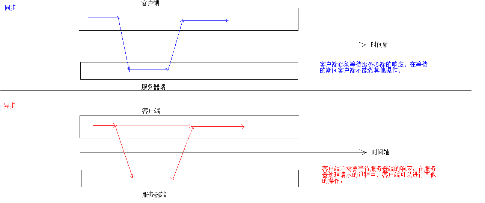

# AJAX

##1. 概念

```
1. ASynchronous JavaScript And XML	异步的JavaScript 和 XML
2. 同步和异步：客户端和服务器端相互通信的基础上
    * 同步：客户端必须等待服务器端的响应。在等待的期间客户端不能做其他操作。
    * 异步：客户端不需要等待服务器端的响应。在服务器处理请求的过程中，客户端可以进行其他的操作。
3. Ajax 是一种在无需重新加载整个网页的情况下，能够更新部分网页的技术。
	* 通过在后台与服务器进行少量数据交换，Ajax 可以使网页实现异步更新。这意味着可以在不重新加载整个网页的情况下，对网页的某部分进行更新。
	* 传统的网页（不使用 Ajax）如果需要更新内容，必须重新加载整个网页页面。

4. 可以提升用户的体验
```

- 图解



##2. 实现方式

###1. 原生的JS实现方式（知道即可）

###2. JQeury实现方式

	1. $.ajax()
		* 语法：$.ajax({键值对});
		 //使用$.ajax()发送异步请求
	        $.ajax({
	            url:"ajaxServlet" , // 请求路径
	            type:"POST" , //请求方式
	            //data: "username=jack&age=23",//请求参数
	            data:{"username":"jack","age":23},
	            success:function (data) {
	                alert(data);//date是随便起的名称，是后台传递到前端的数据
	            },//响应成功后的回调函数（成功后执行的方法）
	            error:function () {
	                alert("出错啦...")
	            },//表示如果请求响应出现错误，会执行的回调函数
	            dataType:"text", //设置接收到的响应数据的格式
	            async:false //同步的
	        });
	2. $.get()：发送get请求
		* 语法：$.get(url, [data], [callback], [type])
			* 参数：
				* url：请求路径
				* data：请求参数
				* callback：回调函数
				* type：响应结果的类型
	
	3. $.post()：发送post请求
		* 语法：$.post(url, [data], [callback], [type])
			* 参数：
				* url：请求路径
				* data：请求参数
				* callback：回调函数
				* type：响应结果的类型
```html
<%@ page contentType="text/html;charset=UTF-8" language="java" %>
<html>
  <head>
    <title>$Title$</title>
    <script src="js/jquery-3.3.1.min.js"></script>
    <script>
      function fun() {
        /*$.ajax({
          url:"ajaxServlet",
          type:"get",
          data:"username=李四&password=123",
          success:function (data) {
            alert(data);
          },
          error:function () {
            alert("出错了");
          },
          dataType:"text",
          async:false //同步的
        });*/

        /*$.get(
                "ajaxServlet",
                {username:"张三",password:"123"},
                function (data) {
                  alert(data);
                },
                "text"
        );*/
        $.post(
                "ajaxServlet",
                {username:"张三丰",password:"123"},
                function (data) {
                  alert(data);
                },
                "text"
        );
      }
    </script>
  </head>
  <body>
    <input type="button" value="异步提交" onclick="fun();">
    <input type="text">
  </body>
</html>

```

```java
package com.bao.web.servlet;

import javax.servlet.ServletException;
import javax.servlet.annotation.WebServlet;
import javax.servlet.http.HttpServlet;
import javax.servlet.http.HttpServletRequest;
import javax.servlet.http.HttpServletResponse;
import java.io.IOException;
import java.io.PrintWriter;

@WebServlet("/ajaxServlet")
public class AjaxServlet extends HttpServlet {
    protected void doPost(HttpServletRequest request, HttpServletResponse response) throws ServletException, IOException {
        //设置编码字符集
        request.setCharacterEncoding("utf-8");
        response.setContentType("text/html;charset=utf-8");
        String username = request.getParameter("username");
        String age = request.getParameter("age");
        System.out.println(username);
        System.out.println(age);
        PrintWriter writer = response.getWriter();
        writer.write(username+"加个微信呗");
    }

    protected void doGet(HttpServletRequest request, HttpServletResponse response) throws ServletException, IOException {
        this.doPost(request,response);
    }
}
```


# JSON

##1. 概念

```
* 全称：JavaScript Object Notation	
* 翻译：JavaScript对象表示法
* java中表示一个对象
	Person p = new Person();
	p.setName("张三");
	p.setAge(23);
	p.setGender("男");
* javaScript表示一个对象
	var p = {"name":"张三","age":23,"gender":"男"};

* json是用于存储和交换文本信息的语法
* 可以用于数据的传输
* 与XML类似，但是JSON 比 XML 更小、更快，更易解析。
```

##2. 语法
###1. 基本规则
	* json数据是由键值对构成的
		* 键用引号(单双都行)引起来，也可以不使用引号,但是要记得统一(建议加双引号)
		* 值的取值类型：
			1. 数字（整数或浮点数）
			2. 字符串（在双引号中）
			3. 逻辑值（true 或 false）
			4. 数组（在方括号中）	{"persons":[{},{}]}
			5. 对象（在花括号中） {"user":{"name"："张三","age":18}}
			6. null
	* 多个键值对儿用逗号分隔
	* 花括号保存对象
	* 方括号保存数组
###	2. 获取数据

	1. json对象.键名
	2. json对象["键名"]
	3. 数组对象[索引]
	4. 遍历
```html
<!DOCTYPE html>
<html lang="en">
    <head>
        <meta charset="UTF-8">
        <title>JSON</title>
        <script>
            //1.定义基本格式
            // var person = {"name": "张三", "age": 23, "gender": true};
            var person = {'name': "张三", 'age': 23, 'gender': true};

            //获取name的值
            //var name = person.name;
            var name = person["name"];
            alert(name);
            alert(person);
            
            //2.嵌套格式   []———> {}
            var ps = [
                {"name": "张三", "age": 23, "gender": true},
                {"name": "李四", "age": 24, "gender": true},
                {"name": "王五", "age": 25, "gender": false}
                ];
            //获取李四值
            alert(ps);
            alert(ps[1].name);

            //3.嵌套格式   {}———> []
            var persons = {
                "persons": [
                    {"name": "张三", "age": 23, "gender": true},
                    {"name": "李四", "age": 24, "gender": true},
                    {"name": "王五", "age": 25, "gender": false}
                    ]
            };
           alert(persons);
            //获取王五值
           var name1 = persons.persons[2].name;
           alert(name1);


        </script>

    </head>
    <body>

    </body>
</html>
```

### 3.遍历json数据

```html
<!DOCTYPE html>
<html lang="en">
    <head>
        <meta charset="UTF-8">
        <title>json遍历</title>
        <script>
            //1.定义基本格式
            var person = {"name": "张三", age: 23, 'gender': true};

            var persons = {
                "persons": [
                    {"name": "张三", "age": 23, "gender": true},
                    {"name": "李四", "age": 24, "gender": true},
                    {"name": "王五", "age": 25, "gender": false}
                ]
            };

            var ps = [
                {"name": "张三", "age": 23, "gender": true},
                {"name": "李四", "age": 24, "gender": true},
                {"name": "王五", "age": 25, "gender": false}
            ];

            //获取person对象中所有的键和值
            //for in 循环
             /*for(var key in person){
                 alert(key+":"+person[key]);
             }*/

            //获取ps中的所有值
            /*for (var i = 0; i < ps.length; i++) {
                var p = ps[i];
                for(var key in p){
                    alert(key+":"+p[key]);
                }
            }*/

            //获取persons中的所有数据
            for (var key in persons){
                var user = persons[key];//user是数组
                for (var i = 0; i < user.length; i++) {
                    for (var keyi in user[i]){
                        alert(keyi+":"+user[i][keyi]);
                    }
                }
            }
        </script>
    </head>
    <body>

    </body>
</html>
```

##3. JSON数据和Java对象的相互转换		

###1.JSON解析器

	* 常见的解析器：Jsonlib(官方提供的实现类)，Gson(谷歌提供)，fastjson(阿里提供)，jackson(springMVC内置的)

###2. Java对象转为JSON对象

```
* 使用步骤：
	1. 导入jackson的相关jar包
	2. 创建Jackson核心对象 ObjectMapper
	3. 调用ObjectMapper的相关方法进行转换
```

####		1. 转换方法
	* writeValue(参数1，obj):
	    参数1：
	        File：将obj对象转换为JSON字符串，并保存到指定的文件中
	        Writer：将obj对象转换为JSON字符串，并将json数据填充到字符输出流中，字符输出流可以后续继续关联到文件或者网络中
	        OutputStream：将obj对象转换为JSON字符串，并将json数据填充到字节输出流中，字节输出流可以后续继续关联到文件或者网络中
	* writeValueAsString(obj):将对象转为json字符串
####2. 注解

```java
1. @JsonIgnore：排除属性。
    * 添加该注解的属性，不参与Java对象转换为Json对象的过程
2. @JsonFormat：属性值
	* @JsonFormat(pattern = "yyyy-MM-dd")
```

- person对象

```java
package com.bao.domain;

import java.util.Date;

public class Person {

    private String name;
    private int age ;
    private String gender;
    //@JsonIgnore // 忽略该属性
    //@JsonFormat(pattern = "yyyy-MM-dd HH:mm:ss", timezone = "GMT+8")
    private Date birthday;

    public Date getBirthday() {
        return birthday;
    }

    public void setBirthday(Date birthday) {
        this.birthday = birthday;
    }

    public String getName() {
        return name;
    }

    public void setName(String name) {
        this.name = name;
    }

    public int getAge() {
        return age;
    }

    public void setAge(int age) {
        this.age = age;
    }

    public String getGender() {
        return gender;
    }

    public void setGender(String gender) {
        this.gender = gender;
    }

    @Override
    public String toString() {
        return "Person{" +
                "name='" + name + '\'' +
                ", age=" + age +
                ", gender='" + gender + '\'' +
                ", birthday=" + birthday +
                '}';
    }
}
```

- 测试类

```java
package com.bao.test;

import com.bao.domain.Person;
import com.fasterxml.jackson.databind.ObjectMapper;
import org.junit.Test;
import java.io.File;
import java.io.FileOutputStream;
import java.io.FileWriter;
import java.util.*;

public class JacksonTest {

    //Java对象转为JSON字符串
    @Test
    public void testJSON() throws Exception {
        //1.创建Person对象
        Person p  = new Person();
        p.setName("张三");
        p.setAge(23);
        p.setGender("男");
        
        //2.创建Jackson的核心对象  ObjectMapper
        ObjectMapper mapper = new ObjectMapper();

        //3.转换
        String json = mapper.writeValueAsString(p);
        System.out.println(p);//Person{name='张三', age=23, gender='男'}
        System.out.println(json);//{"name":"张三","age":23,"gender":"男"}

        //writeValue，将数据写到d://a.txt文件中
        mapper.writeValue(new File("d://a.txt"),p);

        //writeValue.将数据关联到Writer中
        mapper.writeValue(new FileWriter("d://b.txt"),p);

        //writeValue.将数据关联到OutputStream中
        mapper.writeValue(new FileOutputStream("d://c.txt"),p);
    }
}
```


####3. 复杂java对象转换
    1. List：集合
    2. Map：对象格式一致
```java
@Test
public void testJsonList() throws Exception {
    //1.创建Person对象
    Person p1 = new Person();
    p1.setName("张三");
    p1.setAge(23);
    p1.setGender("男");
    p1.setBirthday(new Date());

    Person p2 = new Person();
    p2.setName("张三");
    p2.setAge(23);
    p2.setGender("男");
    p2.setBirthday(new Date());

    //创建List集合
    List<Person> ps = new ArrayList<Person>();
    ps.add(p1);
    ps.add(p2);

    //2.转换
    ObjectMapper mapper = new ObjectMapper();
    String json = mapper.writeValueAsString(ps);
    System.out.println(json);//[{"name":"张三","age":23,"gender":"男"},{"name":"张三","age":23,"gender":"男"}]
}
```

```java
@Test
public void testJsonMap() throws Exception {
    //1.创建map对象
    Map<String,Object> map = new HashMap<String,Object>();
    map.put("name","张三");
    map.put("age",23);
    map.put("gender","男");

    //2.转换
    ObjectMapper mapper = new ObjectMapper();
    String json = mapper.writeValueAsString(map);
    System.out.println(json);//{"gender":"男","name":"张三","age":23}
}
```


###2. Json转为Java对象
	1. 导入jackson的相关jar包
	2. 创建Jackson核心对象 ObjectMapper
	3. 调用ObjectMapper的相关方法进行转换
		1. ObjectMapper.readValue(json字符串数据,对象.Class)
```java
    @Test
    public void testJsonToJava() throws Exception {
       //1.初始化JSON字符串
        String json = "{\"gender\":\"男\",\"name\":\"张三\",\"age\":23}";//双引号需要转义
//        String json = "{'gender':'男','name':'张三','age':23}";//会报错

        //2.创建ObjectMapper对象
        ObjectMapper mapper = new ObjectMapper();

        //3.转换为Java对象 Person对象
        Person person = mapper.readValue(json, Person.class);
        System.out.println(person);
    }
```


# 案例:校验用户名是否存在

	* 校验用户名是否存在
		1. 服务器响应的数据，在客户端使用时，要想当做json数据格式使用。有两种解决方案：
			1. $.get(type):将最后一个参数type指定为"json"
			2. 在服务器端设置MIME类型
				response.setContentType("application/json;charset=utf-8");

## regist.jsp

```html
<%@ page contentType="text/html;charset=UTF-8" language="java" %>
<html>
<head>
    <title>Title</title>
    <script src="js/jquery-2.1.0.min.js"></script>
    <script>
        window.onload = function () {
            document.getElementById("username").onblur = function () {
                var usernameValue = this.value;
                var span = document.getElementById("s_username");
                $.get("findUserByUsernameServlet",{"username":usernameValue},function (data) {
                    //data是后台传递过来的数据
                    if (data.flag){
                        //flag为true：用户名不可用
                        span.innerText = data.msg;//将提示信息放入span中
                    }else {
                        span.innerText = data.msg;//将提示信息放入span中
                    }
                });
            }
        }
    </script>
</head>
<body>
    <form action="#" method="post">
        <input type="text" id="username" name="username" placeholder="请输入用户名">
        <span id="s_username"></span>
        <br><br>
        <input type="password" name="password" placeholder="请输入密码"><br><br>
        <input type="submit" value="注册"><br>
    </form>
</body>
</html>

```

##FindUserByUsernameServlet

```java
package com.bao.servlet;

import com.fasterxml.jackson.databind.ObjectMapper;

import javax.servlet.ServletException;
import javax.servlet.annotation.WebServlet;
import javax.servlet.http.HttpServlet;
import javax.servlet.http.HttpServletRequest;
import javax.servlet.http.HttpServletResponse;
import java.io.IOException;
import java.util.HashMap;
import java.util.Map;
import java.util.Objects;

@WebServlet("/findUserByUsernameServlet")
public class FindUserByUsernameServlet extends HttpServlet {
    protected void doPost(HttpServletRequest request, HttpServletResponse response) throws ServletException, IOException {
        //获取前端传递过来的username，查询数据库，该名称是否存在
        //建议浏览器使用json的格式解析
        response.setContentType("appliction/json;charset=utf-8");
        String username = request.getParameter("username");
        Map<String, Object> hashMap = new HashMap<String, Object>();
        //调用方法去数据库查询该用户名是否存在
        if (Objects.equals(username,"lisi")){
            //该用户名已存在，不可用
            hashMap.put("flag",true);
            hashMap.put("msg","此用户名太受欢迎,请更换一个");
        }else {
            //该用户名不存在，可用
            hashMap.put("flag",false);
            hashMap.put("msg","该用户名可用");
        }

        //将数据转为json格式，发送到前端
        ObjectMapper objectMapper = new ObjectMapper();
        objectMapper.writeValue(response.getWriter(),hashMap);

    }

    protected void doGet(HttpServletRequest request, HttpServletResponse response) throws ServletException, IOException {
        this.doPost(request, response);
    }
}

```

