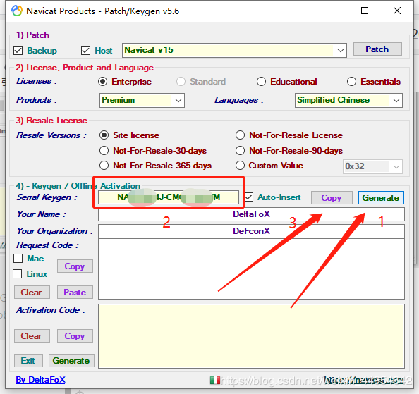
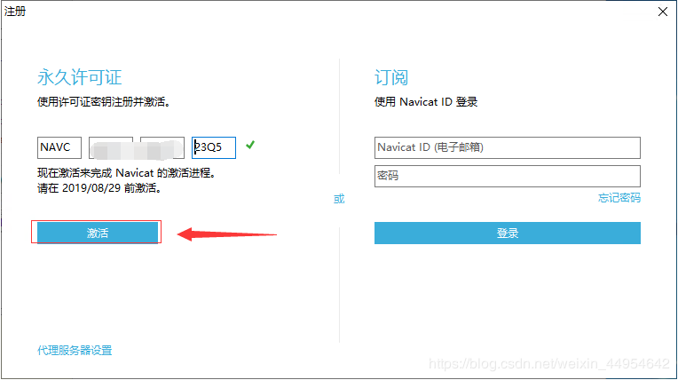
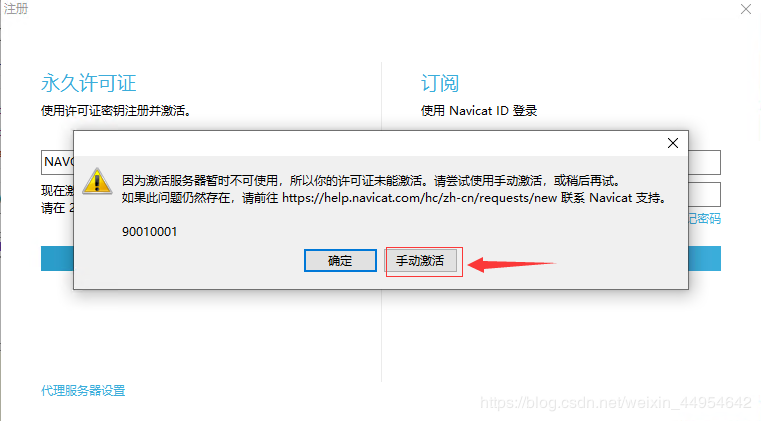
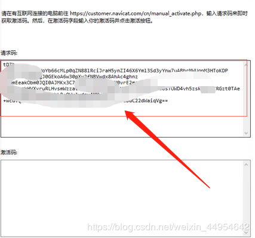
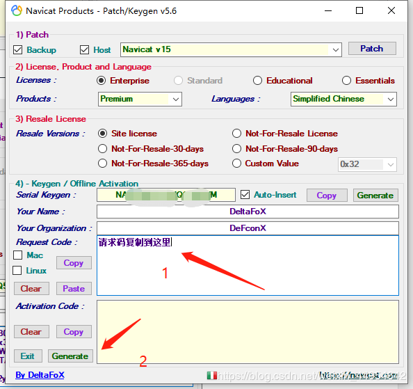
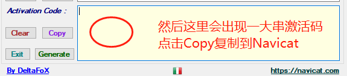
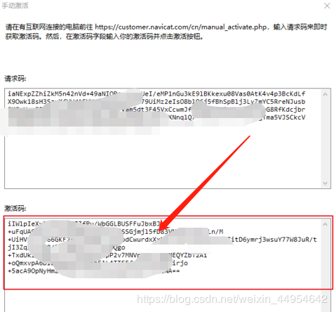

#**1、下载Navicat Premium**
**官网https://www.navicat.com.cn/下载最新版本下载安装**

#2、网盘链接

https://pan.baidu.com/s/1ncSaxId2miL2s5hV8u_hSw

**提取码：atpa（安装包和破解包都有）**

#3、激活Navicat Premium
**先把Navicat安装好**
**然后把破解工具Navicat_Keygen_Patch解压， 以管理员身份运行**

 

#4.点击patch 弹出窗口，找到navicat下载的目录选择navicat，点击打开

 

#5.显示为下图就是破解可以开始破解了

 

##**5.1.点击Generate**

##**5.2.出现序列码**

##***5.3.点击Copy***

 

 

#**6.然后打开navicat**

#**7.第一次打开会提示注册和试用，由于作者是破解过了，我就不截图了，你们第一次打开的时候点击注册，然后把刚才copy的序列码复制进去，点击激活。**

 

#**8.选择手动激活**

 

#**9.然后会生成一大串请求码**

 

#**10.复制请求码到注册机中的Request Code中，点击Activation Code下的generate，生成激活码**

 

 

 

 

 

 

#**点击激活！！！**