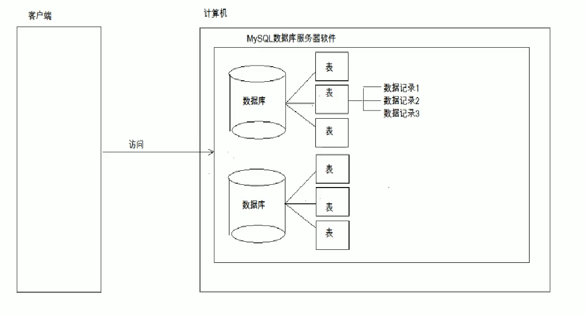
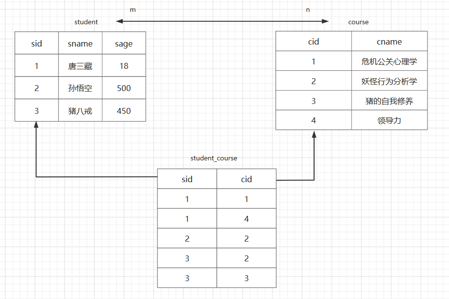
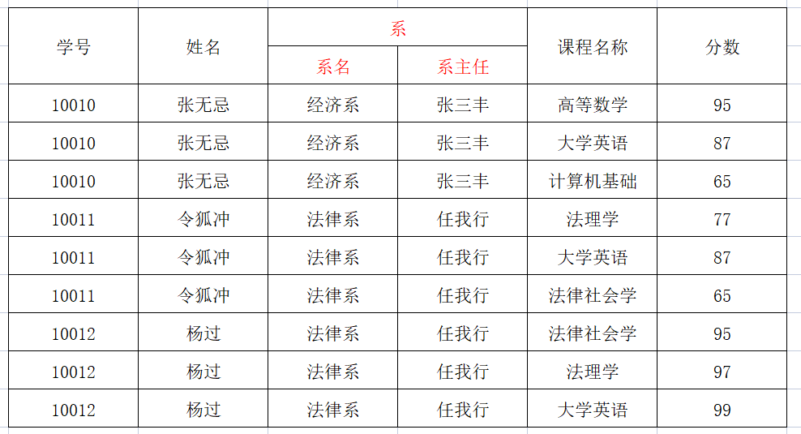
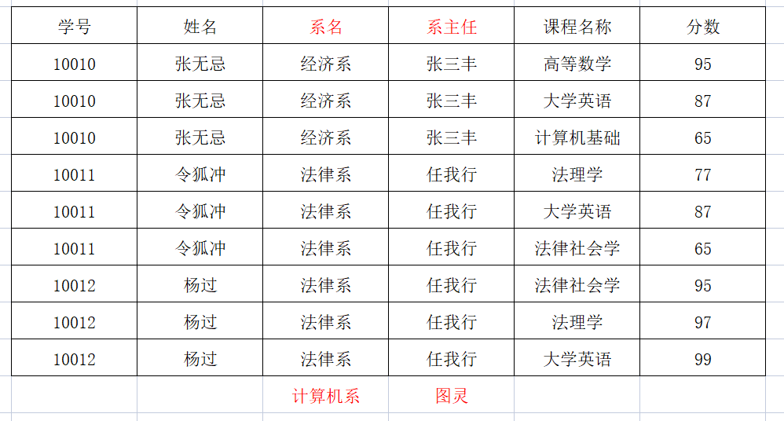
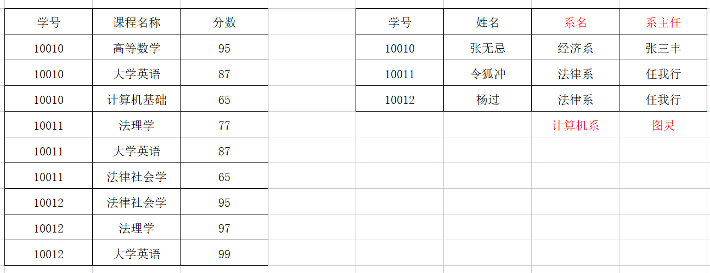
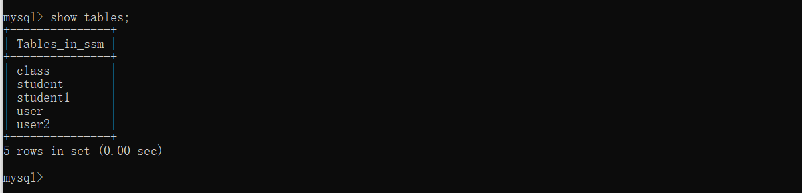
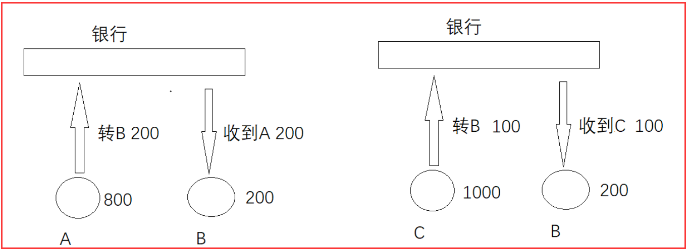
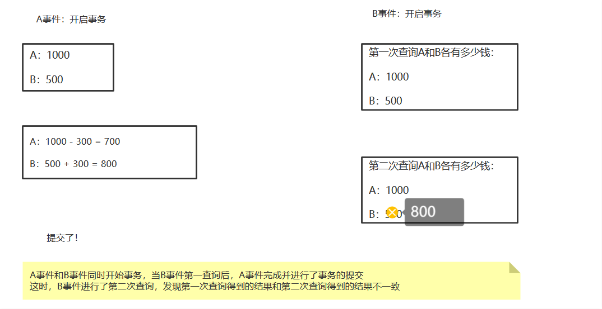
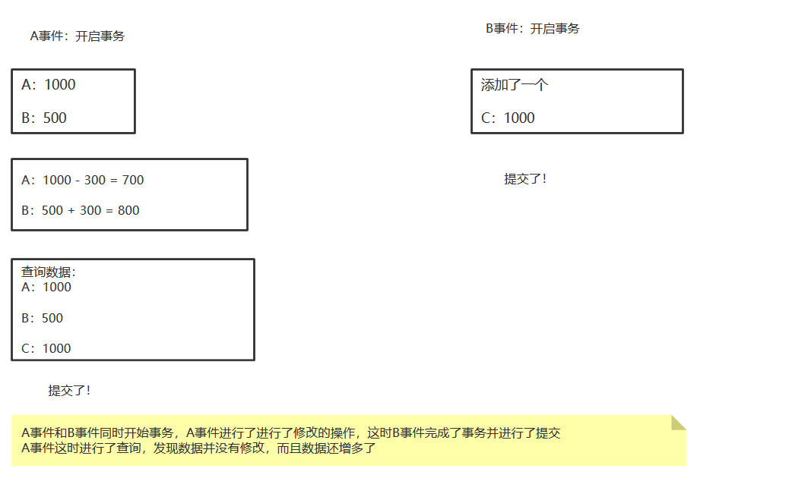

#数据库的基本概念

1. 数据库的英文单词： DataBase 简称 ： DB

2. 什么数据库？
   1. 用于存储和管理数据的仓库。

3. 数据库的特点：
   1. 持久化存储数据的。（其实数据库就是一个文件系统）
   2. 方便存储和管理数据
   3. 使用了统一的方式操作数据库 -- SQL语句

4. 常见的数据库软件

> 1、Oracle
> 	70年代 一间名为Ampex的软件公司，正为中央情报局设计一套名叫Oracle的数据库，Ellison是程序员之一。Oracle是世界领先的信息管理软件开发商，因其复杂的关系数据库产品而闻名。Oracle数据库产品为财富排行榜上的前1000家公司所采用，许多大型网站、银行、证券、电信等都选用了Oracle系统。
>
> 2、SQL Server
> 	SQLServer(Structured Query Language Server) 是一个关系型数据库管理系统(DBMS)。它最初是由Microsoft、Sybase 和Ashton-Tate三家公司共同开发的，于1988 年推出了第一个版本。
>
> 在Windows NT 推出后，Microsoft与Sybase 在SQL Server 的开发上就分道扬镳了，Microsoft 将SQL Server 移植到Windows NT系统上，专注于开发推广SQL Server 的Windows NT 版本。
>
> 3、ACCESS
> 	Access 是微软公司推出的基于Windows的桌面关系数据库管理系统（RDBMS，即Relational Database Management System），是Office系列应用软件之一。
> 	它提供了表、查询、窗体、报表、页、宏、模块7种用来建立数据库系统的对象；提供了多种向导、生成器、模板，把数据存储、数据查询、界面设计、报表生成等操作规范化；为建立功能完善的数据库管理系统提供了方便，也使得普通用户不必编写代码，就可以完成大部分数据管理的任务。
>
> 4、DB2
> 	IBM公司研制的一种关系型数据库系统。DB2主要应用于大型应用系统，具有较好的可伸缩性，可支持从大型机到单用户环境，应用于Windows等平台下。
> 	DB2提供了高层次的数据利用性、完整性、安全性、可恢复性，以及小规模到大规模应用程序的执行能力，具有与平台无关的基本功能和SQL命令。
>
> 5、MySQL
> 	MySQL是一个小型关系型数据库管理系统，开发者为瑞典MySQL AB公司。在2008年1月16号被Sun公司收购。
> 	而2009年，SUN又被Oracle收购。对于Mysql的前途，没有任何人抱乐观的态度。目前MySQL被广泛地应用在Internet上的中小型网站中。由于其体积小、速度快、总体拥有成本低，尤其是开放源码这一特点，许多中小型网站为了降低网站总体拥有成本而选择了MySQL作为网站数据库。


> MySQL6&7
>
> MySQL 在2017年发布了新的版本8.0，但是在此之前的上一个版本是5.7，那么中间的6和7去哪了呢？
>
> 早在2008年，Sun收购MySQL AB以前，公司内部已经在进行着版本号6的开发工作了（5.0在2005年发布）。然而，版本6的MySQL制定的目标和计划过于激进，步子迈得有点儿大，随着收购的顺利完成，项目也被砍掉了。
>  至于版本号7，则是用在了MySQL Cluster上。由于新版的MySQL带来了许多的重大更新，开发者们决定是时候把版本号往前滚动一下了，于是便有了8。


# MySQL数据库软件

	1. 安装
		* 参见《MySQL5.7安裝》
	2. 卸载
		* 参见《MySQL5.7安裝》
		
	3. 配置
		* MySQL服务启动
			1. 电脑 》》》管理 》》》服务和应用程序 》》》 服务 》》》找到MySql可设置自动（开机就启动）和手动
			2. 使用管理员打开cmd
				a.net stop mysql56(服务的名称) 关闭mysql服务
	            b.net start mysql56(服务的名称) 启动mysql服务
		* MySQL登录
			1. mysql -uroot -p 》》》回车
		    	passwort ：root（密文形式）
			2. mysql -hip -uroot -p连接目标的密码
				例如：mysql -h192.168.0.175(ip地址) -uroot -proot
				
		* MySQL退出
			1. exit
			2. quit
	
		* MySQL目录结构
			* MySql安装目录
	                a.bin：二进制文件和可执行文件
	                b.data：数据目录，日志文件
	                c.include：C文件的头信息
	                d.lib：MySql的jar包
	                e.share：mysql的错误信息
	                f.my.ini配置文件（可简单查看）
	
	        * MySql数据目录（隐藏目录）
	                a.数据库：就是文件夹
	                b.表：就是frm结尾的文件
	                c.数据：数据


## 图解



# SQL

```sql
1.什么是SQL？
	Structured Query Language：结构化查询语言
	其实就是定义了操作所有关系型数据库的规则。每一种数据库操作的方式存在不一样的地方，称为“方言”。
	
2.SQL通用语法
	1. SQL 语句可以单行或多行书写，以分号结尾。
		show databases；：展示所有的数据库
	2. 可使用空格和缩进来增强语句的可读性。
	3. MySQL 数据库的 SQL 语句不区分大小写，关键字建议使用大写。
	4. 3 种注释
		* 单行注释: -- 注释内容 或 # 注释内容(mysql 特有) 
		* 多行注释: /* 注释 */
	
3. SQL分类
	1) DDL(Data Definition Language)数据定义语言
		用来对数据库和表进行增删改查：数据库，表，列等。关键字：create, drop,alter 等
	2) DML(Data Manipulation Language)数据操作语言
		用来对数据库中表的数据进行增删改。关键字：insert, delete, update 等
	3) DQL(Data Query Language)数据查询语言
		用来查询数据库中表的记录(数据)。关键字：select, where 等
	4) DCL(Data Control Language)数据控制语言(了解)
		用来定义数据库的访问权限和安全级别，及创建用户。关键字：GRANT， REVOKE 等
```

##DDL:操作数据库、表

###操作数据库

```sql
1. 操作数据库：CRUD
	1. C(Create):创建
		* 创建数据库：
			* create database 数据库名称;
		* 创建数据库，判断不存在，再创建：
			* create database if not exists 数据库名称;
		* 创建数据库，并指定字符集
			* create database 数据库名称 character set 字符集名;
		* 练习： 创建db4数据库，判断是否存在，并制定字符集为gbk
			* create database if not exists db4 character set gbk;
	2. R(Retrieve)：查询
		* 查询所有数据库的名称:
			* show databases;
		* 查询某个数据库的字符集（查询某个数据库的创建语句）
			* show create database 数据库名称;
	3. U(Update):修改
		* 修改数据库的字符集
			* alter database 数据库名称 character set 字符集名称;
	4. D(Delete):删除
		* 删除数据库
			* drop database 数据库名称;
		* 判断数据库存在，存在再删除
			* drop database if exists 数据库名称;
	5. 使用数据库
		* 查询当前正在使用的数据库名称
			* select database();
		* 使用数据库
			* use 数据库名称;
```

###操作表

	1. C(Create):创建
		1. 语法：
			create table 表名(
				列名1 数据类型1,
				列名2 数据类型2,
				....
				列名n 数据类型n
			);
			* 注意：最后一列，不需要加逗号（,）

###数据库数据类型

	1. int：整数类型
		* age int,
	2. double:小数类型
		* score double(5,2)
			* 5:表示整个数字的长度，包括整数和小数
			* 2:表示小数的长度
	3. date:日期，只包含年月日，yyyy-MM-dd
	4. datetime:日期，包含年月日时分秒	 yyyy-MM-dd HH:mm:ss
	5. timestamp:时间戳类型	包含年月日时分秒	 yyyy-MM-dd HH:mm:ss	
		* 如果将来不给这个字段赋值，或赋值为null，则默认使用当前的系统时间，来自动赋值
	6. varchar：字符串
		* name varchar(20):姓名最大20个字符
		* zhangsan 8个字符  张三 2个字符
```sql
* 创建表
	create table student(
		id int,
		name varchar(32),
		age int ,
		score double(4,1),
		birthday date,
		insert_time timestamp
	);
* 复制表：
	* create table 表名 like 被复制的表名;
```
	2. R(Retrieve)：查询
		* 查询某个数据库中所有的表名称
			* show tables;
		* 查询表结构
			* desc 表名;
	    * 查看表的字符集或创建语句
	    	* show create table 表名;
			
	3. U(Update):修改
		1. 修改表名
			alter table 表名 rename to 新的表名;
		2. 修改表的字符集
			alter table 表名 character set 字符集名称;
		3. 添加一列
			alter table 表名 add 列名 数据类型;
		4. 修改列名称 类型
			alter table 表名 change 旧列名 新列名 新数据类型;
			alter table 表名 modify 列名 新数据类型;
		5. 删除列
			alter table 表名 drop 列名;
	4. D(Delete):删除
		* drop table 表名;
		* drop table  if exists 表名 ;
###客户端图形化工具：Navicat


## DML：增删改表中数据

```sql
1. 添加数据：
	* 语法：
		* insert into 表名(列名1,列名2,...列名n) values(值1,值2,...值n);
		
	* 注意：
		1. 列名和值要一一对应。
		2. 如果表名后，不定义列名，则默认给所有列添加值
			insert into 表名 values(值1,值2,...值n);
		3. 除了数字类型，其他类型需要使用引号(单双都可以)引起来
		4. ` :英文状态下的1左侧的键（加不加都行）
	* 例：
        INSERT INTO `user` VALUES (1,"张三","abc")
        INSERT INTO `user`(id,name,pwd) VALUES (2,"李四","aaa")
        INSERT INTO user(id,name,pwd) VALUES (3,"李四","aaa")
2. 删除数据：
	* 语法：
		* delete from 表名 [where 条件]
	* 注意：
		1. 如果不加条件，则删除表中所有记录。
		2. 如果要删除所有记录
			1. delete from 表名; -- 不推荐使用。有多少条记录就会执行多少次删除操作
			2. TRUNCATE TABLE 表名; -- 推荐使用，效率更高 先删除表，然后再创建一张一样的表。
	* 例：
        delete from `user` where  id=1
        
        
3. 修改数据：
	* 语法：
		* update 表名 set 列名1 = 值1, 列名2 = 值2,... [where 条件];

	* 注意：
		1. 如果不加任何条件，则会将表中所有记录全部修改。
		
	* 例：
        update `user` set name="王五",pwd="fff" where id=2
        update `user` set name="赵六",pwd="fff"
```


## DQL：查询表中的记录

### 查询创建数据

```sql
SET NAMES utf8mb4;
SET FOREIGN_KEY_CHECKS = 0;

-- ----------------------------
-- Table structure for stu
-- ----------------------------
DROP TABLE IF EXISTS `stu`;
CREATE TABLE `stu`  (
  `id` int(11) NOT NULL AUTO_INCREMENT,
  `name` varchar(255) CHARACTER SET utf8 COLLATE utf8_general_ci NULL DEFAULT NULL,
  `age` int(11) NULL DEFAULT NULL,
  `sex` varchar(255) CHARACTER SET utf8 COLLATE utf8_general_ci NULL DEFAULT NULL,
  `chinese` varchar(255) CHARACTER SET utf8 COLLATE utf8_general_ci NULL DEFAULT NULL,
  `math` varchar(255) CHARACTER SET utf8 COLLATE utf8_general_ci NULL DEFAULT NULL,
  PRIMARY KEY (`id`) USING BTREE
) ENGINE = InnoDB AUTO_INCREMENT = 9 CHARACTER SET = utf8 COLLATE = utf8_general_ci ROW_FORMAT = Dynamic;

-- ----------------------------
-- Records of stu
-- ----------------------------
INSERT INTO `stu` VALUES (1, 'a', 55, 'man', '66', '78');
INSERT INTO `stu` VALUES (2, 'b', 45, 'women', '98', '87');
INSERT INTO `stu` VALUES (3, 'c', 55, 'man', '56', '77');
INSERT INTO `stu` VALUES (4, 'd', 20, 'women', '76', '65');
INSERT INTO `stu` VALUES (5, 'e', 20, 'man', '86', NULL);
INSERT INTO `stu` VALUES (6, 'f', 57, 'man', '99', '99');
INSERT INTO `stu` VALUES (7, 'g', 22, 'women', '99', '99');
INSERT INTO `stu` VALUES (8, 'h', 18, 'man', '56', '65');

SET FOREIGN_KEY_CHECKS = 1;
```

###1. 语法

```sql
select
	字段列表
from
	表名列表
where
	条件列表
group by
	分组字段
having
	分组之后的条件
order by
	排序
limit
	分页限定
```
###2. 基础查询

```sql
1. 多个字段的查询
	*查询所有： select * from 表名;
	* 例：
		SELECT * FROM `user`
	
	select 字段名1，字段名2... from 表名；
	* 注意：
		* 如果查询所有字段，则可以使用*来替代字段列表。
	* 例：
		SELECT age,math FROM stu
		
2. 去除重复：
	* distinct
	* 例：
		select distinct age from stu
		
3. 计算列
	* 一般可以使用四则运算计算一些列的值。（一般只会进行数值型的计算）
		null和任何值运算都是null
	* 例：
		select name,chinese,math,chinese+math FROM stu

	* ifnull(表达式1,表达式2)：null参与的运算，计算结果都为null
		* 表达式1：哪个字段需要判断是否为null
		* 表达式2：如果该字段为null后的替换值。
	* 例：	
		select name,chinese,math,chinese+IFNULL(math,0) FROM stu

4. 起别名：
	* as：as也可以省略
	* 例：
		select name AS 姓名,chinese as 语文,math as 数学,chinese+IFNULL(math,0) AS 总分 FROM stu
			as大小写均可
        select name AS 姓名,chinese as 语文,math as 数学,chinese+IFNULL(math,0) AS 总分 FROM stu
        	as可以用空格替换			
```
###3. 条件查询

- 创建条件查询数据

```sql
SET NAMES utf8mb4;
SET FOREIGN_KEY_CHECKS = 0;

-- ----------------------------
-- Table structure for student
-- ----------------------------
DROP TABLE IF EXISTS `student`;
CREATE TABLE `student`  (
  `id` int(11) NOT NULL AUTO_INCREMENT,
  `name` varchar(255) CHARACTER SET utf8 COLLATE utf8_general_ci NULL DEFAULT NULL,
  `age` int(11) NULL DEFAULT NULL,
  `sex` varchar(255) CHARACTER SET utf8 COLLATE utf8_general_ci NULL DEFAULT NULL,
  `address` varchar(255) CHARACTER SET utf8 COLLATE utf8_general_ci NULL DEFAULT NULL,
  `math` varchar(255) CHARACTER SET utf8 COLLATE utf8_general_ci NULL DEFAULT NULL,
  `english` varchar(255) CHARACTER SET utf8 COLLATE utf8_general_ci NULL DEFAULT NULL,
  PRIMARY KEY (`id`) USING BTREE
) ENGINE = InnoDB AUTO_INCREMENT = 9 CHARACTER SET = utf8 COLLATE = utf8_general_ci ROW_FORMAT = Dynamic;

-- ----------------------------
-- Records of student
-- ----------------------------
INSERT INTO `student` VALUES (1, '马云', 55, 'man', '杭州', '66', '78');
INSERT INTO `student` VALUES (2, '马化腾', 45, 'women', '深圳', '98', '87');
INSERT INTO `student` VALUES (3, '马景涛', 55, 'man', '香港', '56', '77');
INSERT INTO `student` VALUES (4, '柳岩', 20, 'women', '湖南', '76', '65');
INSERT INTO `student` VALUES (5, '柳青', 20, 'man', '湖南', '86', NULL);
INSERT INTO `student` VALUES (6, '刘德华', 57, 'man', '香港', '99', '99');
INSERT INTO `student` VALUES (7, '马德', 22, 'women', '香港', '99', '99');
INSERT INTO `student` VALUES (8, '德华', 18, 'man', '深圳', '56', '65');

```

```sql
1. where子句后跟条件
2. 运算符
	* > 、< 、<= 、>= 、= 、<>
	* BETWEEN...AND  
	* IN( 集合) 
	* LIKE：模糊查询
		* 占位符：
			* _:单个任意字符
			* %：多个任意字符
	* IS NULL  
	* and  或 &&
	* or  或 || 
	* not  或 !
```
```sql
-- 查询年龄大于20岁
SELECT * FROM student WHERE age > 20;

-- 查询年龄大于等于20岁
SELECT * FROM student WHERE age >= 20;

-- 查询年龄等于20岁
SELECT * FROM student WHERE age = 20;

-- 查询年龄不等于20岁
SELECT * FROM student WHERE age != 20;
SELECT * FROM student WHERE age <> 20;

-- 查询年龄大于等于20 小于等于30
SELECT * FROM student WHERE age >= 20 &&  age <=30;
SELECT * FROM student WHERE age >= 20 AND  age <=30;
SELECT * FROM student WHERE age BETWEEN 20 AND 30;

-- 查询年龄22岁，18岁，25岁的信息
SELECT * FROM student WHERE age = 22 OR age = 18 OR age = 25
SELECT * FROM student WHERE age IN (22,18,25);

-- 查询英语成绩为null
SELECT * FROM student WHERE english = NULL; -- 不对的。null值不能使用 = （!=） 判断
SELECT * FROM student WHERE english IS NULL;

-- 查询英语成绩不为null
SELECT * FROM student WHERE english  IS NOT NULL;

-- 查询姓马的有哪些
SELECT * FROM student WHERE NAME LIKE '马%';

-- 查询姓名第二个字是化的人
SELECT * FROM student WHERE NAME LIKE "_化%";

-- 查询姓名是3个字的人
SELECT * FROM student WHERE NAME LIKE '___';	

-- 查询姓名中包含德的人
SELECT * FROM student WHERE NAME LIKE '%德%';
```
###4. 排序查询

```sql
* 语法：order by 子句
	* order by 排序字段1 排序方式1，排序字段2 排序方式2...

* 排序方式：
	* ASC：升序，默认的。
	* DESC：降序。

* 注意：
	* 如果有多个排序条件，则当前边的条件值一样时，才会判断第二条件。
	
* 例：
-- 数学默认排序
SELECT * FROM student ORDER BY math;

-- 数学升序
SELECT * FROM student ORDER BY math DESC;

-- 数学英语依次升序排列
SELECT * FROM student ORDER BY math DESC, english DESC;
```
###5. 聚合函数

```sql
概念：将一列数据作为一个整体，进行纵向的计算。	
1. count：计算个数
	1. 一般选择非空的列：主键
	2. count(*)
	3. 排除null值
        解决方案：
            1. 选择不包含非空的列进行计算
            2. IFNULL函数
    
2. max：计算最大值
3. min：计算最小值
4. sum：计算和
5. avg：计算平均值

* 例：
-- 查询记录数的个数
SELECT COUNT(*) FROM student;
-- 排除了null值
SELECT COUNT(english) FROM student;
-- 替换null值
select COUNT(IFNULL(english,0)) FROM student;
-- 查询最大值
SELECT max(english) FROM student;
```


###6. 分组查询

```sql
1. 语法：group by 分组字段；
2. 注意：
	1. 分组之后查询的字段：分组字段、聚合函数
	2. where 和 having 的区别？
		1. where 在分组之前进行限定，如果不满足条件，则不参与分组。
		   having在分组之后进行限定，如果不满足结果，则不会被查询出来
		2. where 后不可以跟聚合函数，having可以进行聚合函数的判断。
* 例：
	-- 按照性别分组。分别查询男、女同学的数学的平均分
	SELECT sex , AVG(math) FROM student GROUP BY sex;
	
	-- 按照性别分组。分别查询男、女同学的平均分,人数
	SELECT sex,AVG(math+IFNULL(english,0)),COUNT(*) FROM student GROUP BY sex; 
	
	--  按照性别分组。分别查询男、女同学的平均分,人数 要求：数学分数低于70分的人，不参与分组
	SELECT sex , AVG(math+IFNULL(english,0)),COUNT(id) FROM student WHERE math >= 70 GROUP BY sex;
	
	--  按照性别分组。分别查询男、女同学的平均分,人数 要求：分数低于70分的人，不参与分组；分组之后，人数要大于2个人
	SELECT sex , AVG(math+IFNULL(english,0)),COUNT(id) FROM student WHERE math > 70 GROUP BY sex HAVING COUNT(id) > 2;
	
	SELECT sex 性别, AVG(math+IFNULL(english,0)) 平均分,COUNT(id) 人数 FROM student WHERE math > 70 GROUP BY sex HAVING 人数 > 2;
```
###7. 分页查询		

```sql
1. 语法：limit 开始的索引,每页查询的条数;

2. 公式：开始的索引 = （当前的页码 - 1） * 每页显示的条数
  
* 例：
   -- 每页显示3条记录 
   SELECT * FROM student LIMIT 0,3; -- 第1页

   SELECT * FROM student LIMIT 3,3; -- 第2页

   SELECT * FROM student LIMIT 6,3; -- 第3页

3. limit 是一个MySQL"方言"
```

##约束

```
* 概念： 对表中的数据进行限定，保证数据的正确性、有效性和完整性。	
* 分类：
	1. 非空约束：not null
	2. 唯一约束：unique
	3. 主键约束：primary key
	4. 外键约束：foreign key
```

###非空约束

```sql
非空约束：not null，值不能为null
	1. 创建表时添加约束
		CREATE TABLE stu(
			id INT,
			NAME VARCHAR(20) NOT NULL -- name为非空
		);
	2. 创建表完后，添加非空约束（也可以在添加非空约束时修改数据类型）
		ALTER TABLE stu MODIFY NAME VARCHAR(20) NOT NULL;

	3. 删除name的非空约束
		ALTER TABLE stu MODIFY NAME VARCHAR(20);
```

### 唯一约束

```sql
唯一约束：unique，值不能重复
	1. 创建表时，添加唯一约束
		CREATE TABLE stu(
			id INT,
			phone_number VARCHAR(20) UNIQUE -- 添加了唯一约束		
		);
		* 注意mysql中，唯一约束限定的列的值可以有多个null
	2. 删除唯一约束	
		ALTER TABLE stu DROP INDEX phone_number;
	
	3. 在创建表后，添加唯一约束
		ALTER TABLE stu MODIFY phone_number VARCHAR(20) UNIQUE;

```

### 主键约束

```sql
主键约束：primary key。
	1. 注意：
		1. 含义：非空且唯一
		2. 一张表只能有一个字段为主键
		3. 主键就是表中记录的唯一标识

	2. 在创建表时，添加主键约束
		create table stu(
			id int primary key,-- 给id添加主键约束
			name varchar(20)
		);

	3. 删除主键
		-- 错误 alter table stu modify id int ;
		ALTER TABLE stu DROP PRIMARY KEY;

	4. 创建完表后，添加主键
		ALTER TABLE stu MODIFY id INT PRIMARY KEY;

	5. 自动增长：
		1.  概念：如果某一列是数值类型的，使用 auto_increment 可以来完成值的自动增长

		2. 在创建表时，添加主键约束，并且完成主键自增长
		create table stu(
			id int primary key auto_increment,-- 给id添加主键约束
			name varchar(20)
		);		
		
		3. 删除自动增长
		ALTER TABLE stu MODIFY id INT;
		
		4. 添加自动增长
		ALTER TABLE stu MODIFY id INT AUTO_INCREMENT;
```

###外键约束

#### 外键理解

```sql
DROP TABLE IF EXISTS `student1`;
CREATE TABLE `student1`  (
  `sid` int(11) NOT NULL AUTO_INCREMENT,
  `sname` varchar(20) CHARACTER SET utf8 COLLATE utf8_general_ci NULL DEFAULT NULL,
  `sage` int(11) NULL DEFAULT NULL,
  `cname` varchar(20) CHARACTER SET utf8 COLLATE utf8_general_ci NULL DEFAULT NULL,
  `caddress` varchar(30) CHARACTER SET utf8 COLLATE utf8_general_ci NULL DEFAULT NULL,
  PRIMARY KEY (`sid`) USING BTREE
) ENGINE = InnoDB AUTO_INCREMENT = 5 CHARACTER SET = utf8 COLLATE = utf8_general_ci ROW_FORMAT = Dynamic;

INSERT INTO `student1` VALUES (1, '张三', 18, '1班', '软件楼111');
INSERT INTO `student1` VALUES (2, '李四', 19, '1班', '软件楼111');
INSERT INTO `student1` VALUES (3, '王五', 20, '2班', '软件楼112');
INSERT INTO `student1` VALUES (4, '赵六', 18, '2班', '软件楼112');
```

#### 外键引入

```sql
DROP TABLE IF EXISTS `student`;
CREATE TABLE `student`  (
  `sid` int(11) NOT NULL AUTO_INCREMENT,
  `sname` varchar(20) CHARACTER SET utf8 COLLATE utf8_general_ci NULL DEFAULT NULL,
  `sage` int(11) NULL DEFAULT NULL,
  `cid` int(11) NULL DEFAULT NULL,
  PRIMARY KEY (`sid`) USING BTREE
) ENGINE = InnoDB AUTO_INCREMENT = 6 CHARACTER SET = utf8 COLLATE = utf8_general_ci ROW_FORMAT = Dynamic;

-- ----------------------------
-- Records of student
-- ----------------------------
INSERT INTO `student` VALUES (1, '张三', 18, 1);
INSERT INTO `student` VALUES (2, '李四', 19, 1);
INSERT INTO `student` VALUES (3, '王五', 18, 2);
INSERT INTO `student` VALUES (4, '赵六', 19, 2);
```

```sql
DROP TABLE IF EXISTS `class`;
CREATE TABLE `class`  (
  `cid` int(11) NOT NULL AUTO_INCREMENT,
  `cname` varchar(20) CHARACTER SET utf8 COLLATE utf8_general_ci NULL DEFAULT NULL,
  `caddress` varchar(30) CHARACTER SET utf8 COLLATE utf8_general_ci NULL DEFAULT NULL,
  PRIMARY KEY (`cid`) USING BTREE
) ENGINE = InnoDB AUTO_INCREMENT = 3 CHARACTER SET = utf8 COLLATE = utf8_general_ci ROW_FORMAT = Dynamic;

-- ----------------------------
-- Records of class
-- ----------------------------
INSERT INTO `class` VALUES (1, '1班', '软件楼112');
INSERT INTO `class` VALUES (2, '2班', '软件楼113');
```

####外键使用

```sql
外键约束：foreign key,让表与表产生关系，从而保证数据的正确性。
	1. 在创建表时，可以添加外键
		* 语法：
			create table 表名(
				....
				外键列
				constraint 外键名称 foreign key (外键列名称) references 主表名称(主表列名称)
                -- CONSTRAINT student_class_fk FOREIGN KEY (cid) REFERENCES class(cid)
                -- 外键名称可以省略，系统会默认生成外键名称
                -- FOREIGN KEY (cid) REFERENCES class(cid)
			);

	2. 删除外键
		ALTER TABLE 表名 DROP FOREIGN KEY 外键名称;
		-- ALTER TABLE student DROP FOREIGN KEY student_class_fk

	3. 创建表之后，添加外键
		ALTER TABLE 表名 ADD CONSTRAINT 外键名称 FOREIGN KEY (外键字段名称) REFERENCES 主表名称(主表列名称);
		-- ALTER TABLE student ADD CONSTRAINT stu_class_fk FOREIGN KEY (cid) REFERENCES class(cid)
    
	4. 级联操作
		1. 添加级联操作
			语法：ALTER TABLE 表名 ADD CONSTRAINT 外键名称 FOREIGN KEY (外键字段名称) REFERENCES 主表名称(主表列名称) ON UPDATE CASCADE ON DELETE CASCADE  ;
			ALTER TABLE student ADD CONSTRAINT stu_class_fk FOREIGN KEY (cid) REFERENCES class(cid) ON UPDATE CASCADE ON DELETE CASCADE
		2. 分类：
			1. 级联更新：ON UPDATE CASCADE 
			2. 级联删除：ON DELETE CASCADE     
```

# 数据库的设计

##多表之间的关系

###分类
	1. 一对一(了解)：
		* 如：人和身份证
		* 分析：一个人只有一个身份证，一个身份证只能对应一个人
	2. 一对多(多对一)：
		* 如：部门和员工
		* 分析：一个部门有多个员工，一个员工只能对应一个部门
	3. 多对多：
		* 如：学生和课程
		* 分析：一个学生可以选择很多门课程，一个课程也可以被很多学生选择
###实现关系
	1. 一对多(多对一)：
		* 如：部门和员工
		* 实现方式：在多的一方建立外键，指向一的一方的主键。（在儿子的一方建立外键，指向爹的一方）


```
2. 多对多：
	* 如：学生和课程
	* 实现方式：多对多关系实现需要借助第三张中间表。中间表至少包含两个字段，这两个字段作为第三张表的外键，分别指向两张表的主键
```



```
3. 一对一(了解)：
	* 如：人和身份证
	* 实现方式：一对一关系实现，可以在任意一方添加唯一外键指向另一方的主键。
```


##数据库设计的范式

###概念

```
设计数据库时，需要遵循的一些规范。要遵循后边的范式要求，必须先遵循前边的所有范式要求

设计关系数据库时，遵从不同的规范要求，设计出合理的关系型数据库，这些不同的规范要求被称为不同的范式，各种范式呈递次规范，越高的范式数据库冗余越小。

目前关系数据库有六种范式：第一范式（1NF）、第二范式（2NF）、第三范式（3NF）、巴斯-科德范式（BCNF）、第四范式(4NF）和第五范式（5NF，又称完美范式）。
```

###分类

```
分析
```



```
1. 第一范式（1NF）：每一列都是不可分割的原子数据项
```




	2. 第二范式（2NF）：在1NF的基础上，非码属性必须完全依赖于码（在1NF基础上消除非主属性对主码的部分函数依赖）
		* 几个概念：
			1. 函数依赖：A-->B,如果通过A属性(属性组)的值，可以确定唯一B属性的值。则称B依赖于A
				属性理解：通过一个属性可以确定另一个属性的值
					学号-->姓名
				属性组理解：多个属性共同可以确定另一个唯一属性的值
					学号、课程名称 --> 分数
			2. 完全函数依赖：A-->B， 如果A是一个属性组，则B属性值得确定需要依赖于A属性组中所有的属性值。
				例如：（学号，课程名称） --> 分数
			3. 部分函数依赖：A-->B， 如果A是一个属性组，则B属性值得确定只需要依赖于A属性组中某一些值即可。
				例如：（学号，课程名称） -- > 姓名
			4. 传递函数依赖：A-->B, B -- >C . 如果通过A属性(属性组)的值，可以确定唯一B属性的值，在通过B属性（属性组）的值可以确定唯一C属性的值，则称 C 传递函数依赖于A
				例如：学号-->系名，系名-->系主任
			5. 码：如果在一张表中，一个属性或属性组，被其他所有属性所完全依赖，则称这个属性(属性组)为该表的码
				例如：该表中码为：（学号，课程名称）
				* 主属性：码属性组中的所有属性
				* 非主属性：除过码属性组的属性
```
存在的问题∶
1.存在非常严重的数据冗余（重复）∶ 姓名、系名、系主任 
2.数据添加存在问题∶ 添加新开设的系和系主任时，数据不合法，没办法单独添加
3.数据删除存在问题∶张无忌同学毕业了，删除数据，会将系的数据一起删除。
```



```
依然存在的问题∶
2.数据添加存在问题∶ 添加新开设的系和系主任时，数据不合法，没办法单独添加
3.数据删除存在问题∶张无忌同学毕业了，删除数据，会将系的数据一起删除。
```


```
3. 第三范式（3NF）：在2NF基础上，任何非主属性不依赖于其它非主属性（在2NF基础上消除传递依赖）
```


##数据库的备份和还原

```
1. 命令行：
	* 语法：
		* 备份： mysqldump -u用户名 -p密码 数据库名称 > 保存的路径
		* 还原：
			1. 登录数据库
			2. 创建数据库
			3. 使用数据库
			4. 执行文件。source 文件路径
```





```
2. 图形化工具
```


#多表查询

## 创建数据

```sql
# 创建部门表department
CREATE TABLE dept(
	id INT PRIMARY KEY AUTO_INCREMENT,
	NAME VARCHAR(20)
);
INSERT INTO dept (NAME) VALUES ('开发部'),('市场部'),('财务部');

# 创建员工表employee
CREATE TABLE emp (
	id INT PRIMARY KEY AUTO_INCREMENT,
	NAME VARCHAR(10),
	gender CHAR(1), -- 性别
	salary DOUBLE, -- 工资
	join_date DATE, -- 入职日期
	dept_id INT,
	FOREIGN KEY (dept_id) REFERENCES dept(id) -- 外键，关联部门表(部门表的主键)
);
INSERT INTO emp(NAME,gender,salary,join_date,dept_id) VALUES('孙悟空','男',7200,'2013-02-24',1);
INSERT INTO emp(NAME,gender,salary,join_date,dept_id) VALUES('猪八戒','男',3600,'2010-12-02',2);
INSERT INTO emp(NAME,gender,salary,join_date,dept_id) VALUES('唐僧','男',9000,'2008-08-08',2);
INSERT INTO emp(NAME,gender,salary,join_date,dept_id) VALUES('白骨精','女',5000,'2015-10-07',3);
INSERT INTO emp(NAME,gender,salary,join_date,dept_id) VALUES('蜘蛛精','女',4500,'2011-03-14',1);
```
##语法

```sql
* 查询语法：
	select
		列名列表
	from
		表名列表
	where....

* 笛卡尔积：
	* 有两个集合A,B .取这两个集合的所有组成情况。
	* 要完成多表查询，需要消除无用的数据
* 代码效果
	SELECT * FROM emp,dept
```

## 多表查询的分类

```sql
1. 内连接查询：查询的是交集的部分
	1. 隐式内连接：使用where条件消除无用数据
		* 例子：
		-- 查询所有员工信息和对应的部门信息
		SELECT * FROM emp,dept WHERE emp.`dept_id` = dept.`id`;
		
		-- 查询员工表的名称、性别、部门表的名称
		SELECT emp.name,emp.gender,dept.name FROM emp,dept WHERE emp.`dept_id` = dept.`id`;
		
		SELECT 
			t1.name, -- 员工表的姓名
			t1.gender,-- 员工表的性别
			t2.name -- 部门表的名称
		FROM
			emp t1,
			dept t2
		WHERE 
			t1.`dept_id` = t2.`id`;
	2. 显式内连接：显式的指定连接方式
		* 语法： 
			select 字段列表 from 表名1 [inner] join 表名2 on 条件
			-- inner是可以省略的
		* 例如：
			* SELECT * FROM emp INNER JOIN dept ON emp.`dept_id` = dept.`id`;	
			* SELECT * FROM emp JOIN dept ON emp.`dept_id` = dept.`id`;	-- 省略inner
	3. 内连接查询：
		1. 从哪些表中查询数据
		2. 条件是什么
		3. 查询哪些字段
```
```sql
2. 外链接查询：
	1. 左外连接：
		* 语法：select 字段列表 from 表1 left [outer] join 表2 on 条件；
		* 查询的是左表所有数据以及其交集部分。
		* 例子：
			-- 查询所有员工信息，如果员工有部门，则查询部门名称，没有部门，则不显示部门名称
			SELECT 	t1.*,t2.`name` FROM emp t1 LEFT JOIN dept t2 ON t1.`dept_id` = t2.`id`;
	2. 右外连接：
		* 语法：select 字段列表 from 表1 right [outer] join 表2 on 条件；
		* 查询的是右表所有数据以及其交集部分。
		* 例子：
			SELECT 	* FROM dept t2 RIGHT JOIN emp t1 ON t1.`dept_id` = t2.`id`;
```

```sql
3. 子查询：
	* 概念：查询中嵌套查询，称嵌套的查询为子查询。
		-- 查询工资最高的员工信息
		-- 1 查询最高的工资是多少 9000
		SELECT MAX(salary) FROM emp;
		
		-- 2 查询员工信息，并且工资等于9000的
		SELECT * FROM emp WHERE emp.`salary` = 9000;
		
		-- 一条sql就完成这个操作。子查询
		SELECT * FROM emp WHERE emp.`salary` = (SELECT MAX(salary) FROM emp);

	* 子查询不同情况
		1. 子查询的结果是单行单列的：
			* 子查询可以作为条件，使用运算符去判断。 运算符： > >= < <= =
			-- 查询员工工资小于平均工资的人
			SELECT * FROM emp WHERE emp.salary < (SELECT AVG(salary) FROM emp);
		2. 子查询的结果是多行单列的：
			* 子查询可以作为条件，使用运算符in来判断
			-- 查询'财务部'和'市场部'所有的员工信息
			SELECT id FROM dept WHERE NAME = '财务部' OR NAME = '市场部';
			SELECT * FROM emp WHERE dept_id = 3 OR dept_id = 2;
			-- 子查询
			SELECT * FROM emp WHERE dept_id IN (SELECT id FROM dept WHERE NAME = '财务部' OR NAME = '市场部');

		3. 子查询的结果是多行多列的：
			* 子查询可以作为一张虚拟表参与查询
			-- 查询员工入职日期是2011-11-11日之后的员工信息和部门信息
			-- 子查询
			SELECT * FROM dept t1 ,(SELECT * FROM emp WHERE emp.`join_date` > '2011-11-11') t2
			WHERE t1.id = t2.dept_id;
			
			-- 普通内连接
			SELECT * FROM emp t1,dept t2 WHERE t1.`dept_id` = t2.`id` AND t1.`join_date` >  '2011-11-11'
```


#事务

##基本介绍

```sql
1. 概念：
	*  如果一个包含多个步骤的业务操作，被事务管理，那么这些操作要么同时成功，要么同时失败。
	
2. 操作：
	开启事务： start transaction;
	结束事务：可以将数据持久化操作
		回滚：rollback
			执行事务过程中出现异常，所有数据返回到开启事务之前的状态（取消交易）
		提交：commit;
			事务正常执行完毕，将结果进行持久化操作（交易完成）
3. 例子：
	CREATE TABLE account (
		id INT PRIMARY KEY AUTO_INCREMENT,
		NAME VARCHAR(10),
		balance DOUBLE
	);
    -- 添加数据
    INSERT INTO account (NAME, balance) VALUES ('zhangsan', 1000), ('lisi', 1000);

    SELECT * FROM account;
    
    -- 需求：张三给李四转账 500 元
    -- 0. 开启事务
    START TRANSACTION;
    
    -- 1. 张三账户 -500
    UPDATE account SET balance = balance - 500 WHERE NAME = 'zhangsan';
    
    -- 2. 李四账户 +500
    -- 出错了...
    UPDATE account SET balance = balance + 500 WHERE NAME = 'lisi';

	-- 发现出问题了，回滚事务
    ROLLBACK;
    
    -- 发现执行没有问题，提交事务
    COMMIT;
    
4. MySQL数据库中事务默认自动提交
	* 事务提交的两种方式：
		* 自动提交：
			* mysql就是自动提交的
			* 一条DML(增删改)语句会自动提交一次事务。
		* 手动提交：
			* Oracle 数据库默认是手动提交事务
			* 需要先开启事务，再提交
	* 修改事务的默认提交方式：
		* 查看事务的默认提交方式：SELECT @@autocommit; -- 1 代表自动提交  0 代表手动提交
		* 修改默认提交方式： set @@autocommit = 0;
```


##事务管理四大特征（ACID）

###原子性（Atomicity）
> 原子性是指事务是一个不可分割的工作单位，事务中的操作要么都发生，要么都不发生。


```
这个过程包含两个步骤

A：800 - 200 = 600
B：200 + 200 = 400

原子性表示，这两个步骤一起成功，或者一起失败，不能只发生其中一个动作
```


### 一致性（Consistency）

> 事务前后数据的完整性必须保持一致，也就是数据总量不变


```
操作前A：800，B：200
操作后A：600，B：400

一致性表示事务完成后，符合逻辑运算，数据总量保持不变
```


###持久性（Durability）

> 持久性是指一个事务一旦被提交，它对数据库中数据的改变就是永久性的，接下来即使数据库发生故障也不应该对其有任何影响

```
表示事务结束后的数据不随着外界原因导致数据丢失

操作前A：800，B：200
操作后A：600，B：400
如果在操作前（事务还没有提交）服务器宕机或者断电，那么重启数据库以后，数据状态应该为
A：800，B：200
如果在操作后（事务已经提交）服务器宕机或者断电，那么重启数据库以后，数据状态应该为
A：600，B：400
```


###隔离性（Isolation）

> 事务的隔离性是多个用户并发访问数据库时，数据库为每一个用户开启的事务，不能被其他事务的操作数据所干扰，多个并发事务之间要相互隔离。
>
> 针对多个用户同时操作，主要是排除其他事务对本次事务的影响



```
那么想要知道会产生什么影响，就需要了解事务的隔离级别
```


##存在问题

### 脏读

> 一个事务，读取到另一个事务中还没有提交的数据


### 不可重复读(虚读)

> 在同一个事务中，两次读取到的数据不一样。



### 幻读

> 一个事务操作(DML)数据表中所有记录，另一个事务添加了一条数据，则第一个事务查询不到自己的修改。



##隔离级别（了解）

```sql
* 概念：多个事务之间隔离的，相互独立的。但是如果多个事务操作同一批数据，则会引发一些问题，设置不同的隔离级别就可以解决这些问题。

* 隔离级别：
	1. read uncommitted：读未提交
		* 产生的问题：脏读、不可重复读、幻读
	2. read committed：读已提交 （Oracle）
		* 产生的问题：不可重复读、幻读
	3. repeatable read：可重复读 （MySQL默认）
		* 产生的问题：幻读
	4. serializable：串行化
		* 可以解决所有的问题

	* 注意：隔离级别从小到大安全性越来越高，但是效率越来越低
	* 数据库查询隔离级别：
		* select @@tx_isolation;
	* 数据库设置隔离级别：
		* set global transaction isolation level  级别字符串;

* 演示：
	set global transaction isolation level read uncommitted;
	start transaction;
	-- 转账操作
	update account set balance = balance - 500 where id = 1;
	update account set balance = balance + 500 where id = 2;
```
#DCL（了解）

##1. 管理用户

```sql
1. 添加用户：
	* 语法：CREATE USER '用户名'@'主机名' IDENTIFIED BY '密码';
2. 删除用户：
	* 语法：DROP USER '用户名'@'主机名';
3. 修改用户密码：			
	UPDATE USER SET PASSWORD = PASSWORD('新密码') WHERE USER = '用户名';
	UPDATE USER SET PASSWORD = PASSWORD('abc') WHERE USER = 'lisi';
	
	SET PASSWORD FOR '用户名'@'主机名' = PASSWORD('新密码');
	SET PASSWORD FOR 'root'@'localhost' = PASSWORD('123');

	* mysql中忘记了root用户的密码？
		1. cmd -- > net stop mysql 停止mysql服务
			* 需要管理员运行该cmd

		2. 使用无验证方式启动mysql服务： mysqld --skip-grant-tables
		3. 打开新的cmd窗口,直接输入mysql命令，敲回车。就可以登录成功
		4. use mysql;
		5. update user set password = password('你的新密码') where user = 'root';
		6. 关闭两个窗口
		7. 打开任务管理器，手动结束mysqld.exe 的进程
		8. 启动mysql服务
		9. 使用新密码登录。
4. 查询用户：
	-- 1. 切换到mysql数据库
	USE myql;
	-- 2. 查询user表
	SELECT * FROM USER;
	
	* 通配符： % 表示可以在任意主机使用用户登录数据库
```
##2. 权限管理

```sql
1. 查询权限：
	-- 查询权限
	SHOW GRANTS FOR '用户名'@'主机名';
	SHOW GRANTS FOR 'lisi'@'%';

2. 授予权限：
	-- 授予权限
	grant 权限列表 on 数据库名.表名 to '用户名'@'主机名';
	-- 给张三用户授予所有权限，在任意数据库任意表上
	
	GRANT ALL ON *.* TO 'zhangsan'@'localhost';
3. 撤销权限：
	-- 撤销权限：
	revoke 权限列表 on 数据库名.表名 from '用户名'@'主机名';
	REVOKE UPDATE ON db3.`account` FROM 'lisi'@'%';
```
