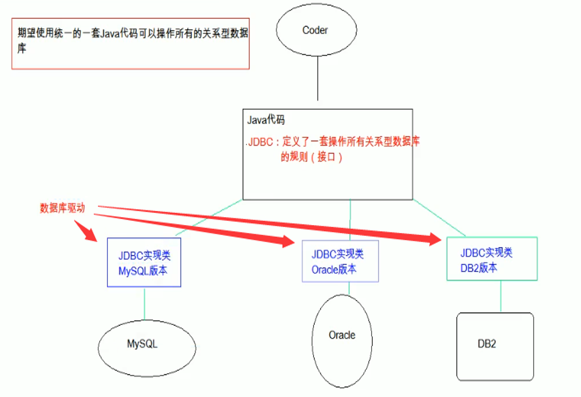

#JDBC快速入门

##概念

```
Java DataBase Connectivity  Java 数据库连接，这是用Java语言操作数据库的技术
	* JDBC本质：其实是官方（sun公司）定义的一套操作所有关系型数据库的规则，即接口。各个数据库厂商去实现这套接口，提供数据库驱动jar包。我们可以使用这套接口（JDBC）编程，真正执行的代码是驱动jar包中的实现类。
```

## 图解



##步骤

```java
1. 导入驱动jar包 mysql-connector-java-5.1.37-bin.jar
	1.复制mysql-connector-java-5.1.37-bin.jar到项目的libs目录下
	2.右键-->Add As Library
2. 注册驱动
3. 获取数据库连接对象 Connection
4. 定义sql
5. 获取执行sql语句的对象 Statement
6. 执行sql，接受返回结果
7. 处理结果
8. 释放资源
```


## 代码实现

```java
package com.bao.jdbc;

import java.sql.Connection;
import java.sql.DriverManager;
import java.sql.SQLException;
import java.sql.Statement;

public class JdbcDemo1 {
    public static void main(String[] args) throws ClassNotFoundException, SQLException {
        //1. 导入驱动jar包
        //2.注册驱动
        Class.forName("com.mysql.jdbc.Driver");//mysql5之后的驱动jar包可以省略注册驱动的步骤
        //3.获取数据库连接对象
        Connection conn = DriverManager.getConnection("jdbc:mysql://localhost:3306/db3", "root", "root");
        //4.定义sql语句
        String sql = "update account set balance = 500 where id = 1";
        //5.获取执行sql的对象 Statement
        Statement stmt = conn.createStatement();
        //6.执行sql
        int count = stmt.executeUpdate(sql);
        //7.处理结果
        System.out.println(count);
        //8.释放资源
        stmt.close();
        conn.close();
    }
}

```
#详解各个对象

##1. DriverManager：驱动管理对象

```java
* 功能：
	1. 注册驱动：告诉程序该使用哪一个数据库驱动jar包
		static void registerDriver(Driver driver) :注册与给定的驱动程序 DriverManager 。 
		写代码使用：  Class.forName("com.mysql.jdbc.Driver");
		通过查看源码发现：在com.mysql.jdbc.Driver类中存在静态代码块
		 static {
		        try {
		            java.sql.DriverManager.registerDriver(new Driver());
		        } catch (SQLException E) {
		            throw new RuntimeException("Can't register driver!");
		        }
			}
		注意：mysql5之后的驱动jar包可以省略注册驱动的步骤。
	2. 获取数据库连接：
		* 方法：static Connection getConnection(String url, String user, String password) 
		* 参数：
			* url：指定连接的路径
				* 语法：jdbc:mysql://ip地址(域名):端口号/数据库名称
				* 例子：jdbc:mysql://localhost:3306/db3
				* 细节：如果连接的是本机mysql服务器，并且mysql服务默认端口是3306，则url可以简写为：
                       jdbc:mysql:///数据库名称
			* user：用户名
			* password：密码 
```
##2. Connection：数据库连接对象

	功能：
		1. 获取执行sql的对象
			* Statement createStatement()
			* PreparedStatement prepareStatement(String sql)  
		
		2. 管理事务：
			* 开启事务：setAutoCommit(boolean autoCommit) ：调用该方法设置参数为false，即开启事务
			* 提交事务：commit() 
			* 回滚事务：rollback() 
##3. Statement：执行sql的对象

```
功能：
1. 执行sql语句
	1. boolean execute(String sql) ：可以执行任意的sql（了解）
	2. int executeUpdate(String sql) ：
    	* 执行DML(insert、update、delete)语句
    	* 执行DDL(create，alter、drop)语句，返回值得到的都是0，一般来讲并不会用来执行DDL语句
		* 返回值：影响行数 返回值>0的则执行成功，反之，则失败。
	3. ResultSet executeQuery(String sql)  ：执行DQL（select)语句
2. 练习：
	1. account表 添加一条记录
	2. account表 修改记录
	3. account表 删除一条记录
```
## 代码演示

```java
package com.bao.jdbc;

import java.sql.Connection;
import java.sql.DriverManager;
import java.sql.SQLException;
import java.sql.Statement;

public class JdbcDemo2 {
    public static void main(String[] args) {
        Statement stmt = null;
        Connection conn = null;
        try {
            //1. 注册驱动
            Class.forName("com.mysql.jdbc.Driver");
            //2. 定义sql
            String sql = "insert into account values(null,'王五',3000)";
            //String sql = "delete from account where id = 3";
            //String sql = "update account set balance = 1500 where id = 1";
            //String sql = "create table user(id int,name varchar(20))";//执行的返回值是0
            //3.获取Connection对象
            conn = DriverManager.getConnection("jdbc:mysql:///db3", "root", "root");
            //4.获取执行sql的对象 Statement
            stmt = conn.createStatement();
            //5.执行sql
            int count = stmt.executeUpdate(sql);//影响的行数
            //6.处理结果
            System.out.println(count);
            if(count > 0){
                System.out.println("成功！");
            }else{
                System.out.println("失败！");
            }
        } catch (ClassNotFoundException e) {
            e.printStackTrace();
        } catch (SQLException e) {
            e.printStackTrace();
        }finally {
            //7. 释放资源
            //避免空指针异常
            if(stmt != null){
                try {
                    stmt.close();
                } catch (SQLException e) {
                    e.printStackTrace();
                }
            }

            if(conn != null){
                try {
                    conn.close();
                } catch (SQLException e) {
                    e.printStackTrace();
                }
            }
        }
    }
}

```

##4. ResultSet：结果集对象

```java
* boolean next(): 游标向下移动一行，判断当前行是否是最后一行末尾(是否有数据)，如果是，则返回false，如果不是则返回true
* getXxx(参数):获取数据
	* Xxx：代表数据类型   如： int getInt() ,	String getString()
	* 参数：
		1. int：代表列的编号,从1开始   如： getString(1)
		2. String：代表列名称。 如： getDouble("balance")

* 注意：
	* 使用步骤：
		1. 游标向下移动一行
		2. 判断是否有数据
		3. 获取数据

	   //循环判断游标是否是最后一行末尾。
        while(resultSet.next()){
            //获取数据
            int id = resultSet.getInt(1);
            String name = resultSet.getString("name");
            double balance = resultSet.getDouble(3);

            System.out.println(id + "---" + name + "---" + balance);
        }

* 练习：
	* 定义一个方法，查询emp表的数据将其封装为对象，然后装载集合，返回。
		1. 定义Emp类
		2. 定义方法 public List<Emp> findAll(){}
		3. 实现方法 select * from emp;
```
## 代码演示：遍历结果集

```java
package com.bao.jdbc;

import java.sql.*;

public class JdbcDemo3 {
    public static void main(String[] args) {
        Statement stmt = null;
        Connection conn = null;
        try {
            //1. 注册驱动
            Class.forName("com.mysql.jdbc.Driver");
            //2. 定义sql
            String sql = "select * from account";
            //3.获取Connection对象
            conn = DriverManager.getConnection("jdbc:mysql://localhost:3306/db3", "root", "root");
            //4.获取执行sql的对象 Statement
            stmt = conn.createStatement();
            //5.执行sql，得到结果集
            ResultSet resultSet = stmt.executeQuery(sql);
            //6.处理结果
            while (resultSet.next()){
               /* int id = resultSet.getInt(1);
                String name = resultSet.getString(2);
                double balance = resultSet.getDouble(3);
                System.out.println(id+" "+name+" "+balance);*/
                int id = resultSet.getInt("id");
                String name = resultSet.getString("name");
                double balance = resultSet.getDouble("balance");
                System.out.println(id+" "+name+" "+balance);
            }
        } catch (ClassNotFoundException e) {
            e.printStackTrace();
        } catch (SQLException e) {
            e.printStackTrace();
        }finally {
            //7. 释放资源
            //避免空指针异常
            if(stmt != null){
                try {
                    stmt.close();
                } catch (SQLException e) {
                    e.printStackTrace();
                }
            }

            if(conn != null){
                try {
                    conn.close();
                } catch (SQLException e) {
                    e.printStackTrace();
                }
            }
        }
    }
}
```

## ResultSet小练习

```java
package com.bao.jdbc2;

import java.sql.*;
import java.util.ArrayList;

public class Demo1 {
    public static void main(String[] args) {
        ArrayList<User> users = new ArrayList<>();
        ResultSet resultSet = null;
        Statement statement = null;
        Connection connection = null;
        try {
            //1.导入jar包
            //2.注册驱动
            Class.forName("com.mysql.jdbc.Driver");
            //3.获取连接对象
            connection = DriverManager.getConnection("jdbc:mysql:///db3", "root", "root");
            //4.定义sql语句
            String sql = "select * from user";
            //5.获取执行sql语句的对象
            statement = connection.createStatement();
            //6.执行sql语句
            resultSet = statement.executeQuery(sql);
            //7.处理结果
            while (resultSet.next()){
                //有数据
                int id = resultSet.getInt("id");
                String name = resultSet.getString("name");
                double money = resultSet.getDouble("money");
                User user = new User(id, name, money);
                users.add(user);
            }
            //遍历集合
            for (User user : users) {
                System.out.println(user);
            }

        } catch (ClassNotFoundException e) {
            e.printStackTrace();
        } catch (SQLException e) {
            e.printStackTrace();
        }finally {
            if (resultSet != null){
                try {
                    resultSet.close();
                } catch (SQLException e) {
                    e.printStackTrace();
                }
            }
            if (statement != null){
                try {
                    statement.close();
                } catch (SQLException e) {
                    e.printStackTrace();
                }
            }
            if (connection != null){
                try {
                    connection.close();
                } catch (SQLException e) {
                    e.printStackTrace();
                }
            }
        }
    }
}
```

```java
package com.bao.jdbc2;

import java.util.Objects;

public class User {
    private int id;
    private String name;
    private double money;

    @Override
    public boolean equals(Object o) {
        if (this == o) return true;
        if (!(o instanceof User)) return false;
        User user = (User) o;
        return getId() == user.getId() &&
                Double.compare(user.getMoney(), getMoney()) == 0 &&
                Objects.equals(getName(), user.getName());
    }

    @Override
    public int hashCode() {
        return Objects.hash(getId(), getName(), getMoney());
    }

    public User(int id, String name, double money) {
        this.id = id;
        this.name = name;
        this.money = money;
    }

    public User() {
    }

    @Override
    public String toString() {
        return "User{" +
                "id=" + id +
                ", name='" + name + '\'' +
                ", money=" + money +
                '}';
    }

    public int getId() {
        return id;
    }

    public void setId(int id) {
        this.id = id;
    }

    public String getName() {
        return name;
    }

    public void setName(String name) {
        this.name = name;
    }

    public double getMoney() {
        return money;
    }

    public void setMoney(double money) {
        this.money = money;
    }
}
```


##5. PreparedStatement：执行sql的对象

	1. SQL注入问题：在拼接sql时，有一些sql的特殊关键字参与字符串的拼接。会造成安全性问题
		1. 输入用户随便，输入密码：a' or 'a' = 'a
		2. sql：select * from user where username = 'fhdsjkf' and password = 'a' or 'a' = 'a' 
	
	2. 解决sql注入问题：使用PreparedStatement对象来解决
	3. 预编译的SQL：参数使用?作为占位符
	4. 步骤：
		1. 导入驱动jar包 mysql-connector-java-5.1.37-bin.jar
		2. 注册驱动
		3. 获取数据库连接对象 Connection
		4. 定义sql
			* 注意：sql的参数使用？作为占位符。 如：select * from user where username = ? and password = ?;
		5. 获取执行sql语句的对象 PreparedStatement  Connection.prepareStatement(String sql) 
		6. 给？赋值：
			* 方法： setXxx(参数1,参数2)
				* 参数1：？的位置编号 从1 开始
				* 参数2：？的值
	        7. 执行sql，接受返回结果，不需要传递sql语句
		8. 处理结果
		9. 释放资源
	
	5. 注意：后期都会使用PreparedStatement来完成增删改查的所有操作
		1. 可以防止SQL注入
		2. 效率更高
##代码测试

```java
package com.bao.jdbc;

import java.sql.*;

public class JdbcDemo4 {
    public static void main(String[] args) {
        PreparedStatement stmt = null;
        Connection conn = null;
        try {
            //1. 注册驱动
            Class.forName("com.mysql.jdbc.Driver");
            //2. 定义sql
            String sql = "select * from account";
            //3.获取Connection对象
            conn = DriverManager.getConnection("jdbc:mysql://localhost:3306/db3", "root", "root");
            //4.获取执行sql的对象 Statement
            stmt = conn.prepareStatement(sql);
            //5.执行sql，得到结果集
            ResultSet resultSet = stmt.executeQuery();
            //6.处理结果
            while (resultSet.next()){
                int id = resultSet.getInt("id");
                String name = resultSet.getString("name");
                double balance = resultSet.getDouble("balance");
                System.out.println(id+" "+name+" "+balance);
            }
        } catch (ClassNotFoundException e) {
            e.printStackTrace();
        } catch (SQLException e) {
            e.printStackTrace();
        }finally {
            //7. 释放资源
            //避免空指针异常
            if(stmt != null){
                try {
                    stmt.close();
                } catch (SQLException e) {
                    e.printStackTrace();
                }
            }

            if(conn != null){
                try {
                    conn.close();
                } catch (SQLException e) {
                    e.printStackTrace();
                }
            }
        }
    }
}

```

## 创建对象测试

```java
package com.bao.jdbc;

import com.bao.domain.Account;
import java.sql.*;
import java.util.ArrayList;

public class JdbcDemo5 {
    public static void main(String[] args) {
        PreparedStatement stmt = null;
        Connection conn = null;
        ArrayList<Account> list = new ArrayList<Account>();
        try {
            //1. 注册驱动
            Class.forName("com.mysql.jdbc.Driver");
            //2. 定义sql
            String sql = "select * from account";
            //3.获取Connection对象
            conn = DriverManager.getConnection("jdbc:mysql://localhost:3306/db3", "root", "root");
            //4.获取执行sql的对象 Statement
            stmt = conn.prepareStatement(sql);
            //5.执行sql，得到结果集
            ResultSet resultSet = stmt.executeQuery();
            //6.处理结果
            while (resultSet.next()){
                int id = resultSet.getInt("id");
                String name = resultSet.getString("name");
                String balance = resultSet.getString("balance");
                Account account = new Account(id,name,balance);
                list.add(account);
            }
            for (Account account : list) {
                System.out.println(account);
            }
        } catch (ClassNotFoundException e) {
            e.printStackTrace();
        } catch (SQLException e) {
            e.printStackTrace();
        }finally {
            //7. 释放资源
            //避免空指针异常
            if(stmt != null){
                try {
                    stmt.close();
                } catch (SQLException e) {
                    e.printStackTrace();
                }
            }

            if(conn != null){
                try {
                    conn.close();
                } catch (SQLException e) {
                    e.printStackTrace();
                }
            }
        }
    }
}

```


# 抽取JDBC工具类 ： JDBCUtils

	* 目的：简化书写
	* 分析：
		1. 注册驱动也抽取
		2. 抽取一个方法获取连接对象
			* 需求：不想传递参数（麻烦），还得保证工具类的通用性。
			* 解决：配置文件
				jdbc.properties
					url=
					user=
					password=
		3. 抽取一个方法释放资源

##代码实现

```properties
driver=com.mysql.jdbc.Driver
url=jdbc:mysql://localhost:3306/db3
user=root
password=root
```


```java
package com.bao.jdbc;

import java.io.FileReader;
import java.io.IOException;
import java.net.URL;
import java.sql.*;
import java.util.Properties;

/**
 * JDBC工具类
 */
public class JDBCUtils {
    private static String url;
    private static String user;
    private static String password;
    private static String driver;
    /**
     * 文件的读取，只需要读取一次即可拿到这些值。使用静态代码块
     */
    static{
        //读取资源文件，获取值。
        try {
            //1. 创建Properties集合类。
            Properties pro = new Properties();
            //获取src路径下的文件的方式--->ClassLoader 类加载器
            ClassLoader classLoader = JDBCUtils.class.getClassLoader();
            URL res  = classLoader.getResource("jdbc.properties");
            String path = res.getPath();
            // System.out.println(path);
            //2. 加载文件
            // pro.load(new FileReader("D:\IDEADemo\JavaEETest\JavaWebTest\JDBCTest\src\jdbc.properties"));//绝对路径读取
            pro.load(new FileReader(path));

            //3. 获取数据，赋值
            url = pro.getProperty("url");
            user = pro.getProperty("user");
            password = pro.getProperty("password");
            driver = pro.getProperty("driver");
            //4. 注册驱动
            Class.forName(driver);
        } catch (IOException e) {
            e.printStackTrace();
        } catch (ClassNotFoundException e) {
            e.printStackTrace();
        }
    }


    /**
     * 获取连接
     * @return 连接对象
     */
    public static Connection getConnection() throws SQLException {

        return DriverManager.getConnection(url, user, password);
    }

    /**
     * 释放资源
     * @param stmt
     * @param conn
     */
    public static void close(Statement stmt,Connection conn){
        if( stmt != null){
            try {
                stmt.close();
            } catch (SQLException e) {
                e.printStackTrace();
            }
        }

        if( conn != null){
            try {
                conn.close();
            } catch (SQLException e) {
                e.printStackTrace();
            }
        }
    }


    /**
     * 释放资源
     * @param stmt
     * @param conn
     */
    public static void close(ResultSet rs,Statement stmt, Connection conn){
        if( rs != null){
            try {
                rs.close();
            } catch (SQLException e) {
                e.printStackTrace();
            }
        }

        if( stmt != null){
            try {
                stmt.close();
            } catch (SQLException e) {
                e.printStackTrace();
            }
        }

        if( conn != null){
            try {
                conn.close();
            } catch (SQLException e) {
                e.printStackTrace();
            }
        }
    }

}

```

## 使用工具类

```java
package com.bao.jdbc;

import com.bao.domain.Account;
import java.sql.*;
import java.util.ArrayList;

public class JdbcDemo6 {
    public static void main(String[] args) {
            Connection conn = null;
            Statement stmt = null;
            ResultSet rs = null;
            ArrayList<Account> list = null;
            try {
                conn = JDBCUtils.getConnection();
                //3.定义sql
                String sql = "select * from account";
                //4.获取执行sql的对象
                stmt = conn.createStatement();
                //5.执行sql
                rs = stmt.executeQuery(sql);
                //6.遍历结果集，封装对象，装载集合
                list = new ArrayList<Account>();
                while(rs.next()){
                    //获取数据
                    int id = rs.getInt("id");
                    String name = rs.getString("name");
                    double balance = rs.getDouble("balance");
                    Account account = new Account(id,name,balance);
                    //装载集合
                    list.add(account);
                }
                System.out.println(list);
            } catch (SQLException e) {
                e.printStackTrace();
            }finally {
                JDBCUtils.close(rs,stmt,conn);
            }
    }
}
```

## 登录案例

```java
package com.bao.jdbc;

import java.sql.Connection;
import java.sql.PreparedStatement;
import java.sql.ResultSet;
import java.sql.SQLException;
import java.util.Scanner;

public class JdbcDemo7 {

    public static void main(String[] args) {
        //1.键盘录入，接受用户名和密码
        Scanner sc = new Scanner(System.in);
        System.out.println("请输入用户名：");
        String username = sc.nextLine();
        System.out.println("请输入密码：");
        String password = sc.nextLine();
        //2.调用方法
        boolean flag = login2(username, password);
        //3.判断结果，输出不同语句
        if(flag){
            //登录成功
            System.out.println("登录成功！");
        }else{
            System.out.println("用户名或密码错误！");
        }
    }
    
    public static boolean login2(String username ,String password){
        if(username == null || password == null){
            return false;
        }
        //连接数据库判断是否登录成功
        Connection conn = null;
        PreparedStatement pstmt =  null;
        ResultSet rs = null;
        //1.获取连接
        try {
            conn =  JDBCUtils.getConnection();
            //2.定义sql
            String sql = "select * from user where username = ? and password = ?";
            //3.获取执行sql的对象
            pstmt = conn.prepareStatement(sql);
            //给?赋值
            pstmt.setString(1,username);
            pstmt.setString(2,password);
            //4.执行查询,不需要传递sql
            rs = pstmt.executeQuery();
            //5.判断
            return rs.next();//如果有下一行，则返回true
        } catch (SQLException e) {
            e.printStackTrace();
        }finally {
            JDBCUtils.close(rs,pstmt,conn);
        }
        return false;
    }
}
```

#JDBC控制事务

	1. 事务：一个包含多个步骤的业务操作。如果这个业务操作被事务管理，则这多个步骤要么同时成功，要么同时失败。
	2. 操作：
		1. 开启事务
		2. 提交事务
		3. 回滚事务
	3. 使用Connection对象来管理事务
		* 开启事务：setAutoCommit(boolean autoCommit) ：调用该方法设置参数为false，即开启事务
			* 在执行sql之前开启事务
		* 提交事务：commit() 
			* 当所有sql都执行完提交事务
		* 回滚事务：rollback() 
			* 在catch中回滚事务

##代码演示

```java
package com.bao.jdbc;

import java.sql.Connection;
import java.sql.PreparedStatement;
import java.sql.ResultSet;
import java.sql.SQLException;
import java.util.Scanner;

public class JdbcDemo8 {
    public static void main(String[] args) {
        Connection conn = null;
        PreparedStatement pstmt1 = null;
        PreparedStatement pstmt2 = null;
        try {
            //1.获取连接
            conn = JDBCUtils.getConnection();
            //开启事务
            conn.setAutoCommit(false);
            //2.定义sql
            //2.1 张三 - 500
            String sql1 = "update account set balance = balance - ? where id = ?";
            //2.2 李四 + 500
            String sql2 = "update account set balance = balance + ? where id = ?";
            //3.获取执行sql对象
            pstmt1 = conn.prepareStatement(sql1);
            pstmt2 = conn.prepareStatement(sql2);
            //4. 设置参数
            pstmt1.setDouble(1, 500);
            pstmt1.setInt(2, 1);

            pstmt2.setDouble(1, 500);
            pstmt2.setInt(2, 2);
            //5.执行sql
            pstmt1.executeUpdate();
            // 手动制造异常
            //int i = 3 / 0;
            pstmt2.executeUpdate();
            //提交事务
            conn.commit();
        } catch (Exception e) {
            //事务回滚
            try {
                if (conn != null) {
                    conn.rollback();
                }
            } catch (SQLException e1) {
                e1.printStackTrace();
            }
            e.printStackTrace();
        } finally {
            JDBCUtils.close(pstmt1, conn);
            JDBCUtils.close(pstmt2, null);
        }
    }
}
	
```


# 数据库连接池

##概念

	1. 概念：其实就是一个容器(集合)，存放数据库连接的容器。
		    当系统初始化好后，容器被创建，容器中会申请一些连接对象，当用户来访问数据库时，从容器中获取连接对象，用户访问完之后，会将连接对象归还给容器。
	
	2. 好处：
		1. 节约资源
		2. 用户访问高效：节省了从底层申请连接的时间

##图解


```java
3. 实现：连接池技术是sun公司定义好的接口
	1. 标准接口：DataSource   javax.sql包下的
		1. 方法：
			* 获取连接：getConnection()
			* 归还连接：Connection.close()。如果连接对象Connection是从连接池中获取的，那么调用Connection.close()方法，则不会再关闭连接了，而是归还连接

	2. 一般我们不去实现它，有数据库厂商来实现
		1. C3P0：数据库连接池技术
		2. Druid：数据库连接池实现技术，由阿里巴巴提供的

4. Druid：数据库连接池实现技术，由阿里巴巴提供
	1. 步骤：
		1. 导入jar包 druid-1.0.9.jar
		2. 定义配置文件：
			* 是properties形式的
			* 可以叫任意名称，可以放在任意目录下
		3. 加载配置文件。Properties
		4. 获取数据库连接池对象：通过工厂来来获取  DruidDataSourceFactory
		5. 获取连接：getConnection
	* 代码：
		 //3.加载配置文件
        Properties pro = new Properties();
        InputStream is = DruidDemo.class.getClassLoader().getResourceAsStream("druid.properties");
        pro.load(is);
        //4.获取连接池对象
        DataSource ds = DruidDataSourceFactory.createDataSource(pro);
        //5.获取连接
        Connection conn = ds.getConnection();
	2. 定义工具类
		1. 定义一个类 JDBCUtils
		2. 提供静态代码块加载配置文件，初始化连接池对象
		3. 提供方法
			1. 获取连接方法：通过数据库连接池获取连接
			2. 释放资源
			3. 获取连接池的方法
```

## 代码演示

### 编写工具类

```java
package com.bao.utils;

import com.alibaba.druid.pool.DruidDataSourceFactory;

import javax.sql.DataSource;
import java.io.IOException;
import java.sql.Connection;
import java.sql.ResultSet;
import java.sql.SQLException;
import java.sql.Statement;
import java.util.Properties;

public class JDBCUtils {
    //1.定义成员变量 DataSource
    private static DataSource ds;

    static {
        try {
            //1.加载配置文件
            Properties pro = new Properties();
            pro.load(JDBCUtils.class.getClassLoader().getResourceAsStream("druid.properties"));
            //2.获取DataSource
            ds = DruidDataSourceFactory.createDataSource(pro);
        } catch (IOException e) {
            e.printStackTrace();
        } catch (Exception e) {
            e.printStackTrace();
        }
    }

    /**
     * 获取连接
     */
    public static Connection getConnection() throws SQLException {
        return ds.getConnection();
    }

    /**
     * 释放资源
     */
    public static void close(Statement stmt, Connection conn) {
        close(null, stmt, conn);
    }
    public static void close(ResultSet rs, Statement stmt, Connection conn) {
        if (rs != null) {
            try {
                rs.close();
            } catch (SQLException e) {
                e.printStackTrace();
            }
        }
        if (stmt != null) {
            try {
                stmt.close();
            } catch (SQLException e) {
                e.printStackTrace();
            }
        }

        if (conn != null) {
            try {
                conn.close();//归还连接
            } catch (SQLException e) {
                e.printStackTrace();
            }
        }
    }
}
```

### druid.properties

```properties
driverClassName=com.mysql.jdbc.Driver
url=jdbc:mysql:///db3?characterEncoding=utf-8
username=root
password=root
# 初始化连接数
initialSize=5
# 最大连接数
maxActive=10
# 最长等待时间
maxWait=3000
```

### 测试代码

```java
package com.bao.utils;

import com.bao.domain.Account;
import com.bao.jdbc.JDBCUtils;

import java.sql.Connection;
import java.sql.PreparedStatement;
import java.sql.ResultSet;
import java.sql.SQLException;
import java.util.ArrayList;

public class JdbcDemo11 {
    public static void main(String[] args) {
            Connection conn = null;
            PreparedStatement stmt = null;
            ResultSet rs = null;
            ArrayList<Account> list = null;
            try {
                conn = JDBCUtils.getConnection();
                //3.定义sql
                String sql = "select * from account";
                //4.获取执行sql的对象
                stmt = conn.prepareStatement(sql);
                //5.执行sql
                rs = stmt.executeQuery();
                //6.遍历结果集，封装对象，装载集合
                list = new ArrayList<Account>();
                while(rs.next()){
                    //获取数据
                    int id = rs.getInt("id");
                    String name = rs.getString("name");
                    double balance = rs.getDouble("balance");
                    Account account = new Account(id,name,balance);
                    //装载集合
                    list.add(account);
                }
                System.out.println(list);
            } catch (SQLException e) {
                e.printStackTrace();
            }finally {
                JDBCUtils.close(rs,stmt,conn);
            }
    }
}
```


​			