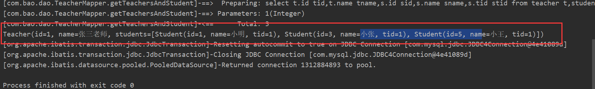
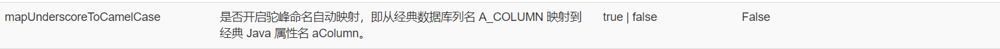
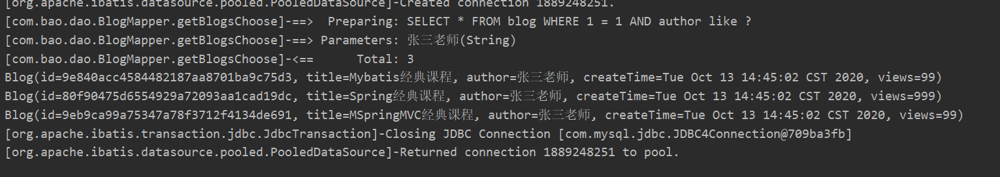
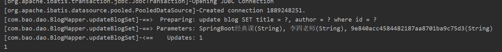
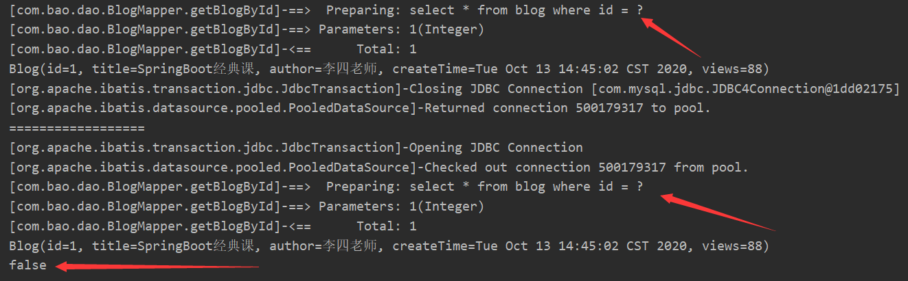
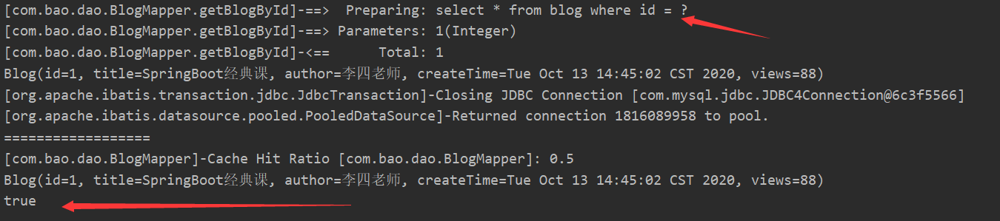
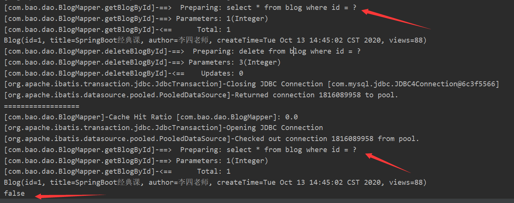
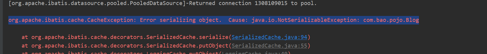
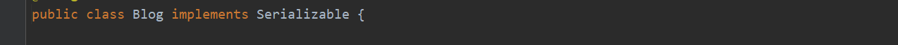

# 多对一

理解：多个学生对应一个老师

##简单查询

###数据库设计

```sql
CREATE TABLE `teacher` (
`id` INT(10) NOT NULL,
`name` VARCHAR(30) DEFAULT NULL,
PRIMARY KEY (`id`)
) ENGINE=INNODB DEFAULT CHARSET=utf8

INSERT INTO teacher(`id`, `name`) VALUES (1, '张三老师');
INSERT INTO teacher(`id`, `name`) VALUES (2, '李四老师');

CREATE TABLE `student` (
`id` INT(10) NOT NULL,
`name` VARCHAR(30) DEFAULT NULL,
`tid` INT(10) DEFAULT NULL,
PRIMARY KEY (`id`),
KEY `fktid` (`tid`),
CONSTRAINT `fktid` FOREIGN KEY (`tid`) REFERENCES `teacher` (`id`)
) ENGINE=INNODB DEFAULT CHARSET=utf8

INSERT INTO `student` (`id`, `name`, `tid`) VALUES ('1', '小明', '1');
INSERT INTO `student` (`id`, `name`, `tid`) VALUES ('2', '小红', '2');
INSERT INTO `student` (`id`, `name`, `tid`) VALUES ('3', '小张', '1');
INSERT INTO `student` (`id`, `name`, `tid`) VALUES ('4', '小李', '2');
INSERT INTO `student` (`id`, `name`, `tid`) VALUES ('5', '小王', '1');
```

###引入Maven依赖

```xml
<dependencies>
    <dependency>
        <groupId>org.mybatis</groupId>
        <artifactId>mybatis</artifactId>
        <version>3.5.2</version>
    </dependency>
    <dependency>
        <groupId>mysql</groupId>
        <artifactId>mysql-connector-java</artifactId>
        <version>5.1.47</version>
    </dependency>
    <dependency>
        <groupId>junit</groupId>
        <artifactId>junit</artifactId>
        <version>4.12</version>
        <scope>test</scope>
    </dependency>
    <dependency>
        <groupId>org.projectlombok</groupId>
        <artifactId>lombok</artifactId>
        <version>1.18.12</version>
        <scope>provided</scope>
    </dependency>
    <dependency>
        <groupId>log4j</groupId>
        <artifactId>log4j</artifactId>
        <version>1.2.17</version>
    </dependency>

</dependencies>
<build>
    <!--解决maven静态资源过滤的问题-->
    <resources>
        <resource>
            <directory>src/main/java</directory>
            <includes>
                <include>**/*.properties</include>
                <include>**/*.xml</include>
            </includes>
            <filtering>false</filtering>
        </resource>
        <resource>
            <directory>src/main/resources</directory>
            <includes>
                <include>**/*.properties</include>
                <include>**/*.xml</include>
            </includes>
            <filtering>false</filtering>
        </resource>
    </resources>
    <plugins>
        <!-- 设置jdk的版本-->
        <plugin>
            <groupId>org.apache.maven.plugins</groupId>
            <artifactId>maven-compiler-plugin</artifactId>
            <configuration>
                <source>1.8</source>
                <target>1.8</target>
                <encoding>UTF-8</encoding>
            </configuration>
        </plugin>
    </plugins>
</build>
```

###新建实体类

```java
package com.bao.pojo;

import lombok.AllArgsConstructor;
import lombok.Data;
import lombok.NoArgsConstructor;

@Data
@AllArgsConstructor
@NoArgsConstructor
public class Student {
    private int id;
    private String name;
    //多个学生拥有同一个老师
    private Teacher teacher;
}
```

```java
package com.bao.pojo;

import lombok.AllArgsConstructor;
import lombok.Data;
import lombok.NoArgsConstructor;

@Data
@AllArgsConstructor
@NoArgsConstructor
public class Teacher {
    private int id;
    private String name;
}
```

###建立Mapper接口

```java
package com.bao.dao;

public interface StudentMapper {
   
}

```

```java
package com.bao.dao;

import com.bao.pojo.Teacher;
import java.util.List;

public interface TeacherMapper {
    List<Teacher> getTeachers();
}

```

###建立Mapper.xml文件

```xml
<?xml version="1.0" encoding="UTF-8" ?>
<!--节点改为mapper，与下方的标签名对应-->
<!DOCTYPE mapper
    PUBLIC "-//mybatis.org//DTD Config 3.0//EN"
    "http://mybatis.org/dtd/mybatis-3-mapper.dtd">
<mapper namespace="com.bao.mapper.StudentMapper">

</mapper>
```

```xml
<?xml version="1.0" encoding="UTF-8" ?>
<!--节点改为mapper，与下方的标签名对应-->
<!DOCTYPE mapper
        PUBLIC "-//mybatis.org//DTD Config 3.0//EN"
        "http://mybatis.org/dtd/mybatis-3-mapper.dtd">
<mapper namespace="com.bao.mapper.TeacherMapper">
    <select id="getTeachers" resultType="teacher">
        select * from teacher
    </select>
</mapper>
```

### 创建log4j.properties文件

```properties
#将等级为DEBUG的日志信息输出到console和file这两个目的地，console和file的定义在下面的代码
log4j.rootLogger=DEBUG,console,file

#控制台输出的相关设置
#使用log4j作为日志实现
log4j.appender.console = org.apache.log4j.ConsoleAppender
log4j.appender.console.Target = System.out
log4j.appender.console.Threshold=DEBUG
log4j.appender.console.layout = org.apache.log4j.PatternLayout
#日志格式
log4j.appender.console.layout.ConversionPattern=[%c]-%m%n

#文件输出的相关设置
log4j.appender.file = org.apache.log4j.RollingFileAppender
#文件输出的位置
log4j.appender.file.File=./log/bao.log
#文件最大为10mb
log4j.appender.file.MaxFileSize=10mb
log4j.appender.file.Threshold=DEBUG
log4j.appender.file.layout=org.apache.log4j.PatternLayout
log4j.appender.file.layout.ConversionPattern=[%p][%d{yy-MM-dd}][%c]%m%n

#日志输出级别
log4j.logger.org.mybatis=DEBUG
log4j.logger.java.sql=DEBUG
log4j.logger.java.sql.Statement=DEBUG
log4j.logger.java.sql.ResultSet=DEBUG
log4j.logger.java.sql.PreparedStatement=DEBUG
```


### 创建db.properties文件

```properties
driver=com.mysql.jdbc.Driver
url=jdbc:mysql://localhost:3306/mybatis?useSSL=true&useUnicode=true&characterEncoding=utf8
username=root
password=root
```

### 创建mybatis-config.xml核心配置文件

```xml
<?xml version="1.0" encoding="UTF-8" ?>
<!DOCTYPE configuration
        PUBLIC "-//mybatis.org//DTD Config 3.0//EN"
        "http://mybatis.org/dtd/mybatis-3-config.dtd">
<configuration>
    <!--导入db.properties-->
    <properties resource="db.properties"/>
    
    <!--设置-->
    <settings>
        <!--设置日志实现，注意位置顺序-->
        <setting name="logImpl" value="LOG4J"/>
    </settings>
    
    <!--设置别名-->
    <typeAliases>
        <package name="com.bao.pojo"/>
    </typeAliases>

    <environments default="development">
        <environment id="development">
            <transactionManager type="JDBC"/>
            <dataSource type="POOLED">
                <property name="driver" value="${driver}"/>
                <property name="url" value="${url}"/>
                <property name="username" value="${username}"/>
                <property name="password" value="${password}"/>
            </dataSource>
        </environment>
    </environments>
    <mappers>
        <mapper resource="com/bao/dao/StudentMapper.xml"/>
        <mapper resource="com/bao/dao/TeacherMapper.xml"/>
    </mappers>

</configuration>
```

### 工具类Mybatisutils

```java
package com.bao.util;

import org.apache.ibatis.io.Resources;
import org.apache.ibatis.session.SqlSession;
import org.apache.ibatis.session.SqlSessionFactory;
import org.apache.ibatis.session.SqlSessionFactoryBuilder;

import java.io.IOException;
import java.io.InputStream;

public class MybatisUtils {
    private static SqlSessionFactory sqlSessionFactory;

    /*第一步：获取SqlSessionFactory*/
    static {
        try {
            String path = "mybatis-config.xml";
            InputStream inputStream = Resources.getResourceAsStream(path);
            SqlSessionFactoryBuilder sqlSessionFactoryBuilder = new SqlSessionFactoryBuilder();
            sqlSessionFactory = sqlSessionFactoryBuilder.build(inputStream);
        } catch (IOException e) {
            e.printStackTrace();
        }
    }

    /*第二步：获取sqlsession*/
    public static SqlSession getSqlSession(){
//        SqlSession sqlSession = sqlSessionFactory.openSession();
        SqlSession sqlSession = sqlSessionFactory.openSession(true);
        return sqlSession;
    }
}
```

### 结构展示


###测试查询是否成功

```java
@Test
public void TestGetTeachers(){
  SqlSession sqlSession = MybatisUtils.getSqlSession();
  TeacherMapper mapper = sqlSession.getMapper(TeacherMapper.class);
  List<Teacher> teachers = mapper.getTeachers();
  for (Teacher teacher : teachers) {
    System.out.println(teacher);
  }
  sqlSession.close();
}
```


##复杂查询

###方式一：子查询

> 思路
>
> > 查询所有学生信息
> >
> > 根据查询出来的学生的tid，寻找对应的老师

####接口

```java
/*查询学生信息以及对应的老师信息*/
List<Student> getStudentsAndTeachers();
```

####映射文件

```xml
<?xml version="1.0" encoding="UTF-8" ?>
<!--节点改为mapper，与下方的标签名对应-->
<!DOCTYPE mapper
        PUBLIC "-//mybatis.org//DTD Config 3.0//EN"
        "http://mybatis.org/dtd/mybatis-3-mapper.dtd">
<mapper namespace="com.bao.dao.StudentMapper">
    <!--因为返回的属性之中有复杂类型，所以我们使用resultMap属性-->
    <select id="getStudentsAndTeachers" resultMap="StudentTeacher">
        select * from student;
    </select>

    <!--注意：id的值需要与select中的resultMap的值相同，type为返回结果的类型-->
    <resultMap id="StudentTeacher" type="student">
        <result property="id" column="id"/>
        <result property="name" column="name"/>
        <!--复杂属性需要我们单独处理，对象属性使用association标签，集合属性使用collection标签-->
        <!--association标签：
            property对应JavaBean中的属性名；
            JavaType对应该属性的类型；
            column对应数据库中的属性；
            select对应子查询语句的id值；-->
        <association property="teacher" javaType="teacher" column="tid"  select="getTeacher"/>
    </resultMap>
    
    <!--子查询语句：id值对应resultMap中的association的select属性的值-->
    <!--#{tid}:这里的tid本质上会自动匹配传递过来的参数，但是写法上还是建议与传递过来的参数的名称一致-->
    <select id="getTeacher" resultType="teacher">
        select * from teacher where id = #{tid}
    </select>
    
</mapper>
```

####测试

```java
@Test
public void getStudentsAndTeachersTest(){
    SqlSession sqlSession = MybatisUtils.getSqlSession();
    StudentMapper mapper = sqlSession.getMapper(StudentMapper.class);
    List<Student> students = mapper.getStudentsAndTeachers();
    for (Student student : students) {
        System.out.println(student);
    }
    sqlSession.close();
}
```


###方式二：联表查询

####接口

```java
/*方式二：查询学生信息以及对应的老师信息*/
List<Student> getStudentsAndTeachers2();
```

####映射文件

```xml
<!--方式二：按照结果嵌套处理-->
<select id="getStudentsAndTeachers2" resultMap="StudentTeacher2">
    select s.id sid,s.name sname,t.id tid,t.name tname from Student s,Teacher t where s.tid = t.id;
</select>
<resultMap id="StudentTeacher2" type="student">
    <result property="id" column="sid"/>
    <result property="name" column="sname"/>
    <association property="teacher" javaType="teacher">
        <result property="id" column="tid"/>
        <result property="name" column="tname"/>
    </association>
</resultMap>
```

####测试

```java
@Test
public void getStudentsAndTeachers2Test(){
    SqlSession sqlSession = MybatisUtils.getSqlSession();
    StudentMapper mapper = sqlSession.getMapper(StudentMapper.class);
    List<Student> students = mapper.getStudentsAndTeachers2();
    for (Student student : students) {
        System.out.println(student);
    }
    sqlSession.close();
}
```

###小结

按照查询进行嵌套处理就像SQL中的子查询

按照结果进行嵌套处理就像SQL中的联表查询


# 一对多

理解：一个老师拥有多个学生

> 环境搭建

##实体类编写

```java
package com.bao.pojo;

import lombok.AllArgsConstructor;
import lombok.Data;
import lombok.NoArgsConstructor;

import java.util.List;
import java.util.Objects;

@Data
@AllArgsConstructor
@NoArgsConstructor
public class Teacher {
    private int id;
    private String name;
    //一个老师拥有多个学生
    private List<Student> students;

}
```

```java
package com.bao.pojo;

import lombok.AllArgsConstructor;
import lombok.Data;
import lombok.NoArgsConstructor;

@Data
@AllArgsConstructor
@NoArgsConstructor
public class Student {
    private int id;
    private String name;
    
    private int tid;
}
```

##接口 

```java
package com.bao.dao;

import com.bao.pojo.Teacher;

import java.util.List;

public interface TeacherMapper {
    List<Teacher> findAllTeacher();

    /*查询某一个老师的信息*/
    Teacher getTeachersAndStudent(@Param("tid")int id);

    /*查询所有老师的信息*/
    List<Teacher> getAllTeachersAndStudent();

}
```

##映射文件

```xml
<?xml version="1.0" encoding="UTF-8" ?>
<!DOCTYPE mapper
        PUBLIC "-//mybatis.org//DTD Config 3.0//EN"
        "http://mybatis.org/dtd/mybatis-3-mapper.dtd">
<mapper namespace="com.bao.mapper.TeacherMapper">

    <select id="findAllTeacher" resultType="teacher">
        select * from teacher;
    </select>

    <select id="getTeachersAndStudent" resultMap="teacherAndStudent">
        select t.id tid,t.name tname,s.id sid,s.name sname,s.tid stid from teacher t,student s where t.id = s.tid and t.id = #{tid};
    </select>

    <select id="getAllTeachersAndStudent" resultMap="teacherAndStudent">
        select t.id tid,t.name tname,s.id sid,s.name sname,s.tid stid from teacher t,student s where t.id = s.tid
    </select>
    
    <resultMap id="teacherAndStudent" type="teacher">
        <result property="id" column="tid"/>
        <result property="name" column="tname"/>
        <!--集合中的泛型信息用ofType来获取-->
        <collection property="students" ofType="student">
            <result column="sid" property="id"/>
            <result column="sname" property="name"/>
            <result column="stid" property="tid"/>
        </collection>
    </resultMap>

</mapper>
```

##测试类

```java
package com.bao.mapper;

import com.bao.domain.Teacher;
import com.bao.util.MybatisUtils;
import org.apache.ibatis.session.SqlSession;
import org.junit.Test;

import java.util.List;

public class TeacherMapperTest {
    @Test
    public void testFindAllTeacher(){
        SqlSession sqlSession = MybatisUtils.getSqlSession();
        TeacherMapper mapper = sqlSession.getMapper(TeacherMapper.class);
        List<Teacher> allTeacher = mapper.findAllTeacher();
        for (Teacher teacher : allTeacher) {
            System.out.println(teacher);
        }
        sqlSession.close();
    }

    @Test
    public void testGetTeachersAndStudent(){
        SqlSession sqlSession = MybatisUtils.getSqlSession();
        TeacherMapper mapper = sqlSession.getMapper(TeacherMapper.class);
        Teacher teachersAndStudent = mapper.getTeachersAndStudent(1);
        System.out.println(teachersAndStudent);
        sqlSession.close();
    }

    @Test
    public void testGetAllTeachersAndStudent(){
        SqlSession sqlSession = MybatisUtils.getSqlSession();
        TeacherMapper mapper = sqlSession.getMapper(TeacherMapper.class);
        List<Teacher> allTeachersAndStudent = mapper.getAllTeachersAndStudent();
        for (Teacher teacher : allTeachersAndStudent) {
            System.out.println(teacher);
        }
        sqlSession.close();
    }
}

```

##结果



##小结

> 1、关联-association
>
> 2、集合-collection
>
> 3、所以association是用于一对一和多对一，而collection是用于一对多的关系
>
> 4、JavaType和ofType都是用来指定对象类型的
>
> > JavaType是用来指定pojo中属性的类型
> >
> > ofType指定的是映射到list集合属性中pojo的类型，也就是泛型的类型

##注意

> 1、保证SQL的可读性，尽量通俗易懂
>
> 2、根据实际要求，尽量编写性能更高的SQL语句
>
> 3、注意属性名和字段不一致的问题
>
> 4、注意一对多和多对一中字段和属性对应的问题
>
> 5、尽量使用Log4j，通过日志来查看自己的错误


# 动态sql

##什么是动态SQL

> 动态SQL指的是根据不同的查询条件 , 生成不同的Sql语句


## 环境搭建

###数据库

```sql
CREATE TABLE blog (
`id` varchar(50) NOT NULL COMMENT '博客id',
`title` varchar(100) NOT NULL COMMENT '博客标题',
`author` varchar(30) NOT NULL COMMENT '博客作者',
`create_time` datetime NOT NULL COMMENT '创建时间',
`views` int(30) NOT NULL COMMENT '浏览量'
) ENGINE=InnoDB DEFAULT CHARSET=utf8
```

###创建一个工程、导包

```xml
<dependencies>
    <dependency>
        <groupId>org.mybatis</groupId>
        <artifactId>mybatis</artifactId>
        <version>3.5.2</version>
    </dependency>
    <dependency>
        <groupId>mysql</groupId>
        <artifactId>mysql-connector-java</artifactId>
        <version>5.1.47</version>
    </dependency>
    <dependency>
        <groupId>junit</groupId>
        <artifactId>junit</artifactId>
        <version>4.12</version>
        <scope>test</scope>
    </dependency>
    <dependency>
        <groupId>org.projectlombok</groupId>
        <artifactId>lombok</artifactId>
        <version>1.18.12</version>
        <scope>provided</scope>
    </dependency>
    <dependency>
        <groupId>log4j</groupId>
        <artifactId>log4j</artifactId>
        <version>1.2.17</version>
    </dependency>

</dependencies>
<build>
    <!--解决maven静态资源过滤的问题-->
    <resources>
        <resource>
            <directory>src/main/java</directory>
            <includes>
                <include>**/*.properties</include>
                <include>**/*.xml</include>
            </includes>
            <filtering>false</filtering>
        </resource>
        <resource>
            <directory>src/main/resources</directory>
            <includes>
                <include>**/*.properties</include>
                <include>**/*.xml</include>
            </includes>
            <filtering>false</filtering>
        </resource>
    </resources>
    <plugins>
        <!-- 设置jdk的版本-->
        <plugin>
            <groupId>org.apache.maven.plugins</groupId>
            <artifactId>maven-compiler-plugin</artifactId>
            <configuration>
                <source>1.8</source>
                <target>1.8</target>
                <encoding>UTF-8</encoding>
            </configuration>
        </plugin>
    </plugins>
</build>
```

###编写实体类

```java
package com.bao.pojo;

import lombok.AllArgsConstructor;
import lombok.Data;
import lombok.NoArgsConstructor;
import java.util.Date;

@Data
@AllArgsConstructor
@NoArgsConstructor
public class Blog {

    private String id;
    private String title;
    private String author;
    /*
    * 1.建议使用util包下的date
    * 2.属性名和字段名不一致，可通过设置mapUnderscoreToCamelCase的值为true，来开启自动驼峰命名规则映射
    * */
    private Date createTime;
    private int views;

}
```

###编写Mapper接口

```java
package com.bao.dao;

import com.bao.pojo.Blog;
import java.util.List;

public interface BlogMapper {

    /*查询所有*/
    List<Blog> getBlogs();

    /*插入一条数据*/
    int insertBlog(Blog blog);
}
```

###编写接口对应的映射文件

```xml
<?xml version="1.0" encoding="UTF-8" ?>
<!DOCTYPE mapper
        PUBLIC "-//mybatis.org//DTD Config 3.0//EN"
        "http://mybatis.org/dtd/mybatis-3-mapper.dtd">
<mapper namespace="com.bao.dao.BlogMapper">
    <select id="getBlogs" resultType="blog">
        select * from blog
    </select>

    <insert id="insertBlog" parameterType="Blog">
        insert into blog values (#{id},#{title},#{author},#{createTime},#{views})
    </insert>
</mapper>
```

### db.properties

```properties
driver=com.mysql.jdbc.Driver
url=jdbc:mysql://localhost:3306/mybatis?useSSL=true&useUnicode=true&characterEncoding=utf8
username=root
password=root
```


###编写配置文件mybatis-config.xml

**开启驼峰命名转换**



```xml
<?xml version="1.0" encoding="UTF-8" ?>
<!DOCTYPE configuration
        PUBLIC "-//mybatis.org//DTD Config 3.0//EN"
        "http://mybatis.org/dtd/mybatis-3-config.dtd">
<configuration>
    <!--导入db.properties-->
    <properties resource="db.properties"/>

    <!--设置-->
    <settings>
        <!--设置日志实现，注意位置顺序-->
        <setting name="logImpl" value="LOG4J"/>
        <!--开启驼峰命名转换-->
        <setting name="mapUnderscoreToCamelCase" value="true"/>
    </settings>

    <!--设置别名-->
    <typeAliases>
        <package name="com.bao.pojo"/>
    </typeAliases>

    <environments default="development">
        <environment id="development">
            <transactionManager type="JDBC"/>
            <dataSource type="POOLED">
                <property name="driver" value="${driver}"/>
                <property name="url" value="${url}"/>
                <property name="username" value="${username}"/>
                <property name="password" value="${password}"/>
            </dataSource>
        </environment>
    </environments>
    <mappers>
        <mapper class="com.bao.dao.BlogMapper"/>
    </mappers>

</configuration>
```

###编写工具类

```java
package com.bao.utils;

import org.junit.jupiter.api.Test;
import java.util.UUID;

public class IDUtils {

    /*生成随机的id*/
    public static String getId(){
        String s = UUID.randomUUID().toString();
        String replace = s.replace("-", "");
        return replace;
    }
}
```

```java
package com.bao.utils;

import org.apache.ibatis.io.Resources;
import org.apache.ibatis.session.SqlSession;
import org.apache.ibatis.session.SqlSessionFactory;
import org.apache.ibatis.session.SqlSessionFactoryBuilder;

import java.io.IOException;
import java.io.InputStream;

public class MybatisUtils {
    /*
    * 使用Mybatis的第一步：获取sqlSessionFactory对象
    * */
    private static SqlSessionFactory sqlSessionFactory = null;
    static {
        try {
            String resource = "mybatis-config.xml";
            InputStream inputStream = Resources.getResourceAsStream(resource);
            sqlSessionFactory = new SqlSessionFactoryBuilder().build(inputStream);
        } catch (IOException e) {
            e.printStackTrace();
        }
    }
    /*
    * 接下来可以获取sqlSession实例，他之中完全包含SQL命令所需的所有方法
    * */
    public static SqlSession getSqlSession(){
        //设置参数为true：可以自动提交事务
        return sqlSessionFactory.openSession(true);
    }
}

```

###编写测试类

```java
package com.bao.dao;

import com.bao.pojo.Blog;
import com.bao.utils.IDUtils;
import com.bao.utils.MybatisUtils;
import org.apache.ibatis.session.SqlSession;
import org.junit.Test;
import java.util.Date;
import java.util.List;

public class BlogMapperTest {
    /*测试uuid的方法*/
    @Test
    public void getIdTest(){
        System.out.println(IDUtils.getId());
    }

    @Test
    public void getBlogTest(){
        SqlSession sqlSession = MybatisUtils.getSqlSession();
        BlogMapper mapper = sqlSession.getMapper(BlogMapper.class);
        List<Blog> blogs = mapper.getBlogs();
        for (Blog blog : blogs) {
            System.out.println(blog);
        }
        sqlSession.close();
    }

    @Test
    public void insertBlogTest(){
        SqlSession sqlSession = MybatisUtils.getSqlSession();
        BlogMapper mapper = sqlSession.getMapper(BlogMapper.class);
        mapper.insertBlog(new Blog(IDUtils.getId(), "Mybatis经典课程", "张三老师", new Date(), 99));
        mapper.insertBlog(new Blog(IDUtils.getId(), "Spring经典课程", "张三老师", new Date(), 999));
        mapper.insertBlog(new Blog(IDUtils.getId(), "MSpringMVC经典课程", "张三老师", new Date(), 99));
        sqlSession.close();
    }
}

```


## if、where

###理解

if：动态 SQL 通常要做的事情是有条件地包含 where 子句的一部分

where：只有在一个以上的if条件有值的情况下才去插入"WHERE"子句。而且，若最后的内容是"AND"或"OR"开头的，where 元素也知道如何将他们去除

###接口

```java
/*if查询*/
List<Blog> getBlogsIf(Map<String,Object> map);
```

###映射文件

```xml
<select id="getBlogsIf" resultType="Blog">
    /*select * from blog where 1 = 1*/
    select * from blog
    <where>
        <if test="title != null">
            and title = #{title}
        </if>
        <if test="author != null">
            and author = #{author}
        </if>
    </where>
</select>
```

###测试

```java
@Test
public void getBlogsIfTest(){
    SqlSession sqlSession = MybatisUtils.getSqlSession();
    BlogMapper mapper = sqlSession.getMapper(BlogMapper.class);
    Map<String,Object> map = new HashMap<String,Object>();
    map.put("title","Mybatis经典课程");
    /*map.put("author","张三老师");*/
    List<Blog> blogsIf = mapper.getBlogsIf(map);
    for (Blog blog : blogsIf) {
        System.out.println(blog);
    }
    sqlSession.close();
}
```

###结果


## choose、when、otherwise

###理解

有些时候，我们不想用到所有的条件语句，而只想从中择其一二。针对这种情况，MyBatis 提供了 choose 元素，它有点像 Java 中的 switch 语句，when相当于case，otherwise相当于default。但是这次变为提供了"title"就按"title"查找，提供了"author"就按"author"查找，若两者都没有提供，就返回所有符合条件的BLOG（实际情况可能是由管理员按一定策略选出BLOG列表，而不是返回大量无意义的随机结果）。

###接口

```java
/*choose、when、otherwise查询*/
List<Blog> getBlogsChoose(Map<String,Object> map);
```

###映射文件

```xml
<select id="getBlogsChoose" resultType="Blog">
    SELECT * FROM blog WHERE 1 = 1
    <choose>
        <when test="title != null">
            AND title like #{title}
        </when>
        <when test="author != null">
            AND author like #{author}
        </when>
        <otherwise>
            AND 1 = 1
        </otherwise>
    </choose>
</select>
```

###测试

```java
@Test
public void getBlogsChooseTest(){
    SqlSession sqlSession = MybatisUtils.getSqlSession();
    BlogMapper mapper = sqlSession.getMapper(BlogMapper.class);
    Map<String,Object> map = new HashMap<String,Object>();
    map.put("author","张三老师");
    List<Blog> blogsChoose = mapper.getBlogsChoose(map);
    for (Blog blog : blogsChoose) {
        System.out.println(blog);
    }
    sqlSession.close();
}
```

###结果




## set

###理解

会动态前置 SET 关键字，同时也会消除无关的逗号，因为用了条件语句之后很可能就会在生成的赋值语句的后面留下这些逗号

###接口

```java
/*set*/
int updateBlogSet(Blog blog);
```

###映射文件

```xml
<update id="updateBlogSet" parameterType="Blog">
    update blog
    <set>
        <if test="title != null" >title = #{title},</if>
        <if test="author != null" >author = #{author},</if>
        <if test="createTime != null" >create_time = #{createTime},</if>
        <if test="views != 0" >views = #{views}</if>
    </set>
    where id = #{id}
</update>
```

###测试

```java
@Test
public void updateblogSetTest(){
    SqlSession sqlSession = MybatisUtils.getSqlSession();
    BlogMapper mapper = sqlSession.getMapper(BlogMapper.class);
    Blog blog = new Blog();
    blog.setId("9e840acc4584482187aa8701ba9c75d3");
    blog.setTitle("SpringBoot经典课");
    blog.setAuthor("李四老师");
    int i = mapper.updateBlogSet(blog);
    System.out.println(i);
    sqlSession.close();
}
```

###结果




## foreach

###理解 

动态 SQL 的另一个常见使用场景是对集合进行遍历（尤其是在构建 IN 条件语句的时候）

*foreach* 元素的功能非常强大，它允许你指定一个集合，声明可以在元素体内使用的集合项（item）和索引（index）变量。它也允许你指定开头与结尾的字符串以及集合项迭代之间的分隔符。这个元素也不会错误地添加多余的分隔符

你可以将任何可迭代对象（如 List、Set 等）、Map 对象或者数组对象作为集合参数传递给 *foreach*。当使用可迭代对象或者数组时，index 是当前迭代的序号，item 的值是本次迭代获取到的元素。当使用 Map 对象（或者 Map.Entry 对象的集合）时，index 是键，item 是值。

###接口

```java
/*foreach*/
List<Blog> getBlogsForeach(Map<String,Object> map);
```

###映射文件

```xml
<!--select * from blog where (id = 1 or id = 2)-->
<select id="getBlogsForeach" parameterType="map" resultType="Blog">
    select * from blog
    <where>
        <foreach collection="ids" item="id" open="(" close=")" separator="or">
            id = #{id}
        </foreach>
    </where>
</select>
```

###测试

```java
@Test
public void getBlogsForeachTest(){
    /*查询数据库id为1，2的数据*/
    SqlSession sqlSession = MybatisUtils.getSqlSession();
    BlogMapper mapper = sqlSession.getMapper(BlogMapper.class);
    Map<String,Object> map = new HashMap<String, Object>();
    List<Integer> ids = new ArrayList<Integer>();
    ids.add(1);
    ids.add(2);
    map.put("ids",ids);
    List<Blog> blogsForeach = mapper.getBlogsForeach(map);
    for (Blog foreach : blogsForeach) {
        System.out.println(foreach);
    }
    sqlSession.close();
}
```

###结果


# 缓存

MyBatis 内置了一个强大的事务性查询管理机制，它可以非常方便地配置和定制

##简介

> 什么是缓存 [ Cache ]？
>
> > 存在内存中的临时数据。
> >
> > 将用户经常查询的数据放在缓存（内存）中，用户去查询数据就不用从磁盘上查询，从缓存中查询，从而提高查询效率，解决了高并发系统的性能问题
> >
> > > 高并发是指在同一个时间点，有很多用户同时访问URL地址


> 为什么使用缓存？
>
> > 减少和数据库的交互次数，提高系统效率。


> 什么样的数据能使用缓存？
>
> > 经常查询并且不经常改变的数据。
> >


##Mybatis缓存

> MyBatis包含一个非常强大的查询缓存特性，它可以非常方便地定制和配置缓存。缓存可以极大的提升查询效率。
>
> MyBatis系统中默认定义了两级缓存：一级缓存和二级缓存
>
> - 默认情况下，只有一级缓存开启。（SqlSession级别的缓存，也称为本地缓存）
> - 二级缓存需要手动开启和配置，他是基于namespace级别的缓存。
> - 为了提高扩展性，MyBatis定义了缓存接口Cache。我们可以通过实现Cache接口来自定义二级缓存


##一级缓存

> 一级缓存也叫本地缓存：
>
> - 与数据库同一次会话期间查询到的数据会放在本地缓存中。
> - 以后如果需要获取相同的数据，直接从缓存中拿，没必须再去查询数据库；
>

##测试

###搭建环境


###导入jar包

```xml
<dependencies>
        <dependency>
            <groupId>org.mybatis</groupId>
            <artifactId>mybatis</artifactId>
            <version>3.5.2</version>
        </dependency>
        <dependency>
            <groupId>mysql</groupId>
            <artifactId>mysql-connector-java</artifactId>
            <version>5.1.47</version>
        </dependency>
        <dependency>
            <groupId>junit</groupId>
            <artifactId>junit</artifactId>
            <version>4.12</version>
            <scope>test</scope>
        </dependency>
        <dependency>
            <groupId>org.projectlombok</groupId>
            <artifactId>lombok</artifactId>
            <version>1.18.12</version>
            <scope>provided</scope>
        </dependency>
        <dependency>
            <groupId>log4j</groupId>
            <artifactId>log4j</artifactId>
            <version>1.2.17</version>
        </dependency>

    </dependencies>
    <build>
        <!--解决maven静态资源过滤的问题-->
        <resources>
            <resource>
                <directory>src/main/java</directory>
                <includes>
                    <include>**/*.properties</include>
                    <include>**/*.xml</include>
                </includes>
                <filtering>false</filtering>
            </resource>
            <resource>
                <directory>src/main/resources</directory>
                <includes>
                    <include>**/*.properties</include>
                    <include>**/*.xml</include>
                </includes>
                <filtering>false</filtering>
            </resource>
        </resources>
        <plugins>
            <!-- 设置jdk的版本-->
            <plugin>
                <groupId>org.apache.maven.plugins</groupId>
                <artifactId>maven-compiler-plugin</artifactId>
                <configuration>
                    <source>1.8</source>
                    <target>1.8</target>
                    <encoding>UTF-8</encoding>
                </configuration>
            </plugin>
        </plugins>
    </build>
```

###导入配置文件

db.properties

```properties
driver=com.mysql.jdbc.Driver
url=jdbc:mysql://localhost:3306/mybatis?useSSL=true&useUnicode=true&characterEncoding=utf8
username=root
password=root
```

log4j.properties

```properties
#将等级为DEBUG的日志信息输出到console和file这两个目的地，console和file的定义在下面的代码
log4j.rootLogger=DEBUG,console,file

#控制台输出的相关设置
log4j.appender.console = org.apache.log4j.ConsoleAppender
log4j.appender.console.Target = System.out
log4j.appender.console.Threshold=DEBUG
log4j.appender.console.layout = org.apache.log4j.PatternLayout
log4j.appender.console.layout.ConversionPattern=[%c]-%m%n

#文件输出的相关设置
log4j.appender.file = org.apache.log4j.RollingFileAppender
log4j.appender.file.File=./log/bao.log
log4j.appender.file.MaxFileSize=10mb
log4j.appender.file.Threshold=DEBUG
log4j.appender.file.layout=org.apache.log4j.PatternLayout
log4j.appender.file.layout.ConversionPattern=[%p][%d{yy-MM-dd}][%c]%m%n

#日志输出级别
log4j.logger.org.mybatis=DEBUG
log4j.logger.java.sql=DEBUG
log4j.logger.java.sql.Statement=DEBUG
log4j.logger.java.sql.ResultSet=DEBUG
log4j.logger.java.sql.PreparedStatement=DEBUG
```

mybatis-config.xml

```xml
<?xml version="1.0" encoding="UTF-8" ?>
<!DOCTYPE configuration
        PUBLIC "-//mybatis.org//DTD Config 3.0//EN"
        "http://mybatis.org/dtd/mybatis-3-config.dtd">
<!--核心配置文件-->
<configuration>
    <!--引入外部配置文件,必须写在首行-->
    <properties resource="db.properties"/>

    <!--设置-->
    <settings>
        <!--设置日志实现-->
        <setting name="logImpl" value="LOG4J"/>
        <!--开启驼峰命名转换-->
        <setting name="mapUnderscoreToCamelCase" value="true"/>
    </settings>

    <!--设置包名的方式设置别名-->
    <typeAliases>
        <package name="com.bao.pojo"/>
    </typeAliases>

    <environments default="development">
        <environment id="development">
            <transactionManager type="JDBC"/>
            <dataSource type="POOLED">
                <property name="driver" value="${driver}"/>
                <property name="url" value="${url}"/>
                <property name="username" value="${username}"/>
                <property name="password" value="${password}"/>
            </dataSource>
        </environment>
    </environments>

    <mappers>
        <mapper resource="com/bao/dao/BlogMapper.xml"/>
    </mappers>
</configuration>
```

###导入工具类

```java
package com.bao.utils;

import org.junit.jupiter.api.Test;
import java.util.UUID;

public class IDUtils {

    /*生成随机的id*/
    public static String getId(){
        String s = UUID.randomUUID().toString();
        String replace = s.replace("-", "");
        return replace;
    }

}
```

```java
package com.bao.utils;

import org.apache.ibatis.io.Resources;
import org.apache.ibatis.session.SqlSession;
import org.apache.ibatis.session.SqlSessionFactory;
import org.apache.ibatis.session.SqlSessionFactoryBuilder;
import java.io.IOException;
import java.io.InputStream;

public class MybatisUtils {
    /*
    * 使用Mybatis的第一步：获取sqlSessionFactory对象
    * */
    private static SqlSessionFactory sqlSessionFactory = null;
    static {
        try {
            String resource = "mybatis-config.xml";
            InputStream inputStream = Resources.getResourceAsStream(resource);
            sqlSessionFactory = new SqlSessionFactoryBuilder().build(inputStream);
        } catch (IOException e) {
            e.printStackTrace();
        }
    }
    /*
    * 接下来可以获取sqlSession实例，他之中完全包含SQL命令所需的所有方法
    * */
    public static SqlSession getSqlSession(){
        //设置参数为true：可以自动提交事务
        return sqlSessionFactory.openSession(true);
    }
}
```

###导入Blog实现类

```java
package com.bao.pojo;

import lombok.AllArgsConstructor;
import lombok.Data;
import lombok.NoArgsConstructor;

import java.util.Date;

@Data
@AllArgsConstructor
@NoArgsConstructor
public class Blog {

    private String id;
    private String title;
    private String author;
    /*
     * 1.建议使用util包下的date
     * 2.属性名和字段名不一致，可通过设置mapUnderscoreToCamelCase的值为true，来开启自动驼峰命名规则映射
     * */
    private Date createTime;
    private int views;

}
```

###编写接口

```java
package com.bao.dao;

import com.bao.pojo.Blog;

public interface BlogMapper {

    /*查询一条数据*/
    Blog getBlogById(@Param("id") int id);

}
```

###编写映射文件

```xml
<?xml version="1.0" encoding="UTF-8" ?>
<!DOCTYPE mapper
        PUBLIC "-//mybatis.org//DTD Config 3.0//EN"
        "http://mybatis.org/dtd/mybatis-3-mapper.dtd">
<mapper namespace="com.bao.dao.BlogMapper">
    
   <select id="getBlogById" resultType="blog" parameterType="int">
       select * from blog where id = #{id}
   </select>

</mapper>
```

###测试

```java
package com.bao.dao;

import com.bao.pojo.Blog;
import com.bao.utils.MybatisUtils;
import org.apache.ibatis.session.SqlSession;
import org.junit.Test;

public class BlogMapperTest {
    @Test
    public void getBlogByIdTest(){
        SqlSession sqlSession = MybatisUtils.getSqlSession();
        BlogMapper mapper = sqlSession.getMapper(BlogMapper.class);
        Blog blogById = mapper.getBlogById(1);
        System.out.println(blogById);
        System.out.println("==================");
        Blog blogById1 = mapper.getBlogById(1);
        System.out.println(blogById1);
        System.out.println(blogById == blogById1);
        sqlSession.close();
    }
}
```

###结果


> 可以看到，对于同一条数据我们查询了两次，但sql语句只执行了一次，那什么时候sql语句会出现查询两次的情况？

##一级缓存失效情况

###第一种：sqlSession不同

1. 接口（接口不变）

2. 映射文件（sql语句不变）

3. 测试

   ```java
   /*sqlSession不同*/
   @Test
   public void getBlogByIdTest2(){
       SqlSession sqlSession = MybatisUtils.getSqlSession();
       SqlSession sqlSession2 = MybatisUtils.getSqlSession();
       BlogMapper mapper = sqlSession.getMapper(BlogMapper.class);
       BlogMapper mapper2 = sqlSession2.getMapper(BlogMapper.class);
       Blog blogById = mapper.getBlogById(1);
       System.out.println(blogById);
       System.out.println("==================");
       Blog blogById2 = mapper2.getBlogById(1);
       System.out.println(blogById2);
       System.out.println(blogById == blogById2);
       sqlSession.close();
   }
   ```

4. 结果

   

###第二种：增删改操作

> 有可能改变原有数据，所以肯定会刷新

1. 接口

   ```java
   /*删除一条数据*/
   int deleteBlogById(int id);
   ```

2. 映射文件

   ```xml
   <delete id="deleteBlogById" parameterType="int">
       delete from blog where id = #{id}
   </delete>
   ```

3. 测试

   ```java
   /*增删改操作*/
   @Test
   public void getBlogByIdTest3(){
       SqlSession sqlSession = MybatisUtils.getSqlSession();
       BlogMapper mapper = sqlSession.getMapper(BlogMapper.class);
       Blog blogById = mapper.getBlogById(1);
       System.out.println(blogById);
       System.out.println("==================");
       int i = mapper.deleteBlogById(2);
       System.out.println("==================");
       Blog blogById1 = mapper.getBlogById(1);
       System.out.println(blogById1);
       System.out.println(blogById == blogById1);
       sqlSession.close();
   }
   ```

4. 结果

   

   

###第三种：手动清除缓存

1. 接口(原接口)

2. 映射文件(原sql)

3. 测试

   ```java
   /*手动清除缓存*/
   @Test
   public void getBlogByIdTest4(){
       SqlSession sqlSession = MybatisUtils.getSqlSession();
       BlogMapper mapper = sqlSession.getMapper(BlogMapper.class);
       Blog blogById = mapper.getBlogById(1);
       System.out.println(blogById);
       sqlSession.clearCache();//清除缓存
       System.out.println("==================");
       Blog blogById1 = mapper.getBlogById(1);
       System.out.println(blogById1);
       System.out.println(blogById == blogById1);
       sqlSession.close();
   }
   ```

4. 结果

   

> 一级缓存是默认开启的，只在一次SqlSession中有效，也就是拿到这个连接到关闭这个连接的区间


## 二级缓存

###简介

> 二级缓存也叫全局缓存，一级缓存作用域太低了，所以诞生了二级缓存
>
> 基于namespace级别的缓存，一个mapper.xml文件对应一个二级缓存

###工作机制

> 一个会话查询一条数据，这个数据就会被放在当前会话的一级缓存中；
>
> 如果当前会话关闭了，这个会话对应的一级缓存就没了；
>
> 但是我们想要的是，会话关闭了，一级缓存中的数据被保存到二级缓存中，新的会话查询信息，就可以从二级缓存中获取内容；
>
> 不同的mapper查出的数据会放在自己对应的缓存中；

###使用步骤

####开启全局缓存 

mybatis-config.xml-settings

```xml
<!--显式的开启缓存（默认就是开启的，显式的书写更有利于代码的阅读）-->
<setting name="cacheEnabled" value="true"/>
```

####去每个mapper.xml中配置使用二级缓存

```xml
<!--配置二级缓存-->
<cache/>
```

####也可以定义一些属性

> 正常情况下配置这几项即可

```xml
<!--配置二级缓存-->
    <cache  eviction="FIFO"
            flushInterval="60000"
            size="512"
            readOnly="true"
    />
<!--这个更高级的配置创建了一个 FIFO 缓存(文件的输入输出)，每隔 60 秒刷新，最多可以存储结果对象或列表的 512 个引用，而且返回的对象被认为是只读的，因此对它们进行修改可能会在不同线程中的调用者产生冲突-->

```

>  提示
>
> > 二级缓存是事务性的。这意味着，当 SqlSession 完成并提交时；或是完成并回滚但没有执行flushCache=true 的 insert/delete/update 语句时，缓存会获得更新

####代码测试

#####未开启二级缓存时

```java
/*测试二级缓存*/
@Test
public void getBlogByIdTest6(){
    SqlSession sqlSession = MybatisUtils.getSqlSession();
    BlogMapper mapper = sqlSession.getMapper(BlogMapper.class);
    Blog blogById = mapper.getBlogById(1);
    System.out.println(blogById);
    sqlSession.close();
    System.out.println("==================");
    SqlSession sqlSession2 = MybatisUtils.getSqlSession();
    BlogMapper mapper2 = sqlSession2.getMapper(BlogMapper.class);
    Blog blogById2 = mapper2.getBlogById(1);
    System.out.println(blogById2);
    System.out.println(blogById == blogById2);
    sqlSession.close();
}
```



#####开启二级缓存时

```java
/*测试二级缓存*/
@Test
public void getBlogByIdTest6(){
    SqlSession sqlSession = MybatisUtils.getSqlSession();
    BlogMapper mapper = sqlSession.getMapper(BlogMapper.class);
    Blog blogById = mapper.getBlogById(1);
    System.out.println(blogById);
    sqlSession.close();
    System.out.println("==================");
    SqlSession sqlSession2 = MybatisUtils.getSqlSession();
    BlogMapper mapper2 = sqlSession2.getMapper(BlogMapper.class);
    Blog blogById2 = mapper2.getBlogById(1);
    System.out.println(blogById2);
    System.out.println(blogById == blogById2);
    sqlSession.close();
}
```



#####开启二级缓存但进行了insert/delete/update 语句时

```java
/*测试二级缓存*/
@Test
public void getBlogByIdTest6(){
    SqlSession sqlSession = MybatisUtils.getSqlSession();
    BlogMapper mapper = sqlSession.getMapper(BlogMapper.class);
    Blog blogById = mapper.getBlogById(1);
    System.out.println(blogById);
    int i = mapper.deleteBlogById(3);
    sqlSession.close();
    System.out.println("==================");
    SqlSession sqlSession2 = MybatisUtils.getSqlSession();
    BlogMapper mapper2 = sqlSession2.getMapper(BlogMapper.class);
    Blog blogById2 = mapper2.getBlogById(1);
    System.out.println(blogById2);
    System.out.println(blogById == blogById2);
    sqlSession.close();
}
```



### 有可能出现的问题

#### 实体类序列化



> 解决：实体类实现Serializable接口



###小结

- 只要开启了二级缓存，在同一个Mapper中的查询，可以在二级缓存中拿到数据
- 查出的数据都会被默认先放在一级缓存中
- 只有会话提交或者关闭以后，一级缓存中的数据才会转到二级缓存中


## 缓存原理

