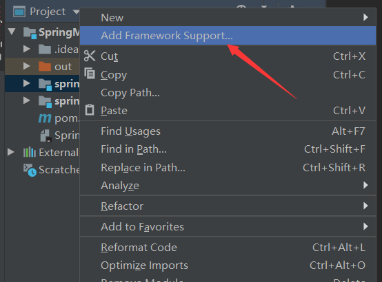
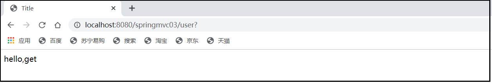
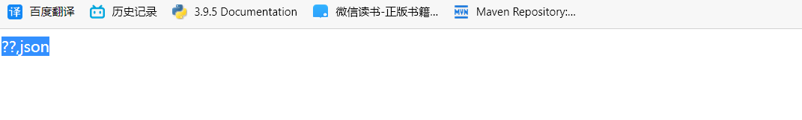

#MVC简介

## 什么是MVC

> MVC：模型(Model)、视图(View)、控制器(Controller)的简写，是一种软件设计规范，MVC是一种架构模式
>
> 是将业务逻辑、数据、显示分离的方法来组织代码。
>
> MVC主要作用是降低了视图与业务逻辑间的双向偶合。
>
> MVC是一种架构模式，不同的MVC存在差异

**Model（模型）：**数据模型，提供要展示的数据，因此包含数据和行为，现在一般都分离开：数据层（数据Dao） 和 服务层（行为Service）。也就是模型提供了模型数据查询和模型数据的状态更新等功能，包括数据和业务。

**View（视图）：**负责进行数据模型的展示，一般就是我们见到的用户界面，客户想看到的东西。

**Controller（控制器）：**接收用户请求，委托给模型进行处理，处理完毕后把返回的模型数据返回给视图，由视图负责展示。也就是说控制器做了个调度员的工作。

**最典型的MVC就是JSP + servlet + javabean的模式。**


## Model1时代

> 在web早期的开发中，通常采用的都是Model1。
>
> Model1虽然实现了MVC，但是实现的并不彻底。MVC模式中，分为View层、Controller层和Model层，而在Model1中，View层和Controller层合二为一了，也就是JSP；JavaBean则作为Model层单独存在。这样的话，主要分为了两层，视图层和模型层，JSP既要做显示，又要处理一定的业务逻辑，对于单一职责的原则来说，这显然不符合。JSP的职责太重，就显得中间部分有些臃肿


> Model1优点：架构简单，比较适合小型项目开发；
>
> Model1缺点：JSP职责不单一，职责过重，不便于维护；
>

## Model2时代

> Model2把一个项目分成三部分，包括**视图、控制、模型。**
>
> Model2可以说完全实现了MVC模式，在Model1的基础上，Model2扩展了Servlet，将控制逻辑放在Servlet中，让它来做Controller的工作，从而减少了JSP的负担。在Model2模式中，JSP只负责显示页面，生成动态网页；Servlet负责流程的控制，处理各种请求；JavaBeans则负责业务逻辑，以及对数据库的操作。
>
> 在Model2模式中，JSP相当于View的角色，Servlet做的Controller的工作，JavaBeans做的Model层的工作。但是相对于Model1，Model2对程序员的要求要高，各层之间分工明确，各司其职。分层的结果是开发的粒度较细，代码的复用性提高了，后期维护也容易了，所以Model2模式比较适合大型项目的开发


1. 用户发请求

2. Servlet接收请求数据，并调用对应的业务逻辑方法

3. 业务处理完毕，返回更新后的数据给servlet

4. servlet转向到JSP，由JSP来渲染页面

5. 响应给前端更新后的页面

   

**职责分析：**

**Controller：控制器**

1. 取得表单数据
2. 调用业务逻辑
3. 转向指定的页面

**Model：模型**

1. 业务逻辑
2. 保存数据的状态

**View：视图**

1. 显示页面


# 回顾Servlet

##新建一个Maven工程当做父工程！pom依赖！

```xml
<dependencies>
   <dependency>
       <groupId>junit</groupId>
       <artifactId>junit</artifactId>
       <version>4.12</version>
   </dependency>
   <dependency>
       <groupId>org.springframework</groupId>
       <artifactId>spring-webmvc</artifactId>
       <version>5.1.9.RELEASE</version>
   </dependency>
   <dependency>
       <groupId>javax.servlet</groupId>
       <artifactId>servlet-api</artifactId>
       <version>2.5</version>
   </dependency>
   <dependency>
       <groupId>javax.servlet.jsp</groupId>
       <artifactId>jsp-api</artifactId>
       <version>2.2</version>
   </dependency>
   <dependency>
       <groupId>javax.servlet</groupId>
       <artifactId>jstl</artifactId>
       <version>1.2</version>
   </dependency>
</dependencies>
```

##建立一个Moudle，添加Web app的支持！




##编写一个Servlet类，用来处理用户的请求

```java
package com.bao.web.servlet;

import javax.servlet.ServletException;
import javax.servlet.http.HttpServlet;
import javax.servlet.http.HttpServletRequest;
import javax.servlet.http.HttpServletResponse;
import java.io.IOException;

public class HelloServlet extends HttpServlet {
    protected void doPost(HttpServletRequest request, HttpServletResponse response) throws ServletException, IOException {
        String method = request.getParameter("method");
        if ("add".equals(method)){
            System.out.println("执行了添加的方法");
            request.getSession().setAttribute("msg","执行了添加的方法");
        }
        if ("delete".equals(method)){
            System.out.println("执行了删除的方法");
            request.getSession().setAttribute("msg","执行了删除的方法");
        }
        //转发
//        request.getRequestDispatcher("/hello.jsp").forward(request,response);
        //重定向
        response.sendRedirect(request.getContextPath()+"/hello.jsp");
    }

    protected void doGet(HttpServletRequest request, HttpServletResponse response) throws ServletException, IOException {
        this.doPost(request,response);
    }
}
```

##编写Hello.jsp

> 在web目录下新建hello.jsp

```html
<%@ page contentType="text/html;charset=UTF-8" language="java" %>
<html>
<head>
    <title>Title</title>
</head>
<body>
    ${msg}
</body>
</html>

```

##在web.xml中注册Servlet

```xml
<?xml version="1.0" encoding="UTF-8"?>
<web-app xmlns="http://xmlns.jcp.org/xml/ns/javaee"
         xmlns:xsi="http://www.w3.org/2001/XMLSchema-instance"
         xsi:schemaLocation="http://xmlns.jcp.org/xml/ns/javaee http://xmlns.jcp.org/xml/ns/javaee/web-app_4_0.xsd"
         version="4.0">

    <servlet>
        <servlet-name>s</servlet-name>
        <servlet-class>com.bao.servlet.HelloServlet</servlet-class>
    </servlet>
    <servlet-mapping>
        <servlet-name>s</servlet-name>
        <url-pattern>/hello</url-pattern>
    </servlet-mapping>
</web-app>
```

##配置Tomcat，并启动测试


##访问


**常见的服务器端MVC框架有：Struts、Spring MVC、ASP.NET MVC**


# 什么是SpringMVC

## 概述

Spring MVC是Spring Framework的一部分，是基于Java实现MVC的轻量级Web框架。

##Spring MVC的特点

1. 轻量级，简单易学
2. 高效 , 基于请求响应的MVC框架
3. 与Spring兼容性好，无缝结合
4. 约定优于配置，能够进行简单的junit测试
5. 功能强大：支持Restful风格、异常处理、数据验证、格式化、本地化、主题等
6. 简洁灵活
7. 用的人多，用的公司多 

## 中心控制器DispatcherServlet 

​	Spring的web框架围绕DispatcherServlet [ 调度Servlet ] 设计。

​	DispatcherServlet的作用是将请求分发到不同的处理器。从Spring 2.5开始，使用Java 5或者以上版本的用户可以采用基于注解形式进行开发，十分简洁；

​	Spring MVC框架像许多其他MVC框架一样, 以请求为驱动 , 围绕一个中心Servlet分派请求及提供其他功能，DispatcherServlet是一个实际的Servlet (它继承自HttpServlet 基类)。


### SpringMVC执行原理


图为SpringMVC的一个较完整的流程图，只有controller部分需要我们操作，其余部分由SpringsMVC框架提供技术支持

###简要执行流程

1. DispatcherServlet表示前端控制器，是整个SpringMVC的控制中心。用户发出请求，DispatcherServlet接收请求并拦截请求。

   我们假设请求的url为 : http://localhost:8080/SpringMVC/first

   **如上url拆分成三部分：**

   http://localhost:8080	服务器域名

   SpringMVC	部署在服务器上的web站点

   first	表示控制器

   通过分析，如上url表示为：请求位于服务器localhost:8080上的SpringMVC站点的first控制器。

2. HandlerMapping为处理器映射器。DispatcherServlet调用HandlerMapping，HandlerMapping根据请求url查找Handler。

   HandlerExecution表示具体的Handler，其主要作用是根据url查找控制器，如上url被查找控制器为：first。

4. HandlerExecution将解析后的信息传递给DispatcherServlet

5. HandlerAdapter表示处理器适配器，会按照特定的规则去执行Handler。

6. Handler让具体的Controller执行。

7. Controller将具体的执行信息返回给HandlerAdapter,如ModelAndView。

8. HandlerAdapter将视图逻辑名或模型传递给DispatcherServlet。

9. DispatcherServlet调用视图解析器(ViewResolver)来解析HandlerAdapter传递的逻辑视图名。

10. 视图解析器将解析的逻辑视图名传给DispatcherServlet。

11. DispatcherServlet根据视图解析器解析的视图结果，调用具体的视图。

12. 最终视图呈现给用户。

## 处理器映射器、处理器适配器、视图解析器

###处理器映射器

​	作用：处理器映射器 HandlerMapping 根据配置找到相应的 Handler，返回给前端控制器 DispatcherServlet，

​	处理器映射器有很多种，它们都实现了 HandlerMapping 接口，我们首先使用 BeanNameUrlHandlerMapping 类，该类的映射规则是：把 bean 的 name 作为 url 进行查找

###处理器适配器

​	作用：前端控制器将得到的Handler的信息再传给处理器适配器进行处理，处理器适配器会找到对应的 Handler处理，处理后就会给前端控制器 DispatcherServlet返回一个 ModleAndView 对象

​	SimpleControllerHandlerAdapter（简单的控制器处理器适配器），它支持所有实现了 Controller 接口的 Handler 控制器

###视图解析器

​	作用：解析 ModelAndView 对象	 

​	ModelAndView这个对象包含了要跳转的视图信息 view 和视图上需要显示的数据 model，此时前端控制器会请求视图解析器 ViewResolver 来解析 ModelAndView 对象，并返回一个View

​	视图解析器也有很多种，这里使用默认的 InternalResourceViewResolver


# 第一个MVC程序

##  配置版

###创建maven项目，添加web支持

###确定导入了SpringMVC的依赖

> 查看Maven视图下的Dependencies中是否存在SpringMVC依赖
>
> 查看artifacts下是否导入了jar包
>

###配置web.xml

> 注册DispatcherServlet

```xml
<?xml version="1.0" encoding="UTF-8"?>
<web-app xmlns="http://xmlns.jcp.org/xml/ns/javaee"
         xmlns:xsi="http://www.w3.org/2001/XMLSchema-instance"
         xsi:schemaLocation="http://xmlns.jcp.org/xml/ns/javaee http://xmlns.jcp.org/xml/ns/javaee/web-app_4_0.xsd"
         version="4.0">

    <!--配置DispatcherServlet，是SpringMVC的核心，又名前端控制器；用于拦截符合配置的 url 请求、分发请求-->
    <servlet>
        <servlet-name>springmvc</servlet-name>
        <servlet-class>org.springframework.web.servlet.DispatcherServlet</servlet-class>
        <!--DispatcherServlet需要绑定Spring的配置文件-->
        <init-param>
            <param-name>contextConfigLocation</param-name>
            <param-value>classpath:springmvc-servlet.xml</param-value>
        </init-param>
        <!--设置启动级别1：随着服务器的启动而启动-->
        <load-on-startup>1</load-on-startup>
    </servlet>

    <!--SpringMVC中“/”和“/*”的区别：
        /：拦截除了jsp以外的所有请求
        /*:拦截包括jsp在内的所有请求，容易造成死循环，会报404-->
    <servlet-mapping>
        <servlet-name>springmvc</servlet-name>
        <url-pattern>/</url-pattern>
    </servlet-mapping>
</web-app>
```

###编写SpringMVC的配置文件

> 名称可以随意写，一般都写为springmvc-servlet.xml

```xml
<?xml version="1.0" encoding="UTF-8"?>
<beans xmlns="http://www.springframework.org/schema/beans"
       xmlns:xsi="http://www.w3.org/2001/XMLSchema-instance"
       xsi:schemaLocation="http://www.springframework.org/schema/beans
       http://www.springframework.org/schema/beans/spring-beans.xsd">
    <!--SpringMVC的核心三要素，这三个可以不用记，但是要知道怎么用-->
    <!--添加处理器映射器-->
    <bean class="org.springframework.web.servlet.handler.BeanNameUrlHandlerMapping"/>
    
    <!--添加处理器适配器-->
    <bean class="org.springframework.web.servlet.mvc.SimpleControllerHandlerAdapter"/>
    
    <!--添加视图解析器：可以拼接前缀和后缀-->
    <bean class="org.springframework.web.servlet.view.InternalResourceViewResolver" id="internalResourceViewResolver">
        <!--前缀-->
        <property name="prefix" value="/"/>
        <!--后缀-->
        <property name="suffix" value=".jsp"/>
    </bean>
    
</beans>
```

###编写Controller层

> 写一个类并实现Controller接口，返回一个ModelAndView，装数据和视图

```java
package com.bao.controler;

import org.springframework.web.servlet.ModelAndView;
import org.springframework.web.servlet.mvc.Controller;
import javax.servlet.http.HttpServletRequest;
import javax.servlet.http.HttpServletResponse;

public class FirstController implements Controller {
    public ModelAndView handleRequest(HttpServletRequest httpServletRequest, HttpServletResponse httpServletResponse) throws Exception {
        ModelAndView modelAndView = new ModelAndView();
        modelAndView.addObject("msg","hello,SpringMVC");
        modelAndView.setViewName("first");
        return modelAndView;
    }
}

```

###注册bean

> 将自己的类交给SpringIOC容器管理，注册bean

```xml
<!--注册bean，交给springIOC容器管理，注意这里的id也是访问路径-->
    <bean id="/first" class="com.bao.controler.FirstController"/>
```

###jsp页面

> 写要跳转的jsp页面，显示ModelandView存放的数据

```xml
<%@ page contentType="text/html;charset=UTF-8" language="java" %>
<html>
<head>
    <title>Title</title>
</head>
<body>
    ${msg}
</body>
</html>
```

### 访问


### 可能遇到的问题

> 访问出现404
>
> > 查看控制台输出，看一下是不是缺少了什么jar包
> >
> > 如果jar包存在，显示无法输出，就在IDEA的项目发布中，添加lib依赖
> >
> > 重启Tomcat


## 注解版

###创建maven项目，添加web支持


###确定导入了SpringMVC的依赖

```xml
<dependencies>
    <dependency>
        <groupId>junit</groupId>
        <artifactId>junit</artifactId>
        <version>4.12</version>
    </dependency>
    <dependency>
        <groupId>org.springframework</groupId>
        <artifactId>spring-webmvc</artifactId>
        <version>5.1.9.RELEASE</version>
    </dependency>
    <dependency>
        <groupId>org.projectlombok</groupId>
        <artifactId>lombok</artifactId>
        <version>1.18.12</version>
        <scope>provided</scope>
    </dependency>
</dependencies>
<build>
    <resources>
        <resource>
            <directory>src/main/java</directory>
            <includes>
                <include>**/*.properties</include>
                <include>**/*.xml</include>
            </includes>
            <filtering>false</filtering>
        </resource>
        <resource>
            <directory>src/main/resources</directory>
            <includes>
                <include>**/*.properties</include>
                <include>**/*.xml</include>
            </includes>
            <filtering>false</filtering>
        </resource>
    </resources>
</build>
```


###配置web.xml

```xml
<?xml version="1.0" encoding="UTF-8"?>
<web-app xmlns="http://xmlns.jcp.org/xml/ns/javaee"
         xmlns:xsi="http://www.w3.org/2001/XMLSchema-instance"
         xsi:schemaLocation="http://xmlns.jcp.org/xml/ns/javaee http://xmlns.jcp.org/xml/ns/javaee/web-app_4_0.xsd"
         version="4.0">

    <!--配置DispatcherServlet，是SpringMVC的核心，又名前端控制器；用于拦截符合配置的 url 请求、分发请求-->
    <servlet>
        <servlet-name>springmvc</servlet-name>
        <servlet-class>org.springframework.web.servlet.DispatcherServlet</servlet-class>
        <!--DispatcherServlet需要绑定Spring的配置文件-->
        <init-param>
            <param-name>contextConfigLocation</param-name>
            <param-value>classpath:springmvc-servlet.xml</param-value>
        </init-param>
        <!--设置启动级别1：随着服务器的启动而启动-->
        <load-on-startup>1</load-on-startup>
    </servlet>
    
    <!--SpringMVC中“/”和“/*”的区别：
        /：拦截除了jsp以外的所有请求
        /*:拦截包括jsp在内的所有请求-->
    <servlet-mapping>
        <servlet-name>springmvc</servlet-name>
        <url-pattern>/</url-pattern>
    </servlet-mapping>
</web-app>
```

###添加SpringMVC配置文件

在resource目录下添加springmvc-servlet.xml配置文件，配置的形式与Spring容器配置基本类似，为了支持基于注解的IOC，设置了自动扫描包的功能，具体配置信息如下：

```xml
<?xml version="1.0" encoding="UTF-8"?>
<beans xmlns="http://www.springframework.org/schema/beans"
       xmlns:xsi="http://www.w3.org/2001/XMLSchema-instance"
       xmlns:context="http://www.springframework.org/schema/context"
       xmlns:mvc="http://www.springframework.org/schema/mvc"
       xsi:schemaLocation="http://www.springframework.org/schema/beans
       http://www.springframework.org/schema/beans/spring-beans.xsd
       http://www.springframework.org/schema/context
       https://www.springframework.org/schema/context/spring-context.xsd
       http://www.springframework.org/schema/mvc
       https://www.springframework.org/schema/mvc/spring-mvc.xsd">

    <!--开启spring的注解支持，确定扫描的包-->
    <context:component-scan base-package="com.bao.controller"/>

    <!--开启mvc的注解支持-->
    <!--
     在spring中一般采用@RequestMapping注解来完成映射关系
     要想使@RequestMapping注解生效,必须向上下文中注册
     DefaultAnnotationHandlerMapping和一个AnnotationMethodHandlerAdapter实例
     这两个实例分别在类级别和方法级别处理。
     而annotation-driven配置帮助我们自动完成上述两个实例的注入。
    -->
    <mvc:annotation-driven/>

    <!-- 让Spring MVC不处理静态资源，比如.css .js .mp4 .jpg .html等
         原理：
         在springMVC-servlet.xml中配置<mvc:default-servlet-handler />后，会在Spring MVC上下文中定义
         一个org.springframework.web.servlet.resource.DefaultServletHttpRequestHandler，
         它会像一个检查员，对进入DispatcherServlet的URL进行筛查，如果发现是静态资源的请求，
         就将该请求转由Web应用服务器默认的Servlet处理，如果不是静态资源的请求，才由DispatcherServlet继续处理。
         一般Web应用服务器默认的Servlet名称是"default"，因此DefaultServletHttpRequestHandler可以找到它。
         如果你的Web应用服务器的默认Servlet名称不是"default"，则需要通过default-servlet-name属性显示指定：
         <mvc:default-servlet-handler default-servlet-name="所使用的Web服务器默认使用的Servlet名称" />
     -->
    <mvc:default-servlet-handler/>

    <!--配置视图解析器-->
    <bean class="org.springframework.web.servlet.view.InternalResourceViewResolver">
        <property name="prefix" value="/"/>
        <property name="suffix" value=".jsp"/>
    </bean>

</beans>
```


###编写Controller层

```java
package com.bao.controller;

import org.springframework.stereotype.Controller;
import org.springframework.ui.Model;
import org.springframework.web.bind.annotation.RequestMapping;
import org.springframework.web.servlet.ModelAndView;

@Controller//这是spring的注解
//@RequestMapping("/secondController")//这是springmvc的注解
public class SecondController{

    @RequestMapping("/second")
    public ModelAndView second(){
        ModelAndView modelAndView = new ModelAndView();
        modelAndView.addObject("msg","second");
        modelAndView.setViewName("hello");
        return modelAndView;
    }

    @RequestMapping("/third")
    public String hello1(Model model){
        //注意，这里传递的参数是Model类型，这里只要封装数据即可，可以理解为是ModelAndView的简化版
        model.addAttribute("msg","third");
        return "hello";
    }
}

```

**说明：**

> @RequestMapping
>
> 是一个用来处理请求地址映射的注解，可用于类或方法上。用于类上，表示类中的所有响应请求的方法都是以该地址作为父路径，这里因为类与方法上都有映射，所以访问路径应该是/secondController/second
>
> - @GetMapping是一个组合注解，是@RequestMapping(method = RequestMethod.GET)的缩写。
> - @PostMapping是一个组合注解，是@RequestMapping(method = RequestMethod.POST)的缩写。

> @Controller是为了让Spring IOC容器初始化时自动扫描到；
>
> 方法中声明Model类型的参数是为了把java中的数据带到视图中；
>
> 方法返回的结果是视图的名称hello，加上配置文件中的前后缀变成/hello.jsp


###创建视图层

1. 在WEB-INF/ jsp目录中创建hello.jsp ， 视图可以直接取出并展示从Controller带回的信息；

2. 可以通过EL表达式取出Model中存放的值，或者对象；

```jsp
<%@ page contentType="text/html;charset=UTF-8" language="java" %>
<html>
<head>
    <title>Title</title>
</head>
<body>
    ${msg}
</body>
</html>

```

###配置Tomcat并运行

1. 配置Tomcat
2. 开启服务器
3. 访问对应的请求路径


### 小结

使用springMVC必须配置的三大要素：处理器映射器、处理器适配器、视图解析器

一般情况下我们只需要配置视图解析器，而处理器映射器和处理器适配器只需要开启注解驱动即可


# 控制器

## 控制器Controller是什么

> 概念：控制器是访问应用程序的入口
>
> 作用：控制器负责解析用户的请求并将其转换为一个模型。
>
> 数量：在Spring MVC中一个控制器类可以包含多个方法
>
> 实现方式：在Spring MVC中，对于Controller的配置方式有很多种，通常通过接口定义或注解定义两种方法实现。


## 实现Controller接口

> Controller是一个接口，在org.springframework.web.servlet.mvc包下，接口中只有一个方法
>
> 实现接口Controller定义控制器是较老的办法
>
> 缺点是一个控制器中只有一个方法，如果要定义多个方法则需要定义多个Controller
>
> 定义的方式比较麻烦


## 使用注解@Controller

> 用于声明该类的实例是一个控制器，会同时被Spring容器接管
>
> 如果返回值是String类型，并且有具体的页面可以跳转，就会被视图解析器解析
>
> 使用时一定要开启springMVC的注解支持
>
> 注解方式是平时使用的最多的方式

```xml
<!--开启SpringMVC的注解支持-->
<mvc:annotation-driven />
```


# RestFul 风格

##概念

Restful就是一个资源定位及资源操作的风格。不是标准也不是协议，只是一种风格。基于这个风格设计的软件可以更简洁，更有层次，更易于实现缓存等机制

## 传递参数@PathVariable

1. 创建一个新的Module
2. 查看Dependencies和Artifacts的依赖
3. 配置web.xml的dispatcherServlet
4. 配置springmvc-servlet.xml
5. 在新建一个类 RestFulController

```java
package com.bao.controller;

import org.springframework.stereotype.Controller;
import org.springframework.ui.Model;
import org.springframework.web.bind.annotation.PathVariable;
import org.springframework.web.bind.annotation.RequestMapping;

@Controller
public class RestFulController {

    //url路径：http://localhost:8080/springmvc03/restFul1?a=1&b=2
    @RequestMapping("/restFul1")
    public String restFul1(int a, int b, Model model){
        int num = a + b;
        model.addAttribute("msg",num);
        return "hello";
    }
    
    //url路径：http://localhost:8080/springmvc03/restFul2/3/4
    @RequestMapping("/restFul2/{a}/{b}")
    public String restFul2(@PathVariable int a, @PathVariable int b, Model model){
        /*@PathVariable:是Spring3.0以上支持的注解，作用是让方法参数的值绑定到一个URL模板变量上
         * 注意：
         *  花括号中的名称需要与参数名一一对应
         *  url中传递的参数的类型需要与方法中的参数的类型一致，不一致会报错*/
        int num = a + b;
        model.addAttribute("msg",num);
        return "hello";
    }
    //自行尝试传递数据类型不同的数据

}

```

1. 在web目录下创建hello.jsp

```jsp
<%@ page contentType="text/html;charset=UTF-8" language="java" %>
<html>
<head>
    <title>Title</title>
</head>
<body>
    ${msg}
</body>
</html>
```

1. 访问


> 使用路径变量有什么好处？
>
> > 路径更加简洁
> >
> > 支持缓存，效率更高
> >
> > 看不到参数名称，更加安全
> >


##@GetMapping&@PostMapping

> method的请求类型有：GET, POST, HEAD, OPTIONS, PUT, PATCH, DELETE, TRACE
>

###在Controller中增加两个方法

> 请求路径相同，但是请求类型不同

```java
@GetMapping("/user")//是@RequestMapping+get请求的组合，是@RequestMapping(method=RequestMethod.GET)的快捷方式
public String user1(Model model){
    model.addAttribute("msg","hello,get");
    return "hello";
}

@PostMapping("/user")
public String user2(Model model){
    model.addAttribute("msg","hello,post");
    return "hello";
}
```

###修改index.jsp页面

> 设置请求类型

```jsp
<%@ page contentType="text/html;charset=UTF-8" language="java" %>
<html>
  <head>
    <title>$Title$</title>
  </head>
  <body>

    <form action="${pageContext.request.contextPath}/user" method="post">
      <input type="submit" value="提交">
    </form>

  </body>
</html>
```

###访问

> 所有的地址栏请求默认都是GET类型
>
> 当请求类型不匹配时会报405




# 转发和重定向

## ServletAPI

> 通过传入HttpServletRequest和HttpServletResponse，可以实现数据的输出、重定向、转发等操作，同时不需要配置视图解析器
>

```java
package com.bao.controller;

import org.springframework.stereotype.Controller;
import org.springframework.web.bind.annotation.RequestMapping;
import javax.servlet.http.HttpServletRequest;
import javax.servlet.http.HttpServletResponse;
import java.io.IOException;

@Controller
public class ServletAPI {

    //1、通过HttpServletResponse进行输出
    @RequestMapping("/result/t1")
    public void t1(HttpServletRequest req, HttpServletResponse rsp) throws IOException {
        rsp.getWriter().println("Hello,ServletAPI");
    }

    //2、通过HttpServletResponse实现重定向
    @RequestMapping("/result/t2")
    public void t2(HttpServletRequest req, HttpServletResponse rsp) throws IOException {
        //重定向
        rsp.sendRedirect(req.getContextPath()+"/index.jsp");
    }

    //3、通过HttpServletRequest实现转发
    @RequestMapping("/result/t3")
    public void t3(HttpServletRequest req, HttpServletResponse rsp) throws Exception {
        //转发
        req.setAttribute("msg","转发");
        req.getRequestDispatcher("/hello.jsp").forward(req,rsp);
    }

}
```

## SpringMVC

### 无视图解析器

1. 将视图解析器注释掉

2. 编写NoViewController

```java
package com.bao.controller;

import org.springframework.stereotype.Controller;
import org.springframework.ui.Model;
import org.springframework.web.bind.annotation.RequestMapping;

@Controller
public class NoViewController {
    //通过全路径实现跳转
    @RequestMapping("/t1")
    public String t1(Model model){
        model.addAttribute("msg","没有视图解析器：全路径实现跳转");
        return "/hello.jsp";
    }

    //转发
    @RequestMapping("/t2")
    public String t2(Model model){
        model.addAttribute("msg","没有视图解析器：转发");
        return "forward:/hello.jsp";
    }

    //重定向
    @RequestMapping("/t3")
    public String t3(){
        return "redirect:/hello.jsp";
    }

}

```

###有视图解析器

1. 打开视图解析器的注解
2. 编写ViewController

```java
package com.bao.controller;

import org.springframework.stereotype.Controller;
import org.springframework.ui.Model;
import org.springframework.web.bind.annotation.RequestMapping;

@Controller
public class ViewResolverController {
    //有视图解析器，默认的跳转方式就是转发
    @RequestMapping("/t4")
    public String t4(Model model){
        model.addAttribute("msg","有视图解析器，默认的跳转方式就是转发");
        return "hello";
    }
    //重定向不需要视图解析器，本质上就是重新请求一个新路径，所以写法与没有视图解析器时相同
    @RequestMapping("/t5")
    public String t5(){
        return "redirect:/index.jsp";
    }
}
```


# 数据处理

## 从前端获取数据

###URL中的参数名和方法的参数名一致

URL路径：http://localhost:8080/springmvc03/t6?name=lisi

处理方法

```java
@GetMapping("/t6")
public String t6(String name, Model model){
    model.addAttribute("msg",name);
    System.out.println(name);
    return "test";
}
```

###URL中的参数名和方法的参数名不一致

URL路径：http://localhost:8080/springmvc03/t7?username=lisi

处理方法

```java
@GetMapping("/t7")
public String t7(@RequestParam("username") String name, Model model){
    model.addAttribute("msg",name);
    System.out.println(name);
    return "test";
}
```

###提交的是一个对象

> 要求提交的表单域和对象的属性名一致  , 参数使用对象即可
>

实体类

```java
public class User {
    private String name;
    private Integer id;
    private Integer age;
   //需要有get、set方法
```

URL路径：http://localhost:8080/springmvc03/t8?id=1&name=lisi&age=18

处理方法

```java
@GetMapping("/t8")
public String t8(User user){
    System.out.println(user);
    return "test";
}
```

后台输出 : User{name='lisi', id=1, age=18}

> 说明：如果传递的对象的参数名和实体类的属性名不一致，则该属性就是null
>

## 数据显示到前端

###通过ModelAndView

```java
public class ControllerTest implements Controller {

   public ModelAndView handleRequest(HttpServletRequest httpServletRequest,HttpServletResponse httpServletResponse) throws Exception {
       //返回一个模型视图对象
       ModelAndView modelAndView = new ModelAndView();
       modelAndView.addObject("msg","modelAndView");
       modelAndView.setViewName("test");
       return modelAndView;
  }
}
```


###通过Model

```java
@GetMapping("/t9")
public String t9(@RequestParam("name") String name, Model model){
    model.addAttribute("msg",name);
    System.out.println(name);
    return "test";
}
```


###通过ModelMap

```java
@GetMapping("/t10")
public String t10(@RequestParam("name") String name, ModelMap model){
    //封装要显示到视图中的数据
    model.addAttribute("msg",name);
    System.out.println(name);
    return "test";
}
```


### 区别

```java
Model 只有寥寥几个方法，只适合用于储存数据，简化了对于Model对象的操作和理解
ModelMap 继承了LinkedMap ，除了实现了自身的一些方法，同样的继承LinkedMap的方法和特性
ModelAndView 可以在储存数据的同时，可以进行设置返回的逻辑视图，进行控制展示层的跳转
```


## 乱码问题

### 修改index.jsp

```html
<%@ page contentType="text/html;charset=UTF-8" language="java" %>
<html>
    <head>
        <title>$Title$</title>
    </head>
    <body>
    
        <form action="${pageContext.request.contextPath}/login" method="post">
            <%--get请求不会出现乱码，但是post会，需要手动解决--%>
            <input type="text" name="name">
            <input type="submit" value="提交">
        </form>
    
    </body>
</html>
```

###编写LoginController

```java
package com.bao.controller;

import org.springframework.stereotype.Controller;
import org.springframework.ui.Model;
import org.springframework.web.bind.annotation.RequestMapping;
import org.springframework.web.bind.annotation.RequestParam;

@Controller
public class LoginController {

    @RequestMapping("/login")
    public String login(@RequestParam("name") String name, Model model){
        System.out.println(name);
        model.addAttribute("msg",name);
        return "test";
    }
}
```

###测试


### 解决

> 在web.xml中添加spring的过滤器

```xml
<!--配置过滤器，防止乱码-->
<filter>
    <filter-name>encoding</filter-name>
    <filter-class>org.springframework.web.filter.CharacterEncodingFilter</filter-class>
    <init-param>
        <param-name>encoding</param-name>
        <param-value>utf-8</param-value>
    </init-param>
</filter>
<filter-mapping>
    <filter-name>encoding</filter-name>
    <url-pattern>/*</url-pattern>
</filter-mapping>
```


# JSON格式返回

> 作用：用于数据的传输

##创建maven项目，添加web支持

##确定导入了SpringMVC的依赖

##防止资源过滤

```xml
<build>
    <resources>
        <resource>
            <directory>src/main/java</directory>
            <includes>
                <include>**/*.properties</include>
                <include>**/*.xml</include>
            </includes>
            <filtering>false</filtering>
        </resource>
        <resource>
            <directory>src/main/resources</directory>
            <includes>
                <include>**/*.properties</include>
                <include>**/*.xml</include>
            </includes>
            <filtering>false</filtering>
        </resource>
    </resources>
</build>
```

##配置web.xml

```xml
<?xml version="1.0" encoding="UTF-8"?>
<web-app xmlns="http://xmlns.jcp.org/xml/ns/javaee"
         xmlns:xsi="http://www.w3.org/2001/XMLSchema-instance"
         xsi:schemaLocation="http://xmlns.jcp.org/xml/ns/javaee http://xmlns.jcp.org/xml/ns/javaee/web-app_4_0.xsd"
         version="4.0">

    <!--配置DispatcherServlet，是SpringMVC的核心，又名前端控制器；用于拦截符合配置的 url 请求、分发请求-->
    <servlet>
        <servlet-name>springmvc</servlet-name>
        <servlet-class>org.springframework.web.servlet.DispatcherServlet</servlet-class>
        <!--DispatcherServlet需要绑定Spring的配置文件-->
        <init-param>
            <param-name>contextConfigLocation</param-name>
            <param-value>classpath:springmvc-servlet.xml</param-value>
        </init-param>
        <!--设置启动级别1：随着服务器的启动而启动-->
        <load-on-startup>1</load-on-startup>
    </servlet>
    
    <!--SpringMVC中“/”和“/*”的区别：
        /：拦截除了jsp以外的所有请求
        /*:拦截包括jsp在内的所有请求-->
    <servlet-mapping>
        <servlet-name>springmvc</servlet-name>
        <url-pattern>/</url-pattern>
    </servlet-mapping>
    
    <!--配置过滤器，防止乱码-->
    <filter>
        <filter-name>encoding</filter-name>
        <filter-class>org.springframework.web.filter.CharacterEncodingFilter</filter-class>
        <init-param>
            <param-name>encoding</param-name>
            <param-value>utf-8</param-value>
        </init-param>
    </filter>
    <filter-mapping>
        <filter-name>encoding</filter-name>
        <url-pattern>/*</url-pattern>
    </filter-mapping>
</web-app>
```

##添加SpringMVC配置文件

```xml
<?xml version="1.0" encoding="UTF-8"?>
<beans xmlns="http://www.springframework.org/schema/beans"
       xmlns:xsi="http://www.w3.org/2001/XMLSchema-instance"
       xmlns:context="http://www.springframework.org/schema/context"
       xmlns:mvc="http://www.springframework.org/schema/mvc"
       xsi:schemaLocation="http://www.springframework.org/schema/beans
       http://www.springframework.org/schema/beans/spring-beans.xsd
       http://www.springframework.org/schema/context
       https://www.springframework.org/schema/context/spring-context.xsd
       http://www.springframework.org/schema/mvc
       https://www.springframework.org/schema/mvc/spring-mvc.xsd">

    <!--开启注解支持，确定扫描的包-->
    <context:component-scan base-package="com.bao.controller"/>

    <!--开启mvc的注解支持-->
    <mvc:annotation-driven/>

    <!--让Spring MVC不处理静态资源，比如.css .js .mp4 .jpg .html等-->
    <mvc:default-servlet-handler/>

    <!--配置视图解析器-->
    <bean class="org.springframework.web.servlet.view.InternalResourceViewResolver">
        <property name="prefix" value="/"/>
        <property name="suffix" value=".jsp"/>
    </bean>

</beans>
```


##编写Controller层

```java
package com.bao.controller;

import com.bao.pojo.User;
import org.springframework.stereotype.Controller;
import org.springframework.web.bind.annotation.GetMapping;
import org.springframework.web.bind.annotation.RequestMapping;
import org.springframework.web.bind.annotation.ResponseBody;

@Controller
public class JsonController {

    @GetMapping("/json1")
    @ResponseBody//配置该注解后，不会通过视图解析器，直接返回给前端页面一个字符串
    public String json1(){
        return "你好,json";
    }
}

```

> @ResponseBody：配置该注解后，不会通过视图解析器，直接返回给前端页面一个字符串

##乱码



## 解决乱码

### 导入jackson依赖

```xml
<dependency>
    <groupId>com.fasterxml.jackson.core</groupId>
    <artifactId>jackson-databind</artifactId>
    <version>2.12.1</version>
</dependency>
```

### 修改<mvc:annotation-driven>配置

```xml
<!--开启mvc的注解支持，同时解决json乱码问题，这是固定的，记住怎么使用就可以-->
<mvc:annotation-driven>
    <mvc:message-converters register-defaults="true">
        <bean class="org.springframework.http.converter.StringHttpMessageConverter">
            <constructor-arg value="UTF-8"/>
        </bean>
        <bean class="org.springframework.http.converter.json.MappingJackson2HttpMessageConverter">
            <property name="objectMapper">
                <bean class="org.springframework.http.converter.json.Jackson2ObjectMapperFactoryBean">
                    <property name="failOnEmptyBeans" value="false"/>
                </bean>
            </property>
        </bean>
    </mvc:message-converters>
</mvc:annotation-driven>
```

## 返回Json对象

### 创建实体类

```java
public class User {
    private String name;
    private Integer id;
    private Integer age;
	//get、set、toString方法
}
```

### 编写controller方法

```java
@GetMapping("/json2")
@ResponseBody
public String json2() throws JsonProcessingException {
    //创建一个jackson的对象映射器，用来解析数据
    ObjectMapper objectMapper = new ObjectMapper();

    User user = new User();
    user.setAge(18);
    user.setId(1);
    user.setName("李四");
    //将对象解析成为json格式
    String sUser = objectMapper.writeValueAsString(user);
    return sUser;
}
```

## 优化

> @RestController：相当于@Controller+@ResponseBody两个注解的结合，返回json数据不需要在方法前面加@ResponseBody注解了，但使用@RestController这个注解，就不能返回jsp,html页面，视图解析器无法解析jsp,html页面

```java
package com.bao.controller;

import com.bao.pojo.User;
import com.fasterxml.jackson.core.JsonProcessingException;
import com.fasterxml.jackson.databind.ObjectMapper;
import org.springframework.stereotype.Controller;
import org.springframework.web.bind.annotation.GetMapping;
import org.springframework.web.bind.annotation.RequestMapping;
import org.springframework.web.bind.annotation.ResponseBody;
import org.springframework.web.bind.annotation.RestController;

@RestController
//@Controller
public class JsonController {

    @GetMapping("/json1")
//    @ResponseBody//配置该注解后，不会通过视图解析器，直接返回给前端页面一个字符串
    public String json1(){
        return "你好,json";
    }

    @GetMapping("/json2")
//    @ResponseBody
    public String json2() throws JsonProcessingException {
        //创建一个jackson的对象映射器，用来解析数据
        ObjectMapper objectMapper = new ObjectMapper();

        User user = new User();
        user.setAge(18);
        user.setId(1);
        user.setName("李四");
        //将对象解析成为json格式
        String sUser = objectMapper.writeValueAsString(user);
        return sUser;
    }
}
```

##返回集合

```java
@GetMapping("/json3")
public String json3() throws JsonProcessingException {
    //创建一个jackson的对象映射器，用来解析数据
    ObjectMapper objectMapper = new ObjectMapper();

    ArrayList<User> list = new ArrayList<User>();
    list.add(new User("王五",2,19));
    list.add(new User("赵六",3,20));
    //将对象解析成为json格式
    String slist = objectMapper.writeValueAsString(list);
    return slist;
}
```


## 返回时间对象

```java
@GetMapping("/json4")
public String json4() throws JsonProcessingException {
    //创建一个jackson的对象映射器，用来解析数据
    ObjectMapper objectMapper = new ObjectMapper();
    Date date = new Date();
    //将对象解析成为json格式
    String sdate = objectMapper.writeValueAsString(date);
    System.out.println(sdate);//默认日期格式会输出从1970年1月1日到当前日期的毫秒数
    return sdate;
}
```

### 修改

```java
@GetMapping("/json5")
public String json5() throws JsonProcessingException {
    Date date = new Date();
    SimpleDateFormat simpleDateFormat = new SimpleDateFormat("yyyy-MM-dd HH:mm:ss");
    String sDate = simpleDateFormat.format(date);
    System.out.println(sDate);
    return sDate;
}
```

