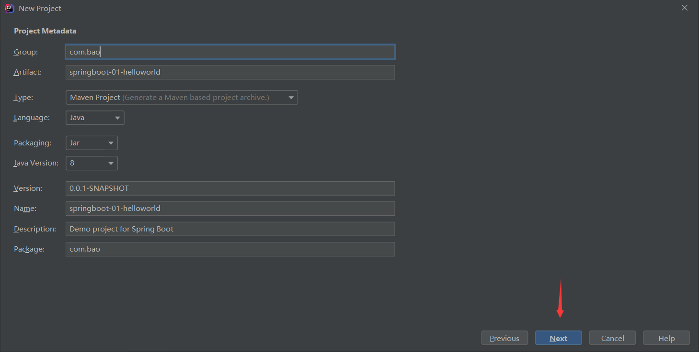
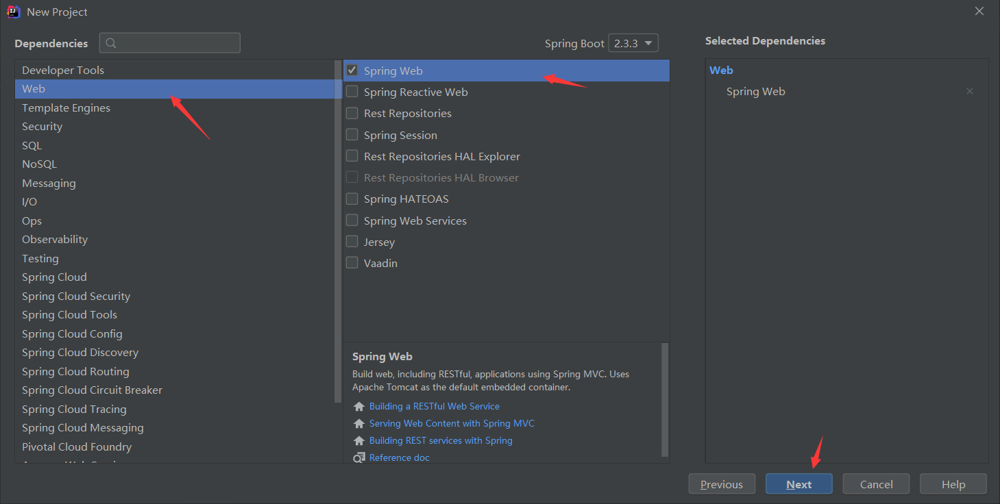
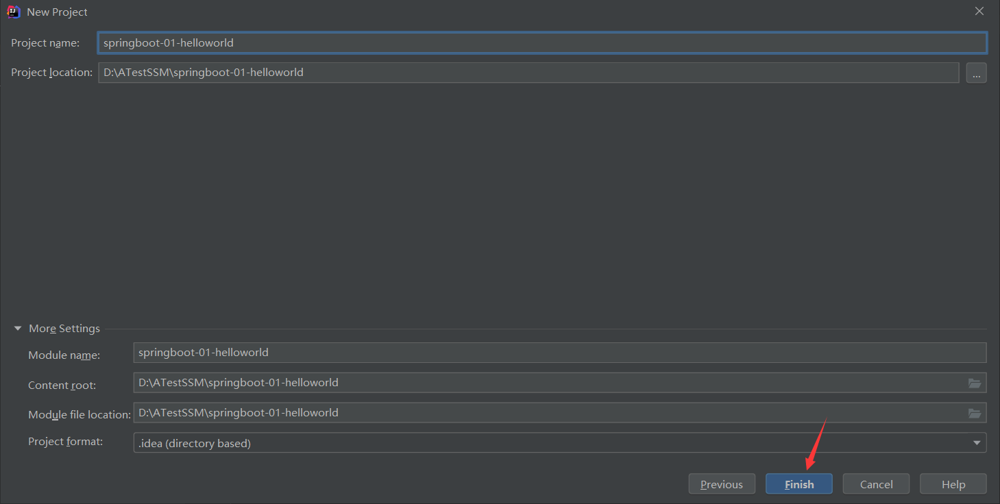
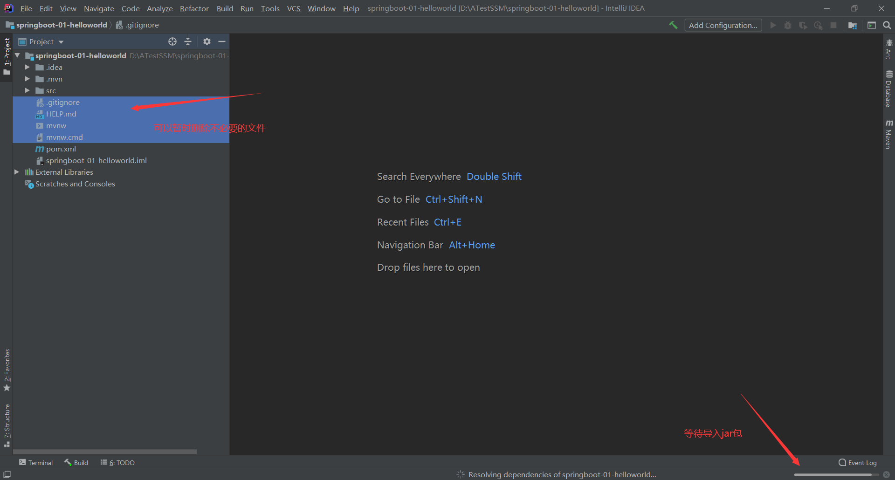
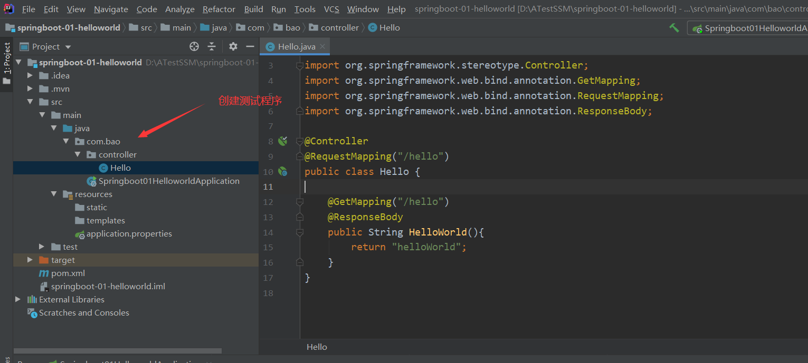
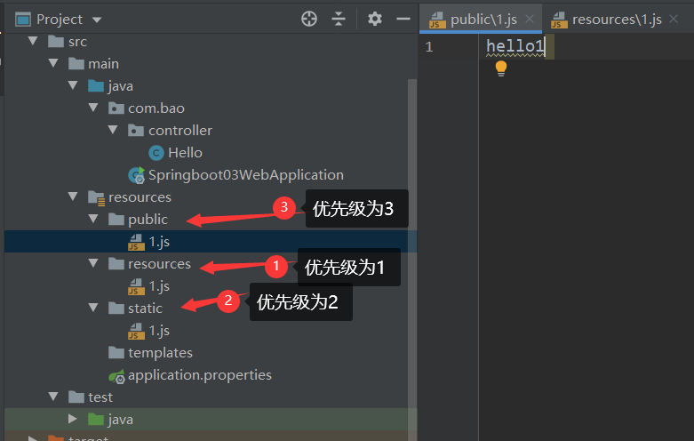
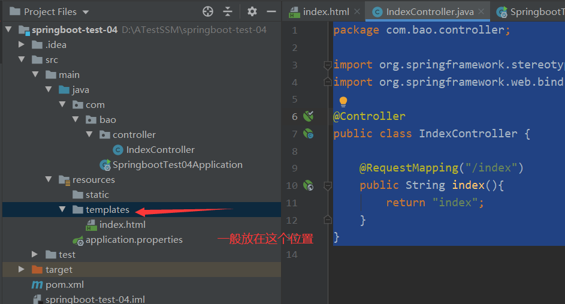
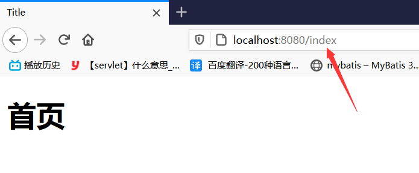

typora-root-url: images

# SpringBoot

## 1、回顾什么是Spring

Spring是一个开源框架，2003 年兴起的一个轻量级的Java 开发框架，作者：Rod Johnson  。

**Spring是为了解决企业级应用开发的复杂性而创建的，简化开发。**

>  Spring是如何简化Java开发的

为了降低Java开发的复杂性，Spring采用了以下4种关键策略：

1、基于POJO的轻量级和最小侵入性编程，所有东西都是bean；

2、通过IOC，依赖注入（DI）和面向接口实现松耦合；

3、基于切面（AOP）和惯例进行声明式编程；

4、通过切面和模版减少样式代码，RedisTemplate，xxxTemplate；

>  **什么是SpringBoot**

学过javaweb的同学就知道，开发一个web应用，从最初开始接触Servlet结合Tomcat, 跑出一个Hello Wolrld程序，是要经历特别多的步骤；后来就用了框架Struts，再后来是SpringMVC，到了现在的SpringBoot，过一两年又会有其他web框架出现

SpringBoot就是一个javaweb的开发框架，和SpringMVC类似，对比其他javaweb框架的好处是简化了开发，约定大于配置，能迅速的开发web应用，几行代码开发一个http接口。

所有的技术框架的发展似乎都遵循了一条主线规律：从一个复杂应用场景 衍生 一种规范框架，人们只需要进行各种配置而不需要自己去实现它，这时候强大的配置功能成了优点；发展到一定程度之后，人们根据实际生产应用情况，选取其中实用功能和设计精华，重构出一些轻量级的框架；之后为了提高开发效率，嫌弃原先的各类配置过于麻烦，于是开始提倡“约定大于配置”，进而衍生出一些一站式的解决方案。

随着 Spring 不断的发展，涉及的领域越来越多，项目整合开发需要配合各种各样的文件，慢慢变得不那么易用简单，违背了最初的理念，甚至人称配置地狱。Spring Boot 正是在这样的一个背景下被抽象出来的开发框架，目的为了让大家更容易的使用 Spring 、更容易的集成各种常用的中间件、开源软件；

**Spring Boot 基于 Spring 开发，Spirng Boot 本身并不提供 Spring 框架的核心特性以及扩展功能，只是用于快速、敏捷地开发新一代基于 Spring 框架的应用程序。也就是说，它并不是用来替代 Spring 的解决方案，而是和 Spring 框架紧密结合用于提升 Spring 开发者体验的工具。**Spring Boot 以**约定大于配置的核心思想**，默认帮我们进行了很多设置，多数 Spring Boot 应用只需要很少的 Spring 配置。同时它集成了大量常用的第三方库配置（例如 Redis、MongoDB、Jpa、RabbitMQ、Quartz 等等），Spring Boot 应用中这些第三方库几乎可以实现零配置的开箱即用。

简单来说就是SpringBoot其实不是什么新的框架，它默认配置了很多框架的使用方式，就像maven整合了所有的jar包，spring boot整合了所有的框架 。

Spring Boot 出生名门，从一开始就站在一个比较高的起点，又经过这几年的发展，生态足够完善，Spring Boot 已经当之无愧成为 Java 领域最热门的技术。

**Spring Boot的主要优点：**

- 为所有Spring开发者更快的入门
- 提供各种默认配置来简化项目配置
- 内嵌式容器简化Web项目
- 没有冗余代码生成和XML配置的要求

> 第一个SpringBoot程序

1. 准备工作

   1. 环境准备：

   - jdk 1.8
   - Maven-3.5
   - SpringBoot 2.x

   2. 开发工具：

   - IDEA

2. 创建SpringBoot工程

   1. 选择spring initalizr ， 可以看到默认就是去官网的快速构建工具那里实现
      1. 
   2. 填写项目信息
      1. 
   3. 选择初始化的组件
      1. 
   4. 填写项目路径
      1. 
   5. 等待项目构建成功
      1. 

3. 创建测试程序

   1. 

   2. ```java
      package com.bao.controller;
      
      import org.springframework.stereotype.Controller;
      import org.springframework.web.bind.annotation.GetMapping;
      import org.springframework.web.bind.annotation.RequestMapping;
      import org.springframework.web.bind.annotation.ResponseBody;
      
      @Controller
      @RequestMapping("/hello")
      public class Hello {
      
          @GetMapping("/hello")
          @ResponseBody//将数据格式转换输出到页面
          public String HelloWorld(){
              return "helloWorld";
          }
      }
      ```

      1. **注意：我们创建的包一定在主程序的同级目录下，否则识别不到**

4. 访问结果

   1. 

5. 设置端口号

   1. application.properties

      1. ```properties
         #修改端口号
         server.port=8081
         ```


**项目结构分析：**

>  pom.xml 

```xml
<?xml version="1.0" encoding="UTF-8"?>
<project xmlns="http://maven.apache.org/POM/4.0.0" xmlns:xsi="http://www.w3.org/2001/XMLSchema-instance"
         xsi:schemaLocation="http://maven.apache.org/POM/4.0.0 https://maven.apache.org/xsd/maven-4.0.0.xsd">
    <modelVersion>4.0.0</modelVersion>
    <!-- 父依赖 -->
    <parent>
        <groupId>org.springframework.boot</groupId>
        <artifactId>spring-boot-starter-parent</artifactId>
        <version>2.3.3.RELEASE</version>
        <relativePath/> <!-- lookup parent from repository -->
    </parent>
    <groupId>com.bao</groupId>
    <artifactId>springboot-01-helloworld</artifactId>
    <version>0.0.1-SNAPSHOT</version>
    <name>springboot-01-helloworld</name>
    <description>Demo project for Spring Boot</description>

    <properties>
        <java.version>1.8</java.version>
    </properties>

    <dependencies>
        <!-- web场景启动器:
                指的是SpringBoot的启动场景
                例如：spring-boot-starter-web，他就会自动帮我们导入web环境所有的依赖
                springboot会将所有依赖的场景都变成一个启动器
                我们要使用什么功能，只需要找到对应的启动器就可以了
         -->
        <dependency>
            <groupId>org.springframework.boot</groupId>
            <artifactId>spring-boot-starter-web</artifactId>
        </dependency>

        <!-- springboot单元测试 -->
        <dependency>
            <groupId>org.springframework.boot</groupId>
            <artifactId>spring-boot-starter-test</artifactId>
            <scope>test</scope>
            <exclusions>
                <exclusion>
                    <groupId>org.junit.vintage</groupId>
                    <artifactId>junit-vintage-engine</artifactId>
                </exclusion>
            </exclusions>
        </dependency>
    </dependencies>

    <build>
        <plugins>
            <!-- 打jar包插件 -->
            <plugin>
                <groupId>org.springframework.boot</groupId>
                <artifactId>spring-boot-maven-plugin</artifactId>
            </plugin>
        </plugins>
    </build>

</project>

```


## 2、 自动装配的原理

helloWorld是怎么运行的？

> **pom.xml**

### 父依赖

其中它主要是依赖一个父项目，主要是管理项目的资源过滤及插件！

```xml
<parent>
    <groupId>org.springframework.boot</groupId>
    <artifactId>spring-boot-starter-parent</artifactId>
    <version>2.2.5.RELEASE</version>
    <relativePath/> <!-- lookup parent from repository -->
</parent>
```

点进去，发现还有一个父依赖

```xml
<parent>
    <groupId>org.springframework.boot</groupId>
    <artifactId>spring-boot-dependencies</artifactId>
    <version>2.2.5.RELEASE</version>
    <relativePath>../../spring-boot-dependencies</relativePath>
</parent>
```

这里才是真正管理SpringBoot应用里面所有依赖版本的地方，SpringBoot的版本控制中心；

**以后我们导入依赖默认是不需要写版本；但是如果导入的包没有在依赖中管理着就需要手动配置版本了；**

### 启动器 spring-boot-starter

```xml
<dependency>
    <groupId>org.springframework.boot</groupId>
    <artifactId>spring-boot-starter-web</artifactId>
</dependency>
```

**springboot-boot-starter-xxx**：就是spring-boot的场景启动器

**spring-boot-starter-web**：帮我们导入了web模块正常运行所依赖的组件；

SpringBoot将所有的功能场景都抽取出来，做成一个个的starter （启动器），只需要在项目中引入这些starter即可，所有相关的依赖都会导入进来 ， 我们要用什么功能就导入什么样的场景启动器即可 ；我们未来也可以自己自定义 starter；

> **主启动类**

### 默认的主启动类

```java
//@SpringBootApplication 来标注一个主程序类，说明这是一个Spring Boot应用
@SpringBootApplication
public class SpringbootApplication {

   public static void main(String[] args) {
     //启动了一个服务
      SpringApplication.run(SpringbootApplication.class, args);
   }

}
```

但是**一个简单的启动类并不简单！**我们来分析一下这些注解都干了什么

### @SpringBootApplication

作用：标注在某个类上说明这个类是SpringBoot的主配置类 ， SpringBoot就应该运行这个类的main方法来启动SpringBoot应用；

进入这个注解：可以看到上面还有很多其他注解！

```java
@SpringBootConfiguration
@EnableAutoConfiguration
@ComponentScan(
    excludeFilters = {@Filter(
    type = FilterType.CUSTOM,
    classes = {TypeExcludeFilter.class}
), @Filter(
    type = FilterType.CUSTOM,
    classes = {AutoConfigurationExcludeFilter.class}
)}
)
public @interface SpringBootApplication {
    // ......
}
```

###@ComponentScan

这个注解在Spring中很重要 ,它对应XML配置中的元素。

作用：自动扫描并加载符合条件的组件或者bean ， 将这个bean定义加载到IOC容器中

### @SpringBootConfiguration

作用：SpringBoot的配置类 ，标注在某个类上 ， 表示这是一个SpringBoot的配置类；

我们继续进去这个注解查看

```java
@Configuration
public @interface SpringBootConfiguration {}

@Component
public @interface Configuration {}
```

这里的 @Configuration，说明这是一个配置类 ，配置类就是对应Spring的xml 配置文件；

里面的 @Component 这就说明，启动类本身也是Spring中的一个组件而已，负责启动应用！

我们回到 SpringBootApplication 注解

### @EnableAutoConfiguration

**@EnableAutoConfiguration ：开启自动配置功能**

以前我们需要自己配置的东西，而现在SpringBoot可以自动帮我们配置 ；@EnableAutoConfiguration告诉SpringBoot开启自动配置功能，这样自动配置才能生效；

点进注解接续查看：

**@AutoConfigurationPackage ：自动配置包**

```java
@Import({Registrar.class})public @interface AutoConfigurationPackage {}
```

**@import** ：Spring底层注解@import ， 给容器中导入一个组件

Registrar.class 作用：将主启动类的所在包及包下面所有子包里面的所有组件扫描到Spring容器 ；

这个分析完了，退到上一步，继续看

**@Import({AutoConfigurationImportSelector.class}) ：给容器导入组件 ；**

AutoConfigurationImportSelector ：自动配置导入选择器，那么它会导入哪些组件的选择器呢？我们点击去这个类看源码：

1、这个类中有一个这样的方法

```java
// 获得候选的配置
protected List<String> getCandidateConfigurations(AnnotationMetadata metadata, AnnotationAttributes attributes) {
    //这里的getSpringFactoriesLoaderFactoryClass（）方法
    //返回的就是我们最开始看的启动自动导入配置文件的注解类；EnableAutoConfiguration
    List<String> configurations = SpringFactoriesLoader.loadFactoryNames(this.getSpringFactoriesLoaderFactoryClass(), this.getBeanClassLoader());
    Assert.notEmpty(configurations, "No auto configuration classes found in META-INF/spring.factories. If you are using a custom packaging, make sure that file is correct.");
    return configurations;
}
```

2、这个方法又调用了  SpringFactoriesLoader 类的静态方法！我们进入SpringFactoriesLoader类loadFactoryNames() 方法

```java
public static List<String> loadFactoryNames(Class<?> factoryClass, @Nullable ClassLoader classLoader) {
    String factoryClassName = factoryClass.getName();
    //这里它又调用了 loadSpringFactories 方法
    return (List)loadSpringFactories(classLoader).getOrDefault(factoryClassName, Collections.emptyList());
}
```

3、我们继续点击查看 loadSpringFactories 方法

```java
private static Map<String, List<String>> loadSpringFactories(@Nullable ClassLoader classLoader) {
    //获得classLoader ， 我们返回可以看到这里得到的就是EnableAutoConfiguration标注的类本身
    MultiValueMap<String, String> result = (MultiValueMap)cache.get(classLoader);
    if (result != null) {
        return result;
    } else {
        try {
            //去获取一个资源 "META-INF/spring.factories"
            Enumeration<URL> urls = classLoader != null ? classLoader.getResources("META-INF/spring.factories") : ClassLoader.getSystemResources("META-INF/spring.factories");
            LinkedMultiValueMap result = new LinkedMultiValueMap();

            //将读取到的资源遍历，封装成为一个Properties
            while(urls.hasMoreElements()) {
                URL url = (URL)urls.nextElement();
                UrlResource resource = new UrlResource(url);
                Properties properties = PropertiesLoaderUtils.loadProperties(resource);
                Iterator var6 = properties.entrySet().iterator();

                while(var6.hasNext()) {
                    Entry<?, ?> entry = (Entry)var6.next();
                    String factoryClassName = ((String)entry.getKey()).trim();
                    String[] var9 = StringUtils.commaDelimitedListToStringArray((String)entry.getValue());
                    int var10 = var9.length;

                    for(int var11 = 0; var11 < var10; ++var11) {
                        String factoryName = var9[var11];
                        result.add(factoryClassName, factoryName.trim());
                    }
                }
            }

            cache.put(classLoader, result);
            return result;
        } catch (IOException var13) {
            throw new IllegalArgumentException("Unable to load factories from location [META-INF/spring.factories]", var13);
        }
    }
}
```

4、发现一个多次出现的文件：spring.factories，全局搜索它

### spring.factories

我们根据源头打开spring.factories ， 看到了很多自动配置的文件；这就是自动配置根源所在！


**WebMvcAutoConfiguration**

我们在上面的自动配置类随便找一个打开看看，比如 ：WebMvcAutoConfiguration

可以看到这些一个个的都是JavaConfig配置类，而且都注入了一些Bean，可以找一些自己认识的类，看着熟悉一下！

所以，自动配置真正实现是从classpath中搜寻所有的META-INF/spring.factories配置文件 ，并将其中对应的 org.springframework.boot.autoconfigure. 包下的配置项，通过反射实例化为对应标注了 @Configuration的JavaConfig形式的IOC容器配置类 ， 然后将这些都汇总成为一个实例并加载到IOC容器中。

**结论：**

1. SpringBoot在启动的时候从类路径下的META-INF/spring.factories中获取EnableAutoConfiguration指定的值
2. 将这些值作为自动配置类导入容器 ， 自动配置类就生效 ， 帮我们进行自动配置工作；
3. 整个J2EE的整体解决方案和自动配置都在springboot-autoconfigure的jar包中；
4. 它会给容器中导入非常多的自动配置类 （xxxAutoConfiguration）, 就是给容器中导入这个场景需要的所有组件 ， 并配置好这些组件 ；
5. 有了自动配置类 ， 免去了我们手动编写配置注入功能组件等的工作；

> **SpringApplication**

### 不简单的方法

最初以为就是运行了一个main方法，没想到却开启了一个服务；

```java
@SpringBootApplication
public class SpringbootApplication {
    public static void main(String[] args) {
        SpringApplication.run(SpringbootApplication.class, args);
    }
}
```

**SpringApplication.run分析**

分析该方法主要分两部分，一部分是SpringApplication的实例化，二是run方法的执行；

### SpringApplication

**这个类主要做了以下四件事情：**

1、推断应用的类型是普通的项目还是Web项目

2、查找并加载所有可用初始化器 ， 设置到initializers属性中

3、找出所有的应用程序监听器，设置到listeners属性中

4、推断并设置main方法的定义类，找到运行的主类

查看构造器：

```java
public SpringApplication(ResourceLoader resourceLoader, Class... primarySources) {
    // ......
    this.webApplicationType = WebApplicationType.deduceFromClasspath();
    this.setInitializers(this.getSpringFactoriesInstances();
    this.setListeners(this.getSpringFactoriesInstances(ApplicationListener.class));
    this.mainApplicationClass = this.deduceMainApplicationClass();
}
```

### run方法流程分析


跟着源码和这幅图就可以一探究竟了！

## 3、yaml

###配置文件

SpringBoot使用一个全局的配置文件 ， 配置文件名称是固定的

application.properties

​	语法结构 ：key=value

application.yml

​	语法结构 ：key：空格 value

配置文件的作用 ：修改SpringBoot自动配置的默认值，因为SpringBoot在底层都给我们自动配置好了；

比如我们可以在配置文件中修改Tomcat 默认启动的端口号！测试一下！

server.port=8081


yaml概述

YAML是 "YAML Ain't a Markup Language" （YAML不是一种标记语言）的递归缩写。在开发的这种语言时，YAML 的意思其实是："Yet Another Markup Language"（仍是一种标记语言）

这种语言以数据作为中心，而不是以标记语言为重点！
以前的配置文件，大多数都是使用xml来配置；比如一个简单的端口配置，我们来对比下yaml和xml

传统xml配置：

```xml
<server>

    <port>8081<port>

</server>

```

yaml配置：

server：
  prot: 8080

> yaml基础语法

说明：语法要求严格！

1、空格不能省略

2、以缩进来控制层级关系，只要是左边对齐的一列数据都是同一个层级的。

3、属性和值的大小写都是十分敏感的。

>  示例

```yaml
#对空格的要求很高
name: 刘一

#对象
student:
  name: 陈二
  age: 3

#行内写法
teacehr: {name: 孙七,age: 4}

#数组
animal:
  - cat
  - dog
  - pig

person: [woman,man]
```


> 注入配置文件

yaml文件更强大的地方在于，他可以给我们的实体类直接注入匹配值！

yaml注入配置文件

1、在springboot项目中的resources目录下新建一个文件 application.yml

2、编写一个实体类 Dog；

  ```java
package com.bao.pojo;

import org.springframework.stereotype.Component;

@Component
public class Dog {
    private String name;
    private Integer age;

    @Override
    public String toString() {
        return "Dog{" +
                "name='" + name + '\'' +
                ", age=" + age +
                '}';
    }

    public String getName() {
        return name;
    }

    public void setName(String name) {
        this.name = name;
    }

    public Integer getAge() {
        return age;
    }

    public void setAge(Integer age) {
        this.age = age;
    }

    public Dog(String name, Integer age) {
        this.name = name;
        this.age = age;
    }

    public Dog() {
    }
}

  ```

3、编写一个复杂一点的实体类：Person 类

```java
package com.bao.pojo;

import org.springframework.boot.context.properties.ConfigurationProperties;
import org.springframework.stereotype.Component;

import java.util.Date;
import java.util.List;
import java.util.Map;

@Component
@ConfigurationProperties(prefix = "person")//关联yaml中的数据
public class Person {
    private String name;
    private Integer age;
    private boolean happy;
    private Date birthday;
    private Map<String,Object> maps;
    private List<Object> lists;
    private Dog dog;

    @Override
    public String toString() {
        return "Person{" +
                "name='" + name + '\'' +
                ", age=" + age +
                ", happy=" + happy +
                ", birthday=" + birthday +
                ", maps=" + maps +
                ", lists=" + lists +
                ", dog=" + dog +
                '}';
    }

    public String getName() {
        return name;
    }

    public void setName(String name) {
        this.name = name;
    }

    public Integer getAge() {
        return age;
    }

    public void setAge(Integer age) {
        this.age = age;
    }

    public boolean isHappy() {
        return happy;
    }

    public void setHappy(boolean happy) {
        this.happy = happy;
    }

    public Date getBirthday() {
        return birthday;
    }

    public void setBirthday(Date birthday) {
        this.birthday = birthday;
    }

    public Map<String, Object> getMaps() {
        return maps;
    }

    public void setMaps(Map<String, Object> maps) {
        this.maps = maps;
    }

    public List<Object> getLists() {
        return lists;
    }

    public void setLists(List<Object> lists) {
        this.lists = lists;
    }

    public Dog getDog() {
        return dog;
    }

    public void setDog(Dog dog) {
        this.dog = dog;
    }

    public Person(String name, Integer age, boolean happy, Date birthday, Map<String, Object> maps, List<Object> lists, Dog dog) {
        this.name = name;
        this.age = age;
        this.happy = happy;
        this.birthday = birthday;
        this.maps = maps;
        this.lists = lists;
        this.dog = dog;
    }

    public Person() {
    }
}

```

4、我们来使用yaml配置的方式进行注入，大家写的时候注意区别和优势，我们编写一个yaml配置！

```yml
#比较强大的功能，给属性赋值
person:
  name: 孙七
  age: 13
  happy: true
  birthday: 1949/10/01
  maps: {k1: v1,k2: v2}
  lists:
    - study
    - sleep
    - code
  dog:
    name: "旺财"
    age: 3
```

5、当我们导入@ConfigurationProperties(prefix = "person")注解时，IDEA 提示，springboot配置注解处理器没有找到，让我们看文档，我们可以查看文档，找到一个依赖！


```xml
<!-- 导入依赖，有可能需要重启才能不再报红 -->
<dependency>
	<groupId>org.springframework.boot</groupId>
	<artifactId>spring-boot-configuration-processor</artifactId>
	<optional>true</optional>
</dependency>
```

9、测试

```java
package com.bao;

import com.bao.pojo.Person;
import org.junit.jupiter.api.Test;
import org.springframework.beans.factory.annotation.Autowired;
import org.springframework.boot.test.context.SpringBootTest;

@SpringBootTest
class Springboot02ConfigApplicationTests {

    @Autowired
    private Person person;
    @Test
    void contextLoads() {
        System.out.println(person);
    }

}

```

结果：所有值全部注入成功


> properties和yaml对比小结

@Value这个使用起来并不友好！我们需要为每个属性单独注解赋值，比较麻烦；我们来看个功能对比图

1、@ConfigurationProperties只需要写一次即可 ， @Value则需要每个字段都添加

2、松散绑定：这个什么意思呢? 比如我的yml中写的last-name，这个和lastName是一样的， - 后面跟着的字母默认是大写的。这就是松散绑定（了解）

3、JSR303数据校验 ， 这个就是我们可以在字段是增加一层过滤器验证 ， 可以保证数据的合法性（了解）

4、复杂类型封装，yml中可以封装对象 ， 使用value就不支持

结论：

配置yml和配置properties都可以获取到值 ， 强烈推荐 yml；

如果我们在某个业务中，只需要获取配置文件中的某个值，可以使用一下 @value；

如果说，我们专门编写了一个JavaBean来和配置文件进行一一映射，就直接@configurationProperties

## 4、多环境切换

### 拓展:配置文件的4个不同位置

application.yaml在不同位置的优先级不同，简单了解一下


### 多配置文件

我们在主配置文件编写的时候，文件名可以是 application-{profile}.properties/yml , 用来指定多个环境版本；

#### properties文件：

**例如：**

application-test.properties 代表测试环境配置

application-dev.properties 代表开发环境配置

但是Springboot并不会直接启动这些配置文件，它**默认使用application.properties主配置文件**；

我们需要通过一个配置来选择需要激活的环境：

**测试**


application.properties

```properties
spring.profiles.active=dev
```

application-dev.properties

```properties
server.port=8081
```

application-test.properties

```properties
server.port=8082
```


#### yaml

和properties配置文件中一样，但是使用yml去实现不需要创建多个配置文件

```yml
#修改端口号
#可以选择用哪一个环境
server:
  port: 8084
spring:
  profiles:
    active: test
    
#多环境用三个“减号”隔开
---
server:
  port: 8081
spring:
  profiles: test

---
server:
  port: 8082
spring:
  profiles: dev
```


## 5、Web开发静态资源处理

### 简介

SpringBoot的东西用起来非常简单，因为SpringBoot最大的特点就是自动装配。

### **使用SpringBoot的步骤：**

1、创建一个SpringBoot应用，选择我们需要的模块，SpringBoot就会默认将我们的需要的模块自动配置好

2、手动在配置文件中配置部分配置项目就可以运行起来了

3、专注编写业务代码，不需要考虑以前那样一大堆的配置了。

### 静态资源映射规则

**首先，我们搭建一个普通的SpringBoot项目，回顾一下HelloWorld程序！**

写请求非常简单，那我们要引入前端资源，比如css，js等文件，SpringBoot如何处理

如果我们是一个web应用，我们的main下会有一个webapp，我们以前都是将所有的页面导在这里面的，但是我们现在的pom，打包方式是为jar的方式，那么这种方式SpringBoot能不能来给我们写页面呢？

当然是可以的，但是SpringBoot对于静态资源放置的位置，是有规定的！

### 静态资源存放位置

**静态资源可以放在三个位置，每个位置的优先级并不相同**



> resource：一般存放上传的文件
>
> static：一般存放图片等
>
> public：一般存放公共的资源
>
> 访问路径：http://localhost:8080/资源名称      例如：http://localhost:8080/1.js  


### 关于首页说明

1. 导入Thymeleaf依赖

   1. ```xml
      <!--导入thymeleaf依赖-->
      <dependency>
          <groupId>org.springframework.boot</groupId>
          <artifactId>spring-boot-starter-thymeleaf</artifactId>
      </dependency>
      ```
   
2. 编写首页

   1. ```html
      <!DOCTYPE html>
      <html lang="en">
      <head>
          <meta charset="UTF-8">
          <title>首页</title>
      </head>
      <body>
          <h1>首页</h1>
      </body>
      </html>
      ```

3. 放在哪一个目录下均可，但是正真做开发会放在templates目录下

   1. 

4. 编写controller

   1. ```
      package com.bao.controller;
      
      import org.springframework.stereotype.Controller;
      import org.springframework.web.bind.annotation.RequestMapping;
      
      @Controller
      public class IndexController {
      
          @RequestMapping("/index")
          public String index(){
              return "index";
          }
      }
      ```

5. 访问

   1. 


