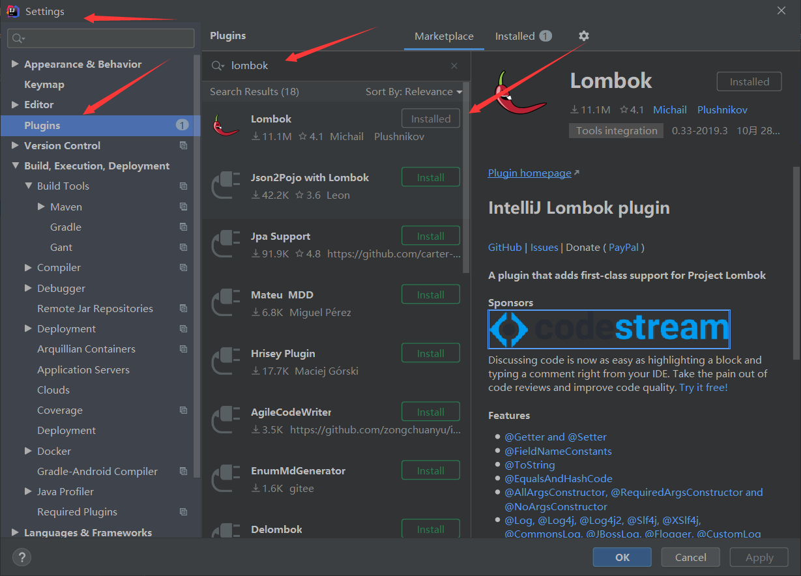
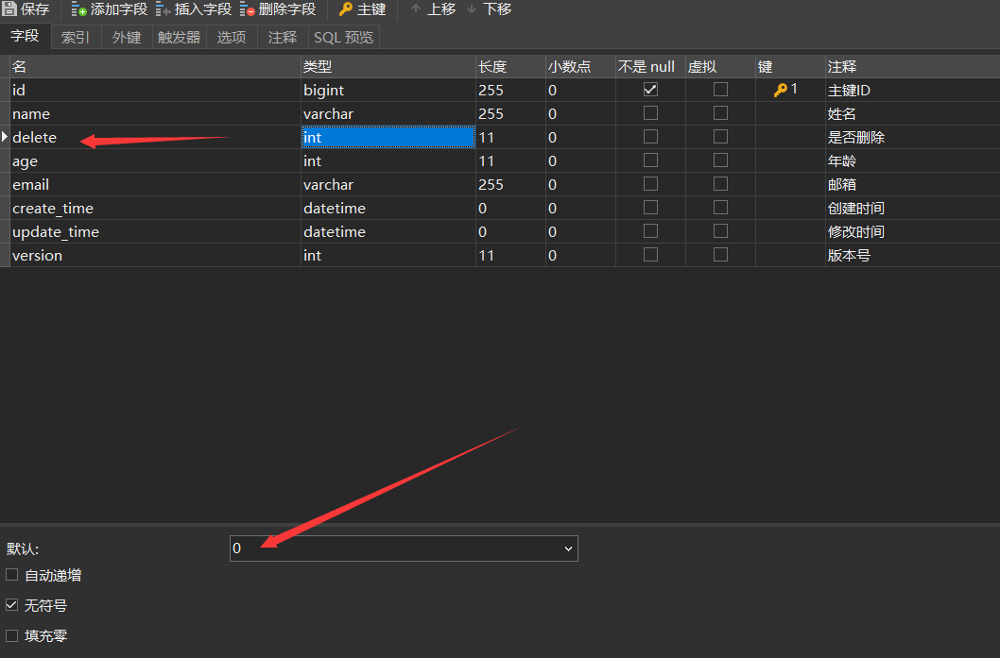
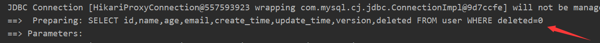

# 官网简介

## 简介

MyBatis-Plus（简称 MP）是一个 MyBatis的增强工具，在 MyBatis 的基础上只做增强不做改变，为简化开发、提高效率而生。

##官网

https://baomidou.com/guide/#%E7%89%B9%E6%80%A7

# 搭建环境并测试

## 创建Mysql数据

```sql
DROP TABLE IF EXISTS user;
CREATE TABLE user  (
  id int(20) NOT NULL COMMENT '主键ID',
  name varchar(255) CHARACTER SET utf8 COLLATE utf8_general_ci NULL DEFAULT NULL COMMENT '姓名',
  age int(11) NULL DEFAULT NULL COMMENT '年龄',
  email varchar(255) CHARACTER SET utf8 COLLATE utf8_general_ci NULL DEFAULT NULL COMMENT '邮箱',
  PRIMARY KEY (id) USING BTREE
) ENGINE = InnoDB CHARACTER SET = utf8 COLLATE = utf8_general_ci ROW_FORMAT = Dynamic;

INSERT INTO user VALUES (1, '张三', 18, '123qq.com');
INSERT INTO user VALUES (2, '李四', 19, '345qq.com');
INSERT INTO user VALUES (3, '王五', 18, '678qq.com');

```


##创建SpringBoot工程

## 引入相关依赖

```xml
<!--SpringBoot依赖-->
<dependency>
    <groupId>org.springframework.boot</groupId>
    <artifactId>spring-boot-starter</artifactId>
</dependency>
<dependency>
    <groupId>org.springframework.boot</groupId>
    <artifactId>spring-boot-starter-test</artifactId>
    <scope>test</scope>
    <exclusions>
        <exclusion>
            <groupId>org.junit.vintage</groupId>
            <artifactId>junit-vintage-engine</artifactId>
        </exclusion>
    </exclusions>
</dependency>

<!--mybatis-plus-->
<dependency>
    <groupId>com.baomidou</groupId>
    <artifactId>mybatis-plus-boot-starter</artifactId>
    <version>3.0.5</version>
</dependency>

<!--mysql-->
<dependency>
    <groupId>mysql</groupId>
    <artifactId>mysql-connector-java</artifactId>
</dependency>

<!--lombok用来简化实体类-->
<dependency>
    <groupId>org.projectlombok</groupId>
    <artifactId>lombok</artifactId>
</dependency>
```

##安装Lombok插件



## 创建配置文件

1. application.properties

```properties
#com.mysql.cj.jdbc.Driver：springBoot2.1以上要加上cj
spring.datasource.driver-class-name=com.mysql.cj.jdbc.Driver
#serverTimezone=GMT%2B8：添加时区
spring.datasource.url=jdbc:mysql://localhost:3306/mybatis_plus?serverTimezone=GMT%2B8
spring.datasource.username=root
spring.datasource.password=root

#mybatis日志:添加后可以查看执行的sql语句
mybatis-plus.configuration.log-impl=org.apache.ibatis.logging.stdout.StdOutImpl
```

## 创建实体类User

```java
package com.bao.entity;

import lombok.AllArgsConstructor;
import lombok.Data;
import lombok.NoArgsConstructor;

@Data
@NoArgsConstructor
@AllArgsConstructor
public class User {
    private Long id;
    private String name;
    private Integer age;
    private String email;

    public User(String name, Integer age, String email) {
        this.name = name;
        this.age = age;
        this.email = email;
    }
}
```

## 创建UserMapper接口

```java
package com.bao.mapper;

import com.bao.entity.User;
import com.baomidou.mybatisplus.core.mapper.BaseMapper;
import org.springframework.stereotype.Component;

/*使用MybatisPlus不需要再创建mapper对应的xml文件，只要继承该接口并传入相应的泛型即可*/
@Component //该注解加不加都可以，主要是为了解决自动注入时的报红问题
public interface UserMapper extends BaseMapper<User> {

}
```

## 在启动类添加扫描注解

```java
package com.bao;

import org.mybatis.spring.annotation.MapperScan;
import org.springframework.boot.SpringApplication;
import org.springframework.boot.autoconfigure.SpringBootApplication;

@SpringBootApplication
@MapperScan("com.bao.mapper")//添加扫描注解，写入mapper的路径，否则会找不到接口并报错
public class Mybatisplus001Application {

    public static void main(String[] args) {
        SpringApplication.run(Mybatisplus001Application.class, args);
    }

}
```

##编写测试类

```java
package com.bao;

import com.bao.entity.User;
import com.bao.mapper.UserMapper;
import org.junit.jupiter.api.Test;
import org.springframework.beans.factory.annotation.Autowired;
import org.springframework.boot.test.context.SpringBootTest;

import java.util.List;

@SpringBootTest
class Mybatisplus001ApplicationTests {
    @Autowired
    private UserMapper userMapper;

    @Test
    public void addUser() {
        User user = new User();
        user.setName("赵六");
        user.setAge(11);
        user.setEmail("222@qq.com");
        userMapper.insert(user);
    }

    @Test
    public void selectAll(){
        List<User> users = userMapper.selectList(null);
        for (User user : users) {
            System.out.println(user);
        }
    }

    @Test
    public void setUser(){
        userMapper.updateById(new User(3L, "王六", 14, "678qq.com"));
    }

}
```


# 主键生成策略

## 自动自增

1. 数据库中设置即可

## UUID

1. 每次生成随机唯一的值，排序不便


## Resid

假如一个集群中有5台Redis。可以初始化每台Redis的值分别是1,2,3,4,5，然后步长都是5。各个Redis生成的ID为：

A：1,6,11,16,21 

B：2,7,12,17,22 

C：3,8,13,18,23 

D：4,9,14,19,24 

E：5,10,15,20,25

## MybatisPlus自带生成策略（常用）

```java
package com.bao.entity;

import lombok.AllArgsConstructor;
import lombok.Data;
import lombok.NoArgsConstructor;

@Data
@NoArgsConstructor
@AllArgsConstructor
public class User {

    //@TableId(type = IdType.ID_WORKER)//数字类型的id使用，当类型为Long时默认使用，生成19位的Id值，
    //@TableId(type = IdType.ID_WORKER_STR)//字符串类型的id使用，需要写明注解，生成19位的Id值
    //同时需要设置数据库的字段id的类型为Bigint，因为int的长度只有11位
    private Long id;

    private String name;
    private Integer age;
    private String email;

    public User(String name, Integer age, String email) {
        this.name = name;
        this.age = age;
        this.email = email;
    }
}
```

## 参考官网

https://blog.csdn.net/angellee1988/article/details/82696264


# 自动填充时间

## 修改实体类

```java
package com.bao.entity;

import com.baomidou.mybatisplus.annotation.FieldFill;
import com.baomidou.mybatisplus.annotation.IdType;
import com.baomidou.mybatisplus.annotation.TableField;
import com.baomidou.mybatisplus.annotation.TableId;
import lombok.AllArgsConstructor;
import lombok.Data;
import lombok.NoArgsConstructor;

import java.util.Date;
import java.util.UUID;

@Data
@NoArgsConstructor
@AllArgsConstructor
public class User {

    //@TableId(type = IdType.ID_WORKER)//数字类型的id使用，当类型为Long时默认使用，生成19位的Id值，
    //@TableId(type = IdType.ID_WORKER_STR)//字符串类型的id使用，需要写明注解，生成19位的Id值
    private Long id;
    private String name;
    private Integer age;
    private String email;
    
    //使用mybatisPlus自动填充时间
    /*
    第一：添加注解
    第二：实现MetaObjectHandler接口
    第三：重写inserFill和updateFill方法
    第四：调用setFieldValByName方法
    */

    @TableField(fill = FieldFill.INSERT) //进行添加操作时有值
    private Date createTime;
    @TableField(fill = FieldFill.INSERT_UPDATE) //进行添加和修改操作时有值
    private Date updateTime;

    public User(String name, Integer age, String email) {
        this.name = name;
        this.age = age;
        this.email = email;
    }
}
```

## 增加数据库字段


## 实现MetaObjectHandler

```java
package com.bao.handler;

import com.baomidou.mybatisplus.core.handlers.MetaObjectHandler;
import org.apache.ibatis.reflection.MetaObject;
import org.springframework.stereotype.Component;

import java.util.Date;

@Component
public class MyMetaObjectHandler implements MetaObjectHandler {
    
    //使用mp实现添加操作时，该方法会执行
    @Override
    public void insertFill(MetaObject metaObject) {
        //参数：需要设置的属性；设置的时间；元数据(理解：表中的数据)
        this.setFieldValByName("createTime",new Date(),metaObject);
        this.setFieldValByName("updateTime",new Date(),metaObject);
    }

    //使用mp实现修改操作时，该方法会执行
    @Override
    public void updateFill(MetaObject metaObject) {
        this.setFieldValByName("updateTime",new Date(),metaObject);
    }
}
```

## 测试

```java
package com.bao;

import com.bao.entity.User;
import com.bao.mapper.UserMapper;
import org.junit.jupiter.api.Test;
import org.springframework.beans.factory.annotation.Autowired;
import org.springframework.boot.test.context.SpringBootTest;

import java.util.Date;
import java.util.List;
import java.util.UUID;

@SpringBootTest
class Mybatisplus001ApplicationTests {
    @Autowired
    private UserMapper userMapper;

    @Test
    public void addUser() {
        User user = new User();
        user.setName("赵六");
        user.setAge(11);
        user.setEmail("222@qq.com");
        //手动设置时间值
        /*user.setCreateTime(new Date());
        user.setUpdateTime(new Date());*/
        userMapper.insert(user);
    }

    @Test
    public void setUser(){
        User user = new User();
        user.setId(1324971372897878017L);
        user.setAge(17);
        userMapper.updateById(user);
    }


}
```


# 乐观锁

## 理解

>  主要解决的问题：丢失更新问题
>
> 图解：


## 添加version字段


## 添加version属性

- 注意：属性添加@Version注解

```java
package com.bao.entity;

import com.baomidou.mybatisplus.annotation.*;
import lombok.AllArgsConstructor;
import lombok.Data;
import lombok.NoArgsConstructor;
import java.util.Date;
import java.util.UUID;

@Data
@NoArgsConstructor
@AllArgsConstructor
public class User {

    //@TableId(type = IdType.ID_WORKER)//数字类型的id使用，当类型为Long时默认使用，生成19位的Id值，
    //@TableId(type = IdType.ID_WORKER_STR)//字符串类型的id使用，需要写明注解，生成19位的Id值
    private Long id;
    private String name;
    private Integer age;
    private String email;
    //使用mybatisPlus自动填充时间
    /*
    第一：添加注释
    第二：实现MetaObjectHandler
    第三：重写inserFill和updateFill
    第四：调用setFieldValByName
    */

    @TableField(fill = FieldFill.INSERT)
    private Date createTime;
    
    @TableField(fill = FieldFill.INSERT_UPDATE)
    private Date updateTime;

    //添加version属性，注意添加@Version注解
    //同时使用TableField设置初始值为1
    @TableField(fill = FieldFill.INSERT)
    @Version
    private Integer version;

    public User(String name, Integer age, String email) {
        this.name = name;
        this.age = age;
        this.email = email;
    }
}
```

## 修改MetaObjectHandler

```java
package com.bao.handler;

import com.baomidou.mybatisplus.core.handlers.MetaObjectHandler;
import org.apache.ibatis.reflection.MetaObject;
import org.springframework.stereotype.Component;

import java.util.Date;

@Component
public class MyMetaObjectHandler implements MetaObjectHandler {
    @Override
    public void insertFill(MetaObject metaObject) {
        //参数：需要设置的属性；设置的时间；元数据
        this.setFieldValByName("createTime",new Date(),metaObject);
        this.setFieldValByName("updateTime",new Date(),metaObject);
        //设置版本号的初始值为1
        this.setFieldValByName("version",1,metaObject);
    }

    @Override
    public void updateFill(MetaObject metaObject) {
        this.setFieldValByName("updateTime",new Date(),metaObject);
    }
}
```

## 创建配置类

- 将MapperScan注解从启动类移动到配置类
- 乐观锁插件可以不用记忆，下次直接复制

```java
package com.bao.config;

import com.baomidou.mybatisplus.extension.plugins.OptimisticLockerInterceptor;
import org.mybatis.spring.annotation.MapperScan;
import org.springframework.context.annotation.Bean;
import org.springframework.context.annotation.Configuration;

@MapperScan("com.bao.mapper")//添加扫描注解，写入mapper的路径，否则会找不到接口并报错
@Configuration
public class MybatisPlusConfig {

    //乐观锁插件
    @Bean
    public OptimisticLockerInterceptor OptimisticLockerInterceptor(){
        return new OptimisticLockerInterceptor();
    }

}
```

## 测试

```java
@Test
public void TestOptimisticLocker(){
    User user = userMapper.selectById(1324999942995111937L);
    user.setAge(13);
    int i = userMapper.updateById(user);
    System.out.println(i);
}
```


# 简单语句练习

```java
//批量查询
@Test
void testSelectBatchIds(){
    ArrayList<Integer> integers = new ArrayList<Integer>();
    integers.add(3);
    integers.add(4);
    List<User> users = userMapper.selectBatchIds(integers);
    for (User user : users) {
        System.out.println(user);
    }
}

//条件查询
@Test
void testSelectByMap(){
    HashMap<String, Object> map = new HashMap<>();
    map.put("name","孙七");
    map.put("age",20);
    List<User> users = userMapper.selectByMap(map);
    for (User user : users) {
        System.out.println(user);
    }
}
```

# 分页查询

## 配置分页插件

```java
package com.bao.config;

import com.baomidou.mybatisplus.extension.plugins.OptimisticLockerInterceptor;
import com.baomidou.mybatisplus.extension.plugins.PaginationInterceptor;
import org.mybatis.spring.annotation.MapperScan;
import org.springframework.context.annotation.Bean;
import org.springframework.context.annotation.Configuration;

@MapperScan("com.bao.mapper")//添加扫描注解，写入mapper的路径，否则会找不到接口并报错
@Configuration
public class MybatisPlusConfig {

    //乐观锁插件
    @Bean
    public OptimisticLockerInterceptor OptimisticLockerInterceptor(){
        return new OptimisticLockerInterceptor();
    }

    //分页插件
    @Bean
    public PaginationInterceptor paginationInterceptor(){
        return new PaginationInterceptor();
    }

}
```


## 测试

```java
//分页查询
@Test
public void TestPage(){
    //1.创建Page对象，传入两个参数：当前页和每页显示记录数
    Page<User> page = new Page<User>(2,5);
    //2.将分页查询到的所有数据封装到Page对象中
    userMapper.selectPage(page,null);
    //3.通过page对象获取分页数据
    System.out.println(page.getCurrent());//当前页码
    List<User> records = page.getRecords();//每页数据List集合
    for (User record : records) {
        System.out.println(record);
    }
    System.out.println(page.getSize());//每页显示记录数
    System.out.println(page.getTotal());//总记录数
    System.out.println(page.getPages());//总页数
    System.out.println(page.hasNext());//是否有下一页
    System.out.println(page.hasPrevious());//是否有上一页
}
```


# 逻辑删除

## 逻辑删除和物理删除

- 物理删除：数据在物理层面删除了，文件中没有这条数据了
- 逻辑删除：修改了标记，文件中还是存在的

## 物理删除

```java
//物理删除
//通过id删除
@Test
public void TestDeleteById(){
    int i = userMapper.deleteById(1L);
    System.out.println(i);
}

//批量删除
@Test
public void TestDeleteBatchIds(){
    int i = userMapper.deleteBatchIds(Arrays.asList(2, 3));
}

//条件删除
@Test
public void TestDeleteByMap(){
    HashMap hashMap = new HashMap();
    hashMap.put("name","张三");
    hashMap.put("age",18);
    int i = userMapper.deleteByMap(hashMap);

}
```

## 逻辑删除

### 添加逻辑删除插件

```java
@Bean
public ISqlInjector sqlInjector(){
    return new LogicSqlInjector();
}
```

### 设置逻辑删除的值

```properties
#com.mysql.cj.jdbc.Driver：springBoot2.1以上要加上cj
spring.datasource.driver-class-name=com.mysql.cj.jdbc.Driver
#serverTimezone=GMT%2B8：添加时区
spring.datasource.url=jdbc:mysql://localhost:3306/mybatis_plus?serverTimezone=GMT%2B8
spring.datasource.username=root
spring.datasource.password=root

#mybatis日志:添加后可以查看执行的sql语句
mybatis-plus.configuration.log-impl=org.apache.ibatis.logging.stdout.StdOutImpl

#设置逻辑删除的值：1-已删除；0-没有删除
#可自行设置值，但是一般不设置，1和0为默认值
#mybatis-plus.global-config.db-config.logic-delete-value=1
#mybatis-plus.global-config.db-config.logic-not-delete-value=0
```

### 添加deleted字段



> 设置初始值方式二：在设计表时设置初始值

### 添加deleted属性

> 添加@TableLogic注解

```java
package com.bao.entity;

import com.baomidou.mybatisplus.annotation.*;
import lombok.AllArgsConstructor;
import lombok.Data;
import lombok.NoArgsConstructor;

import java.util.Date;
import java.util.UUID;

@Data
@NoArgsConstructor
@AllArgsConstructor
public class User {

    //@TableId(type = IdType.ID_WORKER)//数字类型的id使用，当类型为Long时默认使用，生成19位的Id值，
    //@TableId(type = IdType.ID_WORKER_STR)//字符串类型的id使用，需要写明注解，生成19位的Id值
    private Long id;
    private String name;
    private Integer age;
    private String email;
    //使用mybatisPlus自动填充时间
    /*
    第一：添加注释
    第二：实现MetaObjectHandler
    第三：重写inserFill和updateFill
    第四：调用setFieldValByName
    */

    @TableField(fill = FieldFill.INSERT)
    private Date createTime;
    @TableField(fill = FieldFill.INSERT_UPDATE)
    private Date updateTime;

    //添加version属性，同时使用TableField设置初始值为1
    @TableField(fill = FieldFill.INSERT)
    @Version
    private Integer version;

    //添加删除标记
    @TableLogic
    @TableField(fill = FieldFill.INSERT)//设置初始值
    private Integer deleted;

    public User(String name, Integer age, String email) {
        this.name = name;
        this.age = age;
        this.email = email;
    }
}
```

> 设置逻辑删除的初始值的方式有两种
>
> 1、使用TableField注解
>
> 2、在数据库给字段设置默认初始值
>
> 注：使用TableField注解和在数据库设置初始值只能选择一种，不能同时存在


### 测试

再一次使用物理删除的语句进行测试


查询所有数据进行测试



**发现：语句结尾增加了条件**


# 性能分析插件

## 作用

用于输出每条sql语句执行的时间，便于优化sql语句

## 配置sql分析插件

```java
/*
Sql性能分析插件
开发环境使用，上线项目不推荐使用
 */
@Bean
@Profile({"dev","test"})//设置使用环境
public PerformanceInterceptor performanceInterceptor(){
    PerformanceInterceptor performanceInterceptor = new PerformanceInterceptor();
    performanceInterceptor.setMaxTime(10);//ms值，超过此处的毫秒值则不执行
    performanceInterceptor.setFormat(true);
    return performanceInterceptor;
}
```

- 开发环境介绍：
  - dev:开发环境
  - test:测试环境
  - prod:生产环境（真正上线交给用户使用的环境）

## 设置环境

```properties
#com.mysql.cj.jdbc.Driver：springBoot2.1以上要加上cj
spring.datasource.driver-class-name=com.mysql.cj.jdbc.Driver
#serverTimezone=GMT%2B8：添加时区
spring.datasource.url=jdbc:mysql://localhost:3306/mybatis_plus?serverTimezone=GMT%2B8
spring.datasource.username=root
spring.datasource.password=root

#mybatis日志:添加后可以查看执行的sql语句
mybatis-plus.configuration.log-impl=org.apache.ibatis.logging.stdout.StdOutImpl

#设置当前环境：dev;test;prod
spring.profiles.active=dev

#设置逻辑删除的值：1-删除；0-没有删除
#可自行设置值，但是一般不设置，1、0为默认值，也可以不写
#mybatis-plus.global-config.db-config.logic-delete-value=1
#mybatis-plus.global-config.db-config.logic-not-delete-value=0
```

## 测试

### 成功


### 失败


# Warpper实现复杂查询

##ge、gt、le、lt

- ge：大于等于

- gt：大于

- le：小于等于

- lt：小于

```java
@Test
public void testSelectQuery1(){
    //创建QueryWrapper
    QueryWrapper<User> queryWrapper = new QueryWrapper<User>();
    queryWrapper.ge("age", 14);
    List<User> users = userMapper.selectList(queryWrapper);
    for (User user : users) {
        System.out.println(user);
    }
}
```

## eq、ne

- eq：等于

- ne：不等于

```java
@Test
public void testSelectQuery2(){
    //创建QueryWrapper
    QueryWrapper<User> queryWrapper = new QueryWrapper<User>();
    /*queryWrapper.eq("name","孙七");
    List<User> users = userMapper.selectList(queryWrapper);
    for (User user : users) {
        System.out.println(user);
    }*/
    queryWrapper.ne("name","孙七");
    List<User> users = userMapper.selectList(queryWrapper);
    for (User user : users) {
        System.out.println(user);
    }
}
```

##between

- between：范围内的数据

```java
@Test
public void testSelectQuery3(){
    //创建QueryWrapper
    QueryWrapper<User> queryWrapper = new QueryWrapper<User>();
    queryWrapper.between("age",13,17);//年龄在13-17范围内的数据
    List<User> users = userMapper.selectList(queryWrapper);
    for (User user : users) {
        System.out.println(user);
    }
}
```

##like

- like：模糊查询

```java
@Test
public void testSelectQuery4(){
    //创建QueryWrapper
    QueryWrapper<User> queryWrapper = new QueryWrapper<User>();
    queryWrapper.like("name","孙");
    List<User> users = userMapper.selectList(queryWrapper);
    for (User user : users) {
        System.out.println(user);
    }
}
```

##orderByDesc、orderByAsc

- orderByDesc：降序
- orderByAsc：升序

```java
@Test
public void testSelectQuery5(){
    //创建QueryWrapper
    QueryWrapper<User> queryWrapper = new QueryWrapper<User>();
    //queryWrapper.orderByDesc("age");//降序
    queryWrapper.orderByAsc("age");//升序
    List<User> users = userMapper.selectList(queryWrapper);
    for (User user : users) {
        System.out.println(user);
    }
}
```

##last

- last：最后可以拼接sql语句

```java
@Test
public void testSelectQuery6(){
    //创建QueryWrapper
    QueryWrapper<User> queryWrapper = new QueryWrapper<User>();
    queryWrapper.last("limit 1,2");//分页查询（开始索引，每页展示条数）
    List<User> users = userMapper.selectList(queryWrapper);
    for (User user : users) {
        System.out.println(user);
    }
}
```

##select

- select：指定要查询的列

```java
@Test
public void testSelectQuery7(){
    //创建QueryWrapper
    QueryWrapper<User> queryWrapper = new QueryWrapper<User>();
    queryWrapper.select("name", "age");
    List<User> users = userMapper.selectList(queryWrapper);
    for (User user : users) {
        System.out.println(user);
    }
}
```