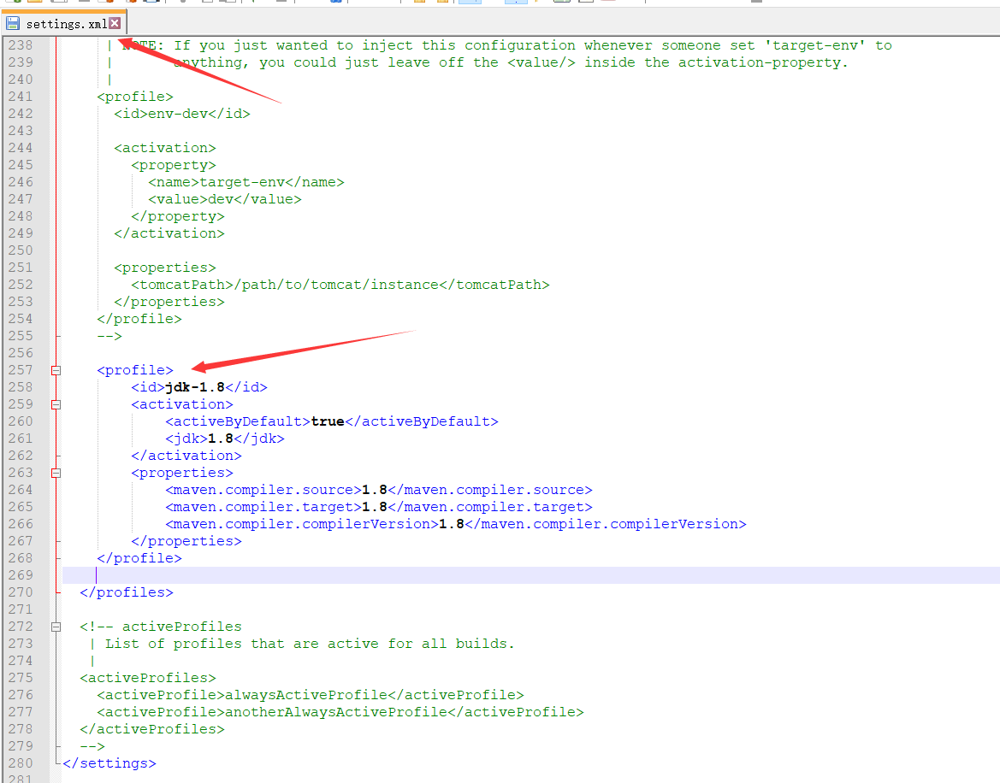
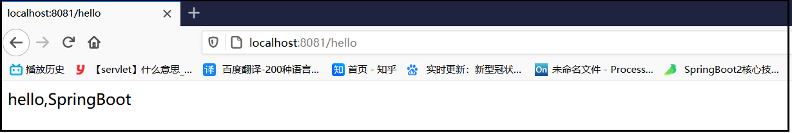
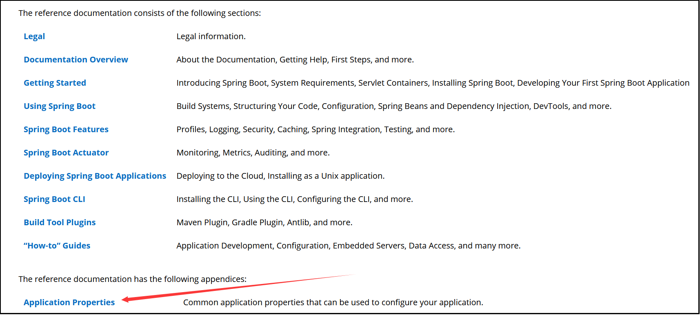
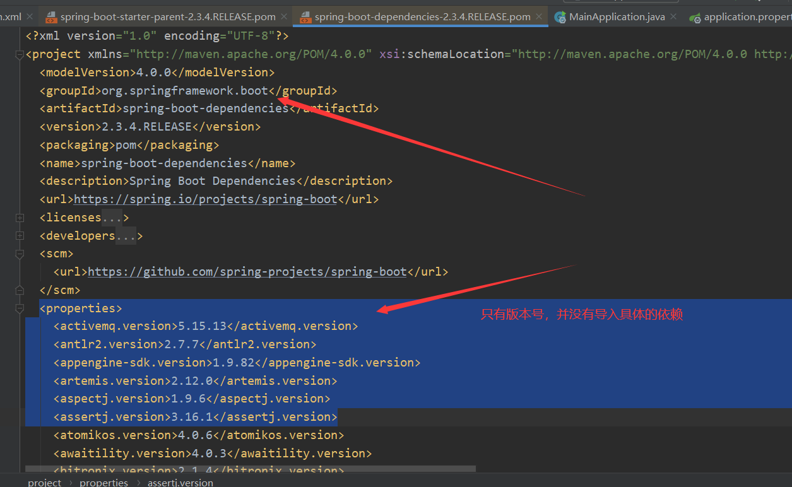
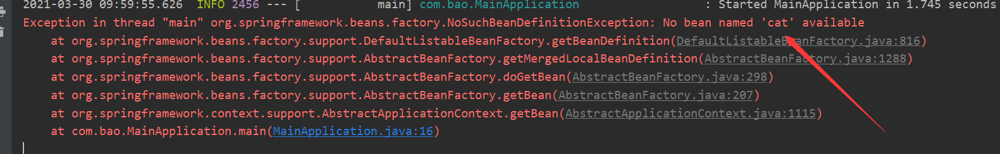
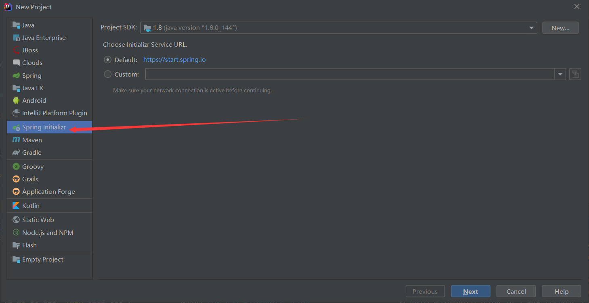
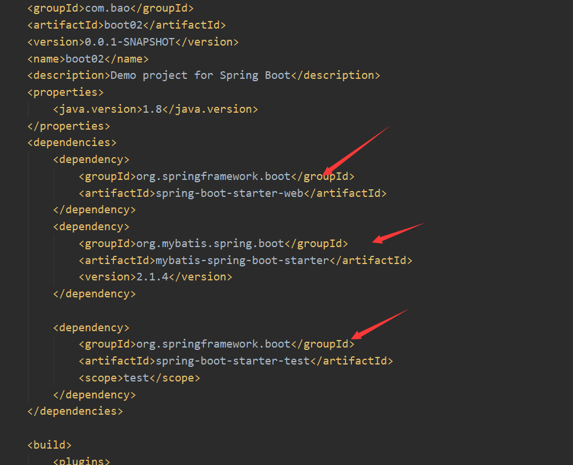

# Spring与SpringBoot

## Spring的生态

> 覆盖了
>
> > web开发
> >
> > 数据访问
> >
> > 安全控制
> >
> > 分布式
> >
> > 消息服务
> >
> > 移动开发
> >
> > 批处理

## SpringBoot的作用

> SpringBoot是整合Spring技术栈的一站式框架
>
> SpringBoot是简化Spring技术栈的快速开发脚手架

## SpringBoot优点

> 创建独立Spring应用
>
> 内嵌web服务器
>
> 自动starter依赖，简化构建配置
>
> 自动配置Spring以及第三方功能
>
> 提供生产级别的监控、健康检查及外部化配置
>
> 无代码生成、无需编写XML

## SpringBoot的缺点

> 迭代快
>
> 封装太深，内部原理复杂

## 时代背景

### 微服务

> 微服务是一种架构风格，一个应用拆分为一组小型服务的风格
>
> 每个服务运行在自己的进程内，也就是可独立部署和升级，放在不同的服务器上
>
> 服务之间使用轻量级HTTP交互
>
> 服务围绕业务功能拆分
>
> 可以由全自动部署机制独立部署（比如一个项目拆分为100个小型服务，手动部署100个项目过于繁琐，所以需要全自动部署的机制）
>
> 去中心化，服务自治（服务可以使用不同的语言、不同的存储技术）

### 分布式

> 解决在不同服务器上的应用通信的技术

### 分布式的困难

> 远程调用：两台服务器之间的调用
>
> 服务发现：比如登录功能被放在两台服务器上，怎么从多台服务器中发现这两台服务器
>
> 负载均衡
>
> 服务容错
>
> 配置管理
>
> 服务监控
>
> 链路追踪
>
> 日志管理
>
> 任务调度

### 分布式的解决


springBoot：快速构建项目

springCloud：互联各个小型服务

springCloudDataFlow：以响应式数据流整合

### 云原生

> 原生应用如何上云。 Cloud Native

### 上云的困难

> 服务自愈：崩掉的服务器能否自己解决出现的问题
>
> 弹性伸缩：当流量特别大时，能否自动创建新的服务，不需要时自动销毁服务
>
> 服务隔离：一台服务器配置两个服务，两个服务不会互相影响
>
> 自动化部署：众多的服务自动部署，而不是人为的手动部署
>
> 灰度发布：一个功能有多个服务，服务更新后先更新其中一个，经过一段时间的测试后再慢慢更新其他的老版本
>
> 流量治理：控制每个服务可接收的最大的流量
>
> ......


# SpringBoot入门

##系统要求

> Java 8+
>
> Maven 3.3+


## maven设置

在maven的全局配置文件settings.xml中设置JDK版本

```xml
<profiles>
    <profile>
        <id>jdk-1.8</id>
        <activation>
            <activeByDefault>true</activeByDefault>
            <jdk>1.8</jdk>
        </activation>
        <properties>
            <maven.compiler.source>1.8</maven.compiler.source>
            <maven.compiler.target>1.8</maven.compiler.target>
            <maven.compiler.compilerVersion>1.8</maven.compiler.compilerVersion>
        </properties>
    </profile>
</profiles>
```




## 需求

> 浏览发送/hello请求，响应 Hello，Spring Boot 2 

## 创建maven工程

## 引入依赖

```xml
<!--1.导入父工程-->
<parent>
    <groupId>org.springframework.boot</groupId>
    <artifactId>spring-boot-starter-parent</artifactId>
    <version>2.3.4.RELEASE</version>
</parent>

<!--2.导入springBoot的Web场景-->
<dependencies>
    <dependency>
        <groupId>org.springframework.boot</groupId>
        <artifactId>spring-boot-starter-web</artifactId>
    </dependency>
</dependencies>
```

## 创建主程序

```java
package com.bao;

import org.springframework.boot.SpringApplication;
import org.springframework.boot.autoconfigure.SpringBootApplication;

/*这是主程序类，类名可以随意起，需要注意的是该类必须与其他类同包*/
@SpringBootApplication//说明这是一个springBoot应用
public class MainApplication {
    //main方法是所有程序的入口
    public static void main(String[] args) {
        //将主程序跑起来，需要调用SpringApplication类的run方法
        //参数：说明要将哪个主程序跑起来，传入参数
        SpringApplication.run(MainApplication.class,args);
    }
}

```

## 编写业务

```java
package com.bao.controller;

import org.springframework.web.bind.annotation.RequestMapping;
import org.springframework.web.bind.annotation.RestController;

/*给页面返回json形式的一句话*/
@RestController
public class HelloController {

    @RequestMapping("/hello")
    public String hello(){
        return "hello,SpringBoot";
    }

}
```

## 运行

> 直接运行main方法，在浏览器输入地址访问


## 修改配置

> application.properties
>
> SpringBoot将所有的配置均简化到该文件中，文件名固定

```properties
#修改端口号
server.port=8081
```







## 简化部署

> SpringBoot项目默认打成jar包
>
> 传统web项目我们需要打成war包，放入tomcat中运行，springBoot项目我们可以导入一个插件，在项目打成jar包的同时，还会顺带打包运行环境，所以只要直接运行jar包也可以访问项目

```xml
<build>
    <plugins>
        <plugin>
            <groupId>org.springframework.boot</groupId>
            <artifactId>spring-boot-maven-plugin</artifactId>
        </plugin>
    </plugins>
</build>
```


cmd窗口运行


访问


## 可能遇到的问题

> 窗口运行项目，运行不起来
>
> 原因：项目还没运行成功点击屏幕
>
> 解决：别点！
>
> ​			取消窗口属性的快速编辑模式


# 自动配置原理

## 依赖管理

### 父项目

```xml
<parent>
    <groupId>org.springframework.boot</groupId>
    <artifactId>spring-boot-starter-parent</artifactId>
    <version>2.3.4.RELEASE</version>
</parent>
```

> 每一个springBoot项目都会有一个父项目
>
> 父项目的作用是进行依赖版本管理，几乎声明了所有开发中常用的依赖的版本号
>
> 这就是SpringBoot的自动版本仲裁机制
>
> 我们可以通过进入父项目的源码进行查看
>
> 我们因为继承了父项目，所以在导入依赖的时候并没有声明版本号



### 自动版本仲裁机制

> 引入已经有默认版本号的依赖都可以不写版本号
> 引入没有默认版本号的依赖需要写版本号

### 修改默认版本号

> 当我们不想使用默认的版本号时我们可以手动修改
>
> 1、查看spring-boot-dependencies里面规定当前依赖的版本用的键的名称。这里键的名称就是mysql.version
> 2、在当前项目里面重写配置，版本号的值可以去maven仓库中获得

```xml
<properties>
        <mysql.version>5.1.47</mysql.version>
</properties>
```

### 导入starter场景启动器

> 在springBoot项目中会见到很多 spring-boot-starter-* 的依赖， *代表了某种场景
>
> 只要引入starter，这个场景所需的常规依赖都会自动引入
>
> 支持的场景：https://docs.spring.io/spring-boot/docs/current/reference/html/using-spring-boot.html#using-boot-starter
>
> 如果说官方提供的依赖并不满足我们的需要，我们可以自己定义依赖
>
> 见到的  *-spring-boot-starter的依赖，就是第三方为我们提供的简化开发的场景启动器。
>
> 所有场景启动器最底层的依赖都是spring-boot-starter

```xml
<dependency>
  <groupId>org.springframework.boot</groupId>
  <artifactId>spring-boot-starter</artifactId>
  <version>2.3.4.RELEASE</version>
  <scope>compile</scope>
</dependency>
```

### 查看依赖的结构关系


## 自动配置

> 当我们导入了web场景的时候，自动配好Tomcat、SpringMVC、Web等常见的依赖


### 默认的包结构

> 需要注意：主程序所在包及其下面的所有子包里面的组件才会被默认扫描进来，才能够被管理
>
> 不需要以前的包扫描配置
>
> 如果需要改变包扫描的位置，需要给@SpringBootApplication注解添加值


### 各种配置都拥有默认值

> 默认配置最终都是映射到某个类上
>
> 配置文件的值最终会绑定每个类上，这个类会在容器中创建对象

### 按需加载所有自动配置项

> springBoot有非常多的starter，引入了哪些场景，这个场景的自动配置才会开启
>
> SpringBoot所有的自动配置功能都在 spring-boot-autoconfigure 包里面


# 容器功能

## 注解原理及组件添加

> 组件可以理解为添加到spring容器的bean对象

### @Configuration

> 该注解可以声明该类是一个配置类

#### 创建实体类

```java
package com.bao.pojo;

import lombok.AllArgsConstructor;
import lombok.Data;
import lombok.NoArgsConstructor;

@Data
@NoArgsConstructor
@AllArgsConstructor
public class Dog {
    private String name;
    private int age;
}
```

```java
package com.bao.pojo;

import lombok.AllArgsConstructor;
import lombok.Data;
import lombok.NoArgsConstructor;

@Data
@NoArgsConstructor
@AllArgsConstructor
public class User {
    private int id;
    private String name;
    private int money;
}
```

#### 创建配置类

```java
package com.bao.config;

import com.bao.pojo.Dog;
import com.bao.pojo.User;
import org.springframework.context.annotation.Bean;
import org.springframework.context.annotation.Configuration;

@Configuration//该注解表明这个类是一个配置类，效果等同于配置文件
public class MyConfig {

    @Bean //在spring容器中添加组件；方法名为组件的id；返回值类型为组件类型；返回值就是组件具体的实例
    public User zhangsan(){
        return new User(1,"张三",5000);
    }

    @Bean("dahuan")//id名也可以自定义，将id由wangcai改为dahuang
    public Dog wangcai(){
        return new Dog("旺财",3);
    }

}
```

#### 主程序进行测试

> 遍历容器中的所有组件

```java
package com.bao;

import org.springframework.boot.SpringApplication;
import org.springframework.boot.autoconfigure.SpringBootApplication;
import org.springframework.context.ConfigurableApplicationContext;

/*这是主程序类，类名可以随意起，需要注意的是该类必须与其他类同包*/
//@SpringBootApplication//说明这是一个springBoot应用
@SpringBootApplication(scanBasePackages = "com.bao")//也可以自定义主程序扫描的位置
public class MainApplication {
    //main方法是所有程序的入口
    public static void main(String[] args) {
        //将主程序跑起来，需要调用SpringApplication类的run方法
        //参数：说明要将哪个主程序跑起来，传入参数
        //返回值：IOC容器
        ConfigurableApplicationContext context = SpringApplication.run(MainApplication.class, args);

        //遍历容器中的所有组件
        //getBeanDefinitionNames()：返回容器中的所有组件
        String[] beanDefinitionNames = context.getBeanDefinitionNames();
        for (String bean : beanDefinitionNames) {
            System.out.println(bean);
        }

    }
}
```

#### 测试结果


#### 主程序进行测试

> 实例可以通过容器获得，也可以通过创建配置类的实例调用方法来获得实例，获取的实例默认都是单例的

```java
package com.bao;

import com.bao.config.MyConfig;
import com.bao.pojo.Dog;
import com.bao.pojo.User;
import org.springframework.boot.SpringApplication;
import org.springframework.boot.autoconfigure.SpringBootApplication;
import org.springframework.context.ConfigurableApplicationContext;

/*这是主程序类，类名可以随意起，需要注意的是该类必须与其他类同包*/
//@SpringBootApplication//说明这是一个springBoot应用
@SpringBootApplication(scanBasePackages = "com.bao")//也可以自定义主程序扫描的位置
public class MainApplication {
    //main方法是所有程序的入口
    public static void main(String[] args) {
        //将主程序跑起来，需要调用SpringApplication类的run方法
        //参数：说明要将哪个主程序跑起来，传入参数
        //返回值：IOC容器
        ConfigurableApplicationContext context = SpringApplication.run(MainApplication.class, args);

        //遍历容器中的所有组件
        //getBeanDefinitionNames()：返回容器中的所有组件
        /*String[] beanDefinitionNames = context.getBeanDefinitionNames();
        for (String bean : beanDefinitionNames) {
            System.out.println(bean);
        }*/

        //获取单个组件，获取的实例是单例的
        User zhangsan1 = context.getBean("zhangsan", User.class);
        User zhangsan2 = context.getBean("zhangsan", User.class);
        System.out.println(zhangsan1);
        System.out.println(zhangsan2);
        System.out.println(zhangsan1 == zhangsan2);
        System.out.println("------------------------------------------------------");

        //配置类本身就是一个组件，获取的实例是单例的
        MyConfig myConfig = context.getBean(MyConfig.class);
        System.out.println(myConfig);
        User zhangsan3 = myConfig.zhangsan();
        User zhangsan4 = myConfig.zhangsan();
        System.out.println(zhangsan1 == zhangsan2);

    }
}

```


#### Full模式与Lite模式

> 当实体类之间有依赖关系时
> 	Full模式：配置类的proxyBeanMethods的值为true时，每个@Bean方法被调用多少次返回的组件都是单实例的;
> 	Lite模式：配置类的proxyBeanMethods的值为false时，每个@Bean方法被调用多少次返回的组件都是新创建的;

> 配置类组件之间有依赖关系建议用Full模式保证使用的是容器中的组件
>
> 配置类组件之间无依赖关系建议用Lite模式加速容器启动过程，减少判断

#### 修改实体类

```java
package com.bao.pojo;

import lombok.AllArgsConstructor;
import lombok.Data;
import lombok.NoArgsConstructor;

@Data
@NoArgsConstructor
@AllArgsConstructor
public class User {
    private int id;
    private String name;
    private int money;
    //增加属性
    private Dog dog;
}
```

#### 修改MyConfig配置类

```java
package com.bao.config;

import com.bao.pojo.Dog;
import com.bao.pojo.User;
import org.springframework.context.annotation.Bean;
import org.springframework.context.annotation.Configuration;

//@Configuration//该注解表明这个类是一个配置类，效果等同于配置文件
@Configuration(proxyBeanMethods = false)
/*
当实体类之间有依赖关系时
	Full模式：配置类的proxyBeanMethods的值为true时，每个@Bean方法被调用多少次返回的组件都是单实例的;
	Lite模式：配置类的proxyBeanMethods的值为false时，每个@Bean方法被调用多少次返回的组件都是新创建的;
*/
public class MyConfig {

    @Bean //在spring容器中添加组件；方法名为组件的id；返回值类型为组件类型；返回值就是组件具体的实例
    public User zhangsan(){
        return new User(1,"张三",5000,wangcai());
    }

    @Bean("dahuang")//id名也可以自定义，将id由wangcai改为dahuang
    public Dog wangcai(){
        return new Dog("旺财",3);
    }

}
```

#### 主程序进行测试

```java
package com.bao;

import com.bao.config.MyConfig;
import com.bao.pojo.Dog;
import com.bao.pojo.User;
import org.springframework.boot.SpringApplication;
import org.springframework.boot.autoconfigure.SpringBootApplication;
import org.springframework.context.ConfigurableApplicationContext;

/*这是主程序类，类名可以随意起，需要注意的是该类必须与其他类同包*/
//@SpringBootApplication//说明这是一个springBoot应用
@SpringBootApplication(scanBasePackages = "com.bao")//也可以自定义主程序扫描的位置
public class MainApplication {
    //main方法是所有程序的入口
    public static void main(String[] args) {
        //将主程序跑起来，需要调用SpringApplication类的run方法
        //参数：说明要将哪个主程序跑起来，传入参数
        //返回值：IOC容器
        ConfigurableApplicationContext context = SpringApplication.run(MainApplication.class, args);

        //遍历容器中的所有组件
        //getBeanDefinitionNames()：返回容器中的所有组件
        /*String[] beanDefinitionNames = context.getBeanDefinitionNames();
        for (String bean : beanDefinitionNames) {
            System.out.println(bean);
        }*/

        //获取单个组件，获取的实例是单例的
/*        User zhangsan1 = context.getBean("zhangsan", User.class);
        User zhangsan2 = context.getBean("zhangsan", User.class);
        System.out.println(zhangsan1);
        System.out.println(zhangsan2);
        System.out.println(zhangsan1 == zhangsan2);
        System.out.println("------------------------------------------------------");*/

        //配置类本身就是一个组件，获取的实例是单例的
/*        MyConfig myConfig = context.getBean(MyConfig.class);
        System.out.println(myConfig);
        User zhangsan3 = myConfig.zhangsan();
        User zhangsan4 = myConfig.zhangsan();
        System.out.println(zhangsan1 == zhangsan2);*/

        System.out.println("=================================================");
        User zhangsan5 = context.getBean("zhangsan", User.class);
        Dog dahuang = context.getBean("dahuang", Dog.class);
        System.out.println(zhangsan5);
        System.out.println(dahuang);
        System.out.println(zhangsan5.getDog() == dahuang);

    }
}
```

#### 测试结果


### @Import

> 该注解可以导入组件
>
> 在容器中自动创建出该类型的组件、默认组件的名字就是全类名

#### 添加@Import注解

```java
package com.bao.config;

import com.bao.pojo.Dog;
import com.bao.pojo.User;
import org.springframework.context.annotation.Bean;
import org.springframework.context.annotation.Configuration;
import org.springframework.context.annotation.Import;

@Configuration
@Import({User.class,Dog.class})
public class MyConfig {

    @Bean //在spring容器中添加组件；方法名为组件的id；返回值类型为组件类型；返回值就是组件具体的实例
    public User zhangsan(){
        return new User(1,"张三",5000,wangcai());
    }

    @Bean("dahuang")//id名也可以自定义，将id由wangcai改为dahuang
    public Dog wangcai(){
        return new Dog("旺财",3);
    }

}
```

#### 测试

```java
package com.bao;

import com.bao.config.MyConfig;
import com.bao.pojo.Dog;
import com.bao.pojo.User;
import org.springframework.boot.SpringApplication;
import org.springframework.boot.autoconfigure.SpringBootApplication;
import org.springframework.context.ConfigurableApplicationContext;

@SpringBootApplication
public class MainApplication {
    public static void main(String[] args) {
        //将主程序跑起来，需要调用SpringApplication类的run方法
        //参数：说明要将哪个主程序跑起来，传入参数
        //返回值：IOC容器
        ConfigurableApplicationContext context = SpringApplication.run(MainApplication.class, args);

        //.getBeanNamesForType(User.class):该方法可以通过组件类型获取所有该类型的实例
        String[] beanNames = context.getBeanNamesForType(User.class);
        for (String beanName : beanNames) {
            System.out.println(beanName);
        }

    }
}
```

> @Bean、@Component、@Controller、@Service、@Repository、@ComponentScan等注解依然可以使用


## 原生配置文件引入

### @ImportResource

> 该注解可以写在配置类上
>
> 可以导入配置文件

#### 创建springconfig1.xml文件

```xml
<?xml version="1.0" encoding="UTF-8"?>
<beans xmlns="http://www.springframework.org/schema/beans"
       xmlns:xsi="http://www.w3.org/2001/XMLSchema-instance"
       xsi:schemaLocation="http://www.springframework.org/schema/beans
       http://www.springframework.org/schema/beans/spring-beans.xsd">

    <bean id="lisi" class="com.bao.pojo.User">
        <property name="id" value="2"/>
        <property name="name" value="李四"/>
        <property name="money" value="10000"/>
        <property name="dog" ref="xiaohuang"/>
    </bean>

    <bean id="xiaohuang" class="com.bao.pojo.Dog">
        <property name="name" value="小黄"/>
        <property name="age" value="1"/>
    </bean>
</beans>
```

#### 在配置类MyConfig中加@ImportResource注解

```java
package com.bao.config;

import com.bao.pojo.Dog;
import com.bao.pojo.User;
import org.springframework.context.annotation.Bean;
import org.springframework.context.annotation.Configuration;
import org.springframework.context.annotation.Import;
import org.springframework.context.annotation.ImportResource;

@Configuration
@Import({User.class,Dog.class})
@ImportResource("classpath:springconfig1.xml")//该注解是引入了一个原生的spring的配置文件
public class MyConfig {

    @Bean //在spring容器中添加组件；方法名为组件的id；返回值类型为组件类型；返回值就是组件具体的实例
    public User zhangsan(){
        return new User(1,"张三",5000,wangcai());
    }

    @Bean("dahuang")//id名也可以自定义，将id由wangcai改为dahuang
    public Dog wangcai(){
        return new Dog("旺财",3);
    }

}
```

#### 测试

```java
package com.bao;

import com.bao.config.MyConfig;
import com.bao.pojo.Dog;
import com.bao.pojo.User;
import org.springframework.boot.SpringApplication;
import org.springframework.boot.autoconfigure.SpringBootApplication;
import org.springframework.context.ConfigurableApplicationContext;

@SpringBootApplication
public class MainApplication {
    public static void main(String[] args) {
        //将主程序跑起来，需要调用SpringApplication类的run方法
        //参数：说明要将哪个主程序跑起来，传入参数
        //返回值：IOC容器
        ConfigurableApplicationContext context = SpringApplication.run(MainApplication.class, args);

        Dog xiaohuang = context.getBean("xiaohuang", Dog.class);
        User lisi = context.getBean("lisi", User.class);

        System.out.println(xiaohuang);
        System.out.println(lisi);

    }
}

```

#### 测试结果


## 配置绑定 

> 如何使用Java读取到properties文件中的内容，并且把它封装到JavaBean中，以供随时使用；
>
> 理解：这个过程就好比配置数据库时写了properties文件，然后我们通过java的流读取文件，然后连接数据库

### @Component + @ConfigurationProperties

#### 新建实体类

```java
package com.bao.pojo;

import lombok.AllArgsConstructor;
import lombok.Data;
import lombok.NoArgsConstructor;
import org.springframework.boot.context.properties.ConfigurationProperties;
import org.springframework.stereotype.Component;

/**
 * 只有在容器中的组件，才会拥有SpringBoot提供的功能，也就是才可以使用注解
 */
@Data
@NoArgsConstructor
@AllArgsConstructor
@Component
@ConfigurationProperties(prefix = "cat")
//该注解表示：从application.properties中读取前缀为cat的数据赋值给下列属性，注意文件中的属性名和实体类中的属性名一致
public class Cat {
    private String name;
    private double price;
}
```

#### 修改application.properties文件

```xml
#修改端口号
server.port=8081

#在配置文件中给Cat这个实例赋值
cat.name = "tom"
cat.price = 200
```

#### 主程序测试

```java
package com.bao;

import com.bao.config.MyConfig;
import com.bao.pojo.Cat;
import com.bao.pojo.Dog;
import com.bao.pojo.User;
import org.springframework.boot.SpringApplication;
import org.springframework.boot.autoconfigure.SpringBootApplication;
import org.springframework.context.ConfigurableApplicationContext;

@SpringBootApplication
public class MainApplication {
    public static void main(String[] args) {
        //将主程序跑起来，需要调用SpringApplication类的run方法
        //参数：说明要将哪个主程序跑起来，传入参数
        //返回值：IOC容器
        ConfigurableApplicationContext context = SpringApplication.run(MainApplication.class, args);

        Cat cat = context.getBean("cat", Cat.class);
        System.out.println(cat);
    }
}
```

### @EnableConfigurationProperties + @ConfigurationProperties

> @EnableConfigurationProperties注解有两个功能：
> 1.开启参数cat的配置绑定功能
> 2.将参数cat自动注册到容器中，也就是说在cat的实体类中不需要加@Component注解
> 注意：
>
> ​	1.@ConfigurationProperties注解还是要加的；
>
> ​	2.注解要添加在配置类上

#### 修改实体类

```java
package com.bao.pojo;

import lombok.AllArgsConstructor;
import lombok.Data;
import lombok.NoArgsConstructor;
import org.springframework.boot.context.properties.ConfigurationProperties;
import org.springframework.stereotype.Component;

/**
 * 只有在容器中的组件，才会拥有SpringBoot提供的功能，也就是才可以使用注解
 */
@Data
@NoArgsConstructor
@AllArgsConstructor
//@Component
@ConfigurationProperties(prefix = "cat")
//该注解表示：从application.properties中读取前缀为cat的数据赋值给下列属性，注意文件中的属性名和实体类中的属性名一致
public class Cat {
    private String name;
    private double price;
}
```

#### 新建配置类MyConfig2

```java
package com.bao.config;

import com.bao.pojo.Cat;
import org.springframework.boot.context.properties.EnableConfigurationProperties;
import org.springframework.context.annotation.Configuration;

@Configuration
@EnableConfigurationProperties(Cat.class)
//该注解有两个功能：
//1.开启参数cat的配置绑定功能
//2.将参数cat自动注册到容器中，也就是说在cat的实体类中不需要加@Component注解
//注意：@ConfigurationProperties注解还是要加的
public class MyConfig2 {
}
```

#### 主程序测试

```java
package com.bao;

import com.bao.config.MyConfig;
import com.bao.pojo.Cat;
import com.bao.pojo.Dog;
import com.bao.pojo.User;
import org.springframework.boot.SpringApplication;
import org.springframework.boot.autoconfigure.SpringBootApplication;
import org.springframework.context.ConfigurableApplicationContext;

@SpringBootApplication
public class MainApplication {
    public static void main(String[] args) {
        ConfigurableApplicationContext context = SpringApplication.run(MainApplication.class, args);

        Cat cat = context.getBean("cat", Cat.class);
        System.out.println(cat);
	
    }
}
```

> 测试报错，提示cat这个bean没有在容器中



#### 解决

> 通过遍历容器中的所有bean对象得到了bean的名称


#### 再次测试

```java
package com.bao;

import com.bao.config.MyConfig;
import com.bao.pojo.Cat;
import com.bao.pojo.Dog;
import com.bao.pojo.User;
import org.springframework.boot.SpringApplication;
import org.springframework.boot.autoconfigure.SpringBootApplication;
import org.springframework.context.ConfigurableApplicationContext;

@SpringBootApplication
public class MainApplication {
    public static void main(String[] args) {
        ConfigurableApplicationContext context = SpringApplication.run(MainApplication.class, args);

        Cat cat = context.getBean("cat-com.bao.pojo.Cat", Cat.class);
        System.out.println(cat);

/*        String[] beanDefinitionNames = context.getBeanDefinitionNames();
        for (String beanDefinitionName : beanDefinitionNames) {
            System.out.println(beanDefinitionName);
        }*/
    }
}
```


# 自动配置原理入门

## @SpringBootApplication源码


### @SpringBootConfiguration


### @ComponentScan

> 该注解就是一个扫描包的注解，不做过多了解
>

### @EnableAutoConfiguration


#### @AutoConfigurationPackage

> 自动配置包
>
> 作用：将指定包下的所有组件导入容器中
>
> 指定了默认的包规则，就是与主程序所在的包及子包可以被导入容器

#### @Import(AutoConfigurationImportSelector.class)

> 给容器中导入了AutoConfigurationImportSelector.class这个组件，该组件可以批量导入组件


## 按需开启自动配置项

> 我们知道SpringBoot中有很多的场景，共计127个
>
> 127个场景在配置启动的时候会默认全部加载
>
> 但是各个场景会根据条件装配规则，主要是运用@Conditional注解来按需配置

> 自动配置简单流程
>
> > SpringBoot先加载所有的自动配置类xxxxxAutoConfiguration
> >
> > 每个自动配置类按照条件进行生效，默认都会绑定配置文件指定的值
> >
> > 生效的配置类就会给容器中装配很多组件，只要容器中有这些组件，相当于这些功能就有了
> >
> > 我们可以修改配置
> >
> > > 直接自己@Bean替换底层的组件
> > >
> > > 用户去看这个组件的key是什么，然后去配置文件修改


# Spring Initailizr（项目初始化向导）

### 选择我们需要的开发场景




### 自动依赖引入



### 自动创建项目结构


# 文件类型

## properties

> 不再过多介绍


## yaml

### 简介

> YAML是一种标记语言
>
> 非常适合用来做以数据为中心的配置文件

### 基本语法

> key: value ；kv之间有空格
>
> 大小写敏感
>
> 使用缩进表示层级关系
>
> 缩进不允许使用tab，只允许使用空格
>
> 缩进的空格数不重要，只要相同层级的元素左对齐即可
>
> '#'表示注释
>
> 字符串无需加引号
>
> ‘ 表示的 / 会被转义

### 数据类型

- 字面量：单个的、不可再分的值：date、boolean、string、number、null

```
k: v
```

- 对象：键值对的集合：map、set、object 

```
行内写法(与json的表示相同)：  k: {k1:v1,k2:v2,k3:v3} 

k: 
  k1: v1
  k2: v2
  k3: v3
```

- 数组：一组按次序排列的值：array、list

```
行内写法(与json的表示相同)：  k: [v1,v2,v3]

k:
 - v1
 - v2
 - v3
```

### 示例

#### 目录结构


#### 实体类

```java
package com.bao.pojo;

import lombok.AllArgsConstructor;
import lombok.Data;
import lombok.NoArgsConstructor;
import org.springframework.boot.context.properties.ConfigurationProperties;
import org.springframework.stereotype.Component;

import java.util.Date;
import java.util.List;
import java.util.Map;
import java.util.Set;

@Data
@AllArgsConstructor
@NoArgsConstructor
@Component
@ConfigurationProperties(prefix = "person")//绑定配置文件，设置绑定的前缀
public class Person {
    private String userName;
    private Boolean boss;
    private Date birth;
    private Integer age;
    private Pet pet;
    private String[] interests;
    private List<String> friend;
    private Map<String, Object> score;
    private Map<String, List<Pet>> allPets;
    private Set<Double> money;
}
```

```java
package com.bao.pojo;

import lombok.AllArgsConstructor;
import lombok.Data;
import lombok.NoArgsConstructor;
import org.springframework.boot.context.properties.ConfigurationProperties;
import org.springframework.stereotype.Component;

@Data
@AllArgsConstructor
@NoArgsConstructor
@Component
public class Pet {
    private String name;
    private Double weight;
}
```

#### application.yaml

```yaml
person:
  username: "张三"
  boss: true
  birth: 1980/01/01
  #默认时间格式用 / 分隔
  age: 40
  pet:
    name: 旺财
    weight: 20
  interests: [玻璃球,台球,门球]
  friend:
    - 李四
    - 王五
  score: {english: 99,math: 99,chinese: 150}
  allPets:
     dog:
        - {name: 旺财,weight: 20}
        - {name: 大黄,weight: 30}
     cat: [{name: 汤姆,weight: 5},{name: 加菲,weight: 10}]
  money:
    - 6666.66
    - 8888.88
```

#### controller层

```java
package com.bao.controller;

import com.bao.pojo.Person;
import org.springframework.beans.factory.annotation.Autowired;
import org.springframework.stereotype.Controller;
import org.springframework.web.bind.annotation.RequestMapping;
import org.springframework.web.bind.annotation.ResponseBody;

@Controller
public class PersonController {

    @Autowired
    Person person;

    @ResponseBody
    @RequestMapping("/person")
    public Person person01(){
        return person;
    }
}
```

#### 主方法

```java
package com.bao;

import com.bao.pojo.Person;
import org.springframework.boot.SpringApplication;
import org.springframework.boot.autoconfigure.SpringBootApplication;
import org.springframework.context.ConfigurableApplicationContext;

@SpringBootApplication
public class Boot03Application {

    public static void main(String[] args) {
        ConfigurableApplicationContext context = SpringApplication.run(Boot03Application.class, args);
        Person person = context.getBean("person", Person.class);
        System.out.println(person);
    }

}
```

#### 测试结果


### 单引号与双引号

> 单引号会进行转义，双引号不会进行转义

#### 双引号


#### 单引号


### 配置提示

#### 测试

> 自定义的类和配置文件绑定一般没有提示，可以添加一个依赖，然后重启项目可以解决

    <dependency>
        <groupId>org.springframework.boot</groupId>
        <artifactId>spring-boot-configuration-processor</artifactId>
        <optional>true</optional>
    </dependency>


