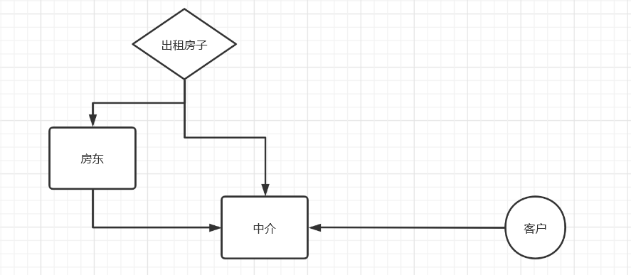
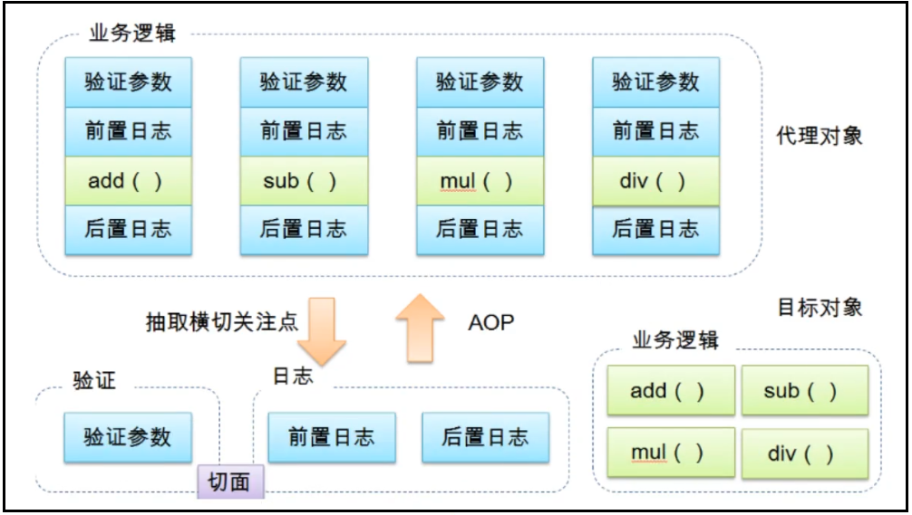
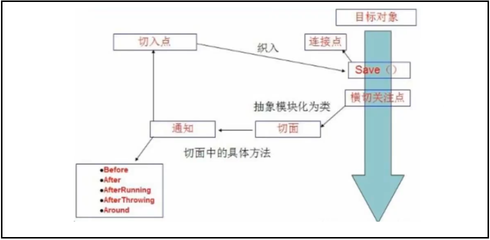
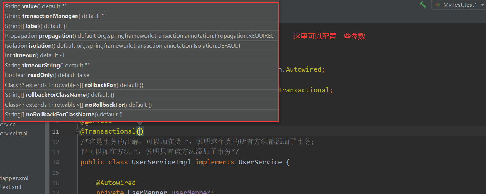
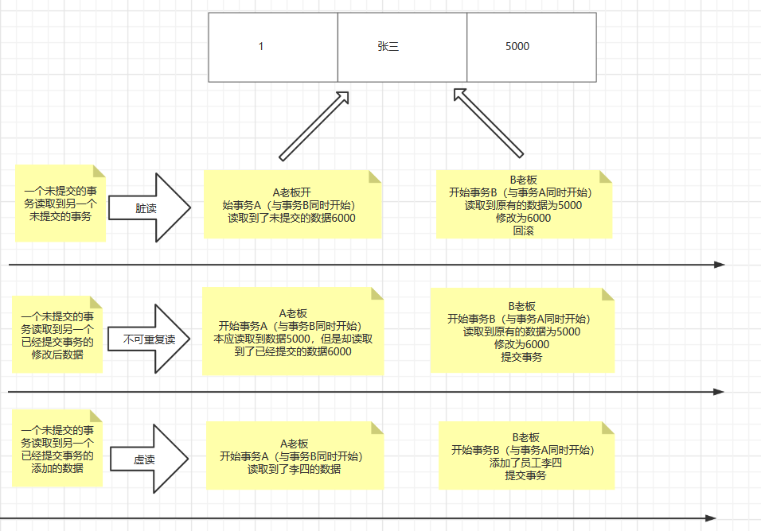

# 使用使用注解开发

## 注意

1. 在Spring4之后，要使用注解开发，必须要保证aop的包已经导入

   

2. 使用注解需要导入context约束，增加注解的支持

## 搭建环境并测试

### 配置文件

```xml
<?xml version="1.0" encoding="UTF-8"?>
<beans xmlns="http://www.springframework.org/schema/beans"
       xmlns:xsi="http://www.w3.org/2001/XMLSchema-instance"
       xmlns:context="http://www.springframework.org/schema/context"
       xsi:schemaLocation="http://www.springframework.org/schema/beans
       http://www.springframework.org/schema/beans/spring-beans.xsd
       http://www.springframework.org/schema/context
       http://www.springframework.org/schema/context/spring-context.xsd">

    <!--开启注解支持-->
    <!--<context:annotation-config/>-->
    <!--开启注解扫描:指定要扫描的包，这个包下的注解就会生效 -->
    <context:component-scan base-package="com.bao.pojo" />

</beans>
```

```
<context:annotation-config/>和<context:component-scan/>
	<context:annotation-config/>：可以开启注解支持，主要的目的是使用@Autowired注解
	<context:component-scan/>除了具有<context:annotation-config/>的功能之外，<context:component-scan/>还可以在指定的package下扫描以及注册javabean 。还具有自动将带有@component,@service,@Repository等注解的对象注册到spring容器中的功能。因此当使用<context:component-scan/>后，就可以将<context:annotation-config/>移除。
```


### 实体类

```java
package com.bao.pojo;

import org.springframework.stereotype.Component;

/*Component:组件
* 该注解相当于配置文件中的：<bean id="user" class="com.bao.pojo.User"/>
* 说明该类被Spring容器管理了，实体类添加了该注解才能被扫描到*/
@Component
public class User {
    private String name = "陈二";

    @Override
    public String toString() {
        return "User{" +
                "name='" + name + '\'' +
                '}';
    }
}
```

### 测试类

```java
import com.bao.pojo.User;
import org.junit.Test;
import org.springframework.context.ApplicationContext;
import org.springframework.context.support.ClassPathXmlApplicationContext;

public class MyTest {
    @Test
    public void MyTest1(){
        ApplicationContext context = new ClassPathXmlApplicationContext("applicationContext.xml");
        User user = context.getBean("user", User.class);
        System.out.println(user);
    }
}
```


## 属性如何注入

实体类

```java
package com.bao.pojo;

import org.springframework.beans.factory.annotation.Value;
import org.springframework.stereotype.Component;

/*Component:组件
* 该注解相当于配置文件中的：<bean id="user" class="com.bao.pojo.User"/>
* 说明该类被Spring容器管理了*/
@Component
public class User {

    @Value("孙七")/*简单的属性使用注解更加方便*/
    private String name;

    @Override
    public String toString() {
        return "User{" +
                "name='" + name + '\'' +
                '}';
    }
}
```

## 衍生的注解

> @Component有几个衍生的注解，我们在web开发中，会按照mvc三层架构分层

1. mapper [ @Repository]
2. service[@Service]
3. controller [@Controller]
4. 注：这四个注解功能是一样的，都是代表将某个类注册到Spring容器中 

## 作用域

```java
package com.bao.pojo;

import org.springframework.beans.factory.annotation.Value;
import org.springframework.context.annotation.Scope;
import org.springframework.stereotype.Component;

/*Component:组件
* 该注解相当于配置文件中的：<bean id="user" class="com.bao.pojo.User"/>
* 说明该类被Spring容器管理了*/
@Component
@Scope("prototype")/*值可以设置相应的作用域*/
public class User {

    @Value("孙七")/*简单的属性使用注解更加方便*/
    private String name;

    @Override
    public String toString() {
        return "User{" +
                "name='" + name + '\'' +
                '}';
    }
}
```

## 小结

### xml和注解

1. xml更加万能，适用于任何场合，维护简单方便
2. 注解维护相对复杂

### xml与注解的最佳实践

1. xml用来管理bean
2. 注解只负责完成属性的注入
3. 我们在使用过程中，只需要注意一个问题：必须让注解生效，所以一定要开启注解支持

# 使用java的方式配置bean

## 思路

1. 完全不使用Spring的xml 配置，全权交给Java来做！
2. JavaConfig 是Spring的一个子项目 
3. JavaConfig 原来是 Spring 的一个子项目，它通过 Java 类的方式提供 Bean 的定义信息，在 Spring4 的版本， JavaConfig 已正式成为 Spring4 的核心功能 。

## 搭建环境测试

### 实体类

```java
package com.bao.pojo;

import org.springframework.beans.factory.annotation.Value;

public class User {
    @Value("刘一")
    private String name;

    @Override
    public String toString() {
        return "User{" +
                "name='" + name + '\'' +
                '}';
    }
}
```

### 新建一个config配置包，编写一个UserConfig配置类

```java
package com.bao.config;

import com.bao.pojo.User;
import org.springframework.context.annotation.Bean;
import org.springframework.context.annotation.Configuration;

@Configuration/*该注解说明该类是一个配置类*/
public class UserConfig {
	/*当有多个bean时，都需要在这里进行注册*/
    /*使用该注解相当于在配置文件中写了一个<bean>标签
    * 方法名相当于bean标签中的id属性
    * 方法的返回值相当于bean标签中的class属性*/
    @Bean
    @Scope("prototype")
    public User getUser(){
        return new User();/*返回要注入到bean的对象*/
    }
}

```

### 测试

```java
import com.bao.config.UserConfig;
import com.bao.pojo.User;
import org.junit.Test;
import org.springframework.context.ApplicationContext;
import org.springframework.context.annotation.AnnotationConfigApplicationContext;

public class MyTest {
    @Test
    public void Test1(){
        ApplicationContext context = new AnnotationConfigApplicationContext(UserConfig.class);
        User user = (User) context.getBean("getUser");
        System.out.println(user);
    }
}

```

## 导入其他配置类

> 再编写一个配置类，将上一个配置类导入

```java
package com.bao.config;

import org.springframework.context.annotation.ComponentScan;
import org.springframework.context.annotation.Configuration;
import org.springframework.context.annotation.Import;

@Configuration/*该注解说明该类是一个配置类*/
@Import(UserConfig.class)/*可以使用该注解导入其他的配置类*/
@ComponentScan("com.bao.pojo")/*可以使用该注解设置扫描的包*/
public class AllConfig {

}

```


# 代理模式

## 理解

> 代理模式就是给一个对象提供一种代理对象，以控制对该对象的访问。在这个模式中，我们通过创建代理对象作为“替身”替代了原有对象，从而达到我们控制对象访问的目的
>
> 通俗来讲，代理=代替处理，是由另一个对象来代替原来对象来处理某些逻辑
>
> 例如：送外卖、跑腿业务、房产中介

> 代理模式的重要性：代理模式是SpringAOP 的底层

> 代理模式的分类：静态代理、动态代理

> 代理模式的作用：在不修改原对象代码的基础上，对原对象的功能进行修改或者增强

## 静态代理

### 角色分析

> 抽象角色： 一般使用接口或者是抽象类来解决
>
> 真实角色：被代理的角色
>
> 代理角色：代理真实角色，一般还有一些附加操作
>
> 客户： 访问代理对象的人。


### 搭建环境、进行测试讲解

#### 图解



#### 功能接口

```java
package com.bao.demo1;

/*出租的接口*/
public interface Rent {
    void rents();
}

```

#### 真实角色

```java
package com.bao.demo1;

/*房东*/
public class Host implements Rent{
    public void rents() {
        System.out.println("房东出租房子");
    }
}

```

#### 代理角色

```java
package com.bao.demo1;

/*代理角色也有出租的功能*/
public class Proxy implements Rent {

    //但是代理角色需要代理房东的房子才能出租
    private Host host;

    public Proxy(Host host) {
        this.host = host;
    }

    public void rents() {
        host.rents();
        lookHost();
        contract();
        fee();
    }

    //看房
    public void lookHost(){
        System.out.println("中介带你看房");
    }

    //签合同
    public void contract(){
        System.out.println("中介带你签合同");
    }

    //收中介费
    public void fee(){
        System.out.println("中介收中介费");
    }
}

```

#### 客户端访问代理角色

```java
package com.bao.demo1;

import org.junit.Test;

public class TestRent {
    @Test
    public void test1(){
        Host host = new Host();
        host.rents();
    }

    @Test
    public void test2(){
        Proxy proxy = new Proxy(new Host());
        proxy.rents();
    }

}
```

### 代理模式的优点

> 可以使真实角色的操作更加纯粹，不用去关注一些公共业务
>
> 公共业务交给代理对象，实现了业务的分工
>
> 公共业务发生扩展的时候，方便集中管理

### 代理模式的缺点 

> 一个真实角色就会产生一个代理角色： 代码量会翻倍

## 深入静态代理

### 接口

```java
package com.bao.demo2;

public interface UserService {
    void add();
    void delete();
    void update();
    void query();
}
```

### 真实对象

```java
package com.bao.demo2;

//真实对象
public class UserServiceImpl implements UserService {
    @Override
    public void add() {
        System.out.println("增");
    }

    @Override
    public void delete() {
        System.out.println("删");
    }

    @Override
    public void update() {
        System.out.println("改");
    }

    @Override
    public void query() {
        System.out.println("查");
    }
}
```

### 代理对象

```java
package com.bao.demo2;

public class UserServiceProxy implements UserService {

    private UserServiceImpl userService;

    public UserServiceImpl getUserService() {
        return userService;
    }

    public void setUserService(UserServiceImpl userService) {
        this.userService = userService;
    }

    @Override
    public void add() {
       userService.add();
        log();
    }

    @Override
    public void delete() {
        userService.delete();
        log();
    }

    @Override
    public void update() {
        userService.update();
        log();
    }

    @Override
    public void query() {
        userService.query();
        log();
    }

    public void log(){
        System.out.println("日志信息");
    }
}
```

### 测试

```java
package com.bao.demo2;

import org.junit.Test;

public class TestUserService {
    @Test
    public void test1(){
        UserServiceImpl userService = new UserServiceImpl();
        UserServiceProxy userServiceProxy = new UserServiceProxy();
        userServiceProxy.setUserService(userService);
        userServiceProxy.add();
    }
}
```

### 注意

> 当我们已经实现了一些功能，在不改变原有代码的情况下，实现了对原有功能的增强，这是AOP的核心思想


## 动态代理

> 动态代理的角色和静态代理的一样 
>
> 动态代理的代理类是动态生成的 . 静态代理的代理类是我们提前写好的
>
> 动态代理分为两类 : 一类是基于接口动态代理 , 一类是基于类的动态代理
>
> > 基于接口的动态代理----JDK原生的动态代理（现在学习的）
> >
> > 基于类的动态代理--cglib
> >

> JDK的动态代理需要了解两个类
>
> > Proxy：生成动态代理这个实例
> >
> > InvocationHandler：调用处理程序并返回结果

### 代码实现 

#### 抽象接口

```java
package com.bao.demo3;

/*出租的接口*/
public interface Rent {
    void rents();
}
```

#### 真实角色

```java
package com.bao.demo3;

/*房东*/
public class Host implements Rent {
    public void rents() {
        System.out.println("房东出租房子");
    }
}
```

#### 代理类

```java
package com.bao.demo3;

import java.lang.reflect.InvocationHandler;
import java.lang.reflect.Method;
import java.lang.reflect.Proxy;

/*自定义一个代理类，需要实现InvocationHandler接口*/
public class ProxyInvocationHandler implements InvocationHandler {
    /*被代理类代理的接口(出租房子的接口)*/
    private Rent rent;

    /*注入接口*/
    public void setRent(Rent rent) {
        this.rent = rent;
    }

    /*生成得到代理类
    * 参数一：传入一个ClassLoader
    * 参数二：传入接口的接口数组 Class<?>[] interfaces = rent.getClass().getInterfaces();
    * 参数三：传入一个InvocationHandler
    * 下面这个方法基本是固定的，可以先使用，然后慢慢理解*/
    public Object getProxy(){
        return Proxy.newProxyInstance(this.getClass().getClassLoader(),rent.getClass().getInterfaces(),this);
    }

/*    *//*重写该方法，处理代理实例，返回结果*//*
    @Override
    public Object invoke(Object proxy, Method method, Object[] args) throws Throwable {
        //动态代理的本质就是使用反射机制
        Object invoke = method.invoke(rent, args);
        return invoke;
    }*/

    /*重写该方法，处理代理实例，返回结果*/
    @Override
    public Object invoke(Object proxy, Method method, Object[] args) throws Throwable {
        lookHost();
        contract();
        Object invoke = method.invoke(rent, args);
        fee();
        return invoke;
    }

    //看房
    public void lookHost(){
        System.out.println("中介带你看房");
    }

    //签合同
    public void contract(){
        System.out.println("中介带你签合同");
    }

    //收中介费
    public void fee(){
        System.out.println("中介收中介费");
    }

}

```

#### 测试类

```java
package com.bao.demo3;

import org.junit.Test;

public class TestRent {

    @Test
    public void test1(){
        //创建得到真实角色
        Host host = new Host();

        //得到可以生成代理类的类
        ProxyInvocationHandler pih = new ProxyInvocationHandler();

        //传入需要生成的代理对象的真实角色
        pih.setRent(host);

        //得到代理对象，可以强转为rent类型，因为得到的类是Rent的实现类
        Rent proxy = (Rent) pih.getProxy();

        //测试
        proxy.rents();
    }
}
```

> 理解：
>
> 一个动态代理 , 一般代理某一类业务 
>
>  一个动态代理可以代理多个类，只要实现了同一个接口即可
>
> 动态代理可以理解为是代理类


### 深化理解

> 我们可以尝试编写一个通用的动态代理实现的类，所有的代理对象设置为Object即可
>

#### 抽象接口

```java
package com.bao.demo4;

public interface UserService {
    public void add();
    public void delete();
    public void update();
    public void query();
}

```

#### 真实角色

```java
package com.bao.demo4;

public class UserServiceImpl implements UserService {
    public void add() {
        System.out.println("增");
    }

    public void delete() {
        System.out.println("删");
    }

    public void update() {
        System.out.println("改");
    }

    public void query() {
        System.out.println("查");
    }
}

```

#### 代理类

```java
package com.bao.demo4;

import java.lang.reflect.InvocationHandler;
import java.lang.reflect.Method;
import java.lang.reflect.Proxy;

/*自定义一个代理类，需要实现InvocationHandler接口*/
public class ProxyInvocationHandler implements InvocationHandler {
    /*被代理类代理的接口(出租房子的接口)*/
    private Object object;

    /*注入接口*/
    public void setRent(Object object) {
        this.object = object;
    }

    /*生成得到代理类
    * 参数一：传入一个ClassLoader
    * 参数二：传入接口的接口数组 Class<?>[] interfaces = rent.getClass().getInterfaces();
    * 参数三：传入一个InvocationHandler
    * 下面这个方法基本是固定的，可以先使用，然后慢慢理解*/
    public Object getProxy(){
        return Proxy.newProxyInstance(this.getClass().getClassLoader(),object.getClass().getInterfaces(),this);
    }

    /*重写该方法，处理代理实例，返回结果*/
/*    @Override
    public Object invoke(Object proxy, Method method, Object[] args) throws Throwable {
        Object invoke = method.invoke(object, args);
        return invoke;
    }*/

    @Override
    public Object invoke(Object proxy, Method method, Object[] args) throws Throwable {
        log(method.getName());
        Object invoke = method.invoke(object, args);
        return invoke;
    }

    public void log(String methodName){
        System.out.println("执行了"+methodName+"方法");
    }
}
```

#### 测试类

```java
package com.bao.demo4;

import org.junit.Test;

public class TestRent {

    @Test
    public void test1(){
        //创建得到真实角色
        UserServiceImpl userServiceImpl = new UserServiceImpl();

        //得到可以生成代理类的类
        ProxyInvocationHandler pih = new ProxyInvocationHandler();

        //传入需要生成的代理对象的真实角色
        pih.setRent(userServiceImpl);

        //得到代理对象，可以强转为rent类型，因为得到的类是Rent的实现类
        UserService proxy = (UserService) pih.getProxy();

        //测试
        proxy.delete();

    }
}
```

### 动态代理的好处

> 可以使得我们的真实角色更加纯粹 . 不再去关注一些公共的事情 .
>
> 公共的业务由代理来完成 . 实现了业务的分工 ,
>
> 公共业务发生扩展时变得更加集中和方便 .
>
> 一个动态代理 , 一般代理某一类业务
>
> 一个动态代理可以代理多个类，代理的是接口！


# AOP

## 什么是AOP

1.  AOP 翻译过来就是面向切面编程
2.  AOP是维护的一种技术，底层使用的是动态代理，是Spring框架中一个重要内容
3.  作用：利用AOP 可以使业务逻辑之间的耦合度降低，提高程序的可重用性，同时提高开发的效率

> 理解：在原有的业务逻辑中添加验证参数、前置日志、后置日志等功能，并且要求不能改变原有的代码




## AOP在Spring中的作用

> 作用：提供声明式事务，允许用户自定义切面

> 名词了解：
>
> > 横切关注点：跨越应用程序多个模块的方法或功能。即是，与我们业务逻辑无关的，但是我们需要关注的部分，就是横切关注点。如日志 , 安全 , 缓存 , 事务等等 ....(就是你要横切进去的内容)
>>
> > 切面（ASPECT）：横切关注点被模块化 的特殊对象。(就是需要横切进去的内容的类)
>>
> > 通知（Advice）：切面必须要完成的工作。(就是类中的方法)
>>
> > 目标（Target）：被通知对象。(就是插入的位置的对象)
>>
> > 代理（Proxy）：向目标对象应用通知之后创建的对象。(代理对象)
>>
> > 切入点（PointCut）：切面通知执行的 “地点”的定义。(就是插入的位置，比如某个方法)
>>
> > 连接点（JointPoint）：与切入点匹配的执行点。(切入点和连接点基本是一个意思)




> SpringAOP中，通过Advice定义横切逻辑，Spring中支持5种类型的Advice
>
> 前置增强：org.springframework.aop.BeforeAdvice代表前置增强，因为Spring只支持方法级的增强，故MethodBeforeAdvice是目前可实现的前置增强，**表示在目标方法执行前实施增强**，而BeforeAdvice是为了将来版本扩展需要而定义的；
> 后置增强：org.springframework.aop.AfterReturningAdvice代表后增强，**表示在目标方法执行后实施增强**；
> 环绕增强：org.aopalliance.intercept.MethodInterceptor代表环绕增强，**表示在目标方法执行前后实施增强**；(了解)
> 异常抛出增强：org.springframework.aop.ThrowsAdvice代表抛出异常增强，**表示在目标方法抛出异常后实施增强**；(了解)
> 引介增强：org.springframework.aop.InteoductionInterceptor代表引介增强，**表示在目标类中添加一些新的方法和属性**；(了解)


## execution切入点表达式

```
1.切入点表达式的作用：知道对哪个类里面的哪个方法进行增强
2.语法结构：
	execution([权限修饰符] [返回类型] [类的全路径][方法名](参数列表) [异常模式])
	除了返回类型、方法名和参数外，其它项都是可选的。
	* 代表所有
3.练习：
	(1)对com.bao.dao.UserDao类里面的add方法进行增强
		execution(* com.bao.dao.UserDao.add(..))
		修饰符类型省略，返回类型为任意类型，com.bao.dao.UserDao类的add方法，(..)表示参数
    (2)对com.bao.dao.UserDao类里面的所有的方法进行增强
    	execution(* com.bao.dao.UserDao.*(..))
    (3)对com.bao.dao包下的所有类里面的所有的方法进行增强
    	execution(* com.bao.dao.*.*(..))
```


## 使用Spring实现AOP

### pom文件中导包

```xml
<!--导入aop核心包-->
<dependency>
    <groupId>org.aspectj</groupId>
    <artifactId>aspectjweaver</artifactId>
    <version>1.9.4</version>
</dependency>
<dependency>
    <groupId>org.springframework</groupId>
    <artifactId>spring-aop</artifactId>
    <version>5.3.3</version>
    <scope>compile</scope>
</dependency>
```

### 方式一：使用Spring的api接口

#### 创建接口

```java
package com.bao.service;

import org.springframework.stereotype.Component;

@Component
public interface UserService {
    void add();
    void delete();
    void update();
    void query();
}

```

#### 创建实现类

```java
package com.bao.service;

import org.springframework.stereotype.Component;

@Component
public class UserServiceImpl implements UserService {
    public void add() {
        System.out.println("增");
    }

    public void delete() {
        System.out.println("删");
    }

    public void update() {
        System.out.println("改");
    }

    public void query() {
        System.out.println("查");
    }
}

```

#### 创建日志类

```java
package com.bao.log;

import org.springframework.aop.MethodBeforeAdvice;
import org.springframework.stereotype.Component;

import java.lang.reflect.Method;

/*创建前置增强的日志类，需要实现*/
@Component
public class BeforeLog implements MethodBeforeAdvice {
    /* method:要执行的目标对象的方法
     * objects:参数
     * o：目标对象
     */

    public void before(Method method, Object[] objects, Object o) throws Throwable {
        System.out.println("执行前置增强");
        System.out.println("被执行的类是："+o.getClass().getName());
        System.out.println("被执行的方法是："+method.getName());
    }
}

```

```java
package com.bao.log;

import org.springframework.aop.AfterReturningAdvice;
import org.springframework.stereotype.Component;
import java.lang.reflect.Method;
@Component
public class AfterLog implements AfterReturningAdvice {
    /* o：返回值
     * method:要执行的目标对象的方法
     * objects:参数
     * o1: 目标对象
     */
    public void afterReturning(Object o, Method method, Object[] objects, Object o1) throws Throwable {
        System.out.println("执行后增强");
        System.out.println("执行的方法是："+method.getName());
        System.out.println("返回结果是："+o);

    }
}
```

#### 创建配置文件

```xml
<?xml version="1.0" encoding="UTF-8"?>
<beans xmlns="http://www.springframework.org/schema/beans"
       xmlns:xsi="http://www.w3.org/2001/XMLSchema-instance"
       xmlns:context="http://www.springframework.org/schema/context"
       xmlns:aop="http://www.springframework.org/schema/aop"
       xsi:schemaLocation="http://www.springframework.org/schema/beans
       http://www.springframework.org/schema/beans/spring-beans.xsd
       http://www.springframework.org/schema/context
       https://www.springframework.org/schema/context/spring-context.xsd
       http://www.springframework.org/schema/aop
       https://www.springframework.org/schema/aop/spring-aop.xsd">

    <!--设置扫描包-->
    <context:component-scan base-package="com.bao"/>
<!--
//  配置bean
    <bean id="userServiceImpl" class="com.bao.service.UserServiceImpl"/>
    <bean id="beforeLog" class="com.bao.log.BeforeLog"/>
    <bean id="afterLog" class="com.bao.log.AfterLog"/>-->

    <!--配置aop：导入aop的约束-->
    <aop:config>
        <!--
            设置切入点，这里需要了解execution表达式
        -->
        <aop:pointcut id="pointcut" expression="execution(* com.bao.service.UserServiceImpl.*(..))"/>
        <!--执行环绕增强-->
        <!--将log类切入到id为pointcut的切入点-->
        <aop:advisor advice-ref="beforeLog" pointcut-ref="pointcut"/>
        <!--将afterLog类切入到id为pointcut的切入点-->
        <aop:advisor advice-ref="afterLog" pointcut-ref="pointcut"/>
    </aop:config>
</beans>
```

#### 测试类

```java
package com.bao.service;

import org.junit.Test;
import org.springframework.context.support.ClassPathXmlApplicationContext;

public class TestUser {
    @Test
    public void test1(){
        ClassPathXmlApplicationContext context = new ClassPathXmlApplicationContext("applicationContext.xml");
        UserService userService = context.getBean("userServiceImpl", UserService.class);
        userService.add();
    }
}

```

### 方式二：自定义类实现aop

#### 创建自定义类

```java
package com.bao.diy;

import org.springframework.stereotype.Component;

@Component
public class DiyPointCut {
    public void before(){
        System.out.println("方法执行前");
    }

    public void after(){
        System.out.println("方法执行后");
    }
}

```

#### 修改配置文件

```xml
<?xml version="1.0" encoding="UTF-8"?>
<beans xmlns="http://www.springframework.org/schema/beans"
       xmlns:xsi="http://www.w3.org/2001/XMLSchema-instance"
       xmlns:context="http://www.springframework.org/schema/context"
       xmlns:aop="http://www.springframework.org/schema/aop"
       xsi:schemaLocation="http://www.springframework.org/schema/beans
       http://www.springframework.org/schema/beans/spring-beans.xsd
       http://www.springframework.org/schema/context
       https://www.springframework.org/schema/context/spring-context.xsd
       http://www.springframework.org/schema/aop
       https://www.springframework.org/schema/aop/spring-aop.xsd">

    <!--设置扫描包-->
    <context:component-scan base-package="com.bao"/>

    <!--方式二：自定义类-->
    <!--aspect:切面
        pointcut:切点
        expression:表达
    -->
    <aop:config>
        <!--自定义切面，ref是要引用的类-->
        <aop:aspect ref="diyPointCut">
            <!--设置切入点-->
            <aop:pointcut id="point" expression="execution(* com.bao.service.UserServiceImpl.*(..))"/>
            <!--通知-->
            <!--确定在切入点执行哪一个方法-->
            <aop:before method="before" pointcut-ref="point"/>
            <aop:after method="after" pointcut-ref="point"/>
        </aop:aspect>
    </aop:config>
</beans>
```

#### 测试类

```java
import com.bao.service.UserService;
import com.bao.service.UserServiceImpl;
import org.junit.Test;
import org.springframework.context.ApplicationContext;
import org.springframework.context.support.ClassPathXmlApplicationContext;

public class MyTest {
    @Test
    public void test2(){
        ClassPathXmlApplicationContext context = new ClassPathXmlApplicationContext("applicationContext.xml");
        UserService userService = context.getBean("userServiceImpl", UserService.class);
        userService.add();
    }
}
```

### 方式三：注解实现aop

#### 创建切入点类

```java
package com.bao.diy;

/*方式三：使用注解实现aop*/

import org.aspectj.lang.annotation.After;
import org.aspectj.lang.annotation.Aspect;
import org.aspectj.lang.annotation.Before;

@Aspect//标注这个类是一个切面
public class AnnotationPointCut {
    /*切入点之前执行的方法*/
    @Before("execution(* com.bao..*.*(..))")
    public void before(){
        System.out.println("方法前");
    }
    /*切入点之后执行的方法*/
    @After("execution(* com.bao..*.*(..))")
    public void after(){
        System.out.println("方法后");
    }

}
```

#### 修改配置类

```xml
<?xml version="1.0" encoding="UTF-8"?>
<beans xmlns="http://www.springframework.org/schema/beans"
       xmlns:xsi="http://www.w3.org/2001/XMLSchema-instance"
       xmlns:aop="http://www.springframework.org/schema/aop"
       xsi:schemaLocation="http://www.springframework.org/schema/beans
       http://www.springframework.org/schema/beans/spring-beans.xsd
       http://www.springframework.org/schema/aop
       https://www.springframework.org/schema/aop/spring-aop.xsd">

    <!--注册bean-->
    <bean id="userService" class="com.bao.service.UserServiceImpl"/>
    <bean id="log" class="com.bao.log.Log"/>
    <bean id="afterLog" class="com.bao.log.AfterLog"/>

    <!--开启注解支持-->
    <!--使用aop的注解，需要手动开启aop的注解支持-->
    <aop:aspectj-autoproxy/>
    <!--注入bean-->
    <bean id="annotationPointCut" class="com.bao.diy.AnnotationPointCut"/>

</beans>
```

#### 测试类

```java
import com.bao.service.UserService;
import com.bao.service.UserServiceImpl;
import org.junit.Test;
import org.springframework.context.ApplicationContext;
import org.springframework.context.support.ClassPathXmlApplicationContext;

public class MyTest {
    @Test
    public void test1(){
        ApplicationContext context = new ClassPathXmlApplicationContext("applicationContext.xml");
        UserService userService = (UserService) context.getBean("userService");
        userService.add();
    }
}
```


# Mybatis回顾

## 导入依赖

```xml
<dependencies>
    <dependency>
        <groupId>org.mybatis</groupId>
        <artifactId>mybatis</artifactId>
        <version>3.5.2</version>
    </dependency>
    <dependency>
        <groupId>mysql</groupId>
        <artifactId>mysql-connector-java</artifactId>
        <version>5.1.47</version>
    </dependency>
    <dependency>
        <groupId>junit</groupId>
        <artifactId>junit</artifactId>
        <version>4.12</version>
        <scope>test</scope>
    </dependency>
    <dependency>
        <groupId>org.projectlombok</groupId>
        <artifactId>lombok</artifactId>
        <version>1.18.12</version>
        <scope>provided</scope>
    </dependency>
    <dependency>
        <groupId>log4j</groupId>
        <artifactId>log4j</artifactId>
        <version>1.2.17</version>
    </dependency>
</dependencies>
<build>
    <!--解决maven静态资源过滤的问题-->
    <resources>
        <resource>
            <directory>src/main/java</directory>
            <includes>
                <include>**/*.properties</include>
                <include>**/*.xml</include>
            </includes>
            <filtering>false</filtering>
        </resource>
        <resource>
            <directory>src/main/resources</directory>
            <includes>
                <include>**/*.properties</include>
                <include>**/*.xml</include>
            </includes>
            <filtering>false</filtering>
        </resource>
    </resources>
    <plugins>
        <!-- 设置jdk的版本-->
        <plugin>
            <groupId>org.apache.maven.plugins</groupId>
            <artifactId>maven-compiler-plugin</artifactId>
            <configuration>
                <source>1.8</source>
                <target>1.8</target>
                <encoding>UTF-8</encoding>
            </configuration>
        </plugin>
    </plugins>
</build>
```

## 编写实体类

```java
package com.bao.pojo;

import lombok.AllArgsConstructor;
import lombok.Data;
import lombok.NoArgsConstructor;

@Data
@AllArgsConstructor
@NoArgsConstructor
public class User {
    private Integer id;
    private String name;
    private String pwd;

}
```

## 编写接口

```java
package com.bao.dao;

import com.bao.pojo.User;

import java.util.List;

public interface UserMapper {
    List<User> selectAllUser();
}
```

## 编写接口对应的xml文件

```xml
<?xml version="1.0" encoding="UTF-8" ?>
<!DOCTYPE mapper
        PUBLIC "-//mybatis.org//DTD Config 3.0//EN"
        "http://mybatis.org/dtd/mybatis-3-mapper.dtd">
<mapper namespace="com.bao.dao.UserMapper">

    <!--查询所有-->
    <select id="selectAllUser" resultType="user">
        select * from user
    </select>

</mapper>
```

## 编写mybatis-config.xml文件

```xml
<?xml version="1.0" encoding="UTF-8" ?>
<!DOCTYPE configuration
        PUBLIC "-//mybatis.org//DTD Config 3.0//EN"
        "http://mybatis.org/dtd/mybatis-3-config.dtd">
<configuration>

    <!--导入bataBase.properties-->
    <properties resource="dataBase.properties"/>
    <!--设置日志-->
    <settings>
        <setting name="logImpl" value="Log4j"/>
    </settings>
    <!--开启别名-->
    <typeAliases>
        <package name="com.bao.pojo"/>
    </typeAliases>
    <!--连接数据库-->
    <environments default="development">
        <environment id="development">
            <transactionManager type="JDBC"/>
            <dataSource type="POOLED">
                <property name="driver" value="${driver}"/>
                <property name="url" value="${url}"/>
                <property name="username" value="${username}"/>
                <property name="password" value="${password}"/>
            </dataSource>
        </environment>
    </environments>
    <mappers>
        <mapper resource="com/bao/dao/UserMapper.xml"/>
    </mappers>
</configuration>
```

## 编写database.properties文件

```properties
driver=com.mysql.jdbc.Driver
url=jdbc:mysql://localhost:3306/mybatis?useSSL=true&useUnicode=true&characterEncoding=utf8
username=root
password=root
```

## 编写log4j.properties文件

```properties
#将等级为DEBUG的日志信息输出到console和file这两个目的地，console和file的定义在下面的代码
log4j.rootLogger=DEBUG,console,file

#控制台输出的相关设置
#使用log4j作为日志实现
log4j.appender.console = org.apache.log4j.ConsoleAppender
log4j.appender.console.Target = System.out
log4j.appender.console.Threshold=DEBUG
log4j.appender.console.layout = org.apache.log4j.PatternLayout
#日志格式
log4j.appender.console.layout.ConversionPattern=[%c]-%m%n

#文件输出的相关设置
log4j.appender.file = org.apache.log4j.RollingFileAppender
#文件输出的位置
log4j.appender.file.File=./log/bao.log
#文件最大为10mb
log4j.appender.file.MaxFileSize=10mb
log4j.appender.file.Threshold=DEBUG
log4j.appender.file.layout=org.apache.log4j.PatternLayout
log4j.appender.file.layout.ConversionPattern=[%p][%d{yy-MM-dd}][%c]%m%n

#日志输出级别
log4j.logger.org.mybatis=DEBUG
log4j.logger.java.sql=DEBUG
log4j.logger.java.sql.Statement=DEBUG
log4j.logger.java.sql.ResultSet=DEBUG
log4j.logger.java.sql.PreparedStatement=DEBUG
```

## 编写测试类

```java
package com.bao;

import com.bao.dao.UserMapper;
import com.bao.pojo.User;
import org.apache.ibatis.io.Resources;
import org.apache.ibatis.session.SqlSession;
import org.apache.ibatis.session.SqlSessionFactory;
import org.apache.ibatis.session.SqlSessionFactoryBuilder;
import org.junit.Test;
import java.io.IOException;
import java.io.InputStream;
import java.util.List;

public class MyTest {
    @Test
    public void test1() throws IOException {
        /*获取sqlSession*/
        InputStream resourceAsStream = Resources.getResourceAsStream("mybatis-config.xml");
        SqlSessionFactory sqlSessionFactory = new SqlSessionFactoryBuilder().build(resourceAsStream);
        /*设置自动提交事务*/
        SqlSession sqlSession = sqlSessionFactory.openSession(true);

        UserMapper mapper = sqlSession.getMapper(UserMapper.class);
        List<User> users = mapper.selectAllUser();
        for (User user : users) {
            System.out.println(user);
        }
    }
}
```

# Spring与Mybatis整合(一)

## 导入依赖

```xml
<dependencies>
    <dependency>
        <groupId>org.mybatis</groupId>
        <artifactId>mybatis</artifactId>
        <version>3.5.2</version>
    </dependency>
    <dependency>
        <groupId>mysql</groupId>
        <artifactId>mysql-connector-java</artifactId>
        <version>5.1.47</version>
    </dependency>
    <dependency>
        <groupId>junit</groupId>
        <artifactId>junit</artifactId>
        <version>4.12</version>
        <scope>test</scope>
    </dependency>
    <dependency>
        <groupId>org.projectlombok</groupId>
        <artifactId>lombok</artifactId>
        <version>1.18.12</version>
        <scope>provided</scope>
    </dependency>
    <dependency>
        <groupId>log4j</groupId>
        <artifactId>log4j</artifactId>
        <version>1.2.17</version>
    </dependency>
    
    <dependency>
        <groupId>org.springframework</groupId>
        <artifactId>spring-webmvc</artifactId>
        <version>5.2.0.RELEASE</version>
    </dependency>

    <!--mybatis和spring的整合jar包-->
    <dependency>
        <groupId>org.mybatis</groupId>
        <artifactId>mybatis-spring</artifactId>
        <version>2.0.6</version>
    </dependency>

    <!--导入aop核心包-->
    <dependency>
        <groupId>org.aspectj</groupId>
        <artifactId>aspectjweaver</artifactId>
        <version>1.9.4</version>
    </dependency>

    <!--spring连接数据库的包-->
    <dependency>
        <groupId>org.springframework</groupId>
        <artifactId>spring-jdbc</artifactId>
        <version>5.3.4</version>
    </dependency>
</dependencies>
<build>
    <!--解决maven静态资源过滤的问题-->
    <resources>
        <resource>
            <directory>src/main/java</directory>
            <includes>
                <include>**/*.properties</include>
                <include>**/*.xml</include>
            </includes>
            <filtering>false</filtering>
        </resource>
        <resource>
            <directory>src/main/resources</directory>
            <includes>
                <include>**/*.properties</include>
                <include>**/*.xml</include>
            </includes>
            <filtering>false</filtering>
        </resource>
    </resources>
    <plugins>
        <!-- 设置jdk的版本-->
        <plugin>
            <groupId>org.apache.maven.plugins</groupId>
            <artifactId>maven-compiler-plugin</artifactId>
            <configuration>
                <source>1.8</source>
                <target>1.8</target>
                <encoding>UTF-8</encoding>
            </configuration>
        </plugin>
    </plugins>
</build>
```

## 实体类

```java
package com.bao.pojo;

import lombok.AllArgsConstructor;
import lombok.Data;
import lombok.NoArgsConstructor;

@Data
@AllArgsConstructor
@NoArgsConstructor
public class User {
    private Integer id;
    private String name;
    private String pwd;

}

```

## 接口

```java
package com.bao.dao;

import com.bao.pojo.User;
import org.mybatis.spring.SqlSessionTemplate;
import java.util.List;

public interface UserMapper {
    
    List<User> selectAllUser();
}

```

## 映射文件

```xml
<?xml version="1.0" encoding="UTF-8" ?>
<!DOCTYPE mapper
        PUBLIC "-//mybatis.org//DTD Config 3.0//EN"
        "http://mybatis.org/dtd/mybatis-3-mapper.dtd">
<mapper namespace="com.bao.dao.UserMapper">

    <!--查询所有-->
    <select id="selectAllUser" resultType="user">
        select * from user
    </select>

</mapper>
```

## 编写mybatis-config.xml

```xml
<?xml version="1.0" encoding="UTF-8" ?>
<!DOCTYPE configuration
        PUBLIC "-//mybatis.org//DTD Config 3.0//EN"
        "http://mybatis.org/dtd/mybatis-3-config.dtd">
<configuration>

    <!--设置日志-->
    <settings>
        <setting name="logImpl" value="Log4j"/>
    </settings>
    <!--开启别名-->
    <typeAliases>
        <package name="com.bao.pojo"/>
    </typeAliases>
    <!--绑定映射文件-->
    <mappers>
        <mapper resource="com/bao/dao/UserMapper.xml"/>
    </mappers>
    
    
</configuration>
```

## 编写spring-dao.xml

```xml
<?xml version="1.0" encoding="UTF-8"?>
<beans xmlns="http://www.springframework.org/schema/beans"
       xmlns:xsi="http://www.w3.org/2001/XMLSchema-instance"
       xmlns:context="http://www.springframework.org/schema/context"
       xsi:schemaLocation="http://www.springframework.org/schema/beans
       http://www.springframework.org/schema/beans/spring-beans.xsd 
       http://www.springframework.org/schema/context 
       https://www.springframework.org/schema/context/spring-context.xsd">

    <!--DataSource-->
    <!--id:配置名称
        class：确定要使用哪个数据源,我们这里使用Spring提供的jdbc，需要导入spring-jdbc的jar包
                常用数据源有：c3p0 druid dbcp Spring提供的jdbc-->
    <bean id="dataSource" class="org.springframework.jdbc.datasource.DriverManagerDataSource">
        <property name="driverClassName" value="com.mysql.jdbc.Driver"/>
        <property name="url" value="jdbc:mysql://localhost:3306/mybatis?useSSL=true&amp;useUnicode=true&amp;characterEncoding=utf8"/>
        <property name="username" value="root"/>
        <property name="password" value="root"/>
    </bean>

    <!--SqlSessionFactory-->
    <bean id="sqlSessionFactory" class="org.mybatis.spring.SqlSessionFactoryBean">
        <property name="dataSource" ref="dataSource" />
        <!--绑定mybatis-config.xml文件-->
        <property name="configLocation" value="classpath:mybatis-config.xml"/>
    </bean>

    <!--注册sqlSessionTemplate , 关联sqlSessionFactory，其实这就是我们使用的sqlSession-->
    <bean id="sqlSession" class="org.mybatis.spring.SqlSessionTemplate">
        <!--只能利用构造器注入，因为没有set方法-->
        <constructor-arg index="0" ref="sqlSessionFactory" />
    </bean>

    <bean id="userMapperImpl" class="com.bao.dao.UserMapperImpl">
        <property name="sqlSession" ref="sqlSession"/>
    </bean>

</beans>
```

## SqlSessionTemplate


## 编写applicationContext.xml

```xml
<?xml version="1.0" encoding="UTF-8"?>
<beans xmlns="http://www.springframework.org/schema/beans"
       xmlns:xsi="http://www.w3.org/2001/XMLSchema-instance"
       xsi:schemaLocation="http://www.springframework.org/schema/beans 
       http://www.springframework.org/schema/beans/spring-beans.xsd">
    
    <import resource="spring-dao.xml"/>

</beans>
```

## 编写UserMapperImpl

```java
package com.bao.dao;

import com.bao.pojo.User;
import org.mybatis.spring.SqlSessionTemplate;
import org.springframework.beans.factory.annotation.Autowired;
import org.springframework.stereotype.Component;
import java.util.List;

public class UserMapperImpl implements UserMapper {

    //sqlSession不用我们自己创建了，Spring来管理
    //在原来我们所有的操作都使用sqlSession来执行,现在都使用SqlSessionTemplate
    private SqlSessionTemplate sqlSession;

    public void setSqlSession(SqlSessionTemplate sqlSession) {
        this.sqlSession = sqlSession;
    }

    @Override
    public List<User> selectAllUser() {
        UserMapper mapper = sqlSession.getMapper(UserMapper.class);
        return mapper.selectAllUser();
    }
}

```

## 编写测试类

```java
package com.bao;

import com.bao.dao.UserMapper;
import com.bao.pojo.User;
import org.apache.ibatis.io.Resources;
import org.apache.ibatis.session.SqlSession;
import org.apache.ibatis.session.SqlSessionFactory;
import org.apache.ibatis.session.SqlSessionFactoryBuilder;
import org.junit.Test;
import org.mybatis.spring.SqlSessionTemplate;
import org.springframework.context.support.ClassPathXmlApplicationContext;
import java.io.IOException;
import java.io.InputStream;
import java.util.List;

public class MyTest {

    @Test
    public void test2(){
        ClassPathXmlApplicationContext context = new ClassPathXmlApplicationContext("applicationContext.xml");
        UserMapper userMapper = context.getBean("userMapperImpl", UserMapper.class);
        List<User> users = userMapper.selectAllUser();
        for (User user : users) {
            System.out.println(user);
        }
    }

}

```

# Spring与Mybatis整合(二)

## 修改spring-dao.xml

```xml
<?xml version="1.0" encoding="UTF-8"?>
<beans xmlns="http://www.springframework.org/schema/beans"
       xmlns:xsi="http://www.w3.org/2001/XMLSchema-instance"
       xmlns:context="http://www.springframework.org/schema/context"
       xsi:schemaLocation="http://www.springframework.org/schema/beans
       http://www.springframework.org/schema/beans/spring-beans.xsd http://www.springframework.org/schema/context https://www.springframework.org/schema/context/spring-context.xsd">

    <!--DataSource-->
    <!--id:配置名称
        class：确定要使用哪个数据源,我们这里使用Spring提供的jdbc，需要导入spring-jdbc的jar包
                常用数据源有：c3p0 druid dbcp Spring提供的jdbc-->
    <bean id="dataSource" class="org.springframework.jdbc.datasource.DriverManagerDataSource">
        <property name="driverClassName" value="com.mysql.jdbc.Driver"/>
        <property name="url" value="jdbc:mysql://localhost:3306/mybatis?useSSL=true&amp;useUnicode=true&amp;characterEncoding=utf8"/>
        <property name="username" value="root"/>
        <property name="password" value="root"/>
    </bean>

    <!--SqlSessionFactory-->
    <bean id="sqlSessionFactory" class="org.mybatis.spring.SqlSessionFactoryBean">
        <property name="dataSource" ref="dataSource" />
        <!--绑定mybatis-config.xml文件-->
        <property name="configLocation" value="classpath:mybatis-config.xml"/>
    </bean>

    <!--方式二：-->
    <!--配置(MapperScannerConfigurer)的bean，可以将创建的所有映射器都自动注入到sqlSessionFactory实例中 -->
    <bean class="org.mybatis.spring.mapper.MapperScannerConfigurer">
        <!-- 注入sqlSessionFactory，需要指定sqlSessionFactory -->
        <property name="sqlSessionFactoryBeanName" value="sqlSessionFactory"/>
        <!-- 给出需要扫描的Dao接口包 -->
        <property name="basePackage" value="com.bao.dao"/>
    </bean>

</beans>
```


## 编写测试类

```java
package com.bao;

import com.bao.dao.UserMapper;
import com.bao.pojo.User;
import org.apache.ibatis.io.Resources;
import org.apache.ibatis.session.SqlSession;
import org.apache.ibatis.session.SqlSessionFactory;
import org.apache.ibatis.session.SqlSessionFactoryBuilder;
import org.junit.Test;
import org.mybatis.spring.SqlSessionTemplate;
import org.springframework.context.support.ClassPathXmlApplicationContext;
import java.io.IOException;
import java.io.InputStream;
import java.util.List;

public class MyTest {

    @Test
    public void test3(){
        ClassPathXmlApplicationContext context = new ClassPathXmlApplicationContext("applicationContext.xml");
        UserMapper userMapper = context.getBean("userMapper", UserMapper.class);
        
        List<User> users = userMapper.selectAllUser();
        for (User user : users) {
            System.out.println(user);
        }
    }

}

```


# 事务

## 事务理解

> 事务就是将多个业务组合操作，要么全部成功，要么全部失败，比如银行转账
>
> 事务的底层使用了AOP原理

## ACID原则

### 原子性（atomicity)

> 一个事务要么全部提交成功，要么全部失败回滚，不能只执行其中的一部分操作

### 一致性（consistency)

> 事务的执行不能破坏数据库数据的完整性和一致性，一个事务在执行之前和执行之后，数据库都必须处于一致性状态。如果数据库系统在运行过程中发生故障，有些事务尚未完成就被迫中断，这些未完成的事务对数据库所作的修改有一部分已写入物理数据库，这时数据库就处于一种不正确的状态，也就是不一致的状态
>
> 换句话说就是银行转账的时候数据的总量是不变的

### 隔离性（isolation）

> 事务的隔离性是指在并发环境中，并发时的事务是相互隔离的。一个事务的执行不能不被其他事务干扰。不同的事务并发操作相同的数据时，每个事务都有各自完成的数据空间，即一个事务内部的操作及使用的数据对其他并发事务是隔离的，并发执行的各个事务之间不能相互干扰。在标准SQL规范中，定义了4个事务隔离级别，不同的隔离级别对事务的处理不同，分别是：未授权读取，授权读取，可重复读取和串行化

### 持久性（durability）

> 一旦事务提交，那么它对数据库中的对应数据的状态的变更就会永久保存到数据库中。--即使发生系统崩溃或机器宕机等故障，只要数据库能够重新启动，那么一定能够将其恢复到事务成功结束的状态

## 事务分类

> 编程式事务：需要构建相当多的代码，不常用

> 声明式事务：开发中较常用

## 声明式事务(注解方式)

### 事务管理器

> spring提供了一个接口PlatformTransactionManager，代表了事务管理器，这个接口针对不同的框架提供了不同的实现类
>
> 声明式事务的底层使用AOP原理


### 提供数据

```sql
CREATE TABLE `user2`  (
  `id` int(11) NOT NULL AUTO_INCREMENT,
  `name` varchar(255) CHARACTER SET utf8 COLLATE utf8_general_ci NULL DEFAULT NULL,
  `money` int(11) NULL DEFAULT NULL,
  PRIMARY KEY (`id`) USING BTREE
)

INSERT INTO `user2` VALUES (1, '张三', 1000);
INSERT INTO `user2` VALUES (2, '李四', 1000);
```

### 依赖

```xml
<dependencies>
    <dependency>
        <groupId>org.mybatis</groupId>
        <artifactId>mybatis</artifactId>
        <version>3.5.2</version>
    </dependency>
    <dependency>
        <groupId>mysql</groupId>
        <artifactId>mysql-connector-java</artifactId>
        <version>5.1.47</version>
    </dependency>
    <dependency>
        <groupId>junit</groupId>
        <artifactId>junit</artifactId>
        <version>4.12</version>
        <scope>test</scope>
    </dependency>
    <dependency>
        <groupId>org.projectlombok</groupId>
        <artifactId>lombok</artifactId>
        <version>1.18.12</version>
        <scope>provided</scope>
    </dependency>
    <dependency>
        <groupId>log4j</groupId>
        <artifactId>log4j</artifactId>
        <version>1.2.17</version>
    </dependency>

    <!--mybatis和spring的整合jar包-->
    <dependency>
        <groupId>org.mybatis</groupId>
        <artifactId>mybatis-spring</artifactId>
        <version>2.0.6</version>
    </dependency>
    <dependency>
        <groupId>org.springframework</groupId>
        <artifactId>spring-webmvc</artifactId>
        <version>5.2.0.RELEASE</version>
    </dependency>
    <!--导入aop核心包-->
    <dependency>
        <groupId>org.aspectj</groupId>
        <artifactId>aspectjweaver</artifactId>
        <version>1.9.4</version>
    </dependency>
    <dependency>
        <groupId>org.springframework</groupId>
        <artifactId>spring-aop</artifactId>
        <version>5.3.3</version>
        <scope>compile</scope>
    </dependency>
    <!--spring连接数据库的包-->
    <dependency>
        <groupId>org.springframework</groupId>
        <artifactId>spring-jdbc</artifactId>
        <version>5.3.4</version>
    </dependency>
</dependencies>
<build>
    <!--解决maven静态资源过滤的问题-->
    <resources>
        <resource>
            <directory>src/main/java</directory>
            <includes>
                <include>**/*.properties</include>
                <include>**/*.xml</include>
            </includes>
            <filtering>false</filtering>
        </resource>
        <resource>
            <directory>src/main/resources</directory>
            <includes>
                <include>**/*.properties</include>
                <include>**/*.xml</include>
            </includes>
            <filtering>false</filtering>
        </resource>
    </resources>
    <plugins>
        <!-- 设置jdk的版本-->
        <plugin>
            <groupId>org.apache.maven.plugins</groupId>
            <artifactId>maven-compiler-plugin</artifactId>
            <configuration>
                <source>1.8</source>
                <target>1.8</target>
                <encoding>UTF-8</encoding>
            </configuration>
        </plugin>
    </plugins>
</build>
```

### log4j.properties

```properties
#将等级为DEBUG的日志信息输出到console和file这两个目的地，console和file的定义在下面的代码
log4j.rootLogger=DEBUG,console,file

#控制台输出的相关设置
#使用log4j作为日志实现
log4j.appender.console = org.apache.log4j.ConsoleAppender
log4j.appender.console.Target = System.out
log4j.appender.console.Threshold=DEBUG
log4j.appender.console.layout = org.apache.log4j.PatternLayout
#日志格式
log4j.appender.console.layout.ConversionPattern=[%c]-%m%n

#文件输出的相关设置
log4j.appender.file = org.apache.log4j.RollingFileAppender
#文件输出的位置
log4j.appender.file.File=./log/bao.log
#文件最大为10mb
log4j.appender.file.MaxFileSize=10mb
log4j.appender.file.Threshold=DEBUG
log4j.appender.file.layout=org.apache.log4j.PatternLayout
log4j.appender.file.layout.ConversionPattern=[%p][%d{yy-MM-dd}][%c]%m%n

#日志输出级别
log4j.logger.org.mybatis=DEBUG
log4j.logger.java.sql=DEBUG
log4j.logger.java.sql.Statement=DEBUG
log4j.logger.java.sql.ResultSet=DEBUG
log4j.logger.java.sql.PreparedStatement=DEBUG
```

### User

```java
package com.bao.pojo;

import lombok.AllArgsConstructor;
import lombok.Data;
import lombok.NoArgsConstructor;
import org.springframework.stereotype.Component;

@Data
@AllArgsConstructor
@NoArgsConstructor
@Component
public class User {
    private Integer id;
    private String name;
    private Integer money;

}

```

### UserMapper

```java
package com.bao.dao;

import com.bao.pojo.User;
import org.apache.ibatis.annotations.Param;
import java.util.List;

public interface UserMapper {

    int addMoney(@Param("id") int id,@Param("money") int money);
    
    int deleteMoney(@Param("id") int id,@Param("money") int money);

}

```

### UserMapper.xml

```xml
<?xml version="1.0" encoding="UTF-8" ?>
<!DOCTYPE mapper
        PUBLIC "-//mybatis.org//DTD Config 3.0//EN"
        "http://mybatis.org/dtd/mybatis-3-mapper.dtd">
<mapper namespace="com.bao.dao.UserMapper">

    <update id="addMoney" parameterType="int">
        update user2 set money = money+#{money} where id = #{id}
    </update>

    <update id="deleteMoney" parameterType="int">
        update user set money = money-#{money} where id = #{id}
    </update>

</mapper>
```

### UserService

```java
package com.bao.service;

import com.bao.pojo.User;
import org.apache.ibatis.annotations.Param;
import java.util.List;

public interface UserService {

    void turnMoney();
}
```

### UserServiceImpl

```java
package com.bao.service;

import com.bao.dao.UserMapper;
import com.bao.pojo.User;
import org.springframework.beans.factory.annotation.Autowired;
import org.springframework.stereotype.Service;
import org.springframework.transaction.annotation.Transactional;
import java.util.List;

@Service
@Transactional
/*这是事务的注解，可以加在类上，说明这个类的所有方法都被事务管理；
也可以加在方法上，说明只有该方法被事务管理*/
public class UserServiceImpl implements UserService {

    @Autowired
    private UserMapper userMapper;

    @Override
    public void turnMoney() {
        //张三少100
        userMapper.deleteMoney(1,200);
        
//        int a = 1/0;
        
        //李四多100
        userMapper.addMoney(2,200);
    }
}
```

### applicationContext.xml

```xml
<?xml version="1.0" encoding="UTF-8"?>
<beans xmlns="http://www.springframework.org/schema/beans"
       xmlns:xsi="http://www.w3.org/2001/XMLSchema-instance"
       xmlns:context="http://www.springframework.org/schema/context"
       xsi:schemaLocation="http://www.springframework.org/schema/beans
       http://www.springframework.org/schema/beans/spring-beans.xsd
       http://www.springframework.org/schema/context
       https://www.springframework.org/schema/context/spring-context.xsd">
    
    <import resource="spring-dao.xml"/>

    <context:component-scan base-package="com.bao"/>

</beans>
```

### mybatis-config.xml

```xml
<?xml version="1.0" encoding="UTF-8" ?>
<!DOCTYPE configuration
        PUBLIC "-//mybatis.org//DTD Config 3.0//EN"
        "http://mybatis.org/dtd/mybatis-3-config.dtd">
<configuration>

    <!--设置日志-->
    <settings>
        <setting name="logImpl" value="Log4j"/>
    </settings>
    <!--开启别名-->
    <typeAliases>
        <package name="com.bao.pojo"/>
    </typeAliases>
    <!--绑定映射文件-->
    <mappers>
        <mapper resource="com/bao/dao/UserMapper.xml"/>
    </mappers>

</configuration>
```

### spring-mybatis.xml

```xml
<?xml version="1.0" encoding="UTF-8"?>
<beans xmlns="http://www.springframework.org/schema/beans"
       xmlns:xsi="http://www.w3.org/2001/XMLSchema-instance"
       xmlns:tx="http://www.springframework.org/schema/tx"
       xsi:schemaLocation="http://www.springframework.org/schema/beans
       http://www.springframework.org/schema/beans/spring-beans.xsd
       http://www.springframework.org/schema/tx
       http://www.springframework.org/schema/tx/spring-tx.xsd">

    <!--配置数据源-->
    <bean id="dataSource" class="org.springframework.jdbc.datasource.DriverManagerDataSource">
        <property name="driverClassName" value="com.mysql.jdbc.Driver"/>
        <property name="url" value="jdbc:mysql://localhost:3306/ssm?useSSL=true&amp;useUnicode=true&amp;characterEncoding=utf8"/>
        <property name="username" value="root"/>
        <property name="password" value="root"/>
    </bean>

    <!--SqlSessionFactory-->
    <bean id="sqlSessionFactory" class="org.mybatis.spring.SqlSessionFactoryBean">
        <property name="dataSource" ref="dataSource" />
        <!--绑定mybatis-config.xml文件-->
        <property name="configLocation" value="classpath:mybatis-config.xml"/>
    </bean>

    <!--配置(MapperScannerConfigurer)的bean，可以将创建的所有映射器都自动注入到sqlSessionFactory实例中 -->
    <bean class="org.mybatis.spring.mapper.MapperScannerConfigurer">
        <!-- 注入sqlSessionFactory，需要指定sqlSessionFactory -->
        <property name="sqlSessionFactoryBeanName" value="sqlSessionFactory"/>
        <!-- 给出需要扫描的Dao接口包 -->
        <property name="basePackage" value="com.bao.dao"/>
    </bean>

    <!--事务管理-->
    <!--1.创建事务管理器-->
    <bean id="transactionManager" class="org.springframework.jdbc.datasource.DataSourceTransactionManager">
        <!--配置数据源-->
        <constructor-arg ref="dataSource" />
    </bean>
    <!--2.开启事务注解，需要导入tx命名空间-->
    <!--transaction-manager="transactionManager" : 绑定事务管理器-->
    <tx:annotation-driven transaction-manager="transactionManager"/>
</beans>
```

### 测试类

```java
@Test
public void test1(){
    ClassPathXmlApplicationContext context = new ClassPathXmlApplicationContext("applicationContext.xml");
    UserService userServiceImpl = context.getBean("userServiceImpl", UserService.class);
    userServiceImpl.turnMoney();

}
```

## 事务的操作



### propagation：事务的传播行为

> 概念：多事务方法之间进行调用，这个过程中事务是如何进行管理的
>
> 事务方法：对数据库的数据进行变化的方法，就好比增删改方法

```java
@Transactional//add方法有事务
public void add(){
    //调用update方法
    update();
}

//update没事务
public void update(){

}
```

Spring框架事务传播行为有7种，重点了解REQUIRED和REQUIRED_NEW

- REQUIRED：如果add方法本身有事务，调用update方法之后，update使用当前add方法的事务；

  ​					  如果add方法本身没有事务，调用update方法之后，创建新事物

  ​					（REQUIRED也是默认的传播行为）

```java
@Transactional(propagation = Propagation.REQUIRED)
```

- REQUIRED_NEW：使用add方法调用update方法，add方法无论是否有事务，都创建新的事务

```java
@Transactional(propagation = Propagation.REQUIRES_NEW)
```


### isolation：事务的隔离级别

> 事务具有隔离性，多事务之间不会产生影响，事务之间一旦产生影响会出现3大问题：脏读、不可重复读、虚读（幻读）



通过设置事务的隔离级别来解决读的问题


```java
@Transactional(propagation = Propagation.REQUIRES_NEW,isolation = Isolation.REPEATABLE_READ)
//多个参数用逗号隔开
//可重复读是mysql的默认隔离级别
```

### timeout：超时时间

> 事务需要在一定时间内进行提交，如果未提交则进行回滚
>
> 以秒为单位
>
> 默认值为-1：表示没有超时时间

```java
@Transactional(timeout = 10)
```

### readOnly：是否只读

> 读：指的是查询的操作	写：指的是增删改操作
>
> readOnly默认值是false，表示可以增删改查
>
> 设置值为true，表示只可以查，不可以增删改

```java
@Transactional(readOnly = true)
```

### rollbackfor：回滚

> 设置出现哪些异常需要回滚

```java
@Transactional(rollbackFor = NullPointerException.class)
```

### noRollbackFor：不回滚

> 设置出现哪些异常不需要回滚

```
@Transactional(noRollbackFor = NullPointerException.class)
```


## 声明式事务(xml方式)

### 注释@Transactional注解

### 修改spring-mybatis.xml

```xml
<?xml version="1.0" encoding="UTF-8"?>
<beans xmlns="http://www.springframework.org/schema/beans"
       xmlns:xsi="http://www.w3.org/2001/XMLSchema-instance"
       xmlns:context="http://www.springframework.org/schema/context"
       xmlns:aop="http://www.springframework.org/schema/aop"
       xmlns:tx="http://www.springframework.org/schema/tx"
       xsi:schemaLocation="http://www.springframework.org/schema/beans
       http://www.springframework.org/schema/beans/spring-beans.xsd
       http://www.springframework.org/schema/context
       https://www.springframework.org/schema/context/spring-context.xsd
       http://www.springframework.org/schema/aop
       https://www.springframework.org/schema/aop/spring-aop.xsd
       http://www.springframework.org/schema/tx
       http://www.springframework.org/schema/tx/spring-tx.xsd">

    <!--配置数据源-->
    <bean id="dataSource" class="org.springframework.jdbc.datasource.DriverManagerDataSource">
        <property name="driverClassName" value="com.mysql.jdbc.Driver"/>
        <property name="url" value="jdbc:mysql://localhost:3306/ssm?useSSL=true&amp;useUnicode=true&amp;characterEncoding=utf8"/>
        <property name="username" value="root"/>
        <property name="password" value="root"/>
    </bean>

    <!--SqlSessionFactory-->
    <bean id="sqlSessionFactory" class="org.mybatis.spring.SqlSessionFactoryBean">
        <property name="dataSource" ref="dataSource" />
        <!--绑定mybatis-config.xml文件-->
        <property name="configLocation" value="classpath:mybatis-config.xml"/>
    </bean>

     <!--配置(MapperScannerConfigurer)的bean，可以将创建的所有映射器都自动注入到sqlSessionFactory实例中 -->
    <bean class="org.mybatis.spring.mapper.MapperScannerConfigurer">
        <!-- 注入sqlSessionFactory，需要指定sqlSessionFactory -->
        <property name="sqlSessionFactoryBeanName" value="sqlSessionFactory"/>
        <!-- 给出需要扫描的Dao接口包 -->
        <property name="basePackage" value="com.bao.dao"/>
    </bean>

    <!--1.创建事务管理器-->
    <bean id="transactionManager" class="org.springframework.jdbc.datasource.DataSourceTransactionManager">
        <!--注入数据源-->
        <constructor-arg ref="dataSource" />
    </bean>

    <!--2.配置通知-->
    <tx:advice id="txAdvice">
        <!--配置事务的参数-->
        <tx:attributes>
            <!--指定哪种方法上面添加事务，name需要指定方法名-->
            <!--<tx:method name="turnMoney" propagation="REQUIRED"/>-->
            <tx:method name="*" propagation="REQUIRED"/><!--所有方法都添加事务-->
        </tx:attributes>
    </tx:advice>

    <!--3.配置切入点和切面-->
    <aop:config>
        <!--配置切入点，id可以随意起名-->
        <aop:pointcut id="pointcut" expression="execution(* com.bao.service.UserServiceImpl.*(..))"/>
        <!--配置切面，需要写明通知和切入点-->
        <aop:advisor advice-ref="txAdvice" pointcut-ref="pointcut"/>
    </aop:config>

```

